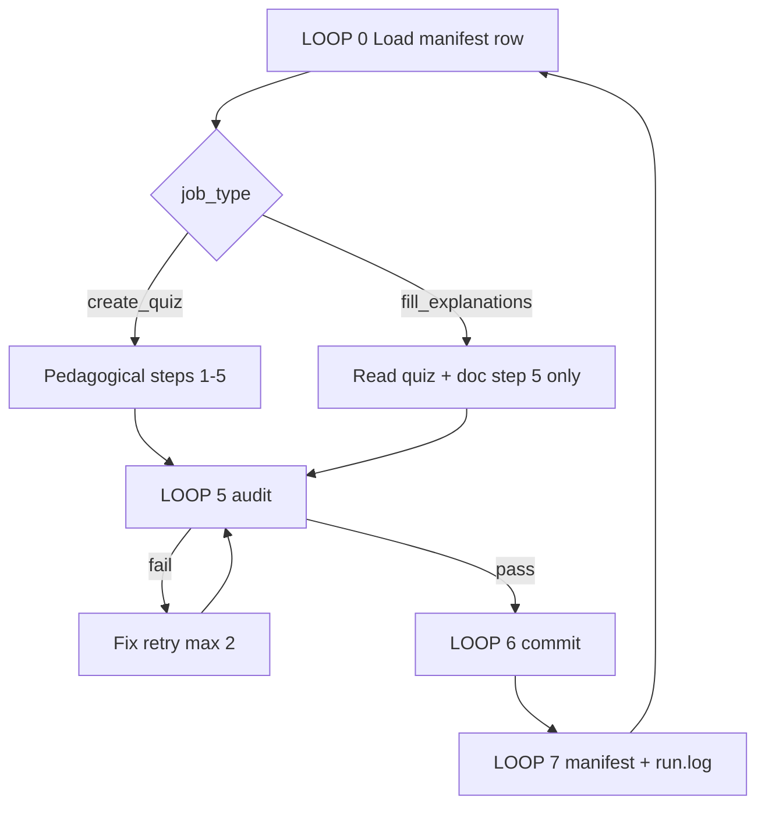

# Architecture — loops + pedagogical pipeline

**Read [lesson-planning](../.cursor/skills/lesson-planning/SKILL.md) first** for pedagogy and the seven insights. This file explains *machine loops* and the claim-mapping pipeline — not a copy-paste template.

---

## System shape

```text
                    ┌─────────────────────────────────────┐
                    │  quiz-factory/ (operator root)      │
                    │  CLAUDE.md DESIGN.md REFERENCES.md  │
                    └─────────────────┬───────────────────┘
                                      │
                    manifest.json     │     phases/NN-phase/BATCH.md
                    (queue)           │     (phase reading hints)
                                      ▼
              ┌───────────────────────────────────────────────┐
              │  For each lesson path (read-only inputs):      │
              │    docs/en.md  code/  outputs/  neighbor quiz   │
              │  Write-only:    quiz.json                      │
              └───────────────────────────────────────────────┘
                                      │
                                      ▼
              scripts/audit_lessons.py (Tier A, optional Tier B)
                                      │
                                      ▼
              git commit (one lesson dir) → manifest row done
```

One Claude Code invocation walks the queue like `process_manifest()` — not a chat session.

---

## Pedagogical pipeline (flagship method)

This is how the seven reference lessons were produced. Each step uses **only** that lesson’s assets.

### Step 1 — Inventory inputs (read-only)

```text
inputs(lesson_path) → {
  meta:     frontmatter (Type, Prerequisites, Time, Objectives)
  problem:  "The Problem" section
  concept:  "The Concept" + tables + equations
  build:    "Build It" / "Use It" + code/main.*
  catalog:  README title (for quiz.title consistency)
}
```

### Step 2 — Extract claim list C

A **claim** is a single testable sentence the doc asserts, e.g.:

- “SWA reduces attention entries from O(N²) to O(N·W).”
- “Acceptance uses min(1, q/p).”
- “VAR predicts the next scale grid, not one pixel.”

Rules:

- 6–12 claims from objectives + concept + build (see DESIGN.md §4).
- Each claim must cite a section (not model prior).
- Drop claims that appear only in footnotes or external links not summarized in doc.

### Step 3 — Assign claims to stages

| Stage | Select claim where… |
|-------|---------------------|
| pre | Best summarizes **problem** or hook tradeoff; one dependency level |
| check ×3 | Three **non-overlapping** mechanism claims from concept |
| post ×2 | Integration: asymptotics+code, or mechanism+prerequisite lesson named in doc |

Functionally: `assign(C) → {pre, c1, c2, c3, p1, p2}` with injective mapping (no claim reused).

### Step 4 — Generate question + options per slot

For claim `c`:

- **Question:** ask for the claim’s mechanism, comparison, or invariant (not “define X” only unless pre).
- **Correct option:** paraphrase `c` faithfully.
- **Distractors (3):** pick claims the doc **refutes** or common confusions from the same section/table.
- **correct:** zero-based index — **vary the slot** (see REFERENCES.md "Variance rule"). Across the six questions the key must not be constant; place the correct option in different positions, not always first.

Difficulty knob: check-stage distractors must be **same topic** (e.g. all about attention masks), not absurd unrelated domains.

### Step 5 — Write explanations

`explanation(q) := 1–3 sentences` proving why the correct option matches `c`, using doc terms (equation, function, product name). Mention why one strong distractor fails if space allows.

Tier B requires non-empty for all six.

### Step 6 — Validate alignment (human or audit)

- Map each question to objective bullet (mental checklist).
- Run `python scripts/audit_lessons.py`.
- Optional: `--strict-quiz` before phase handoff.

### Step 7 — Commit + manifest

Per CLAUDE.md — one lesson, one commit.

**Bar lessons:** seven insights in [lesson-planning](../.cursor/skills/lesson-planning/SKILL.md); JSON under `phases/…`.

---

## Extractor loops (machine control flow)



### LOOP 0 — Queue

- Open `manifest.json`.
- Next `pending` row in `phase_order` ([CONTEXT.md](CONTEXT.md)).
- Read `phases/NN-*/BATCH.md` if present.
- Read [lesson-planning](../.cursor/skills/lesson-planning/SKILL.md) when starting a new phase.

### LOOP 1 — Skeleton (`create_quiz` only)

Emit valid JSON: `lesson`, `title`, six stages in order. Titles from doc H1.

### LOOP 2–4 — Pedagogy

Execute **Pedagogical pipeline** above (not a generic template).

`fill_explanations`: skip question drafting; run step 5 for empty fields only; do not change correct index unless audit fails.

### LOOP 5 — Validate

```bash
python scripts/audit_lessons.py
# phase handoff:
python scripts/audit_lessons.py --strict-quiz
```

### LOOP 6 — Commit

`git add phases/.../quiz.json` only.

### LOOP 7 — Advance

`status` → `done` | `blocked`; append `run.log`.

---

## Folder layout

```text
quiz-factory/
  DESIGN.md              ← pointer to lesson-planning skill
  ARCHITECTURE.md        ← this file
  manifest.json
  ...

phases/NN-phase-slug/
  BATCH.md
  MM-lesson/
    docs/en.md             ← read
    code/                  ← read
    quiz.json              ← write
```

---

## Human checkpoint

After each phase slice in `phase_order`: PM reviews **one** random `done` quiz with `/lesson-planning` and [QUALITY-RUBRIC.md](QUALITY-RUBRIC.md).
