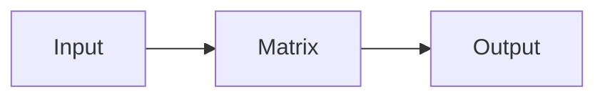

# Lesson Format Spec
<!-- Derived from: LESSON_TEMPLATE.md + phases/01-math-foundations/01-linear-algebra-intuition -->
<!-- Capture date: 2026-06-12 | Git hash: 56e1283 -->

## Lesson Folder Structure

```
NN-lesson-name/
├── code/
│   ├── main.py            (primary implementation)
│   └── main.[lang]        (Julia, TypeScript, Rust — add what fits the topic)
├── notebook/
│   └── lesson.ipynb       (optional Jupyter notebook)
├── docs/
│   └── en.md              (lesson doc — this spec applies to this file)
└── outputs/
    ├── prompt-*.md        (reusable AI prompt produced by the lesson)
    └── skill-*.md         (reusable skill produced by the lesson)
```

## docs/en.md — The Six-Beat Structure

Every lesson doc follows this sequence. Do not reorder beats. All sections are required except Sources (written at Stage 02) and Connections (optional, add when concrete cross-lesson links exist).

---

### Beat 0 — Header block

```markdown
# [Lesson Title]

> [One-line motto — the core idea that sticks. Concrete, not motivational.]

> **Platform:** This course runs in Claude Code Desktop. Exercises happen in your terminal, not the browser.

**Type:** Build | Learn
**Languages:** [list languages used — e.g. Python, Julia]
**Prerequisites:** [zone or lesson reference]
**Time:** ~[N] minutes
```

**Rules:**
- Motto is required — it must express the concept, not hype it ("Every AI model is just matrix math wearing a fancy hat" ✓ / "Master linear algebra!" ✗)
- Platform note is boilerplate — copy verbatim
- Type: `Learn` = concept-heavy, `Build` = implementation-heavy; most lessons are one of these

---

### Beat 0.5 — Learning Objectives

```markdown
## Learning Objectives

- [Verb] [specific measurable skill]
- [Verb] [specific measurable skill]
- [Verb] [specific measurable skill]
- [Verb] [specific measurable skill]
```

**Rules:**
- 3-5 objectives
- Each starts with an action verb (Implement, Explain, Determine, Connect, Build)
- Objectives must be testable — quiz questions are generated directly from these
- Do NOT use "Understand" or "Learn" — use concrete verbs

**Example (linear algebra lesson):**
```
- Implement vector and matrix operations from scratch in Python
- Explain geometrically what the dot product, projection, and Gram-Schmidt process do
- Determine linear independence, rank, and basis of a set of vectors using row reduction
- Connect linear algebra concepts to their AI applications: embeddings, attention scores, LoRA
```

---

### Beat 1 — The Problem

```markdown
## The Problem

[2-3 paragraphs. What can't the reader do without this? Show a scenario where not knowing this hurts.
Concrete and specific — name the real-world penalty.]
```

**Rules:**
- Opens with a situation the reader already recognizes ("Open any ML paper...")
- Must explain the cost of ignorance, not just the topic
- No code in this section

---

### Beat 2 — The Concept

```markdown
## The Concept

### [Sub-concept name]

[Intuition + optional diagram]

### [Sub-concept name]

[Intuition + optional diagram]
```

**Illustration pipeline:**
- Sequence / flowchart / decision tree → Mermaid diagram (write inline in the lesson doc)
- System diagram / entities / data flow → Excalidraw placeholder (generated at Stage 06)
- Abstract concept / metaphor → GLM-image placeholder (generated at Stage 06)

**Mermaid example (write inline):**
```markdown

```

**Rules:**
- Build mental model before code — no code blocks in The Concept
- Every sub-concept gets at most one illustration

---

### Beat 3 — Build It

```markdown
## Build It

> **Open your terminal — this section runs in Claude Code, not the browser.**

[Step-by-step from scratch. Start simple, add complexity. Every code block runnable on its own.]

### Step 1: [Name]

[Short explanation]

```[lang]
[runnable code]
```

### Step 2: [Name]
...
```

**Rules:**
- Must start with the terminal callout (copy verbatim)
- Code is from scratch — no library calls in early steps
- Each step must be independently runnable
- Steps named, not numbered-only (Step 3: Projection, not just Step 3)
- No comments in code (code must be self-explanatory from naming)

---

### Beat 4 — Use It

```markdown
## Use It

[Show the same thing with the standard library/framework. Compare scratch version to library version.
Proves the concept and introduces practical tools.]

```[lang]
[library version code]
```
```

**Rules:**
- Always compare to the Beat 3 from-scratch version
- Name the library/framework being introduced
- Keep it brief — Beat 3 was the teaching; Beat 4 is the handoff to practice

---

### Beat 5 — Ship It

```markdown
## Ship It

[What reusable artifact does this lesson produce?
Could be a prompt, a skill, a tool, an MCP server, or an agent pattern.
Include the artifact here and reference its file in outputs/.]
```

**Rules:**
- Every lesson ships exactly one artifact
- Artifact goes in `outputs/` and is referenced here
- Prompt format: YAML front-matter with name, description, zone, lesson fields

---

### Beat 6 — Exercises

```markdown
## Exercises

1. [Easy — reinforce the core concept directly]
2. [Medium — apply it to a different problem]
3. [Hard — extend the concept or combine with prior lessons]
```

**Rules:**
- Exactly 3 exercises minimum; up to 6 for rich topics
- No scaffolded code — exercises are open-ended tasks
- Hard exercise may reference a prior phase/lesson by name
- Exercises are part of the lesson doc (not separate files) — copy-paste flag pattern is TBD, locked in 00-d

---

### Beat 7 — Key Terms (tail block)

```markdown
## Key Terms

| Term | What people say | What it actually means |
|------|----------------|----------------------|
| [term] | [common misconception] | [precise definition] |
```

**Rules:**
- Defines terms introduced in this lesson only
- "What people say" captures the misconception, not just a synonym
- 5-10 terms per lesson

---

### Optional: Connections + Sources

```markdown
## Connections

| Concept | Where it shows up |
|---------|------------------|
| [concept] | [specific AI application / prior or future lesson] |

## Sources
<!-- GTM strand citations — written by Stage 02 during lesson injection -->
<!-- Format: [Source name](url) — [what it supports in this lesson] -->
```

- **Connections** is optional but high-value when concrete links exist to prior lessons or real systems
- **Sources** is a template comment placeholder — Stage 02 fills it, not Stage 01

---

## Zone-level lesson count (from repo)

| Zone | Dir | Lesson count |
|-------|-----|-------------|
| 00 | 00-setup-and-tooling | TBD (no lessons scanned) |
| 01 | 01-math-foundations | 22 |
| 02 | 02-ml-fundamentals | TBD |
| 03-19 | remaining zones | TBD |

**Total per variable-registry:** 498 lessons across 20 zones.
