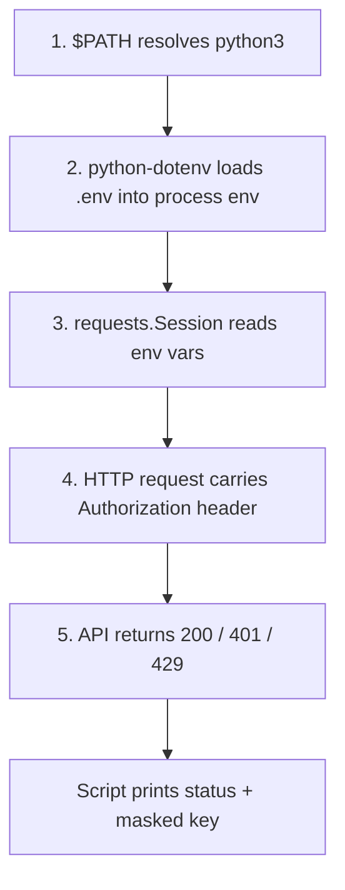

# Dev Environment

## Learning Objectives

- Configure a shell, Python runtime, and HTTP client that can make authenticated API calls end-to-end
- Trace how `$PATH` resolves executables and diagnose collisions when multiple runtimes are installed
- Isolate secrets using the dotenv pattern so API keys never enter version control
- Verify outbound HTTPS connectivity and authenticated request/response cycles against a live endpoint
- Reproduce the exact request pattern that Clay, Apollo, and SerperDev expect for GTM data pipelines

## The Problem

You are a practitioner who needs to ship pipelines, not a student setting up a playground. Every minute fighting tooling is a minute not spent on enrichment logic, waterfall routing, or outbound orchestration. The failure mode is predictable: you skip environment setup, reach lesson three, and spend forty minutes discovering that `python3` on your machine points to a Homebrew install from 2022 while `pip` points somewhere else entirely. The API key you pasted into your terminal evaporated when you closed the window. The `requests` library is not installed in the Python that your shell actually invokes.

None of these are exotic problems. They are the mundane mechanical failures that stall GTM engineers before they write a single line of enrichment code. The SerperDev API for scraping Google Maps business listings, the Clay API for waterfall enrichment, the Apollo API for contact data — every one of these is an HTTP endpoint that expects a Bearer token in a header. If you cannot reliably get a Python process to send that header, none of the downstream pipeline matters.

This lesson establishes the minimum viable environment: a shell that finds the right runtime, a mechanism for loading secrets into process memory, and an HTTP client that can prove the round-trip works. Nothing more, nothing decorative.

## The Concept

Three mechanisms, in strict dependency order. Each one fails silently if the layer below it is broken, which is why we verify bottom-up.

**Path resolution.** When you type `python3` in a terminal, your shell does not search your entire filesystem. It consults `$PATH` — a colon-delimited list of directories — and returns the first executable named `python3` it finds. If you installed Python via Homebrew, via pyenv, via uv, and via the system package manager, you may have four different `python3` binaries on disk. The one that runs is whichever directory appears first in `$PATH`. The command `which python3` tells you which one wins. This matters because packages installed via `pip` go into the site-packages of whichever Python ran the `pip` command, and if those are different interpreters, your `import requests` will fail in one and succeed in the other with no obvious explanation.

**Environment variable isolation.** When you run `export OPENAI_API_KEY=sk-...` in a terminal, that variable exists in the memory of that shell process. Any child process — a Python script, a `curl` command — inherits it. But a second terminal window does not. Close the first terminal and the variable is gone. The dotenv pattern solves this: a `.env` file holds key=value pairs, a library like `python-dotenv` reads that file at process startup and injects the pairs into the process environment, and the file itself is listed in `.gitignore` so secrets never enter version control. The variable is scoped to one process invocation, loaded from a file that persists on disk but never leaves your machine.

**HTTP as the control plane.** Every AI API and GTM tool speaks REST. The progression from `curl` to `requests` to `fetch` is not a progression in capability — they all send the same HTTP bytes over the same TLS connection. It is a progression in ergonomics: `curl` proves the endpoint responds, `requests` lets you compose headers and parse JSON in Python, and downstream orchestration tools build on that same foundation. The transport layer does not change. A Bearer token in an `Authorization` header is the same string whether you are calling OpenAI, Clay, Apollo, or SerperDev.



Tool introduction order follows the mechanism: `curl` proves the API endpoint is reachable, `python3 -c` proves the runtime executes, `.env` proves secrets load into process memory. We verify each independently before composing them.

## Build It

Three scripts, each self-contained with observable output. Run them in order. If any prints `FAIL`, stop and fix before continuing.

First, install the Python dependencies. The `requests` library handles HTTP, and `python-dotenv` handles `.env` loading.

```bash
pip install requests python-dotenv
```

### Script 1: `verify_env.sh`

This script checks that the four foundational pieces exist: a shell, a Python runtime, an HTTP client, and a `.env` file. It prints one pass/fail line per dependency.

```bash
#!/usr/bin/env bash
set -euo pipefail

echo "=== Dev Environment Check ==="

if [ -n "${SHELL:-}" ]; then
    echo "PASS  shell: $SHELL"
else
    echo "FAIL  shell: SHELL variable not set"
fi

if command -v python3 &>/dev/null; then
    PYVER=$(python3 --version 2>&1)
    PYPATH=$(command -v python3)
    echo "PASS  python3: $PYVER at $PYPATH"
else
    echo "FAIL  python3: not found on \$PATH"
fi

if command -v curl &>/dev/null; then
    CURLVER=$(curl --version 2>&1 | head -n1)
    echo "PASS  curl: $CURLVER"
else
    echo "FAIL  curl: not found on \$PATH"
fi

if [ -f ".env" ]; then
    LINECOUNT=$(grep -c '=' .env 2>/dev/null || echo "0")
    echo "PASS  .env: exists with $LINECOUNT key=value pair(s)"
else
    echo "FAIL  .env: file not found in current directory"
fi
```

Run it:

```bash
chmod +x verify_env.sh
./verify_env.sh
```

Expected output looks like:

```
=== Dev Environment Check ===
PASS  shell: /bin/zsh
PASS  python3: Python 3.12.2 at /usr/local/bin/python3
PASS  curl: curl 8.4.0 (x86_64-apple-darwin23.0) libcurl/8.4.0
PASS  .env: exists with 3 key=value pair(s)
```

### Script 2: `http_check.sh`

This script confirms outbound HTTPS works by hitting `httpbin.org/get`, which echoes back whatever you send. No API key required, no credits consumed.

```bash
#!/usr/bin/env bash
set -euo pipefail

status=$(curl -s -o /dev/null -w "%{http_code}" https://httpbin.org/get)

if [ "$status" = "200" ]; then
    echo "PASS  outbound HTTPS: $status"
else
    echo "FAIL  outbound HTTPS: got $status, expected 200"
fi

auth_test=$(curl -s -H "Authorization: Bearer test-token-123" \
    https://httpbin.org/headers | \
    grep -o '"Authorization": "Bearer test-token-123"' || echo "")

if [ -n "$auth_test" ]; then
    echo "PASS  header passthrough: server received Authorization header"
else
    echo "FAIL  header passthrough: server did not echo Authorization header"
fi
```

Run it:

```bash
chmod +x http_check.sh
./http_check.sh
```

### Script 3: `test_api_key.py`

This script loads `.env` via `python-dotenv`, sends a `GET` request to `httpbin.org/headers` with an `Authorization: Bearer` header built from your `OPENAI_API_KEY`, and prints the status code plus a masked version of the key. The `httpbin.org/headers` endpoint mirrors your headers back in the JSON response body, so you can confirm the server received exactly what you sent — without consuming any API credits.

```python
import os
import sys
import requests
from dotenv import load_dotenv

load_dotenv()

api_key = os.environ.get("OPENAI_API_KEY", "")

if not api_key:
    print("FAIL  OPENAI_API_KEY not found in .env or environment")
    print("      Create a .env file with: OPENAI_API_KEY=sk-your-key-here")
    sys.exit(1)

masked = api_key[:7] + "..." + api_key[-4:] if len(api_key) > 11 else "(too short to mask)"

session = requests.Session()
session.headers.update({
    "Authorization": f"Bearer {api_key}",
    "User-Agent": "dev-env-check/1.0"
})

try:
    response = session.get("https://httpbin.org/headers", timeout=10)
except requests.exceptions.RequestException as e:
    print(f"FAIL  request error: {e}")
    sys.exit(1)

print(f"Status: {response.status_code}")

if response.status_code == 200:
    body = response.json()
    server_saw = body.get("headers", {}).get("Authorization", "")
    if server_saw == f"Bearer {api_key}":
        print(f"PASS  key transmitted correctly (masked): {masked}")
    else:
        print(f"FAIL  server saw: '{server_saw[:20]}...' — does not match sent key")
else:
    print(f"FAIL  unexpected status code: {response.status_code}")
```

Run it:

```bash
python3 test_api_key.py
```

If you do not have an OpenAI key yet, create a `.env` with any dummy value to verify the mechanism works:

```bash
echo 'OPENAI_API_KEY=sk-test-dummy-key-for-env-verification' > .env
python3 test_api_key.py
```

The script still passes because `httpbin.org` does not validate the key — it only mirrors headers. You are testing the plumbing, not the credential.

## Use It

**GTM Redirect — Zone 01 (Data Foundation) and Zone 02 (Enrichment)**

The dev environment you just verified is the prerequisite for every GTM data pipeline. The three scripts above prove you can resolve a runtime, load a secret, and send an authenticated HTTP request. Every GTM API is the same mechanism pointed at a different URL.

Environment variable isolation feeds directly into SerperDev API calls for Google Maps business data. SerperDev requires an API key passed as a JSON payload to `https://google.serper.dev/maps`. That key lives in your `.env` file as `SERPER_API_KEY=...`, gets loaded by `python-dotenv` into the process environment, and is read by `os.environ.get("SERPER_API_KEY")` at runtime. The exact pattern from `test_api_key.py` — load `.env`, build a `requests` call, inspect the response — is the pattern you will use to pull restaurant, gym, and dentist listings at scale. LinkedIn cannot provide this data for local businesses; Google Maps scraped via SerperDev is the source [CITATION NEEDED — concept: SerperDev as Google Maps scraping tool for local business data].

HTTP as the control plane extends to every enrichment provider. Clay's API requires a Bearer token in an `Authorization` header — the identical header structure that `test_api_key.py` sends to httpbin. Apollo, Hunter, and Dropcontact all follow the same pattern: a base URL, an auth header, and a JSON payload. When you build a waterfall enrichment pipeline in a later lesson — calling providers sequentially until one returns a valid email — each step in that waterfall is one `requests.post()` call with credentials sourced from `.env`. If you cannot make one authenticated call reliably, you cannot make five in sequence.

For niche markets where structured APIs do not exist, the same HTTP plumbing applies. Industry directories like gamedevmap.com for game development studios or real estate broker aggregators serve HTML, not JSON, but the transport is the same — you send a `GET` via `requests`, parse the response, and extract structured data. The dev environment does not care whether the response is JSON or HTML. It cares that the round-trip works.

If the three demo scripts pass, you are ready for the enrichment waterfall. If any fail, stop here and fix before moving on. A pipeline built on a broken environment will fail in ways that look like API errors, rate limits, or data quality problems when the actual cause is a `$PATH` collision or a `.env` file in the wrong directory.

## Ship It

**Definition of done:** all three scripts print `PASS` on every line. No `FAIL` output. A `.env` file exists in your project root with at least one key defined. A `.gitignore` file exists and contains `.env` so secrets never enter version control.

Create the `.gitignore` now if you have not already:

```bash
echo '.env' >> .gitignore
echo '.venv/' >> .gitignore
```

**GTM Redirect — Zone 01 (Data Foundation):** This environment is the launchpad for your first SerperDev call. When you can run `test_api_key.py` and see `PASS`, you have proven the exact mechanism that SerperDev, Clay, and Apollo depend on: a secret loaded from disk, injected into a process, and transmitted as an HTTP header. The next lesson replaces `httpbin.org` with a real GTM endpoint. Do not proceed until this one is clean.

## Exercises

**Exercise 1 — Environment audit (easy).** Run `verify_env.sh`. If any line prints `FAIL`, fix the underlying issue — install the missing tool, create the missing file, or correct your `$PATH`. Paste the full output into your notes with any API keys masked. All four lines must say `PASS` before you continue.

**Exercise 2 — Secret isolation proof (medium).** Create a `.env` file with `TEST_KEY=abc123def456`. Write a Python one-liner that loads the key via `python-dotenv`, sends it as a `Bearer` token to `https://httpbin.org/headers`, and prints whether the server echoed it back. Then run the same one-liner from a different directory (without the `.env` file) and confirm it fails gracefully. This proves your secret is scoped to the file, not globally exported.

```bash
echo 'TEST_KEY=abc123def456' > .env
python3 -c "
from dotenv import load_dotenv; load_dotenv()
import os, requests
key = os.environ.get('TEST_KEY', '')
r = requests.get('https://httpbin.org/headers', headers={'Authorization': f'Bearer {key}'})
saw = r.json().get('headers', {}).get('Authorization', '')
print(f'match: {saw == f\"Bearer {key}\"}  masked: {key[:3]}...{key[-3:]}')
"
```

**Exercise 3 — Full round-trip with JSON parsing (hard).** Write a script called `gtm_smoke_test.py` that loads `SERPER_API_KEY` from `.env` (fall back to a dummy key if absent), sends a `POST` to `https://google.serper.dev/maps` with a JSON body `{"q": "coffee shops in Austin TX"}`, and prints the HTTP status code plus the first result's title and address if the response is JSON. If the key is a dummy, expect a `401` or `403` — that is still a pass for environment verification, because it proves the request left your machine, reached the API, and received a structured response. Print `"PASS  round-trip complete, status: {code}"` regardless of auth outcome, and `"FAIL"` only if a network error occurs with no response at all.

## Key Terms

- **`$PATH`** — A colon-delisted environment variable listing directories your shell searches for executables. Determines which `python3` runs when multiple are installed.
- **dotenv pattern** — A `.env` file containing `KEY=value` pairs, loaded into process memory at startup by a library like `python-dotenv`. The file is gitignored so secrets never enter version control.
- **Process environment** — The set of environment variables visible to a running process. Child processes inherit the parent's environment; sibling processes do not share it.
- **Bearer token** — An authentication scheme where a string (the token) is sent in the `Authorization` header as `Bearer <token>`. Used by OpenAI, Clay, Apollo, SerperDev, and most REST APIs.
- **`httpbin.org`** — A testing service that mirrors back the headers and body you send. Used to verify HTTP plumbing without consuming API credits.
- **Control plane** — In this context, the HTTP layer through which all API interactions flow. Whether you use `curl`, `requests`, or `fetch`, the underlying mechanism is the same HTTP/TLS transport.

## Sources

- SerperDev API for Google Maps business data scraping — [CITATION NEEDED — concept: SerperDev as Google Maps scraping tool for local business data at scale]
- Industry directories as data sources (gamedevmap.com, real estate broker aggregators) — [CITATION NEEDED — concept: niche market directory sources for GTM prospecting]
- Clay API Bearer token authentication pattern — [CITATION NEEDED — concept: Clay v3 API authentication via Authorization header]
- Apollo, Hunter, Dropcontact enrichment APIs using same auth pattern — [CITATION NEEDED — concept: enrichment provider API authentication consistency]
- `httpbin.org` — public HTTP testing service, documented at httpbin.org
- `python-dotenv` — dotenv pattern implementation for Python, documented at pypi.org/project/python-dotenv