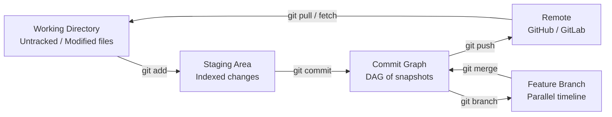

# Git & Collaboration

> Version control is not optional. Every experiment, every model, every lesson you build here gets tracked.

**Type:** Learn
**Languages:** Bash
**Prerequisites:** Phase 0, Lesson 01
**Time:** ~30 minutes

---

## Learning Objectives

1. **Initialize** a Git repository and trace file changes through the working directory, staging area, and commit graph pipeline.
2. **Create, merge, and resolve conflicts** between branches using three-way merge semantics with observable terminal output.
3. **Commit GTM configuration files** (YAML/JSON) with structured messages and recover prior versions using commit history.
4. **Configure** branch protection and pull-request workflows for a shared GTM operations repository.

---

## The Problem

You are building GTM workflows that five people touch in a given week — an analyst adjusts ICP scoring weights, a revops engineer modifies an enrichment waterfall, a campaign manager updates outbound sequence configs. Without version control, you are passing spreadsheets over Slack and praying nothing gets overwritten. The audit trail you need for pipeline data — *who changed what, when, and why* — does not exist for the workflows themselves.

Git solves this by treating every change as a first-class object with an author, a timestamp, and a human-readable message. It is the same accountability layer your CRM enforces on opportunity records, applied to the configuration files that define how your pipeline operates in the first place.

The cost of not having this is not hypothetical. Someone changes a scoring weight from 0.5 to 0.7, conversion drops 30% the next week, and nobody can trace why because the config lives in a Clay table that only shows its current state. Git gives you the diff between "what worked" and "what changed," plus the ability to revert in seconds.

---

## The Concept

Git's core mechanism is **content-addressed storage**. Every commit is a snapshot of your entire project tree at a moment in time, identified by a SHA-1 hash of its contents. Change one byte in one file and you get a completely new hash. This means any commit's identity is mathematically tied to what it contains — you cannot silently alter history without creating a new hash.

The second mechanism is **divergent histories via branches**. A branch is not a copy of your files; it is a movable pointer to a commit in a directed acyclic graph (DAG). Creating a branch costs almost nothing because Git only records the pointer, not the files. Two branches can diverge from a common ancestor, accumulate independent commits, and later converge through a **three-way merge** — Git compares the common ancestor (the merge base), your current branch, and the branch you are merging in, then applies the differences automatically. When both branches modify the same lines differently, Git cannot decide automatically and flags a **merge conflict** for you to resolve manually.

Before touching any CLI command, internalize the pipeline: files live in your **working directory**, you stage specific changes into the **staging area** (also called the index), and a commit writes the staged snapshot into the **commit graph** (the DAG). This three-stage pipeline exists so you can craft commits deliberately — stage some files, leave others unstaged, write a message that describes only what you staged.



The daily workflow compresses to three actions: `git add` (move changes from working directory to staging), `git commit` (write staging to the commit graph), `git push` (sync local commits to a remote). Branching adds a fork in the timeline — `git checkout -b experiment` creates and switches to a new branch in one step.

---

## Build It

You will initialize a repository, create a divergent branch structure, trigger a real merge conflict, resolve it, and inspect the resulting DAG. Every step prints observable output. Run this script in a terminal — it creates a temporary directory, so nothing in your actual filesystem is affected.

```bash
#!/bin/bash

WORKDIR=$(mktemp -d /tmp/gtm-git-demo.XXXXXX)
cd "$WORKDIR"
echo "Working directory: $WORKDIR"
echo ""

git init -q
git config user.name "GTM Engineer"
git config user.email "gtm@example.com"

printf 'icp_score_threshold: 0.5\ntarget_segment: mid_market\n' > scoring.yaml
git add scoring.yaml
git commit -q -m "Initial ICP scoring model"

echo "=== Commit 1: Initial state ==="
git log --oneline --graph --all
echo ""

git checkout -q -b experiment/raise-threshold
printf 'icp_score_threshold: 0.6\ntarget_segment: mid_market\n' > scoring.yaml
git add scoring.yaml
git commit -q -m "Raise ICP threshold to 0.6 for Q3 efficiency"

git checkout -q main
printf 'icp_score_threshold: 0.7\ntarget_segment: enterprise\n' > scoring.yaml
git add scoring.yaml
git commit -q -m "Pivot target segment to enterprise, raise threshold to 0.7"

echo "=== Divergent branches (two timelines) ==="
git log --oneline --graph --all
echo ""

echo "=== Attempting merge of experiment/raise-threshold into main ==="
git merge experiment/raise-threshold
echo ""

echo "=== scoring.yaml with conflict markers ==="
cat scoring.yaml
echo ""

printf 'icp_score_threshold: 0.65\ntarget_segment: enterprise\n' > scoring.yaml
git add scoring.yaml
git commit -q -m "Resolve conflict: compromise threshold at 0.65, keep enterprise segment"

echo ""
echo "=== Final commit graph (converged timelines) ==="
git log --oneline --graph --all

echo ""
echo "=== Diff between initial commit and HEAD ==="
git diff $(git rev-list --max-parents=0 HEAD) HEAD -- scoring.yaml
```

When you run this, you will see the conflict markers (`<<<<<<<`, `=======`, `>>>>>>>`) that Git inserts into `scoring.yaml` when both branches modify overlapping lines. The three-way merge found that `main` changed the threshold to 0.7 and the segment to `enterprise`, while the branch changed the threshold to 0.6 and kept the segment as `mid_market`. Because both branches modified the threshold line from the common ancestor value of 0.5, Git could not auto-resolve and deferred to you.

The final `git log --oneline --graph --all` output shows the DAG — two lines diverging from the initial commit and converging at the merge commit. That graph *is* your audit trail.

---

## Use It

Content-addressed storage — the SHA-1 hash Git computes over every commit's full tree — gives GTM configuration files the same immutable audit trail your CRM enforces on opportunity records. A scoring weight change becomes a commit with an author, a timestamp, and a justification. This applies to Zone 1 (ICP & Account Intelligence) and Zone 2 (Outbound & Enrichment): any YAML or JSON that drives a Clay waterfall, an Apollo sequence, or a HubSpot workflow belongs in a Git repo, not a Slack thread [CITATION NEEDED — concept: GTM config-as-code practice in revops teams].

The branching model maps directly to campaign experimentation. Your `main` branch holds the proven ICP model. A feature branch holds an experimental variant — different weights, different threshold. If the experiment underperforms, delete the branch and `main` is untouched. If it works, merge it. That is the three-way merge applied to business strategy.

```bash
#!/bin/bash

WORKDIR=$(mktemp -d /tmp/gtm-config.XXXXXX)
cd "$WORKDIR"

git init -q
git config user.name "GTM Engineer"
git config user.email "gtm@example.com"

printf '{\n  "weights": {"firmographic": 0.4, "intent": 0.3, "engagement": 0.3},\n  "threshold": 0.65\n}\n' > icp-model.json
git add .
git commit -q -m "ICP scoring model v1.0"

git checkout -q -b experiment/enterprise-boost
printf '{\n  "weights": {"firmographic": 0.5, "intent": 0.25, "engagement": 0.25},\n  "threshold": 0.70\n}\n' > icp-model.json
git add .
git commit -q -m "Experiment: shift to enterprise weighting, threshold 0.70"

echo "=== Diff: proven model vs experiment ==="
git diff main experiment/enterprise-boost
echo ""

git checkout -q main
echo "=== main untouched — experiment branch is disposable ==="
git log --oneline --graph --all
```

The `git diff` output is the comparison layer: you see exactly which weights changed, by how much, and who committed the change. The `git checkout -q main` proves the rollback path — one command, no reconstruction from memory, no Slack archaeology.

---

## Exercises

**Easy — Three-commit history with graph inspection:**
Initialize a repository, create a JSON file representing an ICP scoring model, and make three separate commits — one per field addition (e.g., first commit adds `weights`, second adds `threshold`, third adds `target_segment`). Run `git log --oneline --graph --all` and confirm you can see each commit hash, its message, and the linear history. Then use `git show HEAD` to inspect the most recent commit's contents.

**Medium — Branch, diff, and rollback:**
Starting from `main` with an existing scoring config (the output of the Easy exercise), create a branch called `experiment/threshold-raise`. Increase the threshold value from 0.65 to 0.80. Commit with a message stating your hypothesis (e.g., `"Experiment: raise threshold to 0.80 to filter low-intent accounts"`). Run `git diff main experiment/threshold-raise` to see exactly what changed. Switch back to `main` with `git checkout main` and confirm the original config is untouched. Finally, run `git log --oneline --graph --all` and confirm both timelines are visible — the proven model and the experiment — with no data loss on either side.

---

## Key Terms

**Content-addressed storage** — A storage model where every object is identified by a hash of its contents. Git uses SHA-1: change one byte in any file and the resulting commit hash is completely different. This makes silent history alteration detectable.

**Commit graph (DAG)** — A directed acyclic graph where each commit points to its parent(s). Branches and tags are movable pointers into this graph, not copies of files. Merging creates a commit with two parents, converging two timelines.

**Staging area (index)** — An intermediate layer between the working directory and the commit graph. You selectively stage changes with `git add` before writing them to history with `git commit`. This decouples "what I changed" from "what I commit."

**Three-way merge** — Git's merge strategy: it compares the common ancestor (merge base), the current branch tip, and the incoming branch tip. Non-overlapping changes auto-resolve. Overlapping changes on the same lines produce a merge conflict.

**Merge conflict** — When two branches modify the same lines differently, Git inserts conflict markers (`<<<<<<<`, `=======`, `>>>>>>>`) into the file and halts. Resolution is manual: you edit the file to reflect the intended final state, stage it, and commit.

**Reflog** — A local-only log of every HEAD movement (checkouts, resets, merges, rebases). Entries persist for approximately 90 days, providing a recovery path for commits that appear "lost" after a hard reset [CITATION NEEDED — concept: Git reflog default retention period].

---

## Sources

- Pro Git Book, Chapter 10: Git Internals — Git Objects (content-addressed storage, SHA-1 hashing, tree and commit object structure) — https://git-scm.com/book/en/v2/Git-Internals-Git-Objects
- Pro Git Book, Chapter 3: Git Branching — Branches in a Nutshell; Basic Branching and Merging (branch pointers, DAG, three-way merge, conflict markers) — https://git-scm.com/book/en/v2/Git-Branching-Basic-Branching-and-Merging
- Pro Git Book, Chapter 7: Git Tools — Revision Selection; Rerere (reusing recorded conflict resolution) — https://git-scm.com/book/en/v2/Git-Tools-Rerere
- [CITATION NEEDED — concept: GTM config-as-code practice in revops teams]
- [CITATION NEEDED — concept: Git reflog default retention period]