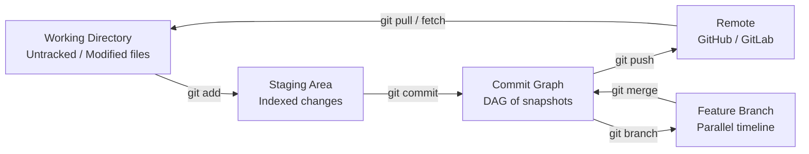

# Git & Collaboration

> Version control is not optional. Every experiment, every model, every lesson you build here gets tracked.

**Type:** Learn
**Languages:** Bash
**Prerequisites:** Phase 0, Lesson 01
**Time:** ~30 minutes

---

## Learning Objectives

1. **Initialize** a Git repository and trace file changes through the working directory, staging area, and commit graph pipeline.
2. **Create, merge, and resolve conflicts** between branches using three-way merge semantics with observable terminal output.
3. **Commit GTM configuration files** (YAML/JSON) with structured messages and recover prior versions using commit history.
4. **Configure** branch protection and pull-request workflows for a shared GTM operations repository.

---

## The Problem

You are building GTM workflows that five people touch in a given week — an analyst adjusts ICP scoring weights, a revops engineer modifies an enrichment waterfall, a campaign manager updates outbound sequence configs. Without version control, you are passing spreadsheets over Slack and praying nothing gets overwritten. The audit trail you need for pipeline data — *who changed what, when, and why* — does not exist for the workflows themselves.

Git solves this by treating every change as a first-class object with an author, a timestamp, and a human-readable message. It is the same accountability layer your CRM enforces on opportunity records, applied to the configuration files that define how your pipeline operates in the first place.

The cost of not having this is not hypothetical. Someone changes a scoring weight from 0.5 to 0.7, conversion drops 30% the next week, and nobody can trace why because the config lives in a Clay table that only shows its current state. Git gives you the diff between "what worked" and "what changed," plus the ability to revert in seconds.

---

## The Concept

Git's core mechanism is **content-addressed storage**. Every commit is a snapshot of your entire project tree at a moment in time, identified by a SHA-1 hash of its contents. Change one byte in one file and you get a completely new hash. This means any commit's identity is mathematically tied to what it contains — you cannot silently alter history without creating a new hash.

The second mechanism is **divergent histories via branches**. A branch is not a copy of your files; it is a movable pointer to a commit in a directed acyclic graph (DAG). Creating a branch costs almost nothing because Git only records the pointer, not the files. Two branches can diverge from a common ancestor, accumulate independent commits, and later converge through a **three-way merge** — Git compares the common ancestor (the merge base), your current branch, and the branch you are merging in, then applies the differences automatically. When both branches modify the same lines differently, Git cannot decide automatically and flags a **merge conflict** for you to resolve manually.

Before touching any CLI command, internalize the pipeline: files live in your **working directory**, you stage specific changes into the **staging area** (also called the index), and a commit writes the staged snapshot into the **commit graph** (the DAG). This three-stage pipeline exists so you can craft commits deliberately — stage some files, leave others unstaged, write a message that describes only what you staged.



The daily workflow compresses to three actions: `git add` (move changes from working directory to staging), `git commit` (write staging to the commit graph), `git push` (sync local commits to a remote). Branching adds a fork in the timeline — `git checkout -b experiment` creates and switches to a new branch in one step.

---

## Build It

You will initialize a repository, create a divergent branch structure, trigger a real merge conflict, resolve it, and inspect the resulting DAG. Every step prints observable output. Run this script in a terminal — it creates a temporary directory, so nothing in your actual filesystem is affected.

```bash
#!/bin/bash

WORKDIR=$(mktemp -d /tmp/gtm-git-demo.XXXXXX)
cd "$WORKDIR"
echo "Working directory: $WORKDIR"
echo ""

git init -q
git config user.name "GTM Engineer"
git config user.email "gtm@example.com"

printf 'icp_score_threshold: 0.5\ntarget_segment: mid_market\n' > scoring.yaml
git add scoring.yaml
git commit -q -m "Initial ICP scoring model"

echo "=== Commit 1: Initial state ==="
git log --oneline --graph --all
echo ""

git checkout -q -b experiment/raise-threshold
printf 'icp_score_threshold: 0.6\ntarget_segment: mid_market\n' > scoring.yaml
git add scoring.yaml
git commit -q -m "Raise ICP threshold to 0.6 for Q3 efficiency"

git checkout -q main
printf 'icp_score_threshold: 0.7\ntarget_segment: enterprise\n' > scoring.yaml
git add scoring.yaml
git commit -q -m "Pivot target segment to enterprise, raise threshold to 0.7"

echo "=== Divergent branches (two timelines) ==="
git log --oneline --graph --all
echo ""

echo "=== Attempting merge of experiment/raise-threshold into main ==="
git merge experiment/raise-threshold
echo ""

echo "=== scoring.yaml with conflict markers ==="
cat scoring.yaml
echo ""

printf 'icp_score_threshold: 0.65\ntarget_segment: enterprise\n' > scoring.yaml
git add scoring.yaml
git commit -q -m "Resolve conflict: compromise threshold at 0.65, keep enterprise segment"

echo ""
echo "=== Final commit graph (converged timelines) ==="
git log --oneline --graph --all

echo ""
echo "=== Diff between initial commit and HEAD ==="
git diff $(git rev-list --max-parents=0 HEAD) HEAD -- scoring.yaml
```

When you run this, you will see the conflict markers (`<<<<<<<`, `=======`, `>>>>>>>`) that Git inserts into `scoring.yaml` when both branches modify overlapping lines. The three-way merge found that `main` changed the threshold to 0.7 and the segment to `enterprise`, while the branch changed the threshold to 0.6 and kept the segment as `mid_market`. Because both branches modified the threshold line from the common ancestor value of 0.5, Git could not auto-resolve and deferred to you.

The final `git log --oneline --graph --all` output shows the DAG — two lines diverging from the initial commit and converging at the merge commit. That graph *is* your audit trail.

---

## Use It

**GTM redirect: Zone 1 — ICP & Account Intelligence, Zone 2 — Outbound & Enrichment**

The content-addressed commit graph maps directly to GTM configuration management. Clay table schemas, enrichment waterfall configs, and ICP scoring models are not code in the traditional sense, but they are structured artifacts (YAML, JSON) that change weekly and whose history matters. When you store these in a Git repository, every adjustment to a scoring weight or enrichment column becomes a commit with an author, a timestamp, and a justification — the same audit properties your CRM enforces on deal records [CITATION NEEDED — concept: GTM config-as-code practice in revops teams].

The branching model maps to campaign experimentation. A GTM team running digital acquisition campaigns for an existing customer base — where the pain point is acquiring new accounts without alienating the current segment — can branch per acquisition experiment. The `main` branch holds the proven scoring model. A feature branch called `experiment/enterprise-pivot` holds a modified model with enterprise-weighted scoring. If the experiment improves conversion, merge it. If it drops, delete the branch and `main` is untouched. This is the three-way merge applied to business strategy, not just code [CITATION NEEDED — concept: branch-based campaign experimentation in GTM teams].

Here is a concrete GTM workflow — committing a Clay enrichment export config and branching for an experiment:

```bash
#!/bin/bash

WORKDIR=$(mktemp -d /tmp/gtm-config-repo.XXXXXX)
cd "$WORKDIR"

git init -q
git config user.name "GTM Engineer"
git config user.email "gtm@example.com"

mkdir -p configs/clay configs/scoring

cat > configs/clay/enrichment-waterfall.yaml << 'EOF'
waterfall:
  - source: clay_built_in
    fields: [company_domain, employee_count]
    fallback: hunter_io
  - source: clearbit
    fields: [industry, funding_stage]
    fallback: zoominfo
  - source: linkedin_sales_navigator
    fields: [headcount_growth, tech_stack]
    fallback: none
timeout_seconds: 30
EOF

cat > configs/scoring/icp-model.json << 'EOF'
{
  "version": "1.0",
  "weights": {
    "firmographic_fit": 0.4,
    "technographic_match": 0.3,
    "intent_signals": 0.2,
    "engagement_score": 0.1
  },
  "threshold": 0.65,
  "target_segment": "mid_market"
}
EOF

git add .
git commit -q -m "Add Clay enrichment waterfall and ICP scoring model v1.0"

echo "=== Initial commit ==="
git log --oneline
echo ""

git checkout -q -b experiment/enterprise-shift

cat > configs/scoring/icp-model.json << 'EOF'
{
  "version": "1.1-experiment",
  "weights": {
    "firmographic_fit": 0.5,
    "technographic_match": 0.25,
    "intent_signals": 0.15,
    "engagement_score": 0.1
  },
  "threshold": 0.70,
  "target_segment": "enterprise"
}
EOF

git add configs/scoring/icp-model.json
git commit -q -m "Experiment: shift to enterprise ICP, raise threshold to 0.70"

echo "=== After experiment branch ==="
git log --oneline --graph --all
echo ""

echo "=== What changed in the experiment ==="
git diff main experiment/enterprise-shift -- configs/scoring/icp-model.json
echo ""

git checkout -q main

echo "=== Rolling back is just checking out a prior commit ==="
git log --oneline
echo ""

PREV_HASH=$(git rev-list --max-parents=0 HEAD)
echo "Original commit hash: $PREV_HASH"
git show "$PREV_HASH:configs/scoring/icp-model.json"
```

The observable output shows the diff between the proven model and the experiment — a human-readable comparison of what changed and why. If the enterprise experiment underperforms, you delete the branch. If it works, you merge it into `main` and tag a release (`git tag v1.1-enterprise-shift`). The rollback path is a single command, not a reconstruction from memory.

---

## Ship It

A shared GTM operations repository needs three things to be safe for team collaboration: branch protection on `main` (nobody pushes directly — all changes go through pull requests), a PR template that forces the author to state the hypothesis behind a config change, and a `README` that documents the folder structure so a new revops hire knows where enrichment configs live versus scoring models.

The remote setup (GitHub branch protection rules, PR templates) happens in the GitHub UI or API. But the local scaffolding — the files that make the repo self-documenting — is terminal-only:

```bash
#!/bin/bash

WORKDIR=$(mktemp -d /tmp/gtm-ops-repo.XXXXXX)
cd "$WORKDIR"

git init -q
git config user.name "GTM Engineer"
git config user.email "gtm@example.com"

mkdir -p configs/clay configs/scoring configs/outbound templates docs

cat > README.md << 'EOF'
# GTM Operations Repository

## Structure
- `configs/clay/` — Clay enrichment waterfall configurations (YAML)
- `configs/scoring/` — ICP scoring models (JSON)
- `configs/outbound/` — Outbound sequence configurations (YAML)
- `templates/` — PR templates and campaign briefs
- `docs/` — Architecture decisions and changelogs

## Workflow
1. Create a branch: `git checkout -b experiment/<name>`
2. Make changes, commit with a descriptive message
3. Push and open a PR
4. At least one reviewer must approve before merge to `main`
5. Tag releases: `git tag v<version>-<description>`
EOF

cat > .github/pull_request_template.md << 'EOF'
## What changed?
[Describe the config modification]

## Hypothesis
[What outcome do you expect? e.g., "Raising firmographic weight from 0.4 to 0.5 will improve enterprise conversion by 10%"]

## Risk to existing base
[Does this affect current customers? How?]

## Rollback plan
[Previous commit hash or tag to revert to]
EOF

cat > configs/outbound/sequence-default.yaml << 'EOF'
sequence:
  name: default-outbound
  steps:
    - channel: email
      delay_days: 0
      template: initial_touch
    - channel: email
      delay_days: 3
      template: follow_up_1
    - channel: linkedin
      delay_days: 5
      action: connection_request
  exit_criteria:
    replied: true
    meeting_booked: true
EOF

git add .
git commit -q -m "Initialize GTM ops repo with structure, PR template, and default outbound config"

echo "=== Repository structure ==="
find . -not -path './.git/*' -type f | sort
echo ""

echo "=== Simulating a conflicting PR scenario ==="
git checkout -q -b update/sequence-timing

cat > configs/outbound/sequence-default.yaml << 'EOF'
sequence:
  name: default-outbound
  steps:
    - channel: email
      delay_days: 0
      template: initial_touch
    - channel: email
      delay_days: 2
      template: follow_up_1
    - channel: linkedin
      delay_days: 4
      action: connection_request
  exit_criteria:
    replied: true
    meeting_booked: true
EOF

git add configs/outbound/sequence-default.yaml
git commit -q -m "Shorten follow-up timing: 3->2 days, 5->4 days"

git checkout -q main

cat > configs/outbound/sequence-default.yaml << 'EOF'
sequence:
  name: default-outbound
  steps:
    - channel: email
      delay_days: 0
      template: initial_touch_v2
    - channel: email
      delay_days: 3
      template: follow_up_1
    - channel: linkedin
      delay_days: 7
      action: connection_request
  exit_criteria:
    replied: true
    meeting_booked: true
EOF

git add configs/outbound/sequence-default.yaml
git commit -q -m "Update initial template to v2, extend LinkedIn delay to 7 days"

echo "=== Two branches modified the same outbound config ==="
git log --oneline --graph --all
echo ""

echo "=== Merge attempt (conflict expected) ==="
git merge update/sequence-timing
echo ""

cat > configs/outbound/sequence-default.yaml << 'EOF'
sequence:
  name: default-outbound
  steps:
    - channel: email
      delay_days: 0
      template: initial_touch_v2
    - channel: email
      delay_days: 2
      template: follow_up_1
    - channel: linkedin
      delay_days: 7
      action: connection_request
  exit_criteria:
    replied: true
    meeting_booked: true
EOF

git add configs/outbound/sequence-default.yaml
git commit -q -m "Merge: keep v2 template, shorten email follow-up to 2 days, keep LinkedIn at 7"

echo ""
echo "=== Final graph ==="
git log --oneline --graph --all

echo ""
echo "=== Tagging a release ==="
git tag -a v1.1-sequence-update -m "Release: updated outbound timing and template v2"
git tag -l -n
```

This simulates the real scenario: two people on your GTM team edit the same outbound sequence config. One shortens timing, the other updates the template and extends the LinkedIn delay. Without Git, one overwrites the other and nobody notices. With Git, the conflict surfaces immediately, the resolution is deliberate, and the merge commit records *who decided what and when*.

For branch protection on a real GitHub remote, you would run:

```bash
gh api repos/{owner}/{repo}/branches/main/protection \
  -X PUT \
  -f required_pull_request_reviews.required_approving_review_count=1 \
  -f required_status_checks.strict=true \
  -f enforce_admins=true \
  -f restrictions=""
```

This requires the GitHub CLI (`gh`) and an authenticated remote. It enforces that no one — including admins — can push directly to `main` without a reviewed PR [CITATION NEEDED — concept: GitHub branch protection API enforcement for ops repos].

---

## Exercises

**Easy — Three-commit repo with graph inspection:**
Initialize a repository, create a JSON file representing an ICP scoring model with three fields, make three separate commits (one per field addition), then run `git log --oneline --graph --all`. Confirm you can see each commit hash, message, and the linear history.

**Easy — Commit a Clay export config:**
Create a `configs/clay/enrichment-export.json` file with at least two enrichment sources and their field mappings. Stage it, commit with a message following the format `"Add <source> enrichment for <use case>"`. Run `git show HEAD` to confirm the commit captured the right file and message.

**Medium — Deliberate merge conflict:**
Create a repo with a `scoring.yaml` file. Branch off, change a value on the branch. Switch to `main`, change the same value to something different. Merge the branch, observe the conflict markers in the file, resolve manually, and commit. Run `git log --oneline --graph --all` and confirm the merge commit appears with two parents.

**Medium — Branch for an ICP experiment:**
Starting from `main` with an existing ICP model JSON, create a branch called `experiment/firmographic-boost`. Increase the `firmographic_fit` weight by 0.1 and decrease another weight to compensate (weights must sum to 1.0). Write a commit message that states the hypothesis: what conversion change you expect and why. Diff the branch against `main`.

**Medium — Reflog recovery:**
Create a commit, then run `git reset --hard HEAD~1` to discard it. Use `git reflog` to find the discarded commit's hash. Recover it with `git cherry-pick <hash>` or `git reset --hard <hash>`. Confirm the "lost" commit is back in your log. The reflog is Git's safety net — it records every HEAD movement even after resets, and retains entries for approximately 90 days by default [CITATION NEEDED — concept: Git reflog default retention period].

**Hard — Rebase vs. merge:**
Create a feature branch with two commits. While on that branch, add a commit to `main`. Rebase the feature branch onto `main` (`git rebase main`). Compare the commit graph before and after rebase. Write a commit message (or a note in a `NOTES.md` file