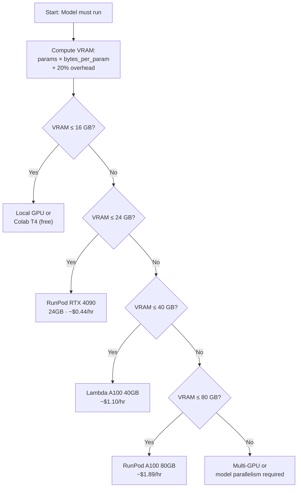

# GPU Setup & Cloud

## Learning Objectives

1. Compute minimum VRAM required for a model given parameter count and precision format.
2. Compare cloud GPU instance types on cost-per-VRAM-GB across at least two providers.
3. Configure a CUDA-enabled environment and verify GPU visibility from PyTorch.
4. Diagnose common GPU provisioning failures (driver mismatch, CUDA version conflict, OOM kills).
5. Write a reproducible verification script that outputs diagnostic data and exits with a status code.

## The Problem

A local model is just weights on disk until you provision compute that can load them into VRAM and run matrix multiplications. The gap between "I downloaded a model" and "I can serve inferences from it" is entirely about hardware allocation. Every OOM error, every training run that hangs for six hours on CPU, every cloud bill that surprises you at the end of the month traces back to a provisioning decision you made or skipped.

This lesson walks through that decision tree: local GPU vs. cloud GPU, which provider, which instance type, and how to verify the setup works before you point real traffic at it. The stakes are concrete. A 7B parameter model in fp16 needs roughly 14 GB just for weights, plus overhead for the KV cache during generation. If you provision a 16 GB card, you will OOM on the second concurrent request. If you provision an 80 GB A100, you are paying $1.89/hour for capacity you may not need.

The GTM context matters here because prospect intelligence pipelines that rely on local inference (classifiers, scorers, entity extractors) have the same failure mode. A Clay waterfall that calls your custom classifier endpoint will fail silently mid-batch if the GPU backing that endpoint runs out of memory. [CITATION NEEDED — concept: Clay waterfall triggering local inference endpoints] You burn API credits retrying, and the enrichment gap propagates downstream into your prospect lists. The fix is upstream: size the GPU to the model before you wire it into anything.

## The Concept

GPU memory is not one pool. It is a hierarchy, and every layer has a bandwidth and latency cost. At the top is VRAM (on the GPU die), connected to system RAM via the PCIe bus, which is itself backed by SSD/disk storage. When you load a model, the weights move from disk into system RAM, then across PCIe into VRAM. The GPU can only compute against data that is in VRAM. If the model is larger than VRAM, frameworks like `accelerate` or `vLLM` will offload layers to system RAM, but each forward pass then requires a PCIe transfer, which is roughly 10-50x slower than VRAM access. This is why "it fits in RAM but not VRAM" produces models that technically run but are too slow for production inference.

The provisioning calculation is deterministic. Model size in parameters multiplied by bytes per parameter (4 for fp32, 2 for fp16, 1 for int8, 0.5 for int4) gives the weight memory. Add approximately 20% for the KV cache and activation buffers during inference. That total is your minimum VRAM. The instance you select must have at least that much VRAM, and the cost-per-VRAM-GB-hour determines whether it is the cheapest option.



CUDA compatibility is the second constraint. PyTorch ships CUDA runtime bundled in its wheels, but the NVIDIA driver on the host must support that CUDA version. If your driver is 525.x and PyTorch requests CUDA 12.1 (which requires driver 530+), `torch.cuda.is_available()` returns `False` with no explanation. This is the most common provisioning failure, and it has nothing to do with your code. The fix is either upgrading the driver or installing a PyTorch build matched to your driver version.

The cost economics across providers vary significantly per VRAM-GB. Lambda Labs and RunPod offer raw GPU instances at commodity pricing. AWS and GCP charge a premium for managed networking, security groups, and integration with their ecosystems. For inference workloads that do not need VPC peering or enterprise compliance, the commodity providers typically deliver 2-4x better cost-per-VRAM-GB.

## Build It

### Check Local GPU Availability

First, query the hardware directly. `nvidia-smi` is the NVIDIA System Management Interface, a CLI tool that ships with the driver. It reports VRAM totals, utilization, driver version, and CUDA version in plain text. This is ground truth — if `nvidia-smi` does not see a GPU, nothing downstream will either.

```python
import subprocess

def parse_nvidia_smi():
    try:
        result = subprocess.run(
            ["nvidia-smi", "--query-gpu=name,memory.total,memory.used,memory.free,temperature.gpu,utilization.gpu", "--format=csv,noheader,nounits"],
            capture_output=True, text=True, timeout=10
        )
        if result.returncode != 0:
            return None
        parts = [p.strip() for p in result.stdout.strip().split(",")]
        return {
            "name": parts[0],
            "vram_total_mb": int(parts[1]),
            "vram_used_mb": int(parts[2]),
            "vram_free_mb": int(parts[3]),
            "temp_c": int(parts[4]),
            "gpu_util_pct": int(parts[5]),
        }
    except (FileNotFoundError, subprocess.TimeoutExpired, ValueError, IndexError):
        return None

gpu = parse_nvidia_smi()
if gpu:
    print(f"GPU: {gpu['name']}")
    print(f"VRAM: {gpu['vram_used_mb']}MB / {gpu['vram_total_mb']}MB used ({gpu['vram_free_mb']}MB free)")
    print(f"Temp: {gpu['temp_c']}C  |  Utilization: {gpu['gpu_util_pct']}%")
else:
    print("No NVIDIA GPU detected or nvidia-smi unavailable on this host.")
```

Next, verify PyTorch can see that GPU through CUDA. This is a separate check because PyTorch maintains its own CUDA bindings, and a driver/PyTorch version mismatch will cause `nvidia-smi` to report a healthy GPU while `torch.cuda.is_available()` returns `False`.

```python
import sys

try:
    import torch
    print(f"PyTorch version: {torch.__version__}")
    print(f"CUDA available: {torch.cuda.is_available()}")
    if torch.cuda.is_available():
        print(f"CUDA version (PyTorch): {torch.version.cuda}")
        print(f"Device: {torch.cuda.get_device_name(0)}")
        props = torch.cuda.get_device_properties(0)
        print(f"Total VRAM: {props.total_memory / 1e9:.2f} GB")
        print(f"Compute capability: {props.major}.{props.minor}")
    else:
        print("CUDA not available — check driver version vs PyTorch CUDA build")
        sys.exit(1)
except ImportError:
    print("PyTorch is not installed. Run: pip install torch")
    sys.exit(1)
```

### Compute VRAM Requirements

The following script implements the provisioning formula: parameters times bytes per parameter, plus 20% for inference overhead, then matches the result against a hardcoded instance catalog to find the cheapest fit.

```python
def compute_vram_requirement(params_billion, precision="fp16"):
    bytes_per_param = {"fp32": 4, "fp16": 2, "int8": 1, "int4": 0.5}
    b = bytes_per_param.get(precision, 2)
    weight_vram = params_billion * b
    overhead = weight_vram * 0.20
    return weight_vram + overhead

INSTANCES = [
    {"provider": "Google Colab",  "gpu": "T4",              "vram_gb": 16,  "cost_per_hr": 0.00},
    {"provider": "RunPod",        "gpu": "RTX 4090",        "vram_gb": 24,  "cost_per_hr": 0.44},
    {"provider": "RunPod",        "gpu": "A100 80GB",       "vram_gb": 80,  "cost_per_hr": 1.89},
    {"provider": "Lambda Labs",   "gpu": "A100 40GB",       "vram_gb": 40,  "cost_per_hr": 1.10},
    {"provider": "Lambda Labs",   "gpu": "H100 80GB",       "vram_gb": 80,  "cost_per_hr": 2.49},
    {"provider": "AWS",           "gpu": "T4 (g4dn.xlarge)","vram_gb": 16,  "cost_per_hr": 0.526},
    {"provider": "AWS",           "gpu": "A100 (p4d)",      "vram_gb": 40,  "cost_per_hr": 3.22},
    {"provider": "GCP",           "gpu": "T4 (n1-standard)","vram_gb": 16,  "cost_per_hr": 0.95},
    {"provider": "GCP",           "gpu": "A100 (a2)",       "vram_gb": 40,  "cost_per_hr": 2.67},
]

def find_cheapest_instance(vram_needed, providers=None):
    candidates = [i for i in INSTANCES if i["vram_gb"] >= vram_needed]
    if providers:
        candidates = [i for i in candidates if i["provider"] in providers]
    if not candidates:
        return None
    best = min(candidates, key=lambda x: x["cost_per_hr"])
    best = dict(best)
    best["cost_per_vram_gb_hr"] = round(best["cost_per_hr"] / best["vram_gb"], 4)
    return best

for params, prec in [(7, "fp16"), (7, "int4"), (13, "fp16"), (70, "int8")]:
    vram = compute_vram_requirement(params, prec)
    best = find_cheapest_instance(vram)
    label = f"{params}B @ {prec}"
    if best:
        print(f"{label:12s}  need {vram:6.1f}GB  ->  {best['provider']:12s} {best['gpu']:25s}  ${best['cost_per_hr']:.2f}/hr  (${best['cost_per_vram_gb_hr']}/GB-hr)")
    else:
        print(f"{label:12s}  need {vram:6.1f}GB  ->  NO INSTANCE FITS")
```

### Measure Actual VRAM During Inference

Load a small model, run one inference, and measure the peak VRAM delta. This confirms the CUDA stack works end to end and gives you a real number to compare against the theoretical estimate.

```python
import torch

try:
    from transformers import AutoModelForSeq2SeqLM, AutoTokenizer
except ImportError:
    print("transformers not installed. Run: pip install transformers")
    import sys; sys.exit(1)

device = "cuda" if torch.cuda.is_available() else "cpu"
model_name = "google/flan-t5-small"
tokenizer = AutoTokenizer.from_pretrained(model_name)
model = AutoModelForSeq2SeqLM.from_pretrained(model_name).to(device)

baseline_mb = 0
if torch.cuda.is_available():
    torch.cuda.reset_peak_memory_stats()
    baseline_mb = torch.cuda.memory_allocated() / 1e6
    print(f"Baseline VRAM allocated: {baseline_mb:.1f} MB")

prompt = "Classify this lead intent: 'Our team is evaluating tools for pipeline automation.'"
inputs = tokenizer(prompt, return_tensors="pt").to(device)
with torch.no_grad():
    output_ids = model.generate(**inputs, max_new_tokens=30)
response = tokenizer.decode(output_ids[0], skip_special_tokens=True)
print(f"Prompt: {prompt}")
print(f"Output: {response}")

if torch.cuda.is_available():
    peak_mb = torch.cuda.max_memory_allocated() / 1e6
    current_mb = torch.cuda.memory_allocated() / 1e6
    print(f"Peak VRAM: {peak_mb:.1f} MB (delta from baseline: {peak_mb - baseline_mb:.1f} MB)")
    print(f"Current VRAM after inference: {current_mb:.1f} MB")
else:
    print("No GPU — inference ran on CPU. VRAM metrics unavailable.")
```

## Use It

GPU provisioning is the infrastructure layer for Zone 1 (Prospect Intelligence). When you build a custom classifier that scores lead intent from LinkedIn profiles, support transcripts, or email bodies, that model needs to run somewhere. The provisioning decision determines whether the classifier can handle a batch of 10,000 prospects in one pass or whether it OOM-kills at row 3,000 and leaves your enrichment table half-populated.

The GTM pricing context makes this concrete. Enterprise companies pay $5,000–$10,000 for a single playbook implementation, with $2,000–$3,000/month in maintenance that includes data refresh and scoring model maintenance. [CITATION NEEDED — concept: enterprise GTM playbook pricing benchmarks] If your scoring model is the differentiator, the GPU it runs on is part of the deliverable. A client who pays $8K for setup expects the inference endpoint to stay up during their enrichment runs, not crash because you sized the VRAM for the model weights alone and forgot the KV cache overhead during batched generation.

The practical workflow: take the model you intend to serve (say, a fine-tuned DeBERTa classifier for ICP scoring), run the VRAM calculator from the Build It section, add headroom for concurrent requests (multiply by 1.5x for safety), then provision the cheapest instance that fits. If you are running inference inside a Clay waterfall enrichment step, batch size and concurrency matter — each concurrent request allocates its own KV cache. [CITATION NEEDED — concept: Clay waterfall batch inference concurrency] A model that fits 7B fp16 weights in 14 GB on a single request may need 24-30 GB under four concurrent requests. The RTX 4090 at 24 GB suddenly looks tight, and the Lambda A100 at 40 GB becomes the safer choice.

## Ship It

A provisioning setup that lives in your head is not shipped. The deliverable is a script that any teammate can run to verify their environment before they start a training run or deploy an inference endpoint. This script becomes step one in every deployment runbook.

The following script checks four things in order: (1) is there an NVIDIA GPU visible to the OS, (2) can PyTorch see it through CUDA, (3) what is the VRAM headroom, and (4) do the driver and CUDA versions match. It exits 0 on success and 1 on any failure, so it can be wired into CI or a Makefile target.

```python
import subprocess
import sys

def check_nvidia_smi():
    try:
        result = subprocess.run(
            ["nvidia-smi