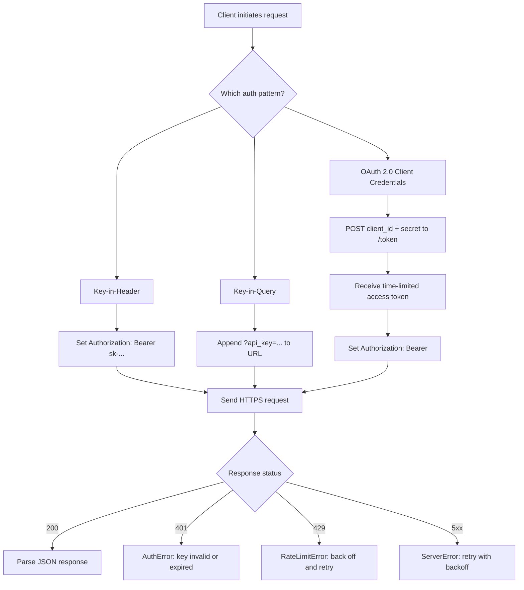

# APIs & Keys

## Learning Objectives

- Store API keys in environment variables and load them at runtime without hardcoding values in source files
- Build an `APIClient` class that injects authentication headers and routes non-200 responses into typed exceptions (`AuthError`, `RateLimitError`, `ServerError`)
- Make authenticated HTTP requests using both an SDK (`anthropic`) and raw `requests`, then compare the two approaches for debuggability
- Implement retry-with-exponential-backoff logic that handles 429 rate-limit responses without overwhelming the server
- Compare key-in-header, key-in-query, and OAuth 2.0 client-credentials authentication patterns and identify when each appears in GTM tooling

## The Problem

Every enrichment waterfall, every CRM sync, every automated outreach sequence runs on API calls — and every API call requires authentication. A key committed to GitHub gets scraped by bots within minutes. A key without rate-limit handling burns through your Apollo quota in a single loop. A key that silently expires at 2 AM produces a sync failure that nobody catches until the sales team asks why their leads disappeared.

The same authentication layer sits underneath both AI engineering and GTM automation. When you call the Anthropic API to generate a personalized cold email, you send `Authorization: Bearer sk-ant-...` in the HTTP header. When Clay runs a waterfall across Apollo, Hunter, and People Data Labs, it sends the same shaped header with each provider's key. The mechanism — a shared secret presented on every request — is identical. The blast radius of getting it wrong is identical: quota consumed, data exposed, automation broken.

This lesson builds that layer. You will store keys safely, construct authenticated requests by hand, wrap them in a reusable client with error handling, and add retry logic that respects rate limits. Every downstream lesson in this curriculum — LLM calls, agent loops, enrichment pipelines — assumes you can do this without thinking about it.

## The Concept

An API key is a shared secret. The server generates a long string and hands it to you once. You present that string on every subsequent request. The server compares what you sent against what it has stored. If they match, you are in. There is no encryption of the key itself — the security model relies entirely on transport encryption (HTTPS) and keeping the key out of places where it can be observed, like log files, browser history, or public Git repositories.

Three authentication patterns dominate the APIs you will encounter in GTM tooling and AI engineering. The first is **key-in-header**, where the credential rides inside the `Authorization` header as `Bearer sk-...` or inside a custom header like `X-API-Key: ...`. This is stateless — every request carries the credential independently, and the server does not need to remember anything between calls. The Anthropic API, OpenAI API, and Apollo API all use this pattern. The second is **key-in-query**, where the credential is appended to the URL as `?api_key=...`. Hunter's email-finding API uses this approach. It is simpler to test in a browser but riskier in production because the key appears in server access logs, CDN logs, and any intermediate proxy that records full URLs. The third is **OAuth 2.0 client credentials**, where you exchange a client ID and secret for a short-lived access token, then use that token in the `Authorization` header until it expires. Salesforce and HubSpot use this pattern for server-to-server CRM integrations. The secret transmits less frequently — only during token exchange — but the flow has more moving parts.



Two levers limit the damage when a key leaks: **scoping** and **rotation**. A key scoped to `read:contacts` cannot delete records even if an attacker obtains it. A key with a 90-day expiry forces rotation, so a leaked key from six months ago is already dead. Most GTM APIs support scoped keys — Apollo lets you create separate keys for read-only data access versus CRM write-back, and People Data Labs lets you cap the number of lookups per key. You should create the narrowest key that does the job and rotate on a schedule, not when something goes wrong.

Environment variables are the storage mechanism. The key lives in the process environment — set via `export` in the shell, loaded from a `.env` file by `python-dotenv`, or injected by a secrets manager like AWS Secrets Manager at runtime. The code references `os.environ["API_KEY"]` and never contains the literal key string. Git never sees the value. This is not a sophisticated security measure — it is table stakes. A key in source code is a key in version control, and version control is forever.

## Build It

You will build a reusable `APIClient` class in four stages. Each stage adds one capability: key loading, header injection, error routing, and logging. The final class is the same pattern Clay's enrichment engine uses when it calls third-party data providers — read the key from the environment, attach it to the request, handle failures by type.

First, confirm that environment-variable access works and that a missing key produces a clear message rather than a `NoneType` traceback:

```python
import os

key = os.environ.get("DEMO_API_KEY")

if key is None:
    print("DEMO_API_KEY is not set. Run: export DEMO_API_KEY='your-key-here'")
    print("Falling back to a dummy value for demonstration.")
    os.environ["DEMO_API_KEY"] = "demo-key-0000-0000"
    key = os.environ["DEMO_API_KEY"]

print(f"Key loaded: {key[:8]}...{key[-4:]}")
```

Run this and observe the masked key prefix and suffix. The full value never appears in output — this habit prevents accidental exposure in log aggregators and CI consoles.

Now build the full client. This code calls `httpbin.org`, a free HTTP testing service that echoes your request back to you, so it runs without a real API key. The `bearer` endpoint validates that the `Authorization` header was sent correctly:

```python
import os
import requests

class AuthError(Exception):
    pass

class RateLimitError(Exception):
    pass

class ServerError(Exception):
    pass

class APIClient:
    def __init__(self, base_url, key_env_var="DEMO_API_KEY"):
        self.base_url = base_url.rstrip("/")
        self.api_key = os.environ.get(key_env_var)
        if not self.api_key:
            raise AuthError(
                f"Environment variable '{key_env_var}' is not set. "
                f"Export it before instantiating APIClient."
            )

    def _headers(self):
        return {
            "Authorization": f"Bearer {self.api_key}",
            "Content-Type": "application/json",
        }

    def get(self, path, params=None):
        url = f"{self.base_url}{path}"
        response = requests.get(
            url, headers=self._headers(), params=params, timeout=10
        )
        print(f"[{response.status_code}] GET {url}")

        if response.status_code == 401:
            raise AuthError(
                "Server rejected the API key. Verify the value and its scopes."
            )
        if response.status_code == 429:
            raise RateLimitError(
                "Rate limit exceeded. Back off before retrying."
            )
        if response.status_code >= 500:
            raise ServerError(
                f"Server returned {response.status_code}. Retry with backoff."
            )
        response.raise_for_status()
        return response.json()


os.environ.setdefault("DEMO_API_KEY", "demo-token-abc123")
client = APIClient("https://httpbin.org")
result = client.get("/bearer")
print(f"Server received token: {result['token']}")
```

The output confirms the full round-trip: the client read the key from the environment, injected it into the `Authorization` header, sent the request, and the server echoed it back. The same `_headers()` method runs on every `get()` call — there is no code path where a request goes out without authentication.

The error routing matters more than the happy path. When you run enrichment across 10,000 contacts at 2 AM, a 429 from Apollo means you need to slow down, not crash. A 401 means a key expired or was revoked, not that the data is bad. A 500 means the server had a transient failure, not that your request was wrong. Each error type gets its own exception so the calling code can respond differently — retry on 429, alert a human on 401, retry with backoff on 5xx.

For comparison, here is the same call using the Anthropic Python SDK. The SDK abstracts away the HTTP layer entirely — you never see the `Authorization` header, the base URL, or the JSON parsing. This is convenient for prototyping but makes debugging harder when something breaks, because you cannot inspect the raw request:

```python
import os
import anthropic

os.environ.setdefault("ANTHROPIC_API_KEY", "sk-ant-placeholder")

client = anthropic.Anthropic()

try:
    response = client.messages.create(
        model="claude-sonnet-4-20250514",
        max_tokens=64,
        messages=[
            {"role": "user", "content": "Reply with exactly: AUTH_OK"}
        ],
    )
    print(response.content[0].text)
except anthropic.AuthenticationError as e:
    print(f"Auth failed: {e}")
except anthropic.RateLimitError as e:
    print(f"Rate limited: {e}")
```

If the key is a placeholder, the SDK raises `AuthenticationError` — which is the SDK's typed wrapper around the same 401 status code your raw client catches. The mechanism is identical. The SDK just hides the HTTP plumbing.

## Use It

The `APIClient` you just built is the authentication layer underneath every GTM enrichment workflow. When Clay executes a waterfall — trying Apollo first, falling back to Hunter, then People Data Labs — each step is an authenticated HTTP call with the same shape your client produces: read the provider's key from the environment, inject it into the header, parse the JSON response, handle the error code. [CITATION NEEDED — concept: Clay waterfall internal call mechanism]

Call a real enrichment-style endpoint to see the pattern end to end. The Hunter API finds email addresses for a given domain and uses key-in-query authentication — the key appears as a URL parameter rather than a header. This is the pattern your `APIClient` needs to handle when the provider does not support header-based auth:

```python
import os
import requests

HUNTER_KEY = os.environ.get("HUNTER_API_KEY", "")

if not HUNTER_KEY:
    print("Set HUNTER_API_KEY to run a live lookup.")
    print("Demo mode: showing the request shape without calling the API.")
    demo_url = "https://api.hunter.io/v2/email-finder"
    demo_params = {
        "domain": "anthropic.com",
        "first_name": "Dario",
        "last_name": "Amodei",
        "api_key": "YOUR_KEY_HERE",
    }
    print(f"GET {demo_url}")
    print(f"Params: {{k: v for k, v in demo_params.items() if k != 'api_key'}}")
    print(f"Key location: query string (visible in server logs)")
else:
    response = requests.get(
        "https://api.hunter.io/v2/email-finder",
        params={
            "domain": "anthropic.com",
            "first_name": "Dario",
            "last_name": "Amodei",
            "api_key": HUNTER_KEY,
        },
        timeout=10,
    )
    print(f"[{response.status_code}] Response:")
    data = response.json()
    if response.status_code == 200:
        email = data.get("data", {}).get("email", "not found")
        print(f"  Email: {email}")
    else:
        print(f"  Error: {data.get('errors', response.text)}")
```

Run this without a key and it prints the request shape — you see exactly where the key goes and why key-in-query is riskier than key-in-header. Set `HUNTER_API_KEY` in your environment and it makes a live lookup, returning a real email address if Hunter has one. The response shape — a JSON object with a `data` key containing the email, confidence score, and source — is the same structure Clay receives when it calls Hunter as part of a waterfall step.

The key-in-query pattern that Hunter uses has a concrete downside you can observe. If your HTTP client logs full URLs (many do by default), the `api_key` parameter appears in plaintext in those logs. If you use a reverse proxy or CDN, their access logs capture the full query string. The header pattern avoids this entirely because headers are typically not logged at the proxy level. When you build enrichment pipelines that process thousands of requests, this difference determines whether your key ends up in a log aggregator that 47 people at your company can search.

## Ship It

Production enrichment runs at scale — 10,000 contacts, 5 providers, rate limits on each. The `APIClient` handles single requests correctly, but a production pipeline needs three additional capabilities: retry with exponential backoff on 429 responses, per-provider rate-limit tracking, and key rotation without downtime.

Exponential backoff is a debounce mechanism. When the server returns 429, it is telling you to slow down. Your client waits before retrying — first 1 second, then 2, then 4, then 8 — doubling each time until the request succeeds or you hit a maximum retry count. This prevents the thundering-herd problem where 10 concurrent workers all retry simultaneously and keep hitting the limit. Here is the backoff wrapper added to the client:

```python
import os
import time
import requests

class AuthError(Exception):
    pass

class RateLimitError(Exception):
    pass

class ServerError(Exception):
    pass

class APIClient:
    def __init__(self, base_url, key_env_var="DEMO_API_KEY"):
        self.base_url = base_url.rstrip("/")
        self.api_key = os.environ.get(key_env_var)
        if not self.api_key:
            raise AuthError(
                f"Environment variable '{key_env_var}' is not set."
            )

    def _headers(self):
        return {
            "Authorization": f"Bearer {self.api_key}",
            "Content-Type": "application/json",
        }

    def get(self, path, params=None, max_retries=4):
        url = f"{self.base_url}{path}"
        for attempt in range(max_retries):
            response = requests.get(
                url, headers=self._headers(), params=params, timeout=10
            )
            print(
                f"[{response.status_code}] GET {url} "
                f"(attempt {attempt + 1}/{max_retries})"
            )

            if response.status_code == 200:
                return response.json()
            if response.status_code == 401:
                raise AuthError(
                    "Server rejected the API key."
                )
            if response.status_code == 429:
                backoff = 2 ** attempt
                print(f"  Rate limited. Sleeping {backoff}s before retry.")
                time.sleep(backoff)
                continue
            if response.status_code >=