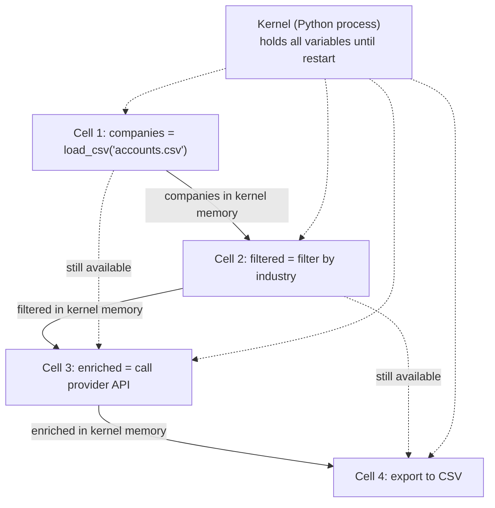

# Jupyter Notebooks: Interactive Computing for GTM Data Work

## Learning Objectives

- Launch a Jupyter server and execute cells in both document order and non-linear order
- Trace kernel state across cells to predict which variables are available at each execution point
- Reproduce a hidden-state bug by running cells out of order, then diagnose it via "Restart & Run All"
- Extract cell logic from a `.ipynb` file and assemble a standalone Python script
- Benchmark cell execution time to estimate cost at GTM data scale

## The Problem

The standard Python development loop is: write a script, run the script, inspect the output, edit the script, run the whole thing again. This works fine for small scripts. It falls apart when your script makes an API call to pull 5,000 company records from your CRM, and then you want to test a filtering function that operates on those records. Every edit to the filter means re-running the API call. Twenty iterations of the filter means twenty API calls, twenty rate-limit waits, and twenty minutes of dead time.

Notebooks solve this specific problem by keeping a Python interpreter alive between code edits. The 5,000 records stay in memory while you iterate on the filter twenty times. The expensive operation runs once. The cheap operations run twenty times. This is the same pattern you use when prototyping enrichment logic before moving it into a Clay waterfall — you pull the data once, test your transformations against it, then ship the working logic elsewhere.

But notebooks introduce their own failure mode. Because the interpreter is stateful and cells can run in any order, the notebook on your screen may not represent what the kernel actually holds in memory. Someone else — or your future self, after a kernel restart — runs the same notebook top-to-bottom and gets a `NameError` on cell 2. This is the "works on my machine" problem, ported to interactive computing.

## The Concept

A notebook is a JSON document containing an ordered list of cells. Each cell is either code (executable Python) or markdown (formatted text). A kernel — a persistent Python process — sits behind the notebook UI and executes code cells on demand. When you run a cell, the notebook sends that cell's source to the kernel, the kernel executes it against its in-memory namespace, and any output gets displayed beneath the cell.

The kernel maintains that namespace across cells. A variable defined in cell 1 is available in cell 5, cell 10, cell 50 — until you restart the kernel or delete the variable. This persistence is the entire reason notebooks exist. It is why you can load data once and iterate on transformations without reloading.



The danger lives in the execution model: cells can run in any order. The notebook UI shows `In [n]` and `Out [n]` counters that track the order the kernel actually received commands. The visual order of cells in the document — top to bottom — is cosmetic. If you run cell 5, then scroll up and run cell 2, the kernel executes them in that sequence: 5, then 2. State from cell 5 is available to cell 2, even though cell 2 sits above cell 5 in the document.

This creates hidden state. You define a variable in cell 5, use it in cell 2, and everything works because the kernel has both in memory. But someone opening your notebook and clicking "Restart & Run All" gets a `NameError` because cell 2 runs before cell 5 defines the variable. This is the number one source of notebook bugs, and it is entirely a human-behavior problem: the tool lets you execute things out of order, and you do.

The `.ipynb` file is a JSON document. It stores cell sources, cell outputs, execution counts, and kernel metadata. Outputs are baked into the file itself, which means every time you run a notebook and save it, the file changes — even if your code didn't. A git diff on a notebook is dominated by output changes and metadata shifts, not source edits. Tools like `nbstripout` strip outputs before commit, but the underlying format is the root cause. When reviewing a PR that includes notebook changes, you are reading JSON diffs of output text, not clean code changes.

The boundary between notebooks and scripts is straightforward: if you are scheduling it, deploying it, or running it unattended, it is a script. Notebooks are for exploration, prototyping, and documenting an analysis with inline results. The workflow: prototype in a notebook, verify the logic, then extract the working cells into a `.py` file and ship that.

## Build It

Let's construct a notebook from scratch — not through a UI, but by writing the underlying JSON. This strips away the magic and shows you exactly what a `.ipynb` file contains.

```python
import json

notebook = {
    "cells": [
        {
            "cell_type": "markdown",
            "metadata": {},
            "source": [
                "# Company Enrichment Prototype\n",
                "Testing filter logic before moving to Clay."
            ]
        },
        {
            "cell_type": "code",
            "execution_count": 1,
            "metadata": {},
            "outputs": [
                {
                    "output_type": "stream",
                    "name": "stdout",
                    "text": ["['Acme Corp', 'Globex', 'Initech', 'Umbrella']\n"]
                }
            ],
            "source": [
                "companies = ['Acme Corp', 'Globex', 'Initech', 'Umbrella']\n",
                "print(companies)"
            ]
        },
        {
            "cell_type": "code",
            "execution_count": 2,
            "metadata": {},
            "outputs": [
                {
                    "output_type": "stream",
                    "name": "stdout",
                    "text": ["['Acme Corp', 'Umbrella']\n"]
                }
            ],
            "source": [
                "long_names = [c for c in companies if len(c) > 7]\n",
                "print(long_names)"
            ]
        }
    ],
    "metadata": {
        "kernelspec": {
            "display_name": "Python 3",
            "language": "python",
            "name": "python3"
        },
        "language_info": {
            "name": "python",
            "version": "3.11.0"
        }
    },
    "nbformat": 4,
    "nbformat_minor": 5
}

with open("enrichment_prototype.ipynb", "w") as f:
    json.dump(notebook, f, indent=1)

print("Wrote enrichment_prototype.ipynb")
print(f"Total cells: {len(notebook['cells'])}")
print(f"Code cells: {sum(1 for c in notebook['cells'] if c['cell_type'] == 'code')}")
print(f"Markdown cells: {sum(1 for c in notebook['cells'] if c['cell_type'] == 'markdown')}")
print()
print("First 200 chars of the raw file:")
with open("enrichment_prototype.ipynb") as f:
    print(f.read()[:200])
```

That JSON structure — the `cells` array, the `metadata` block, the `nbformat` version — is exactly what lives inside every `.ipynb` file on disk. The `execution_count` field is the `In [n]` counter. The `outputs` array stores what the cell printed when it last ran. When you open this file in Jupyter, it renders the cells visually. When you view it as raw text, you see this JSON.

Now let's simulate the kernel itself to make the state-persistence mechanism concrete:

```python
class FakeKernel:
    def __init__(self):
        self.globals_dict = {"__builtins__": __builtins__}
        self.exec_count = 0

    def run_cell(self, source):
        self.exec_count += 1
        print(f"In [{self.exec_count}]: {source.strip()}")
        exec(source, self.globals_dict)
        visible = {k: type(v).__name__
                   for k, v in self.globals_dict.items()
                   if not k.startswith('_')}
        if visible:
            print(f"  >> kernel memory: {visible}")
        print()

    def restart(self):
        self.globals_dict = {"__builtins__": __builtins__}
        self.exec_count = 0
        print("=== KERNEL RESTARTED ===\n")

kernel = FakeKernel()

print("--- Running cells in document order ---")
kernel.run_cell("companies = ['Acme Corp', 'Globex', 'Initech', 'Umbrella']")
kernel.run_cell("long_names = [c for c in companies if len(c) > 7]\nprint(long_names)")

print("--- Running cell 2 without cell 1 (simulates out-of-order) ---")
kernel.restart()
try:
    kernel.run_cell("long_names = [c for c in companies if len(c) > 7]")
except NameError as e:
    print(f"  >> NameError: {e}\n")
    print("  companies is not defined because cell 1 was never executed.")
```

Run it. The first sequence works: cell 1 defines `companies`, cell 2 uses it. The second sequence fails: `companies` is not in the kernel's namespace because we restarted and skipped cell 1. That `NameError` is the exact bug a colleague hits when they open your notebook and click "Run All" after you developed it by jumping around between cells.

Now extract the notebook's code cells into a standalone script — the workflow you follow when the prototype is ready to ship:

```python
import json

with open("enrichment_prototype.ipynb") as f:
    nb = json.load(f)

script_lines = []
for cell in nb["cells"]:
    if cell["cell_type"] == "code":
        source = "".join(cell["source"])
        script_lines.append(source)

script = "\n\n".join(script_lines)

with open("enrichment_prototype.py", "w") as f:
    f.write(script)

print("Extracted to enrichment_prototype.py:")
print("=" * 50)
print(script)
```

That is the entire extraction process: read the JSON, filter for code cells, concatenate sources, write to `.py`. In production you would use `jupyter nbconvert --to script`, but seeing the mechanism raw makes it clear there is no magic — just JSON parsing.

## Use It

The persistent kernel namespace is the mechanism that makes iterative ICP-scoring logic viable for GTM data work: you load your account list once into memory, then refine a scoring function against that same dataset across many iterations without re-fetching. This is the prototyping pattern behind enrichment waterfalls you later deploy in Clay — Cluster 1.2, TAM Refinement & ICP Scoring — where you validate scoring thresholds locally before committing API budget at scale.

```python
import csv, io, time

raw = "name,employees,industry,country\nAcme Corp,50,Manufacturing,US\nGlobex,5000,Technology,US\nInitech,200,Technology,US\nUmbrella,10000,Pharmaceuticals,DE\nSoylent,800,Food,US\nHooli,3000,Technology,US\nVehement,30,Manufacturing,UK\nPied Piper,12,Technology,US\n"
reader = csv.DictReader(io.StringIO(raw))
accounts = list(reader)
print(f"Loaded {len(accounts)} accounts (simulating CRM pull)\n")

def score_icp(account, min_emp=100, target_industry="Technology", target_country="US"):
    reasons = []
    emp = int(account["employees"])
    if emp < min_emp: reasons.append(f"employees {emp} < {min_emp}")
    if account["industry"] != target_industry: reasons.append(f"industry not {target_industry}")
    if account["country"] != target_country: reasons.append(f"country not {target_country}")
    tier = "high" if not reasons else "low"
    return tier, reasons or ["all criteria met"]

print(f"{'Name':15s} {'Tier':5s} {'Reasons'}")
print("-" * 55)
for a in accounts:
    tier, reasons = score_icp(a)
    print(f"{a['name']:15s} {tier:5s} {', '.join(reasons)}")

print("\nIterating threshold: min_emp=200")
for a in accounts:
    tier, reasons = score_icp(a, min_emp=200)
    if tier == "high":
        print(f"  {a['name']:15s} -> high")

start = time.perf_counter()
for _ in range(10000):
    for a in accounts:
        score_icp(a)
elapsed = time.perf_counter() - start
print(f"\n10k iterations x {len(accounts)} accounts: {elapsed:.3f}s")
```

The scoring function runs instantly against in-memory data. You change `min_emp` from 100 to 200, re-run only that cell, and see the tier shift immediately. No API re-fetch, no rate-limit wait. The benchmark at the bottom tells you whether the logic is cheap enough to run against your full 50,000-account database before you deploy it. When the thresholds feel right, you extract the cells into a script and schedule it.

[CITATION NEEDED — concept: Clay waterfall deployment pattern for ICP scoring thresholds]

## Exercises

**1. (Easy) Reproduce the hidden-state bug.** Using the `FakeKernel` class from Build It, write a three-cell sequence where cell 3 defines a variable that cell 2 uses. Run cells in order 1, 3, 2 — it works. Then restart the kernel and run in document order 1, 2, 3 — it should fail. Print the `NameError` message and explain in a comment why the first run succeeded.

**2. (Medium) Extract and parameterize.** Take the `enrichment_prototype.ipynb` you built, extract its code cells into a script, then modify the script so `min_emp` and `target_industry` come from `sys.argv` instead of being hardcoded. Run the script from the terminal with different arguments and confirm the output changes. This is the last step before moving prototype logic into a scheduled job or a Clay enrichment column.

## Key Terms

- **Kernel:** A persistent Python process that executes notebook cells and maintains variable state across them. Restarting the kernel wipes all in-memory state.
- **Cell:** A single unit in a notebook. Either `code` (sent to the kernel for execution) or `markdown` (rendered as formatted text). Cells have a source, an execution count, and an outputs list.
- **Execution count (`In [n]`):** A per-cell counter incremented each time the kernel executes that cell. Tracks the order the kernel received commands, which may differ from document order.
- **Restart & Run All:** A single command that clears the kernel's namespace and executes all cells in document order. The canonical test for whether a notebook is reproducible.
- **`.ipynb`:** The file format for Jupyter notebooks. A JSON document containing cells, outputs, execution counts, and kernel metadata. Version 4 (`nbformat: 4`) is the current standard.
- **`nbconvert`:** The tool that converts `.ipynb` files to other formats — `.py` scripts, HTML, PDF. The extraction step when moving prototype logic into production.

## Sources

- Project Jupyter. "Jupyter Notebook Documentation." [jupyter-notebook.readthedocs.io](https://jupyter-notebook.readthedocs.io/)
- Jupyter Server Team. "The `.ipynb` format specification (nbformat v4)." [nbformat.readthedocs.io](https://nbformat.readthedocs.io/en/latest/format_description.html)
- Kluyver, Thomas, et al. "Jupyter Notebooks — a publishing format for reproducible computational workflows." *Positioning and Power in Academic Publishing: Players, Agents and Agendas*, IOS Press, 2016.
- Project Jupyter. "nbconvert: Convert Notebooks to other formats." [nbconvert.readthedocs.io](https://nbconvert.readthedocs.io/)
- [CITATION NEEDED — concept: Clay waterfall deployment pattern for ICP scoring thresholds]
- [CITATION NEEDED — concept: GTM team conventions for notebook-to-script extraction workflow]