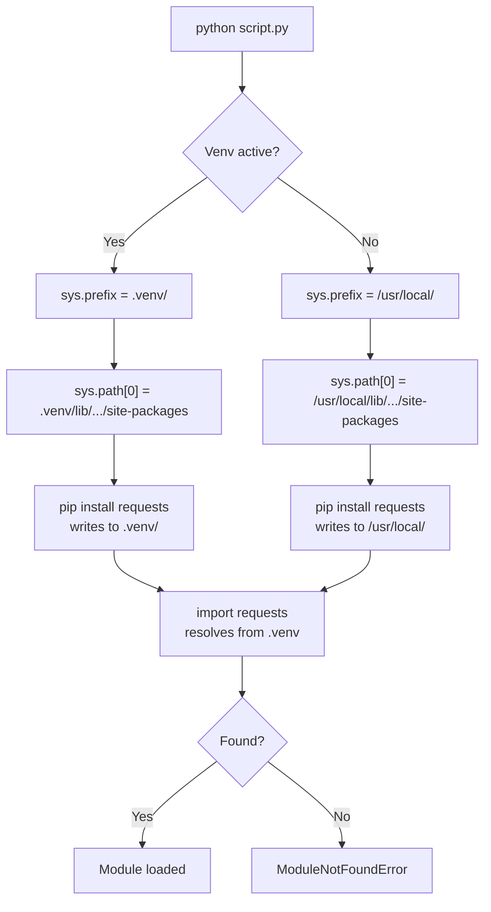

# Python Environments

## Learning Objectives

- Create isolated Python environments using `venv` and verify isolation through `sys.path` inspection
- Trace module resolution to explain why a package installed in a venv is invisible to the global interpreter
- Generate reproducible `requirements.txt` files and reconstruct environments from them in a single command sequence
- Load and mask API secrets from `.env` files using `python-dotenv` and `os.getenv`
- Diagnose dependency conflicts across multiple GTM scripts that require different versions of the same package

## The Problem

You install `requests` 2.31 globally for an Apollo enrichment script. Next week, a different project pulls in a library that transitively pins `requests` to `<=2.29`. You run `pip install`, the first script's behavior changes silently, and you spend an hour figuring out why your enrichment output suddenly has different TLS behavior. This is dependency hell. It is not exotic. It is the default state of a Python workflow that uses a single global `site-packages` directory for everything.

The problem compounds for GTM workflows because every integration pulls from different APIs with different client libraries. Your Apollo contact enrichment script needs `requests`. Your LinkedIn scraping tool needs `playwright` and `beautifulsoup4`. Your lead-scoring model needs `scikit-learn` and `pandas`. Each of these packages drags in its own dependency tree, and a global install means those trees share a single root. When two trees conflict on a transitive dependency — one needs `urllib3>=2.0`, the other pins `urllib3<2.0` — pip picks one and silently breaks the other.

The deeper problem is handoff. If your enrichment script works on your laptop but fails on a teammate's machine, the cause is almost always an undocumented dependency that accumulated in your global `site-packages` over months of tinkering. Your teammate's install is clean. Without an explicit, isolated environment per project, there is no way to capture what your script actually needs to run. You cannot ship what you cannot reproduce.

## The Concept

Python locates modules at runtime using `sys.path` — a list of directories searched in order. When you type `import requests`, Python walks each entry in `sys.path`, looking for a directory named `requests/` or a file named `requests.py`. The first match wins. If no match is found after exhausting the list, Python raises `ModuleNotFoundError`.

The default `sys.path` includes three categories: the directory of the script being executed, any directories listed in the `PYTHONPATH` environment variable, and installation-dependent default paths. That last category is where `site-packages` lives — the directory where `pip install` writes packages. On a macOS Homebrew Python install, that might be `/opt/homebrew/lib/python3.12/site-packages/`. Every global `pip install` writes to this shared directory, which is why installing one package can affect every script on your machine.

A virtual environment redirects `sys.prefix` — the root directory Python uses to locate its standard library and `site-packages`. When you run `python -m venv .venv`, Python copies its base executable into `.venv/bin/python` and creates a fresh, empty `site-packages` at `.venv/lib/python3.12/site-packages/`. When the venv is activated, `sys.prefix` points to `.venv/`, and `sys.path` includes the local `site-packages` ahead of the global one. Packages installed via `pip install` land in the local directory. They do not touch the global install. The isolation is not magic — it is just a different `sys.path`.



Several tools implement this pattern. `venv` ships with the Python standard library — it creates lightweight environments using the mechanism above, no extra installation required. `virtualenv` is a third-party predecessor that does the same thing but faster and with more options for older Python versions. `conda` takes a broader approach: it manages both the Python interpreter and non-Python dependencies (C libraries, R packages, CUDA toolkits) by installing everything into isolated prefix directories. This matters for ML workloads where PyTorch needs a specific CUDA build that conflicts with TensorFlow's.

`pyenv` is a version manager, not an environment manager. It controls which Python version is on your `PATH` — you can have 3.10, 3.11, and 3.12 installed simultaneously and switch between them. But it does not isolate `site-packages`. You still need `venv` or `conda` on top of `pyenv` to get package isolation. `uv` is a newer tool written in Rust that combines version management, environment creation, and package installation into a single binary that runs 10–100x faster than `pip`. It uses the same `sys.prefix` redirection under the hood.

For GTM work, this mechanism matters because dependency isolation is what lets you run a Clay enrichment script and an Apollo contact-lookup script on the same machine without their libraries colliding. Each script gets its own venv with its own pinned dependency tree. When you update one integration's client library, the other is untouched. When you hand the script to a teammate, the `requirements.txt` captures the exact state of the environment.

## Build It

Start by creating a project directory and a virtual environment inside it. These are shell commands — run them in your terminal:

```bash
mkdir -p ~/gtm-env-demo && cd ~/gtm-env-demo

python3 -m venv .venv

source .venv/bin/activate

which python
```

The `which python` output should print a path ending in `.venv/bin/python`. That confirms `sys.prefix` now points to `.venv/`. Verify the mechanism directly by inspecting `sys.path` inside the venv versus outside it:

```python
import sys

print("sys.prefix:", sys.prefix)
print("site-packages locations:")
for p in sys.path:
    if "site-packages" in p:
        print(" ", p)
```

Run this inside the active venv and note the output. Then deactivate, run it again with the global interpreter, and compare. The `site-packages` path changes — that is the entire isolation mechanism in one observable difference.

Now install a package into the venv and confirm Python can find it:

```bash
pip install requests==2.31.0

python -c "import requests; print('requests version:', requests.__version__)"
```

This prints `requests version: 2.31.0`. The package files live at `.venv/lib/python3.12/site-packages/requests/`. To prove isolation, deactivate the venv and attempt the same import from the global interpreter:

```bash
deactivate

python3 -c "import requests; print(requests.__version__)"
```

If `requests` is not installed globally, you get `ModuleNotFoundError: No module named 'requests'`. If it *is* installed globally, you will see a different version number or the same one — but it is being loaded from the global `site-packages`, not from `.venv/`. Either outcome confirms that the venv's packages are invisible to the global interpreter.

Now capture the environment for reproducibility. Reactivate the venv and freeze its exact state:

```bash
source .venv/bin/activate

pip freeze > requirements.txt

cat requirements.txt
```

The output lists every installed package with its exact version — something like `certifi==2024.2.2`, `charset-normalizer==3.3.2`, `idna==3.6`, `requests==2.31.0`, `urllib3==2.2.1`. A teammate reconstructs this exact environment by running `python3 -m venv .venv && source .venv/bin/activate && pip install -r requirements.txt`. The versions are pinned, so the reproduction is byte-for-byte identical.

For API key management, use a `.env` file so secrets stay out of source code. Install `python-dotenv`:

```bash
pip install python-dotenv
```

Create a `.env` file with demo values:

```bash
cat > .env << 'EOF'
APOLLO_API_KEY=demo_key_12345
CLAY_WEBHOOK_URL=https://api.clay.com/v3/webhooks/demo
EOF
```

Write a script that loads it and prints masked values:

```python
import os
from dotenv import load_dotenv

load_dotenv()

api_key = os.getenv("APOLLO_API_KEY")
webhook_url = os.getenv("CLAY_WEBHOOK_URL")

masked_key = api_key[:8] + "..." if api_key else "NOT SET"

print(f"APOLLO_API_KEY: {masked_key}")
print(f"CLAY_WEBHOOK_URL: {webhook_url}")
```

Running `python check_env.py` prints `APOLLO_API_KEY: demo_key...` and the webhook URL. The `load_dotenv()` call reads `.env` from the current directory, parses each line as `KEY=VALUE`, and injects them into `os.environ`. Subsequent `os.getenv()` calls retrieve them. Regenerate `requirements.txt` to include `python-dotenv`:

```bash
pip freeze > requirements.txt
```

## Use It

The `sys.prefix` redirection that `venv` implements is the isolation mechanism that lets a multi-provider GTM enrichment pipeline run on a single machine without dependency collisions [CITATION NEEDED — concept: multi-provider GTM enrichment pipeline as standard RevOps pattern]. Here is a runnable Apollo contact enrichment script — the venv you built above is its runtime, and the `.env` file is its secret store.

```python
import os, requests
from dotenv import load_dotenv

load_dotenv()

APOLLO_API_KEY = os.getenv("APOLLO_API_KEY")
APOLLO_BASE_URL = "https://api.apollo.io/v1"

def enrich_contact(email):
    resp = requests.post(
        f"{APOLLO_BASE_URL}/people/match",
        json={"email": email},
        headers={"Cache-Control": "no-cache",
                 "Content-Type": "application/json",
                 "X-Api-Key": APOLLO_API_KEY},
        timeout=10,
    )
    resp.raise_for_status()
    person = resp.json().get("person", {})
    return {
        "email": email,
        "name": person.get("name"),
        "title": person.get("title"),
        "company": person.get("organization_name"),
    }

if __name__ == "__main__":
    leads = ["jane@example.com", "mark@acme.io"]
    for email in leads:
        try:
            result = enrich_contact(email)
            print(f"{result['name']} | {result['title']} @ {result['company']}")
        except requests.RequestException as e:
            print(f"{email}: FAILED — {e}")
```

Run this inside the venv with `python enrich.py`. The script resolves `requests` from `.venv/lib/.../site-packages/` and reads `APOLLO_API_KEY` from `.env` via `load_dotenv()`. If a teammate clones the repo, creates the venv from `requirements.txt`, copies `.env.example` to `.env`, and pastes their own key, the script runs identically on their machine. That is reproducibility — and it is the same pattern you will use for every Clay webhook, Apollo enrichment, and CRM write-back script in later lessons.

## Exercises

1. **Two venvs, one machine.** Create `.venv-apollo` and `.venv-clay` in the same project directory. Install `requests==2.31.0` in the first and `requests==2.28.1` in the second. Write a script that prints `requests.__version__` and the `site-packages` path it loaded from. Activate each venv, run the script, and confirm the versions and paths differ. Then explain in one sentence why the global interpreter cannot see either install.

2. **Conflict diagnosis.** Create a fresh venv. Install `requests==2.31.0`. Then attempt to install a hypothetical package that pins `urllib3<2.0` (for example, `pip install requests==2.28.1` alongside the existing `urllib3==2.2.1`). Run `pip freeze` before and after. Document which packages changed version, which stayed the same, and what command you would use to restore the original state from `requirements.txt`. Write a one-paragraph diagnosis of what happened to `sys.path` and why the Apollo enrichment script in **Use It** would start failing.

## Key Terms

- **Virtual environment (venv)** — An isolated Python installation prefix with its own `site-packages` directory, created by copying or symlinking the base interpreter and redirecting `sys.prefix`.
- **sys.path** — The ordered list of directories Python searches when resolving `import` statements. First match wins; no match raises `ModuleNotFoundError`.
- **site-packages** — The directory where `pip install` writes third-party packages. Each venv has its own; the global interpreter has a shared one.
- **sys.prefix** — The root directory Python uses to locate its standard library and `site-packages`. Venv activation repoints this to the `.venv/` directory.
- **requirements.txt** — A pinned list of package names and exact versions, produced by `pip freeze`, that captures the full state of a venv for reproducible installation.
- **python-dotenv** — A library that reads `.env` files at runtime and injects key-value pairs into `os.environ`, keeping secrets out of source code.
- **Transitive dependency** — A package your project needs indirectly because a package you installed directly declares it as a dependency. Conflicts between transitive trees are the primary cause of dependency hell.

## Sources

- Python Software Foundation. "venv — Creation of virtual environments." *Python 3 documentation*. https://docs.python.org/3/library/venv.html
- Python Software Foundation. "The sys module — sys.path." *Python 3 documentation*. https://docs.python.org/3/library/sys.html#sys.path
- Python Software Foundation. "pip freeze — requirements file format." *Python Packaging User Guide*. https://pip.pypa.io/en/stable/cli/pip_freeze/
- Smarkets / Saurabh Kumar. "python-dotenv: Read key-value pairs from a .env file." *GitHub repository*. https://github.com/theskumar/python-dotenv
- Astral. "uv: An extremely fast Python package and project manager." *Documentation*. https://docs.astral.sh/uv/
- Apollo API reference — `POST /v1/people/match`. [CITATION NEEDED — concept: Apollo People Match API request/response schema]