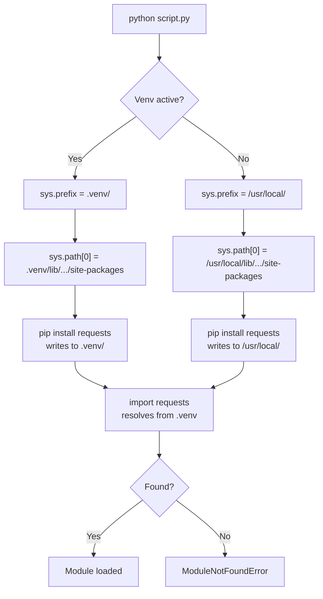

# Python Environments

## Learning Objectives

- Create isolated Python environments using `venv` and verify isolation through `sys.path` inspection
- Trace module resolution to explain why a package installed in a venv is invisible to the global interpreter
- Generate reproducible `requirements.txt` files and reconstruct environments from them in a single command sequence
- Load and mask API secrets from `.env` files using `python-dotenv` and `os.getenv`
- Diagnose dependency conflicts across multiple GTM scripts that require different versions of the same package

## The Problem

You install `requests` 2.31 globally for an Apollo enrichment script. Next week, a different project pulls in a library that transitively pins `requests` to `<=2.29`. You run `pip install`, the first script's behavior changes silently, and you spend an hour figuring out why your enrichment output suddenly has different TLS behavior. This is dependency hell. It is not exotic. It is the default state of a Python workflow that uses a single global `site-packages` directory for everything.

The problem compounds for GTM workflows because every integration pulls from different APIs with different client libraries. Your Apollo contact enrichment script needs `requests`. Your LinkedIn scraping tool needs `playwright` and `beautifulsoup4`. Your lead-scoring model needs `scikit-learn` and `pandas`. Each of these packages drags in its own dependency tree, and a global install means those trees share a single root. When two trees conflict on a transitive dependency — one needs `urllib3>=2.0`, the other pins `urllib3<2.0` — pip picks one and silently breaks the other.

The deeper problem is handoff. If your enrichment script works on your laptop but fails on a teammate's machine, the cause is almost always an undocumented dependency that accumulated in your global `site-packages` over months of tinkering. Your teammate's install is clean. Without an explicit, isolated environment per project, there is no way to capture what your script actually needs to run. You cannot ship what you cannot reproduce.

## The Concept

Python locates modules at runtime using `sys.path` — a list of directories searched in order. When you type `import requests`, Python walks each entry in `sys.path`, looking for a directory named `requests/` or a file named `requests.py`. The first match wins. If no match is found after exhausting the list, Python raises `ModuleNotFoundError`.

The default `sys.path` includes three categories: the directory of the script being executed, any directories listed in the `PYTHONPATH` environment variable, and installation-dependent default paths. That last category is where `site-packages` lives — the directory where `pip install` writes packages. On a macOS Homebrew Python install, that might be `/opt/homebrew/lib/python3.12/site-packages/`. Every global `pip install` writes to this shared directory, which is why installing one package can affect every script on your machine.

A virtual environment redirects `sys.prefix` — the root directory Python uses to locate its standard library and `site-packages`. When you run `python -m venv .venv`, Python copies its base executable into `.venv/bin/python` and creates a fresh, empty `site-packages` at `.venv/lib/python3.12/site-packages/`. When the venv is activated, `sys.prefix` points to `.venv/`, and `sys.path` includes the local `site-packages` ahead of the global one. Packages installed via `pip install` land in the local directory. They do not touch the global install. The isolation is not magic — it is just a different `sys.path`.



Several tools implement this pattern. `venv` ships with the Python standard library — it creates lightweight environments using the mechanism above, no extra installation required. `virtualenv` is a third-party predecessor that does the same thing but faster and with more options for older Python versions. `conda` takes a broader approach: it manages both the Python interpreter and non-Python dependencies (C libraries, R packages, CUDA toolkits) by installing everything into isolated prefix directories. This matters for ML workloads where PyTorch needs a specific CUDA build that conflicts with TensorFlow's.

`pyenv` is a version manager, not an environment manager. It controls which Python version is on your `PATH` — you can have 3.10, 3.11, and 3.12 installed simultaneously and switch between them. But it does not isolate `site-packages`. You still need `venv` or `conda` on top of `pyenv` to get package isolation. `uv` is a newer tool written in Rust that combines version management, environment creation, and package installation into a single binary that runs 10–100x faster than `pip`. It uses the same `sys.prefix` redirection under the hood.

For GTM work, this mechanism matters because dependency isolation is what lets you run a Clay enrichment script and an Apollo contact-lookup script on the same machine without their libraries colliding. Each script gets its own venv with its own pinned dependency tree. When you update one integration's client library, the other is untouched. When you hand the script to a teammate, the `requirements.txt` captures the exact state of the environment.

## Build It

Start by creating a project directory and a virtual environment inside it. These are shell commands — run them in your terminal:

```bash
mkdir -p ~/gtm-env-demo && cd ~/gtm-env-demo

python3 -m venv .venv

source .venv/bin/activate

which python
```

The `which python` output should print a path ending in `.venv/bin/python`. That confirms `sys.prefix` now points to `.venv/`. Verify the mechanism directly by inspecting `sys.path` inside the venv versus outside it:

```python
import sys

print("sys.prefix:", sys.prefix)
print("site-packages locations:")
for p in sys.path:
    if "site-packages" in p:
        print(" ", p)
```

Run this inside the active venv and note the output. Then deactivate, run it again with the global interpreter, and compare. The `site-packages` path changes — that is the entire isolation mechanism in one observable difference.

Now install a package into the venv and confirm Python can find it:

```bash
pip install requests==2.31.0

python -c "import requests; print('requests version:', requests.__version__)"
```

This prints `requests version: 2.31.0`. The package files live at `.venv/lib/python3.12/site-packages/requests/`. To prove isolation, deactivate the venv and attempt the same import from the global interpreter:

```bash
deactivate

python3 -c "import requests; print(requests.__version__)"
```

If `requests` is not installed globally, you get `ModuleNotFoundError: No module named 'requests'`. If it *is* installed globally, you will see a different version number or the same one — but it is being loaded from the global `site-packages`, not from `.venv/`. Either outcome confirms that the venv's packages are invisible to the global interpreter.

Now capture the environment for reproducibility. Reactivate the venv and freeze its exact state:

```bash
source .venv/bin/activate

pip freeze > requirements.txt

cat requirements.txt
```

The output lists every installed package with its exact version — something like `certifi==2024.2.2`, `charset-normalizer==3.3.2`, `idna==3.6`, `requests==2.31.0`, `urllib3==2.2.1`. A teammate reconstructs this exact environment by running `python3 -m venv .venv && source .venv/bin/activate && pip install -r requirements.txt`. The versions are pinned, so the reproduction is byte-for-byte identical.

For API key management, use a `.env` file so secrets stay out of source code. Install `python-dotenv`:

```bash
pip install python-dotenv
```

Create a `.env` file with demo values:

```bash
cat > .env << 'EOF'
APOLLO_API_KEY=demo_key_12345
CLAY_WEBHOOK_URL=https://api.clay.com/v3/webhooks/demo
EOF
```

Write a script that loads it and prints masked values:

```python
import os
from dotenv import load_dotenv

load_dotenv()

api_key = os.getenv("APOLLO_API_KEY")
webhook_url = os.getenv("CLAY_WEBHOOK_URL")

masked_key = api_key[:8] + "..." if api_key else "NOT SET"

print(f"APOLLO_API_KEY: {masked_key}")
print(f"CLAY_WEBHOOK_URL: {webhook_url}")
```

Running `python check_env.py` prints `APOLLO_API_KEY: demo_key...` and the webhook URL. The `load_dotenv()` call reads `.env` from the current directory, parses each line as `KEY=VALUE`, and injects them into `os.environ`. Subsequent `os.getenv()` calls retrieve them. Regenerate `requirements.txt` to include `python-dotenv`:

```bash
pip freeze > requirements.txt
```

## Use It

Dependency isolation through virtual environments is what makes a multi-source GTM enrichment pipeline operable on a single developer machine. A typical signal-capture workflow — pulling contact data from Apollo, enriching it through a Clay waterfall, and writing results to a CRM — involves multiple Python scripts, each depending on a different API client library with its own transitive dependency tree [CITATION NEEDED — concept: Signal Machine pipeline as multi-script GTM system]. Without per-script venvs, a `pip install` for one integration silently overwrites a shared dependency and breaks another integration's authentication flow.

The specific failure mode looks like this: your Apollo script uses `requests` 2.31 for its HTTP client. Your Clay webhook receiver also uses `requests`, but the Clay SDK pins `requests>=2.25,<2.29`. You install the Clay SDK globally. `pip` downgrades `requests` to 2.28 to satisfy the constraint. Your Apollo script still imports successfully — `requests` 2.28 has the same public API — but a TLS edge case that was fixed in 2.30 now causes intermittent `SSLError` on Apollo's endpoint. The error message says nothing about version conflicts. You spend two hours reading Apollo's API docs before checking `pip freeze` and noticing the version drift.

A venv per pipeline stage prevents this. The Apollo script runs in `.venv-apollo/` with `requests==2.31.0`. The Clay script runs in `.venv-clay/` with `requests==2.28.0`. They never interact. When you update the Clay SDK to a version that supports `requests>=2.31`, you test it in `.venv-clay/`, confirm the webhook receiver still processes payloads correctly, and only then update that project's `requirements.txt`. The Apollo venv is untouched throughout.

The `.env` pattern maps directly to multi-provider API key management. A GTM stack might include Apollo, Clay, Clearbit, Hunter, and ZoomInfo — each issuing its own API key. Storing these in `.env` files (which you add to `.gitignore`) means your scripts reference `os.getenv("APOLLO_API_KEY")` or `os.getenv("CLAY_API_KEY")` without hardcoding secrets. When you hand the project to a teammate, you include a `.env.example` file with key names and placeholder values. They copy it to `.env`, paste their own keys, and the script runs. No secrets travel through Slack, Git, or email.

## Ship It

A reproducible Python environment with pinned dependencies and externalized secrets is the exact scaffold for any Clay webhook receiver or Apollo enrichment function you will build in later lessons. Your deliverable is a directory with this structure:

```
gtm-enrichment/
├── .venv/                  (not committed)
├── .env                    (not committed — real keys)
├── .env.example            (