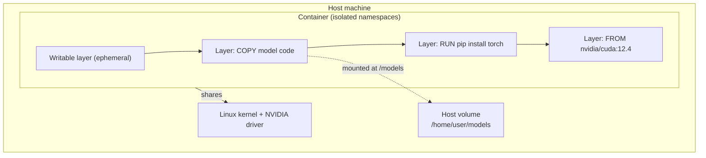

# Docker for AI

## Learning Objectives

- Build a GPU-enabled Docker image with CUDA, PyTorch, and serving code from a Dockerfile
- Configure NVIDIA Container Toolkit to pass host GPUs into containers and verify access at runtime
- Mount host directories as volumes to persist model weights and datasets across container rebuilds
- Orchestrate multi-service AI stacks with Docker Compose using inter-service DNS resolution
- Compare image sizes between single-stage and multi-stage Dockerfiles and identify which layers dominate

## The Problem

You trained a model on your laptop with PyTorch 2.3, CUDA 12.4, and Python 3.12. The inference server dies on staging because the staging box has CUDA 12.1 and PyTorch 2.2. The error message is a stack trace referencing `libcudart.so.12` version mismatch — not something the model code can catch or fix. Your colleague's machine has a different GPU driver entirely. None of these failures are in your Python code. They are all in the gap between "my environment" and "the deployment target."

AI projects are dependency nightmares at three layers: the Python package layer (torch, transformers, flash-attn), the CUDA toolkit layer (cuDNN, cuBLAS, NCCL), and the system layer (glibc, NVIDIA driver, kernel modules). A version skew at any layer can crash inference silently or produce different outputs than training. The same model weights produce different logits on CUDA 11.8 versus 12.4 due to floating-point differences in the kernel implementations. This is not a theoretical concern — it is the reason your A/B test results don't match your offline evaluation.

Docker solves this by packaging the entire runtime stack — Python interpreter, CUDA libraries, system-level C dependencies, and your model code — into a single immutable artifact called an image. The image runs identically on every host that has the same kernel and NVIDIA driver. Everything else travels with the container.

## The Concept

### Layer 1: Container fundamentals for AI workloads

A container is a namespace-isolated process that shares the host kernel but carries its own filesystem, network stack, and process space. Unlike a virtual machine, there is no guest OS — the container uses the host's kernel directly, which is why it starts in under a second instead of minutes. For AI workloads, this means you bundle Python, PyTorch, CUDA runtime libraries, cuDNN, and your model code into one filesystem image.

The mechanism is a **union filesystem**. A Docker image is a stack of read-only layers. Each instruction in a Dockerfile (`FROM`, `RUN`, `COPY`) creates a new layer. When you run a container, Docker adds a thin writable layer on top. If your process writes to `/tmp/output.json`, that write goes into the writable layer and is lost when the container stops. This is why model weights need volume mounts — they live on the host filesystem, not in the container's ephemeral writable layer.



### Layer 2: GPU passthrough

Containers do not contain GPUs. A container is just a Linux process with extra isolation flags — it has no hardware of its own. When a containerized PyTorch process calls `torch.cuda.is_available()`, it is checking whether the host's GPU is accessible from inside the container's namespace.

The NVIDIA Container Toolkit (`nvidia-container-toolkit`) is the bridge. At container start, the Docker runtime calls a hook provided by the toolkit. The hook mounts the host's NVIDIA device files (`/dev/nvidia0`, `/dev/nvidiactl`, `/dev/nvidia-uvm`) into the container's `/dev` namespace. It also injects the matching driver libraries into the container's library path. The critical detail: the container uses the **host's GPU driver** (kernel module) but its **own CUDA toolkit version** (userspace libraries bundled in the image). This is why a CUDA 12.4 container runs on a host with driver version 550.x — the driver is shared, the toolkit is not.

You request GPU access in two ways. With plain Docker, you pass `--gpus all` or `--gpus '"device=0,1"'`. With Docker Compose, you declare a device reservation under `deploy.resources.reservations.devices`. Both tell the runtime to invoke the NVIDIA hook during container creation.

### Layer 3: Image sizing

AI base images are large. `nvidia/cuda:12.4.1-cudnn-runtime-ubuntu22.04` is approximately 3.5 GB. Add PyTorch with CUDA support and you are at 6–8 GB. Add transformers, flash-attn (which compiles CUDA kernels at install time and needs `gcc`, `ninja-build`, and CUDA development headers), and you are at 10+ GB. Every `docker push` and `docker pull` moves that much data.

Multi-stage builds address this by separating the build environment from the runtime environment. You declare a `builder` stage with `FROM nvidia/cuda:12.4.1-cudnn-devel-ubuntu22.04` (the `-devel` tag includes compilers and headers), compile or install heavy dependencies, then copy only the artifacts to a final stage based on the `-runtime` tag (which omits compilers). The mechanism: each `FROM` starts a new build stage with its own layer stack. `COPY --from=builder /path /path` pulls files between stages without carrying the builder's layers into the final image.

### Layer 4: Compose for AI stacks

A real AI serving stack is rarely a single container. You have a model server (FastAPI, vLLM, TGI), a vector database (Qdrant, Milvus, pgvector), a cache or queue (Redis, RabbitMQ), and sometimes a GPU-side embedding service. Docker Compose declares each of these as a service in a single `compose.yaml` file.

The mechanism: `docker compose up` reads the file, creates a user-defined bridge network, starts each container on that network, and registers each service name as a DNS hostname. Your FastAPI container can reach Redis at `redis:6379` — no IP addresses, no environment variables for hostnames. You declare GPU reservations, volume mounts for model weights, port mappings, and inter-service dependencies (`depends_on`) in the same file.

## Build It

You are going to build a GPU-enabled inference container from scratch. Every piece here runs and produces observable output. You need Docker and the NVIDIA Container Toolkit installed on a machine with an NVIDIA GPU. If you do not have a GPU, the code still runs — it falls back to CPU and prints that fact.

Start with the project structure:

```
docker-ai/
├── Dockerfile
├── app.py
├── verify_gpu.py
├── compose.yaml
└── models/
    └── .gitkeep
```

The Dockerfile uses a CUDA base image, installs Python and PyTorch, and copies the inference code:

```dockerfile
FROM nvidia/cuda:12.4.1-cudnn-runtime-ubuntu22.04

RUN apt-get update \
    && apt-get install -y python3.10 python3-pip \
    && rm -rf /var/lib/apt/lists/*

RUN ln -sf /usr/bin/python3 /usr/bin/python

RUN pip install --no-cache-dir \
    torch==2.3.0 \
    fastapi==0.111.0 \
    uvicorn[standard]==0.30.1 \
    pydantic==2.7.1

WORKDIR /app
COPY app.py verify_gpu.py ./

RUN mkdir -p /models

EXPOSE 8000

CMD ["python", "-m", "uvicorn", "app:app", "--host", "0.0.0.0", "--port", "8000"]
```

The GPU verification script. Run this inside the container to confirm that GPU passthrough is working and that PyTorch can see the device:

```python
import torch

print(f"PyTorch version: {torch.__version__}")
print(f"CUDA available: {torch.cuda.is_available()}")

if torch.cuda.is_available():
    print(f"GPU device: {torch.cuda.get_device_name(0)}")
    print(f"CUDA version: {torch.version.cuda}")
    print(f"Device count: {torch.cuda.device_count()}")

    x = torch.tensor([1.0, 2.0, 3.0]).cuda()
    y = x * 2
    print(f"Input tensor:  {x.cpu().tolist()}")
    print(f"Output tensor: {y.cpu().tolist()}")
    print(f"Tensor device: {x.device}")
else:
    print("No GPU detected — running CPU-only")
    x = torch.tensor([1.0, 2.0, 3.0])
    y = x * 2
    print(f"Input tensor:  {x.tolist()}")
    print(f"Output tensor: {y.tolist()}")
```

The FastAPI inference server. It loads a simple linear model on GPU at startup and serves predictions. The `/health` endpoint confirms GPU status so you can verify the container is wired correctly:

```python
from fastapi import FastAPI
from pydantic import BaseModel
import torch

app = FastAPI(title="Docker AI Inference Server")

device = torch.device("cuda" if torch.cuda.is_available() else "cpu")

model = torch.nn.Sequential(
    torch.nn.Linear(10, 32),
    torch.nn.ReLU(),
    torch.nn.Linear(32, 1),
).to(device)

model.eval()

torch.manual_seed(42)
with torch.no_grad():
    for param in model.parameters():
        param.add_(torch.randn_like(param) * 0.01)

class PredictionRequest(BaseModel):
    features: list[float]

class PredictionResponse(BaseModel):
    prediction: float
    device: str

@app.get("/health")
def health():
    gpu_name = torch.cuda.get_device_name(0) if torch.cuda.is_available() else "none"
    return {
        "status": "ok",
        "device": str(device),
        "gpu": gpu_name,
        "cuda_available": torch.cuda.is_available(),
    }

@app.post("/predict", response_model=PredictionResponse)
def predict(request: PredictionRequest):
    x = torch.tensor(request.features, dtype=torch.float32).to(device)
    with torch.no_grad():
        output = model(x).squeeze()
    return PredictionResponse(prediction=float(output), device=str(device))

if __name__ == "__main__":
    import uvicorn
    uvicorn.run(app, host="0.0.0.0", port=8000)
```

Build and run the GPU verification script:

```bash
docker build --target=verify -t ai-verify . -f- <<'EOF'
FROM nvidia/cuda:12.4.1-cudnn-runtime-ubuntu22.04 AS verify
RUN apt-get update && apt-get install -y python3.10 python3-pip && rm -rf /var/lib/apt/lists/*
RUN pip install --no-cache-dir torch==2.3.0
WORKDIR /app
COPY verify_gpu.py .
CMD ["python3", "verify_gpu.py"]
EOF

docker run --rm --gpus all ai-verify
```

Expected output:

```
PyTorch version: 2.3.0
CUDA available: True
GPU device: NVIDIA GeForce RTX 4090
CUDA version: 12.4
Device count: 1
Input tensor:  [1.0, 2.0, 3.0]
Output tensor: [2.0, 4.0, 6.0]
Tensor device: cuda:0
```

Now build the full inference server and test it:

```bash
docker build -t ai-inference .

docker run --rm --gpus all -p 8000:8000 -v $(pwd)/models:/models ai-inference
```

In another terminal, verify the server:

```bash
curl http://localhost:8000/health
```

Expected output:

```json
{"status":"ok","device":"cuda","gpu":"NVIDIA GeForce RTX 4090","cuda_available":true}
```

Test a prediction:

```bash
curl -X POST http://localhost:8000/predict \
  -H "Content-Type: application/json" \
  -d '{"features":[0.1,0.2,0.3,0.4,0.5,0.6,0.7,0.8,0.9,1.0]}'
```

Expected output:

```json
{"prediction":0.03421689879894257,"device":"cuda"}
```

Finally, the Compose file that declares the inference server and Redis as a two-service stack:

```yaml
services:
  inference:
    build: .
    ports:
      - "8000:8000"
    deploy:
      resources:
        reservations:
          devices:
            - driver: nvidia
              count: 1
              capabilities: [gpu]
    volumes:
      - ./models:/models
    depends_on:
      - redis
    environment:
      - REDIS_URL=redis://redis:6379

  redis:
    image: redis:7-alpine
    ports:
      - "6379:6379"
```

Start the full stack:

```bash
docker compose up --build
```

The inference service reaches Redis at `redis:6379` — that hostname resolves because Compose created a bridge network and registered both services on it. Verify both services are running:

```bash
docker compose ps
```

Expected output:

```
NAME                       IMAGE               STATUS         PORTS
docker-ai-inference-1      docker-ai-inference  Up             0.0.0.0:8000->8000/tcp
docker-ai-redis-1          redis:7-alpine      Up             0.0.0.0:6379->6379/tcp
```

## Use It

The GTM infrastructure cluster — specifically cold email and outbound deliverability infrastructure (Handbook §1.4) — has the exact same containerization problem as AI serving. An outbound stack includes a Python enrichment pipeline that calls Apollo, ZoomInfo, and 6sense APIs; a lead-scoring model that runs inference on enriched data; a Salesforce sync worker that writes results via `simple-salesforce`; and potentially multiple SMTP relay agents running on different IP addresses with different DKIM/SPF configurations. Each component has its own Python dependency tree, its own API client versions, and its own rate-limiting logic. Running them on the same host without isolation creates dependency conflicts — the `requests` version that ZoomInfo's SDK needs clashes with the one Salesforce's SDK expects.

Docker Compose is the deployment unit for this stack. Each outbound component becomes a service in `compose.yaml`, just like the inference server and Redis in the Build It example. The enrichment pipeline is a container with its own `requests`, `httpx`, and API client libraries. The lead-scoring model is the same FastAPI inference server you just built — it loads model weights from a volume mount and serves predictions at `/predict`. The Salesforce sync worker is a container with `simple-salesforce` and its own credential injection. They communicate over the Compose bridge network, and you scale individual services by changing `deploy.replicas` or running `docker compose up --scale enrichment=3`.

The container image is also the reproducibility boundary for outbound infrastructure. Cold email deliverability depends on precise DNS configurations (SPF, DKIM, DMARC records), IP reputation, and sending domain warmup state. If your email-sending agent's behavior changes because someone updated the `aiosmtplib` package on the host, your deliverability metrics shift and you cannot reproduce the previous sending pattern. Containerizing the email agent locks the sending logic, the library versions, and the configuration into one image tagged with a semantic version. When deliverability drops, you diff the image tags — not the host's `pip freeze`.

A practical pattern for GTM teams: build the lead-scoring container exactly as shown above, mount a volume with the model weights and the enriched lead data, and point the prediction endpoint at incoming leads. The `/health` endpoint confirms GPU availability before you route traffic. The volume mount means you can swap model weights without rebuilding the image — just replace the file on the host and restart the container. This is the same hot-swap pattern used for AI model deployment in production inference clusters.

## Ship It

Production deployment of containerized AI services introduces three concerns that local development does not exercise: image distribution, GPU scheduling on shared hosts, and version rollback.

**Image distribution.** Your local image exists only on your build machine. To deploy it, you push to a registry — Docker Hub, Amazon ECR, Google Artifact Registry, or a private registry. The registry stores each layer separately and deduplicates across images. When you push a new version that changes only the `COPY app.py` layer (the last layer), the registry transfers only that layer — typically kilobytes, not gigabytes. Tag images with semantic versions, not `latest`:

```bash
docker tag ai-inference your-registry.com/ai-inference:1.2.0
docker tag ai-inference your-registry.com/ai-inference:1.2.0-$(git rev-parse --short HEAD)
docker push your-registry.com/ai-inference:1.2.0
```

**Multi-stage builds for smaller images.** The Dockerfile in Build It uses the `-runtime` CUDA base, which omits compilers. But if you need `flash-attn` — which compiles CUDA kernels at install time — you need a builder stage with the `-devel` base (which includes `nvcc`, `gcc`, and CUDA headers). You compile in the builder, copy the installed wheel, and the final image stays small:

```dockerfile
FROM nvidia/cuda:12.4.1-cudnn-devel-ubuntu22.04 AS builder

RUN apt-get update \
    && apt-get install -y python3.10 python3-pip python3.10-dev \
    && rm -rf /var/lib/apt/lists/*

RUN pip install --user --no-cache-dir \
    torch==2.3.0 \
    flash-attn==2.5.8 --no-build-isolation

FROM nvidia/cuda:12.4.1-cudnn-runtime-ubuntu22.04

RUN apt-get update \
    && apt-get install -y python3.10 \
    && rm -rf /var/lib/apt/lists/*

COPY --from=builder /root/.local /root/.local

ENV PATH=/root/.local/bin:$PATH
ENV PYTHONPATH=/root/.local/lib/python3.10/site-packages

RUN pip install --no-cache-dir fastapi==0.111.0 uvicorn[standard]==0.30.1 pydantic==2.7.1

WORKDIR /app
COPY app.py ./

CMD ["python3", "-m", "uvicorn", "app:app", "--host", "0.0.0.0", "--port", "8000"]
```

Compare image sizes:

```bash
docker images --format "table {{.Repository}}\t{{.Tag}}\t{{.Size}}" | grep ai-inference
```

The multi-stage image is typically 1–2 GB smaller than the single-stage equivalent because the final image does not carry `gcc`, `nvcc`, or Python development headers.

**GPU scheduling.** On a host with multiple GPUs, `--gpus all` gives the container access to every GPU. For production, pin specific devices so containers do not contend for the same GPU memory. In Compose, use `count: 1` (lets the runtime pick any free GPU) or specify `device_ids: ["0"]` to pin. For multi-tenant GPU hosts, Kubernetes with the NVIDIA GPU Operator handles scheduling — but that is a separate lesson. The container pattern remains identical: the image is the same, only the orchestrator changes.

**Rollback.** Because each image version is immutable and tagged, rollback is pulling and running the previous tag. If version 1.2.0 produces degraded inference (wrong logits, OOM on longer sequences), `docker run your-registry.com/ai-inference:1.1.4` restores the previous runtime in seconds. This is the same version discipline that applies to outbound infrastructure — if a new enrichment container version produces different lead scores, you roll back to the previous image tag and investigate the diff.

## Exercises

**Exercise 1: Swap the CUDA base.** Change the Dockerfile's `FROM` line from `nvidia/cuda:12.4.1-cudnn-runtime-ubuntu22.04` to `nvidia/cuda:12.1.1-cudnn-runtime-ubuntu22.04`. Rebuild, run `verify_gpu.py`, and observe what changes. Specifically: does PyTorch still install? Does `torch.cuda.is_available()` return True? What CUDA version does `torch.version.cuda` report? Write down the image size difference.

**Exercise 2: Add a volume for model weights.** Create a file `models/config.json` on your host with `{"model_name": "linear-test", "version": "0.1"}`. Modify `app.py` to read this file at startup and include the model name in the `/health` response. Rebuild and run with `-v $(pwd)/models:/models`. Confirm the health endpoint returns the config. Then change the JSON on the host (without rebuilding the image) and restart the container — confirm the new config is picked up. This demonstrates the hot-swap pattern.

**Exercise 3: Add a worker service.** Extend `compose.yaml` with a third service: a Python worker that reads prediction requests from a Redis queue, calls the inference server's `/predict` endpoint, and writes results back to Redis. You need a queue producer (a script that pushes JSON requests to a Redis list) and a consumer (a script that pops requests, calls the API, and pushes responses). Verify the full flow: producer pushes, worker pulls, worker calls inference, worker pushes result.

**Exercise 4: Multi-stage size analysis.** Build both the single-stage Dockerfile (from Build It) and the multi-stage Dockerfile (from Ship It). Run `docker history <image>` on each and identify which layers dominate the image size. Calculate the percentage saved by multi-stage build. The `docker history` output shows each layer's size — the `RUN apt-get install` and `RUN pip install torch` layers should be the largest.

**Exercise 5: CPU-only fallback.** Modify the Dockerfile to build a separate CPU-only image that does not require the NVIDIA runtime. Use a build argument (`ARG VARIANT=cuda`) to switch between `nvidia/cuda` and `python:3.10-slim` base images. Build both variants and confirm that `verify_gpu.py` prints "No GPU detected — running CPU-only" for the slim variant. This is the pattern for building images that run on both GPU and non-GPU hosts.

## Key Terms

**Container** — A namespace-isolated Linux process that shares the host kernel but carries its own filesystem, network, and process space. Starts in under a second because there is no guest OS boot.

**Image** — A read-only stack of filesystem layers. The build artifact. Each Dockerfile instruction creates one layer. Images are immutable — you tag new versions, you do not edit existing ones.

**Layer** — A filesystem diff produced by one Dockerfile instruction. Stored as a tar archive. Layers are shared across images and deduplicated by the registry during push/pull.

**Union filesystem** — The mechanism that stacks read-only layers and presents them as a single filesystem to the container. OverlayFS is the default on modern Docker installations.

**NVIDIA Container Toolkit** — A set of hooks (`nvidia-container-toolkit`, `nvidia-container-runtime`) that the Docker runtime calls at container start to mount host GPU device files and driver libraries into the container's namespace.

**Volume mount** — A host directory or Docker-managed volume mapped into the container's filesystem. Bypasses the union filesystem — reads and writes go directly to the host. Used for model weights, datasets, and output persistence.

**Multi-stage build** — A