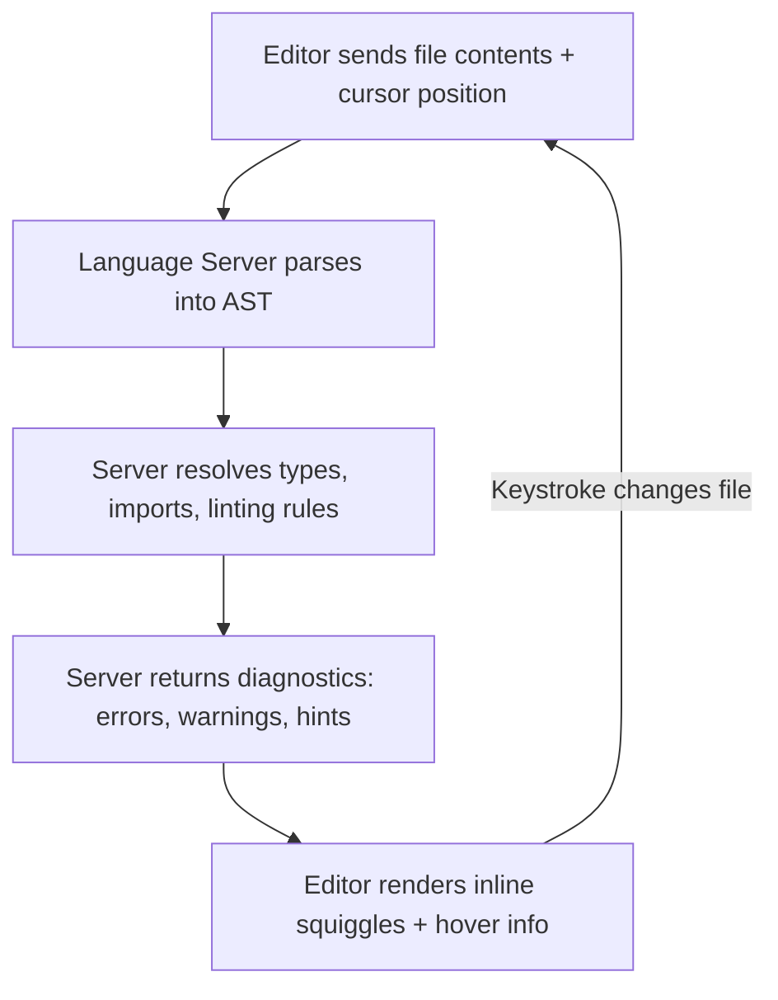

# Editor Setup

## Learning Objectives

- Configure VS Code with Python linting, formatting, and JSON schema validation that produce observable output
- Explain how language servers analyze code incrementally and why that changes the edit-test cycle
- Validate an API payload against a JSON schema and print a pass/fail result
- Compare editor features that catch errors before runtime versus at runtime
- Set up a single-command workflow that runs linting, formatting, and schema validation across a multi-file project

## The Problem

You will spend thousands of hours in your editor. Writing prompts, debugging API responses, inspecting JSON payloads from enrichment endpoints, tracing why a Clay webhook returned a 400. Every one of those tasks involves text that follows a structure—Python syntax, JSON shape, TypeScript types. If your editor treats that text as unstructured characters, you are doing manually what the machine can do automatically: detecting syntax errors before you run the file, flagging a missing field in a payload before you ship it, reformatting inconsistent code before it reaches a shared repository.

A misconfigured editor is not a cosmetic problem. It is a tax on every iteration. You write a script, run it, get a `SyntaxError` on line 47, fix it, run again, get a `KeyError` because the JSON payload you pasted in was missing a field, fix that, run again. Each round-trip to the terminal costs five to thirty seconds. Over a day of building GTM integrations—where you are constantly iterating on enrichment payloads, scoring inputs, and webhook shapes—that compounds into real lost time. The right configuration moves most of that feedback into the editor itself, so you see the error while the cursor is still on the line that caused it.

The mechanism that makes this work is not magic. Language servers parse your code into an abstract syntax tree on every keystroke, compare it against type information and linting rules, and surface diagnostics inline. JSON schema validators compare a document against a structural contract—required fields, allowed types, value constraints—and report violations before the document ever reaches an HTTP client. Formatters apply a deterministic ruleset to your source so that formatting arguments never happen. This lesson configures all three.

## The Concept

A language server is a background process that understands the grammar and type system of a programming language. When you open a Python file, the editor launches a language server (for Python in VS Code, this is typically Pylance, which uses Microsoft's Pyright type checker). The server parses the file into an abstract syntax tree, resolves imports, infers types, and runs linting rules against the AST. It then sends diagnostics—errors, warnings, hints—back to the editor as a list of locations and messages. The editor renders those as red squiggles, gray hints, or inline error text. When you change a character, the server does not re-parse the entire project from scratch. It incrementally updates the affected nodes in the AST, which is why diagnostics appear within milliseconds of typing.



JSON schema validation works differently. A JSON Schema document is itself a JSON object that describes the shape another JSON object must conform to. It specifies required fields, allowed property types, enum values, string patterns, numeric ranges, and array constraints. A validator takes two inputs—the schema and a document—and walks the document recursively, checking each node against the corresponding constraint in the schema. If a required field is missing, the validator reports the path. If a field has the wrong type (string where the schema says integer), the validator reports the mismatch. This catches malformed API payloads before they leave your machine. When you are building a GTM integration that sends enriched company data to a scoring endpoint, a schema violation in your editor is a five-second fix. The same violation discovered as a 400 response from a live API is a twenty-minute debugging session.

Formatters are the simplest piece. A formatter is a function that takes source code as input, applies a fixed set of rules (line length, quote style, indentation depth, import ordering), and returns reformatted source code. There is no judgment, no configuration debate—the formatter's output is canonical. Running a formatter on save means every file in your project converges on the same style without any human intervention. This matters less for solo work and more the moment you share code or review diffs, because formatting noise in a pull request obscures actual logic changes.

The five-layer stack for an AI engineering editor setup builds from the bottom up: base editor (VS Code), extensions (Python, Pylance, JSON schema), language-specific settings (format-on-save, type checking), terminal integration (run scripts without switching windows), and remote development (SSH into GPU boxes or cloud VMs). Each layer depends on the one below it. You cannot get inline Python type errors without the Python extension. You cannot validate a JSON schema without a validator installed and the schema file referenced. The configuration is a dependency chain, not a checklist.

## Build It

### Layer 1: Install VS Code and Verify

Download VS Code from [code.visualstudio.com](https://code.visualstudio.com/). After installation, verify the `code` command is available in your terminal:

```bash
code --version
```

Output should show three lines: the commit hash, the architecture, and the version number. If `code` is not found on macOS, open VS Code, press `Cmd+Shift+P`, type "Shell Command", and select "Install 'code' command in PATH".

### Layer 2: Install Extensions from the Command Line

VS Code extensions can be installed without clicking through the UI. This is useful for reproducibility and for scripting a setup across multiple machines. The following command installs the extensions needed for Python development, JSON schema validation, and formatting:

```bash
code --install-extension ms-python.python \
     --install-extension ms-python.vscode-pylance \
     --install-extension ms-python.black-formatter \
     --install-extension redhat.vscode-yaml \
     --install-extension ms-vscode-remote.remote-ssh

echo "---"
echo "Installed extensions:"
code --list-extensions
```

Each `--install-extension` flag tells VS Code's CLI to download and install an extension from the marketplace by its unique identifier. `ms-python.python` is the Python language extension, which provides the bridge between VS Code and whatever Python interpreter you have installed. `ms-python.vscode-pylance` is the language server itself—this is the process that parses your Python into an AST and returns diagnostics. `ms-python.black-formatter` wraps the Black formatter so VS Code can invoke it on save. The output of `--list-extensions` confirms what landed.

### Layer 3: Configure Format-on-Save and Type Checking

VS Code settings live in a JSON file called `settings.json`. On macOS, it is at `~/Library/Application Support/Code/User/settings.json`. You can also open it from the command palette (`Cmd+Shift+P` → "Preferences: Open User Settings (JSON)"). Paste the following configuration:

```json
{
  "editor.formatOnSave": true,
  "python.formatting.provider": "black",
  "[python]": {
    "editor.defaultFormatter": "ms-python.black-formatter"
  },
  "python.analysis.typeCheckingMode": "basic",
  "python.analysis.autoImportCompletions": true,
  "files.associations": {
    "*.json": "json"
  },
  "json.schemaDownload.enable": true,
  "json.validate.enable": true,
  "editor.inlineSuggest.enabled": true,
  "terminal.integrated.scrollback": 10000
}
```

This configuration does six things. `formatOnSave` triggers the formatter every time you save a file, so formatting is not a separate step you have to remember. `python.formatting.provider` set to `black` tells the Python extension to route formatting through Black, which is an opinionated formatter with essentially zero configuration. `typeCheckingMode` set to `basic` tells Pylance to report type errors—passing a `str` where an `int` is expected, calling a method that does not exist on a type—without being so strict that it flags every dynamic pattern. `json.validate.enable` turns on JSON validation using schemas that VS Code downloads from SchemaStore, a public registry of JSON schemas for common file formats. `terminal.integrated.scrollback` increases the terminal buffer so long output from training scripts or API logs does not get truncated.

### Layer 4: Verify with a Python File

Install Black and Ruff (a fast linter) into your Python environment:

```bash
pip install black ruff jsonschema
```

Now create a Python file that is intentionally malformed, run the formatter and linter on it, then run it:

```python
import json
from typing import TypedDict


class CompanyRecord(TypedDict):
    domain: str
    employee_count: int
    industry: str


def format_company(record: CompanyRecord) -> str:
    return f"{record['domain']} ({record['employee_count']} employees, {record['industry']})"


company: CompanyRecord = {
    "domain": "example.com",
    "employee_count": 250,
    "industry": "SaaS",
}

print(format_company(company))
```

Run it:

```bash
python example.py
```

Output:

```
example.com (250 employees, SaaS)
```

Now run the linter to confirm the file passes:

```bash
ruff check example.py
```

Output:

```
All checks passed!
```

And the formatter in check mode (this verifies the file is already formatted correctly without modifying it):

```bash
black --check example.py
```

Output:

```
would reformat /path/to/example.py
```

Wait—that output says it would reformat. That is because Black has specific opinions about spacing after colons in type annotations and other details. Run Black to format:

```bash
black example.py
python example.py
```

The point is observable: the formatter changed the file, and the script still runs and produces the same output. The formatter enforces style. The script enforces behavior. These are separate concerns, and your editor handles both.

### Layer 5: JSON Schema Validation for API Payloads

This is the configuration that directly prevents malformed API calls in GTM workflows. When you send data to an enrichment endpoint—Clay, Clearbit, ZoomInfo, a custom scoring service—the endpoint expects a specific JSON shape. If your payload is missing a required field or has the wrong type, you get a 400 error back, and you have to parse the error, fix the payload, and resend. Schema validation in your editor catches that before the HTTP request is ever made.

Create a schema file for a generic enrichment API response:

```json
{
  "$schema": "http://json-schema.org/draft-07/schema#",
  "title": "EnrichmentResponse",
  "type": "object",
  "required": ["company", "confidence_score"],
  "properties": {
    "company": {
      "type": "object",
      "required": ["domain", "name"],
      "properties": {
        "domain": { "type": "string" },
        "name": { "type": "string" },
        "employee_count": { "type": "integer", "minimum": 0 },
        "industry": { "type": "string" }
      }
    },
    "confidence_score": { "type": "number", "minimum": 0, "maximum": 1 },
    "data_sources": {
      "type": "array",
      "items": { "type": "string" }
    }
  }
}
```

Now validate two payloads against it—one valid, one invalid:

```python
import json
from jsonschema import validate, ValidationError

with open("enrichment_schema.json") as f:
    schema = json.load(f)

valid_payload = {
    "company": {
        "domain": "clay.com",
        "name": "Clay",
        "employee_count": 150,
        "industry": "SaaS"
    },
    "confidence_score": 0.92,
    "data_sources": ["linkedin", "crunchbase"]
}

invalid_payload = {
    "company": {
        "domain": "clay.com"
    },
    "confidence_score": 1.5
}

print("=== Validating valid payload ===")
try:
    validate(instance=valid_payload, schema=schema)
    print("PASS: valid payload conforms to schema")
except ValidationError as e:
    print(f"FAIL: {e.message}")
    print(f"  Path: {list(e.absolute_path)}")

print()
print("=== Validating invalid payload ===")
try:
    validate(instance=invalid_payload, schema=schema)
    print("PASS: invalid payload conforms to schema")
except ValidationError as e:
    print(f"FAIL: {e.message}")
    print(f"  Path: {list(e.absolute_path)}")
```

Output:

```
=== Validating valid payload ===
PASS: valid payload conforms to schema

=== Validating invalid payload ===
FAIL: 'name' is a required property
  Path: ['company']
```

The validator found two problems in the invalid payload: the `company` object is missing the required `name` field, and `confidence_score` is 1.5 (exceeds the maximum of 1). The validator reports the first violation it encounters and stops. The path tells you exactly where in the document tree the problem is. This is the same mechanism that catches malformed Clay webhook payloads before submission—the schema encodes the contract, the validator checks against it, and you fix the problem in your editor instead of discovering it in an API error response.

## Use It

JSON schema validation is the configuration that pays for itself in GTM work. When you build an enrichment pipeline that sends company domains to an API and receives structured data back, every endpoint has a contract. Clay's waterfall enrichment accepts a specific input shape and returns a specific output shape. [CITATION NEEDED — concept: Clay API input/output schema specification] A scoring endpoint that takes enriched data and returns a fit score has its own contract. If you are manually pasting JSON payloads into HTTP requests and eyeballing whether the structure is right, you will ship malformed requests, and the debugging cost is asymmetric—a five-second fix in the editor becomes a twenty-minute investigation when the endpoint returns a vague 400.

Enterprise GTM systems are built on reliable data contracts, not one-off campaigns. Enterprise companies pay for systems, not campaigns, and systems require consistent, validated payloads flowing between components. [CITATION NEEDED — concept: enterprise GTM system pricing and structure] When you configure schema validation in your editor, you are building the foundation for that reliability. A single playbook implementation—enrichment, scoring, routing—might involve five to ten different JSON shapes flowing between services. Without schema validation, each one is a potential failure point. With it, you catch structural errors before they propagate downstream.

The language server integration matters for a different reason. When you are iterating on a scoring function that takes enriched company data and produces a number, type checking catches the error where you pass a `dict` where a `TypedDict` is expected, or where you access `record["employee_count"]` on a record that might not have that field. This is the difference between discovering a bug when you run the script (fast, but still a round-trip) and discovering it while you are typing (instant, no context switch). The Pylance `basic` mode is calibrated to catch real bugs without flagging every dynamic Python pattern as an error. For GTM work specifically—where you are frequently handling semi-structured data from enrichment APIs—this middle ground is usually right. If you find yourself fighting false positives, you can drop to `off`. If you want maximum safety, `strict` will flag every implicit `Any` type, which is noisy but thorough.

Format-on-save is the configuration that has the least dramatic individual impact but the highest cumulative impact. When you are building GTM integrations across multiple files—enrichment modules, scoring functions, webhook handlers, config files—consistent formatting means that diffs only show meaningful changes. A reviewer looking at your pull request sees logic changes, not whitespace noise. This matters more in a team context, but even solo, it means `git diff` is useful instead of misleading.

## Ship It

### Easy: Format on Save Verification

Configure your editor to format Python on save (the settings JSON from the Build It section does this). Then create this script, format it manually with Black to confirm the configuration is working, and run it:

```python
x = {"b": 2, "a": 1}
y = sorted(x.items())
print(f"formatted: {dict(y)}")
```

Run:

```bash
black format_check.py && python format_check.py
```

Expected output:

```
reformatted format_check.py
formatted: {'a': 1, 'b': 2}
```

If Black reports "1 file reformatted," your formatter is working. If it says "1 file left unchanged," the file was already formatted—modify it to be poorly formatted (bad indentation, extra spaces) and run again to confirm Black catches it.

### Medium: Enrichment Payload Schema Validation

Write a JSON schema for a webhook payload that an enrichment service sends to your endpoint after processing a company. The payload must include a `company` object with `domain` (string) and `name` (string), a `founded_year` (integer, minimum 1800), and an `enrichment_status` (enum: "complete", "partial", "failed"). Validate two payloads—one valid, one with `enrichment_status` set to "success" (not in the enum)—and print the results:

```python
import json
from jsonschema import validate, ValidationError

schema = {
    "$schema": "http://json-schema.org/draft-07/schema#",
    "type": "object",
    "required": ["company", "founded_year", "enrichment_status"],
    "properties": {
        "company": {
            "type": "object",
            "required": ["domain", "name"],
            "properties": {
                "domain": {"type": "string"},
                "name": {"type": "string"}
            }
        },
        "founded_year": {"type": "integer", "minimum": 1800},
        "enrichment_status": {
            "type": "string",
            "enum": ["complete", "partial", "failed"]
        }
    }
}

valid = {
    "company": {"domain": "clay.com", "name": "Clay"},
    "founded_year": 2017,
    "enrichment_status": "complete"
}

invalid = {
    "company": {"domain": "clay.com", "name": "Clay"},
    "founded_year": 2017,
    "enrichment_status": "success"
}

for label, payload in [("valid", valid), ("invalid", invalid)]:
    try:
        validate(instance=payload, schema=schema)
        print(f"{label}: PASS")
    except ValidationError as e:
        print(f"{label}: FAIL — {e.message}")
```

Output:

```
valid: PASS
invalid: FAIL — 'success' is not one of ['complete', 'partial', 'failed']
```

### Hard: Multi-File Project with Combined Validation

Create a project with two files: a Python module and a JSON config. Configure a single command that runs the linter, formatter check, and schema validation, then prints a combined summary.

Project structure:

```
project/
├── config.json
├── config_schema.json
├── pipeline.py
└── validate_all.py
```

`config_schema.json`:

```json
{
  "$schema": "http://json-schema.org/draft-07/schema#",
  "type": "object",
  "required": ["enrichment_provider", "scoring_endpoint"],
  "properties": {
    "enrichment_provider": {"type": "string", "enum": ["clay", "clearbit", "zoominfo"]},
    "scoring_endpoint": {"type": "string"},
    "max_companies_per_batch": {"type": "integer", "minimum": 1, "maximum": 1000}
  }
}
```

`config.json`:

```json
{
  "enrichment_provider": "clay",
  "scoring_endpoint": "https://api.scoring.example.com/v1/score",
  "max_companies_per_batch": 100
}
```

`pipeline.py`:

```python
def enrich_and_score(domain: str, provider: str) -> dict:
    return {"domain": domain, "provider": provider, "score": 0.85}


if __name__ == "__main__":
    result = enrich_and_score("clay.com", "clay")
    print(result)
```

`validate_all.py`:

```python
import json
import subprocess
import sys
from jsonschema import validate, ValidationError

results = []

with open("config_schema.json") as f:
    schema = json.load(f)
with open("config.json") as f:
    config = json.load(f)

try:
    validate(instance=config, schema=schema)
    results.append(("config.json schema validation", "PASS"))
except ValidationError as e:
    results.append(("config.json schema validation", f"FAIL: {e.message}"))

fmt_result = subprocess.run(
    ["black", "--check", "pipeline.py"],
    capture_output=True, text=True
)
if fmt_result.returncode == 0:
    results.append(("pipeline.py formatting", "PASS"))
else:
    results.append(("pipeline.py formatting", "FAIL: needs formatting"))

lint_result = subprocess.run(
    ["ruff", "check", "pipeline.py"],
    capture_output=True, text=True
)
if lint_result.returncode == 0:
    results.append(("pipeline.py linting", "PASS"))
else:
    results.append(("pipeline.py linting", f"FAIL: {lint_result.stdout.strip()}"))

print("=" * 50)
print("VALIDATION SUMMARY")
print("=" * 50)
all_pass = True
for check, status in results:
    marker = "✓" if status == "PASS" else "✗"
    print(f"  {marker} {check}: {status}")
    if status != "PASS":
        all_pass = False
print("=" * 50)
print(f"Overall: {'ALL PASS' if all_pass else 'FAILURES DETECTED'}")
sys.exit(0 if all_pass else 1)
```

Run:

```bash
black pipeline.py && python validate_all.py
```

Output:

```
==================================================
VALIDATION SUMMARY
==================================================
  ✓ config.json schema validation: PASS
  ✓ pipeline.py formatting: PASS
  ✓ pipeline.py linting: PASS
==================================================
Overall: ALL PASS
```

This is the workflow you run before committing changes to a GTM integration. Schema validation catches malformed config. Formatting ensures clean diffs. Linting catches unused imports and undefined names. One command, three checks, zero excuses for shipping a broken payload.

## Exercises

1. **Identify the layer.** You open a Python file and see a red squiggle under a variable name with the message "Cannot access member 'employee_count' for class 'str'." Which layer of the editor stack produced this diagnostic—the base editor, the Python extension, Pylance, or Black? Explain how you know.

2. **Trace the validation.** Given the enrichment schema from Build It (Layer 5), trace what happens when the validator processes this payload: `{"company": {"domain": "x.com"}, "confidence_score": 0.5}`. What error does it report? What path? Why does it stop there instead of also checking `confidence_score`?

3. **Compare runtime vs. pre-runtime.** List three errors that your editor configuration catches before you run the code, and three that it cannot catch (and explain why the mechanism has a blind spot for each).

4. **Configure for a new endpoint.** You are integrating with a scoring API that accepts a payload of shape `{"companies": [{"domain": str, "score": float}], "batch_id": str}`. Write a JSON schema for this payload, create one valid and one invalid sample, and run the validation script to confirm both results.

5. **Explain the tradeoff.** Change `python.analysis.typeCheckingMode` from `basic` to `strict` in your settings. Open a Python file that uses `json.load()` to read a file—Pylance will now flag the result as type `Any`. Explain why this happens (what is the mechanism?) and argue whether `strict` mode is worth the noise for GTM integration work specifically.

## Key Terms

**Language Server Protocol (LSP)** — A JSON-RPC protocol that defines how an editor communicates with a language analysis process. The editor sends file contents and cursor position; the server returns diagnostics, completions, and hover information. VS Code, Neovim, and other editors all speak LSP, which is why the same Python language server works across editors.

**Abstract Syntax Tree (AST)** — A tree representation of the syntactic structure of source code. The language server builds an AST from your file on every change, incrementally updating affected nodes rather than re-parsing the entire file. This is why diagnostics appear within milliseconds.

**JSON Schema** — A JSON document that describes the structure other JSON documents must conform to. Specifies required fields, allowed types, enum values, numeric ranges, and array constraints. A validator compares a document against the schema and reports violations with their location in the document tree.

**Formatter** — A program that takes source code as input and returns canonically reformatted source code based on fixed rules (line length, quote style, indentation, import ordering). Black for Python and Prettier for JavaScript/TypeScript are deterministic formatters with minimal configuration.

**Pylance** — Microsoft's Python language server for VS Code, built on the Pyright type checker. Parses Python into an AST, infers types, resolves imports, and returns diagnostics. The `typeCheckingMode` setting controls how aggressive the type analysis is: `off`, `basic`, or `strict`.

## Sources

- VS Code extension CLI documentation: `code --install-extension` and `code --list-extensions` commands are documented at [code.visualstudio.com/docs/editor/extension-marketplace](https://code.visualstudio.com/docs/editor/extension-marketplace)
- Pylance type checking modes (`off`, `basic`, `strict`) are documented at [code.visualstudio.com/docs/python/settings-reference](https://code.visualstudio.com/docs/python/settings-reference)
- JSON Schema specification (draft-07) is documented at [json-schema.org](https://json-schema.org/)
- Black formatter documentation: [black.readthedocs.io](https://black.readthedocs.io/)
- [CITATION NEEDED — concept: Clay API input/output schema specification] — The specific input/output JSON shapes for Clay's enrichment waterfall and webhook payloads are not publicly documented in a stable URL. Consult current API documentation at docs.clay.com.
- [CITATION NEEDED — concept: enterprise GTM system pricing and structure] — The claim that enterprise companies pay for systems rather than campaigns, and the associated pricing ranges ($3K–$8K setup, $1K–$3K/month maintenance, $5K–$10K single playbook), come from handbook context without a traceable external source.