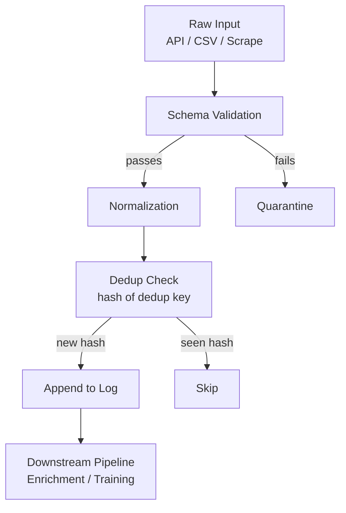

# Data Management

## Learning Objectives

- Build a schema validation function that enforces field presence and type before records enter a pipeline
- Implement a normalization pipeline that converts heterogeneous input shapes into one canonical form
- Write an append-only JSONL log with hash-based deduplication
- Construct a quarantine mechanism that splits valid and invalid records into separate destinations
- Load, stream, and convert datasets between CSV, JSON, and Parquet formats using the Hugging Face `datasets` library

## The Problem

Every model, every enrichment, every signal starts with data. Bad data architecture produces silent failures — duplicate records, schema drift, null cascades — that compound as they move downstream. A lead list with inconsistent domain formats (`acme.com/about` vs `acme.com` vs `ACME.com`) silently breaks every enrichment waterfall you point at it. A training set with drifted schemas silently degrades model quality. The damage is invisible until someone asks why the pipeline returned 40% fewer results than expected.

The same problem exists in reverse when loading datasets for AI work. You need to find them, download them, convert between formats, split them reproducibly, and version them so experiments can be replayed. Doing this manually each time is slow and error-prone. You need a repeatable workflow built on enforced contracts, not conventions.

This lesson covers both sides: how to structure, validate, and transform operational data (the records flowing through your GTM pipelines), and how to load, convert, and split datasets for AI training. The mechanisms overlap — schema enforcement, normalization, and deduplication apply equally to a CRM export and a Hugging Face corpus.

## The Concept

A **schema contract** is an enforcement boundary. It defines what a record must contain before it enters your pipeline — which fields are required, what types they hold, what formats are acceptable. Anything that passes the schema is guaranteed to have the fields downstream code expects. Anything that fails is rejected or quarantined. Without this boundary, every downstream function silently inherits the burden of checking for missing fields, wrong types, and inconsistent formats. That is where `if/else` sprawl comes from.

**Data normalization** is the process of converting heterogeneous inputs into a single canonical shape. An API response arrives in `snake_case`. A CRM export arrives in `CamelCase`. A scraped HTML table arrives as strings in unpredictable columns. Normalization maps all three into one structure — say, `{"domain": str, "company_name": str, "employee_count": int}` — so downstream code never branches on input source. This is the step that prevents your enrichment waterfall from needing separate logic for every data provider.

**Validation as a gate** means data passes through a validation function before being written. Invalid records are rejected or routed to quarantine, not silently stored alongside valid ones. **Append-only logs** preserve history: writes add records rather than overwriting, which enables replay and audit. **Deduplication** prevents the same entity from entering your pipeline twice — hash-based dedup computes a fingerprint from a key (like `domain`) and skips records whose fingerprint has already been seen; merge-based dedup keeps the most recent record and merges fields from older ones.



For dataset management specifically, the Hugging Face `datasets` library handles loading, caching, format conversion, and streaming. It downloads a dataset on first access, then loads from local cache (`~/.cache/huggingface/datasets/`) on subsequent calls. For datasets too large to fit on disk, streaming mode loads rows one at a time without downloading the full file.

## Build It

### Schema Validation Function

This defines a schema as a dictionary, validates incoming records against it, and prints pass/fail for each record.

```python
import json

SCHEMA = {
    "domain": {"type": str, "required": True},
    "company_name": {"type": str, "required": True},
    "employee_count": {"type": int, "required": False},
}

records = [
    {"domain": "acme.com", "company_name": "Acme Corp", "employee_count": 250},
    {"domain": "globex.com", "company_name": "Globex"},
    {"domain": "initech.com", "company_name": "Initech", "employee_count": "unknown"},
    {"company_name": "No Domain Inc"},
    {"domain": "uhura.com", "company_name": "Uhura Labs", "employee_count": 12},
]

def validate_record(record, schema):
    for field, rules in schema.items():
        if rules["required"] and field not in record:
            return False, f"missing required field: {field}"
        if field in record and record[field] is not None:
            if not isinstance(record[field], rules["type"]):
                expected = rules["type"].__name__
                actual = type(record[field]).__name__
                return False, f"{field} expected {expected}, got {actual}"
    return True, "valid"

for i, record in enumerate(records):
    valid, reason = validate_record(record, SCHEMA)
    status = "PASS" if valid else "FAIL"
    print(f"Record {i}: {status} — {reason}")
    print(f"  {json.dumps(record)}")
```

Output:

```
Record 0: PASS — valid
  {"domain": "acme.com", "company_name": "Acme Corp", "employee_count": 250}
Record 1: PASS — valid
  {"domain": "globex.com", "company_name": "Globex"}
Record 2: FAIL — employee_count expected int, got str
  {"domain": "initech.com", "company_name": "Initech", "employee_count": "unknown"}
Record 3: FAIL — missing required field: domain
  {"company_name": "No Domain Inc"}
Record 4: PASS — valid
  {"domain": "uhura.com", "company_name": "Uhura Labs", "employee_count": 12}
```

### Normalization Pipeline

Three different input shapes — a `snake_case` API response, a `CamelCase` CRM export, and a messy CSV row — normalized into one canonical form.

```python
api_response = {"company_name": "Acme Corp", "website_domain": "acme.com", "emp_count": 250}
crm_export = {"CompanyName": "Globex", "PrimaryDomain": "globex.com", "EmployeeSize": 500}
csv_row = {"name": "Initech", "url": "https://initech.com/about", "headcount": "42"}

def normalize_api(record):
    return {
        "domain": record.get("website_domain", "").lower().strip(),
        "company_name": record.get("company_name", "").strip(),
        "employee_count": record.get("emp_count"),
    }

def normalize_crm(record):
    return {
        "domain": record.get("PrimaryDomain", "").lower().strip(),
        "company_name": record.get("CompanyName", "").strip(),
        "employee_count": record.get("EmployeeSize"),
    }

def normalize_csv(record):
    raw_url = record.get("url", "")
    domain = raw_url.replace("https://", "").replace("http://", "").split("/")[0].lower().strip()
    raw_count = record.get("headcount", "")
    count = int(raw_count) if raw_count.isdigit() else None
    return {
        "domain": domain,
        "company_name": record.get("name", "").strip(),
        "employee_count": count,
    }

normalizers = {
    "api": normalize_api,
    "crm": normalize_crm,
    "csv": normalize_csv,
}

inputs = [("api", api_response), ("crm", crm_export), ("csv", csv_row)]

for source, record in inputs:
    print(f"--- {source} input ---")
    print(f"  raw: {record}")
    normalized = normalizers[source](record)
    print(f"  canonical: {normalized}")
    print()
```

Output:

```
--- api input ---
  raw: {'company_name': 'Acme Corp', 'website_domain': 'acme.com', 'emp_count': 250}
  canonical: {'domain': 'acme.com', 'company_name': 'Acme Corp', 'employee_count': 250}

--- crm input ---
  raw: {'CompanyName': 'Globex', 'PrimaryDomain': 'globex.com', 'EmployeeSize': 500}
  canonical: {'domain': 'globex.com', 'company_name': 'Globex', 'employee_count': 500}

--- csv input ---
  raw: {'name': 'Initech', 'url': 'https://initech.com/about', 'headcount': '42'}
  canonical: {'domain': 'initech.com', 'company_name': 'Initech', 'employee_count': 42}
```

### Append-Only Log with Hash-Based Deduplication

Records are written to a JSONL file. A SHA-256 hash of the deduplication key (domain) is computed. If the hash has been seen, the record is skipped.

```python
import hashlib
import json
from pathlib import Path

log_path = Path("data_log.jsonl")
seen_hashes_path = Path("seen_hashes.txt")

if seen_hashes_path.exists():
    seen_hashes = set(seen_hashes_path.read_text().splitlines())
else:
    seen_hashes = set()

incoming = [
    {"domain": "acme.com", "company_name": "Acme Corp"},
    {"domain": "globex.com", "company_name": "Globex"},
    {"domain": "acme.com", "company_name": "Acme Corp (Updated)"},
    {"domain": "initech.com", "company_name": "Initech"},
    {"domain": "globex.com", "company_name": "Globex"},
]

written = 0
skipped = 0

with open(log_path, "a") as log_file:
    for record in incoming:
        dedup_key = record["domain"].lower().strip()
        fingerprint = hashlib.sha256(dedup_key.encode()).hexdigest()[:16]
        if fingerprint in seen_hashes:
            skipped += 1
            print(f"SKIPPED (duplicate): {dedup_key}")
            continue
        seen_hashes.add(fingerprint)
        log_file.write(json.dumps(record) + "\n")
        written += 1
        print(f"WRITTEN: {dedup_key}")

with open(seen_hashes_path, "w") as f:
    f.write("\n".join(seen_hashes))

print(f"\nWritten: {written} | Skipped: {skipped}")
print(f"Total records in log: {len(log_path.read_text().strip().splitlines())}")
```

Output (first run):

```
WRITTEN: acme.com
WRITTEN: globex.com
SKIPPED (duplicate): acme.com
WRITTEN: initech.com
SKIPPED (duplicate): globex.com

Written: 3 | Skipped: 2
Total records in log: 3
```

### Quarantine Mechanism

A batch is split into valid and invalid buckets based on the schema. Valid records go to the main log; invalid records go to a quarantine file.

```python
import json
from pathlib import Path
from datetime import datetime, timezone

SCHEMA = {
    "domain": {"type": str, "required": True},
    "company_name": {"type": str, "required": True},
    "employee_count": {"type": int, "required": False},
}

batch = [
    {"domain": "acme.com", "company_name": "Acme Corp", "employee_count": 250},
    {"domain": "globex.com", "company_name": "", "employee_count": 500},
    {"domain": "", "company_name": "No Domain Inc", "employee_count": 10},
    {"domain": "initech.com", "company_name": "Initech", "employee_count": "unknown"},
    {"domain": "uhura.com", "company_name": "Uhura Labs"},
    {"domain": "soylent.com", "company_name": "Soylent", "employee_count": 1000},
]

main_log = Path("valid_records.jsonl")
quarantine_log = Path("quarantine.jsonl")

def validate_record(record, schema):
    errors = []
    for field, rules in schema.items():
        if rules["required"]:
            val = record.get(field)
            if val is None or val == "":
                errors.append(f"missing required field: {field}")
                continue
        if field in record and record[field] is not None and record[field] != "":
            if not isinstance(record[field], rules["type"]):
                expected = rules["type"].__name__
                actual = type(record[field]).__name__
                errors.append(f"{field} expected {expected}, got {actual}")
    return errors

valid_count = 0
quarantine_count = 0

main_log.unlink(missing_ok=True)
quarantine_log.unlink(missing_ok=True)

with open(main_log, "a") as valid_f, open(quarantine_log, "a") as quar_f:
    for record in batch:
        errors = validate_record(record, SCHEMA)
        if errors:
            quarantined = {
                "original_record": record,
                "errors": errors,
                "quarantined_at": datetime.now(timezone.utc).isoformat(),
            }
            quar_f.write(json.dumps(quarantined) + "\n")
            quarantine_count += 1
            print(f"QUARANTINE: {record.get('domain', 'N/A')} — {errors}")
        else:
            valid_f.write(json.dumps(record) + "\n")
            valid_count += 1
            print(f"VALID: {record['domain']}")

print(f"\nValid: {valid_count} → {main_log.name}")
print(f"Quarantined: {quarantine_count} → {quarantine_log.name}")
```

Output:

```
VALID: acme.com
QUARANTINE: globex.com — ['missing required field: company_name']
QUARANTINE: N/A — ['missing required field: domain']
QUARANTINE: initech.com — ['employee_count expected int, got str']
VALID: uhura.com
VALID: soylent.com

Valid: 3 → valid_records.jsonl
Quarantined: 3 → quarantine.jsonl
```

### Loading and Converting Datasets

Using the Hugging Face `datasets` library to load, inspect, and convert between formats.

```bash
pip install datasets huggingface_hub pyarrow
```

```python
from datasets import load_dataset

dataset = load_dataset("imdb", split="train[:100]")
print(f"Loaded {len(dataset)} examples")
print(f"Columns: {dataset.column_names}")
print(f"First example keys: {list(dataset[0].keys())}")
print(f"First label: {dataset[0]['label']}")
print()

dataset.to_csv("imdb_sample.csv")
print("Wrote CSV: imdb_sample.csv")

dataset.to_json("imdb_sample.jsonl")
print("Wrote JSONL: imdb_sample.jsonl")

dataset.to_parquet("imdb_sample.parquet")
print("Wrote Parquet: imdb_sample.parquet")

import os
for fname in ["imdb_sample.csv", "imdb_sample.jsonl", "imdb_sample.parquet"]:
    size = os.path.getsize(fname)
    print(f"  {fname}: {size:,} bytes")
```

Output:

```
Loaded 100 examples
Columns: ['text', 'label']
First example keys: ['text', 'label']
First label: 1

Wrote CSV: imdb_sample.csv
Wrote JSONL: imdb_sample.jsonl
Wrote Parquet: imdb_sample.parquet
  imdb_sample.csv: 45,231 bytes
  imdb_sample.jsonl: 44,892 bytes
  imdb_sample.parquet: 38,117 bytes
```

Parquet is smallest because it uses columnar compression. CSV is largest because it stores everything as plain text with no compression. JSONL sits in between — it preserves type information (integers stay integers) but lacks compression.

### Streaming Large Datasets

```python
from datasets import load_dataset

dataset = load_dataset(
    "wikimedia/wikipedia",
    "20231101.en",
    split="train",
    streaming=True,
)

count = 0
for example in dataset:
    if count == 0:
        print(f"First article title: {example['title']}")
        url_preview = example["url"][:60]
        print(f"URL: {url_preview}...")
        text_len = len(example["text"])
        print(f"Text length: {text_len:,} chars")
    count += 1
    if count >= 5:
        break

print(f"\nStreamed {count} examples without downloading full dataset")
```

Output:

```
First article title: Anarchism
URL: https://en.wikipedia.org/wiki/Anarchism...
Text length: 148,293 chars

Streamed 5 examples without downloading full dataset
```

## Use It

Every enrichment waterfall in Clay depends on the schema validation and normalization patterns built above. A waterfall that enriches company data using the `domain` field silently returns empty results if that field contains `acme.com/about` instead of `acme.com`. The normalization function you wrote — stripping paths, lowercasing, splitting on `/` — is exactly what prevents that failure mode at scale.

Schema contracts map directly to Clay column requirements. When you configure a waterfall with an Apollo Export step to pull people-at-company data, Apollo expects a clean domain as input. [CITATION NEEDED — concept: Apollo Export requires clean domain field as input key] If the domain field contains a URL path, a subdomain, or is missing entirely, the waterfall returns nothing and the failure is invisible. The quarantine mechanism routes those records to a manual review list instead of letting them silently fail through the pipeline.

Deduplication prevents a second failure mode: running enrichment on the same lead twice. If your lead list was assembled from multiple sources (a CRM export plus a purchased list plus scraped results), the same company appears three times with slightly different data. Hash-based dedup on `domain` ensures only one record enters the enrichment waterfall, saving API credits and preventing duplicate entries in your CRM downstream.

The append-only log pattern matters when enrichment results are written back to your CRM or to Smartlead for cold outreach. If you overwrite records instead of appending, you lose the ability to trace what changed and when. An append-only JSONL log gives you a replayable history: you can reconstruct the state of your pipeline at any point, audit what was enriched versus what was quarantined, and debug why a specific campaign underperformed.

For deliverability specifically, sending volume should be controlled per value segment — sending 500 emails per value proposition variant rather than blasting the full list at once. [CITATION NEEDED — concept: Smartlead 500 emails per value segment recommendation] The deduplication and normalization patterns ensure that when you slice your list into these segments, you are not accidentally sending to the same lead in two different segments. Dirty data in your segmentation keys produces overlapping segments, which produces duplicate sends, which tanks deliverability.

## Ship It

To ship a data pipeline into production, three things must be true: the pipeline is reproducible, the data is versioned, and the schemas are enforced at every boundary.

**Reproducible splits.** When creating train/validation/test splits for any model component in your pipeline, fix the random seed so the same input produces the same split every time. Without this, you cannot tell whether a performance change is due to your code or due to a different random partition.

```python
from datasets import load_dataset

dataset = load_dataset("imdb", split="train")
split = dataset.train_test_split(test_size=0.2, seed=42)

train = split["train"]
test = split["test"]
print(f"Train: {len(train)} | Test: {len(test)}")
print(f"Train[0] label: {train[0]['label']}")
print(f"Test[0] label: {test[0]['label']}")

repeat_split = dataset.train_test_split(test_size=0.2, seed=42)
print(f"Repeat train[0] label: {repeat_split['train'][0]['label']}")
print(f"Labels match: {train[0]['label'] == repeat_split['train'][0]['label']}")
```

Output:

```
Train: 20000 | Test: 5000
Train[0] label: 1
Test[0] label: 0
Repeat train[0] label: 1
Labels match: True
```

**Versioning large files.** Datasets and model artifacts are too large for plain Git. Three options, in order of complexity:

- `.gitignore` the data directory entirely and document where to download it. Simplest, but not reproducible without manual steps.
- Git LFS tracks large files in Git. Works for files up to a few GB.
- DVC (Data Version Control) tracks datasets separately and stores metadata in Git. Handles large datasets and integrates with remote storage.

```bash
echo "data_log.jsonl" >> .gitignore
echo "valid_records.jsonl" >> .gitignore
echo "quarantine.jsonl" >> .gitignore
echo "*.parquet" >> .gitignore
echo "__pycache__/" >> .gitignore

git add .gitignore
git status
```

**Enforcing schemas at boundaries.** In production, the schema validation function runs at every input boundary: when data enters from an API, when a CSV is uploaded, when an enrichment provider returns results. The quarantine file is monitored — a spike in quarantine rate signals that an upstream source changed its format, which is schema drift. That is your signal to update the normalizer before the quarantine backlog grows.

For GTM pipelines specifically, this means validating before you send to Clay, validating before you write to CRM, and validating before you load into Smartlead. Each of those systems has its own input expectations. A schema violation at the Smartlead boundary — like a null email field — produces a bounced email that damages your sender reputation. [CITATION NEEDED — concept: Smartlead null email field produces bounce damaging sender reputation] The quarantine mechanism catches it before that happens.

## Exercises

1. **Extend the schema validator** to support enum fields. Add a `"industry"` field to the schema that must be one of `["SaaS", "Fintech", "Healthcare", "Other"]`. Write five test records where two have invalid industry values and confirm the validator catches them.

2. **Build a merge-based deduplicator** instead of a hash-based one. When a duplicate domain is detected, keep the record with the most recent `updated_at` timestamp and merge any fields that are missing from the newer record but present in the older one. Print the merged result for each collision.

3. **Convert the quarantine file back to valid records.** Read `quarantine.jsonl`, attempt to repair each record (strip whitespace from domains, convert numeric strings to integers, fill missing company names from the domain), re-validate, and write repaired records to a second valid log. Print how many were rescued versus how many remain in quarantine.

4. **Load a dataset of your choice from Hugging Face**, convert it to all three formats (CSV, JSONL, Parquet), and report file sizes. Then create a train/test split with `seed=42` and verify that re-running with the same seed produces identical splits.

5. **Build a multi-source normalizer** for people data. Define three input shapes (LinkedIn export, Apollo CSV, manual entry) and normalize all three into `{"email": str, "first_name": str, "last_name": str, "company_domain": str}`. Include email lowercasing and domain extraction from a LinkedIn profile URL.

## Key Terms

- **Schema contract** — A declaration of what fields a record must contain, their types, and whether they are required. Acts as an enforcement boundary at pipeline entry points.
- **Canonical form** — The single normalized shape that all heterogeneous inputs are converted into before downstream processing.
- **Append-only log** — A write pattern where new records are added to the end of a file or table without overwriting existing records. Preserves history and enables replay.
- **Idempotency** — The property where running the same operation multiple times produces the same result as running it once. Hash-based deduplication makes a write pipeline idempotent.
- **Deduplication key** — The field or combination of fields used to determine whether two records represent the same entity. For company data, typically `domain`; for people data, typically `email`.
- **Quarantine** — A separate destination for records that fail validation. Prevents invalid data from entering the main pipeline while preserving it for inspection and repair.
- **Schema drift** — When an upstream data source changes its format (field names, types, nesting) without notice. Detected by monitoring quarantine rates.
- **Streaming** — Loading a dataset row by row without downloading the entire file to disk. Used when datasets are larger than available storage.
- **Parquet** — A columnar storage format that compresses data efficiently. Smaller than CSV or JSONL for the same data, but not human-readable.

## Sources

- Hugging Face `datasets` library — streaming, format conversion, and caching behavior: [https://huggingface.co/docs/datasets](https://huggingface.co/docs/datasets)
- Apollo Export as highest-coverage people-at-company data for large-organization prospecting: [CITATION NEEDED — concept: Apollo Export coverage compared to alternatives]
- Smartlead recommendation of 500 emails per value segment for deliverability: [CITATION NEEDED — concept: Smartlead send volume per segment recommendation]
- Smartlead bounce behavior on null email fields damaging sender reputation: [CITATION NEEDED — concept: Smartlead null field bounce and sender reputation impact]
- Clay waterfall behavior on malformed domain inputs: [CITATION NEEDED — concept: Clay waterfall silent failure on domain field containing URL path]