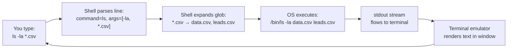

# Terminal & Shell

## Learning Objectives

1. Navigate the file system using shell commands (`pwd`, `ls`, `cd`, `mkdir`)
2. Create, read, and modify files from the terminal (`cat`, `echo`, `touch`, `>>`)
3. Chain commands using pipes (`|`) and redirection (`>`, `>>`)
4. Write and execute a shell script that accepts arguments
5. Inspect and modify environment variables, including `PATH`

## The Problem

Every SaaS tool has a dashboard. You click a button, something happens, you see a result. That works until you need to do the same thing fifty times, or combine two tools that were never designed to talk to each other, or figure out why an API call returned an error the dashboard chose not to show you.

The terminal is the one interface that composes. A graphical application does exactly what its designers anticipated — one action per click, one workflow per screen. The shell lets you take the output of any program, feed it as input to any other program, and treat the combination as a new tool. This composition is what makes the shell different from a GUI, not nostalgia for the command line.

If you are going to run enrichment scripts, pipe CSVs between tools, debug API responses, or automate prospect list processing, the shell is the control plane. Being fast here makes you fast everywhere else.

## The Concept

There are three layers that people casually call "the terminal." The **terminal emulator** is the window — Terminal.app, iTerm2, Windows Terminal, Alacritty. It draws characters on a screen and sends your keystrokes to a program running behind it. The **shell** is that program — bash, zsh, sh — it reads what you type, interprets it, and asks the operating system to execute commands. The **operating system** (Linux, macOS, Windows) is what actually runs those commands, manages files, and allocates memory.

The shell itself is a REPL: it prints a prompt, reads a line of input, evaluates that input by finding and executing the named program, prints any output, then loops back to the prompt. Everything else — variables, pipes, scripts, job control — is built on top of this read-evaluate-print loop.



### Mechanism: command parsing

When you press Enter, the shell reads the entire line, splits it on whitespace, treats the first token as the name of a program, and passes the remaining tokens as arguments to that program. This is why quoting matters: `"Prospect List.csv"` is one argument with a space in it, while `Prospect List.csv` is three separate arguments. The shell also performs **glob expansion** before passing arguments — `*.csv` is replaced with every matching filename in the current directory, so `ls *.csv` never literally sees the string `*.csv`. It sees `ls data.csv leads.csv prospects.csv`. Understanding parsing explains why spaces in filenames break scripts and why `rm *` with an unintended match can ruin your afternoon.

### Mechanism: pipes and redirection

Every running process has three data streams connected to it: **stdin** (standard input, file descriptor 0) is where it reads input, **stdout** (standard output, fd 1) is where it writes normal results, and **stderr** (standard error, fd 2) is where it writes error messages. By default, stdin comes from your keyboard and both stdout and stderr go to your terminal screen.

The pipe operator `|` connects stdout of one process directly to stdin of the next, without writing anything to disk. `cat prospects.csv | grep "@gmail.com"` runs `cat` and `grep` simultaneously, with the output of `cat` flowing into `grep` in memory. Redirection operators change where streams go: `>` sends stdout to a file (overwriting), `>>` appends to a file, and `2>` captures stderr separately. This is how you build data pipelines — extract, transform, load — using small programs that each do one thing well.

### Mechanism: environment variables

Environment variables are key-value pairs that every process inherits from its parent. When the shell starts a program, it passes its current environment to that program. The shell reads these variables using `$VAR_NAME` syntax and sets them with `export VAR_NAME=value`.

Two variables matter immediately. `PATH` is a colon-separated list of directories — when you type `python3`, the shell searches each directory in `PATH` left to right until it finds an executable named `python3`. If the directory containing your program is not in `PATH`, you have to type the full path like `/usr/local/bin/python3`. `HOME` points to your user directory and is what `~` expands to. Environment variables are how you pass configuration — API keys, environment names, feature flags — to scripts without hardcoding secrets into files that might get committed to version control.

## Build It

### Easy: Navigate, create, write, read, clean up

Run each block in sequence. The `&&` operator chains commands that only proceed if the previous one succeeded, so if `mkdir` fails, the rest does not run.

```bash
cd /tmp && mkdir -p shell_practice && cd shell_practice && pwd
```

Expected output:

```
/tmp/shell_practice
```

Create a file, write content, read it back:

```bash
touch prospects.txt && echo "Acme Corp,acme@example.com" > prospects.txt && echo "Globex,globex@example.com" >> prospects.txt && cat prospects.txt
```

Expected output:

```
Acme Corp,acme@example.com
Globex,globex@example.com
```

Now use a pipe to filter and count:

```bash
cat prospects.txt | grep "example.com" | wc -l
```

Expected output:

```
       2
```

Clean up:

```bash
cd /tmp && rm -rf shell_practice && echo "cleaned up"
```

Expected output:

```
cleaned up
```

### Medium: Shell script with arguments

This script takes a filename as its first argument, checks that the file exists, prints the header row, counts data rows, and shows the last entry. Save it as `inspect_csv.sh`:

```bash
cat << 'SCRIPT' > /tmp/inspect_csv.sh
#!/bin/bash

if [ -z "$1" ]; then
    echo "Usage: $0 <filename>"
    exit 1
fi

if [ ! -f "$1" ]; then
    echo "Error: file '$1' not found"
    exit 1
fi

echo "=== Header ==="
head -n 1 "$1"

TOTAL=$(wc -l < "$1")
DATA=$((TOTAL - 1))
echo "=== Row count: $DATA data rows ==="

echo "=== Last entry ==="
tail -n 1 "$1"
SCRIPT
chmod +x /tmp/inspect_csv.sh
```

Now create a test CSV and run the script against it:

```bash
cat << 'CSV' > /tmp/test_leads.csv
company,domain,email
Acme Corp,acme.com,lead@acme.com
Globex,globex.com,contact@globex.com
Initech,initech.com,info@initech.com
CSV
/tmp/inspect_csv.sh /tmp/test_leads.csv
```

Expected output:

```
=== Header ===
company,domain,email
=== Row count: 3 data rows ===
=== Last entry ===
Initech,initech.com,info@initech.com
```

### Hard: Pipes, redirection, and environment variables together

This pipeline demonstrates the full composition model. We will create a prospect file, filter it with `grep`, transform it with shell built-ins, capture stdout to a file while sending errors to another file, and use an environment variable to parameterize the search term.

```bash
mkdir -p /tmp/gtm_pipeline && cd /tmp/gtm_pipeline

cat << 'CSV' > raw_leads.csv
company,domain,vertical
Acme Corp,acme.com,Manufacturing
Globex,globex.com,SaaS
Initech,initech.com,SaaS
Umbrella,umbrella.com,Manufacturing
Hooli,hooli.com,SaaS
CSV

export TARGET_VERTICAL="SaaS"

echo "Filtering for vertical: $TARGET_VERTICAL"

grep "$TARGET_VERTICAL" raw_leads.csv > filtered_leads.csv 2> filter_errors.log

echo "=== Filtered results ==="
cat filtered_leads.csv

echo "=== Companies only (column 1) ==="
cut -d',' -f1 filtered_leads.csv

echo "=== Count ==="
COUNT=$(wc -l < filtered_leads.csv)
echo "$COUNT companies match vertical: $TARGET_VERTICAL"

echo "=== Sorting alphabetically ==="
cut -d',' -f1 filtered_leads.csv | sort
```

Expected output:

```
Filtering for vertical: SaaS
=== Filtered results ===
Globex,globex.com,SaaS
Initech,initech.com,SaaS
Hooli,hooli.com,SaaS
=== Companies only (column 1) ===
Globex
Initech
Hooli
=== Count ===
3 companies match vertical: SaaS
=== Sorting alphabetically ===
Globex
Hooli
Initech
```

Inspect your environment to confirm the variable is set and visible to child processes:

```bash
echo "TARGET_VERTICAL is: $TARGET_VERTICAL"
env | grep TARGET_VERTICAL
```

Expected output:

```
TARGET_VERTICAL is: SaaS
TARGET_VERTICAL=SaaS
```

Now check your `PATH` to understand why `grep` and `cut` work without full paths:

```bash
echo "Your PATH:" && echo "$PATH" | tr ':' '\n' | head -5
```

Expected output (varies by system, but you will see the first five directories):

```
Your PATH:
/usr/local/bin
/usr/bin
/bin
/opt/homebrew/bin
/usr/sbin
```

## Use It

The shell's pipe model — stdin connected to stdout, process after process — is the same mental model you use when building enrichment pipelines in a data tool. In a Clay waterfall enrichment, prospect data flows through a sequence of enrichment steps: first a data provider lookup, then a fallback to a second provider if the first returns nothing, then an email validation step. Each step takes input from the previous one, transforms it, and passes output forward. That is a pipeline. The shell teaches you to think in pipelines because that is what it does natively.

Concretely, the terminal is how you interact with prospect data APIs before that data ever reaches a tool like Clay. You use `curl` to make an HTTP request to Apollo's people search endpoint, pipe the JSON response through `jq` to extract company names and domains, redirect the result to a CSV file, and import that CSV into Clay as a source table. The same pattern applies to Hunter, Clearbit, or any enrichment API — the shell is where you prototype and debug the data extraction before building it into a repeatable workflow.

Environment variables are how you manage API keys across these scripts without hardcoding them. You store your Apollo API key in an environment variable (`export APOLLO_API_KEY=your_key_here`), reference it in your curl command as `$APOLLO_API_KEY`, and never commit it to a file. This is the same pattern production systems use — secrets live in the environment, not in source code.

[CITATION NEEDED — concept: terminal/shell as prerequisite for Clay workflow execution and API-based enrichment pipelines]

## Ship It

Build a reusable enrichment prep script that takes an API endpoint and an output filename, fetches JSON, extracts specific fields, and writes a CSV ready for Clay import. This mirrors the data engineering step that precedes a Clay waterfall: you clean and structure raw API output into the column format Clay expects.

```bash
cat << 'SCRIPT' > /tmp/enrichment_prep.sh
#!/bin/bash

if [ $# -ne 2 ]; then
    echo "Usage: $0 <json_file> <output_csv>"
    echo "Example: $0 apollo_response.json apollo_leads.csv"
    exit 1
fi

JSON_FILE="$1"
OUTPUT_CSV="$2"

if [ ! -f "$JSON_FILE" ]; then
    echo "Error: '$JSON_FILE' not found"
    exit 1
fi

if ! command -v jq &> /dev/null; then
    echo "Error: jq is not installed. Install with: brew install jq"
    exit 1
fi

echo "company_name,domain,linkedin_url" > "$OUTPUT_CSV"

jq -r '.people[] | "\(.organization.name),\(.organization.website_url // "N/A"),\(.linkedin_url // "N/A")"' "$JSON_FILE" >> "$OUTPUT_CSV" 2>errors.log

ROW_COUNT=$(wc -l < "$OUTPUT_CSV")
DATA_ROWS=$((ROW_COUNT - 1))

echo "Wrote $DATA_ROWS prospects to $OUTPUT_CSV"
echo "Preview:"
head -n 4 "$OUTPUT_CSV"

if [ -s errors.log ]; then
    echo "Warnings logged in errors.log"
fi
SCRIPT

chmod +x /tmp/enrichment_prep.sh
```

Test it with a realistic Apollo-style JSON payload:

```bash
cat << 'JSON' > /tmp/apollo_sample.json
{
  "people": [
    {
      "first_name": "Jane",
      "organization": { "name": "Acme Corp", "website_url": "acme.com" },
      "linkedin_url": "https://linkedin.com/in/jane-doe"
    },
    {
      "first_name": "John",
      "organization": { "name": "Globex", "website_url": "globex.com" },
      "linkedin_url": null
    },
    {
      "first_name": "Alice",
      "organization": { "name": "Initech", "website_url": "initech.com" },
      "linkedin_url": "https://linkedin.com/in/alice-cooper"
    }
  ]
}
JSON

/tmp/enrichment_prep.sh /tmp/apollo_sample.json /tmp/apollo_leads.csv
```

Expected output:

```
Wrote 3 prospects to /tmp/apollo_leads.csv
Preview:
company_name,domain,linkedin_url
Acme Corp,acme.com,https://linkedin.com/in/jane-doe
Globex,globex.com,N/A
```

The CSV this produces — `company_name`, `domain`, `linkedin_url` — is the column structure Clay expects when you upload a source table. The shell script did the extraction and transformation that a data pipeline in Clay's enrichment waterfall assumes has already happened upstream. When you later configure a waterfall in Clay (e.g., try Apollo first, fall back to Hunter, validate with NeverBounce), the data flowing through that waterfall was shaped by exactly this kind of terminal-based preparation.

## Exercises

1. **Navigate and inspect.** Use `cd`, `ls -la`, and `pwd` to move to your home directory, then to `/tmp`, then back. List all files in `/tmp` sorted by modification time (`ls -lt`). Write the command you used.

2. **Build a pipeline.** Create a file called `companies.txt` with five company names (one per line). Write a single pipeline using `cat`, `grep`, `sort`, and `wc` that counts how many company names contain the letter "a" (case-insensitive — use `grep -i`).

3. **Script with arguments.** Modify `/tmp/inspect_csv.sh` from the Build section to accept a second argument: a column number. The script should print only that column from the CSV using `cut`. Test it against `test_leads.csv` with column 2 (domain).

4. **Environment variables.** Set an environment variable called `WORKSPACE_NAME` to any string. Write a one-liner that prints `"Working in: <value>"` using that variable. Then run `env | grep WORKSPACE` to confirm it is exported. Open a new terminal tab — is the variable still there? Explain why or why not.

5. **Error handling.** Run `/tmp/enrichment_prep.sh` with a nonexistent JSON file. What exit code does the script return? Check with `echo $?` immediately after. Now run it with a valid file that contains malformed JSON (put `{ broken` in a file). What gets written to `errors.log`?

## Key Terms

- **Terminal emulator** — The application that renders a text interface in a window (Terminal.app, iTerm2, Windows Terminal). It is not the shell; it is the display layer.
- **Shell** — The command interpreter (bash, zsh, sh) that reads input, parses it, and asks the OS to execute programs. It is a REPL: read, evaluate, print, loop.
- **Process** — A running instance of a program. Each process has its own stdin, stdout, and stderr streams.
- **stdin / stdout / stderr** — The three standard data streams every process inherits. stdin is input (fd 0), stdout is normal output (fd 1), stderr is error output (fd 2).
- **Pipe (`|`)** — An operator that connects stdout of one process to stdin of the next, enabling composition of small programs into pipelines.
- **Redirection (`>`, `>>`, `2>`)** — Operators that send a stream to a file instead of the terminal. `>` overwrites, `>>` appends, `2>` captures stderr specifically.
- **Glob expansion** — The shell's replacement of wildcard patterns (`*.csv`, `?.txt`) with matching filenames before passing arguments to a program.
- **Environment variable** — A key-value pair inherited by child processes. Set with `export VAR=value`, read with `$VAR`. Used for configuration like `PATH`, `HOME`, and API keys.
- **PATH** — A colon-separated list of directories the shell searches when you type a command name without a full path.
- **Exit code** — An integer (0–255) a process returns when it finishes. 0 means success. Any non-zero value indicates an error. Check with `$?`.

## Sources

- [CITATION NEEDED — concept: terminal/shell as prerequisite for Clay workflow execution and API-based enrichment pipelines]
- [CITATION NEEDED — concept: Clay waterfall enrichment pattern as a multi-step data pipeline analogous to shell pipes]