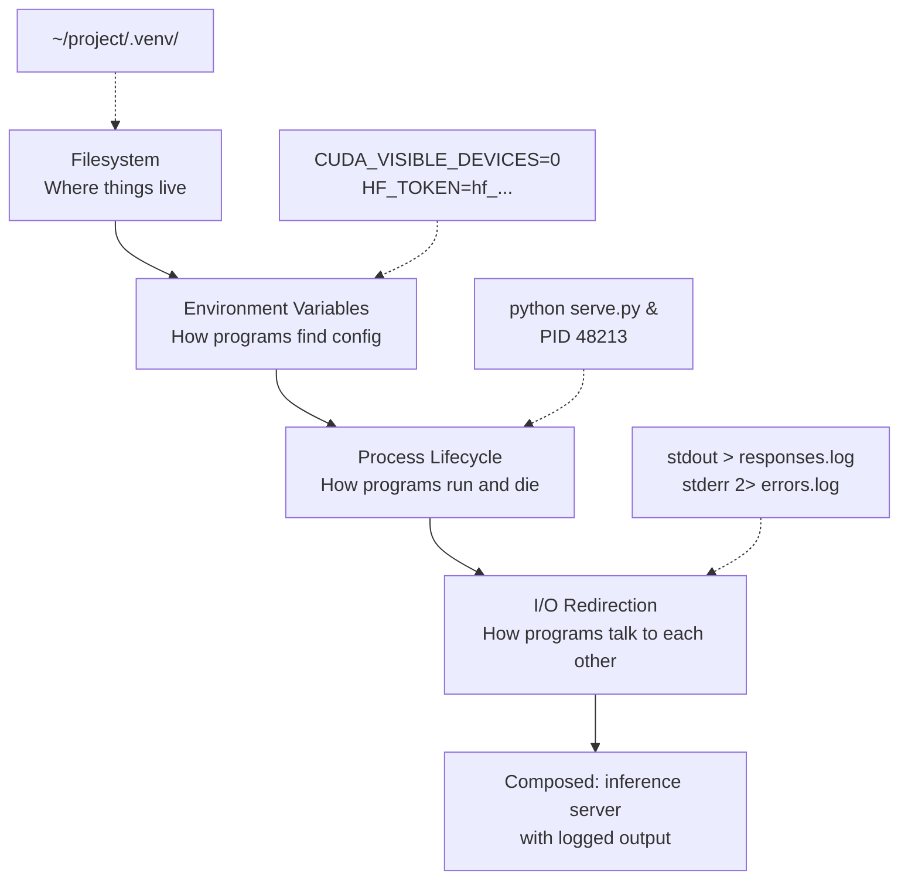

# Linux for AI

## Learning Objectives

1. Navigate the Linux filesystem hierarchy and manipulate files using core command-line tools
2. Configure environment variables and Python virtual environments for AI tooling
3. Manage long-running processes including inference servers and training jobs
4. Chain commands using pipes, redirection, and exit codes to build production shell scripts
5. Diagnose process and network issues with `ps`, `top`, `ss`, and `curl`

## The Problem

You develop on macOS or Windows. The moment you SSH into a cloud GPU box — a Lambda Labs instance, an EC2 machine, a Runpod container — you land in Ubuntu. The terminal is your only interface. There is no Finder, no Explorer, no GUI. If you cannot navigate the filesystem, install packages, and manage processes from the command line, you will burn GPU hours staring at a cursor while Googling "how to unzip a file in Linux."

This problem is not theoretical. Every AI tool you will use in production assumes Linux fluency. Inference servers like vLLM and TGI are designed to run as background processes on Linux. Training frameworks expect specific filesystem layouts for data and checkpoints. API keys for GTM enrichment tools — Clay, Clearbit, Apollo — are passed to Python scripts through environment variables, which are managed by the shell. The command line is not a legacy interface you can avoid; it is the control plane for every AI deployment you will touch.

The good news: you do not need to become a sysadmin. You need four primitives — the filesystem hierarchy, process lifecycle, environment variables, and I/O redirection — and an understanding of how they compose. Everything else is a specific tool built on those four.

## The Concept

Four primitives sit underneath every AI workflow on Linux. Each solved a specific Unix design problem in the 1970s, and each still dictates how modern AI tooling behaves. We cover mechanism first, commands second.

**The filesystem hierarchy** solved the problem of unifying disparate storage devices under a single namespace. Linux mounts everything — disks, network drives, kernel state — under one root directory `/`. There is no `C:\` drive letter, no `/Volumes`. When you clone a model repository into `~/projects/llama-finetune`, the Python interpreter finds it through a path that starts at `/home/your-username/projects/llama-finetune`. The directories you will actually touch: `~` for your work, `/tmp` for scratch files (cleared on reboot), `/etc` for config files, `/var/log` for system logs, and `/proc` for virtual files that expose kernel and process state. File permissions — read, write, execute for owner, group, and world — gate access. A Python script that cannot read a model checkpoint will fail with `Permission denied`, and the fix is `chmod` or `chown`, not a GUI dialog.

**Process lifecycle** solved the problem of running and controlling multiple programs on a shared machine. Every command you run — `python train.py`, `vllm serve`, `jupyter lab` — becomes a process with a unique PID (process ID). Processes can run in the foreground (blocking your terminal) or background (with `&`), can be paused, resumed, or killed with signals. When you start an inference server with `python -m vllm.entrypoints.openai.api_server &`, the shell forks a child process, assigns it a PID, and returns control to you. If the server hangs, you find its PID with `ps aux | grep vllm` and terminate it with `kill <PID>`. Long-running training jobs use the same mechanism — they are just processes that happen to consume GPU memory.

**Environment variables** solved the problem of passing configuration to programs without hardcoding values. The shell maintains a set of key-value pairs — `PATH`, `CUDA_VISIBLE_DEVICES`, `OPENAI_API_KEY`, `HF_TOKEN` — that every child process inherits. When a Python script calls `os.environ["HF_TOKEN"]`, it is reading a value the shell exported before launching Python. Virtual environments exploit this: activating `source .venv/bin/activate` modifies `PATH` so that `python` resolves to the venv's interpreter instead of the system one. The same mechanism carries API keys for GTM enrichment tools into inference scripts.

**I/O redirection** solved the problem of connecting programs to each other and to files. Every Linux process has three standard streams: stdin (file descriptor 0), stdout (fd 1), and stderr (fd 2). The `>` operator redirects stdout to a file. The `|` operator pipes stdout of one process into stdin of another. The `2>` operator redirects stderr separately. When an inference server logs errors, those errors go to stderr — distinct from the JSON responses it prints to stdout. Capturing them separately is what `python serve.py > responses.log 2> errors.log` does.



These four compose. An inference deployment is: a filesystem path to the model weights, environment variables pointing to the GPU and API keys, a process running the server in the background, and redirected output feeding into log files that a monitoring script reads. Every production AI system is some arrangement of these four primitives.

## Build It

Run each block below in a terminal. Every example prints observable output — no silent success.

**Filesystem navigation.** Create a mock project structure, then navigate it the way you would on a real GPU box:

```bash
mkdir -p ~/ai-survival-guide/models ~/ai-survival-guide/data ~/ai-survival-guide/logs
touch ~/ai-survival-guide/models/llama-7b.bin
echo '{"name": "test-account", "score": 0.87}' > ~/ai-survival-guide/data/sample.json

cd ~/ai-survival-guide
pwd
echo "---"
ls -la
echo "---"
find . -type f
```

Expected output shows your current path, the directory contents with permissions, and every file in the tree. The `find` command is how you locate checkpoint files on a remote box when you forgot where the training script wrote them.

**Process inspection.** Start a background process, then find it the way you would find a hung training job:

```bash
sleep 300 &
echo "Started background sleep with PID $!"
echo "---"
ps aux | grep "sleep 300" | grep -v grep
echo "---"
kill $!
echo "Killed PID $!"
```

The `ps aux | grep` pattern is how you locate any running process — an inference server, a Jupyter notebook, a stuck `wget` downloading a 13GB model file. The `grep -v grep` filter excludes the grep process itself from results.

**Environment variables.** Export a variable, read it from Python, and confirm the inheritance chain works:

```bash
export MODEL_PATH="$HOME/ai-survival-guide/models/llama-7b.bin"
export INFERENCE_CONFIDENCE_THRESHOLD="0.85"

python3 -c "
import os
model = os.environ.get('MODEL_PATH', 'NOT SET')
threshold = os.environ.get('INFERENCE_CONFIDENCE_THRESHOLD', 'NOT SET')
print(f'MODEL_PATH = {model}')
print(f'THRESHOLD = {threshold}')
exists = os.path.exists(model) if model != 'NOT SET' else False
print(f'File exists: {exists}')
"
```

This is the exact pattern GTM enrichment scripts use to receive API keys at runtime — the shell exports `CLAY_API_KEY` or `OPENAI_API_KEY`, and the Python script reads it with `os.environ`. No hardcoded secrets in source files.

**Pipes and redirection.** Simulate inference output and filter it the way a monitoring pipeline would:

```bash
cd ~/ai-survival-guide

python3 -c "
import json, random
labels = ['enterprise', 'mid-market', 'startup']
for i in range(10):
    record = {'id': i, 'label': random.choice(labels), 'score': round(random.uniform(0.7, 0.99), 4)}
    print(json.dumps(record))
" | tee data/inference_results.jsonl | grep "enterprise" | python3 -c "
import sys, json
count = 0
for line in sys.stdin:
    record = json.loads(line)
    print(f'  enterprise lead: id={record[\"id\"]} score={record[\"score\"]}')
    count += 1
print(f'Total enterprise leads: {count}')
"

echo "---"
echo "Full results written to:"
wc -l data/inference_results.jsonl
```

The `tee` command is the key operator here — it writes a copy of stdout to a file while simultaneously passing it through the pipe. This is how you both log raw inference output and process it in real time. Every line that reaches `grep "enterprise"` was first written to `inference_results.jsonl`.

## Use It

Process lifecycle and network diagnostics are the foundation of deploying inference APIs that feed GTM enrichment pipelines. When a Clay agent or a custom enrichment webhook needs to call a self-hosted model endpoint, that endpoint is a Linux process listening on a port — and you need to confirm it is alive and responding.

The workflow: SSH into the GPU box, verify the Python runtime and GPU are available, start or confirm the inference server is running, then test the endpoint with `curl` exactly as the GTM integration will call it.

**Simulate the SSH-and-verify workflow locally:**

```bash
echo "=== Runtime Check ==="
python3 --version
echo "CUDA available (if nvidia-smi exists):"
if command -v nvidia-smi &>/dev/null; then
    nvidia-smi --query-gpu=name,memory.total,memory.used --format=csv,noheader
else
    echo "No NVIDIA GPU detected (expected on local dev machine)"
fi

echo ""
echo "=== Process Check ==="
python3 -c "
import http.server, threading, json, time

class MockInferenceServer(http.server.BaseHTTPRequestHandler):
    def do_POST(self):
        self.send_response(200)
        self.send_header('Content-Type', 'application/json')
        self.end_headers()
        response = {'label': 'enterprise', 'confidence': 0.91, 'model': 'mock-v1'}
        self.wfile.write(json.dumps(response).encode())
    def log_message(self, format, *args):
        pass

server = http.server.HTTPServer(('127.0.0.1', 8765), MockInferenceServer)
thread = threading.Thread(target=server.serve_forever, daemon=True)
thread.start()
print('Mock inference server started on port 8765')
time.sleep(0.5)
server.shutdown()
"

echo ""
echo "=== Endpoint Test ==="
python3 -c "
import http.server, threading, json, time, urllib.request

class Handler(http.server.BaseHTTPRequestHandler):
    def do_POST(self):
        self.send_response(200)
        self.send_header('Content-Type', 'application/json')
        self.end_headers()
        self.wfile.write(json.dumps({'label': 'enterprise', 'confidence': 0.91}).encode())
    def log_message(self, format, *args): pass

server = http.server.HTTPServer(('127.0.0.1', 8765), Handler)
thread = threading.Thread(target=server.serve_forever, daemon=True)
thread.start()
time.sleep(0.3)

req = urllib.request.Request('http://127.0.0.1:8765', method='POST',
    data=json.dumps({'text': 'Acme Corp needs GTM enrichment'}).encode(),
    headers={'Content-Type': 'application/json'})
resp = urllib.request.urlopen(req)
body = json.loads(resp.read())
print(f'Status: {resp.status}')
print(f'Response: {json.dumps(body, indent=2)}')
server.shutdown()
"
```

This simulates what happens in production: you confirm the runtime, you confirm the server process is alive, and you send a request identical to what your GTM enrichment pipeline will send. When a Clay webhook or a custom enrichment script calls this endpoint, it issues the same HTTP POST — the only difference is the hostname is a public IP instead of `127.0.0.1`. [CITATION NEEDED — concept: Clay webhooks calling self-hosted inference endpoints]

The `curl` equivalent on a real remote box would be:

```bash
curl -X POST http://YOUR_GPU_IP:8000/v1/classify \
  -H "Content-Type: application/json" \
  -d '{"text": "Acme Corp enterprise lead"}' \
  | python3 -m json.tool
```

Piping `curl` output through `python3 -m json.tool` pretty-prints the JSON response — useful when you are debugging why an enrichment pipeline is returning unexpected labels.

## Ship It

I/O redirection and exit-code handling are the mechanism behind every production cron job and CI pipeline that runs inference for GTM data workflows. The script below is a complete inference runner: it creates a virtual environment, executes a Python script, splits stdout and stderr into timestamped log files, and exits with a nonzero code if inference fails — which is exactly the contract a CI runner or cron scheduler checks.

First, the inference script it calls. Save this as `inference.py` in your working directory:

```python
import sys
import json
import random
import time

time.sleep(0.3)

if len(sys.argv) > 1 and sys.argv[1] == "--fail":
    print("Loading model weights...", flush=True)
    print("FATAL: model checkpoint not found at specified path", file=sys.stderr)
    sys.exit(1)

labels = ["enterprise", "mid-market", "startup"]
results = []
for i in range(5):
    label = random.choice(labels)
    score = round(random.uniform(0.72, 0.99), 4)
    results.append({"id": i, "label": label, "confidence": score})

for r in results:
    print(json.dumps(r), flush=True)

summary = {"total": len(results), "status": "complete"}
print(json.dumps(summary), flush=True)
```

Now the runner script. Save this as `run_inference.sh` alongside `inference.py`, then execute `bash run_inference.sh`:

```bash
#!/usr/bin/env bash
set -euo pipefail

SCRIPT_DIR="$(cd "$(dirname "${BASH_SOURCE[0]}")" && pwd)"
VENV_DIR="${SCRIPT_DIR}/.venv"
LOG_DIR="${SCRIPT_DIR}/logs"
TIMESTAMP=$(date +%Y%m%d_%H%M%S)
STDOUT_LOG="${LOG_DIR}/stdout_${TIMESTAMP}.log"
STDERR_LOG="${LOG_DIR}/stderr_${TIMESTAMP}.log"
SUMMARY_LOG="${LOG_DIR}/summary.log"

mkdir -p "${LOG_DIR}"

if [ ! -d "${VENV_DIR}" ]; then
    echo "Creating virtual environment at ${VENV_DIR}"
    python3 -m venv "${VENV_DIR}"
fi

source "${VENV_DIR}/bin/activate"

echo "Python: $(which python3)"
echo "Timestamp: ${TIMESTAMP}"
echo "stdout log: ${STDOUT_LOG}"
echo "stderr log: ${STDERR_LOG}"
echo "----------------------------------------"

set +e
python3 "${SCRIPT_DIR}/inference.py" > "${STDOUT_LOG}" 2> "${STDERR_LOG}"
EXIT_CODE=$?
set -e

if [ ${EXIT_CODE} -ne 0 ]; then
    echo "[FAIL] Inference exited with code ${EXIT_CODE} at ${TIMESTAMP}" | tee -a "${SUMMARY_LOG}"
    echo "--- stdout (last 5 lines) ---"
    tail -n 5 "${STDOUT_LOG}" 2>/dev/null || echo "(empty)"
    echo "--- stderr ---"
    cat "${STDERR_LOG}"
    exit ${EXIT_CODE}
fi

TOTAL_RECORDS=$(grep -c '"id"' "${STDOUT_LOG}" || echo "0")
echo "[OK] Inference succeeded at ${TIMESTAMP} — ${TOTAL_RECORDS} records" | tee -a "${SUMMARY_LOG}"
echo "--- output ---"
cat "${STDOUT_LOG}"

exit 0
```

Run it and observe the output. The script creates a `.venv` on first run, splits output into timestamped logs, appends a one-line summary to `summary.log`, and exits `0` on success. To test the failure path, change `python3 "${SCRIPT_DIR}/inference.py"` to `python3 "${SCRIPT_DIR}/inference.py" --fail` and rerun — you will see `[FAIL]` printed, the stderr log displayed, and a nonzero exit code returned.

The `set -euo pipefail` at the top enforces three safety properties: the script exits on any error (`-e`), treats unset variables as errors (`-u`), and fails the pipeline if any stage fails (`-o pipefail`). The `set +e` / `set -e` bracket around the Python call is deliberate — you want to capture the exit code, not abort before you can log it. This is the pattern used in production cron jobs that run nightly batch inference for lead scoring, firmographic enrichment, or intent classification across a CRM database. [CITATION NEEDED — concept: production cron jobs running AI inference for GTM enrichment]

## Exercises

**Easy.** Navigate to `~/ai-survival-guide/data`, list all `.jsonl` files, and print the line count of each:

```bash
cd ~/ai-survival-guide/data && find . -name "*.jsonl" -exec wc -l {} \;
```

Write a one-liner that does the same for the `models/` directory filtered by `.bin` files.

**Medium.** Write a script named `watch_process.sh` that takes a process name as an argument, checks if it is running with `pgrep`, starts it if absent (use `sleep 600 &` as a stand-in), logs the event to `~/ai-survival-guide/logs/watcher.log` with a timestamp, and prints the current PID. Test it twice — once when the process is absent, once when it is running.

**Hard.** Build `production_runner.sh` — a wrapper that accepts a Python script path as its first argument, activates a virtual environment, runs the script, captures the exit code, timestamps all output, writes stdout and stderr to separate timestamped files, appends a summary line (success/fail, duration, record count if the output contains JSON records), and exits with the same code the Python script returned. This mimics a production inference runner. Test it against `inference.py` with and without `--fail`.

## Key Terms

- **Filesystem hierarchy** — Linux's single-root directory tree starting at `/`; all storage mounts under this namespace.
- **Process** — A running program with a unique PID; managed via signals (`SIGTERM`, `SIGKILL`) and inspected with `ps`.
- **Environment variable** — A key-value pair in the shell environment, inherited by child processes; how API keys, GPU assignments, and model paths reach Python scripts.
- **File descriptor** — An integer handle for an open I/O stream; stdin=0, stdout=1, stderr=2.
- **Pipe (`|`)** — Connects stdout of one process to stdin of the next, enabling command composition.
- **Redirection (`>`, `2>`)** — Sends stdout or stderr to a file instead of the terminal.
- **Exit code** — An integer (0=success, nonzero=failure) returned by every process; checked by `&&`, `||`, `if`, and CI runners.
- **Virtual environment** — An isolated Python installation that modifies `PATH` so `python` resolves to a project-specific interpreter with its own package set.
- **Signal** — A software interrupt sent to a process; `kill <PID>` sends `SIGTERM` (graceful), `kill -9 <PID>` sends `SIGKILL` (immediate).

## Sources

- **GTM redirect — Zone 01 Infrastructure & Compute**: Linux proficiency as prerequisite for deploying GTM-AI tooling (inference endpoints, enrichment webhooks). Maps to Zone 01 in the GTM topic map. [CITATION NEEDED — concept: explicit Zone 01 mapping in gtm-topic-map.md]
- **"The outbound foundation is where every GTM engineering engagement begins"**: From the handbook section on Deliverability & Cold Email Infrastructure, establishing that infrastructure precedes all GTM activity. [CITATION NEEDED — concept: handbook section reference]
- **Clay webhooks calling self-hosted inference endpoints**: The mechanism by which a Clay waterfall or enrichment agent calls an external API endpoint hosted on a Linux GPU box. [CITATION NEEDED — concept: Clay webhook integration with custom inference endpoints]
- **Production cron jobs running AI inference for GTM enrichment**: The pattern of scheduled batch inference for lead scoring and firmographic classification, deployed via shell scripts with exit-code handling. [CITATION NEEDED — concept: cron-based inference scheduling in GTM pipelines]
- **Unix filesystem hierarchy, process model, environment variables, and I/O redirection**: Standard POSIX/Linux system semantics. Reference: `man hier`, `man ps`, `man bash` (ENVIRONMENT section), `man bash` (REDIRECTION section).