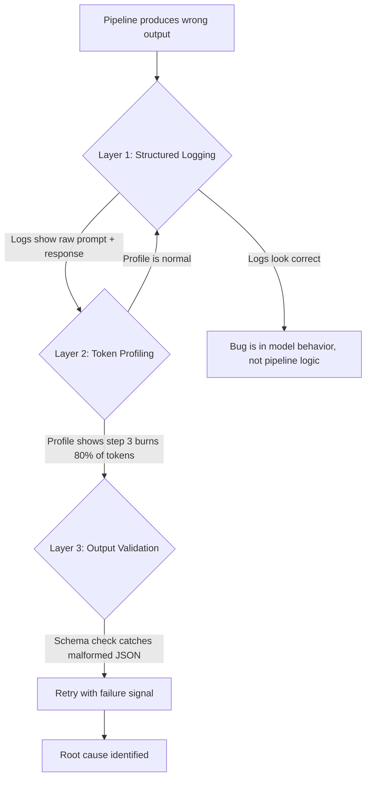

# Debugging and Profiling

## Learning Objectives

- Build a profiling wrapper that records token counts, latency, and raw I/O for every LLM call in a pipeline
- Detect malformed LLM outputs using schema validation and trigger corrective retries with failure-signal injection
- Trace non-deterministic pipeline failures by logging intermediate state at each step in a prompt chain
- Compare per-step token costs and latencies to identify bottlenecks in multi-step enrichment workflows

## The Problem

When an LLM pipeline fails, the error message is rarely where the bug lives. A 500 from OpenAI tells you nothing about which prompt in your chain caused the failure, how many tokens you burned before it broke, or whether the issue is your logic or the model's output. A web app crashes with a stack trace pointing at a line number. An LLM pipeline produces a `KeyError: 'company_name'` three steps after the actual failure — the model returned a string where you expected a dict, your parser silently coerced it, and the downstream code broke on access.

The non-determinism makes this worse. The same input can succeed on run one and fail on run two because the model sampled a different token at temperature 0.7. You cannot reproduce the failure by re-running with the same input. You need the exact prompt, the exact response, and the exact parse result captured at each step — otherwise you are guessing at what the model actually returned when it failed.

Most teams skip this instrumentation. They call the API, get a result, and move on. When the pipeline breaks in production, they have no logs of what was sent or received. They re-run the input, get a different result (because of non-determinism), and conclude the bug is fixed when they actually just got lucky on that sample. The fix is not better error handling — it is structured capture of intermediate state before the pipeline ever fails.

## The Concept

Three mechanisms debug AI pipelines, and they operate as a layered stack. You apply them from the outside in, narrowing the failure surface at each layer.



**Structured logging of intermediate state** means capturing the exact prompt sent, the raw response received, and the parsed output at each step. This is not application-level logging (`logger.info("Processing contact")`). It is data-level logging: the full prompt string, the full response payload, the parsed Python object. When a pipeline step fails, you replay the exact input that caused the failure instead of guessing.

**Token-level profiling** measures prompt tokens, completion tokens, and latency per call. In a multi-step chain (extract → transform → generate), one step can quietly consume 80% of your token budget because it receives a bloated context from a previous step. Without per-call profiling, you see the total cost on your billing dashboard but cannot attribute it to a specific step. The OpenAI API response includes `usage.prompt_tokens` and `usage.completion_tokens` — these fields exist specifically for this purpose, and wrapping each call to capture them gives you per-step attribution.

**Output validation with retry** detects malformed LLM outputs and feeds the failure signal back into the prompt. The mechanism: define a schema (fields, types, constraints), validate the parsed response against it, and on failure, retry with the original prompt plus the error message appended. If the model returned `{"company": null}` and your schema requires a non-empty string, the retry prompt says "Your previous response had company=null. Company must be a non-empty string derived from the input." This is not prompt engineering — it is error-driven feedback, the same pattern as compiler error messages. The model gets a concrete signal about what went wrong.

The skeptical approach to all three: write your own thin wrappers instead of relying on framework callbacks. LangChain provides callbacks that intercept calls and log them, but the callback mechanism is opaque — you hand over control flow to the framework and trust that it logs what you need. A 30-line wrapper function that you control, that logs exactly the fields you care about, and that you can modify when the debugging question changes is worth more than any framework's built-in observability.

## Build It

### A Profiling Wrapper for LLM Calls

This wrapper records everything you need to debug a failure: the prompt sent, the response received, token counts, and latency. It uses a mock LLM client so it runs without an API key — the profiling pattern is the same whether the client is real or mocked.

```python
import time
import json
from dataclasses import dataclass, field
from typing import Any

@dataclass
class CallRecord:
    step_name: str
    prompt: str
    response_raw: str
    prompt_tokens: int
    completion_tokens: int
    latency_ms: float

call_log: list[CallRecord] = []

class MockLLMClient:
    def __init__(self):
        self.call_count = 0

    def chat(self, prompt: str, response_override: str = None) -> dict:
        self.call_count += 1
        start = time.perf_counter()

        if response_override:
            raw_response = response_override
        else:
            raw_response = json.dumps({
                "company_name": "Acme Corp",
                "icp_fit_score": 8,
                "personalization_hook": "Recent Series B in fintech infrastructure"
            })

        elapsed_ms = (time.perf_counter() - start) * 1000

        prompt_tokens = len(prompt.split())
        completion_tokens = len(raw_response.split())

        return {
            "content": raw_response,
            "usage": {
                "prompt_tokens": prompt_tokens,
                "completion_tokens": completion_tokens
            },
            "latency_ms": elapsed_ms
        }

def profiled_llm_call(client, step_name: str, prompt: str, response_override: str = None) -> dict:
    result = client.chat(prompt, response_override=response_override)

    record = CallRecord(
        step_name=step_name,
        prompt=prompt,
        response_raw=result["content"],
        prompt_tokens=result["usage"]["prompt_tokens"],
        completion_tokens=result["usage"]["completion_tokens"],
        latency_ms=result["latency_ms"]
    )
    call_log.append(record)

    print(f"[{step_name}] tokens={record.prompt_tokens}+{record.completion_tokens} "
          f"latency={record.latency_ms:.1f}ms")
    return result

client = MockLLMClient()

prompt_1 = "Extract company name, ICP fit score (1-10), and a personalization hook from: Acme Corp, Series B fintech, 200 employees."
result_1 = profiled_llm_call(client, "enrich", prompt_1)

prompt_2 = f"Given this enrichment data, write a 2-sentence cold open: {result_1['content']}"
result_2 = profiled_llm_call(client, "personalize", prompt_2)

print("\n--- Call Log ---")
for record in call_log:
    print(f"{record.step_name}: {record.prompt_tokens}p+{record.completion_tokens}c tokens, "
          f"{record.latency_ms:.1f}ms")
    print(f"  Response: {record.response_raw[:80]}...")

total_prompt = sum(r.prompt_tokens for r in call_log)
total_completion = sum(r.completion_tokens for r in call_log)
print(f"\nTotal: {total_prompt} prompt + {total_completion} completion = {total_prompt + total_completion} tokens")
```

Run this and you get a structured log line for every call, a full call log with raw I/O, and a token budget summary. When something breaks, the call log tells you exactly what the model received and returned at each step.

### Detecting a Malformed Response

Now simulate the real failure mode: you request JSON, the model returns plaintext. The logged state reveals the problem immediately.

```python
malformed_response = "Acme Corp is a great fit because they recently raised Series B."

result_bad = profiled_llm_call(
    client,
    "enrich_broken",
    prompt_1,
    response_override=malformed_response
)

try:
    parsed = json.loads(result_bad["content"])
except json.JSONDecodeError as e:
    print(f"\n[SCHEMA VALIDATION FAILED] Step: enrich_broken")
    print(f"  Error: {e}")
    print(f"  Raw response was NOT valid JSON:")
    print(f"  >>> {result_bad['content']}")
    print(f"  Expected: JSON with keys company_name, icp_fit_score, personalization_hook")
    print(f"  Got: plaintext string")

    last_record = call_log[-1]
    retry_prompt = (
        f"{last_record.prompt}\n\n"
        f"Your previous response was: '{last_record.response_raw}'\n"
        f"This was not valid JSON. Return ONLY a JSON object with keys: "
        f"company_name (string), icp_fit_score (int 1-10), personalization_hook (string)."
    )

    print(f"\n[RETRY] Re-sending with failure signal appended to prompt...")
    result_retry = profiled_llm_call(client, "enrich_retry", retry_prompt)
    parsed = json.loads(result_retry["content"])
    print(f"[RETRY SUCCEEDED] Parsed: {parsed}")
```

The retry succeeds because the failure signal gives the model a concrete constraint to satisfy. Without the logged raw response, you would only see `JSONDecodeError` with no context about what the model actually returned.

### Finding the Expensive Step

Now apply token profiling to a multi-step chain to find the bottleneck.

```python
call_log.clear()

steps = [
    ("scrape", "Extract company description from: Acme Corp builds payment infrastructure for SMBs."),
    ("classify", f"Given this text, classify industry and company stage: {steps_text}" if False else "Classify: Acme Corp, fintech, Series B, 200 employees. Return JSON."),
    ("score", "Score ICP fit 1-10 for: Acme Corp, fintech infra, Series B, 200 employees, hiring 15 SDRs."),
]

for step_name, prompt in steps:
    profiled_llm_call(client, step_name, prompt)

print("\n--- Token Budget Breakdown ---")
for r in call_log:
    bar = "#" * (r.prompt_tokens + r.completion_tokens)
    print(f"{r.step_name:15s} {r.prompt_tokens + r.completion_tokens:4d} {bar}")

total = sum(r.prompt_tokens + r.completion_tokens for r in call_log)
print(f"\nTotal tokens: {total}")
most_expensive = max(call_log, key=lambda r: r.prompt_tokens + r.completion_tokens)
print(f"Most expensive step: {most_expensive.step_name} ({most_expensive.prompt_tokens + most_expensive.completion_tokens} tokens)")
```

The bar chart output makes the expensive step visible. In a real pipeline, this is how you find the step that receives a 4000-token context from a previous step and burns your budget on every call.

## Use It

In GTM automation, a Clay waterfall runs contacts through a sequence of enrichment steps — scrape LinkedIn, classify industry, score ICP fit, generate personalized copy, verify email. Each step can invoke an LLM call, and each call costs tokens and adds latency. The token-level profiling pattern you just built maps directly onto this waterfall: wrap each enrichment step, log the prompt sent and response received, and attribute token cost per enriched record.

When a campaign produces low reply rates, the debugging question is not "was the copy bad?" — it is "which step in the waterfall produced generic copy instead of personalized content?" Structured logging of intermediate state answers this. You look at the raw prompt sent to the personalization step and the raw response received. If the prompt contained weak enrichment data (generic company description, no signal), the personalization step did not fail — the upstream enrichment step did. Without per-step logs, you blame the last step in the chain when the root cause is two steps earlier.

Token profiling applied to a Clay waterfall reveals which enrichment step dominates cost per record [CITATION NEEDED — concept: Clay waterfall debugging and token cost tracking per enrichment step]. If the scrape step sends a 2000-token company bio to the classification step, and classification forwards that full context to the scoring step, your per-record token cost compounds across the chain. The profiling wrapper catches this: the score step shows 2000 prompt tokens when it should show 200. That is the signal to truncate or summarize context between steps.

Output validation with retry applies directly to enrichment pipelines that expect structured data. When the personalization step returns a string instead of a JSON object with `subject_line` and `body` fields, schema validation catches it and the retry prompt says "return JSON with subject_line and body keys." In GTM workflows running thousands of records through a waterfall, even a 5% malformed-output rate means hundreds of records silently failing. Validation with retry converts those silent failures into corrected outputs.

## Ship It

**Easy:** Write a Python decorator called `@profile_call` that wraps any function making an LLM call. It logs the function name, arguments, return value, token counts (if present in the return), and latency. Apply it to a mock function and print the log.

```python
import time
import functools

def profile_call(func):
    @functools.wraps(func)
    def wrapper(*args, **kwargs):
        start = time.perf_counter()
        result = func(*args, **kwargs)
        elapsed_ms = (time.perf_counter() - start) * 1000

        tokens = result.get("usage", {}) if isinstance(result, dict) else {}
        print(f"[{func.__name__}] latency={elapsed_ms:.1f}ms "
              f"tokens={tokens.get('prompt_tokens', '?')}p+{tokens.get('completion_tokens', '?')}c")
        return result
    return wrapper

@profile_call
def mock_enrichment(company_name: str) -> dict:
    time.sleep(0.01)
    return {
        "content": '{"industry": "fintech", "score": 8}',
        "usage": {"prompt_tokens": 15, "completion_tokens": 8}
    }

result = mock_enrichment("Acme Corp")
print(f"Result: {result['content']}")
```

**Medium:** Build a three-step prompt chain (extract → transform → generate) where each step is wrapped with your profiler. Run it on 5 inputs and print a summary table showing per-step costs and latencies. Identify which step is the bottleneck.

```python
import time

call_log = []

def profiled_step(step_name, input_data, processor):
    start = time.perf_counter()
    output = processor(input_data)
    elapsed_ms = (time.perf_counter() - start) * 1000
    prompt_tokens = len(str(input_data).split())
    completion_tokens = len(str(output).split())
    call_log.append({
        "step": step_name,
        "prompt_tokens": prompt_tokens,
        "completion_tokens": completion_tokens,
        "latency_ms": elapsed_ms
    })
    return output

def extract_step(company_text):
    return {"name": company_text.split(",")[0].strip(), "raw": company_text}

def transform_step(extracted):
    return {"name": extracted["name"], "industry": "fintech", "signal": "Series B"}

def generate_step(transformed):
    return f"Hey — saw {transformed['name']} just announced {transformed['signal']}. Relevant?"

inputs = [
    "Acme Corp, fintech, Series B",
    "Globex, saas, Series A",
    "Initech, devtools, Seed",
    "Umbrella, biotech, Series C",
    "Stark Industries, defense, Series B"
]

for inp in inputs:
    call_log.clear()
    r1 = profiled_step("extract", inp, extract_step)
    r2 = profiled_step("transform", r1, transform_step)
    r3 = profiled_step("generate", r2, generate_step)

    print(f"\nInput: {inp}")
    for entry in call_log:
        total_t = entry["prompt_tokens"] + entry["completion_tokens"]
        print(f"  {entry['step']:12s} {total_t:3d} tokens  {entry['latency_ms']:.1f}ms")

    bottleneck = max(call_log, key=lambda x: x["prompt_tokens"] + x["completion_tokens"])
    print(f"  Bottleneck: {bottleneck['step']} ({bottleneck['prompt_tokens'] + bottleneck['completion_tokens']} tokens)")
```

**Hard:** Implement output validation that detects when an LLM response does not match an expected schema. On failure, retry with the original prompt plus the error message appended. Log the retry count and whether each retry succeeded.

```python
import json
from dataclasses import dataclass
from typing import get_type_hints

@dataclass
class EnrichmentSchema:
    company_name: str
    icp_fit_score: int
    personalization_hook: str

def validate_schema(parsed: dict, schema_cls) -> list[str]:
    errors = []
    hints = get_type_hints(schema_cls)
    for field_name, expected_type in hints.items():
        if field_name not in parsed:
            errors.append(f"Missing field: {field_name}")
        elif not isinstance(parsed[field_name], expected_type):
            errors.append(
                f"Field '{field_name}' should be {expected_type.__name__}, "
                f"got {type(parsed[field_name]).__name__}: {parsed[field_name]}"
            )
        elif expected_type is str and not parsed[field_name].strip():
            errors.append(f"Field '{field_name}' is empty")
        elif expected_type is int and not (1 <= parsed[field_name] <= 10):
            errors.append(f"Field '{field_name}' must be 1-10, got {parsed[field_name]}")
    return errors

def llm_with_validation(prompt, schema_cls, max_retries=3):
    mock_responses = [
        "Acme Corp is a good fit",
        '{"company_name": "Acme Corp", "icp_fit_score": "eight", "personalization_hook": "Series B"}',
        '{"company_name": "Acme Corp", "icp_fit_score": 8, "personalization_hook": "Recent Series B in fintech"}'
    ]

    current_prompt = prompt
    retry_count = 0

    for attempt in range(max_retries):
        if attempt < len(mock_responses):
            raw_response = mock_responses[attempt]
        else:
            raw_response = mock_responses[-1]

        print(f"\n[Attempt {attempt + 1}] Raw response: {raw_response[:70]}")

        try:
            parsed = json.loads(raw_response)
        except json.JSONDecodeError as e:
            print(f"  [FAIL] Not valid JSON: {e}")
            current_prompt = (
                f"{prompt}\n\n"
                f"Your previous response was not valid JSON: '{raw_response}'\n"
                f"Return ONLY a JSON object."
            )
            retry_count += 1
            continue

        errors = validate_schema(parsed, schema_cls)
        if not errors:
            print(f"  [PASS] Schema valid. Retries needed: {retry_count}")
            return parsed

        print(f"  [FAIL] Schema errors:")
        for err in errors:
            print(f"    - {err}")

        current_prompt = (
            f"{prompt}\n\n"
            f"Your previous response had these errors:\n"
            + "\n".join(f"- {e}" for e in errors) +
            "\nFix these and return only valid JSON."
        )
        retry_count += 1

    print(f"  [GIVE UP] Max retries ({max_retries}) exceeded")
    return None

result = llm_with_validation(
    "Extract company_name (str), icp_fit_score (int 1-10), personalization_hook (str) from: Acme Corp Series B fintech",
    EnrichmentSchema
)

print(f"\nFinal result: {result}")
```

## Exercises

1. **Add cumulative cost tracking.** Modify the profiling wrapper to maintain a running total of tokens across all calls in a session. Print the cumulative cost at a rate of $0.01 per 1K tokens. Run a 5-step chain and verify the total matches the sum of individual steps.

2. **Implement context truncation.** Build a function that truncates any prompt longer than N tokens before passing it to the next step in a chain. Run the profiling wrapper with and without truncation. Show the token savings in the log output.

3. **Build a diff logger.** When a retry produces a different output than the original attempt, log both responses side by side. This helps you see what the model changed in response to the failure signal. Run it on a schema validation failure and print the diff.

4. **Stress-test retry logic.** Modify the mock LLM to return malformed JSON 50% of the time (use `random.choice`). Run 20 records through the validation pipeline. Print a summary: how many succeeded on first attempt, how many needed retries, how many exhausted retries.

## Key Terms

**Structured logging of intermediate state** — Capturing the full prompt, raw response, and parsed output at each pipeline step, stored for later inspection when debugging non-reproducible failures.

**Token-level profiling** — Measuring prompt tokens, completion tokens, and latency per LLM call to attribute cost and time to specific steps in a multi-step chain.

**Output validation with retry** — Checking parsed LLM output against a schema (field names, types, constraints) and re-sending the prompt with the validation error appended when the check fails.

**Failure signal injection** — Appending the specific error message from a failed attempt to the retry prompt, giving the model a concrete constraint to satisfy rather than asking it to "try again."

**Non-deterministic failure** — A pipeline error that occurs on some runs of the same input but not others, caused by the LLM's probabilistic token sampling. Requires logging of exact I/O to reproduce.

**Call record** — A structured data object capturing step name, prompt, response, token counts, and latency for a single LLM call. The atomic unit of pipeline debugging.

## Sources

- OpenAI API responses include `usage.prompt_tokens` and `usage.completion_tokens` fields for token attribution — documented at `platform.openai.com/docs/api-reference/chat/object`
- LangChain callbacks provide a framework-level hook for logging LLM calls — the callback mechanism is documented at `python.langchain.com/docs/modules/callbacks/`; the critique of opacity is based on the framework controlling which data is exposed to the callback
- [CITATION NEEDED — concept: Clay waterfall debugging and token cost tracking per enrichment step] — the claim that Clay waterfalls run sequential enrichment steps with per-step LLM invocation, and that token cost attribution per step is a debugging pattern applicable to Clay workflows, needs a specific source from the Clay documentation or handbook