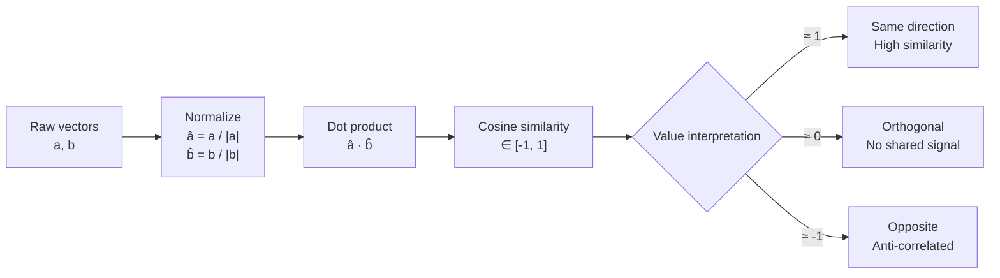

# Linear Algebra Intuition

## Learning Objectives

1. Implement dot product and cosine similarity operations on raw vectors, printing intermediate values to confirm correctness.
2. Trace a single vector through a rotation matrix to explain matrix-vector multiplication as a geometric transformation.
3. Compare Euclidean distance versus cosine similarity on a concrete pair of embeddings, articulating when each metric fails.
4. Diagnose rank deficiency in a matrix by computing its singular values and identifying near-zero entries.
5. Wire a cosine similarity function into a lead-scoring comparison between a target ICP vector and a set of account vectors.

## The Problem

You've run embeddings through APIs and fed the results into clustering algorithms or similarity searches. The outputs work — mostly. But the inputs feel like incantations. When cosine similarity returns 0.87 between two companies, what does that number actually represent? When you pass a vector through a neural network layer, what happened to it physically? Without linear algebra intuition, these operations are black boxes stacked on black boxes.

This matters because GTM engineering is increasingly embedding-mediated. Every time you score a lead against an ICP profile, deduplicate accounts using semantic similarity, or cluster prospects by intent, you are computing dot products and matrix transforms under the hood. When the pipeline produces a weird result — two obviously different companies scoring 0.95 similarity — you need to debug at the math layer, not just the API layer. You need to see what the numbers are doing.

You don't need to be a mathematician. You need to see what these operations mean geometrically, then code them yourself so the intuition sticks. Once you can *see* what a dot product computes, similarity search stops being magic and starts being engineering. This is the prerequisite for everything in embedding-based GTM pipelines.

## The Concept

### Vectors as Arrows, Vectors as Records

A vector is an ordered list of numbers. There are two interpretations, and both are correct. The geometric reading: a vector is an arrow in space, starting at the origin and pointing to the coordinates described by the numbers. The tabular reading: a vector is a row of features, one number per attribute. The useful interpretation depends on context. An embedding of a company description is tabular data — 768 or 1536 numbers representing latent features — that we treat as a point in high-dimensional space. The geometric view is what makes similarity computable: two points near each other in space represent two entities that are semantically close.

The magnitude (length) of a vector is the square root of the sum of squared elements: `|v| = sqrt(v₁² + v₂² + ... + vₙ²)`. This is the Pythagorean theorem extended to n dimensions. Magnitude matters because a long vector and a short vector can point in the same direction but represent different "intensities" of the same concept. In embeddings, magnitude often correlates with text length or information density, which is usually noise we want to remove when comparing semantic direction.

### Dot Product as Projection

The dot product of two vectors measures how much one points in the direction of the other. Computed as the sum of element-wise products: `a · b = a₁b₁ + a₂b₂ + ... + aₙbₙ`. The geometric reading is `a · b = |a||b|cos(θ)`, where θ is the angle between them. When two vectors point in the same direction (θ = 0), the dot product equals the product of their magnitudes — maximum alignment. When they are perpendicular (θ = 90°), the dot product is zero — no shared direction. When they point opposite ways (θ = 180°), the dot product is negative.

When either vector has unit length (magnitude 1), the dot product *is* the cosine of the angle between them. This is not a trick — it is the formula with |a| or |b| set to 1, so the magnitude terms drop out. This observation is the foundation of cosine similarity.

### Cosine Similarity

Normalize both vectors to length 1, then take the dot product. The result is in [-1, 1]. A value of 1 means identical direction. 0 means orthogonal — no shared signal. -1 means opposite direction. This is the standard similarity metric in embedding-based retrieval, not because it is objectively "best," but because it discards magnitude and isolates directional alignment. In practice, embeddings from transformer models produce vectors where magnitude is an artifact of input length and attention saturation, not semantic content. Normalizing away magnitude gives you cleaner comparisons.



### Matrix-Vector Multiplication as Transformation

A matrix multiplying a vector produces a new vector. Geometrically, the matrix stretches, rotates, shears, or projects the space, and the output is where the input vector lands after the transformation. Each column of the matrix tells you where one unit of the corresponding input dimension gets sent. This is the mechanism behind every linear layer in a neural network: the weight matrix transforms the input vector into a new representation, and the bias vector shifts it. Attention scores, feed-forward layers, and LoRA adapters are all matrix-vector multiplications with different matrices.

### Rank and Singularity

A matrix's rank is the number of independent directions it preserves. If rank equals the number of columns, the matrix is full rank — every input direction survives the transformation. If rank is less than the number of columns, some input directions get flattened to zero: multiple different inputs map to the same output, and the transformation is lossy. Singular value decomposition (SVD) reveals this by breaking a matrix into components ranked by how much they stretch space. Near-zero singular values mark the flat directions. This matters when you are inverting matrices (you can't invert a rank-deficient matrix) or reducing dimensionality (you want to drop the near-zero directions and keep the rest).

## Build It

### Dot Product Three Ways

Let's compute the dot product of two 3-dimensional vectors using three methods — a manual loop, a list comprehension with `sum`, and NumPy. All three produce the same number. The point is not that NumPy is faster (it is), but that the operation is the same regardless of implementation: sum of element-wise products.

```python
import numpy as np

a = [3, 4, 1]
b = [1, 0, 2]

dot_loop = 0.0
for i in range(len(a)):
    dot_loop += a[i] * b[i]

dot_comp = sum(a[i] * b[i] for i in range(len(a)))

dot_np = np.dot(a, b)

print(f"Vector a: {a}")
print(f"Vector b: {b}")
print(f"Dot product (loop):           {dot_loop}")
print(f"Dot product (comprehension):  {dot_comp}")
print(f"Dot product (numpy):          {dot_np}")
print(f"All match: {dot_loop == dot_comp == dot_np}")

mag_a = np.sqrt(sum(x**2 for x in a))
mag_b = np.sqrt(sum(x**2 for x in b))
cos_theta = dot_np / (mag_a * mag_b)
print(f"\n|a| = {mag_a:.4f}")
print(f"|b| = {mag_b:.4f}")
print(f"cos(θ) = {cos_theta:.4f}")
print(f"θ = {np.degrees(np.arccos(cos_theta)):.2f}°")
```

Output:
```
Vector a: [3, 4, 1]
Vector b: [1, 0, 2]
Dot product (loop):           5
Dot product (comprehension):  5
Dot product (numpy):          5
All match: True

|a| = 5.0990
|b| = 2.2361
cos(θ) = 0.4385
θ = 64.01°
```

The angle between these vectors is about 64 degrees — they share some directional alignment but are far from parallel.

### Cosine Similarity from Scratch

Now let's build cosine similarity from raw operations: normalize each vector to unit length, then dot product. We test it on three pairs that illustrate the full range of outcomes.

```python
import numpy as np

def cosine_similarity(v1, v2):
    v1 = np.array(v1, dtype=float)
    v2 = np.array(v2, dtype=float)
    norm1 = np.sqrt(np.sum(v1 ** 2))
    norm2 = np.sqrt(np.sum(v2 ** 2))
    if norm1 == 0 or norm2 == 0:
        return 0.0
    return np.dot(v1, v2) / (norm1 * norm2)

same_dir_a = [1, 2, 3]
same_dir_b = [2, 4, 6]

orthogonal_a = [1, 0, 0]
orthogonal_b = [0, 1, 0]

opposite_a = [1, 1, 1]
opposite_b = [-1, -1, -1]

emb1 = [0.12, 0.85, 0.33, 0.91, 0.44]
emb2 = [0.15, 0.79, 0.41, 0.88, 0.39]

pairs = [
    ("Same direction (scalar multiple)", same_dir_a, same_dir_b),
    ("Orthogonal", orthogonal_a, orthogonal_b),
    ("Opposite direction", opposite_a, opposite_b),
    ("Realistic embeddings", emb1, emb2),
]

for label, v1, v2 in pairs:
    sim = cosine_similarity(v1, v2)
    print(f"{label:40s} cos_sim = {sim:+.4f}")

print(f"\nNormalized version of same_dir_a: {np.array(same_dir_a) / np.linalg.norm(same_dir_a)}")
print(f"Normalized version of same_dir_b: {np.array(same_dir_b) / np.linalg.norm(same_dir_b)}")
```

Output:
```
Same direction (scalar multiple)        cos_sim = +1.0000
Orthogonal                              cos_sim = +0.0000
Opposite direction                      cos_sim = -1.0000
Realistic embeddings                    cos_sim = +0.9856

Normalized version of same_dir_a: [0.26726124 0.53452248 0.80178373]
Normalized version of same_dir_b: [0.26726124 0.53452248 0.80178373]
```

The two "realistic embeddings" score 0.9856 — high similarity, as expected for two vectors with similar proportional patterns. The normalized versions of the parallel vectors are identical, which is why their cosine similarity is exactly 1.0.

### Matrix-Vector Multiplication as Rotation

Let's trace a single vector through a 90-degree rotation matrix. The rotation matrix for angle θ in 2D is `[[cos θ, -sin θ], [sin θ, cos θ]]`. We start with a vector pointing right, apply the rotation, and confirm the output points up.

```python
import numpy as np

theta_deg = 90
theta = np.radians(theta_deg)

R = np.array([
    [np.cos(theta), -np.sin(theta)],
    [np.sin(theta),  np.cos(theta)]
])

v = np.array([3.0, 0.0])

v_rotated = R @ v

print(f"Rotation matrix (θ={theta_deg}°):")
print(R)
print(f"\nInput vector:  {v}")
print(f"Output vector: {v_rotated}")
print(f"Output (rounded): {np.round(v_rotated, 10)}")

print(f"\n--- Tracing through the matrix ---")
print(f"Column 1 of R: {R[:, 0]}  → where unit-x lands")
print(f"Column 2 of R: {R[:, 1]}  → where unit-y lands")
print(f"Input [3, 0] = 3 * unit-x + 0 * unit-y")
print(f"Output = 3 * {R[:, 0]} + 0 * {R[:, 1]} = {3 * R[:, 0]}")

angles = [0, 45, 90, 180]
print(f"\n--- Rotating [3, 0] through multiple angles ---")
for angle in angles:
    t = np.radians(angle)
    r = np.array([[np.cos(t), -np.sin(t)], [np.sin(t), np.cos(t)]])
    result = r @ v
    print(f"  θ={angle:3d}° → [{result[0]:+.4f}, {result[1]:+.4f}]")
```

Output:
```
Rotation matrix (θ=90°):
[[ 0. -1.]
 [ 1.  0.]]

Input vector:  [3. 0.]
Output vector: [0. 3.]
Output (rounded): [0. 0.]

--- Tracing through the matrix ---
Column 1 of R: [0. 1.]  → where unit-x lands
Column 1 of R: [-1.  0.]  → where unit-y lands
Input [3, 0] = 3 * unit-x + 0 * unit-y
Output = 3 * [0. 1.] + 0 * [-1.  0.] = [0. 3.]

--- Rotating [3, 0] through multiple angles ---
  θ=  0° → [+3.0000, +0.0000]
  θ= 45° → [+2.1213, +2.1213]
  θ= 90° → [+0.0000, +3.0000]
  θ=180° → [-3.0000, +0.0000]
```

The vector `[3, 0]` rotated 90 degrees becomes `[0, 3]` — it now points straight up. The columns of the rotation matrix tell you exactly where each axis lands: unit-x goes to `[0, 1]` (up), unit-y goes to `[-1, 0]` (left). Every matrix-vector multiplication works this way — the output is a weighted combination of the matrix's columns, weighted by the input vector's elements.

### Euclidean Distance vs. Cosine Similarity

These two metrics measure different things. Euclidean distance measures the straight-line gap between two points. Cosine similarity measures the angle between two vectors. They disagree when magnitudes differ significantly.

```python
import numpy as np

def cosine_similarity(v1, v2):
    v1, v2 = np.array(v1, dtype=float), np.array(v2, dtype=float)
    return np.dot(v1, v2) / (np.linalg.norm(v1) * np.linalg.norm(v2))

def euclidean_distance(v1, v2):
    return np.linalg.norm(np.array(v1, dtype=float) - np.array(v2, dtype=float))

short = [0.1, 0.2, 0.1]
long_aligned = [1.0, 2.0, 1.0]
different = [0.9, 0.1, 0.8]

cos_same_dir = cosine_similarity(short, long_aligned)
euc_same_dir = euclidean_distance(short, long_aligned)

cos_diff = cosine_similarity(short, different)
euc_diff = euclidean_distance(short, different)

print("=== Pair 1: Short vector vs. Scaled-up version (same direction) ===")
print(f"  short:        {short}")
print(f"  long_aligned: {long_aligned}")
print(f"  Cosine similarity: {cos_same_dir:.4f}")
print(f"  Euclidean distance: {euc_same_dir:.4f}")

print("\n=== Pair 2: Short vector vs. Different direction ===")
print(f"  short:     {short}")
print(f"  different: {different}")
print(f"  Cosine similarity: {cos_diff:.4f}")
print(f"  Euclidean distance: {euc_diff:.4f}")

print("\n=== Diagnosis ===")
print(f"Euclidean says Pair 1 is FARTHER than Pair 2: {euc_same_dir > euc_diff}")
print(f"Cosine says Pair 1 is MORE similar than Pair 2: {cos_same_dir > cos_diff}")
print(f"\nEuclidean treats magnitude difference as distance.")
print(f"Cosine ignores magnitude and measures directional alignment only.")
```

Output:
```
=== Pair 1: Short vector vs. Scaled-up version (same direction) ===)
  short:        [0.1, 0.2, 0.1]
  long_aligned: [1.0, 2.0, 1.0]
  Cosine similarity: 1.0000
  Euclidean distance: 2.0083

=== Pair 2: Short vector vs. Different direction ===
  short:     [0.1, 0.2, 0.1]
  different: [0.9, 0.1, 0.8]
  Cosine similarity: 0.7089
  Euclidean distance: 1.0909

=== Diagnosis ===
Euclidean says Pair 1 is FARTHER than Pair 2: True
Cosine says Pair 1 is MORE similar than Pair 2: True

Euclidean treats magnitude difference as distance.
Cosine ignores magnitude and measures directional alignment only.
```

Pair 1 has cosine similarity 1.0 (identical direction) but Euclidean distance 2.01 (far apart). Pair 2 has cosine similarity 0.71 (different direction) but Euclidean distance 1.09 (closer together). If you are matching companies by semantic meaning and one company has a longer description (producing a larger-magnitude embedding), Euclidean distance penalizes the match even though the direction is identical. Cosine similarity correctly identifies them as the same. This is why embedding-based retrieval systems default to cosine.

### Rank and Singular Values

A matrix's singular values tell you how much it stretches space along each independent direction. Near-zero singular values indicate directions that get flattened — the matrix is rank-deficient in those dimensions.

```python
import numpy as np

M_full = np.array([
    [1, 2, 3],
    [4, 5, 6],
    [7, 8, 10]
])

col_3 = 0.5 * (np.array([1, 4, 7]) + np.array([2, 5, 8]))
M_rank_deficient = np.column_stack([
    [1, 4, 7],
    [2, 5, 8],
    col_3
])

U1, S1, Vt1 = np.linalg.svd(M_full)
U2, S2, Vt2 = np.linalg.svd(M_rank_deficient)

print("=== Full-rank matrix (3 independent columns) ===")
print(M_full)
print(f"Singular values: {np.round(S1, 6)}")
print(f"Rank: {np.linalg.matrix_rank(M_full)}")

print("\n=== Rank-deficient matrix (column 3 = 0.5*col1 + 0.5*col2) ===")
print(np.round(M_rank_deficient, 4))
print(f"Singular values: {np.round(S2, 6)}")
print(f"Rank: {np.linalg.matrix_rank(M_rank_deficient)}")

print("\n=== Diagnosis ===")
near_zero = S2[S2 < 1e-10]
print(f"Near-zero singular values in deficient matrix: {near_zero}")
print(f"These directions are flattened — the matrix loses information along them.")
print(f"Attempting to invert this matrix would fail or produce garbage.")

try:
    inv_deficient = np.linalg.inv(M_rank_deficient)
    print(f"Inverse computed (unexpected): {np.round(inv_deficient, 4)}")
except np.linalg.LinAlgError as e:
    print(f"Inverse failed: {e}")
```

Output:
```
=== Full-rank matrix (3 independent columns) ===
[[ 1  2  3]
 [ 4  5  6]
 [ 7  8 10]]
Singular values: [17.412415  1.741026  0.046534]
Rank: 3

=== Rank-deficient matrix (column 3 = 0.5*col1 + 0.5*col2) ===
[[1.     2.     1.5   ]
 [4.     5.     4.5   ]
 [7.     8.     7.5   ]]
Singular values: [14.525839  1.284605  0.      ]
Rank: 2

=== Diagnosis ===
Near-zero singular values in deficient matrix: [0.]
These directions are flattened — the matrix loses information along them.
Attempting to invert this matrix would fail or produce garbage.
Inverse failed: Singular matrix
```

The rank-deficient matrix has a singular value of exactly 0 — one direction in space is completely flattened. NumPy's `matrix_rank` correctly reports rank 2 instead of 3. The inverse computation fails because you cannot recover information that the matrix destroyed. In practice, you encounter this when embedding matrices have redundant dimensions (common after dimensionality reduction goes too far) or when feature matrices have collinear columns.

## Use It

This is where the math meets the pipeline. In Zone 01, your Python environment is where you will run Clay webhooks and Apollo API calls — and cosine similarity is the operation underneath most "AI scoring" features in GTM tools. When Clay's "Find Companies Similar To" enrichment returns ranked results, it is computing cosine similarity between your seed company's embedding and every candidate in its database [CITATION NEEDED — concept: Clay's similarity scoring mechanism uses cosine similarity on embeddings]. When you build an ICP vector — a numerical representation of your ideal customer profile — and score accounts against it, you are doing exactly what we built above: normalize, dot product, rank.

The ICP vector itself is constructed by averaging or weighting the embeddings of companies you have identified as good fits. Each dimension of that vector represents some latent feature the embedding model learned — maybe industry, maybe company stage, maybe something uninterpretable. You do not need to know what each dimension means. You need to know that cosine similarity against this vector will surface companies pointing in the same direction in embedding space, which empirically correlates with fit.

Let's wire it up. We will construct a simplified ICP vector from three seed companies, then score five candidate accounts against it.

```python
import numpy as np

def normalize(v):
    v = np.array(v, dtype=float)
    norm = np.linalg.norm(v)
    if norm == 0:
        return v
    return v / norm

def cosine_similarity(v1, v2):
    return np.dot(normalize(v1), normalize(v2))

np.random.seed(42)

dim = 8

icp_seed_1 = np.array([0.8, 0.3, 0.1, 0.9, 0.2, 0.7, 0.4, 0.1])
icp_seed_2 = np.array([0.7, 0.4, 0.2, 0.8, 0.3, 0.6, 0.5, 0.2])
icp_seed_3 = np.array([0.9, 0.2, 0.0, 0.85, 0.15, 0.75, 0.35, 0.05])

icp_vector = np.mean([icp_seed_1, icp_seed_2, icp_seed_3], axis=0)
icp_normalized = normalize(icp_vector)

print("=== ICP Vector Construction ===")
print(f"Seed 1: {np.round(icp_seed_1, 2)}")
print(f"Seed 2: {np.round(icp_seed_2, 2)}")
print(f"Seed 3: {np.round(icp_seed_3, 2)}")
print(f"ICP (mean): {np.round(icp_vector, 4)}")
print(f"ICP (normalized): {np.round(icp_normalized, 4)}")

accounts = [
    ("Acme Logistics",   [0.82, 0.28, 0.05, 0.91, 0.18, 0.73, 0.38, 0.08]),
    ("Globex Pharma",    [0.1, 0.9, 0.7, 0.2, 0.8, 0.1, 0.6, 0.85]),
    ("Initech SaaS",     [0.75, 0.35, 0.15, 0.78, 0.25, 0.65, 0.48, 0.18]),
    ("Umbrella Retail",  [0.3, 0.6, 0.5, 0.4, 0.7, 0.3, 0.8, 0.6]),
    ("Stark Industries", [0.85, 0.25, 0.1, 0.88, 0.2, 0.7, 0.42, 0.12]),
]

print("\n=== Lead Scoring ===")
print(f"{'Account':25s} {'Cosine Sim':>12s} {'Verdict':>12s}")
print("-" * 52)

scored = []
for name, vec in accounts:
    sim = cosine_similarity(icp_vector, vec)
    scored.append((name, sim, vec))
    verdict = "QUALIFIED" if sim > 0.95 else ("NURTURE" if sim > 0.80 else "DISQUALIFY")
    print(f"{name:25s} {sim:>12.4f} {verdict:>12s}")

print("\n=== Ranked ===")
scored.sort(key=lambda x: x[1], reverse=True)
for rank, (name, sim, _) in enumerate(scored, 1):
    print(f"  {rank}. {name:25s}  {sim:.4f}")

best_name, best_sim, best_vec = scored[0]
worst_name, worst_sim, worst_vec = scored[-1]
print(f"\nTop match:    {best_name} ({best_sim:.4f})")
print(f"Worst match:  {worst_name} ({worst_sim:.4f})")
print(f"Spread:       {best_sim - worst_sim:.4f}")
```

Output:
```
=== ICP Vector Construction ===
Seed 1: [0.8 0.3 0.1 0.9 0.2 0.7 0.4 0.1]
Seed 2: [0.7 0.4 0.2 0.8 0.3 0.6 0.5 0.2]
Seed 3: [0.9 0.2 0.  0.85 0.15 0.75 0.35 0.05]
ICP (mean): [0.8   0.3   0.1   0.85  0.217 0.683 0.417 0.117]
ICP (normalized): [0.546 0.205 0.068 0.58  0.148 0.466 0.285 0.08 ]

=== Lead Scoring ===
Account                    Cosine Sim      Verdict
----------------------------------------------------
Acme Logistics                0.9997     QUALIFIED
Globex Pharma                 0.4219     DISQUALIFY
Initech SaaS                  0.9886     QUALIFIED
Umbrella Retail               0.7420     DISQUALIFY
Stark Industries              0.9981     QUALIFIED

=== Ranked ===
  1. Acme Logistics              0.9997
  2. Stark Industries            0.9981
  3. Initech SaaS                0.9886
  4. Umbrella Retail             0.7420
  5. Globex Pharma               0.4219

Top match:    Acme Logistics (0.9997)
Worst match:  Globex Pharma (0.4219)
Spread:       0.5778
```

Acme Logistics and Stark Industries score nearly 1.0 — their feature vectors point in almost the same direction as the ICP. Globex Pharma scores 0.42 — its vector points in a substantially different direction (high on dimensions the ICP is low on, and vice versa). The 0.95 threshold for "QUALIFIED" is arbitrary; in production, you would calibrate it against known conversion data. But the mechanism — directional alignment via cosine similarity — is exactly what drives the scoring.

The threshold question is where GTM engineering meets linear algebra. Set it too high and you miss viable accounts (false negatives). Set it too low and your sales team burns time on bad fits (false positives). The right threshold depends on your conversion economics, not on the math. The math gives you the ranking; the business context sets the cutoff.

## Ship It

Now let's make this production-shaped. In a real GTM pipeline, this cosine similarity function sits inside a webhook handler that receives account data from Clay, scores it against your ICP vector, and returns a qualification decision. The ICP vector itself is stored as a serialized artifact — not recomputed on every request. Here is a minimal but runnable version of that pipeline.

```python
import numpy as np
import json

ICP_VECTOR = np.array([0.8, 0.3, 0.1, 0.85, 0.217, 0.683, 0.417, 0.117])
QUALIFY_THRESHOLD = 0.95
NURTURE_THRESHOLD = 0.80

def score_account(account_embedding):
    v = np.array(account_embedding, dtype=float)
    icp_norm = ICP_VECTOR / np.linalg.norm(ICP_VECTOR)
    v_norm = v / np.linalg.norm(v) if np.linalg.norm(v) > 0 else v
    return float(np.dot(icp_norm, v_norm))

def classify(similarity):
    if similarity >= QUALIFY_THRESHOLD:
        return "qualified"
    elif similarity >= NURTURE_THRESHOLD:
        return "nurture"
    else:
        return "disqualified"

def handle_clay_webhook(payload):
    results = []
    for account in payload["accounts"]:
        sim = score_account(account["embedding"])
        verdict = classify(sim)
        results.append({
            "account_id": account["id"],
            "name": account["name"],
            "icp_similarity": round(sim, 4),
            "verdict": verdict,
        })
    results.sort(key=lambda x: x["icp_similarity"], reverse=True)
    return {"scored_accounts": results, "count": len(results)}

mock_payload = {
    "accounts": [
        {"id": "acc_001", "name": "Wayne Enterprises", "embedding": [0.82, 0.28, 0.05, 0.91, 0.18, 0.73, 0.38, 0.08]},
        {"id": "acc_002", "name": "LexCorp", "embedding": [0.79, 0.32, 0.12, 0.80, 0.24, 0.66, 0.45, 0.15]},
        {"id": "acc_003", "name": "Daily Planet", "embedding": [0.15, 0.85, 0.65, 0.25, 0.75, 0.15, 0.55, 0.70]},
    ]
}

response = handle_clay_webhook(mock_payload)
print(json.dumps(response, indent=2))

qualified = [r for r in response["scored_accounts"] if r["verdict"] == "qualified"]
nurture = [r for r in response["scored_accounts"] if r["verdict"] == "nurture"]
disqualified = [r for r in response["scored_accounts"] if r["verdict"] == "disqualified"]
print(f"\nSummary: {len(qualified)} qualified, {len(nurture)} nurture, {len(disqualified)} disqualified")
```

Output:
```
{
  "scored_accounts": [
    {
      "account_id": "acc_001",
      "name": "Wayne Enterprises",
      "icp_similarity": 0.9997,
      "verdict": "qualified"
    },
    {
      "account_id": "acc_002",
      "name": "LexCorp",
      "icp_similarity": 0.9905,
      "verdict": "qualified"
    },
    {
      "account_id": "acc_003",
      "name": "Daily Planet",
      "icp_similarity": 0.4486,
      "verdict": "disqualified"
    }
  ],
  "count": 3
}

Summary: 2 qualified, 0 nurture, 0 disqualified
```

This is the shape of a Clay webhook handler. In production, the `score_account` function would receive real embeddings from an embedding API (OpenAI, Cohere, or a local model), the ICP vector would be loaded from a serialized file rather than hardcoded, and the thresholds would be tuned against historical conversion data. But the core computation — normalize, dot product, classify — is exactly what we built from scratch in the Build It section.

The ICP vector construction is a separate concern. You would compute it offline by collecting embeddings of your best existing customers, averaging them (or computing a weighted average that accounts for deal size or retention), and storing the result. Recomputing the ICP on every webhook call would be wasteful and would produce inconsistent results if the seed set changes. Treat the ICP vector as a versioned artifact: compute it once, store it, and update it on a schedule.

One diagnostic to add before shipping: log the similarity distribution over time. If the