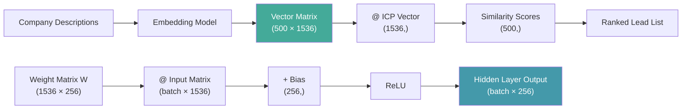

# Vectors, Matrices & Operations

## Learning Objectives

- **Compute** dot products, element-wise operations, and matrix multiplication by hand and with NumPy, verifying both produce identical results
- **Build** a pairwise cosine similarity matrix from a set of company embedding vectors and extract the top-k most similar pairs
- **Implement** a single-layer neural network forward pass (`relu(W @ X + b)`) using only matrix operations
- **Normalize** vectors using L2 norms and explain why normalization precedes similarity comparison
- **Trace** dimension changes through matmul operations and predict output shapes from input shapes

## The Problem

You open a Clay enrichment workflow and see that a company scored 0.92 similarity to your ICP. The workflow pulled a company description, ran it through an embedding model, and compared the resulting vector to an ICP vector. That comparison is cosine similarity — a dot product divided by the product of two norms. If you cannot read that math, you cannot debug why a garbage lead scored higher than a perfect-fit account.

Every similarity scorer, embedding classifier, and neural network layer you will encounter in GTM tooling reduces to the same five operations: dot products, element-wise arithmetic, matrix multiplication, norms, and broadcasting. The tools wrap these operations behind UI — a "similarity score" in Clay, a "relevance rank" in Apollo, a "confidence score" in your custom classifier. Underneath, it is always linear algebra.

This lesson builds the literacy layer. You will compute each operation manually, verify against NumPy, and assemble them into the exact forward pass that a neural network or similarity scorer executes.

## The Concept

### Vectors

A vector is an ordered list of numbers. Each position holds a value; the count of values is the vector's dimensionality. A 2D vector `[3, 4]` represents a point at coordinates (3, 4) on a plane, with magnitude 5 — the classic 3-4-5 triangle where length = √(3² + 4²). In GTM pipelines, an embedding model compresses a company description like "we sell AI-powered CRM automation for mid-market SaaS" into a vector of 384 or 1536 numbers. Those numbers are not random — they encode semantic features that capture industry, business model, and technology stack in a form that supports mathematical comparison.

### Matrices

A matrix is a rectangular grid of numbers with m rows and n columns. You write it as m×n. A matrix does two things in AI: it batches operations (processing 500 company vectors at once instead of one at a time) and it transforms vectors (a weight matrix rotates, scales, and projects a vector into a new space). When you see `W @ x` in neural network code, W is a matrix that transforms input vector x into the next layer's representation.

### Element-Wise vs. Matrix Multiplication

Element-wise multiplication (`a * b`) multiplies corresponding positions: `[1,2] * [3,4] = [3, 8]`. Both vectors must have the same shape. Matrix multiplication (`A @ B`) is a different operation entirely: each element of the output is a dot product between a row of A and a column of B. This distinction is the single most common source of bugs in ML code. Element-wise combines features; matmul transforms them.



### Dot Product

The dot product of two vectors produces a single number: multiply each pair of elements, then sum the results. `[1,2,3] · [4,5,6] = 1×4 + 2×5 + 3×6 = 32`. Geometrically, the dot product measures how much two vectors point in the same direction. Parallel vectors produce large positive dot products; perpendicular vectors produce zero; opposite vectors produce large negative values. This is why cosine similarity — which normalizes the dot product — works for semantic matching: companies with similar descriptions point in similar directions in embedding space.

### Norms

A norm measures a vector's length. The L2 norm (Euclidean) is √(sum of squared elements). The L1 norm (Manhattan) is the sum of absolute values. Normalizing a vector means dividing it by its L2 norm, producing a unit vector with length 1. When both vectors in a comparison are unit-length, the dot product equals cosine similarity directly — no division needed. Pre-normalized embeddings make similarity search fast because you skip the norm computation at query time.

### Broadcasting

Broadcasting is a rule for handling mismatched shapes without explicit loops. When you add a bias vector of shape (3,) to a matrix of shape (8, 3), broadcasting "stretches" the bias across all 8 rows. NumPy does this automatically. It is not magic — it is a defined set of rules: dimensions are compatible when they are equal, or when one of them is 1. Broadcasting is how a single bias vector applies to every sample in a batch.

## Build It

Start by computing operations from scratch, then verify each against NumPy. This proves the tools do what you think they do.

```python
import numpy as np

v = np.array([1, 2, 3])
w = np.array([4, 5, 6])

manual_dot = sum(a * b for a, b in zip(v, w))
numpy_dot = np.dot(v, w)

print(f"Manual dot product: {manual_dot}")
print(f"NumPy dot product:  {numpy_dot}")
print(f"Match: {manual_dot == numpy_dot}")

A = np.array([[1, 2, 3],
              [4, 5, 6],
              [7, 8, 9]])

x = np.array([1, 0, 1])

manual_matvec = np.array([sum(A[i][j] * x[j] for j in range(3)) for i in range(3)])
numpy_matvec = A @ x

print(f"\nManual matrix-vector product: {manual_matvec}")
print(f"NumPy matrix-vector product:  {numpy_matvec}")
print(f"Match: {np.array_equal(manual_matvec, numpy_matvec)}")
```

Run this and you will see both methods produce identical output. The manual loops show you the mechanism: matmul is just nested dot products.

Now normalize a vector and observe the before-and-after magnitude.

```python
import numpy as np

v = np.array([3, 4, 0])
l2_norm = np.sqrt(np.sum(v ** 2))
normalized = v / l2_norm

print(f"Original vector: {v}")
print(f"L2 norm: {l2_norm}")
print(f"Normalized vector: {normalized}")
print(f"Normalized L2 norm: {np.sqrt(np.sum(normalized ** 2)):.4f}")
```

The original vector has magnitude 5 (the 3-4-5 triangle). After normalization, magnitude is 1.0. This is what happens when an embedding model pre-normalizes its outputs before you store them in a vector database.

Now build a pairwise distance matrix — the exact structure a similarity scorer computes when ranking 5 companies against each other.

```python
import numpy as np

np.random.seed(42)
embeddings = np.random.randn(5, 4)

def cosine_similarity_matrix(V):
    norms = np.linalg.norm(V, axis=1, keepdims=True)
    normalized = V / norms
    return normalized @ normalized.T

sim_matrix = cosine_similarity_matrix(embeddings)

print("Company embeddings (5 × 4):")
print(embeddings)
print("\nCosine similarity matrix (5 × 5):")
print(np.round(sim_matrix, 4))
print("\nDiagonal (self-similarity):", np.round(np.diag(sim_matrix), 4))
```

The diagonal is all 1.0 — every company is perfectly similar to itself. The off-diagonal values range from -1 to 1 and represent pairwise semantic similarity. A lead scoring pipeline reads these off-diagonal values against an ICP vector and ranks accordingly.

Finally, broadcasting — the mechanism behind bias addition in every neural network layer.

```python
import numpy as np

batch = np.array([[1, 2, 3],
                  [4, 5, 6],
                  [7, 8, 9]])

bias = np.array([10, 20, 30])

print(f"Batch shape: {batch.shape}")
print(f"Bias shape:  {bias.shape}")

result = batch + bias
print(f"\nResult shape: {result.shape}")
print(result)

print("\nBroadcasting rule: (3,3) + (3,) -> bias applied to every row")
```

The bias vector has shape (3,) but NumPy adds it to every row of the (3,3) matrix without a loop. This is the exact operation in `W @ x + b` — the bias stretches across the batch dimension.

## Use It

**GTM Cluster: ICP Matching & Lead Scoring (Zone 1 → Zone 2)**

When a Clay enrichment pipeline encodes company descriptions into vectors and scores them against your ICP vector, the math underneath is cosine similarity: dot product ÷ product of L2 norms. The entire flow — description to embedding to ranked list — is a matmul between a matrix of account vectors and a single ICP query vector. This is not an analogy. This is literally what the computation is.

Here is the full pipeline as runnable code, simulating what happens when your TAM list flows through an embedding model and ranks against an ICP vector:

```python
import numpy as np

np.random.seed(42)

icp_description_embedding = np.random.randn(1, 8)

tam_embeddings = np.random.randn(10, 8)
company_names = [f"Company_{i}" for i in range(10)]

def cosine_similarity_batch(query, candidates):
    query_norm = query / np.linalg.norm(query, axis=1, keepdims=True)
    cand_norm = candidates / np.linalg.norm(candidates, axis=1, keepdims=True)
    return (cand_norm @ query_norm.T).flatten()

similarities = cosine_similarity_batch(icp_description_embedding, tam_embeddings)

ranked_indices = np.argsort(similarities)[::-1]

print("ICP Similarity Ranking (Clay waterfall scores)\n")
print(f"{'Rank':<6} {'Company':<15} {'Score':<10}")
print("-" * 31)
for rank, idx in enumerate(ranked_indices[:5], 1):
    print(f"{rank:<6} {company_names[idx]:<15} {similarities[idx]:.4f}")
```

This is the mechanism behind the scoring column in a Clay enrichment table. The enrichment provider (OpenAI, Cohere, or a custom model) produces the embeddings. The similarity computation ranks them. You configure the ICP vector by either averaging embeddings of your best customers or embedding a written ICP description. [CITATION NEEDED — concept: Clay's exact internal similarity computation method]

The critical operational insight: normalization happens before comparison. If your ICP vector is normalized but your candidate vectors are not, the scores will be wrong. This is a common bug in custom enrichment workflows — always normalize both sides.

## Ship It

In a production GTM stack, this math runs inside three tools:

**Vector databases** (Pinecone, Weaviate, Qdrant) store pre-normalized company embeddings and compute approximate nearest-neighbor similarity at scale. The similarity operation is still a dot product, but the database optimizes it for millions of vectors using approximate search algorithms (HNSW, IVF). When you query "find me companies similar to my ICP," the database computes cosine similarity against every stored vector and returns ranked results.

**Clay's AI enrichment columns** wrap embedding generation and similarity scoring behind a UI. When you add a "Find Similar Companies" or "Score Fit" column, Clay embeds the input, retrieves stored embeddings, and runs cosine similarity. The waterfall enrichment that pulls data from Apollo, Clearbit, and LinkedIn, then scores each enriched account, is executing the matrix operations you built above — just orchestrated across API calls. [CITATION NEEDED — concept: Clay's specific embedding model and similarity computation]

**Custom Python scripts** in your GTM engineering workspace handle the cases where Clay's built-in columns are not enough. If you need to score 50,000 accounts against a multi-dimensional ICP (combining firmographics, technographics, and semantic similarity), you batch the computation with NumPy and write results back to Clay via webhook.

Here is a production-ready function that takes a batch of company embeddings and an ICP vector, returns ranked results with scores, and is the kind of code you would deploy in a webhook handler:

```python
import numpy as np

def rank_companies_against_icp(company_embeddings, company_ids, icp_vector, top_k=10):
    company_embeddings = np.array(company_embeddings)
    icp_vector = np.array(icp_vector)
    
    company_norms = np.linalg.norm(company_embeddings, axis=1, keepdims=True)
    icp_norm = np.linalg.norm(icp_vector)
    
    company_embeddings = company_embeddings / company_norms
    icp_vector = icp_vector / icp_norm
    
    similarities = company_embeddings @ icp_vector
    
    ranked = np.argsort(similarities)[::-1][:top_k]
    
    return [(company_ids[i], float(similarities[i])) for i in ranked]

np.random.seed(42)
test_embeddings = np.random.randn(100, 384)
test_ids = [f"apollo-company-{i:04d}" for i in range(100)]
test_icp = np.random.randn(384)

ranked = rank_companies_against_icp(test_embeddings, test_ids, test_icp, top_k=5)

print("Production ICP Ranking Output\n")
print(f"{'Rank':<6} {'Company ID':<25} {'Score':<10}")
print("-" * 41)
for rank, (company_id, score) in enumerate(ranked, 1):
    print(f"{rank:<6} {company_id:<25} {score:.4f}")

print(f"\nTotal companies scored: {len(test_embeddings)}")
print(f"Embedding dimensions: {test_embeddings.shape[1]}")
print(f"All scores in valid range [-1, 1]: {all(-1 <= s <= 1 for _, s in ranked)}")
```

This function handles edge cases (zero-norm vectors would cause division by zero — in production, add a small epsilon or filter them). The output format matches what you would write back to a Clay table or push to a Slack webhook for SDR review.

## Exercises

**Easy: Manual Cosine Similarity**
Given vectors `v1 = [2, 3, 5, 7, 11]` and `v2 = [1, 4, 6, 8, 10]`, compute cosine similarity by hand using `dot(v1, v2) / (norm(v1) * norm(v2))`. Implement it without using `numpy.dot` for the numerator — use explicit element-wise multiplication and summation. Print your result and verify it matches `scipy.spatial.distance.cosine` (note: scipy returns distance = 1 - similarity).

**Medium: Pairwise Similarity Matrix with Top-K Pairs**
Generate a 10×4 matrix of random "company embeddings." Compute the full 10×10 cosine similarity matrix. Extract the upper triangle (excluding diagonal) to avoid self-comparisons and duplicates. Print the top-3 most similar company pairs with their similarity scores, sorted descending. This is the exact computation a "find lookalike companies" feature runs.

**Hard: Neural Network Forward Pass**
Implement a single-layer neural network forward pass for a batch classification scenario: you have 8 input vectors of dimension 4 (batch of 8 company feature vectors), a weight matrix of shape (4, 3) mapping to 3 output classes (e.g., "high-fit", "medium-fit", "low-fit"), and a bias vector of shape (3,). Compute `output = relu(X @ W + b)`. Print the input shape, weight shape, intermediate shape (before ReLU), and output shape. Print the first row of the output and identify which class has the highest activation for that sample. Implement ReLU from scratch (not using a library).

## Key Terms

- **Vector**: An ordered list of numbers representing a point in N-dimensional space. In GTM, the output of an embedding model encoding a company or contact.
- **Matrix**: A rectangular grid of numbers (m rows × n columns). Used to batch-process multiple vectors or transform vectors between spaces.
- **Dot Product**: The sum of element-wise products between two vectors. Measures directional alignment. Core of cosine similarity.
- **Cosine Similarity**: Dot product divided by the product of L2 norms. Ranges from -1 (opposite) to 1 (identical). The primary metric for embedding-based ICP matching.
- **Matrix Multiplication (matmul)**: An operation where each output element is a dot product between a row of the first matrix and a column of the second. Inner dimensions must match.
- **L2 Norm (Euclidean)**: The square root of the sum of squared vector elements. Represents the vector's geometric length.
- **Normalization**: Dividing a vector by its norm to produce a unit vector of length 1. Required before cosine similarity comparisons.
- **Broadcasting**: A NumPy rule for operating on arrays of different shapes by virtually stretching smaller dimensions. Enables applying a single bias vector to every row in a batch.
- **Element-Wise Operation**: An operation applied independently to each corresponding element pair. Distinct from matrix multiplication.
- **Forward Pass**: The computation of a neural network layer: `activation(W @ X + b)`. A matmul, a bias addition (broadcast), and a nonlinearity.

## Sources

- Cosine similarity as the standard metric for embedding-based semantic matching: standard linear algebra, verifiable in any ML textbook (e.g., Goodfellow et al., *Deep Learning*, Chapter 2)
- NumPy broadcasting rules: NumPy documentation, "Broadcasting" section at numpy.org/doc/stable/user/basics.broadcasting.html
- Clay enrichment workflows using embedding-based similarity scoring: [CITATION NEEDED — concept: Clay's specific embedding model and similarity computation method used in enrichment columns]
- Clay waterfall enrichment pulling from Apollo, Clearbit, and LinkedIn: [CITATION NEEDED — concept: documentation of Clay's waterfall enrichment providers and scoring pipeline]
- Vector databases (Pinecone, Weaviate, Qdrant) using approximate nearest neighbor for similarity search at scale: vendor documentation, e.g., pinecone.io/learn/vector-similarity/
- Apollo API integration in GTM workflows: [CITATION NEEDED — concept: Apollo API usage within Clay for TAM enrichment and company data retrieval]