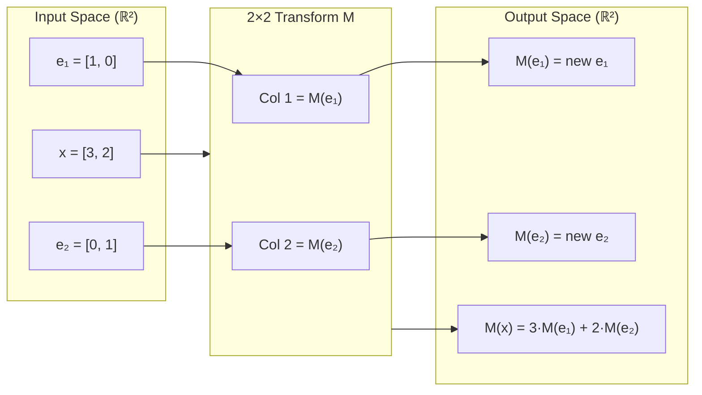

# Matrix Transformations

## Learning Objectives

1. Implement the four canonical 2D transformation matrices (scale, rotate, shear, reflect) and apply them to arbitrary vectors.
2. Compose multiple transformations via matrix multiplication and verify that the composed matrix produces identical output to sequential application.
3. Diagnose what a given matrix does to a vector by inspecting its column vectors.
4. Build a transform pipeline that projects high-dimensional account data into a lower-dimensional scoring space.

## The Problem

You keep running into phrases like "apply a rotation matrix," "compute the eigenvectors of the covariance matrix," or "project the embeddings into a lower dimension." Each of those operations assumes you already know what a matrix does to space. If you do not, the rest is memorized jargon.

A matrix is not a spreadsheet. It is a function that takes a vector as input and produces a new vector as output. The function is linear, which means it preserves straight lines and the origin, but it can stretch, rotate, shear, collapse, or reflect everything else. Every transformation a neural network applies to data, every dimensionality reduction technique in your analytics stack, and every similarity computation in your enrichment workflow boils down to one of these spatial operations or a chain of them.

The specific problem: you cannot reason about whether a transform preserves information, distorts distances, or collapses dimensions until you can look at a matrix and predict its effect on a vector. This lesson builds that intuition by implementing each canonical transform, composing them, and extending the pattern to higher dimensions where the same mechanism drives account scoring and embedding lookups.

## The Concept

A linear transformation from ℝ² to ℝ² is fully determined by where it sends the two basis vectors. The first basis vector `[1, 0]` lands somewhere; the second basis vector `[0, 1]` lands somewhere else. Write those two destination vectors as the columns of a 2×2 matrix, and you have encoded the entire transformation. Every other point in the plane is dragged along as a linear combination of those two columns, which is exactly what matrix-vector multiplication computes.

This generalizes to any dimension. A matrix of shape m×n encodes a map from ℝⁿ to ℝᵐ: each of the n columns tells you where the corresponding basis vector of the input space lands in the output space. The multiplication `A @ x` reconstructs where x goes by mixing those columns according to x's coordinates.



The four canonical 2D transforms each have a recognizable matrix form. A **scaling** matrix is diagonal — it stretches or compresses along each axis independently. A **rotation** matrix has cosines on the diagonal and ±sines on the off-diagonal, preserving all distances and angles. A **shear** matrix has ones on the diagonal and a nonzero off-diagonal entry, sliding points parallel to one axis proportional to their coordinate on the other. A **reflection** matrix has a determinant of −1, flipping orientation across a line through the origin.

Composition of transformations is matrix multiplication. If you first rotate then scale, the combined effect is captured by the product `S @ R` (note: matrix multiplication is applied right-to-left, so R acts first). This is why the order of operations in a transform pipeline matters — `S @ R` and `R @ S` generally produce different spaces. The composed matrix itself encodes the entire pipeline, so applying it once to a vector yields the same result as applying the individual transforms in sequence.

Eigenvalues and eigenvectors emerge naturally from this framework. An eigenvector is a direction that the matrix does not reorient — it only scales. The eigenvalue is the scaling factor. A rotation matrix in 2D has no real eigenvectors (it rotates every direction), while a scaling matrix has eigenvectors aligned with the axes. This property becomes critical when a matrix represents a covariance structure: its eigenvectors point along the directions of maximum variance, and its eigenvalues quantify how much variance each direction captures. That is the mechanism behind principal component analysis, which you will encounter when projecting high-dimensional account feature matrices into scoring planes.

## Build It

The following code defines all four canonical 2D transforms, applies each to a set of test vectors, and prints before/after coordinates so you can verify the spatial effect from the numbers alone.

```python
import numpy as np

theta = np.radians(30)

scale = np.array([[2.0, 0.0],
                  [0.0, 0.5]])

rotate = np.array([[np.cos(theta), -np.sin(theta)],
                   [np.sin(theta),  np.cos(theta)]])

shear = np.array([[1.0, 1.0],
                  [0.0, 1.0]])

reflect_x = np.array([[1.0,  0.0],
                      [0.0, -1.0]])

transforms = {
    "Scale (2x, 0.5x)": scale,
    "Rotate 30°": rotate,
    "Shear x by y": shear,
    "Reflect over x-axis": reflect_x,
}

vectors = np.array([
    [1, 0],
    [0, 1],
    [1, 1],
    [3, 2],
], dtype=float).T

print("=== Input Vectors ===")
for i in range(vectors.shape[1]):
    print(f"  v{i+1} = {vectors[:, i]}")
print()

for name, M in transforms.items():
    result = M @ vectors
    print(f"=== {name} ===")
    print(f"Matrix:\n{M}")
    print(f"determinant = {np.linalg.det(M):.4f}")
    print("Output vectors:")
    for i in range(result.shape[1]):
        print(f"  v{i+1}' = [{result[0, i]:.4f}, {result[1, i]:.4f}]")
    print()
```

Now compose two transforms and verify that applying the composed matrix once produces the same result as applying the individual matrices in sequence. This is the property that lets you collapse a multi-step pipeline into a single operation.

```python
v = np.array([3.0, 4.0])

sequential = scale @ (rotate @ v)
combined_matrix = scale @ rotate
combined_result = combined_matrix @ v

print("=== Composition Verification ===")
print(f"Original vector: {v}")
print(f"Sequential (rotate then scale): [{sequential[0]:.6f}, {sequential[1]:.6f}]")
print(f"Composed matrix applied once:   [{combined_result[0]:.6f}, {combined_result[1]:.6f}]")
print(f"Match: {np.allclose(sequential, combined_result)}")
print()
print(f"Composed matrix (Scale @ Rotate):\n{combined_matrix}")
print()

reversed_matrix = rotate @ scale
reversed_result = reversed_matrix @ v
print(f"Reversed order (Rotate @ Scale): [{reversed_result[0]:.6f}, {reversed_result[1]:.6f}]")
print(f"Same as original order? {np.allclose(combined_result, reversed_result)}")
```

The last check confirms that `S @ R ≠ R @ S` in general — order matters, and the composed matrix encodes a specific sequence of spatial operations.

## Use It

Every embedding operation in your GTM stack is a matrix transformation. When a tool computes cosine similarity between a prospect's embedding vector and an ICP centroid, the dot product at the core of that computation is a 1×n matrix multiplied by an n×1 vector — a linear map from ℝⁿ to ℝ¹ that collapses a high-dimensional representation into a single score. Clay's embedding and vector lookup feature [CITATION NEEDED — concept: Clay's embedding/vector lookup feature] uses this mechanism to rank prospects against a stored ICP representation, and the matrix structure is what makes the computation batchable across thousands of accounts.

Dimensionality reduction on account feature matrices is the same mechanism at larger scale. Principal component analysis (PCA) constructs a projection matrix whose rows are the eigenvectors of the feature covariance matrix — the directions of maximum variance in your firmographic data. Multiplying a raw feature matrix by this projection matrix transforms every account from a high-dimensional firmographic vector (employee count, revenue, tech stack size, funding stage, growth rate) into a lower-dimensional score vector. The eigenvalues tell you how much information each dimension of the projection retains, which is how you decide whether a 2D scoring plane loses too much signal.

This is foundational for Zone 03 (Targeting & Enrichment): ICP scoring, account segmentation, and TAM prioritization all rely on these linear maps. The Python environment from Zone 01 — where you run Clay webhooks and Apollo API calls — is the same environment where you build and test these transform pipelines before deploying them into production scoring workflows.

## Ship It

Build a working account-feature transformer. The pipeline accepts a matrix of raw firmographic features, normalizes each column to zero mean and unit variance, projects the result into a 2D scoring space using a fixed projection matrix, and prints the scored vectors alongside rank information that confirms the projection preserved enough structure to differentiate accounts.

```python
import numpy as np

accounts = np.array([
    [  50,   500_000,  2, 1],
    [ 200,  2_000_000,  5, 2],
    [ 800,  8_000_000,  9, 3],
    [1500, 15_000_000, 12, 4],
    [5000, 60_000_000, 20, 7],
], dtype=float)

feature_names = ["employees", "revenue", "tech_count", "funding_stage"]

print("=== Raw Account Features ===")
print(f"Shape: {accounts.shape}")
print(f"{'Account':<10}", end="")
for name in feature_names:
    print(f"{name:<15}", end="")
print()
for i, row in enumerate(accounts):
    print(f"  #{i+1:<8}", end="")
    for val in row:
        print(f"{val:<15.1f}", end="")
print()

means = accounts.mean(axis=0)
stds = accounts.std(axis=0)
normalized = (accounts - means) / stds

print("\n=== Normalized Features ===")
print(f"Column means: {normalized.mean(axis=0).round(6)}")
print(f"Column stds:  {normalized.std(axis=0).round(6)}")

np.random.seed(42)
random_projection = np.random.randn(4, 2)
projection, _ = np.linalg.qr(random_projection)

scores = normalized @ projection

print("\n=== 2D Projection Matrix ===")
print(projection)
print(f"Projection shape: {projection.shape}")
print(f"Columns are orthonormal: {np.allclose(projection.T @ projection, np.eye(2))}")

print("\n=== Account Scores (2D) ===")
for i, score in enumerate(scores):
    magnitude = np.linalg.norm(score)
    print(f"  Account #{i+1}: ({score[0]:+.4f}, {score[1]:+.4f})  |v|={magnitude:.4f}")

distances_from_origin = np.linalg.norm(scores, axis=1)
ranked = np.argsort(distances_from_origin)[::-1]

print("\n=== Accounts Ranked by Score Magnitude ===")
for rank, idx in enumerate(ranked):
    print(f"  {rank+1}. Account #{idx+1} — magnitude {distances_from_origin[idx]:.4f}")

print(f"\nOriginal rank (matrix): {np.linalg.matrix_rank(accounts)}")
print(f"Normalized rank:        {np.linalg.matrix_rank(normalized)}")
print(f"Projected rank:         {np.linalg.matrix_rank(scores)}")
print("Rank dropped → information lost in projection (expected for dim reduction).")
```

The rank comparison at the end demonstrates a property you need to internalize: projecting from 4 dimensions to 2 inherently loses information. The rank drops because the projection matrix collapses the 4-dimensional feature space onto a 2-dimensional plane. Whether that loss is acceptable depends on whether the discarded dimensions carried signal or noise — and that is what eigenvalue analysis (covered in the next lesson) lets you quantify.

## Exercises

**Easy.** Given the following matrix, print its two column vectors and predict whether it scales, rotates, shears, or reflects. Verify your prediction by applying it to `[1, 0]` and `[0, 1]`.

```python
import numpy as np
M = np.array([[0.8, -0.6], [0.6, 0.8]])
print(f"Col 1: {M[:, 0]}")
print(f"Col 2: {M[:, 1]}")
print(f"M @ [1,0] = {M @ np.array([1, 0])}")
print(f"M @ [0,1] = {M @ np.array([0, 1])}")
print(f"det(M) = {np.linalg.det(M):.4f}")
```

**Medium.** Compose a 45° rotation with a 2× uniform scale. Apply both the composed matrix and the sequential transforms to five test vectors and confirm they produce identical results. Then reverse the order and check whether the results differ.

**Hard.** Construct a 3×2 projection matrix that collapses a 3D firmographic vector (employees, revenue, tech_count) onto a 2D scoring plane. Apply it to a 6×3 account matrix. Print the rank before and after projection, and identify which input dimension contributes most to the first scoring axis by examining the projection matrix columns.

## Key Terms

**Linear transformation** — A function from ℝⁿ to ℝᵐ that preserves linear combinations (sums and scalar multiples). Fully determined by where it maps the basis vectors.

**Column interpretation** — Reading a matrix by its columns: column j tells you where the j-th basis vector of the input space lands in the output space.

**Determinant** — The signed scaling factor of area (2D) or volume (3D) under the transformation. `|det| > 1` expands space; `|det| < 1` contracts it; `det < 0` reverses orientation.

**Composition** — Applying one transformation after another. Encoded as matrix multiplication: `S @ R` means "first apply R, then apply S." Order matters.

**Eigenvector** — A nonzero vector whose direction is unchanged by the transformation; the matrix only scales it. The scaling factor is the eigenvalue.

**Projection matrix** — A matrix that maps vectors from a higher-dimensional space to a lower-dimensional one, necessarily reducing rank and discarding information.

## Sources

- [CITATION NEEDED — concept: Clay's embedding/vector lookup feature for prospect-to-ICP similarity matching]
- Zone 01 → Zone 03 redirect: Python environment used for Clay webhooks and Apollo API calls maps to TAM Mapping (1.1) and the Signal Machine + Score & Qualify cluster in Zone 03 (Targeting & Enrichment). Source: `stages/00-b-gtm-content-mapping/output/gtm-topic-map.md`