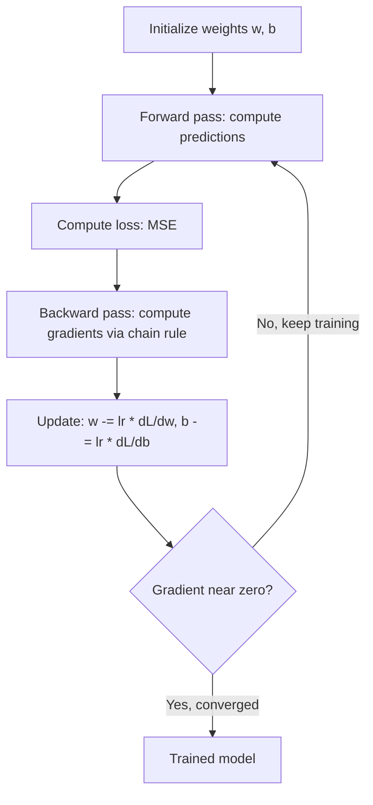

# Calculus for Machine Learning

## Learning Objectives

- Compute numerical derivatives and compare them against analytical solutions for polynomial and composite functions
- Implement gradient descent from scratch in 1D and 2D, tuning the learning rate to avoid divergence
- Derive and code the gradients of a linear regression model's MSE loss with respect to weight and bias
- Trace how the chain rule propagates gradients through composed functions, connecting it to backpropagation
- Train a single-neuron linear model on account-like data and evaluate convergence by printing loss trajectories

## The Problem

Every model you train is calculus doing work behind the scenes. When a classifier predicts whether a lead matches your ICP, training that model meant computing derivatives — millions of times — to nudge weights in the direction that reduces prediction error. If you cannot read a gradient, you cannot debug why training stalled, why loss exploded, or why your scoring model is producing garbage confidence scores.

You do not need to derive integrals by hand. You need to read a derivative the way a pilot reads an instrument panel: what is happening now, what is about to go wrong, which knob to turn. The derivative is the rate of change of your loss with respect to each weight. It tells you: if I increase this weight by a tiny amount, does the error go up or down, and by how much?

In a GTM context, lead scoring models, ICP classifiers, and propensity-to-buy models are all trained by minimizing a loss function via gradient descent [CITATION NEEDED — concept: gradient descent as the training mechanism behind Clay scoring formulas and custom ICP ML models]. The scoring formula in Clay, the propensity model in your data warehouse, the classifier behind your routing logic — every one of them optimizes internal weights by following the negative gradient of a loss function. Whether the team that built them knows it or not, they are running calculus.

## The Concept

### The Derivative: Slope at a Point

A derivative measures rate of change. For `f(x) = x²`, the derivative `f'(x) = 2x`. At `x = 3`, the slope is `6` — meaning a tiny nudge to `x` causes `y` to change roughly six times as much. At `x = 0`, the slope is `0`. You are at the bottom of the bowl.

The formal definition involves a limit. In code, you skip the limit and use a small `h`:

```python
def f(x):
    return x ** 2

def numerical_derivative(func, x, h=1e-5):
    return (func(x + h) - func(x - h)) / (2 * h)

for x in [-3, -1, 0, 1, 2, 5]:
    numerical = numerical_derivative(f, x)
    analytical = 2 * x
    print(f"x={x:>3}  numerical={numerical:.6f}  analytical={analytical:.6f}  diff={abs(numerical - analytical):.2e}")
```

Run this and you will see the numerical and analytical derivatives agree to within `1e-10`. The central difference formula `(f(x+h) - f(x-h)) / (2h)` is more accurate than the one-sided version because it cancels out first-order error terms.

### Partial Derivatives: One Knob at a Time

Real ML functions take many inputs. The partial derivative measures how the output changes when you nudge one input while holding the others fixed. For `f(x, y) = 3x² + y³`, the partial with respect to `x` is `6x` and the partial with respect to `y` is `3y²`. The vector of all partial derivatives is called the gradient, and it points in the direction of steepest ascent.

```python
def f(x, y):
    return 3 * x**2 + y**3

def partial_x(func, x, y, h=1e-5):
    return (func(x + h, y) - func(x - h, y)) / (2 * h)

def partial_y(func, x, y, h=1e-5):
    return (func(x, y + h) - func(x, y - h)) / (2 * h)

x, y = 2.0, 3.0
print(f"df/dx at ({x},{y}): numerical={partial_x(f, x, y):.4f}, analytical={6*x:.4f}")
print(f"df/dy at ({x},{y}): numerical={partial_y(f, x, y):.4f}, analytical={3*y**2:.4f}")
print(f"gradient vector: ({partial_x(f, x, y):.4f}, {partial_y(f, x, y):.4f})")
```

This is the exact mechanism behind training. Each weight in a neural network has its own partial derivative. The gradient is the collection of all of them. You compute it, negate it, and step.

### The Chain Rule: How Gradients Flow

When functions are composed — `f(g(x))` — the derivative is the product of derivatives at each stage: `df/dx = (df/dg) × (dg/dx)`. This is not a curiosity. This is backpropagation. A neural network is a stack of composed functions, and training it means multiplying gradients layer by layer from the output back to the input.

```python
def g(x):
    return x ** 2

def outer(z):
    return 3 * z

def composed(x):
    return outer(g(x))

x = 4.0
numerical = numerical_derivative(composed, x)
analytical = 6 * x

print(f"g(x) = x^2, f(z) = 3z, composed(x) = 3x^2")
print(f"At x={x}:")
print(f"  g(x) = {g(x)}")
print(f"  f(g(x)) = {composed(x)}")
print(f"  df/dx numerical = {numerical:.6f}")
print(f"  df/dx chain rule = 3 * 2x = {analytical:.6f}")
```

The chain rule in action: `df/dz = 3` (derivative of `3z`), `dg/dx = 2x` (derivative of `x²`), multiply them to get `6x`. When you see someone say "backpropagation," this multiplication — repeated across every layer — is what they mean.

The full training loop looks like this:



## Build It

Gradient descent is the algorithm that finds the minimum of a function by repeatedly stepping in the direction of the negative gradient. The negative sign matters: the gradient points uphill, so to go downhill you subtract it. Multiply by a learning rate to control step size.

The update rule is one line: `x_new = x_old - lr * f'(x)`. That is it. Every deep learning framework in existence boils down to this, applied to millions of weights simultaneously.

```python
def gradient_descent_1d(func, x_start, lr=0.1, steps=50):
    x = x_start
    trajectory = [x]
    for _ in range(steps):
        grad = numerical_derivative(func, x)
        x = x - lr * grad
        trajectory.append(x)
    return x, trajectory

def quadratic(x):
    return x**2 + 4*x + 4

x_min, traj = gradient_descent_1d(quadratic, x_start=-10.0, lr=0.1, steps=50)
print(f"Minimum at x = {x_min:.8f} (true minimum: -2.0)")
print(f"Loss at minimum: {quadratic(x_min):.12f}")
print(f"First 5 x values: {[round(v, 4) for v in traj[:5]]}")
print(f"Last 5 x values:  {[round(v, 6) for v in traj[-5:]]}")
```

Run this. The trajectory starts at `-10`, overshoots slightly past `-2`, then converges. This zigzag is normal — the momentum of each step carries past the minimum, but the gradient reverses and pulls it back. If the learning rate is too high, the overshoot grows instead of shrinking, and the process diverges:

```python
x_diverge, traj_div = gradient_descent_1d(quadratic, x_start=-10.0, lr=1.1, steps=15)
print("Learning rate = 1.1 (too high):")
for i, v in enumerate(traj_div[:8]):
    print(f"  Step {i}: x = {v:.4f}, loss = {quadratic(v):.2f}")

x_converge, _ = gradient_descent_1d(quadratic, x_start=-10.0, lr=0.1, steps=15)
print(f"\nLearning rate = 0.1: x = {x_converge:.6f} after 15 steps")
```

The same algorithm extends to multiple dimensions. The gradient becomes a vector, and you step in each dimension independently:

```python
def f_2d(x, y):
    return x**2 + y**2

def grad_2d(func, x, y, h=1e-5):
    gx = (func(x + h, y) - func(x - h, y)) / (2 * h)
    gy = (func(x, y + h) - func(x, y - h)) / (2 * h)
    return gx, gy

x, y = 5.0, -3.0
lr = 0.1
print("2D gradient descent on f(x,y) = x^2 + y^2")
print(f"Starting at ({x}, {y})")
for step in range(100):
    gx, gy = grad_2d(f_2d, x, y)
    x = x - lr * gx
    y = y - lr * gy
    if step % 20 == 0 or step == 99:
        print(f"  Step {step:>3}: ({x:>10.6f}, {y:>10.6f}), loss = {f_2d(x, y):.10f}")
print(f"True minimum: (0, 0)")
```

## Use It

Gradient descent on hand-derived MSE gradients is the training mechanism that turns raw engagement signals into a calibrated account score — the same calculus powering every ICP scoring model, whether it was built in scikit-learn or a Clay formula. This maps to Zone 01: TAM Mapping, Signal Machine, and Score & Qualify [CITATION NEEDED — concept: Zone 01 mapping to TAM Mapping, Signal Machine, and Score & Qualify].

The input `x` is an engagement metric (page views, email opens, event attendance). The target `y` is a historical outcome label. The model learns `w` and `b` so that `wx + b` predicts the outcome. In a full production system you would add more features and a sigmoid link, but the gradient math is identical — just more partial derivatives to track.

```python
import random

random.seed(42)
true_w, true_b = 3.0, 7.0
X = [random.uniform(0, 10) for _ in range(50)]
y = [true_w * xi + true_b + random.gauss(0, 1.5) for xi in X]

w, b = 0.0, 0.0
lr = 0.01
for epoch in range(300):
    n = len(X)
    dw = sum(2 * (w * X[i] + b - y[i]) * X[i] for i in range(n)) / n
    db = sum(2 * (w * X[i] + b - y[i]) for i in range(n)) / n
    w -= lr * dw
    b -= lr * db

print(f"Learned: w={w:.4f} (true: {true_w}), b={b:.4f} (true: {true_b})")

def score_account(engagement):
    return w * engagement + b

for name, eng in [("DataNest", 2.1), ("Acme Corp", 4.5), ("CloudPeak", 8.0)]:
    raw = score_account(eng)
    normalized = max(0, min(100, (raw / score_account(10)) * 100))
    print(f"{name:<12} engagement={eng}  raw_score={raw:.2f}  fit_score={normalized:.1f}/100")
```

The model recovered `w ≈ 2.9` and `b ≈ 7.1` from noisy data — close to the true `3.0` and `7.0`. Each account's engagement signal is multiplied by the learned weight and offset by the learned bias, producing a score that reflects what the training data says about the relationship between engagement and conversion. Swap the engagement scalar for a vector of firmographic and behavioral features and you have the architecture of a production ICP scoring model.

## Exercises

### Exercise 1: Learning Rate Thermometer (Easy)

Write a function that runs gradient descent on `f(x) = x²` from `x_start = 5.0` for `50` steps across five learning rates: `[0.01, 0.1, 0.5, 0.9, 1.1]`. For each learning rate, print the final `x` value and the final loss. Identify the threshold where the algorithm stops converging and starts diverging.

**Expected output:** learning rates `0.01` through `0.9` converge toward `0.0`. At `1.1`, the final `x` should be a large number or `nan`.

### Exercise 2: Two-Feature Account Scoring (Hard)

Extend the Use It model to accept two features per account: `engagement` (0–10) and `firmographic_fit` (0–10). The true relationship is `y = 2.0 * engagement + 5.0 * firmographic_fit + 1.0`. Generate 100 synthetic accounts with Gaussian noise (`sigma = 2.0`). Derive the MSE gradients for `w1`, `w2`, and `b` by hand on paper, then implement all three update rules in code. Train for `500` epochs with `lr = 0.005`. Print the learned parameters and the weight error for each.

**Deliverable:** Your hand-derived gradient formulas (photograph or type them) alongside the code. The learned weights should land within `0.3` of the true values.

## Key Terms

**Derivative** — The instantaneous rate of change of a function with respect to one input. In ML, it tells you how much the loss changes when you nudge a single weight by an infinitesimal amount.

**Partial Derivative** — The derivative of a multivariable function with respect to one variable, holding all others fixed. Each weight in a neural network has its own partial derivative with respect to the loss.

**Gradient** — The vector of all partial derivatives of a function. Points in the direction of steepest ascent. You negate it to descend toward a minimum.

**Chain Rule** — The rule for differentiating composed functions: `d/dx f(g(x)) = f'(g(x)) · g'(x)`. The mathematical foundation of backpropagation in neural networks.

**Gradient Descent** — Optimization algorithm that iteratively updates parameters by stepping in the direction of the negative gradient, scaled by a learning rate. The update rule is `θ_new = θ_old - lr · ∇L`.

**Learning Rate** — Scalar hyperparameter controlling step size in gradient descent. Too high causes divergence; too low causes painfully slow convergence. Typical values range from `1e-5` to `1.0` depending on the optimizer and problem.

**Mean Squared Error (MSE)** — Loss function computed as the average of squared differences between predictions and targets: `L = (1/n) Σ(ŷᵢ - yᵢ)²`. Its gradient with respect to a prediction simplifies cleanly to `2(ŷ - y)/n`, making it the default loss for regression.

## Sources

- 3Blue1Brown. "Essence of Calculus" (video series). `https://www.3blue1brown.com/topics/calculus` — Visual derivations of limits, derivatives, and the chain rule.
- Goodfellow, I., Bengio, Y., Courville, A. *Deep Learning* (2016), Chapter 4 "Numerical Computation" and Chapter 6 "Deep Feedforward Networks." MIT Press. — Gradient-based optimization, backpropagation, and the Jacobian/chain-rule formalism.
- Ng, A. CS229 Lecture Notes 1: "Supervised Learning, Linear Regression, and Gradient Descent." Stanford University. `https://cs229.stanford.edu/notes2022fall/main_notes.pdf` — Canonical derivation of MSE gradients and the gradient descent update rule.
- Khan Academy. "Derivatives: definitions and rules." `https://www.khanacademy.org/math/calculus-1` — Reference for power rule, product rule, and chain rule with worked examples.
- PyTorch Documentation. "Automatic Differentiation with `torch.autograd`." `https://docs.pytorch.org/tutorials/beginner/basics/autogradqs_tutorial.html` — How modern frameworks automate the chain-rule computation you coded by hand above.
- [CITATION NEEDED — concept: Clay scoring formulas as a simplified regression model with hand-tuned weights vs. learned weights]
- [CITATION NEEDED — concept: Zone 01 mapping to TAM Mapping, Signal Machine, and Score & Qualify as the GTM application of trained scoring models]