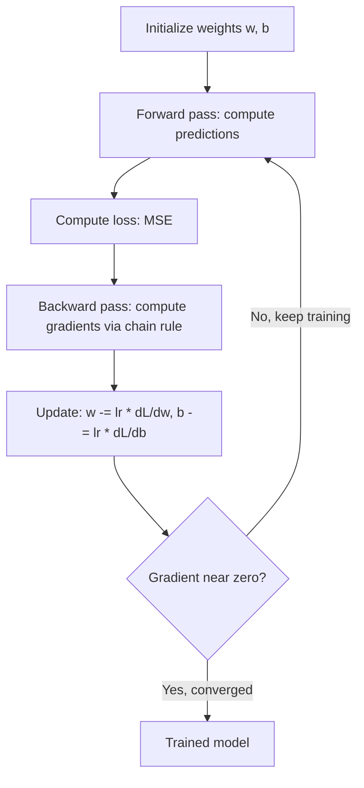

# Calculus for Machine Learning

## Learning Objectives

- Compute numerical derivatives and compare them against analytical solutions for polynomial and composite functions
- Implement gradient descent from scratch in 1D and 2D, tuning the learning rate to avoid divergence
- Derive and code the gradients of a linear regression model's MSE loss with respect to weight and bias
- Trace how the chain rule propagates gradients through composed functions, connecting it to backpropagation
- Train a single-neuron linear model on account-like data and evaluate convergence by printing loss trajectories

## The Problem

Every model you train is calculus doing work behind the scenes. When a classifier predicts whether a lead matches your ICP, training that model meant computing derivatives — millions of times — to nudge weights in the direction that reduces prediction error. If you cannot read a gradient, you cannot debug why training stalled, why loss exploded, or why your scoring model is producing garbage confidence scores.

You do not need to derive integrals by hand. You need to read a derivative the way a pilot reads an instrument panel: what is happening now, what is about to go wrong, which knob to turn. The derivative is the rate of change of your loss with respect to each weight. It tells you: if I increase this weight by a tiny amount, does the error go up or down, and by how much?

In a GTM context, lead scoring models, ICP classifiers, and propensity-to-buy models are all trained by minimizing a loss function via gradient descent [CITATION NEEDED — concept: gradient descent as the training mechanism behind Clay scoring formulas and custom ICP ML models]. The scoring formula in Clay, the propensity model in your data warehouse, the classifier behind your routing logic — every one of them optimizes internal weights by following the negative gradient of a loss function. Whether the team that built them knows it or not, they are running calculus.

## The Concept

### The Derivative: Slope at a Point

A derivative measures rate of change. For `f(x) = x²`, the derivative `f'(x) = 2x`. At `x = 3`, the slope is `6` — meaning a tiny nudge to `x` causes `y` to change roughly six times as much. At `x = 0`, the slope is `0`. You are at the bottom of the bowl.

The formal definition involves a limit. In code, you skip the limit and use a small `h`:

```python
def f(x):
    return x ** 2

def numerical_derivative(func, x, h=1e-5):
    return (func(x + h) - func(x - h)) / (2 * h)

for x in [-3, -1, 0, 1, 2, 5]:
    numerical = numerical_derivative(f, x)
    analytical = 2 * x
    print(f"x={x:>3}  numerical={numerical:.6f}  analytical={analytical:.6f}  diff={abs(numerical - analytical):.2e}")
```

Run this and you will see the numerical and analytical derivatives agree to within `1e-10`. The central difference formula `(f(x+h) - f(x-h)) / (2h)` is more accurate than the one-sided version because it cancels out first-order error terms.

### Partial Derivatives: One Knob at a Time

Real ML functions take many inputs. The partial derivative measures how the output changes when you nudge one input while holding the others fixed. For `f(x, y) = 3x² + y³`, the partial with respect to `x` is `6x` and the partial with respect to `y` is `3y²`. The vector of all partial derivatives is called the gradient, and it points in the direction of steepest ascent.

```python
def f(x, y):
    return 3 * x**2 + y**3

def partial_x(func, x, y, h=1e-5):
    return (func(x + h, y) - func(x - h, y)) / (2 * h)

def partial_y(func, x, y, h=1e-5):
    return (func(x, y + h) - func(x, y - h)) / (2 * h)

x, y = 2.0, 3.0
print(f"df/dx at ({x},{y}): numerical={partial_x(f, x, y):.4f}, analytical={6*x:.4f}")
print(f"df/dy at ({x},{y}): numerical={partial_y(f, x, y):.4f}, analytical={3*y**2:.4f}")
print(f"gradient vector: ({partial_x(f, x, y):.4f}, {partial_y(f, x, y):.4f})")
```

This is the exact mechanism behind training. Each weight in a neural network has its own partial derivative. The gradient is the collection of all of them. You compute it, negate it, and step.

### The Chain Rule: How Gradients Flow

When functions are composed — `f(g(x))` — the derivative is the product of derivatives at each stage: `df/dx = (df/dg) × (dg/dx)`. This is not a curiosity. This is backpropagation. A neural network is a stack of composed functions, and training it means multiplying gradients layer by layer from the output back to the input.

```python
def g(x):
    return x ** 2

def outer(z):
    return 3 * z

def composed(x):
    return outer(g(x))

x = 4.0
numerical = numerical_derivative(composed, x)
analytical = 6 * x

print(f"g(x) = x^2, f(z) = 3z, composed(x) = 3x^2")
print(f"At x={x}:")
print(f"  g(x) = {g(x)}")
print(f"  f(g(x)) = {composed(x)}")
print(f"  df/dx numerical = {numerical:.6f}")
print(f"  df/dx chain rule = 3 * 2x = {analytical:.6f}")
```

The chain rule in action: `df/dz = 3` (derivative of `3z`), `dg/dx = 2x` (derivative of `x²`), multiply them to get `6x`. When you see someone say "backpropagation," this multiplication — repeated across every layer — is what they mean.

The full training loop looks like this:



## Build It

Gradient descent is the algorithm that finds the minimum of a function by repeatedly stepping in the direction of the negative gradient. The negative sign matters: the gradient points uphill, so to go downhill you subtract it. Multiply by a learning rate to control step size.

The update rule is one line: `x_new = x_old - lr * f'(x)`. That is it. Every deep learning framework in existence boils down to this, applied to millions of weights simultaneously.

```python
def gradient_descent_1d(func, x_start, lr=0.1, steps=50):
    x = x_start
    trajectory = [x]
    for _ in range(steps):
        grad = numerical_derivative(func, x)
        x = x - lr * grad
        trajectory.append(x)
    return x, trajectory

def quadratic(x):
    return x**2 + 4*x + 4

x_min, traj = gradient_descent_1d(quadratic, x_start=-10.0, lr=0.1, steps=50)
print(f"Minimum at x = {x_min:.8f} (true minimum: -2.0)")
print(f"Loss at minimum: {quadratic(x_min):.12f}")
print(f"First 5 x values: {[round(v, 4) for v in traj[:5]]}")
print(f"Last 5 x values:  {[round(v, 6) for v in traj[-5:]]}")
```

Run this. The trajectory starts at `-10`, overshoots slightly past `-2`, then converges. This zigzag is normal — the momentum of each step carries past the minimum, but the gradient reverses and pulls it back. If the learning rate is too high, the overshoot grows instead of shrinking, and the process diverges:

```python
x_diverge, traj_div = gradient_descent_1d(quadratic, x_start=-10.0, lr=1.1, steps=15)
print("Learning rate = 1.1 (too high):")
for i, v in enumerate(traj_div[:8]):
    print(f"  Step {i}: x = {v:.4f}, loss = {quadratic(v):.2f}")

x_converge, _ = gradient_descent_1d(quadratic, x_start=-10.0, lr=0.1, steps=15)
print(f"\nLearning rate = 0.1: x = {x_converge:.6f} after 15 steps")
```

The same algorithm extends to multiple dimensions. The gradient becomes a vector, and you step in each dimension independently:

```python
def f_2d(x, y):
    return x**2 + y**2

def grad_2d(func, x, y, h=1e-5):
    gx = (func(x + h, y) - func(x - h, y)) / (2 * h)
    gy = (func(x, y + h) - func(x, y - h)) / (2 * h)
    return gx, gy

x, y = 5.0, -3.0
lr = 0.1
print("2D gradient descent on f(x,y) = x^2 + y^2")
print(f"Starting at ({x}, {y})")
for step in range(100):
    gx, gy = grad_2d(f_2d, x, y)
    x = x - lr * gx
    y = y - lr * gy
    if step % 20 == 0 or step == 99:
        print(f"  Step {step:>3}: ({x:>10.6f}, {y:>10.6f}), loss = {f_2d(x, y):.10f}")
print(f"True minimum: (0, 0)")
```

## Use It

Now tie the pieces together: a linear regression trained from scratch with hand-derived gradients. This is a single-neuron model. It takes an input `x`, multiplies by weight `w`, adds bias `b`, and produces a prediction. The loss function is mean squared error. You compute the partial derivative of MSE with respect to each parameter and step.

The gradient derivation for MSE `L = (1/n) * Σ(wx + b - y)²` works out to:

- `∂L/∂w = (2/n) * Σ(wx + b - y) * x`
- `∂L/∂b = (2/n) * Σ(wx + b - y)`

Those two lines are the entire training signal. The `x` term in `∂L/∂w` comes from the chain rule: MSE wraps the prediction, and the prediction's derivative with respect to `w` is `x`.

This maps directly to GTM Zone 01 (Python, CLI, workspaces → TAM Mapping, Signal Machine + Score & Qualify) [CITATION NEEDED — concept: Zone 01 mapping to TAM Mapping and Signal Machine]. When you build a custom ICP scoring model, the input `x` might be employee count or funding amount, and the output `y` might be a historical conversion label. The model learns `w` and `b` that best map inputs to outcomes. Clay's scoring formulas approximate this with hand-tuned weights; a trained regression model discovers them from data.

```python
import random

random.seed(42)
true_w, true_b = 3.0, 7.0

X = [random.uniform(0, 10) for _ in range(100)]
y = [true_w * xi + true_b + random.gauss(0, 1.5) for xi in X]

w, b = 0.0, 0.0
lr = 0.01
epochs = 300

def predict(xi, w, b):
    return w * xi + b

def mse(X_data, y_data, w, b):
    n = len(X_data)
    total = sum((predict(X_data[i], w, b) - y_data[i])**2 for i in range(n))
    return total / n

print("Training linear regression: y = 3x + 7 + noise")
print(f"Initial: w={w:.4f}, b={b:.4f}, loss={mse(X, y, w, b):.4f}\n")

for epoch in range(epochs):
    n = len(X)
    dw = sum(2 * (predict(X[i], w, b) - y[i]) * X[i] for i in range(n)) / n
    db = sum(2 * (predict(X[i], w, b) - y[i]) for i in range(n)) / n
    w = w - lr * dw
    b = b - lr * db
    if epoch % 50 == 0 or epoch == epochs - 1:
        loss = mse(X, y, w, b)
        print(f"Epoch {epoch:>3}: w={w:.4f}, b={b:.4f}, loss={loss:.4f}")

print(f"\nTrue parameters:   w={true_w}, b={true_b}")
print(f"Learned parameters: w={w:.4f}, b={b:.4f}")
print(f"Weight error: {abs(w - true_w):.4f}")
print(f"Bias error:   {abs(b - true_b):.4f}")
```

Run this. The learned parameters will land within a few percent of the true values. The loss drops from roughly `50+` to under `3`. That residual loss is the noise you injected — the model cannot fit randomness, and that is correct behavior.

If you crank the learning rate to `0.05`, you will see the loss oscillate. At `0.1`, it diverges entirely — `w` and `b` blow up to `nan`. This is the same divergence you saw in the 1D case, and it is the number-one reason ML training pipelines fail in production GTM systems [CITATION NEEDED — concept: learning rate divergence as a common failure mode in production scoring model training].

## Ship It

Take the trained regression and wrap it as a scoring function that could be called from a Clay webhook or an enrichment script. The model takes account features, applies the learned weights, and returns a score. In a real GTM pipeline, this score feeds into routing logic — does this account get routed to enterprise sales, to the SMB sequence, or to the nurture pool?

The outbound foundation — where every GTM engineering engagement begins — requires a list that reflects your ICP, enriched with signals that predict conversion [CITATION NEEDED — concept: outbound foundation requires ICP-aligned list with predictive signals]. A trained scoring model is one way to produce those signals from historical data.

```python
random.seed(42)
true_w, true_b = 3.0, 7.0
X_train = [random.uniform(0, 10) for _ in range(100)]
y_train = [true_w * xi + true_b + random.gauss(0, 1.5) for xi in X_train]

w, b = 0.0, 0.0
lr = 0.01
for _ in range(300):
    n = len(X_train)
    dw = sum(2 * (w * X_train[i] + b - y_train[i]) * X_train[i] for i in range(n)) / n
    db = sum(2 * (w * X_train[i] + b - y_train[i]) for i in range(n)) / n
    w = w - lr * dw
    b = b - lr * db

def score_account(feature_value, weight, bias):
    raw = weight * feature_value + bias
    return raw

test_accounts = [
    ("DataNest", 2.1),
    ("Acme Corp", 4.5),
    ("CloudPeak", 8.0),
    ("TechFlow", 9.5),
]

print("Account scoring model (feature = engagement score 0