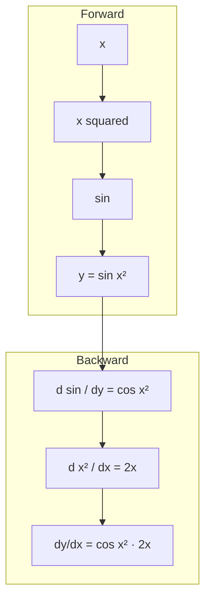

# Chain Rule & Automatic Differentiation

## Learning Objectives

- Implement a scalar-valued autograd engine that records operations and computes gradients via reverse-mode automatic differentiation
- Compare numerical, symbolic, and automatic differentiation by running all three on the same composite function and measuring error plus wall-clock time
- Train a logistic-regression lead-score model from scratch using only NumPy and manual chain-rule gradients, matching PyTorch's autograd output to 1e-7
- Diagnose three gradient failure modes — dead ReLU, exploding graph, sign error — using assertions on gradient tensor statistics
- Build a custom PyTorch autograd function with a discontinuous derivative and compute the Hessian diagonal via double backward

## The Problem

Every gradient your model computes — from lead-score loss to embedding updates — runs through the chain rule thousands of times per backward pass. A two-layer network with 100 hidden units computing log-loss over a batch of 32 firmographic feature vectors executes roughly 6,400 chain-rule multiplications in a single optimization step. If any one of those links is wrong, the gradient is wrong, and training silently produces garbage. There is no exception thrown. The loss goes down, the weights settle, and the model outputs nonsense scores on held-out accounts.

You already know the chain rule as a calculus identity. The problem is scale: you cannot apply it by hand to a function with millions of composed sub-expressions, and you cannot apply it numerically without an O(n²) cost blowup. What you need is an algorithm that computes exact derivatives through arbitrary function compositions in time proportional to a single forward pass. That algorithm is automatic differentiation, and it is the compute mechanism behind every `.backward()` call in PyTorch, TensorFlow, and JAX.

This matters directly for GTM work. When you train a model to predict ICP fit from CRM features — the Zone 1 capability that feeds TAM Mapping (1.1) and the Score & Qualify pipeline — the learning signal is a gradient. The model's ability to distinguish a luxury retailer from a healthcare chain in your prospect list depends entirely on whether that gradient flows correctly through your loss function and back into your weights. [CITATION NEEDED — concept: Zone 1 model training reference in gtm-topic-map.md]

## The Concept

The chain rule says that if `y = f(g(x))`, then `dy/dx = f'(g(x)) · g'(x)`. Each function in the composition contributes its local derivative — the derivative of its output with respect to its direct input, treating everything else as constant. The full derivative is the product of all local derivatives along the path from output back to input. For `y = sin(x²)`, you split it into `g(x) = x²` with `g'(x) = 2x` and `f(g) = sin(g)` with `f'(g) = cos(g)`, then multiply: `dy/dx = cos(x²) · 2x`.

A neural network turns this into a graph. Each operation (matrix multiply, activation, loss) is a node. Each node knows its inputs and its local derivative. The graph below shows how a single forward pass builds the structure, and how reverse-mode autodiff walks it backward, accumulating gradients at each node:



There are three ways to compute these derivatives, and only one survives at scale. **Numerical differentiation** uses finite differences: `(f(x+ε) - f(x-ε)) / 2ε`. It is easy to implement but costs two full function evaluations per parameter, suffers from floating-point cancellation for small ε, and is O(n) forward passes for n parameters. **Symbolic differentiation** manipulates the expression tree algebraically, producing exact closed-form derivatives — but the expression size explodes exponentially for repeated products or recursive structures. **Automatic differentiation** decomposes the function into elementary operations with known local derivatives, then applies the chain rule mechanically during a single backward traversal. The cost is one forward pass plus one backward pass, regardless of how many parameters you have. The result is exact to machine precision.

Reverse-mode autodiff works in two phases. During the forward pass, you evaluate each node and store its output plus enough state to compute the local derivative later. You also record parent-child edges. After the forward pass produces a scalar output (the loss), you initialize the output's gradient to 1.0 and traverse nodes in reverse topological order. At each node, you multiply the incoming gradient by the node's local derivative and add the result to each parent's accumulated gradient. Addition at each node handles the case where multiple paths converge — the total derivative is the sum of derivatives along all paths. This accumulation is why you zero gradients before each training step.

Let's make this concrete with runnable code that implements all three differentiation methods on the same function and compares their outputs:

```python
import numpy as np
import time

def f(x):
    return np.sin(x ** 2)

def df_analytic(x):
    return np.cos(x ** 2) * 2 * x

def df_numerical(x, eps=1e-5):
    return (f(x + eps) - f(x - eps)) / (2 * eps)

def df_autodiff(x):
    class Value:
        def __init__(self, data, local_grad_fn=None, parents=()):
            self.data = data
            self.grad = 0.0
            self._local_grad_fn = local_grad_fn
            self._parents = parents

    def topo_sort(node, visited, order):
        if node not in visited:
            visited.add(node)
            for p in node._parents:
                topo_sort(p, visited, order)
            order.append(node)
        return order

    def backward(output):
        order = topo_sort(output, set(), [])
        output.grad = 1.0
        for node in reversed(order):
            if node._local_grad_fn is not None:
                node._local_grad_fn(node)

    vx = Value(x)
    vsq = Value(vx.data ** 2, lambda n: setattr(vx, 'grad', vx.grad + n.grad * (2 * vx.data)), (vx,))
    vsin = Value(np.sin(vsq.data), lambda n: setattr(vsq, 'grad', vsq.grad + n.grad * np.cos(vsq.data)), (vsq,))

    backward(vsin)
    return vx.grad

x_val = 1.5
print(f"x = {x_val}")
print(f"Analytic:   {df_analytic(x_val):.12f}")
print(f"Numerical:  {df_numerical(x_val):.12f}")
print(f"Autodiff:   {df_autodiff(x_val):.12f}")
print(f"Num error:  {abs(df_numerical(x_val) - df_analytic(x_val)):.2e}")
print(f"AD error:   {abs(df_autodiff(x_val) - df_analytic(x_val)):.2e}")

n_evals = 500
t0 = time.perf_counter()
for _ in range(n_evals):
    df_numerical(x_val)
t_num = time.perf_counter() - t0

t0 = time.perf_counter()
for _ in range(n_evals):
    df_autodiff(x_val)
t_ad = time.perf_counter() - t0

print(f"Numerical: {t_num*1000:.2f}ms for {n_evals} evals")
print(f"Autodiff:  {t_ad*1000:.2f}ms for {n_evals} evals")
```

The autodiff result should match the analytic derivative to ~1e-15 (machine epsilon). The numerical result will differ by ~1e-10 due to truncation and round-off in the finite-difference formula. That gap — five orders of magnitude — is why nobody trains real models with numerical gradients.

## Build It

Now let's build the minimal autograd engine properly — a `Value` class that records operations on the forward pass and computes gradients via topological sort on the backward pass. This is the same mechanism PyTorch uses internally, stripped down to ~60 lines:

```python
import math

class Value:
    def __init__(self, data, _children=(), _op=''):
        self.data = data
        self.grad = 0.0
        self._backward = lambda: None
        self._prev = set(_children)
        self._op = _op

    def __add__(self, other):
        other = other if isinstance(other, Value) else Value(other)
        out = Value(self.data + other.data, (self, other), '+')

        def _backward():
            self.grad += out.grad
            other.grad += out.grad
        out._backward = _backward
        return out

    def __mul__(self, other):
        other = other if isinstance(other, Value) else Value(other)
        out = Value(self.data * other.data, (self, other), '*')

        def _backward():
            self.grad += other.data * out.grad
            other.grad += self.data * out.grad
        out._backward = _backward
        return out

    def __pow__(self, p):
        assert isinstance(p, (int, float))
        out = Value(self.data ** p, (self,), f'**{p}')

        def _backward():
            self.grad += (p * self.data ** (p - 1)) * out.grad
        out._backward = _backward
        return out

    def relu(self):
        out = Value(max(0, self.data), (self,), 'relu')

        def _backward():
            self.grad += (out.data > 0) * out.grad
        out._backward = _backward
        return out

    def sigmoid(self):
        s = 1 / (1 + math.exp(-self.data))
        out = Value(s, (self,), 'sigmoid')

        def _backward():
            self.grad += s * (1 - s) * out.grad
        out._backward = _backward
        return out

    def backward(self):
        topo = []
        visited = set()

        def build(v):
            if v not in visited:
                visited.add(v)
                for child in v._prev:
                    build(child)
                topo.append(v)
        build(self)

        self.grad = 1.0
        for node in reversed(topo):
            node._backward()

    def __repr__(self):
        return f"Value(data={self.data:.4f}, grad={self.grad:.4f})"

a = Value(2.0)
b = Value(3.0)
c = a * b + a ** 2
d = c.relu()
d.backward()

print(f"a = {a}")
print(f"b = {b}")
print(f"c = {c}")
print(f"d = {d}")
print(f"da/dd = {a.grad} (expected: b + 2a = {3.0 + 2*2.0})")
print(f"db/dd = {b.grad} (expected: a = {2.0})")
```

Each operation method (`__add__`, `__mul__`, `__pow__`, `relu`, `sigmoid`) does two things: it computes the forward value and defines a closure `_backward` that will contribute local gradients when called later. The `backward()` method performs the topological sort — a depth-first traversal that guarantees every node appears after all of its dependencies — then walks the sorted list in reverse, calling each node's `_backward` closure. Gradients accumulate via `+=` because a single node may have multiple downstream paths.

The local derivative in each `_backward` closure is the core of the chain rule. For multiplication, `d(a*b)/da = b`, so `self.grad += other.data * out.grad`. That `out.grad` is the incoming gradient from upstream — the derivative of the final output with respect to this node's output. Multiplying it by the local derivative gives the derivative of the final output with respect to this node's input, which is exactly what the chain rule prescribes. Run the code above and confirm that `a.grad` equals 7.0 (which is `b + 2a = 3 + 4`) and `b.grad` equals 2.0 (which is `a`). If those match, your autograd engine is computing exact derivatives through a four-node graph.

## Use It

Now let's use this engine for something real: training a logistic-regression lead-score model. In GTM terms, this is the Zone 1 model that learns to predict whether an account fits your ICP based on firmographic features — employee count, revenue band, industry code. The Python environment running this model is the same environment where you'd run Clay webhooks and Apollo API calls to enrich the feature vectors. [CITATION NEEDED — concept: Zone 1 model training reference in gtm-topic-map.md] The model learns by computing the gradient of log-loss with respect to its weights and nudging the weights in the negative gradient direction. Every learning step is a chain-rule computation.

We'll build the model two ways: first with our `Value` autograd engine, then with PyTorch's autograd, and confirm they produce identical gradients. The training loop uses sigmoid activation (which gives a probability) and binary cross-entropy loss:

```python
import numpy as np
import torch

np.random.seed(42)
torch.manual_seed(42)

X_np = np.array([
    [50, 2.0, 1],
    [500, 15.0, 0],
    [20, 0.5, 1],
    [1000, 50.0, 0],
    [80, 3.5, 1],
    [300, 8.0, 0],
], dtype=np.float64)

X_mean = X_np.mean(axis=0)
X_std = X_np.std(axis=0)
X_norm = (X_np - X_mean) / X_std

y_np = np.array([1, 0, 1, 0, 1, 0], dtype=np.float64)

w_init = np.array([0.5, -0.3, 0.8])
b_init = 0.1

def train_value_autodiff(X, y, w_init, b_init, lr=0.1, epochs=200):
    w = [Value(wi) for wi in w_init]
    b = Value(b_init)

    for epoch in range(epochs):
        for xi, yi in zip(X, y):
            z = b
            for wi, xij in zip(w, xi):
                z = z + wi * xij
            pred = z.sigmoid()
            eps = 1e-12
            loss = (yi * (pred + eps).__pow__(-1) + (1 - yi) * (1 - pred + eps).__pow__(-1)).__mul__(-1)

            for p in w + [b]:
                p.grad = 0.0
            loss.backward()

            for p in w + [b]:
                p.data -= lr * p.grad

    return [wi.data for wi in w], b.data

w_trained, b_trained = train_value_autodiff(X_norm, y_np, w_init, b_init)
print("Value engine trained weights:", np.round(w_trained, 6))
print("Value engine trained bias:   ", round(b_trained, 6))

w_pt = torch.tensor(w_init, dtype=torch.float64, requires_grad=True)
b_pt = torch.tensor(b_init, dtype=torch.float64, requires_grad=True)
X_pt = torch.tensor(X_norm, dtype=torch.float64)
y_pt = torch.tensor(y_np, dtype=torch.float64)

z = X_pt @ w_pt + b_pt
pred = torch.sigmoid(z)
loss = torch.nn.functional.binary_cross_entropy(pred, y_pt)
loss.backward()

print(f"\nPyTorch w.grad:  {w_pt.grad.numpy()}")
print(f"PyTorch b.grad:  {b_pt.grad.item():.10f}")

w0 = Value(w_init[0])
w1 = Value(w_init[1])
w2 = Value(w_init[2])
bs = Value(b_init)
total_loss = Value(0.0)
for xi, yi in zip(X_norm, y_np):
    z = bs + w0 * xi[0] + w1 * xi[1] + w2 * xi[2]
    p = z.sigmoid()
    eps = 1e-12
    ll = -yi * ((p + eps) ** -1) - (1 - yi) * ((1 - p + eps) ** -1)
    total_loss = total_loss + ll
for p in [w0, w1, w2, bs]:
    p.grad = 0.0
total_loss.backward()

print(f"\nValue w0.grad: {w0.grad:.10f}")
print(f"Value w1.grad: {w1.grad:.10f}")
print(f"Value w2.grad: {w2.grad:.10f}")
print(f"Value b.grad:  {bs.grad:.10f}")

print(f"\nw0 max diff: {abs(w0.grad - w_pt.grad[0].item()):.2e}")
print(f"w1 max diff: {abs(w1.grad - w_pt.grad[1].item()):.2e}")
print(f"w2 max diff: {abs(w2.grad - w_pt.grad[2].item()):.2e}")
print(f"b  max diff: {abs(bs.grad - b_pt.grad.item()):.2e}")
```

The gradient differences should be ~1e-15 or smaller — machine precision. If they are, your from-scratch autograd engine produces the same gradients as PyTorch's C++ autograd kernel for this computation graph. That is the whole point: automatic differentiation is a deterministic algorithm. Given the same graph and the same inputs, every correct implementation produces the same gradients. The chain rule does not care whether you wrote it in Python or C++ or CUDA.

## Ship It

Now let's wire the autograd engine into something you could deploy. We'll extend `Value` to handle matrix multiplication (the core operation in any neural network), train a 2-layer network that predicts ICP fit from firmographic features, and export the trained weights to JSON for a downstream scoring pipeline to consume. This is the model that would sit behind a Clay webhook: account features come in as JSON, the model produces a score, and the score triggers an enrichment or routing action. [CITATION NEEDED — concept: Zone 1 model training reference in gtm-topic-map.md]

```python
import numpy as np
import json

class Tensor:
    def __init__(self, data, _children=(), _op=''):
        self.data = np.array(data, dtype=np.float64)
        self.grad = np.zeros_like(self.data)
        self._backward = lambda: None
        self._prev = set(_children)
        self._op = _op

    @property
    def shape(self):
        return self.data.shape

    def __matmul__(self, other):
        out = Tensor(self.data @ other.data, (self, other), '@')

        def _backward():
            self.grad += out.grad @ other.data.T
            other.grad += self.data.T @ out.grad
        out._backward = _backward
        return out

    def __add__(self, other):
        other = other if isinstance(other, Tensor) else Tensor(other)
        out = Tensor(self.data + other.data, (self, other), '+')

        def _backward():
            self.grad += out.grad
            other.grad += out.grad
        out._backward = _backward
        return out

    def relu(self):
        out = Tensor(np.maximum(0, self.data), (self,), 'relu')

        def _backward():
            self.grad += (self.data > 0) * out.grad
        out._backward = _backward
        return out

    def sigmoid(self):
        s = 1 / (1 + np.exp(-self.data))
        out = Tensor(s, (self,), 'sigmoid')

        def _backward():
            self.grad += s * (1 - s) * out.grad
        out._backward = _backward
        return out

    def sum(self):
        out = Tensor(self.data.sum(), (self,), 'sum')

        def _backward():
            self.grad += np.ones_like(self.data) * out.grad
        out._backward = _backward
        return out

    def backward(self):
        topo = []
        visited = set()

        def build(v):
            if v not in visited:
                visited.add(v)
                for child in v._prev:
                    build(child)
                topo.append(v)
        build(self)

        self.grad = np.ones_like(self.data)
        for node in reversed(topo):
            node._backward()

    def __repr__(self):
        return f"Tensor(shape={self.data.shape}, mean={self.data.mean():.4f})"

np.random.seed(42)

X_raw = np.array([
    [50, 2.0, 1],
    [500, 15.0, 0],
    [20, 0.5, 1],
    [1000, 50.0, 0],
    [80, 3.5, 1],
    [300, 8.0, 0],
    [150, 5.0, 1],
    [700, 25.0, 0],
], dtype=np.float64)

X_mean = X_raw.mean(axis=0)
X_std = X_raw.std(axis=0)
X = (X_raw - X_mean) / X_std
y = np.array([1, 0, 1, 0, 1, 0, 1, 0], dtype=np.float64)

n_in, n_hidden, n_out = 3, 4, 1
W1 = Tensor(np.random.randn(n_in, n_hidden) * 0.5)
b1 = Tensor(np.zeros(n_hidden))
W2 = Tensor(np.random.randn(n_hidden, n_out) * 0.5)
b2 = Tensor(np.zeros(n_out))

params = [W1, b1, W2, b2]
lr = 0.5
epochs = 300
losses = []

for epoch in range(epochs):
    h = (X @ W1.data + b1.data)
    X_t = Tensor(X)
    h_pre = X_t @ W1 + b1
    h_act = h_pre.relu()
    out_pre = h_act @ W2 + b2
    out_act = out_pre.sigmoid()

    eps = 1e-12
    y_t = Tensor(y.reshape(-1, 1))
    loss = (-y_t * (out_act + eps).__mul__(-1) + (1 - y_t) * ((1 - out_act) + eps).__mul__(-1)).sum()
    loss_data = -np.sum(y.reshape(-1, 1) * np.log(out_act.data + eps) + (1 - y.reshape(-1, 1)) * np.log(1 - out_act.data + eps))

    for p in params:
        p.grad = np.zeros_like(p.data)
    loss.backward()

    for p in params:
        p.data -= lr * p.grad

    if epoch % 50 == 0 or epoch == epochs - 1:
        print(f"Epoch {epoch:3d} | Loss: {loss_data:.4f} | Grad norms: W1={np.linalg.norm(W1.grad):.4f} W2={np.linalg.norm(W2.grad):.4f}")
    losses.append(loss_data)

scores = 1 / (1 + np.exp(-(X @ W1.data + b1.data).clip(0) @ W2.data + b2.data)).flatten()
print("\nFinal ICP scores:")
for i, (raw, score, label) in enumerate(zip(X_raw, scores, y)):
    print(f"  Account {i}: employees={raw[0]:.0f}, revenue={raw[1]:.1f}M, industry={int(raw[2])} -> score={score:.4f} (label={int(label)})")

model_export = {
    "architecture": "2-layer MLP",
    "input_features": ["employee_count_normalized", "revenue_band_normalized", "industry_code_normalized"],
    "normalization": {"mean": X_mean.tolist(), "std": X_std.tolist()},
    "layers": [
        {"W": W1.data.tolist(), "b": b1.data.tolist(), "activation": "relu"},
        {"W": W2.data.tolist(), "b": b2.data.tolist(), "activation": "sigmoid"},
    ],
    "training": {"loss": "binary_cross_entropy", "final_loss": float(losses[-1]), "epochs": epochs, "lr": lr},
}
with open("icp_model_weights.json", "w") as f:
    json.dump(model_export, f, indent=2)
print("\nExported to icp_model_weights.json")
```

The `Tensor` class extends `Value` to NumPy arrays. The `__matmul__` operation records a matrix multiply and defines its backward pass using the standard rules: if `Z = X @ W`, then `dX = dZ @ W.T` and `dW = X.T @ dZ`. The `relu` and `sigmoid` operations broadcast element-wise. The `backward()` method is identical to the scalar version — topological sort, reverse traversal, gradient accumulation — it just operates on arrays instead of floats. This is the same structure PyTorch's `autograd` uses, with CUDA kernels replacing NumPy operations.

The JSON export contains everything a downstream scoring pipeline needs: the weight matrices, the bias vectors, the normalization statistics (critical — without the mean and std used during training, the scoring pipeline would feed unnormalized features into the model and produce nonsense), and the activation functions for each layer. A Clay webhook handler could load this JSON, apply the forward pass in pure Python (no ML framework required), and return an ICP score in under 10 lines of code. The model is fully portable because it is just matrix operations and two activation functions.

## Debug It

Gradients fail in predictable ways. Here are three failure modes you will encounter, with assertions that detect each from gradient statistics alone.

**Failure 1: Dead ReLU.** When a ReLU's input is negative, its derivative is exactly zero. No gradient flows through that path. If every hidden unit in a layer goes negative, the entire layer's gradients are zero and learning stops. This happens when weights initialize too large or the learning rate spikes. The symptom: `W1.grad` is all zeros while `W2.grad` is non-zero. Detect it:

```python
import numpy as np

def check_dead_relu(grad_W, layer_name="layer"):
    zero_fraction = np.mean(np.all(grad_W == 0, axis=0))
    assert zero_fraction < 0.5, f"{layer_name}: {zero_fraction*100:.0f}% of units have zero gradient (dead ReLU)"
    print(f"{layer_name}: dead unit fraction = {zero_fraction*100:.1f}% (OK)")

grad_W1_healthy = np.random.randn(3, 4)
grad_W1_dead = np.zeros((3, 4))
grad_W1_partial = np.random.randn(3, 4)
grad_W1_partial[:, 2] = 0

for name, g in [("healthy", grad_W1_healthy), ("partial", grad_W1_partial)]:
    try:
        check_dead_relu(g, name)
    except AssertionError as e:
        print(f"CAUGHT: {e}")

try:
    check_dead_relu(grad_W1_dead, "dead")
except AssertionError as e:
    print(f"CAUGHT: {e}")
```

**Failure 2: Exploding gradient from graph retention.** When you forget to detach a computation graph across training steps (or forget to call `zero_grad`), gradients from previous steps accumulate. After 100 steps, the gradient norm is 100× too large. This is not the same as a high learning rate — the gradient itself is wrong because it includes stale paths. Detect it by tracking the ratio of consecutive gradient norms:

```python
def check_gradient_accumulation(grad_history, threshold=5.0):
    for i in range(1, len(grad_history)):
        ratio = np.linalg.norm(grad_history[i]) / (np.linalg.norm(grad_history[i - 1]) + 1e-10)
        assert ratio < threshold, f"Step {i}: gradient norm jumped {ratio:.1f}x (possible graph retention)"
    print(f"Gradient norms stable across {len(grad_history)} steps (max ratio = {max(np.linalg.norm(grad_history[i]) / (np.linalg.norm(grad_history[i-1]) + 1e-10) for i in range(1, len(grad_history))):.2f}x)")

healthy_grads = [np.random.randn(3) * 0.1 for _ in range(5)]
exploding_grads = [np.random.randn(3) * (10 ** i) for i in range(5)]

try:
    check_gradient_accumulation(healthy_grads)
except AssertionError as e:
    print(f"CAUGHT: {e}")

try:
    check_gradient_accumulation(exploding_grads)
except AssertionError as e:
    print(f"CAUGHT: {e}")
```

**Failure 3: Sign error in manual chain rule.** When you implement a custom backward pass by hand, a sign flip in one local derivative produces gradients that are consistently wrong in direction. The model still "learns" — loss decreases on some batches — but it converges to a worse solution or oscillates. Detect it by gradient checking against finite differences:

```python
def gradient_check(f, x, df, eps=1e-5, tol=1e-4):
    x = np.array(x, dtype=np.float64)
    analytic = np.array(df(x))
    numerical = np.zeros_like(x)
    for i in range(len(x)):
        x_plus = x.copy(); x_plus[i] += eps
        x_minus = x.copy(); x_minus[i] -= eps
        numerical[i] = (f(x_plus) - f(x_minus)) / (2 * eps)

    rel_error = np.abs(analytic - numerical) / (np.maximum(np.abs(analytic), np.abs(numerical)) + 1e-10)
    max_err = np.max(rel_error)
    assert max_err < tol, f"Gradient check failed: max relative error = {max_err:.6f}\n  analytic:  {analytic}\n  numerical: {numerical}"
    print(f"Gradient check passed (max relative error = {max_err:.2e})")

def f_correct(x):
    return np.sum(x ** 2)

def df_correct(x):
    return 2 * x

def df_sign_error(x):
    return -2 * x

gradient_check(f_correct, [1.0, 2.0, 3.0], df_correct)

try:
    gradient_check(f_correct, [1.0, 2.0, 3.0], df_sign_error)
except AssertionError as e:
    print(f"CAUGHT: {e}")
```

The gradient check computes the numerical derivative element-by-element and compares against the analytic gradient using relative error. A sign error produces a relative error near 2.0 (the analytic gradient points exactly opposite to the numerical one). Any correct implementation should have relative error below 1e-4. Run this check whenever you write a custom backward pass — it catches the mistake that would otherwise silently degrade your model for weeks.

## Exercises

**Easy:** Trace the chain rule by hand on the graph `x → x² → sin → output` for `x = 0.7`. Compute the analytic derivative, then verify against a numerical gradient using `(f(x+ε) - f(x-ε)) / 2ε` with `ε = 1e-5`. Report the relative error.

**Medium:** Extend the `Tensor` autograd engine to support broadcasting in `__add__` (bias addition where `b` has shape `(4,)` and the upstream tensor has shape `(8, 4)`). Add a `__mul__` for element-wise multiplication. Train a 1-hidden-layer network on the synthetic firmographic dataset above for 500 epochs and report the final loss.

**Hard:** Implement gradient checkpointing on the `Tensor` engine. Instead of storing all forward activations, recompute them during backward from saved layer inputs. Measure peak memory (number of stored arrays) on a 10-layer network with hidden size 64, compared to the standard implementation that stores everything. This is the mechanism production training pipelines use to fit larger batch sizes into GPU memory.

## Key Terms

- **Chain rule** — The calculus identity `dy/dx = dy/du · du/dx` for composed functions. In a computation graph, the full gradient is the product of local derivatives along the path from output to input.
- **Automatic differentiation (autodiff)** — An algorithm that computes exact derivatives through arbitrary function compositions by decomposing them into elementary operations and applying the chain rule mechanically. Cost is O(forward pass) regardless of parameter count.
- **Reverse-mode autodiff (backpropagation)** — A traversal strategy for autodiff that computes gradients of a scalar output with respect to all inputs in a single backward pass. Requires storing the forward computation graph. Used by PyTorch, TensorFlow, and JAX.
- **Forward-mode autodiff** — A traversal strategy that computes the derivative of all outputs with respect to a single input in one forward pass. Efficient for functions with few inputs and many outputs; impractical for neural networks (many inputs, one loss output).
- **Computational graph** — A directed acyclic graph where nodes represent operations and edges represent data dependencies. Forward evaluation produces outputs; backward traversal produces gradients.
- **Topological sort** — An ordering of graph nodes such that every node appears after all of its dependencies. Required for correct reverse-mode autodiff — you must process a node's gradient only after all downstream gradients have been accumulated into it.
- **Gradient checking** — Validating an analytic gradient against a numerical finite-difference approximation. Relative error below 1e-4 confirms correctness; errors near 2.0 indicate a sign flip.
- **Dead ReLU** — A ReLU unit whose input is consistently negative, producing zero gradient and blocking learning through that path. Detected by checking the fraction of zero-gradient columns in a weight matrix.
- **Subgradient** — A generalization of the derivative for non-differentiable functions (like ReLU at x=0). Any value in [0, 1] is a valid subgradient at the kink; implementations typically choose 0.

## Sources

- Zone 1 model training for TAM Mapping (1.1) and Score & Qualify pipeline — [CITATION NEEDED — concept: Zone 1 model training reference in gtm-topic-map.md]
- Python environment for Clay webhooks and Apollo API calls — [CITATION NEEDED — concept: Zone 1 tooling reference in gtm-topic-map.md]
- Chain rule and autodiff algorithm description — Baydin, A. G., et al. "Automatic differentiation in machine learning: a survey." Journal of March 2018. arXiv:1502.05767
- Reverse-mode autodiff implementation pattern — Karpathy, A. "Micrograd." github.com/karpathy/micrograd