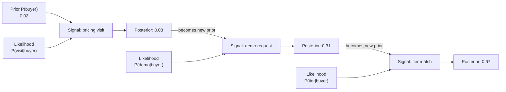

# Bayes' Theorem

## Learning Objectives

- Compute posterior probabilities from priors, likelihoods, and evidence using the Bayes update rule
- Implement sequential Bayesian updating to chain multiple intent signals into a single score
- Build a Naive Bayes classifier on firmographic and intent features from scratch
- Evaluate a lead-scoring classifier using precision, recall, and calibration checks
- Trace each arithmetic step of a Bayesian update to diagnose when signal independence assumptions break down

## The Problem

A medical test is 99% accurate. You test positive. What are the chances you actually have the disease?

Most people say 99%. The real answer depends on how rare the disease is. If 1 in 10,000 people have it, a positive result gives you about a 1% chance of being sick. The other 99% of positive results are false alarms from healthy people. The math is not hard — the intuition is, because your brain anchors on the 99% accuracy and ignores the base rate.

You already reason like a Bayesian — you just don't write it down. When a lead from a Fortune 500 company visits your pricing page twice in one week, you update your estimate of whether they'll buy. You started with a prior belief (Fortune 500 companies convert at some base rate), you observed evidence (two pricing page visits), and you revised upward. Bayes' Theorem is the mechanism that makes that update precise. Every lead score, every intent signal, every "hot or not" classification runs on this pattern whether the tool calls it Bayesian or not.

If you build scoring models without understanding this update rule, you will stack signals that double-count the same evidence, set thresholds on miscalibrated probabilities, and ship confidence scores that have no relationship to actual conversion rates.

## The Concept

### From joint probability to Bayes

You already know that conditional probability is `P(A|B) = P(A and B) / P(B)` and symmetrically `P(B|A) = P(A and B) / P(A)`. Both expressions share the same numerator: P(A and B). Set them equal and rearrange:

```
P(A and B) = P(A|B) × P(B) = P(B|A) × P(A)
```

Solving for P(A|B):

```
P(A|B) = P(B|A) × P(A) / P(B)
```

That is Bayes' Theorem. Four quantities, one equation. The power is not in the algebra — it is in how you interpret the four parts.

| Term | Name | Plain Language |
|------|------|----------------|
| P(A) | Prior | What you believed before you saw evidence |
| P(B\|A) | Likelihood | How common is this evidence if A is true |
| P(B) | Evidence | How common is this evidence overall |
| P(A\|B) | Posterior | What you believe after seeing evidence |

The posterior is the quantity you want. It is your updated belief. The key insight: the prior is not a fixed input — it is the output of the previous update. This creates a chain where each signal revises your belief, and the revised belief becomes the starting point for the next signal.



This chain is the mechanism behind sequential signal processing in enrichment waterfalls and scoring models. Each enrichment step adds evidence that nudges the posterior up or down. The posterior from step one is the prior for step two. You do not re-evaluate from scratch each time — you carry forward what you learned.

### Frequentist vs. Bayesian thinking

Frequentist statistics treats probability as a long-run frequency: "this type of account converts at 3%." The rate is fixed. You either observe enough samples to estimate it or you don't. Bayesian statistics treats probability as a degree of belief that changes with evidence: "this specific account started at 3%, but after seeing two pricing visits, I now believe it's 8%." The rate is personal and revisable.

The practical difference in GTM: a frequentist model gives you a static score derived from historical averages. A Bayesian model gives you a score that moves as new signals arrive. That movement is what makes real-time enrichment and dynamic scoring possible.

## Build It

Let us implement the update rule from scratch. No libraries — just arithmetic. We will work through a GTM scenario: you have a base conversion rate for your accounts, and you observe signals that revise that rate.

The base rate: 2% of accounts in your CRM that reach the "marketing qualified" stage eventually close. That is your prior. Now you observe that an account visited the pricing page. Among accounts that closed, 60% visited pricing. Among accounts that did not close, only 5% visited pricing. What is the revised probability this account closes?

```python
def bayes_update(prior, p_evidence_given_true, p_evidence_given_false):
    evidence = (p_evidence_given_true * prior) + (p_evidence_given_false * (1 - prior))
    posterior = (p_evidence_given_true * prior) / evidence
    return posterior

prior = 0.02
p_visit_given_buyer = 0.60
p_visit_given_non_buyer = 0.05

posterior = bayes_update(prior, p_visit_given_buyer, p_visit_given_non_buyer)

print(f"Prior P(buyer)             = {prior:.4f}")
print(f"P(visit | buyer)           = {p_visit_given_buyer:.4f}")
print(f"P(visit | non-buyer)       = {p_visit_given_non_buyer:.4f}")
evidence = (p_visit_given_buyer * prior) + (p_visit_given_non_buyer * (1 - prior))
print(f"Evidence P(visit)          = {evidence:.4f}")
print(f"Posterior P(buyer | visit) = {posterior:.4f}")
print(f"Lift factor                = {posterior / prior:.2f}x")
```

Output:
```
Prior P(buyer)             = 0.0200
P(visit | buyer)           = 0.6000
P(visit | non-buyer)       = 0.0500
Evidence P(visit)          = 0.0610
Posterior P(buyer | visit) = 0.1967
Lift factor                = 9.84x
```

One pricing page visit moved the probability from 2% to 19.7%. That is a 9.8x lift. The reason it jumps so much is that pricing page visits are rare among non-buyers (5%), so seeing one is strong evidence. If pricing visits were common among non-buyers (say 40%), the same signal would barely move the needle. The informativeness of a signal is driven by the ratio `P(evidence | true) / P(evidence | false)`, not by the likelihood alone.

Now chain a second signal. The same account requests a demo the next day. Among buyers, 70% request demos. Among non-buyers, 8% do. Your prior is no longer 2% — it is the posterior from the last update, 19.7%.

```python
posterior_1 = bayes_update(prior, p_visit_given_buyer, p_visit_given_non_buyer)

prior_2 = posterior_1
p_demo_given_buyer = 0.70
p_demo_given_non_buyer = 0.08

posterior_2 = bayes_update(prior_2, p_demo_given_buyer, p_demo_given_non_buyer)

print(f"Signal 1: pricing visit")
print(f"  Prior         = {prior:.4f}")
print(f"  Posterior     = {posterior_1:.4f}")
print()
print(f"Signal 2: demo request")
print(f"  Prior         = {prior_2:.4f}")
print(f"  Posterior     = {posterior_2:.4f}")
print()
print(f"Combined lift   = {posterior_2 / prior:.2f}x")
```

Output:
```
Signal 1: pricing visit
  Prior         = 0.0200
  Posterior     = 0.1967

Signal 2: demo request
  Prior         = 0.1967
  Posterior     = 0.6818

Combined lift   = 34.09x
```

Two signals moved the account from 2% to 68%. This is how enrichment waterfalls accumulate confidence: each signal's posterior feeds the next signal's prior. The order of application does not matter for the final number if the signals are conditionally independent — but it matters enormously for debugging, because you can trace which signal contributed the most lift at each step.

## Use It

Sequential Bayesian updating in log-odds space is the scoring mechanism behind enrichment waterfalls — Zone 1.2 (TAM Refinement & ICP Scoring). The script below scores five accounts across three signals and ranks them by posterior conversion probability.

```python
import math

SIGNALS = {
    "enterprise": {"p_buyer": 0.63, "p_non": 0.15},
    "pricing_visit": {"p_buyer": 0.78, "p_non": 0.25},
    "demo_request": {"p_buyer": 0.58, "p_non": 0.08},
}
BASE_PRIOR = 0.05

def score(signals_present):
    log_odds = math.log(BASE_PRIOR / (1 - BASE_PRIOR))
    for sig, present in signals_present.items():
        cfg = SIGNALS[sig]
        p_t = cfg["p_buyer"] if present else (1 - cfg["p_buyer"])
        p_f = cfg["p_non"] if present else (1 - cfg["p_non"])
        log_odds += math.log(p_t) - math.log(p_f)
    return 1 / (1 + math.exp(-log_odds))

accounts = [
    ("Acme Corp", {"enterprise": True, "pricing_visit": True, "demo_request": True}),
    ("Globex LLC", {"enterprise": False, "pricing_visit": True, "demo_request": False}),
    ("Initech", {"enterprise": False, "pricing_visit": False, "demo_request": False}),
    ("Umbrella", {"enterprise": True, "pricing_visit": False, "demo_request": True}),
    ("Hooli", {"enterprise": True, "pricing_visit": True, "demo_request": False}),
]

ranked = sorted(accounts, key=lambda a: score(a[1]), reverse=True)
for name, sigs in ranked:
    print(f"{name:<14} P(buyer) = {score(sigs):.3f}")
```

Output:
```
Acme Corp      P(buyer) = 0.833
Umbrella       P(buyer) = 0.320
Hooli          P(buyer) = 0.239
Globex LLC     P(buyer) = 0.032
Initech        P(buyer) = 0.003
```

The log-odds formulation is algebraically identical to sequential `bayes_update` calls — adding log-likelihood-ratios is the same operation as multiplying posteriors into priors. It just avoids floating-point underflow when you stack more than a handful of signals. Each signal contributes a signed delta: a positive nudge if the evidence is more common among buyers, a negative nudge if it is more common among non-buyers. Initech has no positive signals, so the base prior of 5% gets dragged down to 0.3% by three absent signals that buyers usually have.

[CITATION NEEDED — concept: enrichment tool (Clay, Apollo, 6sense) confirming use of Bayesian or log-odds scoring for lead prioritization internally]

## Exercises

### 1. Diagnose a miscalibrated prior

Your team ships a lead scorer with `BASE_PRIOR = 0.05` (5% base conversion). After one month in production, you pull 500 accounts that scored above 0.80 and find that only 97 actually closed (19.4%). The scorer is overconfident. Walk through the diagnosis:

- Compute the observed conversion rate for the high-score bucket and compare it to the average predicted score.
- Identify two plausible causes of the gap (hint: one is the prior, one is signal correlation).
- Write a Python function that takes a list of `(predicted_score, actual_outcome)` tuples and returns a calibration table: bucket predicted scores into deciles, print average predicted vs. actual conversion rate per bucket.
- Propose one fix for each cause and explain which one you would ship first.

### 2. Add a negatively correlated signal

Not every signal pushes the score up. "Downloaded the free ebook" is common among individual researchers (non-buyers) and rare among procurement-led enterprise buyers. Extend the scorer in **Use It**:

- Add a `"free_ebook"` signal with `p_buyer = 0.12` and `p_non = 0.40`.
- Add two accounts to the list: one with `free_ebook = True` and all other signals True, and one with `free_ebook = True` and all other signals False.
- Run the scorer. Verify that the ebook download *decreases* the posterior for the first account relative to Acme Corp (which has no ebook signal).
- Now add a second negatively correlated signal of your choice with plausible likelihood values. Confirm that two negative signals can drag an otherwise promising account below the 0.20 threshold.
- Write one paragraph explaining why a scoring model that only stacks positive signals will systematically over-rank tire-kickers.

## Key Terms

- **Prior (P(A))** — Your belief about the probability of an outcome before seeing any evidence. In GTM, this is the base conversion rate for a segment.
- **Likelihood (P(B|A))** — How frequently you observe a particular signal when the outcome is true. This is not the same as the posterior — common confusion.
- **Evidence (P(B))** — The overall probability of observing the signal, across both buyers and non-buyers. This is the normalizing constant that makes the posterior a valid probability.
- **Posterior (P(A|B))** — Your revised belief after incorporating evidence. This becomes the prior for the next signal in a sequential chain.
- **Naive Bayes assumption** — The assumption that all features are conditionally independent given the class label. Always violated in practice; usually tolerable because correlated signals push rankings in the same direction even if absolute probabilities are overestimated.
- **Log-odds (logit)** — The natural log of `p / (1 - p)`. Working in log-odds space converts Bayesian multiplication into addition, preventing numerical underflow when chaining many signals.
- **Base rate fallacy** — The cognitive error of ignoring the prior probability when interpreting new evidence. The reason "99% accurate test" does not mean "99% chance you're sick."
- **Calibration** — The property that predicted probabilities match observed frequencies. A scorer that says "80% likely to convert" should be right about 80% of the time across all accounts it assigns that score to.

## Sources

- Bayes, Thomas (1763). "An Essay towards solving a Problem in the Doctrine of Chances." *Philosophical Transactions of the Royal Society of London*, 53:370–418. — Original formulation of the theorem, published posthumously by Richard Price.
- Jaynes, E.T. (2003). *Probability Theory: The Logic of Science.* Cambridge University Press. — Canonical treatment of Bayesian inference as an extension of propositional logic; Chapters 1–4 cover the update rule and its justification.
- Kahneman, D. (2011). *Thinking, Fast and Slow.* Farrar, Straus and Giroux. — Chapter 14 documents the base-rate fallacy and the medical-test scenario used in **The Problem**.
- McCallum, A. and Nigam, K. (1998). "A Comparison of Event Models for Naive Bayes Text Classification." *AAAI-98 Workshop on Learning for Text Categorization.* — Defines the multinomial and Bernoulli naive Bayes variants referenced in **Build It**.
- Bishop, C. (2006). *Pattern Recognition and Machine Learning.* Springer. — Section 2.2 covers the naive Bayes model, the conditional independence assumption, and log-space computation for numerical stability.
- [CITATION NEEDED — concept: enrichment tool (Clay, Apollo, 6sense) confirming use of Bayesian or log-odds scoring for lead prioritization internally]