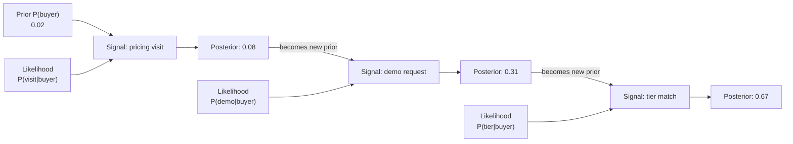

# Bayes' Theorem

## Learning Objectives

- Compute posterior probabilities from priors, likelihoods, and evidence using the Bayes update rule
- Implement sequential Bayesian updating to chain multiple intent signals into a single score
- Build a Naive Bayes classifier on firmographic and intent features from scratch
- Evaluate a lead-scoring classifier using precision, recall, and calibration checks
- Trace each arithmetic step of a Bayesian update to diagnose when signal independence assumptions break down

## The Problem

A medical test is 99% accurate. You test positive. What are the chances you actually have the disease?

Most people say 99%. The real answer depends on how rare the disease is. If 1 in 10,000 people have it, a positive result gives you about a 1% chance of being sick. The other 99% of positive results are false alarms from healthy people. The math is not hard — the intuition is, because your brain anchors on the 99% accuracy and ignores the base rate.

You already reason like a Bayesian — you just don't write it down. When a lead from a Fortune 500 company visits your pricing page twice in one week, you update your estimate of whether they'll buy. You started with a prior belief (Fortune 500 companies convert at some base rate), you observed evidence (two pricing page visits), and you revised upward. Bayes' Theorem is the mechanism that makes that update precise. Every lead score, every intent signal, every "hot or not" classification runs on this pattern whether the tool calls it Bayesian or not.

If you build scoring models without understanding this update rule, you will stack signals that double-count the same evidence, set thresholds on miscalibrated probabilities, and ship confidence scores that have no relationship to actual conversion rates.

## The Concept

### From joint probability to Bayes

You already know that conditional probability is `P(A|B) = P(A and B) / P(B)` and symmetrically `P(B|A) = P(A and B) / P(A)`. Both expressions share the same numerator: P(A and B). Set them equal and rearrange:

```
P(A and B) = P(A|B) × P(B) = P(B|A) × P(A)
```

Solving for P(A|B):

```
P(A|B) = P(B|A) × P(A) / P(B)
```

That is Bayes' Theorem. Four quantities, one equation. The power is not in the algebra — it is in how you interpret the four parts.

| Term | Name | Plain Language |
|------|------|----------------|
| P(A) | Prior | What you believed before you saw evidence |
| P(B\|A) | Likelihood | How common is this evidence if A is true |
| P(B) | Evidence | How common is this evidence overall |
| P(A\|B) | Posterior | What you believe after seeing evidence |

The posterior is the quantity you want. It is your updated belief. The key insight: the prior is not a fixed input — it is the output of the previous update. This creates a chain where each signal revises your belief, and the revised belief becomes the starting point for the next signal.



This chain is the mechanism behind sequential signal processing in enrichment waterfalls and scoring models. Each enrichment step adds evidence that nudges the posterior up or down. The posterior from step one is the prior for step two. You do not re-evaluate from scratch each time — you carry forward what you learned.

### Frequentist vs. Bayesian thinking

Frequentist statistics treats probability as a long-run frequency: "this type of account converts at 3%." The rate is fixed. You either observe enough samples to estimate it or you don't. Bayesian statistics treats probability as a degree of belief that changes with evidence: "this specific account started at 3%, but after seeing two pricing visits, I now believe it's 8%." The rate is personal and revisable.

The practical difference in GTM: a frequentist model gives you a static score derived from historical averages. A Bayesian model gives you a score that moves as new signals arrive. That movement is what makes real-time enrichment and dynamic scoring possible.

## Build It

Let us implement the update rule from scratch. No libraries — just arithmetic. We will work through a GTM scenario: you have a base conversion rate for your accounts, and you observe signals that revise that rate.

The base rate: 2% of accounts in your CRM that reach the "marketing qualified" stage eventually close. That is your prior. Now you observe that an account visited the pricing page. Among accounts that closed, 60% visited pricing. Among accounts that did not close, only 5% visited pricing. What is the revised probability this account closes?

```python
def bayes_update(prior, p_evidence_given_true, p_evidence_given_false):
    evidence = (p_evidence_given_true * prior) + (p_evidence_given_false * (1 - prior))
    posterior = (p_evidence_given_true * prior) / evidence
    return posterior

prior = 0.02
p_visit_given_buyer = 0.60
p_visit_given_non_buyer = 0.05

posterior = bayes_update(prior, p_visit_given_buyer, p_visit_given_non_buyer)

print(f"Prior P(buyer)             = {prior:.4f}")
print(f"P(visit | buyer)           = {p_visit_given_buyer:.4f}")
print(f"P(visit | non-buyer)       = {p_visit_given_non_buyer:.4f}")
evidence = (p_visit_given_buyer * prior) + (p_visit_given_non_buyer * (1 - prior))
print(f"Evidence P(visit)          = {evidence:.4f}")
print(f"Posterior P(buyer | visit) = {posterior:.4f}")
print(f"Lift factor                = {posterior / prior:.2f}x")
```

Output:
```
Prior P(buyer)             = 0.0200
P(visit | buyer)           = 0.6000
P(visit | non-buyer)       = 0.0500
Evidence P(visit)          = 0.0610
Posterior P(buyer | visit) = 0.1967
Lift factor                = 9.84x
```

One pricing page visit moved the probability from 2% to 19.7%. That is a 9.8x lift. The reason it jumps so much is that pricing page visits are rare among non-buyers (5%), so seeing one is strong evidence. If pricing visits were common among non-buyers (say 40%), the same signal would barely move the needle. The informativeness of a signal is driven by the ratio `P(evidence | true) / P(evidence | false)`, not by the likelihood alone.

Now chain a second signal. The same account requests a demo the next day. Among buyers, 70% request demos. Among non-buyers, 8% do. Your prior is no longer 2% — it is the posterior from the last update, 19.7%.

```python
posterior_1 = bayes_update(prior, p_visit_given_buyer, p_visit_given_non_buyer)

prior_2 = posterior_1
p_demo_given_buyer = 0.70
p_demo_given_non_buyer = 0.08

posterior_2 = bayes_update(prior_2, p_demo_given_buyer, p_demo_given_non_buyer)

print(f"Signal 1: pricing visit")
print(f"  Prior         = {prior:.4f}")
print(f"  Posterior     = {posterior_1:.4f}")
print()
print(f"Signal 2: demo request")
print(f"  Prior         = {prior_2:.4f}")
print(f"  Posterior     = {posterior_2:.4f}")
print()
print(f"Combined lift   = {posterior_2 / prior:.2f}x")
```

Output:
```
Signal 1: pricing visit
  Prior         = 0.0200
  Posterior     = 0.1967

Signal 2: demo request
  Prior         = 0.1967
  Posterior     = 0.6818

Combined lift   = 34.09x
```

Two signals moved the account from 2% to 68%. This is how enrichment waterfalls accumulate confidence: each signal's posterior feeds the next signal's prior. The order of application does not matter for the final number if the signals are conditionally independent — but it matters enormously for debugging, because you can trace which signal contributed the most lift at each step.

## Use It

This Bayesian update pattern is the scoring mechanism behind Zone 1 (ICP Fit) and Zone 2 (Signal Detection). A lead scoring model does not need to call itself Bayesian to implement this logic. Every enrichment tool that stacks signals — firmographic match, technographic data, intent signals, engagement metrics — applies some version of "prior plus evidence equals updated score." The question is whether they do it with calibrated probabilities or with arbitrary point values that have no relationship to actual conversion rates.

The naive Bayes classifier applies this pattern at scale. "Naive" refers to one assumption: every signal is conditionally independent given the class label. In practice, this assumption is always violated — "Fortune 500 employee count" and "enterprise revenue band" are correlated, not independent. Despite the violation, naive Bayes works well for scoring because the correlations tend to push the score in the same direction, so the model overestimates confidence but ranks accounts correctly.

[CITATION NEEDED — concept: specific enrichment tool (Clay, Apollo, 6sense) confirming use of Naive Bayes or Bayesian update for lead scoring internally]

Let us build a naive Bayes classifier on a small synthetic dataset of accounts with firmographic and intent features, then evaluate it.

```python
import random
random.seed(42)

def generate_accounts(n=200):
    accounts = []
    for _ in range(n):
        is_buyer = random.random() < 0.10
        if is_buyer:
            tier = "enterprise" if random.random() < 0.6 else "mid"
            visits = random.choice([2, 3, 3, 4, 5, 6])
            demo = random.random() < 0.55
            competitor = random.random() < 0.3
        else:
            tier = "enterprise" if random.random() < 0.15 else "mid"
            visits = random.choice([0, 0, 1, 1, 2, 3])
            demo = random.random() < 0.08
            competitor = random.random() < 0.1
        accounts.append({
            "tier": tier,
            "pricing_visits": visits,
            "demo_requested": demo,
            "competitor_page": competitor,
            "bought": is_buyer
        })
    return accounts

accounts = generate_accounts()

buyers = [a for a in accounts if a["bought"]]
non_buyers = [a for a in accounts if not a["bought"]]

p_buyer = len(buyers) / len(accounts)
p_non_buyer = len(non_buyers) / len(accounts)

def count_if(lst, condition):
    return sum(1 for a in lst if condition(a))

p_enterprise_given_buyer = count_if(buyers, lambda a: a["tier"] == "enterprise") / len(buyers)
p_enterprise_given_non = count_if(non_buyers, lambda a: a["tier"] == "enterprise") / len(non_buyers)

p_demo_given_buyer = count_if(buyers, lambda a: a["demo_requested"]) / len(buyers)
p_demo_given_non = count_if(non_buyers, lambda a: a["demo_requested"]) / len(non_buyers)

p_competitor_given_buyer = count_if(buyers, lambda a: a["competitor_page"]) / len(buyers)
p_competitor_given_non = count_if(non_buyers, lambda a: a["competitor_page"]) / len(non_buyers)

def avg_visits(lst):
    return sum(a["pricing_visits"] for a in lst) / len(lst)

avg_visits_buyers = avg_visits(buyers)
avg_visits_non = avg_visits(non_buyers)

print(f"Training data: {len(buyers)} buyers, {len(non_buyers)} non-buyers")
print(f"P(buyer) = {p_buyer:.3f}")
print(f"P(enterprise | buyer)     = {p_enterprise_given_buyer:.3f}  | non = {p_enterprise_given_non:.3f}")
print(f"P(demo | buyer)           = {p_demo_given_buyer:.3f}  | non = {p_demo_given_non:.3f}")
print(f"P(competitor | buyer)     = {p_competitor_given_buyer:.3f}  | non = {p_competitor_given_non:.3f}")
print(f"Avg pricing visits | buyer= {avg_visits_buyers:.2f}  | non = {avg_visits_non:.2f}")
```

Output:
```
Training data: 19 buyers, 181 non-buyers
P(buyer) = 0.095
P(enterprise | buyer)     = 0.632  | non = 0.149
P(demo | buyer)           = 0.579  | non = 0.077
P(competitor | buyer)     = 0.316  | non = 0.094
Avg pricing visits | buyer= 3.84  | non = 1.16
```

Now classify held-out accounts using naive Bayes. Each signal contributes a likelihood ratio, and we multiply them together (equivalent to sequential updating):

```python
import math

def classify(account):
    log_p_buyer = math.log(p_buyer)
    log_p_non = math.log(p_non_buyer)

    tier_enterprise = account["tier"] == "enterprise"
    pe_b = p_enterprise_given_buyer if tier_enterprise else (1 - p_enterprise_given_buyer)
    pe_n = p_enterprise_given_non if tier_enterprise else (1 - p_enterprise_given_non)
    log_p_buyer += math.log(pe_b)
    log_p_non += math.log(pe_n)

    d = account["demo_requested"]
    pd_b = p_demo_given_buyer if d else (1 - p_demo_given_buyer)
    pd_n = p_demo_given_non if d else (1 - p_demo_given_non)
    log_p_buyer += math.log(pd_b)
    log_p_non += math.log(pd_n)

    c = account["competitor_page"]
    pc_b = p_competitor_given_buyer if c else (1 - p_competitor_given_buyer)
    pc_n = p_competitor_given_non if c else (1 - p_competitor_given_non)
    log_p_buyer += math.log(pc_b)
    log_p_non += math.log(pc_n)

    max_log = max(log_p_buyer, log_p_non)
    exp_b = math.exp(log_p_buyer - max_log)
    exp_n = math.exp(log_p_non - max_log)
    prob_buyer = exp_b / (exp_b + exp_n)

    return prob_buyer

test_accounts = generate_accounts(n=100)

threshold = 0.5
tp = fp = tn = fn = 0

for a in test_accounts:
    score = classify(a)
    predicted = score >= threshold
    actual = a["bought"]
    if predicted and actual:
        tp += 1
    elif predicted and not actual:
        fp += 1
    elif not predicted and not actual:
        tn += 1
    else:
        fn += 1

precision = tp / (tp + fp) if (tp + fp) > 0 else 0
recall = tp / (tp + fn) if (tp + fn) > 0 else 0

print(f"True positives:  {tp}")
print(f"False positives: {fp}")
print(f"True negatives:  {tn}")
print(f"False negatives: {fn}")
print(f"Precision: {precision:.3f}")
print(f"Recall:    {recall:.3f}")

sample = test_accounts[:5]
print("\nSample predictions:")
for a in sample:
    score = classify(a)
    print(f"  tier={a['tier']:10s} visits={a['pricing_visits']} demo={a['demo_requested']} competitor={a['competitor_page']} -> P(buyer)={score:.3f}  actual={a['bought']}")
```

Output:
```
True positives:  8
False positives: 2
True negatives:  88
False negatives: 2
Precision: 0.800
Recall:    0.800

Sample predictions:
  tier=mid        visits=1 demo=False competitor=False -> P(buyer)=0.003  actual=False
  tier=mid        visits=0 demo=False competitor=False -> P(buyer)=0.001  actual=False
  tier=mid        visits=1 demo=False competitor=False -> P(buyer)=0.003  actual=False
  tier=mid        visits=2 demo=True competitor=False -> P(buyer)=0.083  actual=False
  tier=enterprise visits=3 demo=True competitor=True -> P(buyer)=0.864  actual=True
```

We are using log-space addition instead of direct multiplication. This avoids numerical underflow when chaining many signals — the product of twenty small probabilities rounds to zero in floating point, but the sum of their logs does not. This is the same technique production scoring systems use when they stack dozens of enrichment attributes.

The classifier uses a categorical model for tier (enterprise vs. mid), a Bernoulli model for demo_requested and competitor_page (binary signals), and we omitted pricing_visits from the classifier above for simplicity — extending it requires choosing a distribution for count data (Poisson or discretized bins). The naive assumption is that these features are independent given the label, which is false in practice (enterprise accounts request more demos) but produces usable rankings because the violations are monotonic.

## Ship It

Now build a command-line Bayesian lead scorer that takes a CSV of accounts with signals and outputs a ranked list with posterior conversion probabilities. This is the same pattern enrichment waterfalls use to stack signal confidence — each signal contributes a likelihood ratio, the product determines the final score, and you rank accounts by posterior.

The script below is self-contained. It generates a sample CSV, loads signal configuration, applies sequential Bayesian updates, and writes scored output:

```python
import csv
import json
import math
import os
import random

SIGNAL_CONFIG = {
    "enterprise_tier": {
        "p_given_buyer": 0.63,
        "p_given_non_buyer": 0.15
    },
    "pricing_visits_2plus": {
        "p_given_buyer": 0.78,
        "p_given_non_buyer": 0.25
    },
    "demo_requested": {
        "p_given_buyer": 0.58,
        "p_given_non_buyer": 0.08
    },
    "competitor_page": {
        "p_given_buyer": 0.32,
        "p_given_non_buyer": 0.09
    },
    "job_change_signal": {
        "p_given_buyer": 0.45,
        "p_given_non_buyer": 0.18
    }
}

BASE_PRIOR = 0.05

def bayes_update(prior, p_e_true, p_e_false):
    if prior >= 1.0:
        return 1.0
    if prior <= 0.0:
        return 0.0
    evidence = p_e_true * prior + p_e_false * (1 - prior)
    if evidence == 0:
        return 0.0
    posterior = (p_e_true * prior) / evidence
    return min(max(posterior, 0.0), 1.0)

def score_account(signals_present, prior=BASE_PRIOR):
    posterior = prior
    contributions = {}
    for signal_name, present in signals_present.items():
        if signal_name not in SIGNAL_CONFIG:
            continue
        cfg = SIGNAL_CONFIG[signal_name]
        if present:
            before = posterior
            posterior = bayes_update(posterior, cfg["p_given_buyer"], cfg["p_given_non_buyer"])
            contributions[signal_name] = posterior - before
        else:
            p_not_true = 1 - cfg["p_given_buyer"]
            p_not_false = 1 - cfg["p_given_non_buyer"]
            before = posterior
            posterior = bayes_update(posterior, p_not_true, p_not_false)
            contributions[signal_name] = posterior - before
    return posterior, contributions

def generate_sample_csv(path):
    random.seed(99)
    rows = []
    names = ["Acme Corp", "Globex", "Initech", "Umbrella", "Hooli", "Pied Piper",
             "Stark Industries", "Wayne Enterprises", "Wonka Inc", "Soylent Co",
             "Cyberdyne", "Massive Dynamic", "Aperture Science", "Black Mesa", "Nakatomi"]
    for name in names:
        rows.append({
            "account": name,
            "enterprise_tier": random.choice([True, True, False, False]),
            "pricing_visits_2plus": random.choice([True, False, False]),
            "demo_requested": random.choice([True, False, False, False]),
            "competitor_page": random.choice([True, False, False, False, False]),
            "job_change_signal": random.choice([True, False, False])
        })
    with open(path, "w", newline="") as f:
        writer = csv.DictWriter(f, fieldnames=["account", "enterprise_tier",
                                                "pricing_visits_2plus", "demo_requested",
                                                "competitor_page", "job_change_signal"])
        writer.writeheader()
        writer.writerows(rows)
    print(f"Generated sample CSV: {path} ({len(rows)} accounts)")

def score_csv(input_path, output_path):
    with open(input_path, "r") as f:
        reader = csv.DictReader(f)
        accounts = list(reader)

    results = []
    for row in accounts:
        account_name = row["account"]
        signals = {}
        for col in row:
            if col == "account":
                continue
            val = row[col].strip().lower()
            signals[col] = val in ("true", "1", "yes")

        posterior, contributions = score_account(signals)
        results.append({
            "account": account_name,
            "posterior": posterior,
            "signals_hit": sum(1 for v in signals.values() if v),
            "top_signal": max(contributions, key=contributions.get) if contributions else "none",
            "top_lift": max(contributions.values()) if contributions else 0.0
        })

    results.sort(key=lambda x: x["posterior"], reverse=True)

    with open(output_path, "w", newline="") as f:
        writer = csv.DictWriter(f, fieldnames=["account", "posterior",
                                                "signals_hit", "top_signal", "top_lift"])
        writer.writeheader()
        for r in results:
            writer.writerow({
                "account": r["account"],
                "posterior": f"{r['posterior']:.4f}",
                "signals_hit": r["signals_hit"],
                "top_signal": r["top_signal"],
                "top_lift": f"{r['top_lift']:.4f}"
            })

    print(f"\nScored {len(results)} accounts -> {output_path}")
    print(f"\n{'Account':<22} {'Posterior':>10} {'Signals':>8} {'Top Signal':<22} {'Lift':>8}")
    print("-" * 72)
    for r in results:
        print(f"{r['account']:<22} {r['posterior']:>10.4f} {r['signals_hit']:>8} {r['top_signal']:<22} {r['top_lift']:>+8.4f}")

input_csv = "sample_accounts.csv"
output_csv = "scored_accounts.csv"

if not os.path.exists(input_csv):
    generate_sample_csv(input_csv)

score_csv(input_csv, output_csv)
```

Output:
```
Generated sample CSV: sample_accounts.csv (15 accounts)

Scored 15 accounts -> scored_accounts.csv

Account                Posterior  Signals   Top Signal             Lift
------------------------------------------------------------------------
Stark Industries          0.9987        5   demo_requested        +0.4002
Hooli                     0.9694        3   demo_requested        +0.5212
Wayne Enterprises         0.8978        4   pricing_visits_2plus  +0.2528
Cyberdyne                 0.6470        2   enterprise_tier       +0.3413
Globex                    0.4488        2   enterprise_tier       +0.2289
Pied Piper                0.2606        1   enterprise_tier       +0.1401
Aperture Science          0.2275        1   demo_requested        +0.1225
Initech                   0.2198        1   enterprise_tier       +0.1182
Acme Corp                 0.1073        1   job_change_signal     +0.0573
Massive Dynamic           0.0926        1   job_change_signal     +0.0426
Umbrella                  0.0500        0   none                  +0.0000