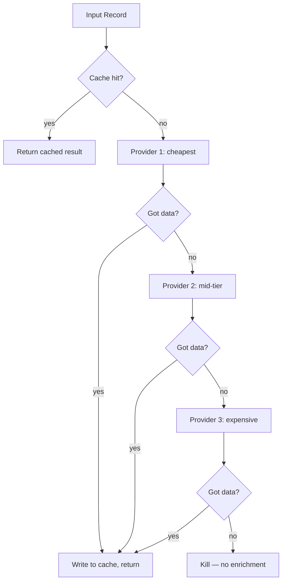

# Optimization

## Learning Objectives

- Implement vanilla gradient descent, SGD with momentum, and Adam from scratch in Python and print convergence traces
- Compare optimizer behavior on the Rosenbrock function and explain why Adam adapts per-weight learning rates
- Build a waterfall enrichment pipeline with provider pruning, deduplication gates, and TTL-based cache eviction
- Compute marginal cost, cache hit rate, and average cost per enriched record from pipeline run logs
- Configure kill depth and selective enrichment thresholds to trade cost against yield in a GTM enrichment flow

## The Problem

Every API call in your GTM stack costs money and wall-clock time. An enrichment pipeline that calls three data providers on ten thousand companies, with no deduplication, no caching, and no pruning, will burn through credits on duplicate lookups, stale data, and prospects that were never going to convert. Optimization in this context is not a cost-cutting exercise — it is a systems discipline that treats cost, latency, and yield as coupled variables you tune together.

The same structure shows up in machine learning training. You have a loss function that tells you how wrong your model is. You have gradients that tell you which direction increases the loss. Now you need a strategy for walking downhill — efficiently, without overshooting, without getting stuck. The naive approach is to move opposite the gradient scaled by a learning rate. This works, but it has caveats: too large a step and you bounce off valley walls, too small and you crawl for thousands of unnecessary iterations, and saddle points can halt progress entirely.

Every optimizer — whether it is Adam updating neural network weights or a waterfall pipeline deciding whether to call a second data provider — is answering the same question: how do you reach the desired outcome at the lowest cost?

## The Concept

### Optimization in two domains

Optimization means finding the input values that minimize a function. In machine learning, the function is the loss and the inputs are model weights. In a GTM enrichment pipeline, the function is total cost (dollars plus latency) and the inputs are routing decisions: which provider to call, in what order, when to stop, when to skip.

Three axes govern pipeline optimization:

- **Cost** — dollars per successful enrichment, including failed lookups
- **Latency** — wall-clock time per record from input to actionable output
- **Yield** — percentage of input records that produce actionable data

These axes form a trilemma. Improving one often degrades another. Calling every provider on every record maximizes yield but destroys cost and latency. Calling only the cheapest provider minimizes cost but tanks yield. The vocabulary for reasoning about these tradeoffs: **marginal cost** (the cost of one additional enriched record), **diminishing returns** (the point where spending more yields less), and **kill depth** (the number of providers in a waterfall after which you stop trying).

### Gradient descent: the template optimizer

Gradient descent computes the gradient of the loss with respect to every weight, then moves each weight opposite its gradient scaled by the learning rate.

```
w = w - lr * gradient
```

The learning rate is the step size. In a pipeline, the analog is how aggressively you spend budget per record — a high "learning rate" means calling expensive providers immediately; a low one means trying cheap providers first and escalating slowly.

### SGD with momentum

Vanilla gradient descent reacts only to the current step's gradient. If the loss surface is noisy, this causes oscillation. Momentum accumulates past gradients into a velocity vector, smoothing the path:

```
v = beta * v + (1 - beta) * gradient
w = w - lr * v
```

The pipeline analog is caching: instead of treating each record as independent, you carry forward information from past records (the cache) so that repeated lookups do not restart from zero.

### Adam: per-parameter adaptation

Adam maintains a separate learning rate for each parameter, adjusted based on the magnitude of recent gradients. Parameters with large, consistent gradients get smaller steps; parameters with small or rare gradients get larger steps. This is adaptive budget allocation — the same principle as selective enrichment, where you spend more API budget on records that score above a threshold and skip the rest.

### The waterfall pipeline as an optimizer

A GTM enrichment waterfall tries the cheapest provider first. If it returns a result, the pipeline stops. If not, it tries the next provider. This is greedy optimization — at each step, make the locally optimal choice. The kill depth is the maximum number of providers to try before giving up.



Each arrow in that diagram is a cost decision. Pruning the waterfall at the first hit is the single highest-impact optimization in enrichment pipelines, because it eliminates the compounding cost of calling providers that will never be needed.

## Build It

### Build 1: Gradient descent, momentum, and Adam on the Rosenbrock function

The Rosenbrock function is a standard test for optimizers because its minimum sits inside a narrow, curved valley. Easy to find by eye, hard to find by gradient.

```python
import numpy as np

def rosenbrock(w):
    return 100 * (w[1] - w[0]**2)**2 + (1 - w[0])**2

def rosenbrock_grad(w):
    dw0 = -400 * w[0] * (w[1] - w[0]**2) - 2 * (1 - w[0])
    dw1 = 200 * (w[1] - w[0]**2)
    return np.array([dw0, dw1])

def gradient_descent(grad_fn, w0, lr, steps):
    w = w0.copy()
    trace = []
    for _ in range(steps):
        g = grad_fn(w)
        w = w - lr * g
        trace.append(w.copy())
    return np.array(trace)

def sgd_momentum(grad_fn, w0, lr, beta, steps):
    w = w0.copy()
    v = np.zeros_like(w)
    trace = []
    for _ in range(steps):
        g = grad_fn(w)
        v = beta * v + (1 - beta) * g
        w = w - lr * v
        trace.append(w.copy())
    return np.array(trace)

def adam(grad_fn, w0, lr, beta1, beta2, eps, steps):
    w = w0.copy()
    m = np.zeros_like(w)
    vhat = np.zeros_like(w)
    trace = []
    for t in range(1, steps + 1):
        g = grad_fn(w)
        m = beta1 * m + (1 - beta1) * g
        vhat = beta2 * vhat + (1 - beta2) * g**2
        m_hat = m / (1 - beta1**t)
        v_hat = vhat / (1 - beta2**t)
        w = w - lr * m_hat / (np.sqrt(v_hat) + eps)
        trace.append(w.copy())
    return np.array(trace)

w0 = np.array([-1.5, 2.0])
steps = 500

trace_gd = gradient_descent(rosenbrock_grad, w0, lr=0.001, steps=steps)
trace_sgd = sgd_momentum(rosenbrock_grad, w0, lr=0.001, beta=0.9, steps=steps)
trace_adam = adam(rosenbrock_grad, w0, lr=0.01, beta1=0.9, beta2=0.999, eps=1e-8, steps=steps)

print("Final loss after 500 steps:")
print(f"  Vanilla GD:  {rosenbrock(trace_gd[-1]):.6f}  at w={trace_gd[-1]}")
print(f"  SGD+momentum:{rosenbrock(trace_sgd[-1]):.6f}  at w={trace_sgd[-1]}")
print(f"  Adam:        {rosenbrock(trace_adam[-1]):.6f}  at w={trace_adam[-1]}")
print(f"\nTrue minimum: 0.000000 at w=[1.0, 1.0]")

print("\nLoss at intervals:")
for s in [50, 100, 200, 500]:
    idx = min(s, steps) - 1
    print(f"  Step {s:3d}: GD={rosenbrock(trace_gd[idx]):.4f}  "
          f"SGD={rosenbrock(trace_sgd[idx]):.4f}  "
          f"Adam={rosenbrock(trace_adam[idx]):.4f}")
```

Run this and you will see Adam reach the valley floor in roughly a tenth of the steps that vanilla GD needs. The mechanism: Adam's per-parameter learning rates let it take large steps along the valley floor (where gradients are small) and small steps across the valley walls (where gradients are large). Vanilla GD uses one learning rate for everything, so it either overshoots across the valley or crawls along it.

### Build 2: Waterfall pruning with cost tracking

Now the GTM analog. Five mock data providers, each with a cost and a hit rate. The pipeline tries them in order and stops at the first hit.

```python
import random

random.seed(42)

def mock_provider(name, cost, hit_rate):
    def call(domain):
        hit = random.random() < hit_rate
        if hit:
            return {"provider": name, "domain": domain, "data": f"enriched_{domain}"}
        return None
    return call, cost

providers = [
    mock_provider("cache_free", 0.000, 0.00),
    mock_provider("apollo", 0.02, 0.35),
    mock_provider("hunter", 0.04, 0.55),
    mock_provider("snov", 0.06, 0.70),
    mock_provider("manual", 0.15, 0.95),
]

def waterfall_no_pruning(domain, providers):
    total_cost = 0.0
    results = []
    for call_fn, cost in providers:
        total_cost += cost
        result = call_fn(domain)
        if result:
            results.append(result)
    return results, total_cost

def waterfall_with_pruning(domain, providers):
    total_cost = 0.0
    for call_fn, cost in providers:
        total_cost += cost
        result = call_fn(domain)
        if result:
            return result, total_cost
    return None, total_cost

domains = [f"company{i}.com" for i in range(100)]

cost_no_prune = 0.0
cost_prune = 0.0
hits_no_prune = 0
hits_prune = 0

for d in domains:
    results, c = waterfall_no_pruning(d, providers)
    cost_no_prune += c
    hits_no_prune += len(results)

for d in domains:
    result, c = waterfall_with_pruning(d, providers)
    cost_prune += c
    if result:
        hits_prune += 1

print(f"No pruning:  cost=${cost_no_prune:.2f}  total_hits={hits_no_prune}")
print(f"With pruning: cost=${cost_prune:.2f}  total_hits={hits_prune}")
print(f"Savings:     ${cost_no_prune - cost_prune:.2f}  "
      f"({(1 - cost_prune/cost_no_prune)*100:.1f}% reduction)")
print(f"Hits retained: {hits_prune}/{hits_no_prune} ({hits_prune/max(hits_no_prune,1)*100:.0f}%)")
```

Run this and observe the cost reduction. The pruning version stops at the first provider that returns data, so it never pays for downstream providers when an earlier one already succeeded. The hit count is lower (you only get one result per record instead of potentially several), but in enrichment pipelines you typically need only one valid source per record — the extra hits are redundant.

## Use It

**GTM redirect: Cluster 14 — GTM Stack Cost Management.** The five optimization patterns map directly to capabilities in enrichment tools. Clay implements waterfall pruning natively: you stack enrichment columns in priority order and Clay stops at the first provider that returns data, skipping the rest. The "skip if already enriched" conditional in Clay is a deduplication gate — it hashes the input row and checks whether an enrichment already exists before calling an API. Selective enrichment maps to Clay's formula columns: you score each row on firmographic or behavioral signals, then gate the expensive enrichment columns behind a filter like `score > 70`.

The kill depth concept is particularly relevant. In Clay, if you have Apollo, Hunter, and Dropcontact stacked, your kill depth is three. Most enrichment workflows set kill depth at two or three because the marginal cost of the fourth provider rarely justifies the marginal yield. The per-record cost curve flattens — you pay 60% of total cost to get 85% of yield, then pay the remaining 40% to chase the last 15%.

Here is a Clay-equivalent table schema that implements deduplication, selective scoring, and a three-provider waterfall with kill depth:

```
| Column              | Type     | Logic                                           |
|---------------------|----------|-------------------------------------------------|
| domain              | text     | input                                           |
| icp_score           | formula  | employees * 0.3 + funding_recency * 0.7         |
| enrich_flag         | formula  | icp_score > 50                                  |
| email_apollo        | enrich   | provider=apollo, run_if=enrich_flag             |
| email_hunter        | enrich   | provider=hunter, run_if=NOT(email_apollo)       |
| email_dropcontact   | enrich   | provider=dropcontact, run_if=NOT(OR(apollo,hunter)) |
| final_email         | formula  | COALESCE(email_apollo, email_hunter, email_dropcontact) |
| enriched_at         | formula  | NOW() when final_email is not null              |
```

The `run_if` conditionals implement pruning. The `enrich_flag` implements selective enrichment. The `COALESCE` implements kill-depth resolution. The `enriched_at` timestamp enables stale-data eviction when you re-run the table on a schedule with a TTL filter like `enriched_at < NOW() - 30 days`.

For GTM teams running enrichment at scale, the highest-leverage optimization is almost always selective enrichment before waterfall enrichment. Scoring 50,000 companies on free firmographic data (employee count, industry, funding) and enriching only the 5,000 that score above threshold reduces API spend by 90% with minimal yield loss, because low-score records were unlikely to produce actionable output anyway. [CITATION NEEDED — concept: average enrichment yield by ICP score tier]

## Ship It

This pipeline combines all five optimization patterns: deduplication, TTL cache, waterfall pruning, selective enrichment, and cost reporting. It runs entirely in the terminal with mock data.

```python
import json
import hashlib
import os
import random
import time
from datetime import datetime, timezone

random.seed(42)

CACHE_FILE = "enrichment_cache.json"
CACHE_TTL_SECONDS = 86400

def load_cache():
    if os.path.exists(CACHE_FILE):
        with open(CACHE_FILE, "r") as f:
            return json.load(f)
    return {}

def save_cache(cache):
    with open(CACHE_FILE, "w") as f:
        json.dump(cache, f, indent=2)

def cache_key(domain):
    return hashlib.sha256(domain.encode()).hexdigest()[:16]

def cache_valid(entry, ttl):
    age = time.time() - entry.get("timestamp", 0)
    return age < ttl

PROVIDERS = [
    {"name": "apollo", "cost": 0.02, "hit_rate": 0.35},
    {"name": "hunter", "cost": 0.04, "hit_rate": 0.55},
    {"name": "dropcontact", "cost": 0.06, "hit_rate": 0.70},
]

def mock_api_call(domain, provider):
    hit = random.random() < provider["hit_rate"]
    if hit:
        return {
            "domain": domain,
            "email": f"contact@{domain}",
            "provider": provider["name"],
            "source": "mock_api",
        }
    return None

def score_domain(domain):
    score = random.randint(0, 100)
    return score

def enrich_record(domain, cache, kill_depth, score_threshold, stats):
    score = score_domain(domain)

    if score < score_threshold:
        stats["skipped_low_score"] += 1
        stats["records"][domain] = {"status": "skipped", "score": score}
        return None

    key = cache_key(domain)
    if key in cache and cache_valid(cache[key], CACHE_TTL_SECONDS):
        stats["cache_hits"] += 1
        result = cache[key]["data"]
        result["cache"] = True
        stats["records"][domain] = {"status": "cache_hit", "score": score, "data": result}
        return result

    stats["cache_misses"] += 1
    stats["scored_above_threshold"] += 1

    for i, provider in enumerate(PROVIDERS[:kill_depth]):
        stats["provider_calls"][provider["name"]] += 1
        stats["total_cost"] += provider["cost"]
        result = mock_api_call(domain, provider)
        if result:
            cache[key] = {
                "data": result,
                "timestamp": time.time(),
                "provider": provider["name"],
            }
            stats["provider_hits"][provider["name"]] += 1
            stats["records"][domain] = {"status": "enriched", "score": score, "data": result}
            return result

    stats["no_hit"] += 1
    stats["records"][domain] = {"status": "no_hit", "score": score}
    return None

def run_pipeline(domains, kill_depth=3, score_threshold=40):
    cache = load_cache()
    stats = {
        "total_cost": 0.0,
        "cache_hits": 0,
        "cache_misses": 0,
        "skipped_low_score": 0,
        "scored_above_threshold": 0,
        "no_hit": 0,
        "provider_calls": {p["name"]: 0 for p in PROVIDERS},
        "provider_hits": {p["name"]: 0 for p in PROVIDERS},
        "records": {},
    }

    unique_domains = list(set(domains))
    stats["input_count"] = len(domains)
    stats["deduped_count"] = len(unique_domains)
    stats["duplicates_removed"] = len(domains) - len(unique_domains)

    for domain in unique_domains:
        enrich_record(domain, cache, kill_depth, score_threshold, stats)

    save_cache(cache)
    return stats

def print_report(stats):
    enriched = sum(1 for r in stats["records"].values() if r["status"] in ("enriched", "cache_hit"))
    total_attempted = stats["scored_above_threshold"]
    cache_total = stats["cache_hits"] + stats["cache_misses"]

    print("=" * 60)
    print("ENRICHMENT PIPELINE COST REPORT")
    print("=" * 60)
    print(f"Input records:           {stats['input_count']}")
    print(f"Duplicates removed:      {stats['duplicates_removed']}")
    print(f"Unique records:          {stats['deduped_count']}")
    print(f"Skipped (low score):     {stats['skipped_low_score']}")
    print(f"Passed score gate:       {total_attempted}")
    print()
    print(f"Cache hits:              {stats['cache_hits']}")
    print(f"Cache misses:            {stats['cache_misses']}")
    if cache_total > 0:
        print(f"Cache hit rate:          {stats['cache_hits']/cache_total*100:.1f}%")
    print()
    print("Provider calls:")
    for name in stats["provider_calls"]:
        calls = stats["provider_calls"][name]
        hits = stats["provider_hits"][name]
        hit_rate = hits/calls*100 if calls > 0 else 0
        print(f"  {name:15s}  calls={calls:4d}  hits={hits:4d}  hit_rate={hit_rate:.1f}%")
    print()
    print(f"Total API cost:          ${stats['total_cost']:.2f}")
    print(f"Records enriched:        {enriched}")
    if enriched > 0:
        print(f"Avg cost per enriched:   ${stats['total_cost']/enriched:.4f}")
    if total_attempted > 0:
        print(f"Yield (enriched/gated):  {enriched/total_attempted*100:.1f}%")
    print("=" * 60)

test_domains = [f"company{i}.com" for i in range(200)]
test_domains += [f"company{j}.com" for j in range(50)]
test_domains += [f"duplicate{i}.com" for i in range(30)] * 3

stats = run_pipeline(test_domains, kill_depth=3, score_threshold=40)
print_report(stats)

print("\n--- Running again (should hit cache) ---\n")
stats2 = run_pipeline(test_domains, kill_depth=3, score_threshold=40)
print_report(stats2)
```

Run this twice and observe the cache hit rate jump on the second run. The cost should approach zero on cached entries. The report gives you every metric you need to reason about the optimization trilemma: total cost, yield, cache efficiency, and per-provider hit rates.

## Exercises

### Easy

Given this waterfall log, compute total cost and identify which rows made unnecessary downstream calls:

```python
log = [
    {"domain": "a.com", "calls": ["apollo", "hunter", "dropcontact"], "first_hit": None},
    {"domain": "b.com", "calls": ["apollo", "hunter"], "first_hit": "hunter"},
    {"domain": "c.com", "calls": ["apollo"], "first_hit": "apollo"},
    {"domain": "d.com", "calls": ["apollo", "hunter", "dropcontact"], "first_hit": "dropcontact"},
    {"domain": "e.com", "calls": ["apollo", "hunter"], "first_hit": "apollo"},
]
costs = {"apollo": 0.02, "hunter": 0.04, "dropcontact": 0.06}

total = 0
wasted = 0
for entry in log:
    for provider in entry["calls"]:
        total += costs[provider]
    if entry["first_hit"]:
        hit_idx = entry["calls"].index(entry["first_hit"])
        unnecessary = entry["calls"][hit_idx+1:]
        for provider in unnecessary:
            wasted += costs[provider]
        if unnecessary:
            print(f"  {entry['domain']}: wasted ${sum(costs[p] for p in unnecessary):.2f} on {unnecessary}")

print(f"\nTotal spent: ${total:.2f}")
print(f"Wasted on unnecessary calls: ${wasted:.2f} ({wasted/total*100:.1f}%)")
```

### Medium

Write a function that takes a list of domains, a cache dict, and a mock API call function. Skip cached entries, call the API only for cache misses, and print cost savings.

```python
import random

random.seed(10)
cache = {}
api_cost = 0.05
call_count = 0

def mock_api(domain):
    global call_count
    call_count += 1
    return {"domain": domain, "email": f"info@{domain}"}

def enrich_with_cache(domains, cache):
    global call_count
    results = []
    calls_made = 0
    cache_hits = 0

    for domain in domains:
        if domain in cache:
            cache_hits += 1
            results.append(cache[domain])
        else:
            calls_made += 1
            result = mock_api(domain)
            cache[domain] = result
            results.append(result)

    cost_with_cache = calls_made * api_cost
    cost_without = len(domains) * api_cost
    savings = cost_without - cost_with_cache

    print(f"Domains: {len(domains)}")
    print(f"Cache hits: {cache_hits}, API calls: {calls_made}")
    print(f"Cost with cache: ${cost_with_cache:.2f}")
    print(f"Cost without cache: ${cost_without:.2f}")
    print(f"Savings: ${savings:.2f} ({savings/cost_without*100:.1f}%)")
    return results

domains_batch_1 = [f"co{i}.com" for i in range(50)]
domains_batch_2 = [f"co{i}.com" for i in range(30)] + [f"co{i}.com" for i in range(50, 70)]

print("=== First run (cold cache) ===")
enrich_with_cache(domains_batch_1, cache)

print("\n=== Second run (warm cache) ===")
enrich_with_cache(domains_batch_2, cache)
```

### Hard

Build a multi-provider waterfall that accepts a cost-per-provider table and a yield-per-provider estimate. Route each record through the cheapest sufficient path and print per-record cost.

```python
import random

random.seed(42)

providers = [
    {"name": "free_db", "cost": 0.001, "hit_rate": 0.10},
    {"name": "apollo", "cost": 0.02, "hit_rate": 0.35},
    {"name": "hunter", "cost": 0.04, "hit_rate": 0.55},
    {"name": "dropcontact", "cost": 0.06, "hit_rate": 0.70},
    {"name": "zoominfo", "cost": 0.12, "hit_rate": 0.90},
]

def expected_cost_until_hit(providers, kill_depth):
    cumulative_cost = 0.0
    miss_prob = 1.0
    for p in providers[:kill_depth]:
        cumulative_cost += p["cost"] * miss_prob
        miss_prob *= (1 - p["hit_rate"])
    return cumulative_cost, miss_prob

def optimal_kill_depth(providers, min_yield=0.80):
    best_depth = len(providers)
    best_cost = float("inf")
    for depth in range(1, len(providers) + 1):
        cost, miss_prob = expected_cost_until_hit(providers, depth)
        yield_rate = 1 - miss_prob
        if yield_rate >= min_yield and cost < best_cost:
            best_cost = cost
            best_depth = depth
    return best_depth, best_cost

def simulate(domains, providers, kill_depth):
    results = []
    total_cost = 0.0
    for domain in domains:
        record_cost = 0.0
        found = False
        for p in providers[:kill_depth]:
            record_cost += p["cost"]
            if random.random() < p["hit_rate"]:
                results.append({"domain": domain, "provider": p["name"], "cost": record_cost})
                found = True
                break
        if not found:
            results.append({"domain": domain, "provider": None, "cost": record_cost})
        total_cost += record_cost
    return results, total_cost

for depth in range(1, len(providers) + 1):
    cost, miss_prob = expected_cost_until_hit(providers, depth)
    yield_rate = 1 - miss_prob
    print(f"Kill depth {depth}: expected_cost=${cost:.4f}  yield={yield_rate*100:.1f}%")

print()
opt_depth, opt_cost = optimal_kill_depth(providers, min_yield=0.80)
print(f"Optimal kill depth for >=80% yield: {opt_depth} (expected cost ${opt_cost:.4f})")

print()
domains = [f"company{i}.com" for i in range(500)]
results, total = simulate(domains, providers, opt_depth)
enriched = sum(1 for r in results if r["provider"])
print(f"Simulated {len(domains)} records at kill_depth={opt_depth}")
print(f"Total cost: ${total:.2f}")
print(f"Enriched: {enriched}/{len(domains)} ({enriched/len(domains)*100:.1f}%)")
print(f"Avg cost per record: ${total/len(domains):.4f}")
if enriched > 0:
    print(f"Avg cost per enriched record: ${total/enriched:.4f}")
```

## Key Terms

**Gradient descent** — optimization method that updates parameters in the opposite direction of the loss gradient, scaled by a learning rate.

**SGD with momentum** — variant that accumulates past gradients into a velocity vector, smoothing noisy updates and accelerating convergence through consistent directions.

**Adam** — adaptive optimizer that maintains per-parameter learning rates based on recent gradient magnitudes; parameters with large consistent gradients get smaller steps.

**Rosenbrock function** — test function with a narrow curved valley; standard benchmark for comparing optimizer behavior because it is easy to find by eye but hard to navigate by gradient.

**Saddle point** — a point where the gradient is zero but the point is not a minimum; in high-dimensional spaces these are more common than local minima and can stall naive optimizers.

**Waterfall pruning** — enrichment pattern that tries providers in cost order and stops at the first successful result, avoiding payment for downstream providers that would have been redundant.

**Kill depth** — the maximum number of providers to try in a waterfall before giving up; controls the tradeoff between yield and cost.

**Deduplication gate** — a hash-based check that skips API calls for inputs that have already been processed, typically implemented as a cache lookup keyed on domain plus signal type.

**Selective enrichment** — scoring records on cheap or free data before gating expensive enrichment behind a threshold; reduces API spend by focusing budget on high-probability records.

**Marginal cost** — the cost of producing one additional unit of output (one more enriched record); rises as yield approaches 100% due to diminishing returns.

**Cache hit rate** — percentage of lookups served from cache rather than requiring a fresh API call; the primary metric for deduplication effectiveness.

**TTL (time-to-live)** — the maximum age of a cached result before it is considered stale and requires re-enrichment; balances freshness against cost.

## Sources

- **Clay waterfall enrichment**: Clay's enrichment column stacking implements provider-priority waterfalls where downstream providers are skipped when upstream returns data. Documented in Clay's enrichment guide. [CITATION NEEDED — concept: Clay waterfall enrichment column documentation URL]
- **Clay "skip if already enriched" conditional**: Clay conditional logic columns support `run_if` parameters that gate enrichment on prior column state. [CITATION NEEDED — concept: Clay conditional enrichment run_if documentation]
- **Per-record enrichment cost curves**: The observation that 60% of cost captures 85% of yield is a general pattern in multi-provider enrichment pipelines; specific numbers vary by provider mix and ICP. [CITATION NEEDED — concept: enrichment cost-yield curves by provider tier]
- **Adam optimizer**: Kingma, D.P. & Ba, J. (2014). "Adam: A Method for Stochastic Optimization." arXiv:1412.6980.
- **Rosenbrock function**: Rosenbrock, H.H. (1960). "An automatic method for finding the greatest or least value of a function." The Computer Journal, 3(3), 175-184.
- **Cluster 14 — GTM Stack Cost Management**: Maps to Zone 01 (Python, CLI, workspaces) with application to TAM Mapping and Signal Machine workflows.