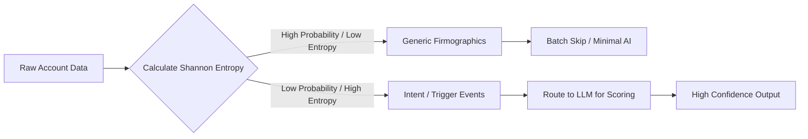

# Information Theory

## Learning Objectives
1. Calculate the Shannon entropy of a discrete dataset using Python.
2. Evaluate the information density of firmographic inputs versus intent-based inputs.
3. Write a script that filters low-signal (low entropy) records from an enrichment dataset before processing.

## The Problem

You are building an account scoring model. You pull a list of 5,000 target accounts from Apollo, push them into Clay, and use an LLM to categorize their buying readiness based on their company descriptions. You burn through thousands of OpenAI tokens, wait 20 minutes for the run to finish, and the output categorizes 90% of your list as "B2B Software Company." 

The LLM didn't fail. Your data pipeline failed. You fed the model high-volume, low-information data. In GTM, we instinctively know that "Industry: SaaS" tells us less about a buyer than "Hired 3 new RevOps analysts last week." But without a mathematical way to measure "how much we learned," RevOps teams routinely process massive datasets where the majority of rows contain zero new predictive signal. They pay for the storage, pay for the API calls, and actively train their AI models on noise.

To filter noise from signal at scale, you need a mechanism to quantify surprise. 

## The Concept

Information theory provides a mathematical framework for quantifying the uncertainty and information content in a message. In 1948, Claude Shannon introduced the concept of **Information Entropy** to solve this exact problem for telecommunications. 

In the context of GTM engineering, entropy measures how much "surprise" or unique signal exists in a given string of text or a data category. Shannon's entropy ($H$) is calculated by looking at the probability distribution of events or characters. The formula is:

$$H(X) = - \sum P(x_i) \log_2 P(x_i)$$

Where $P(x_i)$ is the probability of a specific character, word, or event occurring. The result is measured in *bits*.

**Low Probability Event (High Information):** If an event rarely happens (e.g., a company hiring a Chief Data Officer), its occurrence carries a massive amount of information. It drastically reduces your uncertainty about their buying intent.
**High Probability Event (Low Information):** If an event happens constantly (e.g., a company having a website), its occurrence carries almost zero information. It doesn't change your predictive models at all.

When applied to text—like an account's firmographic description—standard English sentences have low entropy because they are highly predictable. "We are a B2B SaaS company" relies on common syntax and standard business vocabulary. Conversely, highly specific, niche descriptions or breaking news events contain high entropy because the character and word distributions are less predictable.

By calculating the entropy of your enrichment data, you can mathematically deduplicate your focus, filtering out the generic rows before they ever consume your AI budget.



## Build It

To understand information theory at a mechanical level, you need to calculate it from scratch. Below is a pure Python script that calculates the Shannon entropy of a text string. It does this by counting the frequency of each character, converting those frequencies into probabilities, and applying Shannon's formula.

Create a file named `entropy.py` and run the following code:

```python
import math
from collections import Counter

def calculate_shannon_entropy(text):
    clean_text = text.replace(" ", "").lower()
    total_chars = len(clean_text)
    
    if total_chars == 0:
        return 0.0
    
    char_counts = Counter(clean_text)
    entropy = 0.0
    
    for count in char_counts.values():
        probability = count / total_chars
        entropy -= probability * math.log2(probability)
        
    return entropy

generic_firmographic = "We are a leading provider of cloud based enterprise software solutions for businesses."
intent_signal = "Globex Corp acquires European payroll API startup, integrates into RevOps stack."

generic_entropy = calculate_shannon_entropy(generic_firmographic)
intent_entropy = calculate_shannon_entropy(intent_signal)

print(f"Generic Firmographic Entropy: {generic_entropy:.4f} bits")
print(f"Intent Signal Entropy: {intent_entropy:.4f} bits")

if generic_entropy < intent_entropy:
    print("Result: Intent signal contains higher mathematical information density.")
else:
    print("Result: Generic signal contains higher mathematical information density.")
```

When you run this script, you will observe that the highly predictable "generic firmographic" text yields a lower entropy score than the unpredictable "intent signal" text, confirming mathematically which input holds more unique data.

## Use It

This mechanism is entropy-based information filtering, which optimizes LLM token usage by routing only high-signal records in Cluster 1.3, Signal Capture & Enrichment. 

When you enrich thousands of accounts, you often receive brief company descriptions or scraped meta tags. Instead of blindly sending all 5,000 descriptions to an LLM to extract categorizations, you calculate their baseline entropy. Descriptions that fall below a certain entropy threshold are highly generic ("We sell software") and can be categorically mapped without AI. Descriptions that exceed the threshold contain novel signal and are routed to the LLM for deep semantic extraction.

```python
import math
from collections import Counter

def calculate_shannon_entropy(text):
    if not text: return 0.0
    clean_text = text.replace(" ", "").lower()
    char_counts = Counter(clean_text)
    entropy = 0.0
    for count in char_counts.values():
        probability = count / len(clean_text)
        entropy -= probability * math.log2(probability)
    return entropy

accounts = [
    {"domain": "acme.com", "scraped_meta": "Acme Corp - Provider of B2B software solutions."},
    {"domain": "globex.com", "scraped_meta": "Globex automates legacy mainframe integrations for fintech infrastructure."},
    {"domain": "initech.com", "scraped_meta": "Initech - Business software and consulting services."}
]

entropy_threshold = 3.8
llm_api_queue = []

for account in accounts:
    account_entropy = calculate_shannon_entropy(account["scraped_meta"])
    if account_entropy >= entropy_threshold:
        llm_api_queue.append(account["domain"])
        print(f"[AI ROUTE] {account['domain']} queued (Entropy: {account_entropy:.2f} bits)")
    else:
        print(f"[SKIP] {account['domain']} mapped to 'Generic B2B' (Entropy: {account_entropy:.2f} bits)")

print(f"\nTotal Accounts: {len(accounts)}")
print(f"LLM Tokens Wasted on Low-Signal Data: {len(accounts) - len(llm_api_queue)}")
```

By running this script, you have mechanically isolated the single account with unique context and bypassed AI processing for the predictable majority.

## Exercises

**Easy:** Modify the `calculate_shannon_entropy` function to calculate entropy based on word frequency instead of character frequency. Feed it three different strings of marketing copy and compare the results. 

**Medium:** Write a Python script that takes a list of 10 simulated Apollo job titles (e.g., "Head of RevOps", "Chief Marketing Officer", "VP of Sales"). Use your entropy function to programmatically identify which titles are standard (low entropy) and which imply a highly specific, niche buying committee.

**Hard:** Build a data-routing mockup. Create two arrays: `low_entropy_records` and `high_entropy_records`. Write a loop that sorts scraped text strings into these two arrays using your entropy function, simulating a script that saves low-entropy records to a local `.csv` and pushes high-entropy records to an OpenAI API payload array.

## Key Terms
*   **Information Theory:** The mathematical study of the quantification, storage, and communication of information.
*   **Shannon Entropy:** A mathematical metric measuring the average level of "information," "surprise," or "uncertainty" inherent to a variable's possible outcomes.
*   **Information Density:** The ratio of meaningful, novel data points to the total volume of data in a given message.
*   **Low-Probability Event:** An occurrence that deviates from the statistical norm, carrying high predictive value and high entropy.
*   **Signal vs. Noise:** The GTM distinction between actionable, predictive data (signal) and high-volume, boilerplate data (noise).

## Sources
*   Shannon, Claude E. "A Mathematical Theory of Communication." *Bell System Technical Journal*, 1948.
*   [CITATION NEEDED — concept: GTM market standard threshold for firmographic text entropy filtering]