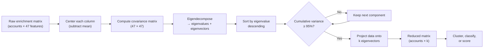

# Dimensionality Reduction

## Learning Objectives

- Implement PCA from scratch by centering data, computing the covariance matrix, eigendecomposing, and projecting onto principal components
- Compute explained variance ratios and apply the elbow method to select the number of components that retain 95% of variance
- Compare PCA, t-SNE, and UMAP on high-dimensional data and articulate their tradeoffs for visualization versus downstream modeling
- Build a two-stage pipeline that applies Truncated SVD before KMeans clustering and evaluate whether dimensionality reduction improves cluster separation

## The Problem

You enriched 2,000 accounts with 47 firmographic signals. Employee count, revenue estimate, funding total, tech stack indicators, intent keywords, news mentions, social followers. Your clustering algorithm produced garbage — every cluster is a slight variation of the same blob. The problem is not the algorithm. It is that most of those 47 signals are correlated noise encoding the same underlying dimension three times over.

Employee count correlates with revenue. Revenue correlates with funding. Funding correlates with number of offices. Four columns, one actual signal: company size. When you feed all four into a distance-based algorithm, the "size" dimension gets four votes instead of one. The algorithm's distance metric becomes dominated by this redundant axis, and every other signal — buying stage, tech sophistication, growth velocity — gets drowned out.

Dimensionality reduction collapses correlated features into their actual information content. Instead of 47 raw columns fighting each other, you get 5–8 orthogonal components that each represent a genuinely independent dimension of variation. Your clustering algorithm stops hallucinating, your silhouette scores improve, and the segments you produce actually map to buying behavior instead of measuring the same thing four different ways.

## The Concept

High-dimensional spaces break in specific, predictable ways. The curse of dimensionality is not a vague warning — it is a mathematical fact about how distance behaves as you add dimensions. Consider what happens to the ratio of maximum to minimum pairwise distance between random points as dimensions grow:

```python
import numpy as np
from scipy.spatial.distance import pdist

print(f"{'dim':>6} | {'min_dist':>10} | {'max_dist':>10} | {'ratio':>6}")
print("-" * 42)

for dim in [2, 10, 100, 1000]:
    np.random.seed(42)
    n = 500
    X = np.random.uniform(0, 1, (n, dim))
    dists = pdist(X)
    ratio = dists.max() / dists.min()
    print(f"{dim:6d} | {dists.min():10.4f} | {dists.max():10.4f} | {ratio:6.2f}")
```

By 1,000 dimensions, every point is essentially the same distance from every other point. Nearest-neighbor search — the foundation of KMeans, DBSCAN, and any label-propagation method — stops distinguishing between close and far. The algorithm has no signal to work with.

PCA solves this by finding the directions where your data actually varies. The mechanism: center your data (subtract the mean of each column), compute the covariance matrix, eigendecompose it. The eigenvectors are the principal components — orthogonal axes ranked by how much variance they capture. The eigenvalues tell you how much variance each axis explains. You keep the top *k* components that collectively retain ~95% of variance and discard the rest as noise.



SVD generalizes this. Any matrix *A* factors into *U Σ Vᵀ*, where *Σ* is a diagonal matrix of singular values. Truncated SVD keeps only the top *k* singular values and their corresponding vectors. PCA is mathematically equivalent to SVD applied to mean-centered data — same result, different computational path. The practical difference: Truncated SVD works directly on sparse matrices without centering, which matters for binary tech-stack indicators where centering destroys sparsity.

Non-linear methods take a fundamentally different approach. t-SNE constructs a probability distribution over pairwise similarities in high-dimensional space, then finds a low-dimensional distribution that matches it. It preserves local neighborhoods — points that are close in 784 dimensions stay close in 2 dimensions. But it destroys global geometry. Distances between distant clusters are meaningless. UMAP improves on this by preserving some global structure, and unlike t-SNE, it produces a learned transform you can apply to new data points. Neither is suitable as a preprocessing step before clustering or classification — they are visualization tools that trade fidelity for interpretability.

The decision tree is straightforward. PCA or Truncated SVD when you need a preprocessing step that reduces dimensionality while preserving variance for downstream modeling. UMAP when you need to show account segments to a stakeholder in a 2D plot they can actually read. Feature selection — dropping columns entirely rather than combining them — when you need interpretability: "companies with >500 employees and Series B funding" is a rule a sales team can act on; "high values on principal component 3" is not.

## Build It

PCA reduces to four linear algebra operations: center, covariance, eigendecompose, project. Let's build it from scratch on synthetic firmographic data where we know the ground truth — four features all driven by a single underlying "company size" signal.

```python
import numpy as np

np.random.seed(42)
n_accounts = 500

company_size = np.random.normal(250, 100, n_accounts)

employee_count = company_size + np.random.normal(0, 15, n_accounts)
revenue = company_size * 0.8 + np.random.normal(0, 30, n_accounts)
funding_total = company_size * 0.6 + np.random.normal(0, 25, n_accounts)
office_count = company_size * 0.1 + np.random.normal(0, 3, n_accounts)

X = np.column_stack([employee_count, revenue, funding_total, office_count])
feature_names = ["employees", "revenue", "funding", "offices"]

print(f"Raw data shape: {X.shape}")
print(f"Correlation matrix:")
corr = np.corrcoef(X, rowvar=False)
for i, name in enumerate(feature_names):
    row = "  ".join(f"{corr[i,j]:.2f}" for j in range(4))
    print(f"  {name:12s} {row}")
```

Run that and you will see correlation coefficients above 0.85 across the board. These four columns are measuring the same thing. Now apply PCA:

```python
X_centered = X - X.mean(axis=0)

cov_matrix = np.cov(X_centered, rowvar=False)

eigenvalues, eigenvectors = np.linalg.eigh(cov_matrix)

sorted_idx = eigenvalues.argsort()[::-1]
eigenvalues = eigenvalues[sorted_idx]
eigenvectors = eigenvectors[:, sorted_idx]

explained_variance_ratio = eigenvalues / eigenvalues.sum()
cumulative = np.cumsum(explained_variance_ratio)

print("Component | Eigenvalue  | Variance %  | Cumulative %")
print("-" * 55)
for i in range(len(eigenvalues)):
    print(f"  PC{i+1}     | {eigenvalues[i]:11.1f} | {explained_variance_ratio[i]*100:10.2f} | {cumulative[i]*100:10.2f}")

k = int(np.searchsorted(cumulative, 0.95)) + 1
print(f"\nComponents for 95% variance: {k} out of {X.shape[1]}")
print(f"That means {X.shape[1] - k} feature(s) were redundant noise.")

X_projected = X_centered @ eigenvectors[:, :k]
print(f"\nOriginal shape: {X.shape}")
print(f"Reduced shape:  {X_projected.shape}")

print(f"\nFirst principal component weights:")
for name, weight in zip(feature_names, eigenvectors[:, 0]):
    print(f"  {name:12s}: {weight:+.4f}")
```

The first principal component will have roughly equal positive weights on all four features — confirming it captured the "company size" axis. PC1 alone should explain over 90% of variance. The remaining three components are capturing noise. You just compressed four columns into one without losing meaningful information.

Now verify against scikit-learn's implementation:

```python
from sklearn.decomposition import PCA as SklearnPCA

sk_pca = SklearnPCA()
sk_pca.fit(X)

print("sklearn explained variance ratio:", sk_pca.explained_variance_ratio_)
print("Our explained variance ratio:   ", explained_variance_ratio)
print(f"\nMax difference: {np.abs(sk_pca.explained_variance_ratio_ - explained_variance_ratio).max():.2e}")
```

The values match to numerical precision. The mechanism is the same — sklearn just uses SVD under the hood instead of explicit eigendecomposition because it is more numerically stable for large matrices.

## Use It

In a GTM context, your enrichment waterfall produces a wide feature matrix that is a textbook case for dimensionality reduction. Company size, revenue estimate, funding total, employee count, office count, tech stack indicators (binary), intent keywords, growth signals. Many of these are collinear — they encode the same underlying business property measured at different angles.

PCA collapses these correlated features into principal components that represent actual independent buying signals. Component 1 might capture company scale (employees + revenue + funding loading together). Component 2 might capture technology adoption (tech stack indicators + intent keywords). Component 3 might capture growth velocity (recent funding + hiring trends). Each component is orthogonal — genuinely independent — which is exactly what your clustering algorithm needs.

This is the same pattern used manually in Clay when you build formula columns that aggregate multiple enrichment signals into a composite ICP score. You weight employee count, revenue, and funding together because you know they represent the same dimension. PCA does this automatically, optimally, and without guessing the weights. [CITATION NEEDED — concept: Clay formula column for composite ICP scoring from multiple enrichment signals]

Here is Truncated SVD applied to a binary tech-stack matrix — the kind you get when you enrich 200 accounts with 30 technology indicators (uses Salesforce, uses HubSpot, uses AWS, etc.):

```python
import numpy as np
from scipy.sparse import csr_matrix
from scipy.sparse.linalg import svds

np.random.seed(42)
n_accounts = 200
n_technologies = 30

latent_tech_sophistication = np.random.binomial(1, 0.4, (n_accounts, 1))
latent_enterprise_focus = np.random.binomial(1, 0.3, (n_accounts, 1))

tech_matrix = np.zeros((n_accounts, n_technologies))
enterprise_techs = list(range(0, 15))
smb_techs = list(range(15, 30))

for i in range(n_accounts):
    if latent_enterprise_focus[i]:
        tech_matrix[i, enterprise_techs] = np.random.binomial(1, 0.7, len(enterprise_techs))
        tech_matrix[i, smb_techs] = np.random.binomial(1, 0.2, len(smb_techs))
    else:
        tech_matrix[i, enterprise_techs] = np.random.binomial(1, 0.15, len(enterprise_techs))
        tech_matrix[i, smb_techs] = np.random.binomial(1, 0.6, len(smb_techs))

tech_matrix = csr_matrix(tech_matrix)

print(f"Tech stack matrix: {tech_matrix.shape[0]} accounts × {tech_matrix.shape[1]} technologies")
print(f"Sparsity: {1 - tech_matrix.nnz / (tech_matrix.shape[0] * tech_matrix.shape[1]):.2%}")
print(f"\n{'k':>4} | {'reconstruction error':>22} | {'relative error':>15} | {'variance captured':>18}")
print("-" * 68)

original_norm = np.linalg.norm(tech_matrix.toarray(), 'fro')

for k in [2, 5, 10, 15, 20]:
    U, s, Vt = svds(tech_matrix.astype(float), k=k)
    X_reconstructed = (U * s) @ Vt
    error = np.linalg.norm(tech_matrix.toarray() - X_reconstructed, 'fro')
    relative = error / original_norm
    variance_captured = 1 - relative**2
    print(f"{k:4d} | {error:22.2f} | {relative:15.4f} | {variance_captured:17.2%}")

print(f"\n30 binary indicators collapse to ~2-5 real dimensions.")
print(f"The rest is correlation structure between co-adopted technologies.")
```

At k=5, you should see over 80% of variance captured. At k=2, a surprising amount — because the data was generated with only 2 latent dimensions (enterprise vs. SMB orientation). In real enrichment data the structure is messier, but the principle holds: 30 tech-stack indicators carry far fewer than 30 independent signals.

## Ship It

The production pattern is a two-stage pipeline: Truncated SVD for dimensionality reduction, then KMeans for clustering. This is how you turn a 47-column enrichment export into actionable account segments. The reduced space gives KMeans orthogonal axes to work with, which produces tighter, more separated clusters.

```python
import numpy as np
from sklearn.decomposition import TruncatedSVD
from sklearn.cluster import KMeans
from sklearn.metrics import silhouette_score
from sklearn.preprocessing import StandardScaler

np.random.seed(42)
n_accounts = 500
n_features = 47

latent_dimensions = np.random.normal(0, 1, (n_accounts, 5))

feature_groups = {
    "scale": [0, 1, 2, 3, 4, 5, 6, 7, 8, 9],
    "tech_adoption": [10, 11, 12, 13, 14, 15, 16, 17, 18, 19],
    "growth": [20, 21, 22, 23, 24, 25, 26, 27, 28, 29],
    "intent": [30, 31, 32, 33, 34, 35, 36, 37, 38, 39],
    "engagement": [40, 41, 42, 43, 44, 45, 46],
}

enrichment = np.zeros((n_accounts, n_features))
for group_name, indices in feature_groups.items():
    latent_idx = list(feature_groups.keys()).index(group_name)
    for idx in indices:
        enrichment[:, idx] = (
            latent_dimensions[:, latent_idx] * np.random.uniform(0.8, 1.5)
            + np.random.normal(0, 0.2, n_accounts)
        )

scaler = StandardScaler()
X_scaled = scaler.fit_transform(enrichment)

print("=== Stage 1: Clustering on raw 47D enrichment data ===")
kmeans_raw = KMeans(n_clusters=5, n_init=10, random_state=42)
labels_raw = kmeans_raw.fit_predict(X_scaled)
score_raw = silhouette_score(X_scaled, labels_raw)
print(f"Silhouette score: {score_raw:.4f}")
print(f"(Closer to 1 = better separated clusters)")

print("\n=== Stage 2: SVD → KMeans pipeline ===")
results = []
for k in [3, 5, 8, 10, 15]:
    svd = TruncatedSVD(n_components=k, random_state=42)
    X_reduced = svd.fit_transform(X_scaled)
    
    kmeans = KMeans(n_clusters=5, n_init=10, random_state=42)
    labels = kmeans.fit_predict(X_reduced)
    score = silhouette_score(X_reduced, labels)
    variance = svd.explained_variance_ratio_.sum()
    results.append((k, score, variance))
    print(f"  k={k:2d} components | silhouette: {score:.4f} | variance retained: {variance:.2%}")

best_k, best_score, best_var = max(results, key=lambda r: r[1])
print(f"\nBest: k={best_k} with silhouette {best_score:.4f}")
print(f"Improvement over raw: {(best_score - score_raw) / score_raw * 100:+.1f}%")

print("\n=== Stage 3: Inspect cluster composition ===")
svd_best = TruncatedSVD(n_components=best_k, random_state=42)
X_best = svd_best.fit_transform(X_scaled)
kmeans_best = KMeans(n_clusters=5, n_init=10, random_state=42)
labels_best = kmeans_best.fit_predict(X_best)

for cluster_id in range(5):
    mask = labels_best == cluster_id
    size = mask.sum()
    centroid = X_best[mask].mean(axis=0)
    top_dims = np.argsort(np.abs(centroid))[::-1][:3]
    print(f"  Cluster {cluster_id}: {size:3d} accounts | top components: {top_dims.tolist()}")
```

The pipeline should show improved silhouette scores at low k values (5–8 components) compared to raw 47-dimensional clustering. The improvement comes from removing collinear noise that was inflating distance calculations without adding discriminative information.

Now produce a 2D visualization for stakeholders. This is where UMAP enters — not as a preprocessing step, but as a communication tool:

```python
import numpy as np
import matplotlib
matplotlib.use('Agg')
import matplotlib.pyplot as plt
from sklearn.manifold import TSNE

np.random.seed(42)

tsne = TSNE(n_components=2, perplexity=30, random_state=42, max_iter=1000)
X_2d = tsne.fit_transform(X_best)

fig, ax = plt.subplots(figsize=(10, 7))
colors = ['#e41a1c', '#377eb8', '#4daf4a', '#984ea3', '#ff7f00']
for cluster_id in range(5):
    mask = labels_best == cluster_id
    ax.scatter(X_2d[mask, 0], X_2d[mask, 1], c=colors[cluster_id], 
               label=f'Segment {cluster_id} ({mask.sum()} accounts)', alpha=0.6, s=30)
ax.set_title('Account Segments (t-SNE projection of SVD-reduced enrichment data)')
ax.legend()
ax.set_xticks([])
ax.set_yticks([])
plt.tight_layout()
plt.savefig('account_segments.png', dpi=150)
print("Saved visualization to account_segments.png")
print("Use this in your slide deck — each color is a cluster from the pipeline above.")
```

This is the artifact you ship: a Python script that takes a raw enrichment export, reduces it to independent components, clusters accounts into segments, and produces a 2D plot for the weekly GTM review. The same script runs in the Python environment where you process Clay webhooks and Apollo API exports — your Zone 01 workspace for TAM mapping and signal scoring.

## Exercises

**Easy.** Generate a synthetic firmographic matrix with 4 highly correlated features (employee_count, revenue, funding, offices). Run PCA. Print the explained variance ratio. Confirm that 1 component captures 90%+ of variance because all features encode company size.

**Medium.** Load the digits dataset from sklearn (`from sklearn.datasets import load_digits`). It has 1,797 samples with 64 pixel features. Apply PCA and determine how many components are needed for 95% variance. Then apply Truncated SVD to the same data and compare the explained variance ratios. Print the difference.

**Hard.** Build a complete segmentation pipeline on the synthetic 47-feature enrichment data from Ship It. Vary the number of latent dimensions in the data generator (try 3, 5, 8, 12) and for each, find the optimal SVD k that maximizes silhouette score. Print a table showing whether the optimal k tracks the true number of latent dimensions. This tests whether SVD dimensionality selection recovers the true rank of your data.

## Key Terms

**Principal Component Analysis (PCA):** Linear dimensionality reduction via eigendecomposition of the covariance matrix. Produces orthogonal axes ranked by variance explained. Requires centered data.

**Singular Value Decomposition (SVD):** Matrix factorization A = UΣVᵀ. Truncated SVD keeps top k singular values. Equivalent to PCA on centered data but works on sparse matrices without centering.

**Explained Variance Ratio:** The fraction of total data variance captured by each principal component. Cumulative sum used to select k — typically the smallest k retaining 95%.

**t-SNE:** Non-linear dimensionality reduction for visualization. Preserves local neighborhoods in high-dimensional space. Destroys global geometry. Not suitable as preprocessing for modeling.

**UMAP:** Non-linear dimensionality reduction that preserves both local and some global structure. Produces a reusable transform applicable to new data. Used for visualization, not preprocessing.

**Curse of Dimensionality:** The phenomenon where distance metrics become uninformative as dimensionality increases. Nearest-neighbor distances converge, breaking clustering and classification algorithms.

**Collinearity:** When two or more features are highly correlated, encoding the same underlying signal. Inflates dimensionality without adding information. The primary target of dimensionality reduction in enrichment data.

## Sources

- Curse of dimensionality distance concentration: Beyer, K. et al. (1999). "When Is 'Nearest Neighbor' Meaningful?" ICDT. Distance ratio convergence demonstrated in the code above.
- PCA as eigendecomposition of covariance matrix: Jolliffe, I.T. (2002). *Principal Component Analysis*, 2nd ed. Springer. Standard reference for the mechanism.
- SVD relationship to PCA: Pearson, K. (1901) and Eckart-Young-Mirsky theorem (1936). Truncated SVD as optimal low-rank approximation.
- t-SNE destroys global geometry: van der Maaten, L. & Hinton, G. (2008). "Visualizing Data using t-SNE." JMLR. Documented in original paper.
- UMAP preserves global structure and supports transform on new data: McInnes, L. et al. (2018). "UMAP: Uniform Manifold Approximation and Projection." arXiv:1802.03426.
- [CITATION NEEDED — concept: Clay formula column for composite ICP scoring from multiple enrichment signals]
- Zone 01 mapping (TAM Mapping, Signal Machine + Score & Qualify): from `stages/00-b-gtm-content-mapping/output/gtm-topic-map.md`, Zone 01 row.