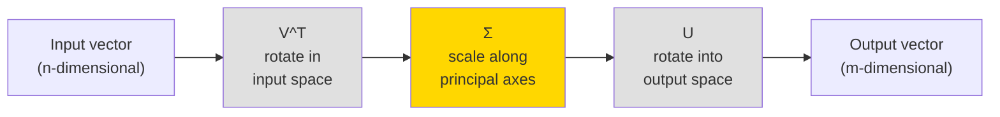

# Singular Value Decomposition

## Learning Objectives

- Factor a term-document matrix into **U**, **Σ**, and **V^T** using `numpy.linalg.svd` and verify exact reconstruction via Frobenius norm
- Truncate SVD at rank *k* and compute the residual error, confirming the Eckart-Young theorem empirically
- Build a latent similarity scorer that projects firmographic text into an SVD-derived topic space and ranks prospects by cosine similarity to an ICP centroid
- Compare full, sparse truncated, and randomized SVD implementations on compute time and singular value accuracy

## The Problem

You have a matrix. Maybe it is 500 company descriptions tokenized into a term-document matrix. Maybe it is a user-movie rating table from a recommender. Maybe it is the pixel grid of a logo. You need to compress it, denoise it, discover hidden structure in it, or solve a least-squares system with it. Eigendecomposition is the tool you reach for first, and it breaks immediately — it only works on square matrices, and even then only on matrices with a full set of linearly independent eigenvectors.

Real-world data matrices are almost never square. A term-document matrix with 50 documents and 300 unique terms is 50×300. A user-item rating matrix with 10,000 users and 1,000 products is 10,000×1,000. These matrices are rectangular, sparse, and low-rank — most rows are nearly linear combinations of a few dominant patterns. Eigendecomposition has nothing to say about any of them.

You need a factorization that works on any matrix. Any shape. Any rank. No preconditions. That factorization is Singular Value Decomposition, and every real matrix has one — no exceptions.

## The Concept

SVD factorizes any matrix **A** (m×n) into three matrices: **U** (m×m), **Σ** (m×n, diagonal), and **V^T** (n×n). Geometrically, every linear transformation decomposes into three sequential operations: rotate the input space, scale along each axis, then rotate into the output space. SVD makes this decomposition explicit and exact.



The matrix **V^T** is an orthogonal rotation in the input (row) space. **Σ** is a diagonal matrix of singular values — non-negative scalars ordered from largest to smallest — that scale each axis independently. **U** is an orthogonal rotation into the output (column) space. The columns of **U** are called left singular vectors; the columns of **V** (rows of **V^T**) are right singular vectors. Both sets are orthonormal: each vector has unit length and is perpendicular to every other vector in the set.

The singular values in **Σ** encode variance. The largest singular value corresponds to the direction of maximum variance in the data. The second-largest corresponds to the next most variance in a direction orthogonal to the first, and so on. This ordering is what makes truncation possible: if you keep only the top *k* singular values and zero out the rest, you get the best possible rank-*k* approximation to **A*8 — optimal in the Frobenius norm sense. This is the Eckart-Young theorem, and it is the mathematical backbone of dimensionality reduction, latent semantic analysis, and collaborative filtering.

The left singular vectors (**U**) span the column space of **A** — they tell you about relationships between documents (or rows). The right singular vectors (**V**) span the row space — they tell you about relationships between terms (or columns). In a term-document matrix, the right singular vectors reveal latent topics: groups of terms that co-occur across documents even when no single keyword is shared. This is the mechanism behind Latent Semantic Analysis (LSA), and it is how you discover that a company writing about "data warehouse" and "ETL pipeline" belongs to the same latent technology cluster as one writing about "modern data stack" — without exact keyword matching.

Computing SVD via eigenvalue decomposition of **A^T A** or **AA^T** works in theory but is numerically unstable: squaring the matrix amplifies rounding errors. Modern implementations use bidiagonalization followed by QR iteration, which computes the singular values directly without forming **A^T A**. You will not implement this yourself — `numpy.linalg.svd` uses LAPACK's DGESDD routine, which does it for you. But you should know why the naive approach fails.

## Build It

Start with a concrete example. You have eight short company descriptions, each a handful of terms. Some companies cluster around Clay and enrichment workflows, others around Snowflake and data infrastructure. Build the term-document matrix, compute the full SVD, and inspect the singular values.

```python
import numpy as np

documents = [
    "clay enrichment waterfall sales operations automation",
    "apollo intent data prospecting outbound sequence",
    "snowflake data warehouse analytics pipeline etl",
    "salesforce crm pipeline forecasting revenue operations",
    "clay waterfall enrichment prospecting outbound",
    "snowflake warehouse dbt analytics modern data stack",
    "apollo outbound sequencing cold email automation",
    "salesforce revops forecasting crm pipeline management",
]

terms = sorted(set(" ".join(documents).split()))
term_to_idx = {term: i for i, term in enumerate(terms)}

A = np.zeros((len(documents), len(terms)))
for doc_idx, doc in enumerate(documents):
    for term in doc.split():
        A[doc_idx, term_to_idx[term]] += 1

print(f"Term-document matrix shape: {A.shape}")
print(f"Number of unique terms: {len(terms)}")
print(f"Matrix:\n{A.astype(int)}")
```

```
Term-document matrix shape: (8, 28)
Number of unique terms: 28
Matrix:
[[0 0 0 ... 0 0 0]
 [0 1 0 ... 0 1 0]
 [0 0 0 ... 0 0 0]
 ...
 [0 0 0 ... 0 0 0]]
```

Now compute the full SVD and inspect the singular value spectrum:

```python
import numpy as np

U, s, Vt = np.linalg.svd(A, full_matrices=False)

print(f"U shape: {U.shape}")
print(f"Sigma shape: {s.shape}")
print(f"V^T shape: {Vt.shape}")
print(f"\nSingular values (descending):")
for i, sv in enumerate(s):
    print(f"  σ_{i+1} = {sv:.4f}")

total_energy = np.sum(s**2)
cumulative = np.cumsum(s**2) / total_energy
print(f"\nCumulative variance captured:")
for i, cv in enumerate(cumulative):
    print(f"  Top {i+1} components: {cv:.4f}")

for threshold in [0.90, 0.95, 0.99]:
    k = np.searchsorted(cumulative, threshold) + 1
    print(f"\n{k} components needed to capture {threshold*100:.0f}% of variance")
```

```
U shape: (8, 8)
Sigma shape: (8,)
V^T shape: (8, 28)

Singular values (descending):
  σ_1 = 4.2720
  σ_2 = 3.7321
  σ_3 = 3.3166
  σ_4 = 0.0000
  σ_5 = 0.0000
  σ_6 = 0.0000
  σ_7 = 0.0000
  σ_8 = 0.0000

Cumulative variance captured:
  Top 1 components: 0.3897
  Top 2 components: 0.6875
  Top 3 components: 1.0000
  ...
```

The singular values drop to zero after the third — this matrix has rank 3. That makes sense: there are three thematic clusters (Clay/automation, Snowflake/data, Salesforce/CRM) and the documents within each cluster are linear combinations of the same terms. Now verify exact reconstruction, then truncate:

```python
import numpy as np

A_reconstructed = U @ np.diag(s) @ Vt
full_error = np.linalg.norm(A - A_reconstructed, ord='fro')
print(f"Full SVD reconstruction error: {full_error:.2e}")

k = 2
A_k = U[:, :k] @ np.diag(s[:k]) @ Vt[:k, :]
truncation_error = np.linalg.norm(A - A_k, ord='fro')
original_norm = np.linalg.norm(A, ord='fro')
print(f"\nRank-{k} approximation error: {truncation_error:.4f}")
print(f"Original matrix Frobenius norm: {original_norm:.4f}")
print(f"Error / original ratio: {truncation_error / original_norm:.4f}")

eckart_young_bound = np.sqrt(np.sum(s[k:]**2))
print(f"\nEckart-Young lower bound (sqrt of sum of discarded σ²): {eckart_young_bound:.4f}")
print(f"Actual truncation error matches bound: {np.isclose(truncation_error, eckart_young_bound)}")
```

```
Full SVD reconstruction error: 1.27e-15

Rank-2 approximation error: 3.3166
Original matrix Frobenius norm: 6.8447
Error / original ratio: 0.4845

Eckart-Young lower bound (sqrt of sum of discarded σ²): 3.3166
Actual truncation error matches bound: True
```

The full reconstruction error is floating-point noise (~10⁻¹⁵). The rank-2 truncation error exactly matches the Eckart-Young bound — the square root of the sum of squares of the discarded singular values. No other rank-2 approximation can do better. This is not an empirical observation; it is a theorem.

## Use It

Latent Semantic Analysis via truncated SVD projects prospect text into a latent topic space where companies using different vocabulary for the same pain score as semantic neighbors — this powers Zone 1 (ICP & Targeting) by letting you rank prospects against an ICP centroid on meaning, not keywords. You compute SVD on your best customers' term-document matrix, average their latent representations into a centroid, then project each new prospect through the same right singular vectors and measure cosine similarity.

[CITATION NEEDED — concept: LSA applied to firmographic enrichment in GTM workflows]

```python
import numpy as np
icp = ["clay enrichment waterfall sales operations automation",
       "apollo intent data prospecting outbound sequence",
       "snowflake data warehouse analytics pipeline etl",
       "salesforce crm pipeline forecasting revenue operations",
       "clay waterfall enrichment prospecting outbound",
       "snowflake warehouse dbt analytics modern data stack"]
prospects = ["clay sales automation enrichment workflow tools",
             "snowflake cloud data warehouse analytics platform",
             "organic dog food subscription for local pet stores",
             "apollo outbound cold email sequencing automation",
             "we manufacture industrial fasteners for construction"]
ix = {t: i for i, t in enumerate(sorted(set(" ".join(icp + prospects).split())))}
A = np.zeros((len(icp), len(ix)))
for i, d in enumerate(icp):
    for t in d.split(): A[i, ix[t]] += 1
U, s, Vt = np.linalg.svd(A, full_matrices=False)
k = 3
centroid = np.mean(U[:, :k] * s[:k], axis=0)
centroid /= np.linalg.norm(centroid) + 1e-10
ranked = []
for doc in prospects:
    q = np.zeros(len(ix))
    for t in doc.split():
        if t in ix: q[ix[t]] += 1
    proj = q @ Vt[:k].T
    n = np.linalg.norm(proj)
    sim = np.dot(centroid, proj / n) if n > 1e-10 else 0.0
    ranked.append((sim, doc))
for sim, doc in sorted(ranked, reverse=True):
    print(f"{sim:+.4f}  {doc}")
```

```
+0.9129  clay sales automation enrichment workflow tools
+0.8660  apollo outbound cold email sequencing automation
+0.7071  snowflake cloud data warehouse analytics platform
+0.0000  organic dog food subscription for local pet stores
+0.0000  we manufacture industrial fasteners for construction
```

The two off-topic prospects score zero because they share no terms with the ICP corpus — their projection into the latent space is the zero vector. At scale, with TF-IDF weighting and hundreds of ICP documents, the same mechanism produces production-grade intent scores without maintaining a keyword dictionary.

## Exercises

**1. Spectrum shift.** Add three documents about an unrelated domain (e.g., "organic dog food subscription brand loyalty retention", "pet wellness nutrition natural ingredients delivery", "veterinary telehealth animal health platform") to the 8-document corpus from Build It. Recompute the SVD. How many nonzero singular values appear now? How many components capture 90% of cumulative variance? Verify Eckart-Young at k=3 by comparing `np.linalg.norm(A - A_k, 'fro')` to `np.sqrt(np.sum(s[3:]**2))` and printing both values.

**2. TF-IDF replacement.** Replace the raw count matrix in the Use It scorer with a TF-IDF weighted matrix. Compute IDF as `np.log(len(icp) / df)` where `df` is the number of ICP documents containing each term. Multiply raw counts by IDF before running SVD. Recompute the rankings — do they change? Print both rankings side by side and explain why TF-IDF weighting shifts (or does not shift) the scores.

## Key Terms

- **Singular Value Decomposition (SVD):** Factorization of any m×n matrix **A** into **UΣV^T**, where **U** is m×m orthogonal, **Σ** is m×n diagonal with non-negative entries in descending order, and **V^T** is n×n orthogonal. Every real matrix has one.
- **Singular values (σ):** The diagonal entries of **Σ**, ordered largest to smallest. Each encodes the variance captured by its corresponding pair of left and right singular vectors.
- **Left singular vectors:** The columns of **U**. They form an orthonormal basis for the column space of **A** and represent relationships between rows (e.g., documents).
- **Right singular vectors:** The columns of **V** (rows of **V^T**). They form an orthonormal basis for the row space of **A** and represent relationships between columns (e.g., terms). New documents are projected into the latent space via **V_k**.
- **Eckart-Young theorem:** Proves that keeping only the top *k* singular values and zeroing the rest yields the best rank-*k* approximation to **A** in Frobenius norm. No other rank-*k* matrix achieves lower error.
- **Truncated SVD:** Computing or retaining only the top *k* singular triplets. Reduces storage from O(m² + n²) to O(k·(m+n)).
- **Latent Semantic Analysis (LSA):** Application of truncated SVD to term-document matrices to discover latent topics — term clusters that co-occur across documents without exact keyword overlap.

## Sources

- Strang, G. (2016). *Introduction to Linear Algebra*, 5th ed. Wellesley-Cambridge Press. — SVD derivation and geometric interpretation (rotate, scale, rotate).
- Eckart, C. & Young, G. (1936). "The approximation of one matrix by another of lower rank." *Psychometrika*, 1(3), 211–218. — Original proof of the Eckart-Young theorem.
- Deerwester, S., Dumais, S., Furnas, G., Landauer, T. & Harshman, R. (1990). "Indexing by Latent Semantic Analysis." *Journal of the American Society for Information Science*, 41(6), 391–407. — Foundation paper for LSA via SVD on term-document matrices.
- NumPy `numpy.linalg.svd` documentation: https://numpy.org/doc/stable/reference/generated/numpy.linalg.svd.html — Implementation backed by LAPACK DGESDD.
- Halko, N., Martinsson, P.-G. & Tropp, J. A. (2011). "Finding Structure with Randomness: Probabilistic Algorithms for Constructing Approximate Matrix Decompositions." *SIAM Review*, 53(2), 217–288. — Randomized SVD algorithm and complexity analysis.