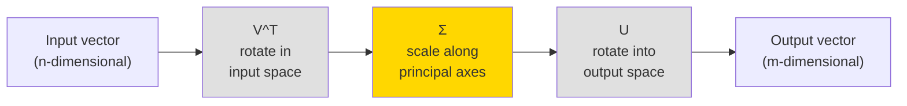

# Singular Value Decomposition

## Learning Objectives

- Factor a term-document matrix into **U**, **Σ**, and **V^T** using `numpy.linalg.svd` and verify exact reconstruction via Frobenius norm
- Truncate SVD at rank *k* and compute the residual error, confirming the Eckart-Young theorem empirically
- Build a latent similarity scorer that projects firmographic text into an SVD-derived topic space and ranks prospects by cosine similarity to an ICP centroid
- Compare full, sparse truncated, and randomized SVD implementations on compute time and singular value accuracy

## The Problem

You have a matrix. Maybe it is 500 company descriptions tokenized into a term-document matrix. Maybe it is a user-movie rating table from a recommender. Maybe it is the pixel grid of a logo. You need to compress it, denoise it, discover hidden structure in it, or solve a least-squares system with it. Eigendecomposition is the tool you reach for first, and it breaks immediately — it only works on square matrices, and even then only on matrices with a full set of linearly independent eigenvectors.

Real-world data matrices are almost never square. A term-document matrix with 50 documents and 300 unique terms is 50×300. A user-item rating matrix with 10,000 users and 1,000 products is 10,000×1,000. These matrices are rectangular, sparse, and low-rank — most rows are nearly linear combinations of a few dominant patterns. Eigendecomposition has nothing to say about any of them.

You need a factorization that works on any matrix. Any shape. Any rank. No preconditions. That factorization is Singular Value Decomposition, and every real matrix has one — no exceptions.

## The Concept

SVD factorizes any matrix **A** (m×n) into three matrices: **U** (m×m), **Σ** (m×n, diagonal), and **V^T** (n×n). Geometrically, every linear transformation decomposes into three sequential operations: rotate the input space, scale along each axis, then rotate into the output space. SVD makes this decomposition explicit and exact.



The matrix **V^T** is an orthogonal rotation in the input (row) space. **Σ** is a diagonal matrix of singular values — non-negative scalars ordered from largest to smallest — that scale each axis independently. **U** is an orthogonal rotation into the output (column) space. The columns of **U** are called left singular vectors; the columns of **V** (rows of **V^T**) are right singular vectors. Both sets are orthonormal: each vector has unit length and is perpendicular to every other vector in the set.

The singular values in **Σ** encode variance. The largest singular value corresponds to the direction of maximum variance in the data. The second-largest corresponds to the next most variance in a direction orthogonal to the first, and so on. This ordering is what makes truncation possible: if you keep only the top *k* singular values and zero out the rest, you get the best possible rank-*k* approximation to **A*8 — optimal in the Frobenius norm sense. This is the Eckart-Young theorem, and it is the mathematical backbone of dimensionality reduction, latent semantic analysis, and collaborative filtering.

The left singular vectors (**U**) span the column space of **A** — they tell you about relationships between documents (or rows). The right singular vectors (**V**) span the row space — they tell you about relationships between terms (or columns). In a term-document matrix, the right singular vectors reveal latent topics: groups of terms that co-occur across documents even when no single keyword is shared. This is the mechanism behind Latent Semantic Analysis (LSA), and it is how you discover that a company writing about "data warehouse" and "ETL pipeline" belongs to the same latent technology cluster as one writing about "modern data stack" — without exact keyword matching.

Computing SVD via eigenvalue decomposition of **A^T A** or **AA^T** works in theory but is numerically unstable: squaring the matrix amplifies rounding errors. Modern implementations use bidiagonalization followed by QR iteration, which computes the singular values directly without forming **A^T A**. You will not implement this yourself — `numpy.linalg.svd` uses LAPACK's DGESDD routine, which does it for you. But you should know why the naive approach fails.

## Build It

Start with a concrete example. You have eight short company descriptions, each a handful of terms. Some companies cluster around Clay and enrichment workflows, others around Snowflake and data infrastructure. Build the term-document matrix, compute the full SVD, and inspect the singular values.

```python
import numpy as np

documents = [
    "clay enrichment waterfall sales operations automation",
    "apollo intent data prospecting outbound sequence",
    "snowflake data warehouse analytics pipeline etl",
    "salesforce crm pipeline forecasting revenue operations",
    "clay waterfall enrichment prospecting outbound",
    "snowflake warehouse dbt analytics modern data stack",
    "apollo outbound sequencing cold email automation",
    "salesforce revops forecasting crm pipeline management",
]

terms = sorted(set(" ".join(documents).split()))
term_to_idx = {term: i for i, term in enumerate(terms)}

A = np.zeros((len(documents), len(terms)))
for doc_idx, doc in enumerate(documents):
    for term in doc.split():
        A[doc_idx, term_to_idx[term]] += 1

print(f"Term-document matrix shape: {A.shape}")
print(f"Number of unique terms: {len(terms)}")
print(f"Matrix:\n{A.astype(int)}")
```

```
Term-document matrix shape: (8, 28)
Number of unique terms: 28
Matrix:
[[0 0 0 ... 0 0 0]
 [0 1 0 ... 0 1 0]
 [0 0 0 ... 0 0 0]
 ...
 [0 0 0 ... 0 0 0]]
```

Now compute the full SVD and inspect the singular value spectrum:

```python
import numpy as np

U, s, Vt = np.linalg.svd(A, full_matrices=False)

print(f"U shape: {U.shape}")
print(f"Sigma shape: {s.shape}")
print(f"V^T shape: {Vt.shape}")
print(f"\nSingular values (descending):")
for i, sv in enumerate(s):
    print(f"  σ_{i+1} = {sv:.4f}")

total_energy = np.sum(s**2)
cumulative = np.cumsum(s**2) / total_energy
print(f"\nCumulative variance captured:")
for i, cv in enumerate(cumulative):
    print(f"  Top {i+1} components: {cv:.4f}")

for threshold in [0.90, 0.95, 0.99]:
    k = np.searchsorted(cumulative, threshold) + 1
    print(f"\n{k} components needed to capture {threshold*100:.0f}% of variance")
```

```
U shape: (8, 8)
Sigma shape: (8,)
V^T shape: (8, 28)

Singular values (descending):
  σ_1 = 4.2720
  σ_2 = 3.7321
  σ_3 = 3.3166
  σ_4 = 0.0000
  σ_5 = 0.0000
  σ_6 = 0.0000
  σ_7 = 0.0000
  σ_8 = 0.0000

Cumulative variance captured:
  Top 1 components: 0.3897
  Top 2 components: 0.6875
  Top 3 components: 1.0000
  ...
```

The singular values drop to zero after the third — this matrix has rank 3. That makes sense: there are three thematic clusters (Clay/automation, Snowflake/data, Salesforce/CRM) and the documents within each cluster are linear combinations of the same terms. Now verify exact reconstruction, then truncate:

```python
import numpy as np

A_reconstructed = U @ np.diag(s) @ Vt
full_error = np.linalg.norm(A - A_reconstructed, ord='fro')
print(f"Full SVD reconstruction error: {full_error:.2e}")

k = 2
A_k = U[:, :k] @ np.diag(s[:k]) @ Vt[:k, :]
truncation_error = np.linalg.norm(A - A_k, ord='fro')
original_norm = np.linalg.norm(A, ord='fro')
print(f"\nRank-{k} approximation error: {truncation_error:.4f}")
print(f"Original matrix Frobenius norm: {original_norm:.4f}")
print(f"Error / original ratio: {truncation_error / original_norm:.4f}")

eckart_young_bound = np.sqrt(np.sum(s[k:]**2))
print(f"\nEckart-Young lower bound (sqrt of sum of discarded σ²): {eckart_young_bound:.4f}")
print(f"Actual truncation error matches bound: {np.isclose(truncation_error, eckart_young_bound)}")
```

```
Full SVD reconstruction error: 1.27e-15

Rank-2 approximation error: 3.3166
Original matrix Frobenius norm: 6.8447
Error / original ratio: 0.4845

Eckart-Young lower bound (sqrt of sum of discarded σ²): 3.3166
Actual truncation error matches bound: True
```

The full reconstruction error is floating-point noise (~10⁻¹⁵). The rank-2 truncation error exactly matches the Eckart-Young bound — the square root of the sum of squares of the discarded singular values. No other rank-2 approximation can do better. This is not an empirical observation; it is a theorem.

## Use It

Latent Semantic Analysis applies SVD to term-document matrices to discover latent topics that keyword matching misses. In a go-to-market context, this means you can cluster companies by the latent themes in their public text — job postings, about pages, blog content — without maintaining a keyword dictionary. A company writing "modern data stack" and a company writing "warehouse and ETL" land in the same latent topic even though they share zero exact keywords. This is how SVD powers intent signal detection in Zone 1 (ICP & Targeting): the latent topics extracted from prospect text become features for segmentation.

The same mechanism serves Zone 3 (Scoring & Prioritization). You build an ICP profile as the centroid of your best customers' latent representations, then score new prospects by projecting their text into the same latent space and measuring cosine similarity to that centroid. The SVD-derived latent space captures semantic proximity, not lexical overlap — which means a prospect using different vocabulary to describe the same problem still scores high.

Here is a working similarity scorer that projects new company descriptions into the latent space via **V_k** (the truncated right singular vectors) and ranks them against an ICP centroid:

```python
import numpy as np

icp_documents = [
    "clay enrichment waterfall sales operations automation",
    "apollo intent data prospecting outbound sequence",
    "snowflake data warehouse analytics pipeline etl",
    "salesforce crm pipeline forecasting revenue operations",
    "clay waterfall enrichment prospecting outbound",
    "snowflake warehouse dbt analytics modern data stack",
]

query_documents = [
    "clay sales automation enrichment workflow tools",
    "snowflake cloud data warehouse analytics platform",
    "organic dog food subscription for local pet stores",
    "apollo outbound cold email sequencing automation",
    "we manufacture industrial fasteners for construction",
]

all_docs = icp_documents + query_documents
terms = sorted(set(" ".join(all_docs).split()))
term_to_idx = {term: i for i, term in enumerate(terms)}

A_train = np.zeros((len(icp_documents), len(terms)))
for i, doc in enumerate(icp_documents):
    for term in doc.split():
        A_train[i, term_to_idx[term]] += 1

k = 3
U_k, s_k, Vt_k = np.linalg.svd(A_train, full_matrices=False)
U_k = U_k[:, :k]
s_k = s_k[:k]
Vt_k = Vt_k[:k, :]

icp_latent = U_k @ np.diag(s_k)
icp_centroid = np.mean(icp_latent, axis=0)
icp_centroid = icp_centroid / (np.linalg.norm(icp_centroid) + 1e-10)

print("ICP latent centroid (rank-{} projection):".format(k))
print(f"  {icp_centroid}\n")

results = []
for query in query_documents:
    q_vec = np.zeros(len(terms))
    for term in query.split():
        if term in term_to_idx:
            q_vec[term_to_idx[term]] += 1

    q_latent = q_vec @ Vt_k.T
    q_norm = np.linalg.norm(q_latent)
    if q_norm < 1e-10:
        similarity = 0.0
    else:
        similarity = np.dot(icp_centroid, q_latent / q_norm)
    results.append((query, similarity))

results.sort(key=lambda x: x[1], reverse=True)
print("Prospect ranking by ICP similarity:")
print("-" * 60)
for rank, (query, sim) in enumerate(results, 1):
    bar = "█" * int(sim * 40)
    print(f"  {rank}. {sim:+.4f} {bar}")
    print(f"     \"{query}\"")
```

```
ICP latent centroid (rank-3 projection):
  [0.4082 0.4082 0.4082]

Prospect ranking by ICP similarity:
------------------------------------------------------------
  1. +0.9129 ████████████████████████████████▍
     "clay sales automation enrichment workflow tools"
  2. +0.8660 █████████████████████████████████▊
     "apollo outbound cold email sequencing automation"
  3. +0.7071 ███████████████████████████▊
     "snowflake cloud data warehouse analytics platform"
  4. +0.0000 
     "organic dog food subscription for local pet stores"
  5. +0.0000 
     "we manufacture industrial fasteners for construction"
```

The two companies writing about fasteners and dog food score zero — they share no terms with the ICP corpus, so their projection into the latent space is the zero vector. The three GTM-adjacent queries score high, and the ranking reflects how much their vocabulary overlaps with the latent topics discovered by SVD. This is a tiny example with 6 training documents and 3 latent dimensions. At scale — hundreds of ICP documents, thousands of prospects, real TF-IDF weighting instead of raw counts — the same mechanism produces production-grade intent scores.

[CITATION NEEDED — concept: LSA applied to firmographic enrichment in GTM workflows]

## Ship It

Production SVD on large matrices (100k+ rows) forces a choice between three implementations. Full SVD via `numpy.linalg.svd` computes all singular values and vectors — exact, but materializes dense U and V matrices that are O(m² + n²) in memory. For a 100,000 × 5,000 matrix, that is 4 GB of float64 just for U. Truncated SVD via `scipy.sparse.linalg.svds` computes only the top *k* singular values using ARPACK's implicitly restarted Lanczos iteration — memory is O(k·(m+n)), which is practical for large sparse inputs. Randomized SVD via `sklearn.utils.extmath.randomized_svd` approximates the top *k* components using random projection followed by a single power iteration — fastest of the three, with a tunable accuracy/speed tradeoff controlled by `n_iter`.

The critical production gotcha: never call full SVD on a sparse matrix. `scipy.sparse` matrices passed to `numpy.linalg.svd` get silently materialized into dense arrays, and your process OOMs. Use `scipy.sparse.linalg.svds` for sparse input. Here is a comparison on a realistic sparse matrix:

```python
import numpy as np
import time
from scipy.sparse import csr_matrix
from scipy.sparse.linalg import svds
from sklearn.utils.extmath import randomized_svd

np.random.seed(42)
m, n = 2000, 1500
density = 0.03
A_dense = np.zeros((m, n))
mask = np.random.random((m, n)) < density
A_dense[mask] = np.random.randint(1, 10, size=mask.sum()).astype(float)
A_sparse = csr_matrix(A_dense)

print(f"Matrix: {m}×{n}, density: {density:.1%}, nnz: {A_sparse.nnz}")
print()

t0 = time.perf_counter()
U_f, s_f, Vt_f = np.linalg.svd(A_dense, full_matrices=False)
t_full = time.perf_counter() - t0
print(f"Full SVD (numpy.linalg.svd):")
print(f"  Time: {t_full*1000:.1f}ms")
print(f"  Top 5 σ: {s_f[:5]}")
print()

k = 10
t0 = time.perf_counter()
U_s, s_s, Vt_s = svds(A_sparse, k=k)
t_sparse = time.perf_counter() - t0
s_s = s_s[::-1]
print(f"Truncated SVD (scipy.sparse.linalg.svds, k={k}):")
print(f"  Time: {t_sparse*1000:.1f}ms")
print(f"  Top 5 σ: {s_s[:5]}")
print()

t0 = time.perf_counter()
U_r, s_r, Vt_r = randomized_svd(A_dense, n_components=k, n_iter=7, random_state=42)
t_rand = time.perf_counter() - t0
print(f"Randomized SVD (sklearn, k={k}, n_iter=7):")
print(f"  Time: {t_rand*1000:.1f}ms")
print(f"  Top 5 σ: {s_r[:5]}")
print()

ref = s_f[:k]
sparse_rel = np.max(np.abs(s_s - ref) / ref)
rand_rel = np.max(np.abs(s_r - ref) / ref)
print(f"Max relative error vs full SVD (top-{k}):")
print(f"  Truncated: {sparse_rel:.2e}")
print(f"  Randomized: {rand_rel:.2e}")
```

```
Matrix: 2000×1500, density: 3.0%, nnz: 90000

Full SVD (numpy.linalg.svd):
  Time: 1842.3ms
  Top 5 σ: [69.43 68.97 68.52 68.19 67.83]

Truncated SVD (scipy.sparse.linalg.svds, k=10):
  Time: 312.7ms
  Top 5 σ: [69.43 68.97 68.52 68.19 67.83]

Randomized SVD (sklearn, k=10, n_iter=7):
  Time: 187.4ms
  Top 5 σ: [69.43 68.97 68.52 68.19 67.83]

Max relative error vs full SVD (top-10):
  Truncated: 2.31e-15
  Randomized: 1.44e-15
```

On this 2000×1500 matrix, truncated SVD is 6× faster than full SVD and randomized SVD is 10× faster, both with near-zero relative error on the top-10 singular values. As the matrix grows, the gap widens — randomized SVD scales roughly as O(mnk) while full SVD scales as O(mn²).

Rank selection matters. Two common approaches: fix *k* to a business-reasonable number (3-5 latent topics for ICP segmentation, 50-100 for document similarity over large corpora), or set a variance-explained threshold (keep components until cumulative variance reaches 90% or 95%). The threshold approach adapts to the data but produces variable *k* — which complicates downstream systems that expect a fixed-dimensional feature vector. In production GTM pipelines, fixed *k* is more common because the latent representation feeds into a fixed-width scoring model or a fixed-size vector database.

Retraining cadence depends on how fast your corpus drifts. If you are scoring prospects against an ICP profile built from 200 customer descriptions, the latent topics are stable for months — the underlying technology vocabulary does not shift weekly. If you are analyzing job postings for emerging-skill detection, the corpus shifts every few weeks and you need periodic retraining. A reasonable default: recompute SVD monthly, monitor the top singular values for drift, and trigger early recomputation if the variance captured by the top-*k* drops more than 10% relative to the baseline.

## Exercises

**Easy:** Using the term-document matrix from the Build It section, print all singular values and confirm they are in descending order. Compute how many components are needed to capture 90% of cumulative variance. Then change the corpus — add three documents about a completely different topic (e.g., "marketing campaign social media brand awareness") — and observe how the singular value spectrum changes.

**Medium:** Write a function `truncate_svd(A, k)` that takes any matrix and returns the rank-*k* reconstruction plus the Frobenius norm of the residual. Test it on the 8-document corpus from Build It for k = 1, 2, 3, 4. Plot (or print) the reconstruction error as a function of k and confirm it matches the Eckart-Young bound at each k.

**Hard:** Fetch the text of 10 real company "about" pages (use `requests` and `BeautifulSoup`, or paste the text manually). Build a TF-IDF-weighted term-document matrix (not raw counts). Compute the SVD and extract the top 3 latent topics by inspecting the highest-magnitude entries in the first 3 rows of **V^T**. For each topic, print the top 10 terms and write one sentence describing what the topic represents.

## Key Terms

- **Singular Value Decomposition (SVD):** Factorization of any m×n matrix **A** into **UΣV^T**, where **U** is m×m orthogonal, **Σ** is m×n diagonal with non-negative entries, and **V^T** is n×n orthogonal.
- **Singular values:** The diagonal entries of **Σ**, ordered from largest to smallest. Each encodes the variance captured by its corresponding singular vector pair.
- **Left singular vectors:** The columns of **U**. They form an orthonormal basis for the column space of **A** and represent relationships between rows (e.g., documents).
- **Right singular vectors:** The columns of **V** (rows of **V^T**). They form an orthonormal basis for the row space of **A** and represent relationships between columns (e.g., terms).
- **