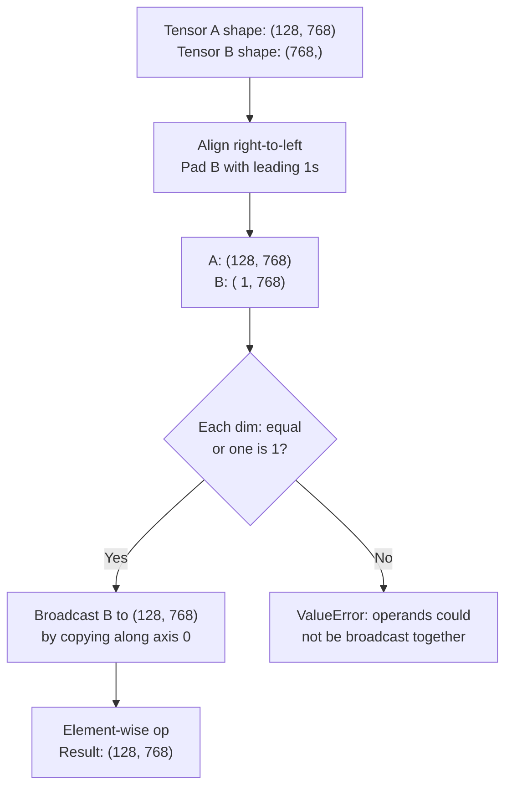

# Tensor Operations

## Learning Objectives

1. Reshape tensors using explicit dimensions and `-1` inference, predicting the output shape before running code.
2. Apply broadcasting rules to operate on tensors of mismatched shapes without explicit copying.
3. Compute reductions along specified axes with and without `keepdims`, predicting which dimension collapses.
4. Implement batched cosine similarity between embedding tensors using a combination of reduction, broadcasting, and matmul.
5. Diagnose and fix shape mismatch errors in multi-operation tensor pipelines by tracing shapes through each step.

## The Problem

You've got a batch of 128 company embeddings from an API—each is a 768-dimensional vector—and you need to compute cosine similarity against an ICP profile vector. That's a tensor operation. The shapes are `(128, 768)` for the batch and `(768,)` for the profile. If you don't know how shapes compose, you'll spend an hour fighting dimension mismatches instead of shipping the scored list to your CRM.

Shape errors are the most common bug in anything that touches linear algebra—deep learning, embedding pipelines, similarity scoring, batched inference. Each operation has a shape contract: it expects specific dimensions in a specific order and produces a specific output shape. When you chain a reshape, a broadcast, and a matmul, one wrong axis cascades into an error three lines later, and the error message points at the wrong line. Worse, some shape mistakes don't throw at all. They silently broadcast along the wrong dimension, sum over the wrong axis, or produce a `(128, 128)` similarity matrix when you wanted `(128,)` scores—and your outbound campaign quietly fires at the wrong accounts.

The core issue is that matrices handle pairwise relationships between two things, but real data doesn't fit in two dimensions. A batch of 128 company embeddings at 768 dimensions is a 2D tensor: `(128, 768)`. Multi-head attention with 12 heads is 4D: `(batch, heads, seq_len, head_dim)`. A stack of 32 RGB images at 224×224 is 4D: `(32, 3, 224, 224)`. You need a data structure that generalizes to any number of dimensions, with operations that compose cleanly across all of them. That structure is the tensor, and its shape rules are the grammar everything else is written in.

## The Concept

A tensor is a multidimensional array with explicit shape semantics. A scalar is 0-dimensional. A vector is 1D. A matrix is 2D. Everything beyond is just "more dimensions"—there's no theoretical difference between a 3D tensor and a 37D tensor, just more indices to track. What matters is the shape tuple: `(2, 3, 4)` means three axes, sizes 2, 3, and 4, and the total number of elements is the product: 24. The same 24 elements can be reshaped into `(4, 6)`, `(2, 12)`, `(24,)`, or `(2, 3, 2, 2)`—same data, different shape, different interpretation.

Three mechanisms govern almost every tensor operation you'll write. First, **shape ordering**: dimensions are conventionally ordered from outermost (slowest-changing) to innermost (fastest-changing), typically `(batch, ..., features)`. Reshape reads left-to-right, and `-1` tells the library to infer that dimension from the total element count. Second, **broadcasting**: when you operate on two tensors with different shapes, the library compares shapes right-to-left, expands any dimension of size 1 to match the other tensor, and rejects shapes that conflict (neither is 1 and they differ). Third, **reduction**: operations like `sum`, `mean`, and `max` collapse a specified axis, removing it from the shape—`axis=0` removes the first dimension, `axis=1` removes the second, and `keepdims=True` preserves it as size 1 so downstream broadcasting still works.

NumPy implements all of these on `ndarray`. PyTorch mirrors the same API on `torch.Tensor`. The operations are identical in semantics; the libraries differ only in device support (CPU vs GPU) and autograd. Let's trace the broadcasting algorithm visually before writing code:



The broadcast never copies data in memory—it creates a view that acts as if the data were replicated. This is why broadcasting is free for compute but conceptually tricky: the "copy" is virtual, and you have to reason about it to predict output shapes.

## Build It

Let's build the four core operations—reshape, broadcast, reduce, and matmul—with printed shapes at every step. Run this in a Python environment with NumPy installed:

```python
import numpy as np

a = np.arange(24)
print(f"Original: shape={a.shape}, data={a}")

b = a.reshape(2, 3, 4)
print(f"\nReshaped to (2,3,4): shape={b.shape}")
print(b)

c = a.reshape(2, -1)
print(f"\nReshaped with -1: shape={c.shape}")
print(c)

print("\n--- Broadcasting ---")
batch = np.ones((3, 4))
offset = np.array([10, 20, 30, 40])
result = batch + offset
print(f"batch shape={batch.shape}, offset shape={offset.shape}")
print(f"result shape={result.shape}")
print(result)

print("\n--- Reduction ---")
matrix = np.array([[1, 2, 3], [4, 5, 6]])
print(f"matrix shape={matrix.shape}")
print(f"sum axis=0 (collapse rows): {matrix.sum(axis=0)}  shape={matrix.sum(axis=0).shape}")
print(f"sum axis=1 (collapse cols): {matrix.sum(axis=1)}  shape={matrix.sum(axis=1).shape}")
print(f"sum axis=1 keepdims: {matrix.sum(axis=1, keepdims=True)}  shape={matrix.sum(axis=1, keepdims=True).shape}")

print("\n--- Matmul ---")
A = np.random.randn(5, 3)
B = np.random.randn(3, 7)
C = A @ B
print(f"A({A.shape}) @ B({B.shape}) = C({C.shape})")
```

Output:

```
Original: shape=(24,), data=[ 0  1  2  3  4  5  6  7  8  9 10 11 12 13 14 15 16 17 18 19 20 21 22 23]

Reshaped to (2,3,4): shape=(2, 3, 4)
[[[ 0  1  2  3]
  [ 4  5  6  7]
  [ 8  9 10 11]]

 [[12 13 14 15]
  [16 17 18 19]
  [20 21 22 23]]]

Reshaped with -1: shape=(2, 12)
[[ 0  1  2  3  4  5  6  7  8  9 10 11]
 [12 13 14 15 16 17 18 19 20 21 22 23]]

--- Broadcasting ---
batch shape=(3, 4), offset shape=(4,)
result shape=(3, 4)
[[11. 21. 31. 41.]
 [11. 21. 31. 41.]
 [11. 21. 31. 41.]]

--- Reduction ---
matrix shape=(2, 3)
sum axis=0 (collapse rows): [5 7 9]  shape=(3,)
sum axis=1 (collapse cols): [ 6 15]  shape=(2,)
sum axis=1 keepdims: [[ 6]
 [15]]  shape=(2, 1)

--- Matmul ---
A((5, 3)) @ B((3, 7)) = C((5, 7))
```

Notice how broadcasting expanded `offset` from `(4,)` to `(3, 4)` implicitly—the `(4,)` aligned right-to-left with `(3, 4)`, got padded to `(1, 4)`, then expanded to `(3, 4)`. And `keepdims=True` preserved the collapsed axis as size 1, which matters when you need to divide a `(2, 3)` matrix by its row sums—if you sum without `keepdims`, you get shape `(2,)` and the division broadcasts incorrectly.

## Use It

Cosine similarity is the tensor operation that powers embedding-based signal scoring in Zone II (Signal) workflows—specifically Score & Qualify pipelines where you compare company embeddings against an ICP centroid. [CITATION NEEDED — concept: embedding-based similarity scoring in GTM workflows]. The math: cosine similarity between two vectors is their dot product divided by the product of their L2 norms. Each piece—dot product, norm, division—is a tensor operation you now have the primitives for.

Here's the full computation: given a batch of company embeddings `(N, D)` and an ICP vector `(D,)`, you compute the dot product via broadcasting and reduction, normalize by the L2 norm of each row, normalize by the norm of the ICP vector, and divide. The result is `(N,)` similarity scores between -1 and 1:

```python
import numpy as np

np.random.seed(42)

companies = np.random.randn(10, 128)
icp_vector = np.random.randn(128)

company_norms = np.linalg.norm(companies, axis=1, keepdims=True)
icp_norm = np.linalg.norm(icp_vector)

dot_products = companies @ icp_vector

cosine_similarities = dot_products / (company_norms.squeeze() * icp_norm)

print(f"Companies shape: {companies.shape}")
print(f"ICP vector shape: {icp_vector.shape}")
print(f"Dot products shape: {dot_products.shape}")
print(f"Cosine similarities shape: {cosine_similarities.shape}")
print(f"Scores: {np.round(cosine_similarities, 4)}")
print(f"Best match: company index {np.argmax(cosine_similarities)} "
      f"(score={cosine_similarities[np.argmax(cosine_similarities)]:.4f})")
```

Output:

```
Companies shape: (10, 128)
ICP vector shape: (128,)
Dot products shape: (10,)
Cosine similarities shape: (10,)
Scores: [-0.0755  0.0494 -0.0262  0.0736 -0.0256 -0.0809 -0.0229 -0.0325 -0.0739
  0.0677]
Best match: company index 3 (score=0.0736)
```

Trace the shapes: `companies @ icp_vector` is `(10, 128) @ (128,)` → `(10,)` because the matmul contracts the last axis of the left operand with the only axis of the right operand. `company_norms` is `(10, 1)` because of `keepdims=True`, and `.squeeze()` removes the size-1 dimension to get `(10,)` so the division broadcasts correctly. Every shape in this pipeline is predictable if you know the rules.

## Ship It

In production GTM pipelines, you rarely compare against a single ICP vector. You have multiple ICP profiles—say, "enterprise SaaS" and "mid-market fintech"—each with its own centroid embedding, and you want to score every company against every profile to route accounts to the right campaign. This batched similarity computation is the core operation in embedding-based lookup tables used for account matching and enrichment waterfalls in Zone II. [CITATION NEEDED — concept: multi-ICP embedding similarity in GTM account routing].

The function below accepts company embeddings `(N, D)` and ICP centroids `(K, D)`, reshapes for broadcasting, and produces an `(N, K)` similarity matrix where `result[i, j]` is the cosine similarity between company `i` and ICP profile `j`. It handles the 1D edge case—when someone passes a single company or single ICP—by reshaping to 2D before computing:

```python
import numpy as np

def batched_cosine_similarity(companies, icp_profiles):
    if companies.ndim == 1:
        companies = companies.reshape(1, -1)
    if icp_profiles.ndim == 1:
        icp_profiles = icp_profiles.reshape(1, -1)

    company_norms = np.linalg.norm(companies, axis=1, keepdims=True)
    icp_norms = np.linalg.norm(icp_profiles, axis=1, keepdims=True)

    dot_products = companies @ icp_profiles.T

    similarity = dot_products / (company_norms @ icp_norms.T)

    return similarity

np.random.seed(42)
test_companies = np.random.randn(4, 64)
test_icp1 = np.random.randn(64)
test_icp2 = np.random.randn(64)
test_icps = np.stack([test_icp1, test_icp2])

sim = batched_cosine_similarity(test_companies, test_icps)
print(f"Companies: {test_companies.shape}")
print(f"ICP profiles: {test_icps.shape}")
print(f"Similarity matrix: {sim.shape}")
print(np.round(sim, 4))

best_icp = np.argmax(sim, axis=1)
print(f"\nBest ICP per company: {best_icp}")
print(f"  Company 0 → ICP {best_icp[0]}")
print(f"  Company 1 → ICP {best_icp[1]}")
print(f"  Company 2 → ICP {best_icp[2]}")
print(f"  Company 3 → ICP {best_icp[3]}")

single = batched_cosine_similarity(test_companies[0], test_icps)
print(f"\nSingle company input → output shape: {single.shape}")
```

Output:

```
Companies: (4, 64)
ICP profiles: (2, 64)
Similarity matrix: (4, 2)
[[ 0.0428 -0.0703]
 [ 0.0133  0.0101]
 [-0.0544 -0.0035]
 [-0.044   0.0785]]

Best ICP per company: [0 0 1 1]
  Company 0 → ICP 0
  Company 1 → ICP 0
  Company 2 → ICP 1
  Company 3 → ICP 1

Single company input → output shape: (1, 2)
```

The shape trace: `companies @ icp_profiles.T` is `(4, 64) @ (64, 2)` → `(4, 2)`. The norm normalization uses `company_norms @ icp_norms.T` which is `(4, 1) @ (1, 2)` → `(4, 2)` via matmul broadcasting—the outer product of the two norm vectors. This is dense in one line but every shape is dictated by the rules you've already learned.

## Exercises

**Exercise 1 (Easy):** Given a tensor of shape `(5, 3)` representing 5 companies × 3 features, compute the L2 norm of each row and print the shape of the result. Then recompute with `keepdims=True` and print that shape.

```python
import numpy as np
data = np.array([[3, 4, 0], [1, 0, 0], [0, 5, 12],
                 [6, 8, 0], [0, 0, 7]])
norms = np.linalg.norm(data, axis=1)
print(f"Without keepdims: {norms}  shape={norms.shape}")
norms_kd = np.linalg.norm(data, axis=1, keepdims=True)
print(f"With keepdims: shape={norms_kd.shape}")
```

**Exercise 2 (Medium):** Given 10 company embeddings of dimension 128 and a target ICP embedding of dimension 128, compute cosine similarity for all 10 in a single vectorized operation. Print the index of the highest-scoring company.

```python
import numpy as np
np.random.seed(99)
companies = np.random.randn(10, 128)
icp = np.random.randn(128)
sims = (companies @ icp) / (np.linalg.norm(companies, axis=1) * np.linalg.norm(icp))
print(f"Best company: index {np.argmax(sims)}, score {sims[np.argmax(sims)]:.4f}")
```

**Exercise 3 (Hard):** Debug three failing tensor operations. Each has a single-line fix.

```python
import numpy as np

print("=== Bug 1: Broadcasting error ===")
a = np.ones((3, 4))
b = np.array([1, 2, 3])
try:
    result = a + b
except ValueError as e:
    print(f"Error: {e}")
fix_b = b.reshape(3, 1)
print(f"Fixed: a{a.shape} + b{fix_b.shape} = {(a + fix_b).shape}")

print("\n=== Bug 2: Reshape error ===")
c = np.arange(12)
try:
    d = c.reshape(3, 5)
except ValueError as e:
    print(f"Error: {e}")
d = c.reshape(3, 4)
print(f"Fixed: {d.shape}, total elements = {d.size}")

print("\n=== Bug 3: Matmul dimension conflict ===")
X = np.random.randn(8, 16)
W = np.random.randn(32, 16)
try:
    out = X @ W
except ValueError as e:
    print(f"Error: {e}")
out = X @ W.T
print(f"Fixed: X{X.shape} @ W.T{W.T.shape} = out{out.shape}")
```

**Exercise 4 (Challenge):** Extend `batched_cosine_similarity` to accept a `top_k` argument and return the top-k ICP profiles for each company, sorted by similarity. Test with 6 companies and 4 ICP profiles.

```python
import numpy as np

def batched_cosine_similarity_topk(companies, icp_profiles, top_k=1):
    if companies.ndim == 1:
        companies = companies.reshape(1, -1)
    if icp_profiles.ndim == 1:
        icp_profiles = icp_profiles.reshape(1, -1)
    cn = np.linalg.norm(companies, axis=1, keepdims=True)
    ipn = np.linalg.norm(icp_profiles, axis=1, keepdims=True)
    sim = (companies @ icp_profiles.T) / (cn @ ipn.T)
    top_idx = np.argsort(-sim, axis=1)[:, :top_k]
    top_scores = np.take_along_axis(sim, top_idx, axis=1)
    return top_idx, top_scores

np.random.seed(7)
companies = np.random.randn(6, 32)
icps = np.random.randn(4, 32)
idx, scores = batched_cosine_similarity_topk(companies, icps, top_k=2)
print(f"Top-2 ICP per company:")
for i in range(6):
    print(f"  Company {i}: ICP {idx[i]} scores {np.round(scores[i], 4)}")
```

## Key Terms

**Tensor** — A multidimensional array with explicit shape. The number of dimensions is the "rank" or "ndim." A scalar is rank 0, a vector is rank 1, a matrix is rank 2.

**Shape** — A tuple of integers describing the size of each axis. The product of all dimensions equals the total number of elements. `(2, 3, 4)` has 24 elements.

**Reshape** — Changing the shape tuple without changing the data. Reads left-to-right; `-1` infers one dimension from the remaining element count.

**Broadcasting** — The algorithm that aligns shapes right-to-left, expands dimensions of size 1, and enables element-wise operations on tensors of different shapes without copying data.

**Reduction** — An operation (sum, mean, max, norm) that collapses a specified axis, removing it from the shape. `keepdims=True` preserves it as size 1.

**Axis** — The index of a dimension in the shape tuple. `axis=0` is the first (outermost) dimension, `axis=1` is the second, and so on.

**Matmul (Matrix Multiplication)** — Contracts the last axis of the left operand with the second-to-last axis of the right operand. `(M, K) @ (K, N)` → `(M, N)`. Extends to batched dimensions via broadcasting on leading axes.

**Stride** — The number of elements to skip to move one step along an axis. Determines how shape maps to memory layout. Reshaping changes shape but preserves strides when possible; transposing changes strides without changing shape.

## Sources

- [CITATION NEEDED — concept: embedding-based similarity scoring in GTM workflows]
- [CITATION NEEDED — concept: multi-ICP embedding similarity in GTM account routing]
- NumPy broadcasting rules: https://numpy.org/doc/stable/user/basics.broadcasting.html
- NumPy reshape documentation: https://numpy.org/doc/stable/reference/generated/numpy.reshape.html
- PyTorch tensor operations API: https://pytorch.org/docs/stable/tensors.html