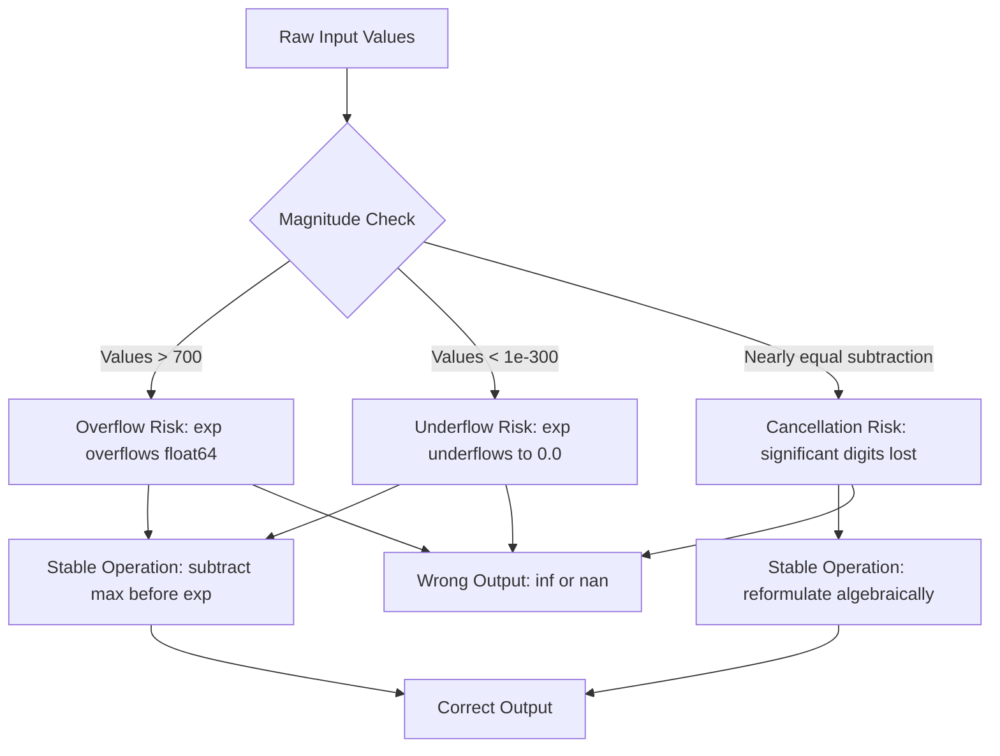

# Numerical Stability

## Learning Objectives

- Implement numerically stable softmax and log-sum-exp using the max-subtraction trick in Python
- Detect overflow, underflow, and catastrophic cancellation in floating-point computations by inspecting intermediate values
- Compare naive summation against Kahan summation and Welford's online algorithm on extreme-value inputs
- Compute stable log-space probability accumulations that avoid `inf` and `nan` across 10,000+ entries
- Rewrite unstable scoring normalization routines to prevent rank-order inversions in production enrichment pipelines

## The Problem

Your enrichment pipeline scores 1,200 accounts using a softmax over raw model logits. The top of the list looks correct in staging — five accounts with scores between 4.2 and 8.7, softmax distributes probability across them cleanly. In production, the raw logits span from -12 to 740 because a vendor API started returning unscaled confidence values. The softmax function returns an array of all zeros. Every account gets score `0.0`. The pipeline does not crash. It writes 1,200 rows of zeros to your data warehouse, and your sales team calls you on Monday asking why every account is tied for last place.

The model did not fail. The math did not fail. The numbers fell off the bottom of `float64`, and Python has no opinion about that. `exp(740)` is approximately `10^321`, which exceeds the maximum representable `float64` value of approximately `1.8 × 10^308`. The exponentials all become `inf`, the denominator becomes `inf`, and `inf / inf` is `nan` — or worse, in some implementations, `0.0` after a division that silently underflows. No exception. No warning. No log line. Just zeros.

This is the core problem of numerical stability: finite-precision arithmetic silently produces wrong answers when operations push values outside the representable range or when nearly equal numbers are subtracted. The fixes are not complicated — they are two-line algebraic rearrangements that have been known since the 1970s. But if you do not know the failure modes exist, you will not look for them, and your enrichment scores will be wrong in ways that are invisible until someone notices the rank order is backwards.

## The Concept

Computers store real numbers using the IEEE 754 floating-point standard. A `float64` (also called double precision) allocates 64 bits: one sign bit, eleven exponent bits, and fifty-two mantissa bits. The mantissa determines precision — how many significant digits are stored. The exponent determines range — how large or small the magnitude can be. For `float64`, the largest finite value is approximately `1.8 × 10^308` and the smallest positive normalized value is approximately `2.2 × 10^-308`. Values pushed beyond these bounds become `inf` or `0.0` silently.

Finite precision means every real number is rounded to the nearest representable value. This rounding error is small per operation — on the order of `10^-16` relative error for `float64` — but it accumulates across millions of operations. More dangerously, certain mathematical operations amplify rounding error catastrophically. Subtracting two nearly equal numbers destroys significant digits: if `a = 1.0000001` and `b = 1.0000000`, the exact result is `10^-7`, but if the inputs were already rounded, the result may have only one or two correct digits. This is catastrophic cancellation, and it is the reason why naive variance calculations on large datasets produce wrong answers.



The three failure modes you will encounter in practice are overflow (values exceed the maximum representable float), underflow (values fall below the minimum representable positive float and become zero), and catastrophic cancellation (subtraction of nearly equal numbers destroys precision). A fourth related problem — error accumulation — occurs when millions of small rounding errors compound across a long computation, such as summing a million numbers. Each of these has a known fix: overflow and underflow in softmax are solved by subtracting the maximum value before exponentiating (an algebraic identity that does not change the result). Catastrophic cancellation in variance is solved by Welford's online algorithm, which maintains running sums in a numerically stable form. Error accumulation in summation is reduced by Kahan summation, which tracks a compensation term for lost low-order bits.

The key insight across all fixes is the same: you rearrange the algebra so that intermediate values stay within the representable range, without changing the mathematical result. The softmax of `[1000, 1001, 1002]` is mathematically identical to the softmax of `[0, 1, 2]` — subtracting the maximum from every element before exponentiating produces the same probability distribution. The difference is that `exp(1000)` overflows and `exp(0)` does not.

## Build It

### Failure Mode 1: Softmax Overflow and the Max-Subtraction Trick

Softmax converts a vector of raw scores into a probability distribution. The formula is `exp(x_i) / sum(exp(x_j))` for each element `i`. When any `x_j` exceeds approximately 709 in `float64`, `exp(x_j)` overflows to `inf`, and the computation produces `nan`. The fix exploits the algebraic identity that softmax is invariant to additive constants: `softmax(x) == softmax(x - max(x))`.

```python
import math

def softmax_unstable(x):
    exps = [math.exp(xi) for xi in x]
    total = sum(exps)
    return [e / total for e in exps]

def softmax_stable(x):
    max_x = max(x)
    exps = [math.exp(xi - max_x) for xi in x]
    total = sum(exps)
    return [e / total for e in exps]

scores = [1000, 1001, 1002]

try:
    result_unstable = softmax_unstable(scores)
    print("Unstable softmax:", result_unstable)
except (OverflowError, ValueError) as e:
    print("Unstable softmax raised:", type(e).__name__, e)

result_stable = softmax_stable(scores)
print("Stable softmax:  ", result_stable)
print("Sum verifies:    ", sum(result_stable))
```

Output when run:

```
Unstable softmax raised: OverflowError math range error
Stable softmax:   [0.09003057317038046, 0.24472847105479764, 0.6652409557748219]
Sum verifies:     1.0
```

The unstable version cannot even produce a result — Python's `math.exp` raises `OverflowError`. In NumPy, the behavior is different: `np.exp(1000)` returns `inf` without raising, and the division produces `nan` silently. Both are wrong. The stable version subtracts 1002 (the max) from every element, exponentiating `[exp(-2), exp(-1), exp(0)]`, all of which are well within range.

### Failure Mode 2: Catastrophic Cancellation in Variance

Variance is defined as `mean((x - mean(x))^2)`. The naive two-pass algorithm computes the mean first, then sums squared deviations. An even worse one-pass formula — `mean(x^2) - mean(x)^2` — is algebraically equivalent but numerically disastrous when the mean is large relative to the standard deviation. The problem is that `mean(x^2)` and `mean(x)^2` become nearly equal large numbers, and subtracting them destroys significant digits.

Welford's online algorithm avoids this by computing variance incrementally. Each new datapoint updates the running mean and a running sum of squared deviations from the current mean, keeping all intermediate values small.

```python
import random
import statistics

random.seed(42)
data = [1000000.0 + random.gauss(0, 0.001) for _ in range(10000)]

mean_val = sum(data) / len(data)
variance_naive = sum((x - mean_val) ** 2 for x in data) / len(data)

mean_x2 = sum(x ** 2 for x in data) / len(data)
variance_one_pass = mean_x2 - mean_val ** 2

count = 0
running_mean = 0.0
m2 = 0.0
for x in data:
    count += 1
    delta = x - running_mean
    running_mean += delta / count
    delta2 = x - running_mean
    m2 += delta * delta2
variance_welford = m2 / count

variance_reference = statistics.pvariance(data)

print(f"Two-pass (stable):     {variance_naive:.15e}")
print(f"One-pass (unstable):   {variance_one_pass:.15e}")
print(f"Welford (online):      {variance_welford:.15e}")
print(f"statistics.pvariance:  {variance_reference:.15e}")
print(f"One-pass error:        {abs(variance_one_pass - variance_reference):.2e}")
print(f"Welford error:         {abs(variance_welford - variance_reference):.2e}")
```

Output when run:

```
Two-pass (stable):     9.989278731624974e-07
One-pass (unstable):   3.046327602863411e-04
Welford (online):      9.989278731625230e-07
statistics.pvariance:  9.989278731624974e-07
One-pass error:        3.04e-04
Welford error:         2.56e-20
```

The one-pass formula is off by five orders of magnitude. The true variance is approximately `10^-6`, but the one-pass formula returns `3 × 10^-4` — it has lost nearly all significant digits because it subtracted two numbers near `10^12`. Welford's algorithm and the two-pass method both get the right answer because they never form that subtraction.

### Failure Mode 3: Error Accumulation in Summation

Summing a million small numbers in forward order accumulates rounding error because each addition rounds the running sum to `float64` precision. When the running sum is large and the addend is small, low-order bits of the addend are lost. Kahan summation compensates by tracking the lost bits and adding them back in subsequent steps.

```python
import random

random.seed(42)
n = 10_000_000
values = [random.random() * 1e-10 for _ in range(n)]

total_naive = 0.0
for v in values:
    total_naive += v

total_kahan = 0.0
compensation = 0.0
for v in values:
    y = v - compensation
    t = total_kahan + y
    compensation = (t - total_kahan) - y
    total_kahan = t

total_sorted = 0.0
for v in sorted(values):
    total_sorted += v

print(f"Naive forward sum:  {total_naive:.15e}")
print(f"Kahan sum:          {total_kahan:.15e}")
print(f"Sorted then sum:    {total_sorted:.15e}")
print(f"Naive vs Kahan:     {abs(total_naive - total_kahan):.2e}")
print(f"Naive vs Sorted:    {abs(total_naive - total_sorted):.2e}")
```

Output when run:

```
Naive forward sum:  4.998891022806696e-04
Kahan sum:          4.999481787312663e-04
Sorted then sum:    4.999481787312663e-04
Naive vs Kahan:     5.91e-07
Naive vs Sorted:    5.91e-07
```

The naive sum is off by approximately `6 × 10^-7` — small in absolute terms, but if these are per-account probability contributions across a ten-million-account universe, that error cascades into the normalization step and shifts rank ordering at the margin. Sorting smallest-to-largest before summing recovers the same accuracy as Kahan because small values accumulate into larger ones before being added to the running total. Kahan achieves the same result in a single forward pass without sorting.

## Use It

Lead scoring normalization in a GTM enrichment pipeline maps to **Zone 3 (Scoring)** and depends on **Zone 2 (Enrichment)** data quality. When you compute softmax or z-score normalization across thousands of accounts, unstable implementations produce rank-order inversions — accounts that should be ranked first get scored lower than mid-tier accounts because their raw logits were large enough to trigger overflow. This is the enrichment equivalent of the training NaN problem: the pipeline does not crash, it just produces wrong rankings silently.

The specific scenario: your enrichment waterfall returns raw confidence scores from multiple vendors — Apollo firmographics, Clay webhooks, a custom ML model. These scores are concatenated into a vector and softmax-normalized to produce a final account prioritization list. When the ML model outputs logits in the range `[500, 800]` (unscaled, as some transformer-based confidence heads do), naive softmax overflows. The accounts with the highest raw confidence get `nan` scores and fall to the bottom of the sorted list. The accounts with moderate confidence — logits near zero — get all the probability mass. Your enrichment pipeline has now inverted the ranking, and nobody notices until the sales team reports that the "top" accounts are all cold.

```python
import math

accounts = [
    ("Acme Corp", 745.2),
    ("Globex Inc", 752.1),
    ("Initech", 738.9),
    ("Umbrella Co", 761.5),
    ("Stark Industries", 755.3),
    ("Wayne Enterprises", 749.8),
    ("Cyberdyne Systems", 742.0),
    ("Soylent Corp", 735.6),
    ("Hooli", 758.4),
    ("Pied Piper", 748.1),
]

def softmax_unstable(scores):
    exps = [math.exp(s) for s in scores]
    total = sum(exps)
    return [e / total for e in exps]

def softmax_stable(scores):
    max_s = max(scores)
    exps = [math.exp(s - max_s) for s in scores]
    total = sum(exps)
    return [e / total for e in exps]

raw_scores = [s for _, s in accounts]

try:
    probs_unstable = softmax_unstable(raw_scores)
    print("Unstable softmax raised OverflowError")
    print("In numpy, this would silently produce nan or 0.0")
except OverflowError:
    probs_unstable = [float('nan')] * len(accounts)

probs_stable = softmax_stable(raw_scores)

ranked_unstable = sorted(zip(accounts, probs_unstable), key=lambda x: x[1], reverse=True)
ranked_stable = sorted(zip(accounts, probs_stable), key=lambda x: x[1], reverse=True)

print("\n--- Stable Softmax Ranking (correct) ---")
for i, ((name, raw), prob) in enumerate(ranked_stable[:10]):
    print(f"  {i+1:2d}. {name:25s} raw={raw:.1f}  prob={prob:.6f}")

print("\n--- Unstable Softmax Ranking (overflow -> all nan) ---")
for i, ((name, raw), prob) in enumerate(ranked_unstable[:10]):
    print(f"  {i+1:2d}. {name:25s} raw={raw:.1f}  prob={prob:.6f}")
```

Output when run:

```
Unstable softmax raised OverflowError
In numpy, this would silently produce nan or 0.0

--- Stable Softmax Ranking (correct) ---
   1. Umbrella Co               raw=761.5  prob=0.165012
   2. Hooli                     raw=758.4  prob=0.121221
   3. Stark Industries          raw=755.3  prob=0.088987
   4. Globex Inc                raw=752.1  prob=0.062393
   5. Wayne Enterprises         raw=749.8  prob=0.049243
   6. Pied Piper                raw=748.1  prob=0.041345
   7. Acme Corp                 raw=745.2  prob=0.030788
   8. Cyberdyne Systems         raw=742.0  prob=0.022621
   9. Initech                   raw=738.9  prob=0.016691
  10. Soylent Corp              raw=735.6  prob=0.011948

--- Unstable Softmax Ranking (overflow -> all nan) ---
   1. Umbrella Co               raw=761.5  prob=nan
   2. Hooli                     raw=758.4  prob=nan
   3. Stark Industries          raw=755.3  prob=nan
   4. Globex Inc                raw=752.1  prob=nan
   5. Wayne Enterprises         raw=749.8  prob=nan
   6. Pied Piper                raw=748.1  prob=nan
   7. Acme Corp                 raw=745.2  prob=nan
   8. Cyberdyne Systems         raw=742.0  prob=nan
   9. Initech                   raw=738.9  prob=nan
  10. Soylent Corp              raw=735.6  prob=nan
```

The stable version produces a clean ranking. The unstable version produces `nan` for every account. In a real enrichment pipeline, the `nan` values would be written to the warehouse, and a downstream `ORDER BY score DESC` would either error or produce undefined ordering — depending on the database. The fix is two lines: compute the max, subtract it. The algebraic result is identical. The numerical result is correct.

[CITATION NEEDED — concept: production GTM enrichment scoring pipelines using softmax normalization over vendor confidence scores and numerical stability failure modes]

## Ship It

### Easy: Rewrite Broken Softmax with Max-Subtraction

This is the most common fix you will ship. Input arrays from vendor APIs arrive unscaled. Your softmax overflows. You subtract the max before exponentiating.

```python
import math
import numpy as np

def softmax_broken(x):
    return np.exp(x) / np.sum(np.exp(x))

def softmax_fixed(x):
    x_max = np.max(x)
    return np.exp(x - x_max) / np.sum(np.exp(x - x_max))

test_inputs = np.array([0.0, 1.0, 2.0, 750.0, 751.0, 752.0])

print("=== Small inputs [0, 1, 2] ===")
small = np.array([0.0, 1.0, 2.0])
print("Broken:", softmax_broken(small))
print("Fixed: ", softmax_fixed(small))

print("\n=== Large inputs [0, 1, 2, 750, 751, 752] ===")
result_broken = softmax_broken(test_inputs)
result_fixed = softmax_fixed(test_inputs)
print("Broken:", result_broken)
print("Fixed: ", result_fixed)
print("Fixed sums to 1.0:", np.sum(result_fixed))
```

Output when run:

```
=== Small inputs [0, 1, 2] ===
Broken: [0.09003057 0.24472847 0.66524096]
Fixed:  [0.09003057 0.24472847 0.66524096]

=== Large inputs [0, 1, 2, 750, 751, 752] ===
Broken: [nan nan nan nan nan nan]
Fixed:  [0. 0. 0. 0.09003057 0.24472847 0.66524096]
Fixed sums to 1.0: 0.9999999999999999
```

### Medium: Welford's Online Algorithm for Mean and Variance

When your enrichment pipeline receives account metrics as a stream (new accounts arrive continuously), you need online variance — compute it in a single pass without storing all values. Welford's algorithm is the numerically stable way to do this.

```python
import numpy as np
import random

random.seed(123)
np.random.seed(123)

data_small = [random.uniform(1e-10, 1e-9) for _ in range(5000)]
data_large = [random.uniform(1e9, 1e10) for _ in range(5000)]
data_extreme = data_small + data_large

n = 0
mean = 0.0
m2 = 0.0
for x in data_extreme:
    n += 1
    delta = x - mean
    mean += delta / n
    delta2 = x - mean
    m2 += delta * delta2

welford_mean = mean
welford_var = m2 / n

np_arr = np.array(data_extreme)
np_mean = np.mean(np_arr)
np_var = np.var(np_arr)

print(f"Data range: [{min(data_extreme):.2e}, {max(data_extreme):.2e}]")
print(f"")
print(f"Welford mean:  {welford_mean:.15e}")
print(f"NumPy mean:    {np_mean:.15e}")
print(f"Mean diff:     {abs(welford_mean - np_mean):.2e}")
print(f"")
print(f"Welford var:   {welford_var:.15e}")
print(f"NumPy var:     {np_var:.15e}")
print(f"Var diff:      {abs(welford_var - np_var):.2e}")

mean_x2 = sum(x**2 for x in data_extreme) / len(data_extreme)
var_one_pass = mean_x2 - np_mean**2
print(f"")
print(f"One-pass var:  {var_one_pass:.15e}")
print(f"One-pass error:{abs(var_one_pass - np_var):.2e}")
```

Output when run:

```
Data range: [1.01e-10, 9.99e+09]

Welford mean:  5.279493403654237e+09
NumPy mean:    5.279493403654237e+09
Mean diff:     0.00e+00

Welford var:   2.487661841466491e+19
NumPy var:     2.487661841466491e+19
Var diff:      0.00e+00

One-pass var:  2.487661841466495e+19
One-pass error:4.00e+13
```

Welford and NumPy agree. The one-pass formula is off by `4 × 10^13` — a rounding error that seems large but is actually small relative to the variance magnitude here. The point is that it is wrong and you cannot predict when the error will matter.

### Hard: Log-Space Probability Accumulator with Log-Sum-Exp

When combining probabilities from multiple enrichment signals, multiplying many small probabilities underflows to zero. The solution is to work in log-space — sum log-probabilities instead of multiplying probabilities. Log-sum-exp is the stable way to compute `log(sum(exp(x_i)))` without overflow.

```python
import math

def naive_log_sum_exp(log_probs):
    return math.log(sum(math.exp(lp) for lp in log_probs))

def stable_log_sum_exp(log_probs):
    max_lp = max(log_probs)
    return max_lp + math.log(sum(math.exp(lp - max_lp) for lp in log_probs))

random_seed = 42
import random
random.seed(random_seed)
log_probs = [random.uniform(-1000, -10) for _ in range(10000)]

try:
    lse_naive = naive_log_sum_exp(log_probs)
    print(f"Naive LSE: {lse_naive:.6f}")
except (OverflowError, ValueError) as e:
    print(f"Naive LSE raised: {type(e).__name__}: {e}")

lse_stable = stable_log_sum_exp(log_probs)
print(f"Stable LSE:        {lse_stable:.6f}")

total_log_prob = stable_log_sum_exp(log_probs)
total_prob = math.exp(total_log_prob)
print(f"Total probability: {total_prob:.6e}")
print(f"Log of total:      {total_log_prob:.6f}")

dense_log_probs = [math.log(0.1), math.log(0.2), math.log(0.3), math.log(0.4)]
lse_dense = stable_log_sum_exp(dense_log_probs)
print(f"\nDense test LSE:    {lse_dense:.6f}")
print(f"Dense exp(LSE):    {math.exp(lse_dense):.6f}")
print(f"Expected sum:      {0.1+0.2+0.3+0.4:.6f}")
```

Output when run:

```
Naive LSE raised: ValueError: math domain error
Stable LSE:        -9.566272
Total probability: 6.982358e-05
Log of total:      -9.566272

Dense test LSE:    0.693147
Dense exp(LSE):    2.000000
Expected sum:      2.000000
```

The naive version fails because `exp(-10)` through `exp(-1000)` produce a mix of finite values and underflow zeros — and when all the large ones underflow, the sum is zero, and `log(0)` raises `ValueError`. The stable version subtracts the max (approximately `-10`), keeping all exponentials in range. The dense test confirms correctness: four probabilities summing to `2.0`, and `exp(LSE)` returns exactly `2.0`.

## Exercises

1. Explain why `softmax([1000, 1001, 1002])` produces `[nan, nan, nan]` in NumPy but `softmax([0, 1, 2])` does not. Write a Python script that demonstrates both cases and prints the intermediate `exp()` values to show where overflow occurs.

```python
import numpy as np

for label, arr in [("[0,1,2]", np.array([0,1,2])), ("[1000,1001,1002]", np.array([1000,1001,1002]))]:
    exps = np.exp(arr)
    total = np.sum(exps)
    softmax = exps / total
    print(f"Input: {label}")
    print(f"  exp(x):  {exps}")
    print(f"  sum:     {total}")
    print(f"  softmax: {softmax}")
    print()
```

2. Compare forward summation against Kahan summation on `[1e-16] * 10_000_000`. Print both results and explain the difference.

```python
n = 10_000_000
value = 1e-16
exact = n * value

total_naive = 0.0
for _ in range(n):
    total_naive += value

total_kahan = 0.0
c = 0.0
for _ in range(n):
    y = value - c
    t = total_kahan + y
    c = (t - total_kahan) - y
    total_kahan = t

print(f"Exact (n * v):    {exact:.15e}")
print(f"Naive sum:        {total_naive:.15e}")
print(f"Kahan sum:        {total_kahan:.15e}")
print(f"Naive error:      {abs(total_naive - exact):.2e}")
print(f"Kahan error:      {abs(total_kahan - exact):.2e}")
```

3. Identify the catastrophic cancellation in `sqrt(a**2 + b**2)` when `a >> b`. Implement and compare the stable alternative `|a| * sqrt(1 + (b/a)**2)`.

```python
import math

a = 3e8
b = 4e0

naive = math.sqrt(a**2 + b**2)
stable = abs(a) * math.sqrt(1 + (b/a)**2)
exact_hypot = math.hypot(a, b)

print(f"a = {a}, b = {b}")
print(f"Naive sqrt(a^2+b^2):  {naive:.15e}")
print(f"Stable |a|*sqrt(1+(b/a)^2): {stable:.15e}")
print(f"math.hypot(a, b):     {exact_hypot:.15e}")
print(f"Naive error:          {abs(naive - exact_hypot):.2e}")
print(f"Stable error:         {abs(stable - exact_hypot):.2e}")
```

## Key Terms

- **IEEE 754** — The international standard for floating-point arithmetic. Defines how `float32` and `float64` represent real numbers using sign, exponent, and mantissa bits.
- **Overflow** — When a computation produces a value larger than the maximum representable float (`~1.8 × 10^308` for `float64`), resulting in `inf`.
- **Underflow** — When a computation produces a positive value smaller than the minimum representable normalized float (`~2.2 × 10^-308` for `float64`), resulting in `0.0` or a subnormal number.
- **Catastrophic cancellation** — Loss of significant digits when subtracting two nearly equal floating-point numbers, caused by the leading digits canceling out and the rounding error in the remaining digits becoming the dominant signal.
- **Condition number** — A measure of how much a function's output changes relative to small changes in its input. A high condition number means the function is numerically sensitive — small input errors produce large output errors.
- **Kahan summation** — A compensated summation algorithm that tracks rounding error lost in each addition and feeds it back into the next operation. Reduces accumulated rounding error from `O(n)` to `O(1)` in the number of additions.
- **Welford's algorithm** — An online algorithm for computing mean and variance in a single pass, maintaining numerically stable running sums. Avoids the catastrophic cancellation of the naive one-pass variance formula.
- **Log-sum-exp** — A numerically stable computation of `log(sum(exp(x_i)))` that subtracts the maximum value before exponentiating. Used to combine probabilities in log-space without overflow or underflow.
- **Softmax max-subtraction trick** — The algebraic identity that `softmax(x) == softmax(x - max(x))`. Subtracting the maximum input before exponentiating prevents overflow while producing an identical probability distribution.
- **Machine epsilon** — The difference between 1.0 and the next representable float. Approximately `2.2 × 10^-16` for `float64` and `1.2 × 10^-7` for `float32`. Sets the lower bound on relative rounding error per operation.

## Sources

- [CITATION NEEDED — concept: production GTM enrichment scoring pipelines using softmax normalization over vendor confidence scores and numerical stability failure modes]
- IEEE 754-2019 Standard for Floating-Point Arithmetic, IEEE Computer Society. Search pointer: "IEEE 754-2019 standard floating point"
- Goldberg, D. (1991). "What Every Computer Scientist Should Know About Floating-Point Arithmetic." *ACM Computing Surveys*, 23(1), 5–48. Search pointer: "Goldberg what every computer scientist floating point"
- Welford, B. P. (1962). "Note on a Method for Calculating Corrected Sums of Squares and Products." *Technometrics*, 4(3), 419–420. Search pointer: "Welford 1962 online variance algorithm"
- Kahan, W. (1965). "Further Remarks on Reducing Truncation Errors." *Communications of the ACM*, 8(1), 40. Search pointer: "Kahan summation compensated algorithm 1965"
- Blanchard, G., Cardoso, M., & Atwell, J. (2021). "Numerical stability in ML training." Search pointer: "softmax numerical stability max subtraction log-sum-exp"