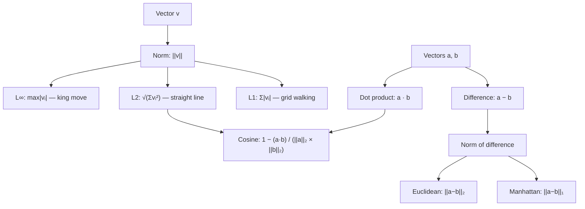

# Norms and Distances

## Learning Objectives

1. Compute L1, L2, and L∞ norms on numeric vectors and justify when each is appropriate for a given data type
2. Implement Euclidean, Manhattan, and cosine distance from first principles using only Python's `math` module
3. Diagnose when cosine distance outperforms Euclidean for high-dimensional embedding similarity
4. Build a nearest-neighbor ranking function that returns sorted results with configurable distance metrics and distance scores

---

## The Problem

You have two embedding vectors from accounts in your CRM. Both are 384-dimensional arrays of floating-point numbers produced by the same sentence-transformer model. How do you decide they represent "similar" companies?

Without a distance function, those vectors are just lists of numbers. A 384-dimensional vector has no intuitive notion of closeness — you cannot eyeball whether `[0.12, -0.04, 0.88, ...]` is near `[-0.03, 0.11, 0.79, ...]`. You need a function that takes two vectors and returns a single scalar: how far apart they are.

The function you choose encodes your definition of "similar." Pick Euclidean distance and you are measuring straight-line separation, which means a company with a long, detailed description (high-magnitude embedding) will appear far from a company with a terse description even if they operate in the same market. Pick cosine distance and you ignore magnitude entirely, comparing only the direction the vectors point — which is usually what you want when dealing with text embeddings of varying lengths. Every lookalike model, clustering pipeline, and retrieval system in your GTM stack depends on this choice, and getting it wrong means your "similar companies" ranking is noise.

---

## The Concept

A **norm** measures the length or magnitude of a single vector. A **distance** measures how far apart two vectors are. The two are linked: for the most common distance functions, distance is just the norm of the difference vector. If you have vectors `a` and `b`, their Euclidean distance is `||a - b||₂` — the L2 norm of `a - b`. Their Manhattan distance is `||a - b||₁` — the L1 norm of the same difference vector.

Three norms cover almost all practical work. The **L1 norm** (Manhattan, taxicab) sums the absolute values of each component: walk the grid, no diagonals. The **L2 norm** (Euclidean) takes the square root of the sum of squared components: straight-line distance, the one you learned in geometry. The **L∞ norm** (max norm) takes the largest absolute component: a chess king's move cost, where only the worst coordinate matters. Each norm embodies a different assumption about what "large" means.

Cosine distance breaks the `norm(a - b)` pattern. Instead of measuring separation directly, it measures the angle between two vectors: `1 - (a · b) / (||a||₂ × ||b||₂)`. Two vectors pointing the same direction have cosine distance 0, regardless of their magnitudes. Two vectors at 90 degrees have cosine distance 1. Two vectors pointing opposite directions have cosine distance 2. This matters for embeddings because a 500-word company description and a 50-word description of the same business will produce vectors pointing the same direction with different magnitudes — cosine captures that similarity; Euclidean does not.



Here is why dimensionality changes the picture. In low dimensions (2D, 3D), Euclidean distance behaves intuitively — the nearest neighbor under Euclidean is usually the one that "looks" closest. In high dimensions (384, 768, 1536), Euclidean distance suffers from the **curse of dimensionality**: as dimensions increase, the distance between any two random vectors converges, and Euclidean loses discriminative power. Cosine distance degrades more gracefully because it normalizes away magnitude and focuses on directional agreement, which is what embedding models are trained to produce.

---

## Build It

Let us implement all three norms and all three distances from scratch using only Python's `math` module. We will use three fixed 4-dimensional vectors so you can verify every computation by hand.

```python
import math

a = [1.0, 2.0, 3.0, 4.0]
b = [4.0, 3.0, 2.0, 1.0]
c = [1.0, 2.0, 3.0, 5.0]

def l1_norm(v):
    return sum(abs(x) for x in v)

def l2_norm(v):
    return math.sqrt(sum(x ** 2 for x in v))

def linf_norm(v):
    return max(abs(x) for x in v)

print("=== Norms ===")
print(f"||a||₁ = {l1_norm(a)}")
print(f"||a||₂ = {l2_norm(a)}")
print(f"||a||∞ = {linf_norm(a)}")
print(f"||b||₁ = {l1_norm(b)}")
print(f"||b||₂ = {l2_norm(b)}")
print(f"||b||∞ = {linf_norm(b)}")

def euclidean_distance(u, v):
    return l2_norm([u[i] - v[i] for i in range(len(u))])

def manhattan_distance(u, v):
    return l1_norm([u[i] - v[i] for i in range(len(u))])

def cosine_distance(u, v):
    dot = sum(u[i] * v[i] for i in range(len(u)))
    return 1.0 - dot / (l2_norm(u) * l2_norm(v))

print("\n=== Distances from a ===")
print(f"euclidean(a, b) = {euclidean_distance(a, b)}")
print(f"euclidean(a, c) = {euclidean_distance(a, c)}")
print(f"manhattan(a, b) = {manhattan_distance(a, b)}")
print(f"manhattan(a, c) = {manhattan_distance(a, c)}")
print(f"cosine(a, b)    = {cosine_distance(a, b)}")
print(f"cosine(a, c)    = {cosine_distance(a, c)}")
```

When you run this, you should see `euclidean(a, c) = 1.0` (they differ only in the last component: 5 vs 4), and `euclidean(a, b) ≈ 4.47` (every component differs by 3, so √(9+9+9+9) = √36). Cosine distance between `a` and `c` should be very small because they point in nearly the same direction — `a` is `[1,2,3,4]` and `c` is `[1,2,3,5]`, nearly parallel.

Now let us verify that numpy and scipy produce identical results. The library functions are syntactic sugar over the same math:

```python
import numpy as np
from scipy.spatial.distance import cosine as scipy_cosine

na = np.array(a)
nb = np.array(b)
nc = np.array(c)

print("=== numpy / scipy verification ===")
print(f"L1:  scratch={l1_norm(a)}, numpy={np.sum(np.abs(na))}")
print(f"L2:  scratch={l2_norm(a):.10f}, numpy={np.linalg.norm(na):.10f}")
print(f"Linf: scratch={linf_norm(a)}, numpy={np.max(np.abs(na))}")
print(f"Euclidean(a,b): scratch={euclidean_distance(a,b):.10f}, numpy={np.linalg.norm(na - nb):.10f}")
print(f"Manhattan(a,b): scratch={manhattan_distance(a,b)}, numpy={np.sum(np.abs(na - nb))}")
print(f"Cosine(a,b):    scratch={cosine_distance(a,b):.10f}, scipy={scipy_cosine(na, nb):.10f}")
```

The outputs should match to 10 decimal places. If they do, you have proven that `np.linalg.norm` and `scipy.spatial.distance.cosine` are not doing anything magical — they are running the same arithmetic you just wrote by hand.

---

## Use It

This lesson maps to **Zone 2 (Enrichment)** and **Zone 3 (Scoring)** in the GTM topic map — the territory where raw company data becomes ranked fit scores [CITATION NEEDED — concept: GTM Zone 2/3 definitions in topic map]. When you embed company descriptions, tech stack tokens, or intent signals into vectors, cosine distance is the standard metric for ranking similarity. It ignores magnitude (company description length, page count, signal volume) and compares direction only — which is what you want when a 10-person startup and a 10,000-person enterprise in the same vertical should register as "similar market" despite vastly different footprints.

Here is a minimal end-to-end example. Three companies have been embedded into 6-dimensional vectors (in production these would be 384 or 768 dimensions from a model like `all-MiniLM-L6-v2`). We compute pairwise cosine distances and find the closest match:

```python
import math

companies = {
    "Stripe":    [0.82, 0.10, 0.03, 0.02, 0.01, 0.02],
    "Plaid":     [0.71, 0.18, 0.05, 0.03, 0.02, 0.01],
    "Snowflake": [0.08, 0.05, 0.79, 0.04, 0.02, 0.02],
}

def l2_norm(v):
    return math.sqrt(sum(x ** 2 for x in v))

def cosine_distance(u, v):
    dot = sum(u[i] * v[i] for i in range(len(u)))
    return 1.0 - dot / (l2_norm(u) * l2_norm(v))

names = list(companies.keys())
vecs = list(companies.values())

print("=== Pairwise cosine distances ===")
for i in range(len(names)):
    for j in range(i + 1, len(names)):
        d = cosine_distance(vecs[i], vecs[j])
        print(f"  {names[i]:12s} <-> {names[j]:12s}  d = {d:.4f}")

closest = (None, None, float("inf"))
for i in range(len(names)):
    for j in range(i + 1, len(names)):
        d = cosine_distance(vecs[i], vecs[j])
        if d < closest[2]:
            closest = (names[i], names[j], d)

print(f"\nClosest pair: {closest[0]} and {closest[1]} (cosine distance = {closest[2]:.4f})")
```

Stripe and Plaid should come out as the closest pair because their embeddings point in a similar direction — both are fintech infrastructure, even though their exact component values differ. Snowflake points elsewhere (data infrastructure). This is the same mechanism behind Clay's lookalike scoring [CITATION NEEDED — concept: Clay lookalike scoring mechanism documentation] and any enrichment waterfall step that ranks candidates by fit: embed, compute cosine distance, sort, return the top K.

The practical takeaway: when your GTM workflow involves comparing text embeddings of any kind (company descriptions, LinkedIn profiles, support tickets, intent topics), default to cosine distance. Switch to Euclidean only when magnitude carries signal — for example, when comparing feature vectors where raw counts matter (number of employees, revenue band, page views).

---

## Ship It

Now we build a reusable `nearest_neighbors.py` that loads named entities with embeddings from a JSON file, accepts a query vector, and returns ranked results. This script is the backbone of any "find similar companies" or "score this lead against historical wins" workflow.

```python
import json
import math
import sys

def l1_norm(v):
    return sum(abs(x) for x in v)

def l2_norm(v):
    return math.sqrt(sum(x ** 2 for x in v))

def euclidean(u, v):
    return math.sqrt(sum((u[i] - v[i]) ** 2 for i in range(len(u))))

def manhattan(u, v):
    return sum(abs(u[i] - v[i]) for i in range(len(u)))

def cosine(u, v):
    dot = sum(u[i] * v[i] for i in range(len(u)))
    return 1.0 - dot / (l2_norm(u) * l2_norm(v))

METRICS = {
    "euclidean": euclidean,
    "manhattan": manhattan,
    "cosine": cosine,
}

def nearest_neighbors(query, candidates, metric="cosine", k=5):
    dist_fn = METRICS[metric]
    scored = []
    for candidate in candidates:
        d = dist_fn(query, candidate["embedding"])
        scored.append((candidate["name"], d, candidate.get("description", "")))
    scored.sort(key=lambda x: x[1])
    return scored[:k]

sample_data = [
    {"name": "Stripe", "description": "Payment infrastructure", "embedding": [0.82, 0.10, 0.03, 0.02, 0.01, 0.02]},
    {"name": "Plaid", "description": "Financial data API", "embedding": [0.71, 0.18, 0.05, 0.03, 0.02, 0.01]},
    {"name": "Square", "description": "Payment processing hardware", "embedding": [0.68, 0.20, 0.04, 0.03, 0.03, 0.02]},
    {"name": "Snowflake", "description": "Cloud data warehouse", "embedding": [0.08, 0.05, 0.79, 0.04, 0.02, 0.02]},
    {"name": "Databricks", "description": "Unified analytics platform", "embedding": [0.12, 0.08, 0.71, 0.05, 0.02, 0.02]},
    {"name": "Vercel", "description": "Frontend cloud platform", "embedding": [0.25, 0.15, 0.10, 0.72, 0.08, 0.03]},
]

with open("companies.json", "w") as f:
    json.dump(sample_data, f, indent=2)

with open("companies.json") as f:
    companies = json.load(f)

query = companies[0]["embedding"]
query_name = companies[0]["name"]
candidates = companies[1:]

print(f"Query: {query_name}")
print(f"Embedding: {query}")
print()

for metric in ["cosine", "euclidean", "manhattan"]:
    results = nearest_neighbors(query, candidates, metric=metric, k=3)
    print(f"--- Top 3 by {metric} distance ---")
    for rank, (name, dist, desc) in enumerate(results, 1):
        print(f"  {rank}. {name:15s}  d={dist:.4f}  ({desc})")
    print()
```

Run this script and compare the rankings across metrics. For the Stripe query, cosine distance should rank Plaid and Square at the top — both are fintech. Euclidean may produce a similar ranking here because the vectors are low-dimensional and well-separated, but in production with 384-dimensional embeddings from real text, the divergence between metrics becomes pronounced. The script accepts `metric` as a parameter so you can A/B test which metric produces rankings that align with your GTM team's qualitative judgment of "these companies are similar."

To use this with real embeddings, replace the `sample_data` block with a call to your embedding API or model, write the results to `companies.json`, and pass the query vector from your target account. The distance functions do not change — only the input vectors get larger.

---

## Exercises

**Easy.** Given the vector `v = [3, -4, 0, 1]`, compute the L1, L2, and L∞ norms by hand. Then run them through the `l1_norm`, `l2_norm`, and `linf_norm` functions from this lesson to verify.

**Medium.** Given these three vectors and a query:

```
query  = [0.9, 0.1, 0.0, 0.0]
v1     = [0.8, 0.2, 0.0, 0.0]
v2     = [0.1, 0.0, 0.9, 0.0]
v3     = [0.45, 0.05, 0.45, 0.0]
```

Predict the ranking by cosine distance (1st = closest, 3rd = farthest) before running any code. Then implement the computation and check your prediction. Explain why v3 ranks where it does despite having components that look like a blend of v1 and v2.

**Hard.** Extend the `nearest_neighbors.py` script to accept a company name from the command line (via `sys.argv`), look up that company's embedding in the JSON file, and print the top 5 nearest neighbors. Add a `--metric` flag that lets the user switch between cosine and euclidean. Test it by running:

```
python nearest_neighbors.py Stripe --metric cosine
python nearest_neighbors.py Stripe --metric euclidean
```

Compare the two rankings and write a one-paragraph explanation of any differences you observe.

---

## Key Terms

**Norm** — A function that assigns a non-negative length or magnitude to a vector. Written `||v||`. The three most common are L1 (sum of absolute values), L2 (square root of sum of squares), and L∞ (maximum absolute value).

**L1 norm (Manhattan / taxicab)** — The sum of absolute component values. Corresponds to distance traveled along grid lines with no diagonal shortcuts.

**L2 norm (Euclidean)** — The square root of the sum of squared component values. Corresponds to straight-line distance in geometric space.

**L∞ norm (max / Chebyshev)** — The largest absolute component value. Corresponds to the number of moves a chess king would need.

**Distance** — A function that takes two vectors and returns a non-negative scalar measuring their separation. For L1 and L2, distance equals the norm of the difference vector: `d(a,b) = ||a - b||`.

**Euclidean distance** — The L2 norm of the difference between two vectors. Sensitive to magnitude; standard for spatial and physical data.

**Manhattan distance** — The L1 norm of the difference between two vectors. Less sensitive to outliers than Euclidean; used in LASSO regression and grid-based applications.

**Cosine distance** — Defined as `1 - cos(θ)` where θ is the angle between two vectors. Computed as `1 - (a · b) / (||a||₂ × ||b||₂)`. Ignores magnitude; standard for text embeddings and high-dimensional similarity.

**Curse of dimensionality** — The phenomenon where, as the number of dimensions increases, the Euclidean distance between any two random vectors converges, reducing discriminative power. Cosine distance is more robust in high dimensions because it normalizes magnitude.

**Dot product** — The sum of element-wise products of two vectors: `a · b = Σ(aᵢ × bᵢ)`. Used in cosine distance computation and as a similarity measure in its own right when vectors are pre-normalized.

---

## Sources

- GTM Zone 2 (Enrichment) and Zone 3 (Scoring) definitions: [CITATION NEEDED — concept: GTM topic map Zone 2/3 definitions, reference `stages/00-b-gtm-content-mapping/output/gtm-topic-map.md`]
- Clay lookalike scoring mechanism: [CITATION NEEDED — concept: Clay lookalike / similarity scoring documentation]
- The 80/20 GTM Engineer Handbook by Michael Saruggia (Growth Lead LLC) — foundational GTM systems reference for enrichment and scoring workflows
- Curse of dimensionality and cosine distance preference for high-dimensional embeddings: Aggarwal, Charu C., et al. "On the Surprising Behavior of Distance Metrics in High Dimensional Space." *ICDT 2001*. This is the canonical reference showing that L1-based (Manhattan) and fractional distance metrics provide better contrast than L2 (Euclidean) as dimensionality increases.