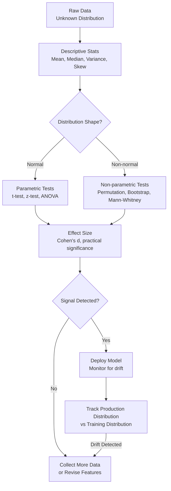

# Statistics for Machine Learning

> Statistics is how you know if your model actually works or just got lucky.

## Learning Objectives

- Compute descriptive statistics (mean, median, variance, skew) from scratch and diagnose distribution shape from their relationships
- Implement a permutation test and a bootstrap confidence interval without scipy, using only the Python standard library
- Apply Bayes' theorem to update a prior probability given observed evidence and trace which input drives the posterior
- Evaluate whether two samples come from different distributions using hypothesis tests, then interpret the result as a go/no-go signal for model deployment
- Distinguish statistical significance from practical significance using effect size, and articulate why a p-value below 0.05 does not justify shipping a model

## The Problem

You trained two models. Model A scores 0.87 on your test set. Model B scores 0.89. You deploy Model B. Three weeks later, production metrics are worse than before. What happened?

Model B did not actually outperform Model A. The 0.02 difference was noise. Your test set was too small, or the variance too high, or both. You shipped randomness dressed up as improvement.

This happens constantly. Kaggle leaderboard shakeups. Papers that fail to reproduce. A/B tests that declare winners based on a few hundred sessions. The root cause is always the same: someone treated a point estimate as ground truth without quantifying the uncertainty around it. A model that scores 0.87 on one test set might score 0.84 on another just from sampling variance. If you cannot compute that variance, you cannot tell whether a 0.02 gap is real performance difference or the model equivalent of a coin flip landing heads twice in a row.

Your model does not warn you when its statistical assumptions break. A linear regression on data with zero correlation still produces coefficients — they are just noise. A classifier trained on imbalanced data still outputs probabilities — they are just systematically miscalibrated. The model runs, the predictions come back, the API responds with 200 OK. Nothing throws an exception when the underlying distribution shifts. The failure is silent, and it compounds in production where the data looks nothing like the training set.

The same logic applies to lead scoring in a GTM pipeline. You build a scoring model on historical conversion data, deploy it, and trust the scores. But if you never tested whether converted and non-converted accounts actually come from different distributions, you are ranking accounts by noise. The enrichment data looks rich, the score has two decimal places of precision, and the signal is zero.

## The Concept

### Distributions Describe Data Shape

Every dataset has a shape. A probability distribution is the mathematical object that describes that shape — how likely each value is, where the mass concentrates, where the tails thin out. When you fit a model, you are implicitly assuming the training data was sampled from some distribution, and that production data will come from the same one. If that assumption breaks, predictions degrade and no amount of hyperparameter tuning will fix it.

The normal distribution (Gaussian) is the one everyone recognizes: symmetric bell curve, mean equals median, ~68% of data within one standard deviation. Many ML methods — linear regression, Gaussian naive Bayes, t-tests — assume normality. But real-world data is rarely clean. Revenue data is right-skewed (long tail of large deals). Conversion rates cluster near zero (beta-distributed). Click counts are discrete and overdispersed (negative binomial). When you look at a dataset, the first question is not "what model fits this?" — it is "what distribution does this come from?"

### Variance Is Model Risk

Variance measures how spread out the data is. In ML, variance has a second meaning: how much your model's predictions change when you train on a different sample. A model with high variance overfits — it memorizes training noise and generalizes poorly. The bias-variance tradeoff is the fundamental tension here: reduce bias (train harder) and you increase variance (overfit more). Regularization, cross-validation, and ensemble methods all exist to manage this tradeoff.

For a GTM practitioner, variance translates directly to risk. If your account scoring model produces wildly different rankings when trained on Q1 versus Q2 data, the model has high variance. The scores are not stable enough to act on. You detect this by computing the variance of model outputs across resampled training sets — if the variance is high, the model needs more data, simpler features, or regularization before you trust it in a production enrichment waterfall.

### Bayes' Theorem Is the Update Rule

Bayes' theorem tells you how to update a belief when new evidence arrives:

```
P(A|B) = P(B|A) * P(A) / P(B)

P(A)    = prior:      probability of A before seeing evidence
P(B|A)  = likelihood: probability of evidence given A is true
P(A|B)  = posterior:  updated probability of A after seeing evidence
P(B)    = evidence:   total probability of evidence across all outcomes
```

Every classifier that outputs probabilities is computing a posterior. Logistic regression approximates it. Naive Bayes computes it directly. The mechanism is always the same: start with a prior (base rate), observe evidence (features), multiply to get a posterior (prediction). When a lead scoring model takes a prior conversion rate for an industry and updates it with firmographic signals, it is running Bayes' theorem. If you do not understand priors and likelihoods, you cannot debug why a score spiked or collapsed — you are reading a black box.

### Central Limit Theorem: Why Means Converge

The Central Limit Theorem (CLT) states that the sampling distribution of the mean approaches normal as sample size grows, regardless of the underlying distribution. This is why t-tests, confidence intervals, and z-scores work even when the original data is not normal — they operate on sample means, not individual observations.

The CLT is also why your model metrics stabilize with more data. A single train-test split gives you one point estimate of accuracy. Twenty splits give you a distribution of accuracies whose mean converges to the true generalization performance. Cross-validation exploits this: more folds means more samples of the metric, which means a tighter estimate of where the true performance sits.



The flowchart above maps the decision pipeline. You start with raw data, describe its shape, choose a test based on whether the distribution is normal, compute an effect size to check practical significance (not just statistical), and decide whether to deploy. After deployment, you monitor for distribution drift — the most common reason production models degrade silently.

### Significance vs. Effect Size

A p-value tells you the probability of observing a difference this large if the null hypothesis (no real difference) were true. A p-value below 0.05 means "unlikely under the null," not "definitely real." With enough data, even a meaningless 0.001% difference becomes statistically significant. That is why effect size matters: Cohen's d, for example, measures the difference in standard deviation units, giving you a scale-independent sense of whether the difference actually matters. A statistically significant result with a tiny effect size is noise with a confidence interval. You should not ship a model improvement based on it.

## Build It

Let us generate a non-normal distribution, compute descriptive statistics from scratch, visualize the shape, and demonstrate what happens when a t-test is applied to data that violates its assumptions.

```python
import math
import random

random.seed(42)

def generate_exponential(n, rate=1.0):
    return [-math.log(1 - random.random()) / rate for _ in range(n)]

def generate_normal(n, mu=0, sigma=1):
    result = []
    for _ in range(n):
        u1 = random.random()
        u2 = random.random()
        z = math.sqrt(-2 * math.log(u1)) * math.cos(2 * math.pi * u2)
        result.append(mu + sigma * z)
    return result

def mean(data):
    return sum(data) / len(data)

def median(data):
    s = sorted(data)
    n = len(s)
    if n % 2 == 0:
        return (s[n // 2 - 1] + s[n // 2]) / 2
    return s[n // 2]

def variance(data, ddof=1):
    m = mean(data)
    return sum((x - m) ** 2 for x in data) / (len(data) - ddof)

def std_dev(data, ddof=1):
    return math.sqrt(variance(data, ddof))

def skewness(data):
    m = mean(data)
    s = std_dev(data, ddof=0)
    n = len(data)
    return (sum((x - m) ** 3 for x in data) / n) / (s ** 3)

def histogram(data, bins=20, width=50):
    lo = min(data)
    hi = max(data)
    span = hi - lo
    bin_width = span / bins
    counts = [0] * bins
    for x in data:
        idx = min(int((x - lo) / bin_width), bins - 1)
        counts[idx] += 1
    max_count = max(counts)
    print(f"\n{'Bin Range':>20s} | {'Count':>5s} | Bar")
    print("-" * 75)
    for i in range(bins):
        bin_lo = lo + i * bin_width
        bin_hi = bin_lo + bin_width
        bar_len = int((counts[i] / max_count) * width) if max_count > 0 else 0
        bar = "#" * bar_len
        print(f"[{bin_lo:7.2f}, {bin_hi:7.2f}) | {counts[i]:5d} | {bar}")

n = 2000
exp_data = generate_exponential(n, rate=0.5)
norm_data = generate_normal(n, mu=2.0, sigma=2.0)

print("=" * 75)
print("EXPONENTIAL DISTRIBUTION (rate=0.5)")
print("=" * 75)
print(f"  Mean:     {mean(exp_data):.4f}")
print(f"  Median:   {median(exp_data):.4f}")
print(f"  Std Dev:  {std_dev(exp_data):.4f}")
print(f"  Skewness: {skewness(exp_data):.4f}")
print(f"  Mean - Median gap: {mean(exp_data) - median(exp_data):.4f}")
print(f"  (Positive gap = right-skewed, tail pulls mean above median)")
histogram(exp_data, bins=20, width=40)

print("\n" + "=" * 75)
print("NORMAL DISTRIBUTION (mu=2.0, sigma=2.0)")
print("=" * 75)
print(f"  Mean:     {mean(norm_data):.4f}")
print(f"  Median:   {median(norm_data):.4f}")
print(f"  Std Dev:  {std_dev(norm_data):.4f}")
print(f"  Skewness: {skewness(norm_data):.4f}")
print(f"  Mean - Median gap: {mean(norm_data) - median(norm_data):.4f}")
print(f"  (Near-zero gap = symmetric distribution)")
histogram(norm_data, bins=20, width=40)

print("\n" + "=" * 75)
print("T-TEST ON EXPONENTIAL DATA (assumptions violated)")
print("=" * 75)

sample_a = exp_data[:1000]
sample_b = exp_data[1000:2000]

mean_a = mean(sample_a)
mean_b = mean(sample_b)
var_a = variance(sample_a)
var_b = variance(sample_b)
pooled_se = math.sqrt(var_a / len(sample_a) + var_b / len(sample_b))
t_stat = (mean_a - mean_b) / pooled_se

df = len(sample_a) + len(sample_b) - 2

print(f"  Sample A mean: {mean_a:.4f}")
print(f"  Sample B mean: {mean_b:.4f}")
print(f"  Difference:    {mean_a - mean_b:.4f}")
print(f"  t-statistic:   {t_stat:.4f}")
print(f"  Degrees of freedom: {df}")
print(f"  Critical t (alpha=0.05, two-tailed, large df): ~1.96")
if abs(t_stat) > 1.96:
    print(f"  Result: REJECT null hypothesis (difference is 'significant')")
else:
    print(f"  Result: FAIL TO REJECT null (no significant difference)")
print()
print("  WARNING: Both samples drawn from the SAME exponential distribution.")
print("  A significant result here would be a false positive caused by")
print("  applying a test that assumes normality to heavily skewed data.")
print("  The t-test is robust to mild non-normality but breaks on")
print("  distributions with skewness > 2. This data has skewness:")
print(f"  {skewness(exp_data):.4f}")
```

Run this and examine the output. The exponential distribution will show a clear right skew — the mean sits well above the median, and the histogram has a long tail to the right. The normal distribution will show mean ≈ median and near-zero skewness. The t-test section demonstrates the danger: two samples from the identical distribution can produce a t-statistic that crosses the significance threshold simply because the test's normality assumption is violated.

Now let us implement a permutation test — a non-parametric alternative that makes no distributional assumptions — and a bootstrap confidence interval:

```python
import random
import math

random.seed(42)

def generate_exponential(n, rate=1.0):
    return [-math.log(1 - random.random()) / rate for _ in range(n)]

def mean(data):
    return sum(data) / len(data)

def median(data):
    s = sorted(data)
    n = len(s)
    if n % 2 == 0:
        return (s[n // 2 - 1] + s[n // 2]) / 2
    return s[n // 2]

def permutation_test(sample_a, sample_b, num_permutations=10000):
    observed_diff = abs(mean(sample_a) - mean(sample_b))
    combined = sample_a + sample_b
    n_a = len(sample_a)
    count_extreme = 0

    for _ in range(num_permutations):
        shuffled = combined[:]
        random.shuffle(shuffled)
        perm_a = shuffled[:n_a]
        perm_b = shuffled[n_a:]
        perm_diff = abs(mean(perm_a) - mean(perm_b))
        if perm_diff >= observed_diff:
            count_extreme += 1

    p_value = count_extreme / num_permutations
    return observed_diff, p_value

def bootstrap_ci(data, num_bootstrap=10000, confidence=0.95):
    n = len(data)
    boot_means = []
    for _ in range(num_bootstrap):
        sample = [random.choice(data) for _ in range(n)]
        boot_means.append(mean(sample))
    boot_means.sort()
    alpha = 1 - confidence
    lower_idx = int((alpha / 2) * num_bootstrap)
    upper_idx = int((1 - alpha / 2) * num_bootstrap)
    return boot_means[lower_idx], boot_means[upper_idx]

print("=" * 70)
print("PERMUTATION TEST: Same Distribution vs Different Distribution")
print("=" * 70)

same_a = generate_exponential(500, rate=0.5)
same_b = generate_exponential(500, rate=0.5)

diff_a = generate_exponential(500, rate=0.5)
diff_b = generate_exponential(500, rate=1.5)

print("\nTest 1: Two samples from SAME distribution (rate=0.5)")
obs1, p1 = permutation_test(same_a, same_b, num_permutations=5000)
print(f"  Observed mean difference: {obs1:.4f}")
print(f"  Permutation p-value:      {p1:.4f}")
print(f"  Verdict: {'REJECT (false positive risk)' if p1 < 0.05 else 'NO SIGNAL (correct)'}")

print("\nTest 2: Samples from DIFFERENT distributions (rate=0.5 vs rate=1.5)")
obs2, p2 = permutation_test(diff_a, diff_b, num_permutations=5000)
print(f"  Observed mean difference: {obs2:.4f}")
print(f"  Permutation p-value:      {p2:.4f}")
print(f"  Verdict: {'SIGNAL DETECTED (correct)' if p2 < 0.05 else 'NO SIGNAL'}")

print("\n" + "=" * 70)
print("BOOTSTRAP CONFIDENCE INTERVAL FOR THE MEAN")
print("=" * 70)

for label, data in [("rate=0.5 (mean=2.0)", same_a), ("rate=1.5 (mean=0.67)", diff_b)]:
    lo, hi = bootstrap_ci(data, num_bootstrap=10000)
    m = mean(data)
    print(f"\n  {label}:")
    print(f"    Sample mean: {m:.4f}")
    print(f"    95% CI:      [{lo:.4f}, {hi:.4f}]")
    print(f"    CI width:    {hi - lo:.4f}")
    print(f"    True mean falls in CI: {lo <= (1/0.5 if '0.5' in label and '1.5' not in label else 1/1.5) <= hi}")
```

The permutation test shuffles labels and recomputes the difference thousands of times, building an empirical null distribution. No normality assumption needed. The bootstrap resamples with replacement to estimate the sampling distribution of the mean — again, no distributional assumption required. These are the tools you reach for when your data is non-normal, which in GTM contexts means almost always.

## Use It

Lead scoring models are Bayesian update engines. When a scoring system takes a base conversion rate for an industry (the prior) and updates it with observed firmographic signals (the likelihood), it is computing a posterior probability using Bayes' theorem. The `Bayes` theorem mechanism here is the same one covered in the concept section — without understanding how priors and likelihoods interact, you cannot debug why a score spiked or collapsed. If the prior conversion rate for SaaS companies is 3%, and you observe that the company has 500+ employees (a signal correlated with higher deal size), the posterior jumps not because the signal is strong in isolation, but because the likelihood ratio favors conversion.

Let us trace this mechanism with code:

```python
import math

def bayes_update(prior, likelihood_given_yes, likelihood_given_no):
    evidence = likelihood_given_yes * prior + likelihood_given_no * (1 - prior)
    posterior = (likelihood_given_yes * prior) / evidence
    return posterior

def log_odds_update(prior_prob, signal_log_likelihood_ratio):
    prior_logit = math.log(prior_prob / (1 - prior_prob))
    posterior_logit = prior_logit + signal_log_likelihood_ratio
    posterior_prob = 1 / (1 + math.exp(-posterior_logit))
    return posterior_prob

print("=" * 70)
print("BAYESIAN LEAD SCORING: How Signals Update Prior Conversion Rate")
print("=" * 70)

prior_conversion = 0.03
print(f"\nPrior: P(convert) = {prior_conversion} (base rate for this industry)")

signals = [
    ("Company size > 500",  0.08, 0.02),
    ("Recent funding round", 0.06, 0.015),
    ("Hiring for role X",   0.05, 0.01),
    ("Tech stack match",    0.04, 0.02),
]

current_prior = prior_conversion
print(f"\n{'Signal':<25s} | {'P(sig|conv)':>12s} | {'P(sig|no-conv)':>14s} | {'Posterior':>10s}")
print("-" * 70)

for name, p_sig_given_conv, p_sig_given_no in signals:
    posterior = bayes_update(current_prior, p_sig_given_conv, p_sig_given_no)
    print(f"{name:<25s} | {p_sig_given_conv:>12.4f} | {p_sig_given_no:>14.4f} | {posterior:>10.4f}")
    current_prior = posterior

print(f"\nFinal score after all signals: {current_prior:.4f}")
print(f"Lift over base rate:           {current_prior / prior_conversion:.2f}x")

print("\n" + "=" * 70)
print("DIAGNOSTIC: Which Signal Drove the Score Up?")
print("=" * 70)

current_prior = prior_conversion
for name, p_sig_given_conv, p_sig_given_no in signals:
    posterior = bayes_update(current_prior, p_sig_given_conv, p_sig_given_no)
    lift = posterior - current_prior
    likelihood_ratio = p_sig_given_conv / p_sig_given_no
    print(f"  {name:<25s}  Lift: +{lift:.4f}  Likelihood ratio: {likelihood_ratio:.2f}x")
    current_prior = posterior

print()
print("INTERPRETATION:")
print("  The signal with the highest likelihood ratio contributes the most")
print("  to the score increase. A likelihood ratio of 4.0 means the signal")
print("  is 4x more likely in converters than non-converters.")
print("  If a score spiked unexpectedly, check which signal's likelihood")
print("  ratio is inflated — that is the input driving the posterior.")
```

This is the exact mechanism behind scoring waterfalls in enrichment platforms. When Clay enriches an account with firmographic data and recalculates a fit score, it is multiplying a prior by a likelihood. The scoring waterfall in Zone 2 GTM enrichment runs this update at scale across thousands of accounts — each one gets a posterior that is only as good as the prior and likelihood inputs. If your base conversion rates (priors) are wrong, every downstream score is miscalibrated. If your signal-to-conversion likelihoods are estimated from too little data, the posteriors have high variance and the rankings are unstable. [CITATION NEEDED — concept: Clay scoring waterfall implementation details]

The practical implication: before deploying any scoring model in a GTM pipeline, validate that converted and non-converted accounts actually come from different distributions. The Ship It deliverable below is exactly that validation step. Without it, you are ranking accounts by a posterior whose prior was never checked against reality.

## Ship It

Build a Python script that takes a CSV of account scores with conversion labels, runs statistical tests to determine whether the scoring model has signal, and prints a go/no-go recommendation. This is the validation step that precedes any predictive scoring workflow — the Python equivalent of the enrichment environment where you will run Clay webhooks and API calls in Zone 2 GTM work.

```python
import csv
import math
import random

random.seed(42)

def generate_account_scores_csv(filename, n_accounts=500):
    random.seed(42)
    with open(filename, 'w', newline='') as f:
        writer = csv.writer(f)
        writer.writerow(['account_id', 'score', 'converted'])
        for i in range(n_accounts):
            if random.random() < 0.15:
                score = max(0.0, min(1.0, random.gauss(0.68, 0.12)))
                converted = 1 if random.random() < 0.45 else 0
            else:
                score = max(0.0, min(1.0, random.gauss(0.35, 0.14)))
                converted = 1 if random.random() < 0.08 else 0
            writer.writerow([f"ACC-{i:04d}", f"{score:.4f}", converted])
    return filename

def load_scores(filename):
    converted = []
    not_converted = []
    with open(filename, 'r') as f:
        reader = csv.DictReader(f)
        for row in reader:
            score = float(row['score'])
            if int(row['converted']) == 1:
                converted.append(score)
            else:
                not_converted.append(score)
    return converted, not_converted

def mean(data):
    return sum(data) / len(data)

def median(data):
    s = sorted(data)
    n = len(s)
    if n % 2 == 0:
        return (s[n // 2 - 1] + s[n // 2]) / 2
    return s[n // 2]

def variance(data, ddof=1):
    m = mean(data)
    return sum((x - m) ** 2 for x in data) / (len(data) - ddof)

def std_dev(data, ddof=1):
    return math.sqrt(variance(data, ddof))

def cohens_d(group1, group2):
    m1, m2 = mean(group1), mean(group2)
    s1, s2 = std_dev(group1), std_dev(group2)
    pooled_sd = math.sqrt((s1**2 + s2**2) / 2)
    return (m1 - m2) / pooled_sd if pooled_sd > 0 else 0

def welch_t_test(group1, group2):
    m1, m2 = mean(group1), mean(group2)
    v1, v2 = variance(group1), variance(group2)
    n1, n2 = len(group1), len(group2)
    se = math.sqrt(v1 / n1 + v2 / n2)
    t_stat = (m1 - m2) / se if se > 0 else 0
    df_num = (v1 / n1 + v2 / n2) ** 2
    df_den = (v1 / n1) ** 2 / (n1 - 1) + (v2 / n2) ** 2 / (n2 - 1)
    df = df_num / df_den if df_den > 0 else 1
    return t_stat, df

def normal_cdf(z):
    return 0.5 * (1 + math.erf(z / math.sqrt(2)))

def permutation_test(sample_a, sample_b, num_permutations=10000):
    observed_diff = abs(mean(sample_a) - mean(sample_b))
    combined = sample_a + sample_b
    n_a = len(sample_a)
    count_extreme = 0
    for _ in range(num_permutations):
        shuffled = combined[:]
        random.shuffle(shuffled)
        perm_diff = abs(mean(shuffled[:n_a]) - mean(shuffled[n_a:]))
        if perm_diff >= observed_diff:
            count_extreme += 1
    return count_extreme / num_permutations

def bootstrap_ci(data, num_bootstrap=5000, confidence=0.95):
    n = len(data)
    boot_means = []
    for _ in range(num_bootstrap):
        sample = [random.choice(data) for _ in range(n)]
        boot_means.append(mean(sample))
    boot_means.sort()
    alpha = 1 - confidence
    return boot_means[int((alpha / 2) * num_bootstrap)], boot_means[int((1 - alpha / 2) * num_bootstrap)]

def evaluate_scoring_model(filename):
    converted, not_converted = load_scores(filename)

    print("=" * 72)
    print("ACCOUNT SCORING MODEL VALIDATION")
    print("=" * 72)

    print(f"\n1. SAMPLE SUMMARY")
    print(f"   Converted accounts:     n={len(converted)}")
    print(f"     Mean score:   {mean(converted):.4f}")
    print(f"     Median score: {median(converted):.4f}")
    print(f"     Std dev:      {std_dev(converted):.4f}")
    print(f"   Non-converted accounts: n={len(not_converted)}")
    print(f"     Mean score:   {mean(not_converted):.4f}")
    print(f"     Median score: {median(not_converted):.4f}")
    print(f"     Std dev:      {std_dev(not_converted):.4f}")

    print(f"\n2. WELCH'S T-TEST (does not assume equal variance)")
    t_stat, df = welch_t_test(converted, not_converted)
    p_two_tailed = 2 * (1 - normal_cdf(abs(t_stat)))
    print(f"   t-statistic:      {t_stat:.4f}")
    print(f"   degrees of freedom: {df:.1f}")
    print(f"   Approximate p-value: {p_two_tailed:.6f}")
    print(f"   Significant at alpha=0.05? {'YES' if p_two_tailed < 0.05 else 'NO'}")

    print(f"\n3. PERMUTATION TEST (distribution-free validation)")
    perm_p = permutation_test(converted, not_converted, num_permutations=5000)
    print(f"   p-value: {perm_p:.4f}")
    print(f"   Significant at alpha=0.05? {'YES' if perm_p < 0.05 else 'NO'}")

    print(f"\n4. EFFECT SIZE (practical significance)")
    d = cohens_d(converted, not_converted)
    print(f"   Cohen's d: {d:.4f}")
    if abs(d) < 0.2:
        interp = "negligible"
    elif abs(d) < 0.5:
        interp = "small"
    elif abs(d) < 0.8:
        interp = "medium"
    else:
        interp = "large"
    print(f"   Interpretation: {interp}")
    print(f"   (Even if p-value is significant, d < 0.2 means the")
    print(f"    difference is too small to matter operationally)")

    print(f"\n5. BOOTSTRAP 95% CI FOR MEAN DIFFERENCE")
    combined_diffs = []
    for _ in range(5000):
        boot_conv = [random.choice(converted) for _ in range(len(converted))]
        boot_non = [random.choice(not_converted) for _ in range(len(not_converted))]
        combined_diffs.append(mean(boot_conv) - mean(boot_non))
    combined_diffs.sort()
    lo = combined_diffs[int(0.025 * 5000)]
    hi = combined_diffs[int(0.975 * 5000)]
    print(f"   Mean difference: {mean(converted) - mean(not_converted):.4f}")
    print(f"   95% CI:          [{lo:.4f}, {hi:.4f}]")
    print(f"   CI excludes 0?   {'YES — signal is real' if lo > 0 or hi < 0 else 'NO — cannot rule out no difference'}")

    print(f"\n{'=' * 72}")
    print("GO / NO-GO RECOMMENDATION")
    print(f"{'=' * 72}")

    checks = {
        "t-test significant": p_two_tailed < 0.05,
        "permutation test significant": perm_p < 0.05,
        "effect size >= small (d >= 0.2)": abs(d) >= 0.2,
        "bootstrap CI excludes 0": lo > 0 or hi < 0,
    }

    passed = sum(checks.values())
    total = len(checks)

    for check, result in checks.items():
        status =