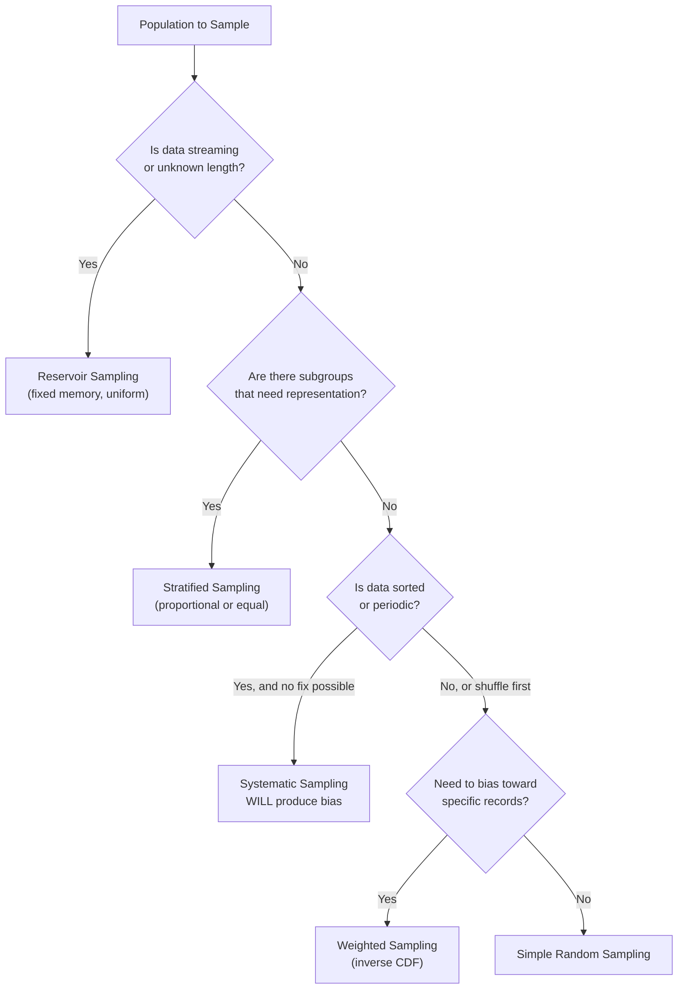

# Sampling Methods

## Learning Objectives

- Implement simple random, stratified, systematic, reservoir, and weighted sampling from scratch using only the Python standard library
- Compare proportional vs. equal allocation in stratified sampling and predict when each preserves or distorts subpopulation proportions
- Build temperature, top-k, and top-p sampling for language model token generation by modifying a probability distribution
- Detect accidental bias in a sample (convenience sampling from sorted data) and prescribe the corrective method
- Compute stratified sample sizes for a given population and state which allocation strategy suits ICP model training

## The Problem

You have 500K accounts in your CRM. Your enrichment API budget covers 50K lookups this month. Pick the wrong 50K and your ICP model trains on noise — it learns the patterns of whatever happened to be at the top of your export rather than the patterns of your actual market. This is the sampling problem, and most GTM teams solve it by exporting the first sheet they see and calling it representative.

Sampling shows up in a second place that most practitioners never connect to the first: language model generation. When an LLM finishes processing your prompt, it produces a vector of 50,000+ logits — one score per token in its vocabulary. It has to pick one. If it always picks the highest-scoring token, every response is identical and sterile. If it picks uniformly at random, the output is gibberish. The quality of the output depends on *how* you sample from that distribution, and the same algorithmic toolkit applies: temperature scaling is weighted sampling, top-k is a truncation filter, nucleus sampling is a cumulative probability threshold.

These two problems — selecting 50K accounts from 500K and selecting one token from 50K logits — are the same problem. You have a population, you cannot or should not process all of it, and you need the subset to preserve the properties you care about. The methods below work on both.

## The Concept

### The Five Core Methods

**Simple random sampling** gives every item in the population an equal probability of selection. You shuffle the population and pick *n* items. This is the baseline — it introduces no bias *if* the population is unordered and complete. It is also the method most likely to be silently wrong, because real CRM exports are almost never unordered or complete.

**Stratified sampling** divides the population into mutually exclusive groups (strata) based on a known attribute — revenue tier, geography, vertical — then samples within each stratum independently. The key decision is allocation: *proportional* allocation samples each stratum in proportion to its size (80% US accounts → 80% of your sample is US), while *equal* allocation gives each stratum the same sample size regardless of population share. Proportional preserves the population's shape. Equal ensures minority strata have enough representation for the model to learn from them. For ICP training, you almost always want equal allocation on revenue tier — you need enough enterprise examples to learn their patterns, even if they're 8% of your CRM.

**Systematic sampling** selects every *k*-th element after a random start. If you want 5,000 from 50,000, you pick a random offset between 0 and 9, then take every 10th record. It is fast, deterministic after the start, and catastrophically wrong if your data has periodic structure. A CRM sorted by creation date, where enterprise deals cluster at the end of each quarter, will produce a sample that systematically over- or under-represents enterprise depending on your interval.

**Reservoir sampling** solves a different problem: you have a stream of unknown length and a fixed memory budget. The algorithm maintains a "reservoir" of size *k*. For the first *k* items, you fill the reservoir. For each subsequent item *i* (where *i* > *k*), you generate a random integer *j* in [0, *i*]. If *j* < *k*, you replace reservoir[*j*] with item *i*. At the end, every item in the stream had exactly *k*/*N* probability of being in the reservoir, where *N* is the total stream length. This is what you want when consuming a real-time intent feed — you don't know how many signals will arrive, but you need a fixed-size buffer that's uniformly representative.

**Weighted sampling** assigns each item a selection probability proportional to a weight rather than treating all items equally. The mechanism is inverse CDF sampling: you normalize weights to probabilities, build a cumulative distribution, generate a uniform random number, and find the first item whose cumulative probability exceeds that number. Higher-weighted items occupy more of the [0, 1) interval and are therefore more likely to be selected. This is the foundation of temperature scaling in LLMs: temperature modifies the probability distribution before sampling, and the sampling itself is weighted selection over the modified distribution.

### Intentional vs. Accidental Bias

Stratified sampling introduces *intentional* bias — you deliberately over-sample minority strata to ensure model coverage. Weighted sampling introduces intentional bias toward high-value or high-uncertainty items. These are design choices with a clear purpose.

Accidental bias is the silent killer. The most common form is **convenience sampling**: you take the first 1,000 rows of a CSV export. If that export is sorted by account creation date, your sample contains only your oldest accounts. If it's sorted alphabetically by domain, your sample is biased toward companies whose names start with 'A'. The sample *looks* random because you didn't deliberately choose a biased method, but the population's ordering imposed a structure you never accounted for.

### How These Connect to LLM Sampling

Temperature, top-k, and top-p are not separate algorithms — they are transformations applied to a probability distribution *before* weighted sampling selects a token:

- **Temperature** divides each logit by a scalar before softmax. Temperature < 1 sharpens the distribution (high-probability tokens become even more likely). Temperature > 1 flattens it (low-probability tokens become more likely). Temperature = 0 collapses to argmax — always pick the top token.
- **Top-k** zeroes out all probabilities except the *k* highest, then renormalizes. This prevents the model from selecting extremely low-probability tokens that temperature might have inflated.
- **Top-p (nucleus)** keeps the smallest set of tokens whose cumulative probability exceeds *p*, zeroing out the rest. This adapts to the distribution shape — when the model is confident, the nucleus is small; when it's uncertain, the nucleus grows.



### Inverse CDF and Rejection Sampling (Foundations)

Two more methods sit underneath everything above. **Inverse CDF sampling** is the mechanism that powers weighted sampling, temperature sampling, and most random variate generation: given a cumulative distribution function *F*, you generate a uniform random number *u* in [0, 1) and return *F*⁻¹(*u*). The uniform random number picks a height on the CDF; the inverse maps that height back to a value. Items with steeper CDF regions (higher density) are selected more often.

**Rejection sampling** generates candidates from a proposal distribution and accepts each with probability proportional to the ratio of target density to proposal density at that point. It is simple, always correct, and potentially wasteful — if your proposal distribution is a poor match for the target, you reject most candidates. It matters here because it's the conceptual ancestor of top-k and top-p filtering: you define an acceptance region (the top tokens) and reject everything outside it.

## Build It

### Data Sampling: Random, Systematic, and Stratified

The following code generates a synthetic CRM population of 50,000 accounts with realistic distributional skew (65% SMB, 25% Mid-Market, 10% Enterprise; 80% US, 15% EMEA, 5% APAC). Each sampling function prints its input size, output size, and tier distribution so you can observe whether the method preserved the population's shape.

```python
import random
from collections import Counter

random.seed(42)

def generate_accounts(n):
    tiers = ['Enterprise', 'Mid-Market', 'SMB']
    tier_weights = [0.10, 0.25, 0.65]
    regions = ['US', 'EMEA', 'APAC']
    region_weights = [0.80, 0.15, 0.05]
    verticals = ['SaaS', 'Fintech', 'Healthcare', 'Manufacturing', 'Retail']
    accounts = []
    for i in range(n):
        accounts.append({
            'id': i,
            'domain': f'company-{i}.com',
            'tier': random.choices(tiers, weights=tier_weights)[0],
            'region': random.choices(regions, weights=region_weights)[0],
            'vertical': random.choice(verticals),
            'revenue': random.randint(100_000, 50_000_000),
        })
    return accounts

def show_dist(label, accounts):
    counts = Counter(a['tier'] for a in accounts)
    total = len(accounts)
    print(f"\n{label} (n={total})")
    for tier in ['Enterprise', 'Mid-Market', 'SMB']:
        c = counts.get(tier, 0)
        print(f"  {tier:15s} {c:6d}  ({c/total*100:5.1f}%)")

def simple_random_sample(population, n):
    return random.sample(population, n)

def systematic_sample(population, n):
    step = len(population) // n
    start = random.randint(0, step - 1)
    return population[start::step][:n]

def stratified_sample(population, n, key='tier', allocation='proportional'):
    strata = {}
    for item in population:
        strata.setdefault(item[key], []).append(item)
    if allocation == 'proportional':
        sizes = {s: round(n * len(v) / len(population)) for s, v in strata.items()}
    elif allocation == 'equal':
        per = n // len(strata)
        sizes = {s: per for s in strata}
    else:
        raise ValueError(allocation)
    sample = []
    for s, items in strata.items():
        sample.extend(random.sample(items, min(sizes[s], len(items))))
    return sample

pop = generate_accounts(50_000)
show_dist("Full Population", pop)

srs = simple_random_sample(pop, 5_000)
show_dist("Simple Random Sample", srs)

sys_sample = systematic_sample(pop, 5_000)
show_dist("Systematic Sample", sys_sample)

strat_prop = stratified_sample(pop, 5_000, 'tier', 'proportional')
show_dist("Stratified Proportional", strat_prop)

strat_equal = stratified_sample(pop, 5_000, 'tier', 'equal')
show_dist("Stratified Equal Allocation", strat_equal)
```

Running this produces output you can read at a glance. The simple random and systematic samples should closely match the population distribution (~10/25/65 across tiers). The proportional stratified sample will match by construction. The equal allocation sample will show ~33% per tier — deliberately distorting the distribution to give minority classes enough representation for model training.

### Reservoir Sampling on a Stream

This implementation processes 100,000 domain strings through a reservoir of size 100. The key property: the reservoir never exceeds *k* items in memory, regardless of stream length.

```python
import random
from collections import Counter

random.seed(42)

def reservoir_sample(stream, k):
    reservoir = []
    for i, item in enumerate(stream):
        if i < k:
            reservoir.append(item)
        else:
            j = random.randint(0, i)
            if j < k:
                reservoir[j] = item
    return reservoir

def generate_stream(n):
    regions = ['US'] * 80 + ['EMEA'] * 15 + ['APAC'] * 5
    for i in range(n):
        region = random.choice(regions)
        yield f"signal-{i}-{region}.com"

stream = list(generate_stream(100_000))
sample = reservoir_sample(stream, 100)

print(f"Stream length:    {len(stream)}")
print(f"Reservoir size:   {len(sample)}")
print(f"Memory held:      {len(sample)} items (constant)")

region_counts = Counter(s.split('-')[2].replace('.com', '') for s in sample)
total = len(sample)
print(f"\nReservoir region distribution:")
for r in ['US', 'EMEA', 'APAC']:
    c = region_counts.get(r, 0)
    print(f"  {r:6s} {c:3d}  ({c/total*100:5.1f}%)")

expected_us = int(100 * 0.80)
expected_emea = int(100 * 0.15)
expected_apac = int(100 * 0.05)
print(f"\nExpected (uniform): US~{expected_us}, EMEA~{expected_emea}, APAC~{expected_apac}")
```

The reservoir's region distribution should approximate the stream's 80/15/5 split. If it does, the algorithm gave every item — regardless of position in the stream — equal probability of landing in the final 100.

### Weighted Sampling via Inverse CDF

This is the mechanism that powers both GTM account prioritization and LLM token selection. The function builds a cumulative distribution from weights, then uses uniform random numbers mapped through that distribution to select items.

```python
import random
import math
from collections import Counter

random.seed(42)

def weighted_sample(population, weights, n):
    total = sum(weights)
    cumulative = []
    running = 0.0
    for w in weights:
        running += w / total
        cumulative.append(running)
    sample = []
    for _ in range(n):
        r = random.random()
        lo, hi = 0, len(cumulative) - 1
        while lo < hi:
            mid = (lo + hi) // 2
            if cumulative[mid] < r:
                lo = mid + 1
            else:
                hi = mid
        sample.append(population[lo])
    return sample

accounts = [
    {'domain': 'acme-corp.com',      'tier': 'Enterprise', 'weight': 10.0},
    {'domain': 'globex.com',         'tier': 'Enterprise', 'weight':