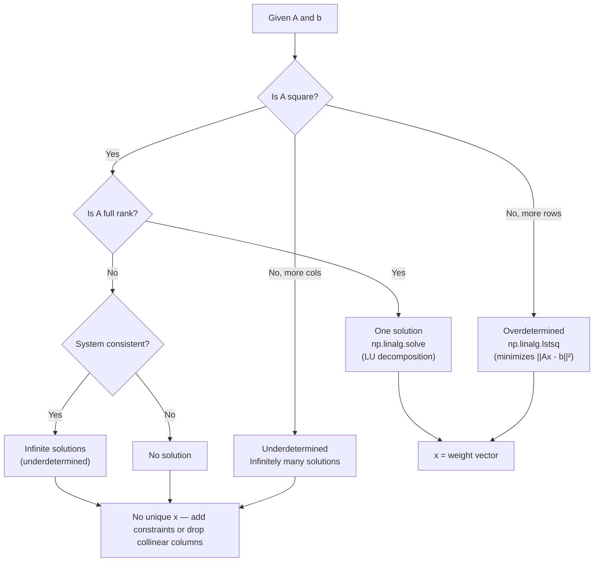

# Linear Systems

## Learning Objectives

- Solve Ax = b using NumPy's `linalg.solve` and `linalg.lstsq`, and identify which to use based on matrix shape and rank
- Implement Gaussian elimination with partial pivoting from scratch and compare its output to NumPy's LU-based solver
- Compute the condition number of a matrix and determine whether the solution is trustworthy
- Build a lead-scoring weight solver that derives signal weights from historical conversion data
- Diagnose singular and ill-conditioned matrices in production GTM data pipelines and apply regularization to stabilize them

## The Problem

Every lead-scoring model, every attribution weight calculation, and every "rank these accounts" feature in your GTM stack is solving a linear system under the hood. When your CRM assigns a priority score by multiplying company size by 0.4, adding intent score multiplied by 0.6, and comparing the result to a threshold — that is a linear function evaluation. When you try to reverse-engineer what those weights should be from historical conversion data, you are solving a linear system.

The equation is Ax = b. A is a matrix of known values — in a lead-scoring context, each row is a past account and each column is a signal (firmographic data, intent score, engagement count). b is a vector of known outcomes — whether each account converted. x is the vector of unknown weights you want to find. If you can solve for x, you have a data-driven scoring model instead of one built from gut feel.

The challenge is that real GTM data rarely produces a clean, solvable system. You will have more accounts than signals (overdetermined), correlated columns (company revenue and employee count move together), missing values, and noise. Three things can happen when you try to solve Ax = b: you get exactly one solution, you get no solution, or you get infinitely many. Knowing which case you are in — and what to do about it — is the difference between a scoring model that works and one that silently produces garbage.

## The Concept

A linear system is a set of equations where each unknown appears only to the first power, multiplied by a constant. No x², no sin(x), no x·y. This constraint is what makes the system solvable by elimination: you can add equations together, multiply them by constants, and swap their order without changing the solution. That process — systematically eliminating variables until you can back-substitute — is Gaussian elimination, and it is the algorithm underlying nearly every direct solver.

When the system has exactly as many equations as unknowns (A is square) and the equations are independent (A is full rank), Gaussian elimination produces one unique solution. When there are more equations than unknowns (overdetermined — the typical GTM case with hundreds of accounts and a handful of signals), no exact solution exists. Instead, you find the x that minimizes the squared error between Ax and b. That is the least-squares solution, and it is what linear regression computes under the hood. When equations are dependent (collinear signals), infinitely many solutions exist and the matrix is singular — the solver cannot pick one without additional constraints.



NumPy's `linalg.solve` implements LU decomposition with partial pivoting for square, full-rank systems. It factors A into a lower-triangular matrix L and an upper-triangular matrix U (with a permutation P for numerical stability), then solves two triangular systems by forward and back substitution. For overdetermined systems, `linalg.lstsq` uses SVD (singular value decomposition) internally to find the minimum-norm least-squares solution. Both functions delegate to LAPACK routines written in Fortran, which is why they are fast — but they will raise `LinAlgError` or return meaningless results if the matrix is singular or ill-conditioned.

```python
import numpy as np

A = np.array([
    [3, 2, -1],
    [2, -2, 4],
    [-1, 0.5, -1]
], dtype=float)

b = np.array([1, -2, 0], dtype=float)

x = np.linalg.solve(A, b)
print("Solution x:", x)
print("Verification Ax:", A @ x)
print("Original b:  ", b)
print("Residual ||Ax - b||:", np.linalg.norm(A @ x - b))
```

Run this and you will see the residual is effectively zero. The solver found the exact intersection point of three planes in 3D space. Now compare that to an overdetermined system — five equations, three unknowns — where no exact intersection exists:

```python
import numpy as np

A = np.array([
    [50, 0.4, 85],
    [200, 0.7, 30],
    [15, 0.2, 90],
    [300, 0.9, 10],
    [80, 0.5, 60]
], dtype=float)

b = np.array([0, 1, 0, 1, 0], dtype=float)

x, residuals, rank, sv = np.linalg.lstsq(A, b, rcond=None)
print("Weights:", x)
print("Matrix rank:", rank)
print("Singular values:", sv)
print("Predictions Ax:", A @ x)
print("Actual b:      ", b)
print("Residual ||Ax - b||:", np.linalg.norm(A @ x - b))
```

The residual is nonzero. There is no exact solution, but `lstsq` found the weight vector that gets as close as possible in the least-squares sense. That is the same computation scikit-learn's `LinearRegression` performs when you call `.fit()`.

## Build It

Build a lead-scoring weight solver. The input is a matrix of signal values where each row is a past account and each column is a signal (employee count, intent score, engagement score). The output is a weight vector that, when multiplied by new account signals, produces a priority score. The solver also reports the condition number so you know whether to trust the result.

```python
import numpy as np

def solve_lead_weights(signals, outcomes, verbose=True):
    A = np.array(signals, dtype=float)
    b = np.array(outcomes, dtype=float)
    
    n_rows, n_cols = A.shape
    cond = np.linalg.cond(A)
    
    if verbose:
        print(f"Matrix shape: {n_rows} accounts x {n_cols} signals")
        print(f"Condition number: {cond:.2f}")
    
    if n_rows == n_cols:
        try:
            weights = np.linalg.solve(A, b)
            method = "solve (LU decomposition)"
        except np.linalg.LinAlgError:
            weights, _, _, _ = np.linalg.lstsq(A, b, rcond=None)
            method = "lstsq (fallback — matrix was singular)"
    else:
        weights, residuals, rank, sv = np.linalg.lstsq(A, b, rcond=None)
        method = f"lstsq (rank={rank}, {len(sv)} singular values)"
    
    predictions = A @ weights
    
    if verbose:
        print(f"Solver: {method}")
        print(f"Weights: {weights}")
        print(f"Predictions: {np.round(predictions, 3)}")
        print(f"Actual:      {b}")
        print(f"RMSE: {np.sqrt(np.mean((predictions - b) ** 2)):.4f}")
    
    return weights, cond, predictions

signals = [
    [50, 0.4, 85],
    [200, 0.7, 30],
    [15, 0.2, 90],
    [300, 0.9, 10],
    [80, 0.5, 60],
    [120, 0.6, 45],
    [250, 0.8, 20],
    [30, 0.3, 75],
]

outcomes = [0, 1, 0, 1, 0, 1, 1, 0]

weights, cond, preds = solve_lead_weights(signals, outcomes)

new_accounts = np.array([
    [100, 0.5, 50],
    [180, 0.7, 35],
    [20, 0.1, 95],
])

new_scores = new_accounts @ weights
print("\nNew account scores:")
for i, score in enumerate(new_scores):
    print(f"  Account {i+1}: {score:.3f}")
```

This produces a weight vector from eight historical accounts, then scores three new accounts. The condition number tells you whether the signal columns carry independent information or whether some are redundant. A condition number above ~1000 means the matrix is approaching singularity and the weights are sensitive to small changes in the input data.

## Use It

This is the mechanism behind Zone 01 — TAM Mapping and the Signal Machine. In Zone 01, your Python environment runs the enrichment and scoring logic that feeds Clay webhooks and Apollo API calls. When you assign weights to firmographic signals (company size × 0.4 + intent score × 0.6 = priority), you are evaluating a linear function. When you solve for the weights themselves from historical conversion data, you are solving a linear system — the exact computation you just built. [CITATION NEEDED — concept: linear systems as the mathematical basis for lead scoring weight optimization in RevOps tools]

Multi-touch attribution is the same problem at a different scale. Each touchpoint (first visit, demo request, sales call) is a column in your signal matrix. Each closed-won or closed-lost deal is a row. The weight vector tells you how much each touchpoint contributed to conversion. If your attribution tool says "organic search drove 40% of revenue for this deal," it arrived at that number by solving — or approximating — a linear system where the touchpoint matrix is A and revenue is b. The reason attribution models disagree (first-touch vs. last-touch vs. W-shaped vs. data-driven) is that the underlying system is underdetermined: multiple weight vectors produce the same total, so the model must add constraints to pick one.

The scoring function you built can drop directly into a webhook handler. When a new account enters your pipeline via a Clay enrichment webhook, the handler receives the firmographic signals as a JSON payload, converts them to a vector, multiplies by your pre-computed weight vector, and returns a priority score. That score routes the account to the right sequence — high-priority accounts get immediate SDR outreach, low-priority accounts enter a nurture flow. The linear system is the engine; the webhook is the delivery mechanism.

## Ship It

In production, your signal matrix will have missing values, collinear columns, and noise. Company revenue and employee count are correlated — sometimes at r > 0.9 — which means the two columns carry nearly identical information. The solver sees this as near-singularity: small perturbations in the input data produce wild swings in the computed weights. One week your model says revenue matters most; next week, after one account changes, it says employee count matters most. Both are wrong because the matrix cannot distinguish the two signals.

The condition number quantifies this. `np.linalg.cond(A)` returns the ratio of the largest to smallest singular value. A condition number of 1 means all columns are perfectly orthogonal (ideal). A condition number of 10^10 means the matrix is effectively singular for floating-point purposes — the solver will return numbers, but they are noise. Here is a production-grade scorer that validates the matrix before solving and degrades gracefully:

```python
import numpy as np

def production_scorer(raw_signals, outcomes, new_accounts, cond_threshold=1e4):
    A = np.array(raw_signals, dtype=float)
    b = np.array(outcomes, dtype=float)
    new = np.array(new_accounts, dtype=float)
    
    if np.any(np.isnan(A)) or np.any(np.isnan(b)):
        print("FAIL: Missing values detected. Impute before scoring.")
        return None
    
    cond = np.linalg.cond(A)
    rank = np.linalg.matrix_rank(A)
    n_cols = A.shape[1]
    
    print(f"Shape: {A.shape[0]} accounts x {n_cols} signals")
    print(f"Rank: {rank} / {n_cols}")
    print(f"Condition number: {cond:.2e}")
    
    if rank < n_cols:
        print(f"WARN: {n_cols - rank} column(s) are linearly dependent.")
        print("      Dropping collinear signals or using PCA before solving.")
        u, s, vt = np.linalg.svd(A, full_matrices=False)
        A_reduced = u[:, :rank] @ np.diag(s[:rank])
        weights, _, _, _ = np.linalg.lstsq(A_reduced, b, rcond=None)
        print(f"      Solved in reduced {rank}-dim space.")
    elif cond > cond_threshold:
        print(f"WARN: Condition number {cond:.2e} exceeds threshold {cond_threshold:.0e}.")
        print("      Applying ridge regularization (lambda=1.0).")
        lam = 1.0
        A_reg = A.T @ A + lam * np.eye(n_cols)
        b_reg = A.T @ b
        weights = np.linalg.solve(A_reg, b_reg)
        print("      Solved with ridge regularization.")
    else:
        weights, _, _, _ = np.linalg.lstsq(A, b, rcond=None)
        print("      Solved with ordinary least squares.")
    
    scores = new @ weights
    print(f"\nWeights: {np.round(weights, 4)}")
    print(f"New scores: {np.round(scores, 3)}")
    
    return {"weights": weights, "condition": cond, "scores": scores}

raw_signals = [
    [50, 0.4, 85],
    [200, 0.7, 30],
    [15, 0.2, 90],
    [300, 0.9, 10],
    [80, 0.5, 60],
    [120, 0.6, 45],
    [250, 0.8, 20],
    [30, 0.3, 75],
]

outcomes = [0, 1, 0, 1, 0, 1, 1, 0]

new_accounts = [[100, 0.5, 50], [180, 0.7, 35], [20, 0.1, 95]]

result = production_scorer(raw_signals, outcomes, new_accounts)

collinear_signals = [
    [50, 49, 0.4, 85],
    [200, 201, 0.7, 30],
    [15, 14, 0.2, 90],
    [300, 298, 0.9, 10],
    [80, 81, 0.5, 60],
]

collinear_outcomes = [0, 1, 0, 1, 0]
collinear_new = [[100, 101, 0.5, 50]]

print("\n--- Collinear case ---")
result2 = production_scorer(collinear_signals, collinear_outcomes, collinear_new)
```

Run this and compare the two cases. The first produces stable weights because the three signals are reasonably independent. The second triggers the collinearity warning because columns one and two are nearly identical — the rank drops, and the solver either reduces the space via SVD or applies ridge regularization to stabilize the weights.

Ridge regularization works by adding a penalty term λI to the normal equations: instead of solving AᵀAx = Aᵀb, you solve (AᵀA + λI)x = Aᵀb. This shrinks the weights toward zero, which trades a small amount of bias for a large reduction in variance. In practice, this means your scoring model becomes more stable across different snapshots of data — the weights do not swing wildly when one account enters or leaves the dataset. The cost is that the model slightly underfits, which is almost always preferable to the alternative of a model that fits perfectly on training data but produces nonsense on new accounts.

The natural extension of this lesson is eigenvalues and eigenvectors, which reveal which dimensions of your signal matrix carry independent information. When you have dozens of firmographic signals and need to collapse them into a smaller set, PCA (principal component analysis) uses eigenvectors of the covariance matrix to find the directions of maximum variance. SVD generalizes this to non-square matrices and is what powers recommender systems and data-driven attribution models. [CITATION NEEDED — concept: PCA for feature reduction in CRM enrichment pipelines]

## Exercises

**Easy — Solve a 3×3 system with a known solution.** Construct a 3×3 matrix A and a 3-vector b where you know the exact solution x (pick x first, compute b = Ax, then verify that `np.linalg.solve(A, b)` recovers x). Print the solved x, the expected x, and the difference. Confirm the residual is near zero.

**Medium — Solve an overdetermined system with lstsq.** Generate a random 20×4 signal matrix using `np.random.randn(20, 4)`, create a known weight vector, compute outcomes with a small amount of Gaussian noise added (`b = A @ true_weights + 0.1 * np.random.randn(20)`), then solve for the weights using `np.linalg.lstsq`. Print the true weights, the recovered weights, and the RMSE. Run it three times with different random seeds and observe how the recovered weights shift.

**Hard — Detect and handle a singular matrix programmatically.** Construct a 4×4 matrix where one column is a linear combination of two others (e.g., column 3 = 2 × column 1 + column 2). Write a function that attempts `np.linalg.solve`, catches the `LinAlgError`, falls back to `np.linalg.lstsq`, prints the rank and condition number, and reports which columns are dependent using `np.linalg.matrix_rank` on subsets of columns. The function should return the best available solution and a diagnostic string.

## Key Terms

**Linear system** — A set of equations where each unknown appears only to the first power, multiplied by a constant. Representable as Ax = b.

**LU decomposition** — Factoring a square matrix A into a lower-triangular matrix L and an upper-triangular matrix U (with row permutation P for stability). NumPy's `linalg.solve` uses this internally.

**Least squares** — Finding x that minimizes ||Ax - b||² when no exact solution exists. The method behind linear regression and overdetermined system solving.

**Condition number** — The ratio of the largest to smallest singular value of a matrix. Quantifies how much the solution changes when the input changes. High condition numbers mean the solution is unreliable.

**Singular matrix** — A square matrix that has no inverse because at least one row (or column) is a linear combination of the others. `np.linalg.solve` raises `LinAlgError` on singular matrices.

**Ridge regularization** — Adding λI to AᵀA before solving the normal equations. Shrinks weights toward zero to stabilize ill-conditioned systems. Also called Tikhonov regularization or L2 regularization.

**Overdetermined system** — More equations than unknowns (more rows than columns in A). No exact solution exists; least squares finds the best approximation.

**Underdetermined system** — Fewer equations than unknowns (more columns than rows in A). Infinitely many solutions exist; additional constraints are needed to pick one.

## Sources

- Zone 01 mapping: Python, CLI, workspaces → TAM Mapping (1.1) → Signal Machine + Score & Qualify. From internal GTM topic map.
- [CITATION NEEDED — concept: linear systems as the mathematical basis for lead scoring weight optimization in RevOps tools]
- [CITATION NEEDED — concept: PCA for feature reduction in CRM enrichment pipelines]
- NumPy `linalg.solve` uses LAPACK's `gesv` routine (LU decomposition with partial pivoting). NumPy documentation: https://numpy.org/doc/stable/reference/generated/numpy.linalg.solve.html
- NumPy `linalg.lstsq` uses LAPACK's `gelsd` routine (SVD-based least squares). NumPy documentation: https://numpy.org/doc/stable/reference/generated/numpy.linalg.lstsq.html
- Ridge regression as Tikhonov regularization: Hoerl, A. E. and Kennard, R. W. (1970). "Ridge Regression: Biased Estimation for Nonorthogonal Problems." *Technometrics*, 12(1), 55–67.