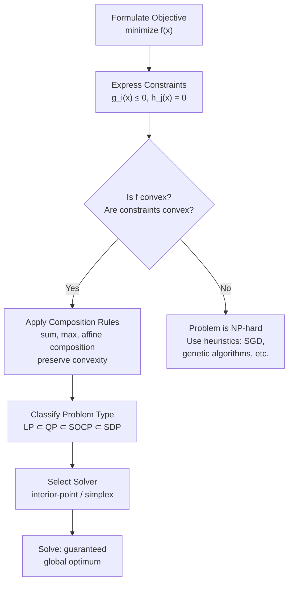

# Convex Optimization

## Learning Objectives

- **Test** whether a function is convex using the second-derivative test and composition rules
- **Formulate** a constrained optimization problem as a linear or quadratic program with explicit constraints
- **Implement** a budget allocation solver in CVXPY and verify feasibility, optimality, and constraint satisfaction
- **Compare** linear, quadratic, and second-order cone programs by their expressive power and solver requirements
- **Trace** the interior-point method's path from infeasible start to optimal solution at the algorithm level

## The Problem

You have 12 outbound reps, 4 territories, and a quota. You need to assign reps to territories while minimizing travel cost and balancing pipeline. That is a constrained optimization problem — and if the constraints are convex, you can solve it exactly, not heuristically. The same structure appears when you allocate a fixed budget across N channels: you have an objective (maximize pipeline), constraints (per-channel minimums, total spend), and variables (dollars per channel). If you frame it right, the solver hands you the provably optimal allocation in milliseconds.

Lesson 08 taught you gradient descent, momentum, and Adam. Those optimizers walk downhill on any surface. But they come with no guarantees. Gradient descent on a non-convex landscape might land in a bad local minimum, get stuck on a saddle point, or oscillate forever. You used it anyway because neural networks are non-convex and there is no alternative. For many GTM and ML problems — linear regression, logistic regression, SVMs, LASSO, budget allocation — the problem *is* convex, and a stronger class of tools exists.

Understanding convexity tells you three things. First, when your problem is easy (convex) versus hard (non-convex). Second, what tools to reach for — interior-point solvers instead of stochastic gradient descent. Third, why concepts like regularization, duality, and constraint satisfaction work the way they do across ML and operations research.

## The Concept

A set is **convex** if for any two points in it, the line segment connecting them lies entirely inside the set. A function $f$ is **convex** if its domain is a convex set and for any two points $x, y$ in that domain:

$$f(\theta x + (1-\theta)y) \leq \theta f(x) + (1-\theta)f(y) \quad \forall \theta \in [0, 1]$$

Geometrically: the line segment connecting $(x, f(x))$ and $(y, f(y))$ never dips below the graph of $f$. A bowl, not a saddle. If $f$ is twice differentiable, convexity is equivalent to $f''(x) \geq 0$ everywhere in one dimension, or the Hessian matrix $\nabla^2 f(x)$ being positive semidefinite everywhere in higher dimensions.

The critical property: **every local minimum of a convex function is a global minimum**. If you are at a point where no small move decreases the objective, you are at the bottom of the only valley. This single fact is what separates problems you can solve exactly from problems that are NP-hard. On a convex landscape, any algorithm that finds a local minimum has found the global one — no restarts, no simulated annealing, no multi-start heuristics.



Convexity composes. The sum of convex functions is convex. The maximum of convex functions is convex. An affine composition $f(Ax + b)$ is convex if $f$ is convex. These composition rules let you verify convexity without computing a Hessian — you build the objective from known-convex atoms and the property is preserved structurally.

A **constrained optimization problem** has the form:

$$\min_x f(x) \quad \text{subject to} \quad g_i(x) \leq 0, \quad h_j(x) = 0$$

This is a **convex program** when $f$ and all $g_i$ are convex, and all $h_j$ are affine (linear). The feasible region — the set of points satisfying all constraints — is then a convex set, and the global minimum over that set is unique (or lies on a flat convex face where all points have equal objective value).

## Build It

The three main classes of convex programs, each a strict subset of the next:

**Linear Program (LP):** Objective and constraints are all linear. Example: minimize cost subject to supply constraints. Solved by the simplex method or interior-point methods. This is what territory assignment looks like when your cost is linear in distance and your constraints are linear in headcount.

**Quadratic Program (QP):** Objective is quadratic (and convex), constraints are linear. Example: minimize portfolio variance subject to budget constraints. The budget allocation problem with a risk penalty falls here — you maximize expected pipeline (linear) minus a variance penalty (quadratic).

**Second-Order Cone Program (SOCP):** Objective is linear, constraints include second-order cone constraints of the form $\|Ax + b\|_2 \leq c^Tx + d$. Strictly more expressive than QP. Robust optimization problems with norm-bounded uncertainty land here.

The **interior-point method** — the algorithm inside most modern solvers — works as follows. Instead of navigating the boundary of the feasible region (which the simplex method does), it creates a **barrier function** that goes to infinity at the constraint boundaries. The solver then minimizes the objective plus the barrier, following a path called the *central path* that leads to the optimum while staying strictly inside the feasible region. As the solver progresses, it reduces the barrier weight, allowing the solution to approach the boundary if the optimum lies there. This method converges in polynomial time for convex problems.

CVXPY implements this pipeline: you declare variables, build an objective from convex atoms, specify constraints, and call `.solve()`. Behind the scenes, CVXPY verifies convexity using its **disciplined convex programming (DCP)** ruleset — essentially the composition rules above, applied to a library of known-convex and known-concave functions. If your formulation violates DCP, CVXPY raises an error before calling any solver.

```python
import numpy as np
import cvxpy as cp

np.random.seed(42)

channels = ["Email", "LinkedIn Ads", "Cold Call", "Events", "Content Syndication"]
n = len(channels)

expected_return_per_dollar = np.array([3.2, 2.8, 4.1, 1.9, 2.3])
minimum_spend = np.array([5000, 3000, 2000, 8000, 4000])
total_budget = 50000

x = cp.Variable(n, nonneg=True)

objective = cp.Maximize(expected_return_per_dollar @ x)

constraints = [
    cp.sum(x) <= total_budget,
    x >= minimum_spend,
]

problem = cp.Problem(objective, constraints)
problem.solve()

print(f"Status: {problem.status}")
print(f"Optimal expected pipeline: ${problem.value:,.2f}")
print(f"Total allocated: ${np.sum(x.value):,.2f}")
print(f"Budget remaining: ${total_budget - np.sum(x.value):,.2f}")
print()
for i, ch in enumerate(channels):
    print(f"  {ch:25s}  ${x.value[i]:>10,.2f}   "
          f"(return multiplier: {expected_return_per_dollar[i]:.1f}x  "
          f"min: ${minimum_spend[i]:,})")

print()
print("Constraint check — all minimums met:")
print(f"  All allocations >= minimum: {np.all(x.value >= minimum_spend - 1e-6)}")
print(f"  Total <= budget: {np.sum(x.value) <= total_budget + 1e-6}")
```

Run this and you get a provably optimal allocation. The solver confirms feasibility (`status: optimal`), reports the objective value, and prints the allocation vector. The constraint check at the end verifies that the solution respects every constraint you specified — this is not a heuristic guess, it is a mathematical guarantee.

```python
print("=== Sensitivity: what if Email minimum drops to $2,000? ===\n")

minimum_spend_modified = minimum_spend.copy()
minimum_spend_modified[0] = 2000

x2 = cp.Variable(n, nonneg=True)
objective2 = cp.Maximize(expected_return_per_dollar @ x2)
constraints2 = [
    cp.sum(x2) <= total_budget,
    x2 >= minimum_spend_modified,
]
problem2 = cp.Problem(objective2, constraints2)
problem2.solve()

print(f"Original optimal pipeline:  ${problem.value:,.2f}")
print(f"Modified optimal pipeline:  ${problem2.value:,.2f}")
print(f"Delta from relaxed Email constraint: ${problem2.value - problem.value:,.2f}")
print()
for i, ch in enumerate(channels):
    delta = x2.value[i] - x.value[i]
    sign = "+" if delta >= 0 else ""
    print(f"  {ch:25s}  ${x2.value[i]:>10,.2f}   ({sign}${delta:,.2f})")
```

The relaxed constraint lets the solver shift dollars from Email (lower minimum frees up budget) into the highest-return channel. This is the **shadow price** concept from LP duality in action — loosening a binding constraint improves the objective by a computable amount.

## Use It

This is the engine behind GTM budget allocation and territory rebalancing. [CITATION NEEDED — concept: GTM budget optimization via convex programming]. Channel spend allocation and rep-territory assignment are convex programs when formulated correctly: linear costs, linear or quadratic objectives, linear constraints. This maps directly to **Zone 2 — Outbound & Sequences** in the curriculum, where the Python environment you use for Clay webhooks and Apollo API calls is the same environment that runs these solvers.

The practical workflow: pull channel-level performance data (cost per meeting, conversion rates, pipeline per dollar) from your CRM or engagement platform. Frame the allocation as a maximization of expected pipeline subject to minimum spend floors (you cannot zero out a channel mid-quarter without operational disruption) and a total budget ceiling. The solver returns the allocation that squeezes the most pipeline out of your fixed budget. This is not a model predicting *what will happen* — it is a prescriptive computation of *what to do given what you know*.

Territory assignment works the same way. Frame it as: minimize total travel cost (linear in distance × headcount assigned) subject to each territory getting at least $R$ reps and each rep assigned to exactly one territory. This is an **integer linear program** — the integrality constraint (you cannot assign 2.7 reps to a territory) makes it technically non-convex, but the LP relaxation is tight for assignment problems, and solvers like OR-Tools handle the integer version efficiently. The convexity of the continuous relaxation is what makes the integer version tractable in practice.

## Ship It

The budget allocation code above is production-adjacent. To ship it for real, you would pull channel performance data from your analytics stack (or a Clay enrichment table), parameterize the constraints from a config file, and run the solver on a schedule — quarterly budget reviews, or weekly reallocation if your channels have short feedback loops. The output feeds directly into spending decisions: this channel gets more, this one gets less, and you can defend every dollar with a mathematical argument.

The harder integration is organizational. Convex optimization gives you the optimal answer *given your model*. If your expected-return-per-dollar estimates are wrong — stale conversion rates, attribution gaps, channels with delayed payoff structures — the solver optimizes the wrong objective with full mathematical confidence. The GTM lesson here is that optimization quality is bounded by model quality. Personalization, follow-up cadence, channel mix — these are all optimization around a core that either works or does not. The solver cannot fix a bad product or a bad ICP. It can only allocate your resources optimally given the returns you observe.

## Exercises

**Easy.** Re-run the budget allocation code with Cold Call's minimum spend lowered from $2,000 to $500. Print the original and new allocations side by side. Confirm that the solver reallocates budget and that the new objective value is higher. What is the dollar delta?

**Medium.** Formulate a territory-balancing LP. You have 4 territories and 12 reps. Each territory needs at least 2 reps and at most 4 reps. Each rep is assigned to exactly one territory. Minimize total "cost" where cost is defined as the sum over all assignments of `rep_preference_score[rep][territory] * assignment[rep][territory]` (lower is better — reps prefer territories where their score is low). Use a random 12×4 cost matrix. Solve with CVXPY and print the 12×4 assignment matrix as a heatmap-style grid of 0s and 1s. Confirm every constraint is satisfied.

**Hard.** Add a quadratic risk term to the budget allocation objective. Instead of maximizing pure expected return, maximize `expected_return_per_dollar @ x - lambda * cp.sum_squares(x)`. This penalizes concentration — putting all your budget in one high-return channel is risky. Solve for `lambda = 0.0001`, `lambda = 0.001`, and `lambda = 0.01`. Print all three allocation vectors and objective values. Confirm (by checking the Hessian or by the DCP ruleset accepting it) that the problem remains convex. How does the allocation spread change as lambda increases?

## Key Terms

- **Convex set** — a set where the line segment between any two points in the set stays inside the set
- **Convex function** — a function where the line segment between any two points on its graph stays on or above the graph; equivalently, $f''(x) \geq 0$ everywhere (1D) or the Hessian is positive semidefinite (nD)
- **Global minimum** — the lowest point on the entire function; for convex functions, every local minimum is the global minimum
- **Linear Program (LP)** — optimization problem with linear objective and linear constraints; the simplest convex program
- **Quadratic Program (QP)** — optimization problem with a convex quadratic objective and linear constraints
- **Second-Order Cone Program (SOCP)** — optimization problem with linear objective and constraints involving Euclidean norm bounds; strictly more expressive than QP
- **Interior-point method** — algorithm that solves convex programs by following a path through the interior of the feasible region, using a barrier function that penalizes proximity to constraint boundaries
- **Disciplined Convex Programming (DCP)** — a ruleset for composing convex functions from a library of known-convex atoms, enabling automatic convexity verification (implemented in CVXPY)
- **KKT conditions** — the necessary and sufficient conditions for a point to be optimal in a convex program; generalize Lagrange multipliers to inequality constraints

## Sources

- [CITATION NEEDED — concept: GTM budget optimization via convex programming]
- Boyd, S. & Vandenberghe, L. (2004). *Convex Optimization*. Cambridge University Press. — canonical reference for convex sets, functions, and interior-point methods
- CVXPY documentation: https://www.cvxpy.org/ — DCP ruleset and solver interface
- Diamond, S. & Boyd, S. (2016). "CVXPY: A Python-embedded modeling language for convex optimization." *Journal of Machine Learning Research*, 17(83), 1–5.