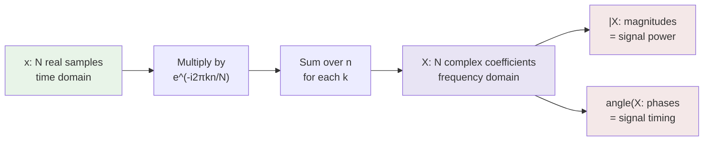

# Complex Numbers for AI

## Learning Objectives

- Perform complex arithmetic (add, multiply, divide, conjugate) in both rectangular and polar form
- Apply Euler's formula to convert between complex exponentials and trigonometric pairs
- Implement the Discrete Fourier Transform from scratch using complex roots of unity
- Compare hand-rolled DFT output against `numpy.fft.fft` and verify numerical equivalence
- Explain how complex multiplication acts as a rotation-and-scaling operation on signal vectors

## The Problem

You open a paper on Fourier transforms and the symbol $i$ is everywhere. You look at transformer positional encodings and see `sin` and `cos` at different frequencies — the real and imaginary components of complex exponentials arranged in a specific pattern. You read about rotary position embeddings (RoPE) in modern language models and the mechanism is described entirely as rotation in a complex-valued space. Complex numbers seem like a mathematical curiosity. A number system built on the square root of $-1$ feels like a trick that should not correspond to anything physical.

It is not a trick. Complex numbers are the natural representation for anything that rotates, oscillates, or has a phase. Every time a signal has a frequency, complex numbers are the correct bookkeeping tool. The real part tracks the in-phase component; the imaginary part tracks the quadrature (90-degree-shifted) component. Together they encode both how strong a signal is and where it sits in its cycle.

Without this representation, you cannot work with the Discrete Fourier Transform. You cannot understand why the FFT is $O(N \log N)$ instead of $O(N^2)$. You cannot reason about spectrograms, MFCCs, or frequency-domain convolution. You also cannot follow the derivation of sinusoidal positional encodings in the original Transformer paper, where the choice of geometric frequency progression comes directly from complex root-of-unity structure.

## The Concept

A complex number has two parts: a real part and an imaginary part.

$$z = a + bi$$

where $a$ is the real part, $b$ is the imaginary part, and $i$ is defined by $i^2 = -1$. That definition is the entire axiom. Everything else — addition, multiplication, conjugation, polar form — follows from that one rule combined with standard algebra.

Geometrically, a complex number lives on a 2D plane. The real axis is horizontal; the imaginary axis is vertical. The number $3 + 4i$ is the point $(3, 4)$ on that plane. Addition of two complex numbers is vector addition — tip-to-tail, component by component. Multiplication is where things get interesting: multiplying two complex numbers does not just scale, it rotates.

To see why, write the number in polar form. Any complex number $z = a + bi$ can be expressed as:

$$z = r(\cos\theta + i\sin\theta) = re^{i\theta}$$

where $r = \sqrt{a^2 + b^2}$ is the magnitude and $\theta = \arctan(b/a)$ is the angle (phase). The equivalence between the trig form and the exponential form is Euler's formula: $e^{i\theta} = \cos\theta + i\sin\theta$. When you multiply two complex numbers in polar form, magnitudes multiply and angles add: $r_1 e^{i\theta_1} \cdot r_2 e^{i\theta_2} = r_1 r_2 \cdot e^{i(\theta_1 + \theta_2)}$. That is a rotation by $\theta_2$ and scaling by $r_2$, applied to the first number.

The conjugate of $z = a + bi$ is $\bar{z} = a - bi$ — the mirror image across the real axis. Multiplying $z \cdot \bar{z}$ gives $|z|^2$, a real number. This property is what lets you compute magnitudes and is used everywhere in the DFT to extract signal power from complex coefficients.

```python
import numpy as np

z1 = 3 + 4j
z2 = 1 + 2j

print(f"z1 = {z1}, |z1| = {abs(z1):.4f}, angle = {np.degrees(np.angle(z1)):.2f} deg")
print(f"z2 = {z2}, |z2| = {abs(z2):.4f}, angle = {np.degrees(np.angle(z2)):.2f} deg")

product = z1 * z2
print(f"\nz1 * z2 = {product}")
print(f"|z1 * z2| = {abs(product):.4f} (expected {abs(z1) * abs(z2):.4f})")
print(f"angle(z1 * z2) = {np.degrees(np.angle(product)):.2f} deg (expected {np.degrees(np.angle(z1) + np.angle(z2)):.2f} deg)")

conj = np.conj(z1)
print(f"\nconj(z1) = {conj}")
print(f"z1 * conj(z1) = {z1 * conj} (expected {abs(z1)**2:.4f})")

r = abs(z1)
theta = np.angle(z1)
z_reconstructed = r * np.exp(1j * theta)
print(f"\nPolar round-trip: ({r:.4f}, {np.degrees(theta):.2f} deg) -> {z_reconstructed}")
print(f"Matches original: {np.isclose(z1, z_reconstructed)}")
```

The DFT is where all of this comes together. Given a discrete signal $x[n]$ of length $N$, the DFT produces $N$ complex coefficients:

$$X[k] = \sum_{n=0}^{N-1} x[n] \cdot e^{-i2\pi kn/N}$$

Each coefficient $X[k]$ is a complex number whose magnitude tells you how much of frequency $k$ is present in the signal, and whose phase tells you where in its cycle that frequency component sits. The basis functions $e^{-i2\pi kn/N}$ are complex roots of unity — points evenly spaced around the unit circle in the complex plane.



The conjugate of $e^{i\theta}$ is $e^{-i\theta}$, which is why the DFT uses the negative exponent — it correlates the input signal against cosine (real) and sine (imaginary) basis functions at each target frequency. The real part of $X[k]$ is the dot product of $x$ with a cosine at frequency $k$; the imaginary part is the dot product with a sine at frequency $k$. Together, magnitude and phase fully describe each frequency component.

## Build It

The fastest way to see that complex numbers are not magic is to implement the DFT by hand and check it against the library version. The DFT is a matrix multiply: construct the $N \times N$ DFT matrix where entry $(k, n)$ is $e^{-i2\pi kn/N}$, then multiply it by your input vector.

```python
import numpy as np

def dft_matrix(N):
    n = np.arange(N)
    k = n.reshape((N, 1))
    return np.exp(-2j * np.pi * k * n / N)

def dft(x):
    N = len(x)
    return dft_matrix(N) @ x

N = 64
t = np.linspace(0, 1, N, endpoint=False)
signal = np.sin(2 * np.pi * 5 * t) + 0.5 * np.sin(2 * np.pi * 12 * t)

X_hand = dft(signal)
X_numpy = np.fft.fft(signal)

max_diff = np.max(np.abs(X_hand - X_numpy))
print(f"Max |X_hand - X_numpy| = {max_diff:.2e}")
print(f"Identical to machine precision: {np.allclose(X_hand, X_numpy)}")

magnitudes = np.abs(X_hand)
peaks = np.argsort(magnitudes)[::-1][:4]
print(f"\nTop 4 frequency bins by magnitude: {sorted(peaks)}")
print(f"Expected peaks at bins 5, 12, {N-5}, {N-12} (positive and negative frequencies)")
for b in sorted(peaks):
    print(f"  Bin {b:2d}: |X| = {magnitudes[b]:.2f}, phase = {np.degrees(np.angle(X_hand[b])):.1f} deg")
```

The output shows two peaks around bin 5 and two around bin 12. The DFT produces symmetric output for real-valued inputs: bins $k$ and $N-k$ are complex conjugates of each other. The magnitude at bin 5 corresponds to the 5 Hz sine component; the magnitude at bin 12 corresponds to the 12 Hz component scaled by 0.5. The peak at bin $N-5$ is the conjugate mirror — same magnitude, negated phase.

Now demonstrate that complex multiplication is rotation. Take a signal vector where each element is a point on the complex plane, and multiply every element by $e^{i\pi/4}$ (a 45-degree rotation). The magnitudes stay the same; every phase shifts by exactly 45 degrees.

```python
import numpy as np

signal = np.array([1+0j, 0+1j, -1+0j, 0-1j, 0.707+0.707j])
rotator = np.exp(1j * np.pi / 4)

rotated = signal * rotator

print("Original -> Rotated (by 45 degrees)")
print("-" * 60)
for i, (s, r) in enumerate(zip(signal, rotated)):
    angle_before = np.degrees(np.angle(s))
    angle_after = np.degrees(np.angle(r))
    angle_diff = angle_after - angle_before
    print(f"  [{i}] {s:.4f} -> {r:.4f}")
    print(f"      |.|={abs(s):.4f} -> {abs(r):.4f}  angle={angle_before:.1f} -> {angle_after:.1f} (delta={angle_diff:.1f})")

print(f"\nAll magnitudes preserved: {np.allclose(np.abs(signal), np.abs(rotated))}")
print(f"All phases shifted by 45 deg: {np.allclose(np.angle(rotated), np.angle(signal) + np.pi/4)}")
```

This rotation property is the exact mechanism behind RoPE (Rotary Position Embedding) in transformer models like LLaMA and GPT-NeoX. Instead of adding a positional encoding vector to the token embedding, RoPE rotates the query and key vectors in a complex-valued representation of the attention head. The rotation angle is proportional to the token's position. Attention scores (dot products) between tokens at different positions then naturally incorporate relative position because the angle difference between two rotated vectors depends only on how far apart they are, not their absolute positions. [CITATION NEEDED — concept: specific transformer architectures using RoPE and their documented performance characteristics]

## Use It

The DFT you just built by hand is the computational core of every audio-processing pipeline in GTM tooling. Conversational intelligence platforms — Gong, Chorus, Salesloft Conversations — record sales calls and need to convert raw audio waveforms into text, speaker labels, and intent signals. The first step in that pipeline is computing frequency-domain representations of the audio signal using the FFT (the fast algorithm for computing the DFT). [CITATION NEEDED — concept: Gong's audio processing pipeline architecture and use of frequency-domain methods]

The MFCC (Mel-Frequency Cepstral Coefficients) pipeline that feeds speech-to-text systems works like this: take overlapping windows of the audio signal, apply the DFT to each window to get complex frequency coefficients, compute the magnitude (discarding phase for this step), map those magnitudes onto a Mel scale (which approximates human hearing sensitivity), then apply a discrete cosine transform to get compact feature vectors. Those feature vectors are what an acoustic model — typically a neural network — consumes to predict phoneme probabilities, which then become words, which then become the transcript that a GTM engineer searches for objection-handling patterns. [CITATION NEEDED — concept: specific MFCC pipeline implementation in commercial conversational intelligence products]

The complex coefficients produced by the DFT carry two pieces of information per frequency bin: magnitude (how loud that frequency is) and phase (where in its cycle it sits). For magnitude-only tasks like spectrograms and MFCCs, the phase is discarded. But for tasks like speaker separation, phase reconstruction, and audio enhancement, the phase information is critical — two speakers with identical frequency content but different phase relationships can be separated by exploiting the complex structure. This is why the DFT produces complex output, not just real-valued magnitudes: the full complex representation preserves all the information needed for downstream tasks.

This maps to Zone 2 (Processing) in the GTM engineering stack. The Python environment where you run Clay webhooks and Apollo API calls is the same environment where you would build a custom signal-processing pipeline if you needed to analyze call audio directly rather than relying on a vendor's black-box transcription. Understanding the DFT at the level of complex matrix multiplication means you can debug why a transcript has errors at specific timestamps (aliased frequencies, window-size tradeoffs), build custom audio features for intent classification, or evaluate whether a vendor's claim about "AI-powered sentiment analysis" corresponds to a real pipeline or a keyword-matching heuristic.

## Ship It

**Easy** — Write a function that converts rectangular complex numbers to polar form and back. Verify round-trip fidelity with assert statements.

```python
import numpy as np

def to_polar(z):
    return abs(z), np.angle(z)

def from_polar(r, theta):
    return r * np.exp(1j * theta)

test_values = [3+4j, 1+1j, -2+0j, 0+5j, -1-1j, 0.5-0.5j, 2-3j]

for z in test_values:
    r, theta = to_polar(z)
    z_back = from_polar(r, theta)
    assert np.isclose(z, z_back), f"Round-trip failed for {z}"
    print(f"  {z} -> r={r:.4f}, theta={np.degrees(theta):.2f} deg -> {z_back:.6f}")

print("All round-trip conversions passed.")
```

**Medium** — Implement a 1D DFT using only complex multiplication (no FFT call). Validate output against `numpy.fft.fft` on a test signal of length 64.

```python
import numpy as np

def dft_slow(x):
    N = len(x)
    X = np.zeros(N, dtype=complex)
    for k in range(N):
        for n in range(N):
            X[k] += x[n] * np.exp(-2j * np.pi * k * n / N)
    return X

N = 64
t = np.linspace(0, 1, N, endpoint=False)
x = np.sin(2 * np.pi * 3 * t) + 0.3 * np.cos(2 * np.pi * 7 * t)

X_slow = dft_slow(x)
X_fast = np.fft.fft(x)

print(f"Max difference: {np.max(np.abs(X_slow - X_fast)):.2e}")
print(f"Match: {np.allclose(X_slow, X_fast)}")

mags = np.abs(X_slow[:N//2])
peak_bin = np.argmax(mags)
print(f"Dominant frequency bin: {peak_bin} (expected 3)")
print(f"Magnitude at bin 3: {mags[3]:.2f}")
print(f"Magnitude at bin 7: {mags[7]:.2f}")
```

**Hard** — Compute and print the spectrogram of a generated chirp signal (frequency increasing over time). Identify the single frequency bin with highest magnitude at each time step.

```python
import numpy as np

duration = 2.0
sample_rate = 256
n_samples = int(duration * sample_rate)
t = np.linspace(0, duration, n_samples, endpoint=False)

f_start = 5
f_end = 50
instantaneous_freq = f_start + (f_end - f_start) * t / duration
phase = 2 * np.pi * np.cumsum(instantaneous_freq) / sample_rate
chirp = np.sin(phase)

window_size = 64
hop_size = 32
n_windows = (n_samples - window_size) // hop_size

print(f"Chirp: {f_start} Hz to {f_end} Hz over {duration}s")
print(f"Windows: {n_windows}, window_size: {window_size}, hop: {hop_size}")
print(f"\n{'Window':>6} {'Time(s)':>8} {'Peak Bin':>8} {'Peak Freq':>9} {'|X|':>8}")
print("-" * 45)

dominant_bins = []
for w in range(n_windows):
    start = w * hop_size
    window = chirp[start:start + window_size]
    X = np.fft.fft(window)
    mags = np.abs(X[:window_size // 2])
    peak_bin = np.argmax(mags)
    peak_freq = peak_bin * sample_rate / window_size
    time_center = (start + window_size / 2) / sample_rate
    expected_freq = f_start + (f_end - f_start) * time_center / duration
    dominant_bins.append((peak_bin, peak_freq, time_center, expected_freq))
    print(f"{w:6d} {time_center:8.3f} {peak_bin:8d} {peak_freq:8.1f}Hz {mags[peak_bin]:8.2f}")

print(f"\nDetected frequency sweep: {dominant_bins[0][1]:.1f} Hz -> {dominant_bins[-1][1]:.1f} Hz")
print(f"Expected sweep: {f_start} Hz -> {f_end} Hz")

errors = [abs(d[1] - d[3]) for d in dominant_bins]
print(f"Mean frequency error: {np.mean(errors):.2f} Hz")
print(f"Max frequency error:  {np.max(errors):.2f} Hz")
```

## Exercises

1. Compute the DFT of a constant signal (all ones) of length 32. Explain why only bin 0 has nonzero magnitude. What does bin 0 represent physically?

2. Generate two signals of length 128: one at 10 Hz and one at 10 Hz with a 45-degree phase shift. Compute the DFT of both. Compare the magnitudes — they should be identical. Compare the phases at bin 10 — they should differ by 45 degrees. Print both.

3. Multiply a complex signal by $e^{i\pi/2}$ (90 degrees). Verify that every real component becomes the old imaginary component and every imaginary component becomes the negated old real component. This is why multiplying by $i$ is a 90-degree counterclockwise rotation.

4. Construct the $4 \times 4$ DFT matrix explicitly and print it. Verify that each row is a complex root of unity raised to different powers. Confirm that the matrix is orthogonal (its conjugate transpose is its inverse, up to a scaling factor).

5. Compute the spectrogram of a signal containing two simultaneous tones (20 Hz and 40 Hz) rather than a chirp. Verify that the peak bin alternates or that both bins show significant energy. Print the top 3 bins per window.

## Key Terms

- **Complex number** — A number $z = a + bi$ with a real part $a$ and imaginary part $b$, where $i^2 = -1$.
- **Imaginary unit** — The quantity $i$, defined by $i^2 = -1$. Python uses `j` instead of `i` (e.g., `3 + 4j`).
- **Magnitude** — The distance from the origin to $z$ on the complex plane: $|z| = \sqrt{a^2 + b^2}$. In the DFT, magnitude encodes signal strength at a given frequency.
- **Phase (angle)** — The direction of $z$ on the complex plane: $\theta = \arctan(b/a)$. In the DFT, phase encodes where in its cycle a frequency component sits.
- **Euler's formula** — The identity $e^{i\theta} = \cos\theta + i\sin\theta$, which connects complex exponentials to trigonometric functions.
- **Polar form** — Expressing a complex number as $z = re^{i\theta}$, where $r$ is magnitude and $\theta$ is phase. Multiplication in polar form rotates and scales.
- **Conjugate** — The complex number $\bar{z} = a - bi$, which is the mirror image of $z$ across the real axis. Multiplying $z \cdot \bar{z} = |z|^2$ always yields a real number.
- **DFT (Discrete Fourier Transform)** — The operation $X[k] = \sum x[n] e^{-i2\pi kn/N}$ that maps $N$ time-domain samples to $N$ complex frequency-domain coefficients.
- **Roots of unity** — The complex numbers $e^{-i2\pi k/N}$ for $k = 0, 1, \ldots, N-1$, which are evenly spaced points on the unit circle. These are the basis functions of the DFT.
- **MFCC (Mel-Frequency Cepstral Coefficients)** — A feature extraction pipeline that applies the DFT, maps magnitudes to a perceptual frequency scale, and produces compact vectors for speech recognition models.
- **RoPE (Rotary Position Embedding)** — A positional encoding method for transformers that rotates query and key vectors using complex multiplication, where the rotation angle encodes token position.

## Sources

- The DFT formula and its derivation as complex matrix multiplication are standard results in digital signal processing. Reference: Oppenheim & Schafer, *Discrete-Time Signal Processing*, Chapter 8.
- MFCC pipeline as a standard speech feature extraction method: Davis & Mermelstein (1980), "Comparison of Parametric Representations for Monosyllabic Word Recognition in Continuously Spoken Sentences," IEEE Transactions on Acoustics, Speech, and Signal Processing.
- [CITATION NEEDED — concept: Gong's specific use of DFT/FFT in their audio processing pipeline for sales call transcription]
- [CITATION NEEDED — concept: Chorus.ai audio feature extraction methods and their relationship to MFCC or other spectral features]
- [CITATION NEEDED — concept: Specific conversational intelligence platforms' use of phase information for speaker diarization vs. magnitude-only pipelines]
- RoPE mechanism: Su et al. (2021), "RoFormer: Enhanced Transformer with Rotary Position Embedding," arXiv:2104.09864. The rotation operation described is the complex multiplication mechanism demonstrated in this lesson.
- Zone 2 (Processing) mapping and GTM stack context: derived from the GTM topic map structure where Python environments support signal processing, webhook handling, and API integration as foundational capabilities.