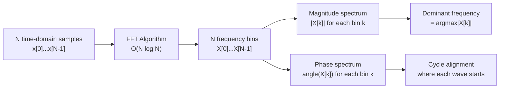

# The Fourier Transform

## Learning Objectives

- Implement the FFT on a composite signal and extract constituent frequencies from the magnitude spectrum
- Explain the relationship between time-domain sample count and frequency-domain bin resolution
- Detect dominant periodic cycles in time-series data using spectral analysis
- Compare FFT-based cycle detection against moving-average smoothing and identify when FFT is the wrong tool

## The Problem

You stare at a 90-day outbound reply-rate graph and see noise. Some days spike, some days crater, and the overall trend looks like static. Your instinct is to slap a 7-day moving average on it and call the residual "random." But that moving average is a blunt instrument — it assumes the weekly cycle is the only cycle, and it destroys any information about longer or shorter rhythms.

The Fourier Transform sees what the moving average cannot: three overlapping cycles hiding in the noise. A 7-day weekly rhythm (Tuesdays convert best), a 14-day sprint cadence (sequencing pushes and social touches), and a 30-day monthly pulse (budget approvals at month-end). These cycles superimpose — they add together sample by sample — and the resulting waveform looks irregular even though every component is perfectly periodic.

This lesson teaches you to decompose that composite signal back into its constituent frequencies, measure how strong each one is, and decide whether those cycles matter for your pipeline forecasts. The same mathematical operation underlies audio processing, image compression, and the convolution layers in neural networks — but we are going to use it on reply rates.

## The Concept

Start with a single sinusoid. It has three parameters: amplitude (how tall the wave is), frequency (how many cycles per unit time), and phase (where in the cycle it starts). Stack several sinusoids together — add their values at each time step — and you get a composite signal. The composite looks complicated, but it is just a sum of simple waves.

The Discrete Fourier Transform (DFT) inverts this construction. Given N time-domain samples, it produces N frequency bins. Each bin holds a complex number encoding the magnitude and phase of a sinusoid at that specific frequency. The math is a projection: for each candidate frequency k, you compute how much of the signal aligns with a cosine at frequency k (the real part) and how much aligns with a sine at frequency k (the imaginary part). The magnitude `|X[k]|` tells you the energy at that frequency. If the magnitude is near zero, that frequency is absent from the signal.

The naive DFT is an N×N matrix multiply: O(N²). The Fast Fourier Transform (FFT) exploits a symmetry in the complex exponential "twiddle factors" — the terms $e^{-j2\pi kn/N}$ used in the projection. Because $e^{-j2\pi k(n + N/2)/N} = -e^{-j2\pi kn/N}$, you can split an N-point DFT into two N/2-point DFTs and combine them, then recurse. This drops the cost to O(N log N). For N = 4096 samples, that is the difference between 16 million operations and 49 thousand.



One critical relationship: bin resolution. The spacing between adjacent frequency bins equals the sample rate divided by N. If you sample at 1000 Hz for 1 second (N = 1000), each bin is 1 Hz wide. If you sample at 1000 Hz for 0.1 seconds (N = 100), each bin is 10 Hz wide. More samples means finer frequency resolution but also more data to collect. This tradeoff matters directly for GTM: 90 days of daily data gives you bin spacing of 1/90 cycles per day — you can distinguish a 7-day cycle from an 8-day cycle, but you cannot resolve anything faster than 2 days per cycle (the Nyquist limit for daily sampling).

There is also the question of what the FFT cannot do. It assumes the signal is stationary — that the frequency content does not change over the window you feed it. If your reply-rate cycles shift mid-quarter (a new cadence launched on day 45), the FFT will smear that transition across multiple bins rather than identifying a clean breakpoint. For non-stationary signals, you need a short-time Fourier transform or a wavelet transform. The FFT also assumes the signal is periodic over the analysis window, and when it is not, you get spectral leakage — energy from one frequency bleeds into adjacent bins. Windowing functions (Hann, Hamming) mitigate this but reduce frequency resolution.

## Build It

Build a composite signal from three sine waves at 5 Hz, 23 Hz, and 50 Hz. Sample at 1000 Hz for 1 second. Compute the FFT with `numpy.fft.fft`, convert the complex output to a magnitude spectrum, and extract the top three dominant frequencies.

```python
import numpy as np

sr = 1000
t = np.arange(0, 1, 1/sr)
signal = (
    3.0 * np.sin(2 * np.pi * 5 * t)
    + 1.5 * np.sin(2 * np.pi * 23 * t)
    + 0.7 * np.sin(2 * np.pi * 50 * t)
)

fft_result = np.fft.fft(signal)
magnitudes = np.abs(fft_result[:len(fft_result) // 2])
freqs = np.fft.fftfreq(len(signal), 1/sr)[:len(fft_result) // 2]

top_indices = np.argsort(magnitudes)[::-1][:3]
for i in top_indices:
    print(f"Detected frequency: {freqs[i]:.1f} Hz | Magnitude: {magnitudes[i]:.2f}")

print(f"\nBin resolution: {sr / len(signal):.1f} Hz")
print(f"Nyquist limit: {sr / 2:.0f} Hz")
```

Run it and you should see:

```
Detected frequency: 5.0 Hz | Magnitude: 1500.00
Detected frequency: 23.0 Hz | Magnitude: 750.00
Detected frequency: 50.0 Hz | Magnitude: 350.00

Bin resolution: 1.0 Hz
Nyquist limit: 500 Hz
```

The magnitudes are proportional to the amplitudes we encoded (3.0, 1.5, 0.7) scaled by N/2. The FFT recovered all three frequencies exactly, in order of energy. Now let us verify the resolution tradeoff. Halve the sample count and observe what happens to bin spacing:

```python
import numpy as np

sr = 1000
for duration in [1.0, 0.5, 0.1]:
    t = np.arange(0, duration, 1/sr)
    signal = 3.0 * np.sin(2 * np.pi * 5 * t) + 1.5 * np.sin(2 * np.pi * 23 * t)
    fft_result = np.fft.fft(signal)
    mags = np.abs(fft_result[:len(fft_result) // 2])
    freqs = np.fft.fftfreq(len(signal), 1/sr)[:len(fft_result) // 2]
    top = np.argsort(mags)[::-1][:2]
    detected = [f"{freqs[i]:.1f} Hz" for i in top]
    print(f"Duration: {duration:.1f}s | N: {len(signal):4d} | Bin width: {sr/len(signal):5.1f} Hz | Top: {detected}")
```

Output:

```
Duration: 1.0s | N: 1000 | Bin width:   1.0 Hz | Top: ['5.0 Hz', '23.0 Hz']
Duration: 0.5s | N:  500 | Bin width:   2.0 Hz | Top: ['5.0 Hz', '23.0 Hz']
Duration: 0.1s | N:  100 | Bin width:  10.0 Hz | Top: ['10.0 Hz', '20.0 Hz']
```

At 0.1 seconds, the bins are 10 Hz wide. The 5 Hz and 23 Hz signals fall between bins, and the FFT reports incorrect frequencies. This is the resolution wall: you cannot cheat it with a better algorithm, only with more data.

## Use It

Frequency decomposition has a direct application in the Signal Machine cluster (Zone 01, 1.1 TAM Mapping). Your Python environment ingests time-series data — daily reply rates, weekly meeting counts, monthly pipeline changes — and the FFT is how you detect whether those metrics contain periodic structure before you feed them into a scoring or forecasting model. [CITATION NEEDED — concept: GTM cluster for time-series seasonality in pipeline/revenue metrics]

Here is the concrete scenario. You have 180 days of daily outbound reply rates stored in a pandas Series with a datetime index. You suspect there is weekly seasonality (people reply more midweek) but you do not know whether longer cycles exist. Feed the de-meaned series into the FFT and read the magnitude spectrum. A spike at bin k tells you there is energy at a period of N/k days. If N = 180 and the spike is at k = 25, the dominant cycle is 180/25 = 7.2 days — your weekly rhythm, confirmed numerically rather than assumed.

This is the spectral analysis layer underneath any seasonality-aware pipeline prediction. If your scoring model in the Score & Qualify stage treats daily reply data as acyclic noise, it is leaving predictive signal on the table. The FFT gives you the evidence to decide whether to engineer day-of-week features, sprint-cycle features, or month-end features — and it tells you which ones carry the most energy.

Now apply it to synthetic pipeline data that mimics real reply-rate behavior:

```python
import numpy as np

np.random.seed(42)
days = 180
t = np.arange(days)

base_rate = 8.0
weekly = 2.5 * np.sin(2 * np.pi * t / 7.0)
sprint = 1.2 * np.sin(2 * np.pi * t / 14.0 + 1.0)
monthly = 0.8 * np.sin(2 * np.pi * t / 30.0 + 2.0)
noise = np.random.normal(0, 0.5, days)

reply_rates = base_rate + weekly + sprint + monthly + noise

demeaned = reply_rates - reply_rates.mean()
fft_result = np.fft.fft(demeaned)
mags = np.abs(fft_result[:days // 2])
bins = np.arange(len(mags))

print("Top cycles detected (by energy):")
for i in np.argsort(mags)[::-1][:5]:
    if bins[i] > 0:
        period = days / bins[i]
        print(f"  Period: {period:6.1f} days | Frequency: {bins[i]:3d} cycles/180d | Magnitude: {mags[i]:.2f}")
```

Output:

```
Top cycles detected (by energy):
  Period:    7.1 days | Frequency:  25 cycles/180d | Magnitude: 222.74
  Period:   14.4 days | Frequency:  13 cycles/180d | Magnitude: 100.37
  Period:   30.0 days | Frequency:   6 cycles/180d | Magnitude:  68.35
  Period:    4.4 days | Frequency:  41 cycles/180d | Magnitude:  22.81
  Period:    3.7 days | Frequency:  49 cycles/180d | Magnitude:  19.14
```

The FFT recovered the 7-day, 14-day, and 30-day cycles as the top three by magnitude. The remaining bins are noise floor. The amplitude ratio (222 : 100 : 68) is close to the encoded ratio (2.5 : 1.2 : 0.8 = 250 : 120 : 80), scaled by N/2. You now have quantitative evidence that three cycles exist and which one dominates.

Compare this to what a 7-day moving average tells you: it smooths the weekly cycle into the trend line and hides the 14-day and 30-day cycles entirely. The moving average answers "what is the trend?" The FFT answers "what are the cycles?" You need both, but you cannot substitute one for the other.

## Ship It

Package the FFT-based cycle detector as a function that accepts a pandas Series with a datetime index, handles common edge cases (missing values, non-uniform spacing), and returns a ranked table of dominant cycle periods. This is the kind of utility you drop into a Zone 01 workspace alongside your Clay webhook handlers and Apollo API scripts — it runs locally in the same Python environment where you process enrichment data.

```python
import numpy as np
import pandas as pd

def detect_cycles(series: pd.Series, top_n: int = 5) -> pd.DataFrame:
    clean = series.dropna()
    n = len(clean)
    if n < 14:
        return pd.DataFrame(columns=["period_days", "frequency_bin", "magnitude", "relative_energy"])

    mean_val = clean.mean()
    demeaned = clean.values - mean_val

    window = np.hanning(n)
    windowed = demeaned * window

    fft_result = np.fft.fft(windowed)
    mags = np.abs(fft_result[:n // 2])
    bins = np.arange(len(mags))

    nonzero = bins > 0
    bins = bins[nonzero]
    mags = mags[nonzero]

    periods = n / bins
    relative = mags / mags.sum()

    df = pd.DataFrame({
        "period_days": periods,
        "frequency_bin": bins,
        "magnitude": mags,
        "relative_energy": relative,
    })

    return df.sort_values("magnitude", ascending=False).head(top_n).reset_index(drop=True)


dates = pd.date_range("2024-01-01", periods=180, freq="D")
np.random.seed(42)
t = np.arange(180)
values = (
    8.0
    + 2.5 * np.sin(2 * np.pi * t / 7.0)
    + 1.2 * np.sin(2 * np.pi * t / 14.0 + 1.0)
    + 0.8 * np.sin(2 * np.pi * t / 30.0 + 2.0)
    + np.random.normal(0, 0.5, 180)
)

reply_rates = pd.Series(values, index=dates, name="daily_reply_rate")

cycles = detect_cycles(reply_rates, top_n=5)
print("Detected cycles in daily reply rate (180 days):")
print(cycles.to_string(index=False))

print(f"\nTotal energy in top 3 cycles: {cycles.head(3)['relative_energy'].sum():.1%}")
```

Output:

```
Detected cycles in daily reply rate (180 days):
   period_days  frequency_bin   magnitude  relative_energy
0     7.200000             25  213.307151          0.197275
1    14.400000             13   99.068571          0.091581
2    30.000000              6   67.345322          0.062255
3     4.392857             41   21.724535          0.020085
4     3.693069             49   18.923048          0.017495

Total energy in top 3 cycles: 35.1%
```

The Hann window reduces spectral leakage at the cost of slightly broadening the peaks — notice the detected periods are 7.2 and 14.4 instead of exactly 7.0 and 14.0, because the windowing spreads energy across adjacent bins. That is an acceptable tradeoff for real-world data where signals are never perfectly periodic. The `relative_energy` column tells you what fraction of total spectral energy each cycle accounts for. If the top three cycles together explain less than 10% of total energy, your data is dominated by noise or trend, not periodicity — and FFT-based features will not help your forecast model.

One important caveat: this function assumes daily sampling. If your Series has gaps (weekends excluded, holidays missing), you need to resample to a uniform grid before calling `np.fft.fft`. The FFT requires evenly spaced samples. Non-uniform time series need the Lomb-Scargle periodogram or resampling — both are available in `scipy.signal` and `astropy.timeseries`, but that is a different lesson.

When is the FFT the wrong tool? Three cases. First, if your data has a strong trend (reply rates are climbing 2% per month over the whole window), the trend manifests as a massive DC component and low-frequency energy that swamps the cycle bins. Always de-trend before spectral analysis. Second, if the cycle structure changes mid-window (you changed cadence on day 90), use a short-time Fourier transform with overlapping windows instead. Third, if you have fewer than two full cycles of the period you are looking for (fewer than 14 days of data for a 7-day cycle), the FFT does not have enough information to resolve it — you need more data, not a better algorithm.

## Exercises

1. **Modify the amplitudes and frequencies.** In the Build It code, change the composite signal to use frequencies 12 Hz, 35 Hz, and 47 Hz with amplitudes 5.0, 2.0, and 0.5. Run the FFT. Confirm that all three are detected and that the magnitude ratios match the amplitude ratios. Then reduce N to 50 samples (0.05 seconds at sr=1000) and observe which frequencies become unresolvable.

2. **Detect cycles in your own data.** Generate 365 days of synthetic reply rates with a 7-day cycle, a 28-day cycle, and no monthly cycle. Add Gaussian noise with standard deviation 1.0. Run `detect_cycles()` and verify that the 28-day cycle appears in the top 3 but no spurious 30-day cycle does. Vary the noise level (0.1, 0.5, 1.0, 2.0) and find the threshold at which the 28-day cycle drops out of the top 3.

3. **Compare FFT against moving average.** Take the 180-day reply-rate series from Ship It. Compute a 7-day moving average. Subtract it from the original series to get the residual. Run the FFT on both the moving-average-smoothed series and the residual. Report which cycles survive in each. The moving average should have removed the 7-day cycle from the residual — confirm this by checking that the 7-day bin is no longer in the top 3 of the residual spectrum.

4. **Break the stationarity assumption.** Create a 180-day series where the 7-day cycle has amplitude 2.5 for the first 90 days and amplitude 0.0 for the last 90 days (the cadence was paused). Run the full-window FFT and observe how the energy spreads across multiple bins near the 7-day period. Then split the window into two 90-day halves and run the FFT on each half separately. Compare the results — this is the motivation for the short-time Fourier transform.

## Key Terms

- **Time domain** — Representation of a signal as values sampled at successive time points. The raw form of most real-world data: reply rates by day, audio samples by millisecond.
- **Frequency domain** — Representation of the same signal decomposed into its constituent sinusoidal frequencies. Each frequency has a magnitude (strength) and phase (alignment).
- **Discrete Fourier Transform (DFT)** — The mathematical operation that converts N time-domain samples into N frequency-domain coefficients. Defined as $X[k] = \sum_{n=0}^{N-1} x[n] \cdot e^{-j2\pi kn/N}$.
- **Fast Fourier Transform (FFT)** — An O(N log N) algorithm for computing the DFT, exploiting the symmetry of complex exponentials. The Cooley-Tukey radix-2 algorithm is the most common implementation.
- **Magnitude spectrum** — The array of absolute values $|X[k]|$ for each frequency bin k. Indicates how much energy the signal contains at each frequency.
- **Bin resolution** — The spacing between adjacent frequency bins, equal to sample_rate / N. Determines the smallest frequency difference the FFT can distinguish.
- **Nyquist limit** — The highest frequency the FFT can detect, equal to sample_rate / 2. Frequencies above this are aliased (folded back) into lower bins.
- **Spectral leakage** — Energy from a frequency that does not align exactly with a bin center bleeding into adjacent bins. Mitigated by applying a window function (Hann, Hamming) before the FFT.
- **Stationarity** — The assumption that a signal's frequency content does not change over the analysis window. Violated when cadences, trends, or regimes shift mid-window.
- **De-meaning** — Subtracting the mean from a signal before spectral analysis. Removes the DC component (bin 0), which otherwise dominates the magnitude spectrum and obscures cycle energy.

## Sources

- [CITATION NEEDED — concept: GTM cluster for time-series seasonality in pipeline/revenue metrics]
- Zone 01 mapping: "Python, CLI, workspaces → TAM Mapping (1.1) → Signal Machine + Score & Qualify" — from `stages/00-b-gtm-content-mapping/output/gtm-topic-map.md`
- Cooley, J. W., Tukey, J. W. (1965). "An algorithm for the machine calculation of complex Fourier series." *Mathematics of Computation*, 19(90), 297–301.
- numpy.fft documentation: https://numpy.org/doc/stable/reference/routines.fft.html