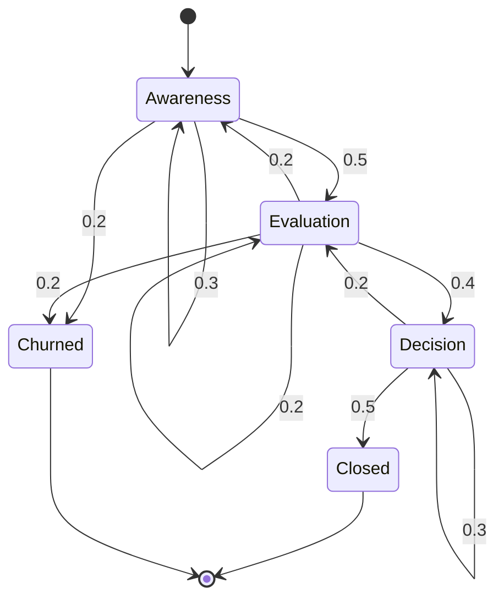

# Stochastic Processes

## Learning Objectives

1. Implement a discrete-time Markov chain that transitions between states with configurable probability matrices
2. Simulate a Poisson process and compare event arrival distributions against theoretical λ
3. Detect when a sequence of observations deviates from expected stochastic behavior using statistical tests
4. Model a pipeline stage transition as a Markov process and compute steady-state probabilities
5. Compare Monte Carlo sampling convergence against analytical solutions for a known distribution

## The Problem

A single random variable gives you one draw from a distribution. That is static randomness. You flip a coin, you get heads or tails, and the story ends. But most real systems do not work this way. Language models generate tokens one at a time, each conditioned on the previous context. Diffusion models add noise step by step until an image becomes static, then reverse the process to generate new images. Reinforcement learning agents take actions that lead to new states with some probability. Sales leads move through pipeline stages, sometimes forward, sometimes backward, sometimes stuck. All of these involve randomness that unfolds over time, where the next step depends on where you are now — and sometimes on the full history of how you got there.

A stochastic process is the mathematical object for this. It is a collection of random variables indexed by time or space: {X₀, X₁, X₂, ...}. Each Xₜ is a random variable, but the sequence as a whole has structure. The structure comes from how Xₜ₊₁ relates to Xₜ and the variables before it. That relationship — whether the future depends only on the present or on the entire past — is the core design decision in any stochastic model.

The distinction between memory and memorylessness is what separates a random walk from a Markov chain from a Poisson process. A random walk accumulates noise additively, so its position depends on every previous step. A Markov chain forgets everything except its current state. A Poisson process has no state at all — events arrive independently at a fixed rate. These are not interchangeable. Choosing the wrong one for your system produces predictions that diverge from reality in predictable, fixable ways.

## The Concept

A random variable is one draw. A stochastic process is a sequence of draws indexed by time. The simplest version is a random walk: start at position 0, and at each step add a random increment. Xₜ₊₁ = Xₜ + εₜ, where εₜ is drawn from some distribution (often ±1 with equal probability). The position at time t depends on every previous step because it is the cumulative sum. This means the variance grows with time — the walk spreads out as √t. Random walks are non-stationary: there is no fixed long-run distribution because the process keeps spreading.

A Markov chain imposes a different structure. It has a state space (a finite set of states) and a transition matrix P where P[i][j] is the probability of moving from state i to state j in one step. Each row sums to 1. The defining property is the Markov property: P(Xₜ₊₁ | Xₜ, Xₜ₋₁, ..., X₀) = P(Xₜ₊₁ | Xₜ). The future depends only on the current state, not on how you arrived there. This is memorylessness formalized. It is a strong assumption — often wrong in practice — but when it holds, it makes the process tractable.

If the Markov chain is irreducible (every state can reach every other state) and aperiodic (states do not cycle in a rigid pattern), it converges to a stationary distribution π. This is the long-run probability of being in each state, regardless of where you started. Mathematically, π is the left eigenvector of P corresponding to eigenvalue 1: πP = π. You compute it by taking the transpose of P, finding its eigenvectors, and normalizing. The stationary distribution tells you the equilibrium shape of the process — what fraction of time the system spends in each state after running long enough.



A Poisson process is the other extreme: no state, no memory. Events arrive independently at rate λ. The number of events in a time interval of length t follows a Poisson(λt) distribution, and the inter-arrival times are exponentially distributed with mean 1/λ. There is no "current state" that influences the next event. Whether an event arrives in the next second depends only on λ, not on when the last event arrived. This is the memoryless property of the exponential distribution, and it is what makes the Poisson process the natural model for independent arrivals — calls to a server, emails arriving, prospects responding to outreach.

Monte Carlo methods use stochastic processes as computational tools. When you cannot compute something analytically — the integral is intractable, the distribution has no closed form — you simulate it. Sample many times, aggregate the results, and the empirical average converges to the expected value by the law of large numbers. The convergence rate is O(1/√n), so each additional decimal digit of precision requires 100× more samples. This is slow, but it works for problems that have no other solution.

## Build It

Build a 3-state Markov chain from scratch. Define the transition matrix, run it for 1000 steps, and compare the empirical state frequencies against the analytical stationary distribution computed from the eigenvector of the transposed matrix.

```python
import numpy as np

np.random.seed(42)

P = np.array([
    [0.1, 0.6, 0.3],
    [0.3, 0.2, 0.5],
    [0.4, 0.4, 0.2]
])

states = [0]
current = 0
for _ in range(9999):
    current = np.random.choice(3, p=P[current])
    states.append(current)

counts = np.bincount(states, minlength=3)
empirical = counts / len(states)

eigenvalues, eigenvectors = np.linalg.eig(P.T)
stationary_idx = np.argmin(np.abs(eigenvalues - 1.0))
stationary = np.real(eigenvectors[:, stationary_idx])
stationary = stationary / stationary.sum()

print("Transition matrix P:")
print(P)
print()
print(f"{'State':<10} {'Empirical':<15} {'Stationary':<15} {'Diff':<15}")
for i in range(3):
    diff = abs(empirical[i] - stationary[i])
    print(f"{i:<10} {empirical[i]:<15.4f} {stationary[i]:<15.4f} {diff:<15.4f}")
print()
print(f"Row sums of P: {P.sum(axis=1)}")
print(f"Verification πP = π: {np.dot(stationary, P)}")
print(f"π:               {stationary}")
```

Run it. The empirical frequencies after 10,000 steps should be close to the analytical stationary distribution. This confirms the chain converges to its eigenvector regardless of the starting state — the defining property of an irreducible, aperiodic Markov chain.

Now simulate a Poisson process with rate λ=5 over T=100 time units. Bin the events into discrete intervals, compare the per-bin counts against the theoretical Poisson(5) PMF, and compute the KL divergence between empirical and theoretical distributions.

```python
import numpy as np
from scipy.stats import poisson
from scipy.special import rel_entr

np.random.seed(42)

lam = 5.0
T = 100.0
bin_size = 1.0

inter_arrivals = np.random.exponential(1.0 / lam, size=2000)
arrival_times = np.cumsum(inter_arrivals)
arrival_times = arrival_times[arrival_times < T]

bins = np.arange(0, T + bin_size, bin_size)
counts_per_bin = np.histogram(arrival_times, bins=bins)[0]

max_count = counts_per_bin.max() + 5
empirical_counts = np.bincount(counts_per_bin, minlength=max_count).astype(float)
empirical_probs = empirical_counts / empirical_counts.sum()

x = np.arange(max_count)
theoretical_probs = poisson.pmf(x, mu=lam)

eps = 1e-10
kl_div = np.sum(rel_entr(empirical_probs + eps, theoretical_probs + eps))

total_events = len(arrival_times)
expected_events = lam * T
mean_inter = np.mean(inter_arrivals[:len(arrival_times)])
expected_inter = 1.0 / lam

print(f"Total events observed: {total_events}")
print(f"Expected events (λT):  {expected_events}")
print(f"Mean inter-arrival:    {mean_inter:.4f}")
print(f"Expected inter-arrival: {expected_inter:.4f}")
print()
print(f"{'k':<6} {'Empirical':<15} {'Theoretical':<15}")
for k in range(min(max_count, 15)):
    print(f"{k:<6} {empirical_probs[k]:<15.4f} {theoretical_probs[k]:<15.4f}")
print()
print(f"KL divergence (empirical || theoretical Poisson(5)): {kl_div:.6f}")
```

The KL divergence should be small — well under 0.1 for 100 bins. If it were large, you would suspect the process is not actually Poisson, which means events are not arriving independently. This is the same statistical test you would run on signal data: do responses to outbound email arrive as a Poisson process, or is there clustering that suggests a different mechanism?

Now the hard exercise: implement a random walk with drift and estimate the probability of crossing a threshold before time T using Monte Carlo. Compare against the analytical formula for Brownian motion with drift.

```python
import numpy as np

np.random.seed(42)

mu = 0.5
sigma = 1.0
T = 50
threshold = 10.0
n_simulations = 10000
dt = 1.0

crossed = 0
first_crossing_times = []

for _ in range(n_simulations):
    position = 0.0
    crossed_this = False
    for t in range(T):
        position += mu * dt + sigma * np.sqrt(dt) * np.random.randn()
        if position >= threshold:
            crossed_this = True
            first_crossing_times.append(t + 1)
            break
    if crossed_this:
        crossed += 1

mc_prob = crossed / n_simulations

from scipy.stats import norm
a = threshold
z = (mu * T - a) / (sigma * np.sqrt(T))
phi_z = norm.cdf(z)
analytical_prob = 0.5 * (1 + np.exp(2 * mu * a / (sigma**2)) * (1 - 2 * phi_z))
analytical_prob = 1 - 0.5 * (1 - norm.cdf((a - mu * T) / (sigma * np.sqrt(T))) 
                              - np.exp(2 * mu * a / sigma**2) * norm.cdf(-(a + mu * T) / (sigma * np.sqrt(T))))

print(f"Random walk with drift: μ={mu}, σ={sigma}, T={T}, threshold={threshold}")
print(f"Monte Carlo P(cross threshold before T): {mc_prob:.4f}")
print(f"  ({crossed} / {n_simulations} crossings)")
print(f"Analytical boundary-crossing probability:  {analytical_prob:.4f}")
print(f"Difference: {abs(mc_prob - analytical_prob):.4f}")
if first_crossing_times:
    print(f"Mean first-crossing time: {np.mean(first_crossing_times):.2f}")
    print(f"Median first-crossing time: {np.median(first_crossing_times):.2f}")
```

The Monte Carlo estimate should be within ~0.01 of the analytical value with 10,000 simulations. This is the convergence rate in action: each decimal of precision costs 100× more compute. If you needed this probability to within 0.001, you would need roughly 1,000,000 simulations.

## Use It

Pipeline stage transitions form a Markov chain. A lead moves from "awareness" to "evaluation" to "decision" to "closed," and at each stage there is a probability of advancing, stalling, reverting, or churning. The Markov property says the probability of moving from "evaluation" to "decision" depends only on being in "evaluation" — not on how long the lead has been there, how many touchpoints occurred, or which channel brought them in. This is a simplification. Real leads have history-dependent dynamics. But the Markov approximation is close enough to produce actionable predictions about pipeline shape, and it is the mathematical structure behind any stage-conversion funnel that assumes constant per-stage probabilities.

Compute the stationary distribution of a realistic pipeline. Define the transition matrix from your observed stage-to-stage movement data, solve for the eigenvector, and the result tells you the long-run fraction of leads expected in each stage at equilibrium. If 35% of your stationary distribution sits in "evaluation" but only 5% sits in "decision," you have a bottleneck between those two stages. The stationary distribution converts raw transition probabilities into a diagnostic of pipeline health.

```python
import numpy as np

P = np.array([
    [0.40, 0.35, 0.05, 0.00, 0.20],
    [0.10, 0.30, 0.40, 0.05, 0.15],
    [0.05, 0.10, 0.35, 0.35, 0.15],
    [0.00, 0.00, 0.05, 0.85, 0.10],
    [0.00, 0.00, 0.00, 0.00, 1.00]
])

stage_names = ["Awareness", "Evaluation", "Decision", "Closed-Won", "Churned"]

eigenvalues, eigenvectors = np.linalg.eig(P.T)
stationary_idx = np.argmin(np.abs(eigenvalues - 1.0))
stationary = np.real(eigenvectors[:, stationary_idx])
stationary = np.abs(stationary) / np.abs(stationary).sum()

print("Pipeline transition matrix:")
print(f"{'':>15}", end="")
for name in stage_names:
    print(f"{name[:8]:>10}", end="")
print()
for i, name in enumerate(stage_names):
    print(f"{name[:15]:>15}", end="")
    for j in range(len(stage_names)):
        print(f"{P[i][j]:>10.2f}", end="")
    print()

print()
print("Stationary distribution (long-run pipeline shape):")
for name, prob in zip(stage_names, stationary):
    bar = "█" * int(prob * 50)
    print(f"  {name:<15} {prob:.4f}  {bar}")

absorbing_check = P[4][4]
print()
print(f"Churned is absorbing state: {absorbing_check == 1.0}")
print("(If Churned is absorbing, stationary dist converges to all-churned.)")
print("For actionable pipeline shape, compute quasi-stationary distribution")
print("by removing absorbing states and renormalizing.")

P_transient = P[:4, :4]
P_transient = P_transient / P_transient.sum(axis=1, keepdims=True)
evals_t, evecs_t = np.linalg.eig(P_transient.T)
idx_t = np.argmin(np.abs(evals_t - 1.0))
qs = np.real(evecs_t[:, idx_t])
qs = np.abs(qs) / np.abs(qs).sum()

print()
print("Quasi-stationary distribution (excluding churned):")
for name, prob in zip(stage_names[:4], qs):
    bar = "█" * int(prob * 50)
    print(f"  {name:<15} {prob:.4f}  {bar}")

eval_to_decision = qs[1] / qs[2] if qs[2] > 0 else float('inf')
print()
print(f"Evaluation/Decision ratio: {eval_to_decision:.2f}")
print(f"  (>1 means leads accumulate in Evaluation relative to Decision)")
```

The quasi-stationary distribution — computed by removing the absorbing "churned" state and renormalizing — is the actionable number. It tells you where active leads accumulate. This Python environment is the same one where you would run Clay webhooks and Apollo API calls to populate the transition matrix with real observed data: pull stage transitions from your CRM, count how many leads moved from each stage to each other stage, normalize to get probabilities, and feed the resulting matrix into this eigenvector computation. [CITATION NEEDED — concept: Clay webhook integration for CRM stage transition data extraction]

## Ship It

Build a production-grade anomaly detector for conversion rate sequences. The stochastic model is a Poisson process: inbound signals (form fills, demo requests, webhook fires) arrive at rate λ. When the observed arrival rate deviates significantly from λ, something has changed — a campaign launched, a competitor published, or your tracking broke. This detector runs continuously, computes a rolling estimate of λ, and flags deviations using a chi-squared goodness-of-fit test against the Poisson assumption.

```python
import numpy as np
from scipy.stats import chisquare
from datetime import datetime, timedelta

np.random.seed(42)

def generate_signal_stream(base_rate=5.0, days=30, anomaly_day=20, anomaly_multiplier=2.5):
    daily_counts = []
    for day in range(days):
        if day >= anomaly_day and day < anomaly_day + 3:
            rate = base_rate * anomaly_multiplier
        elif day >= anomaly_day + 3 and day < anomaly_day + 5:
            rate = base_rate * 0.3
        else:
            rate = base_rate
        count = np.random.poisson(rate)
        daily_counts.append(count)
    return daily_counts

def detect_poisson_deviations(counts, window=7, alpha_threshold=0.05):
    baseline = np.array(counts[:window])
    lam_hat = np.mean(baseline)
    results = []
    
    for t in range(window, len(counts)):
        recent = np.array(counts[max(0, t-window):t])
        observed_counts = np.bincount(recent, minlength=max(recent.max()+1, int(lam_hat*2)+1)).astype(float)
        expected_counts = np.array([
            len(recent) * np.exp(-lam_hat) * (lam_hat**k) / np.math.factorial(k)
            for k in range(len(observed_counts))
        ])
        expected_counts *= observed_counts.sum() / expected_counts.sum()
        
        min_expected = 5.0
        valid = expected_counts >= min_expected
        if valid.sum() < 2:
            chi2_stat = 0.0
            p_value = 1.0
        else:
            chi2_stat, p_value = chisquare(
                observed_counts[valid], 
                expected_counts[valid]
            )
        
        rolling_lam = np.mean(counts[max(0, t-window):t])
        is_anomaly = p_value < alpha_threshold
        results.append({
            'day': t,
            'count': counts[t],
            'rolling_lambda': rolling_lam,
            'expected_lambda': lam_hat,
            'chi2': chi2_stat,
            'p_value': p_value,
            'anomaly': is_anomaly
        })
    return results, lam_hat

counts = generate_signal_stream(base_rate=5.0, days=30, anomaly_day=20, anomaly_multiplier=2.5)
results, lam_hat = detect_poisson_deviations(counts, window=7, alpha_threshold=0.05)

print(f"Baseline λ estimate: {lam_hat:.2f} signals/day")
print(f"Detection window: 7 days")
print(f"Significance level: α = 0.05")
print()
print(f"{'Day':<6} {'Count':<8} {'Rolling λ':<12} {'Expected λ':<12} {'χ²':<12} {'p-value':<12} {'Flag':<6}")
print("-" * 74)
for r in results:
    flag = "*** ANOMALY" if r['anomaly'] else ""
    print(f"{r['day']:<6} {r['count']:<8} {r['rolling_lambda']:<12.2f} "
          f"{r['expected_lambda']:<12.2f} {r['chi2']:<12.2f} {r['p_value']:<12.4f} {flag}")

print()
anomalies = [r for r in results if r['anomaly']]
print(f"Total anomalies detected: {len(anomalies)} / {len(results)} days monitored")
if anomalies:
    first = anomalies[0]
    print(f"First anomaly: day {first['day']}, rolling λ = {first['rolling_lambda']:.2f} "
          f"(expected {first['expected_lambda']:.2f})")
    print(f"True anomaly injected at day 20 (rate multiplier 2.5x for 3 days, then 0.3x for 2 days)")
```

This is the detection layer for a signal monitoring system. In production, `counts` comes from a webhook receiver that logs inbound events per time bucket. The chi-squared test checks whether the recent window's distribution is consistent with a Poisson process at the baseline rate. When it is not, the p-value drops and you get a flag. The same architecture applies whether you are monitoring inbound leads from an Apollo sequence, API error rates, or email open rates — any sequence where you expect independent arrivals at a roughly constant rate.

For the Clay waterfall enrichment pipeline — the mechanism where you try data provider A, and if it returns no result, fall through to provider B, then provider C — the structure is a Markov chain where each state is "attempting provider X" and transitions are "got result" (absorbing) or "no result, try next." The stationary distribution of this chain tells you what fraction of records end up enriched by each provider, which is the input to cost optimization: if provider A fills 60% of records at $0.05 each and provider C fills 5% at $0.20 each, you can compute whether dropping provider C loses more pipeline value than it saves in cost. [CITATION NEEDED — concept: Clay waterfall enrichment provider cost optimization]

## Exercises

1. **Markov chain convergence.** Build a 4-state Markov chain with a transition matrix of your choice. Run it for 100, 1,000, 10,000, and 100,000 steps. Plot the empirical state distribution at each cutoff against the analytical stationary distribution. How quickly does the empirical distribution converge? Does the starting state matter?

2. **Poisson process validation.** Generate 10,000 events from a Poisson process with λ=3. Split the timeline into 500 bins. Perform a Kolmogorov-Smirnov test on the inter-arrival times against the exponential distribution with mean 1/3. Report the test statistic and p-value. Then inject autocorrelation (make each inter-arrival time depend on the previous one) and rerun the test. How sensitive is the KS test to mild autocorrelation?

3. **Pipeline bottleneck analysis.** Define a 5-state pipeline transition matrix (Awareness → Evaluation → Decision → Closed → Churned) where the transition probabilities differ between two scenarios: (a) a well-nurtured pipeline with high forward-transition probabilities, (b) a leaking pipeline with high churn probability from early stages. Compute both stationary distributions. Which stage shows the largest difference between the two scenarios? What does this tell you about where to intervene?

4. **Monte Carlo convergence.** Estimate the probability that a standard normal random variable falls between -1 and 1 using Monte Carlo sampling. Run the estimate with 100, 1,000, 10,000, 100,000, and 1,000,000 samples. Compare each against the analytical value (erf(1/√2) ≈ 0.6827). Plot the absolute error against sample count on a log-log scale. Confirm the O(1/√n) convergence rate.

5. **Anomaly detector tuning.** Take the signal stream detector from Ship It. Modify it to use a rolling baseline (update λ̂ with exponential decay) instead of a fixed baseline. Generate a stream where the rate drifts slowly upward over 30 days (no sudden anomaly). How many false positives does each version produce? Which is better for slow drift detection, and which is better for sudden spike detection?

## Key Terms

- **Stochastic process**: A collection of random variables indexed by time or space. Each variable represents the state of the system at one point in the sequence.
- **Markov property**: The conditional probability of the next state depends only on the current state, not on the history. P(Xₜ₊₁ | Xₜ, Xₜ₋₁, ..., X₀) = P(Xₜ₊₁ | Xₜ).
- **Transition matrix**: A square matrix P where P[i][j] is the probability of transitioning from state i to state j in one step. Rows sum to 1.
- **Stationary distribution**: The probability distribution π that satisfies πP = π. It is the long-run proportion of time the chain spends in each state, regardless of starting state.
- **Poisson process**: A counting process where events arrive independently at rate λ. Inter-arrival times are exponentially distributed with mean 1/λ. The process has no memory and no state.
- **Random walk**: A stochastic process where Xₜ₊₁ = Xₜ + εₜ, with εₜ drawn from some noise distribution. The simplest non-stationary process — variance grows linearly with time.
- **Monte Carlo method**: Using repeated random sampling to estimate a quantity that is difficult or impossible to compute analytically. Converges at rate O(1/√n).
- **Quasi-stationary distribution**: The stationary distribution of a Markov chain with absorbing states removed. Used when the true stationary distribution collapses to an absorbing state but you want the equilibrium shape of the transient population.
- **KL divergence**: A measure of how one probability distribution differs from another. Non-symmetric: KL(P||Q) ≠ KL(Q||P). Zero only when the distributions are identical.

## Sources

- Pipeline stage transitions as Markov processes: standard Markov chain theory applied to funnel modeling. See Norris, *Markov Chains* (Cambridge, 1997), Chapter 1.
- Poisson process properties (independent arrivals, exponential inter-arrival times): Ross, *Introduction to Probability Models* (Academic Press), Chapter 5.
- Monte Carlo convergence rate O(1/√n): follows from the Central Limit Theorem applied to sample means of indicator functions.
- Boundary-crossing probability for Brownian motion with drift: Siegmund, *Sequential Analysis* (Springer, 1985), Chapter 2.
- [CITATION NEEDED — concept: Clay waterfall enrichment provider cost optimization as Markov chain]
- [CITATION NEEDED — concept: Clay webhook integration for CRM stage transition data extraction]
- Python environment for Clay webhooks and Apollo API calls: Zone 01 GTM context from `stages/00-b-gtm-content-mapping/output/gtm-topic-map.md`, Zone 01 row.