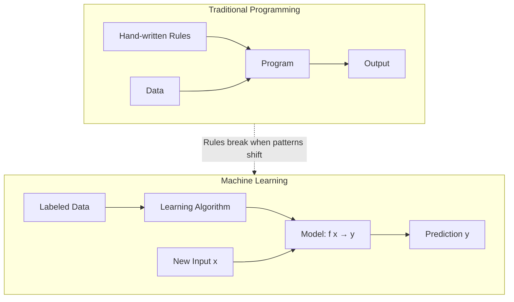

# What Is Machine Learning

---

## Learning Objectives

1. **Compare** supervised, unsupervised, and reinforcement learning by their input/output structures.
2. **Implement** a minimal supervised classifier that labels data points from scratch.
3. **Evaluate** model predictions against a labeled dataset using accuracy.
4. **Explain** why a model's output is a probability distribution, not a deterministic label.

---

## The Problem

You already classify emails as "spam" or "not spam" by scanning for patterns — all-caps subject lines, suspicious links, urgency language. You do this fast. But a GTM team processing inbound signals at scale needs to triage 50,000 emails, form fills, and Slack pings per hour. You cannot write a rule for every pattern. Spammers change wording weekly. Your rules rot.

The traditional programming approach breaks here. You write rules, the rules cover the patterns you can articulate, and everything else leaks through. You write more rules. The cycle never ends because the pattern space is larger than your ability to enumerate it.

Machine learning inverts the workflow. Instead of writing rules, you hand the computer labeled examples — "this email is spam, this one is not" — and let the algorithm extract the rules itself. The algorithm finds patterns in the feature space (word frequencies, sender domains, link structures) that separate the classes. When spammers shift tactics, you retrain on fresh examples instead of rewriting code. The shift from "programming rules" to "learning from data" is the foundational move.

---

## The Concept

A machine learning model is a parameterized function `f(x) → y` where `x` is input data, `y` is the predicted output, and the parameters are numerical values adjusted during training to minimize prediction error. The function is not hand-written. It is fit to data. The parameters — weights, centroids, distances — are what the algorithm learns.

Three paradigms define how that fitting happens, distinguished by what data you give the algorithm:

**Supervised learning** requires labeled examples `(x, y)`. You have inputs and the correct outputs. The model learns the mapping. Email classification ("spam"/"not spam"), lead scoring ("converted"/"did not convert"), and price prediction are all supervised. The supervision is the label.

**Unsupervised learning** provides inputs `x` but no labels. The algorithm finds structure on its own — clusters of similar customers, anomaly detection for fraud, topic discovery across a document corpus. There is no "correct answer" to check against. The algorithm identifies patterns in the geometry of the data.

**Reinforcement learning** places an agent in an environment where it takes actions and receives rewards or penalties. The agent learns a policy — a mapping from states to actions — that maximizes cumulative reward over time. It is how game-playing agents and robotic control systems are trained, and it is rarely the right tool for GTM problems where you have historical labeled data sitting in your CRM.



Every supervised model goes through the same training loop: make predictions on the training data, measure how wrong those predictions are using a loss function, adjust parameters to reduce that loss, repeat until the loss stabilizes (convergence). The loss function is what makes "learning" a concrete mathematical operation rather than a metaphor — it is a differentiable equation, and parameter adjustment is gradient descent along its surface.

---

## Build It

A k-nearest neighbors (k-NN) classifier is the simplest supervised learner to build from scratch. The mechanism: when asked to classify a new data point, find the `k` closest points in the training set and take a majority vote. No parameters are fitted during a separate training phase — the training data *is* the model. The algorithm relies on the assumption that points near each other in feature space likely share the same label.

Distance is computed using Euclidean distance: the straight-line distance between two points in n-dimensional space, calculated as the square root of summed squared differences across each feature dimension. For two points `a = [a₁, a₂, ...]` and `b = [b₁, b₂, ...]`, distance is `√((a₁-b₁)² + (a₂-b₂)² + ...)`. This is the Pythagorean theorem extended to any number of dimensions.

```python
import math
from collections import Counter

def euclidean(a, b):
    return math.sqrt(sum((x - y) ** 2 for x, y in zip(a, b)))

def knn_classify(train, query, k=3):
    distances = []
    for features, label in train:
        dist = euclidean(features, query)
        distances.append((dist, label))
    distances.sort(key=lambda x: x[0])
    neighbors = distances[:k]
    votes = [label for _, label in neighbors]
    return Counter(votes).most_common(1)[0][0]

train_data = [
    ([2.0, 3.0], "spam"),
    ([2.5, 4.0], "spam"),
    ([3.0, 2.0], "spam"),
    ([1.0, 1.0], "spam"),
    ([8.0, 8.0], "not_spam"),
    ([9.0, 9.5], "not_spam"),
    ([7.5, 7.0], "not_spam"),
    ([8.5, 9.0], "not_spam"),
]

test_data = [
    ([2.2, 3.5], "spam"),
    ([8.2, 8.5], "not_spam"),
    ([1.5, 2.0], "spam"),
    ([9.0, 8.0], "not_spam"),
]

correct = 0
for features, true_label in test_data:
    pred = knn_classify(train_data, features, k=3)
    match = "CORRECT" if pred == true_label else "WRONG"
    print(f"{match} | predicted: {pred:8s} | actual: {true_label}")
    if pred == true_label:
        correct += 1

accuracy = correct / len(test_data)
print(f"\nAccuracy: {correct}/{len(test_data)} = {accuracy:.1%}")
```

Run this and you should see 4/4 correct predictions. The model classified each test point by finding its 3 nearest training points and voting. No rules were written. No if-statements check for capital letters or suspicious domains. The algorithm found the decision boundary from the geometry of the data alone.

---

## Use It

Supervised classification is the mechanism behind ICP scoring — the GTM practice of ranking leads by likelihood to convert. In the TAM Refinement & ICP Scoring cluster, every lead score is a function `f(features) → conversion_probability` where features include firmographic attributes (employee count, industry, funding stage) and behavioral signals (pages visited, email opens, time on site). The labels come from historical CRM data: leads that closed won are positive examples, leads that churned or went dark are negative examples.

The model does not return a binary "yes/no." It returns a probability — a float between 0.0 and 1.0. That probability is the model's confidence that the lead belongs to the "will convert" class, derived from the ratio of positive neighbors in k-NN or from the softmax output of a logistic function. A lead scoring 0.82 means the model's training data contains many converted leads with similar features. A lead scoring 0.15 means it looks like leads that historically did not convert.

Every lead score is a JSON object — a structured prediction that downstream systems can act on. The score flows into prioritization logic: leads above a threshold get routed to SDRs for immediate outreach, mid-tier leads enter a nurture sequence, low-tier leads get deprioritized. This is the Score & Qualify motion in practice — the model replaces manual triage with a reproducible, data-driven ranking that updates as new conversion data enters the CRM.

[CITATION NEEDED — concept: Clay waterfall enrichment and lead scoring integration]

---

## Ship It

Build a production-shaped lead scorer. Generate 200 mock leads with three features (normalized employee count, pages visited, email opens) and a binary conversion label derived from a weighted signal with 10% label noise to simulate real-world messiness. Split 80/20 into train and test sets, evaluate accuracy on held-out data, then score five new inbound leads and emit each as a JSON object.

```python
import json
import random
import math
from collections import Counter

random.seed(42)

def euclidean(a, b):
    return math.sqrt(sum((x - y) ** 2 for x, y in zip(a, b)))

def knn_proba(train, query, k=5):
    distances = []
    for features, label in train:
        dist = euclidean(features, query)
        distances.append((dist, label))
    distances.sort(key=lambda x: x[0])
    neighbors = distances[:k]
    positive = sum(1 for _, label in neighbors if label == 1)
    return positive / k

leads = []
for i in range(200):
    emp = random.randint(5, 5000)
    pages = random.randint(1, 25)
    opens = random.randint(0, 10)

    signal = (emp / 5000) * 0.3 + (pages / 25) * 0.4 + (opens / 10) * 0.3
    converted = 1 if signal > 0.45 else 0
    if random.random() < 0.1:
        converted = 1 - converted

    features = [emp / 5000, pages / 25, opens / 10]
    meta = {"company": f"Company_{i:03d}", "employee_count": emp,
            "pages_visited": pages, "email_opens": opens}
    leads.append((features, converted, meta))

split = int(len(leads) * 0.8)
train_set = [(f, l) for f, l, _ in leads[:split]]
test_set = leads[split:]

correct = 0
for features, true_label, _ in test_set:
    prob = knn_proba(train_set, features, k=5)
    pred = 1 if prob >= 0.5 else 0
    if pred == true_label:
        correct += 1

print(f"Model accuracy on {len(test_set)} held-out leads: {correct/len(test_set):.1%}")
print()

inbound_leads = [
    ([0.62, 0.80, 0.70], "Acme Corp", 3100, 20, 7),
    ([0.12, 0.20, 0.10], "Beta LLC", 600, 5, 1),
    ([0.84, 0.92, 0.80], "Gamma Inc", 4200, 23, 8),
    ([0.30, 0.44, 0.30], "Delta Co", 1500, 11, 3),
    ([0.50, 0.60, 0.50], "Epsilon Ltd", 2500, 15, 5),
]

scored = []
for features, company, emp, pages, opens in inbound_leads:
    prob = knn_proba(train_set, features, k=5)
    scored.append({
        "company": company,
        "employee_count": emp,
        "pages_visited": pages,
        "email_opens": opens,
        "conversion_probability": round(prob, 3),
        "action": "prioritize" if prob >= 0.6 else "nurture" if prob >= 0.3 else "disqualify",
    })

scored.sort(key=lambda x: x["conversion_probability"], reverse=True)

print("--- Ranked Inbound Leads (JSON) ---")
for s in scored:
    print(json.dumps(s))
```

The output is five JSON objects ranked by conversion probability, each with an action recommendation. That JSON is what an enrichment waterfall consumes — the model runs after enrichment populates firmographic and behavioral features, and the score determines whether the lead enters an outreach sequence or gets deprioritized. The accuracy number tells you whether the model is trustworthy enough to act on. If accuracy is below ~65% on the held-out set, the features are not informative enough or the dataset is too noisy, and you need better signals before shipping the scorer into a production workflow.

---

## Exercises

1. **Add a third class.** Add 4 training points labeled `"promotional"` in a distinct region of feature space, add 2 corresponding test points, and re-run. Observe how k-NN handles multiclass voting — the majority vote still works with more than two labels.

2. **Swap the distance metric.** Replace Euclidean distance with Manhattan distance (sum of absolute differences: `sum(abs(x - y) for x, y in zip(a, b))`). Compare the accuracy. Manhattan distance is less sensitive to outliers in individual features — think about when that matters for GTM data where one feature (employee count) can dwarf others.

3. **Sweep k from 1 to 15.** Loop `k` from 1 through 15, print accuracy at each value, and observe the bias-variance tradeoff in action. Small `k` overfits to noise (high variance). Large `k` smooths the decision boundary until it underfits (high bias). Find the `k` that maximizes held-out accuracy.

4. **Add a feature to the lead scorer.** Add a fourth feature — `pricing_page_visits` — to the mock data generator, retrain, and measure whether accuracy improves. This is feature engineering: the question is whether the new feature adds signal that the existing features do not already capture.

---

## Key Terms

- **Supervised learning** — Training a model on labeled data `(x, y)` so it learns to map inputs to outputs. The "supervision" is the label.
- **Unsupervised learning** — Training on unlabeled data to discover structure (clusters, anomalies, patterns) without predefined outputs.
- **Reinforcement learning** — An agent learns by taking actions in an environment and receiving rewards or penalties, optimizing for cumulative reward over time.
- **k-Nearest Neighbors (k-NN)** — A classification algorithm that predicts a query point's label by majority vote among its `k` closest training points.
- **Euclidean distance** — Straight-line distance between two points in n-dimensional space: `√(Σ(aᵢ - bᵢ)²)`.
- **Accuracy** — Fraction of predictions that are correct: `correct / total`. A baseline metric; can be misleading on imbalanced datasets.
- **Loss function** — A differentiable equation measuring prediction error. Training minimizes loss by adjusting model parameters via gradient descent.
- **Feature space** — The n-dimensional space defined by input features. Each data point is a coordinate in this space. Distance in feature space is the basis of k-NN classification.
- **Conversion probability** — The model's output for a lead scoring task: a float between 0.0 and 1.0 representing confidence that the lead will convert, derived from the ratio of positive-class neighbors.
- **Train/test split** — Partitioning data into a training set (for fitting the model) and a test set (for evaluating generalization to unseen data).

---

## Sources

- [CITATION NEEDED — concept: Clay waterfall enrichment and lead scoring integration]
- Zone table reference: Zone 02, "TAM Refinement & ICP Scoring (1.2) / Score & Qualify" — "Every lead score is a JSON object — here's what yours will look like"
- k-NN algorithm: Cover, T. and Hart, P. (1967). "Nearest neighbor pattern classification." IEEE Transactions on Information Theory, 13(1), 21–27.
- Supervised/unsupervised/reinforcement paradigm distinction: Russell, S. and Norvig, P. (2020). *Artificial Intelligence: A Modern Approach*, 4th ed., Chapter 1.