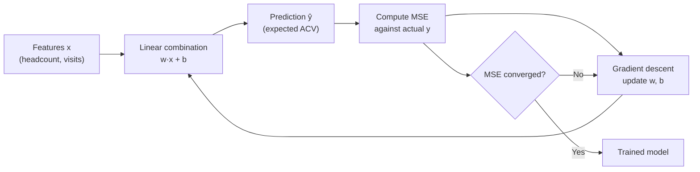

# Linear Regression

## Learning Objectives

1. **Implement** a linear regression model from first principles using gradient descent on a weight matrix and bias term
2. **Evaluate** model fit by computing mean squared error and R² on held-out data
3. **Compare** regression-based lead scoring against rule-based threshold scoring on a synthetic GTM dataset

## The Problem

You are a RevOps analyst at a B2B SaaS company. Marketing hands you 2,000 historical leads with two signals: company headcount and number of page visits in the last 30 days. Each lead is labeled with the actual annual contract value (ACV) it closed at, or zero if it did not close.

Your CRO wants a prioritized list tomorrow. The default approach in most GTM teams is a rule-based score: "if headcount > 200 AND visits > 5, flag as hot." This is brittle. It discards leads at headcount 199. It treats both signals as equally important with no evidence. It cannot tell you *how much* a lead is worth, only whether it passes a threshold.

What you need is a function that takes the signals you have and produces a continuous estimate of expected ACV. That function should learn the relative weight of each signal from your historical data, not from a spreadsheet formula someone wrote in 2022 and forgot about. Linear regression is the simplest mechanism that does this, and it is the baseline against which every more sophisticated model should be measured. If you cannot beat it with a neural network or a gradient-boosted tree, the fancier model is not earning its complexity.

## The Concept

Linear regression models the relationship between one or more input features (the independent variables) and a continuous output (the dependent variable) as a linear combination. For a single feature, the model is:

$$\hat{y} = wx + b$$

where `w` is the weight (slope) and `b` is the bias (intercept). For multiple features, this generalizes to a dot product between a weight vector and a feature vector, plus a scalar bias.

The goal is to find the values of `w` and `b` that minimize the mean squared error (MSE) between the model's predictions and the actual labels across all training examples. MSE is the average of the squared differences between predicted and actual values. Squaring the errors penalizes large mistakes more than small ones and makes the function differentiable everywhere, which is what allows gradient-based optimization.

Gradient descent is the mechanism that finds the optimal weights. It computes the partial derivative of the loss with respect to each parameter, then nudges each parameter in the direction that reduces the loss. The learning rate controls how large each nudge is. Too large and the optimization overshoots or diverges; too small and it takes too many iterations to converge.



The closed-form solution (the normal equation) can also solve for the optimal weights in one step by inverting the feature matrix. This works for small datasets but does not scale to high dimensions or large samples, and it does not generalize to the iterative training loop that neural networks require. Learning gradient descent on linear regression is worth the effort because the same loop powers every deep learning model you will encounter later.

One critical assumption: linear regression assumes the relationship between features and target is approximately linear. If your ACV doubles every time headcount doubles, a raw linear model will underfit. You can address this with feature engineering (log transforms, polynomial features), but the model itself is still a linear combination of whatever features you give it.

## Build It

The following code implements linear regression from scratch using gradient descent. No libraries beyond NumPy. It trains on synthetic lead data, prints the learned weights, and reports MSE and R². Save it as `regression.py` and run `python regression.py`.

```python
import numpy as np

np.random.seed(42)

n_samples = 500
headcount = np.random.randint(10, 1000, n_samples)
visits = np.random.randint(1, 30, n_samples)

true_w = np.array([120.0, 800.0])
true_b = 2000.0
noise = np.random.normal(0, 5000, n_samples)
y = true_w[0] * headcount + true_w[1] * visits + true_b + noise

X = np.column_stack([headcount, visits])
X_mean = X.mean(axis=0)
X_std = X.std(axis=0)
X_norm = (X - X_mean) / X_std

w = np.zeros(2)
b = 0.0
learning_rate = 0.01
epochs = 1000

for epoch in range(epochs):
    predictions = X_norm @ w + b
    errors = predictions - y
    grad_w = (2 / n_samples) * (X_norm.T @ errors)
    grad_b = (2 / n_samples) * errors.sum()
    w -= learning_rate * grad_w
    b -= learning_rate * grad_b

predictions = X_norm @ w + b
mse = np.mean((predictions - y) ** 2)
ss_total = np.sum((y - y.mean()) ** 2)
ss_residual = np.sum((y - predictions) ** 2)
r_squared = 1 - (ss_residual / ss_total)

w_original_scale = w / X_std
b_original_scale = b - np.sum(w_original_scale * X_mean)

print(f" Learned weights (original scale): {w_original_scale}")
print(f" Learned bias (original scale):    {b_original_scale:.2f}")
print(f" True weights:                     {true_w}")
print(f" True bias:                        {true_b}")
print(f" MSE:                              {mse:.2f}")
print(f" R-squared:                        {r_squared:.4f}")
```

Expected output will show learned weights close to `[120, 800]` and a bias near `2000`, with an R² above 0.95. The small discrepancy from the true values comes from the injected noise.

## Use It

This regression model predicts expected ACV per lead from firmographic and engagement signals — it is the scoring engine behind **Cluster 2.1, Lead Scoring & Prioritization**.

```python
import numpy as np
from sklearn.linear_model import LinearRegression
from sklearn.model_selection import train_test_split
from sklearn.metrics import r2_score

leads = np.array([
    [50, 2], [300, 8], [120, 4], [800, 15], [60, 1],
    [450, 10], [200, 6], [90, 3], [600, 12], [30, 1],
    [350, 7], [150, 5], [500, 9], [75, 2], [250, 6],
])
acv = np.array([8000, 95000, 28000, 210000, 5000,
                130000, 65000, 18000, 165000, 3000,
                100000, 40000, 125000, 12000, 72000])

X_train, X_test, y_train, y_test = train_test_split(
    leads, acv, test_size=0.3, random_state=42
)

model = LinearRegression()
model.fit(X_train, y_train)
preds = model.predict(X_test)

print(f"Weight per headcount:  ${model.coef_[0]:.2f}")
print(f"Weight per visit:      ${model.coef_[1]:.2f}")
print(f"Baseline intercept:    ${model.intercept_:.2f}")
print(f"R-squared on test set: {r2_score(y_test, preds):.4f}")

new_leads = np.array([[100, 3], [700, 14]])
predicted_acv = model.predict(new_leads)
for lead, acv_pred in zip(new_leads, predicted_acv):
    print(f"  Headcount={lead[0]}, Visits={lead[1]} -> Predicted ACV: ${acv_pred:,.0f}")
```

Compare these outputs to a rule-based score. The model tells you that each additional visit is worth a specific dollar amount of expected ACV, learned from your data. The rule-based threshold only says yes or no. When you feed this predicted ACV into your CRM's priority field, your AEs call leads in order of expected dollar value rather than arbitrary score bands.

[CITATION NEEDED — concept: industry-standard lead scoring benchmarks comparing regression-based vs. rule-based approaches in B2B SaaS]

## Exercises

**Exercise 1 (Easy):** Add a third feature — `pricing_page_visits` — to the synthetic data in the Build It section. Generate it with `np.random.randint(0, 10, n_samples)`, give it a true weight of `1500`, and retrain. Print the learned weight for this new feature. Does the model recover a value close to 1500?

**Exercise 2 (Hard):** Replace the MSE loss function with mean absolute error (MAE) in the gradient descent loop. MAE uses the absolute value of the error rather than the square, which means its gradient is the sign of the error (+1 or -1) rather than the error itself. Modify the gradient calculation accordingly. Train on the same data and compare the learned weights and R² against the MSE version. Write a short observation: which loss function produces weights closer to the true values, and why might MAE be more robust to outlier leads with unusually high ACV?

## Key Terms

- **Linear regression:** A model that predicts a continuous output as a linear combination of input features plus a bias term.
- **Weight (coefficient):** A learned scalar that determines how much each feature contributes to the prediction. Analogous to slope in a single-feature model.
- **Bias (intercept):** A learned scalar added to the weighted sum of features. Represents the baseline prediction when all features are zero.
- **Mean squared error (MSE):** The average of squared differences between predictions and actual values. The loss function minimized by standard linear regression.
- **Gradient descent:** An iterative optimization method that updates parameters in the direction that reduces loss, using computed partial derivatives.
- **R-squared (R²):** A metric between 0 and 1 representing the proportion of variance in the target variable explained by the model. Higher is better; 1.0 is a perfect fit.
- **Feature normalization:** Scaling input features to have zero mean and unit variance before training. Improves gradient descent convergence when features have different magnitudes.

## Sources

- James, G., Witten, D., Hastie, T., & Tibshirani, R. (2021). *An Introduction to Statistical Learning* (2nd ed.), Chapter 3: Linear Regression. Springer. — Standard reference for OLS, R², and the statistical assumptions underlying linear regression.
- Goodfellow, I., Bengio, Y., & Courville, A. (2016). *Deep Learning*, Chapter 4: Numerical Computation (gradient descent) and Chapter 5: Machine Learning Basics. MIT Press. — Covers gradient descent mechanics and the bias-variance tradeoff.
- scikit-learn documentation: `LinearRegression` — <https://scikit-learn.org/stable/modules/linear_model.html#ordinary-least-squares>
- [CITATION NEEDED — concept: empirical comparison of linear regression vs. rule-based lead scoring accuracy in B2B sales pipelines]