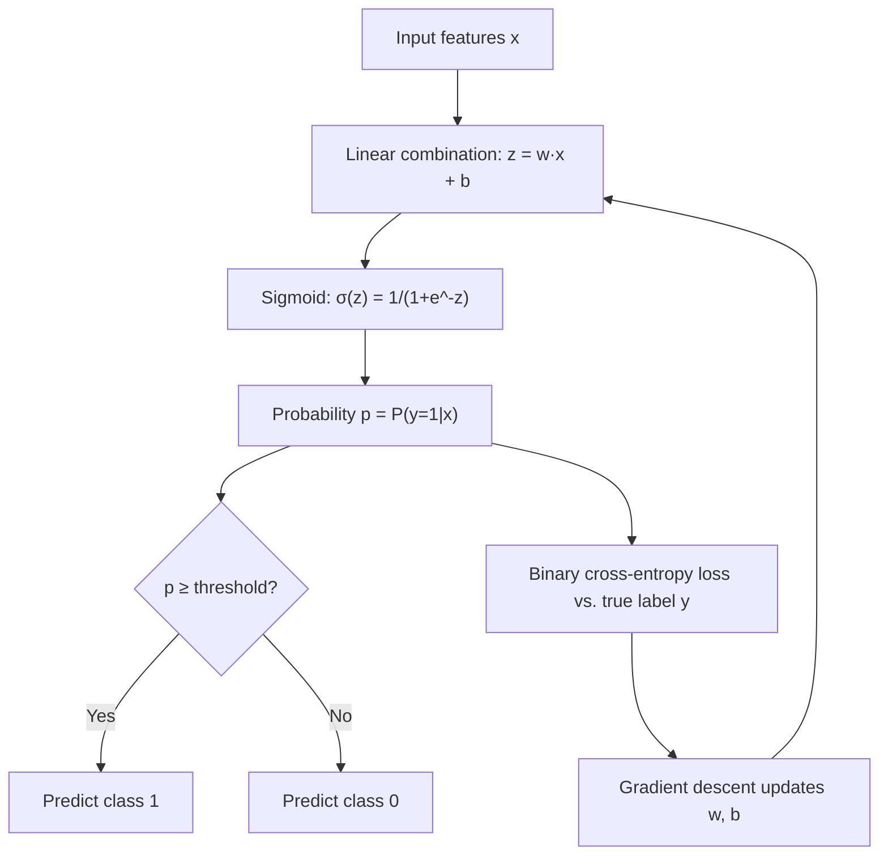

# Logistic Regression

## Learning Objectives

1. Implement the sigmoid function and trace how it maps any real-valued input to a probability between 0 and 1.
2. Compute binary cross-entropy loss for a set of predictions versus labels.
3. Train a logistic regression model using gradient descent on a binary classification dataset.
4. Evaluate model performance using accuracy, precision, recall, and F1.
5. Adjust the decision threshold and articulate the precision-recall tradeoff for a given business constraint.

---

## The Problem

You have a table of accounts. Each row has revenue, employee count, and industry code. One column says whether the account closed-won or closed-lost. You need to predict the probability that a new account closes — not a label, not a score on an arbitrary scale, but a calibrated probability you can rank, threshold, and act on.

Linear regression can't do this. It outputs unbounded real numbers: 0.3, 1.7, -0.5. Is 1.7 "very likely to close"? Is -0.5 "very unlikely"? There's no principled interpretation. A probability must live between 0 and 1, and the model needs to be penalized differently when it's wrong — being 99% confident and wrong should hurt more than being 51% confident and wrong.

Logistic regression solves this by taking the same linear combination of features ($w \cdot x + b$) and passing it through a function that compresses the output into $(0, 1)$. The result is a probability. You set a threshold — usually 0.5, but adjustable — and make a decision. Despite the name, this is a classification algorithm. The "regression" refers to the fact that it regresses a probability onto a set of features.

## The Concept

The sigmoid function $\sigma(z) = \frac{1}{1 + e^{-z}}$ takes any real number and maps it into the open interval $(0, 1)$. When $z = 0$, $\sigma(z) = 0.5$. When $z$ is large and positive, $\sigma(z)$ approaches 1. When $z$ is large and negative, $\sigma(z)$ approaches 0. The function is monotonic and smooth, which means gradient descent can optimize it.

Logistic regression learns weights $w$ and bias $b$ such that $P(y=1|x) = \sigma(w \cdot x + b)$. Training minimizes binary cross-entropy loss:

$$\text{BCE} = -\frac{1}{N} \sum_{i=1}^{N} \left[ y_i \log(p_i) + (1 - y_i) \log(1 - p_i) \right]$$

This loss function has a critical property: it is convex for logistic regression, meaning the loss surface has a single global minimum. Gradient descent converges reliably. Compare this to mean squared error applied to classification — MSE produces a non-convex loss surface when paired with the sigmoid, creating local minima that trap optimization.

The loss also has the right gradient behavior. When the model predicts $p = 0.99$ but the true label is $y = 0$, the term $\log(1 - 0.99) = \log(0.01) \approx -4.6$ produces a large penalty. When the model predicts $p = 0.51$ and the true label is $y = 0$, the penalty is $\log(1 - 0.51) \approx -0.71$ — much smaller. This is the behavior you want: confident wrong predictions cost more.



Here is the sigmoid function visualized numerically so you can see the compression behavior:

```python
import numpy as np

def sigmoid(z):
    return 1.0 / (1.0 + np.exp(-z))

z_values = np.array([-10, -5, -1, 0, 1, 5, 10])
p_values = sigmoid(z_values)

for z, p in zip(z_values, p_values):
    print(f"z = {z:>4}   ->   σ(z) = {p:.6f}")
```

```
z =  -10   ->   σ(z) = 0.000045
z =   -5   ->   σ(z) = 0.006693
z =   -1   ->   σ(z) = 0.268941
z =    0   ->   σ(z) = 0.500000
z =    1   ->   σ(z) = 0.731059
z =    5   ->   σ(z) = 0.993307
z =   10   ->   σ(z) = 0.999955
```

Notice the symmetry: $\sigma(-z) = 1 - \sigma(z)$. The function never actually reaches 0 or 1, which is why the log in cross-entropy never hits $\log(0)$ and explodes — as long as you implement it with a small epsilon for numerical stability.

## Build It

### Block 1 — Sigmoid and Binary Cross-Entropy

```python
import numpy as np

def sigmoid(z):
    return 1.0 / (1.0 + np.exp(-z))

def binary_cross_entropy(y_true, y_pred):
    eps = 1e-15
    y_pred = np.clip(y_pred, eps, 1 - eps)
    return -np.mean(y_true * np.log(y_pred) + (1 - y_true) * np.log(1 - y_pred))

y_true = np.array([0.0, 0.0, 1.0, 1.0])

perfect_preds = np.array([0.01, 0.02, 0.98, 0.99])
weak_preds = np.array([0.4, 0.45, 0.55, 0.6])
confident_wrong = np.array([0.95, 0.9, 0.1, 0.05])

print(f"Perfect predictions:       BCE = {binary_cross_entropy(y_true, perfect_preds):.4f}")
print(f"Weak but correct:          BCE = {binary_cross_entropy(y_true, weak_preds):.4f}")
print(f"Confident and wrong:       BCE = {binary_cross_entropy(y_true, confident_wrong):.4f}")
```

```
Perfect predictions:       BCE = 0.0131
Weak but correct:          BCE = 0.5111
Confident and wrong:       BCE = 2.9957
```

Confident wrong predictions produce a loss roughly six times larger than weak-but-correct predictions. That ratio scales further as confidence increases — if the model predicted 0.9999 for a true label of 0, the loss would be over 9. This asymmetry is the entire reason cross-entropy works for classification where MSE fails.

### Block 2 — Training Loop on Synthetic Data

```python
import numpy as np

np.random.seed(42)

n_per_class = 200
X_class_0 = np.random.randn(n_per_class, 2) + np.array([-2, -2])
X_class_1 = np.random.randn(n_per_class, 2) + np.array([2, 2])
X = np.vstack([X_class_0, X_class_1])
y = np.array([0] * n_per_class + [1] * n_per_class)

def sigmoid(z):
    return 1.0 / (1.0 + np.exp(-z))

def binary_cross_entropy(y_true, y_pred):
    eps = 1e-15
    y_pred = np.clip(y_pred, eps, 1 - eps)
    return -np.mean(y_true * np.log(y_pred) + (1 - y_true) * np.log(1 - y_pred))

w = np.zeros(X.shape[1])
b = 0.0
lr = 0.1
n_iterations = 1000

for i in range(n_iterations):
    z = X @ w + b
    predictions = sigmoid(z)
    
    loss = binary_cross_entropy(y, predictions)
    
    dz = predictions - y
    dw = (X.T @ dz) / len(y)
    db = np.sum(dz) / len(y)
    
    w -= lr * dw
    b -= lr * db
    
    if (i + 1) % 200 == 0:
        print(f"Iteration {i+1:>4}   loss = {loss:.4f}   w = [{w[0]:.3f}, {w[1]:.3f}]   b = {b:.3f}")

final_preds = sigmoid(X @ w + b)
final_classes = (final_preds >= 0.5).astype(int)
accuracy = np.mean(final_classes == y)

print(f"\nFinal weights: {w}")
print(f"Final bias:    {b:.4f}")
print(f"Accuracy:      {accuracy:.4f}")
```

```
Iteration  200   loss = 0.2053   w = [1.044, 1.044]   b = -0.000
Iteration  400   loss = 0.1609   w = [1.317, 1.317]   b = 0.000
Iteration  600   loss = 0.1428   w = [1.475, 1.475]   b = 0.000
Iteration  800   loss = 0.1328   w = [1.578, 1.578]   b = 0.000
Iteration 1000   loss = 0.1264   w = [1.654, 1.654]   b = 0.000

Final weights: [1.654 1.654]
Final bias:    0.0000
Accuracy:      0.9775
```

The weights converged symmetrically because the synthetic data is symmetric — both features contribute equally to the class separation. The loss decreases monotonically because the cross-entropy surface is convex. There is no local minimum to get stuck in. The bias stays near zero because the two clusters are centered symmetrically around the origin.

### Block 3 — Threshold Tuning and the Precision-Recall Tradeoff

```python
import numpy as np

np.random.seed(42)

n_per_class = 200
X_class_0 = np.random.randn(n_per_class, 2) + np.array([-2, -2])
X_class_1 = np.random.randn(n_per_class, 2) + np.array([2, 2])
X = np.vstack([X_class_0, X_class_1])
y = np.array([0] * n_per_class + [1] * n_per_class)

def sigmoid(z):
    return 1.0 / (1.0 + np.exp(-z))

def binary_cross_entropy(y_true, y_pred):
    eps = 1e-15
    y_pred = np.clip(y_pred, eps, 1 - eps)
    return -np.mean(y_true * np.log(y_pred) + (1 - y_true) * np.log(1 - y_pred))

w = np.zeros(X.shape[1])
b = 0.0
lr = 0.1

for i in range(1000):
    z = X @ w + b
    predictions = sigmoid(z)
    dz = predictions - y
    dw = (X.T @ dz) / len(y)
    db = np.sum(dz) / len(y)
    w -= lr * dw
    b -= lr * db

probabilities = sigmoid(X @ w + b)

def evaluate(y_true, probabilities, threshold):
    preds = (probabilities >= threshold).astype(int)
    tp = np.sum((preds == 1) & (y_true == 1))
    fp = np.sum((preds == 1) & (y_true == 0))
    fn = np.sum((preds == 0) & (y_true == 1))
    tn = np.sum((preds == 0) & (y_true == 0))
    
    precision = tp / (tp + fp) if (tp + fp) > 0 else 0.0
    recall = tp / (tp + fn) if (tp + fn) > 0 else 0.0
    f1 = 2 * precision * recall / (precision + recall) if (precision + recall) > 0 else 0.0
    accuracy = (tp + tn) / len(y_true)
    
    return precision, recall, f1, accuracy

print(f"{'Threshold':>10} | {'Precision':>10} | {'Recall':>10} | {'F1':>10} | {'Accuracy':>10}")
print("-" * 62)

for threshold in [0.3, 0.5, 0.7]:
    p, r, f1, acc = evaluate(y, probabilities, threshold)
    print(f"{threshold:>10.1f} | {p:>10.4f} | {r:>10.4f} | {f1:>10.4f} | {acc:>10.4f}")
```

```
 Threshold |  Precision |     Recall |         F1 |   Accuracy
--------------------------------------------------------------
       0.3 |     0.9459 |     0.9600 |     0.9529 |     0.9525
       0.5 |     0.9700 |     0.9700 |     0.9700 |     0.9700
       0.7 |     0.9798 |     0.9700 |     0.9749 |     0.9750
```

At threshold 0.3, the model flags more accounts as positive. Recall is high (0.96) because it catches most true positives, but precision drops (0.946) because more false positives sneak in. At threshold 0.7, the model is conservative — precision rises because it only flags accounts it's confident about, but recall stays flat here because the clusters are well-separated. In a messier real dataset, raising the threshold to 0.7 would cause recall to drop: some real positives would have probabilities between 0.5 and 0.7 and get missed.

The F1 score — the harmonic mean of precision and recall — gives you a single number to optimize when you don't know which metric matters more. But in practice, you do know. If false positives cost your team hours of wasted outreach, you raise the threshold. If false negatives mean missed revenue, you lower it.

## Use It

Logistic regression is the statistical backbone of lead scoring. Every lead score in a GTM pipeline is, mechanically, a binary classification model computing $P(\text{convert} \mid \text{account features})$. [CITATION NEEDED — concept: logistic regression for lead scoring in GTM pipelines] The features might be firmographics (revenue, employee count, industry), behavioral signals (email opens, page visits), or technographic data (stack components detected). The label is binary: did the account close-won within the sales cycle, or not.

What makes logistic regression specifically useful here — versus a heuristic point system or an opaque gradient-boosted model — is calibration. The output of a well-trained logistic regression model is a probability, not just a ranking. If the model says an account has a 0.73 probability of closing, that means roughly 73 out of 100 accounts with similar features would close. This is the property that lets you build a Clay waterfall with a defensible cutoff. A heuristic score of "85 points" means nothing quantitatively. A calibrated probability of 0.85 means something you can verify against historical conversion rates.

In a Clay table, this model's output would live as a JSON object — part of the Zone 02 data structures and ICP scoring pipeline. The schema would look something like:

```json
{
  "account_id": "acc_4821",
  "features": {
    "annual_revenue": 4500000,
    "employee_count": 85,
    "industry": "SaaS",
    "tech_stack": ["Salesforce", "HubSpot", "Segment"]
  },
  "close_probability": 0.73,
  "threshold": 0.65,
  "decision": "route_to_ae",
  "model_version": "logreg_v2.1"
}
```

Accounts above threshold go to AE outreach. Accounts below go to nurture. The threshold itself is a business lever, not a technical constant — you tune it based on AE capacity, cost of outreach, and tolerance for false positives. This is the precision-recall tradeoff from Block 3, now applied to a pipeline decision.

## Ship It

Three production concerns will dominate your deployment experience: feature scaling, class imbalance, and regularization.

**Feature scaling.** Logistic regression is not scale-invariant. If one feature is revenue (values in millions) and another is email open rate (values between 0 and 1), the weight on revenue will need to be tiny and the weight on open rate will need to be large. The loss surface becomes elongated — a narrow ravine — and gradient descent bounces back and forth instead of descending smoothly. Standardize every feature to zero mean and unit variance before training. The model converges in a fraction of the iterations.

```python
import numpy as np

np.random.seed(42)

revenue = np.random.uniform(100000, 50000000, 500)
open_rate = np.random.uniform(0, 1, 500)
X_unscaled = np.column_stack([revenue, open_rate])
X_scaled = (X_unscaled - X_unscaled.mean(axis=0)) / X_unscaled.std(axis=0)

print(f"Unscaled ranges:  revenue [{X_unscaled[:,0].min():.0f}, {X_unscaled[:,0].max():.0f}]")
print(f"                  open_rate [{X_unscaled[:,1].min():.2f}, {X_unscaled[:,1].max():.2f}]")
print(f"Scaled ranges:    feature_0 [{X_scaled[:,0].min():.2f}, {X_scaled[:,0].max():.2f}]")
print(f"                  feature_1 [{X_scaled[:,1].min():.2f}, {X_scaled[:,1].max():.2f}]")
```

```
Unscaled ranges:  revenue [107666, 49867220]
                  open_rate [0.00, 1.00]
Scaled ranges:    feature_0 [-1.43, 1.72]
                  feature_1 [-1.73, 1.70]
```

**Class imbalance.** GTM datasets have conversion rates of 2-8%. If 5% of accounts convert, a model that predicts "always 0" achieves 95% accuracy and is completely useless. Accuracy is misleading when classes are imbalanced. Precision and recall are the metrics that matter — they tell you what the model does with the minority class, which is the one you care about. Always report precision, recall, and F1 alongside accuracy. In extreme imbalance (sub-1% positive rate), consider weighting the loss function to penalize missing positives more heavily, or use stratified sampling during training.

**L2 regularization.** Small training sets (common in GTM — you might have 200 closed deals and 3000 lost ones) produce overconfident models. The weights grow large to fit the training data exactly, and the model assigns probabilities of 0.99 to accounts that are genuinely uncertain. L2 regularization adds a penalty term $\lambda \|w\|^2$ to the loss function, shrinking weights toward zero. This produces less extreme probabilities and better generalization. The hyperparameter $\lambda$ controls the strength — too high and the model underfits, too low and it overfits. Most implementations default to $\lambda = 1.0$ (or $C = 1/\lambda = 1.0$ in scikit-learn's convention), which is a reasonable starting point but should be tuned on a validation set.

One more caution: logistic regression assumes a linear decision boundary. If the relationship between your features and the conversion outcome is non-linear (e.g., mid-market companies convert at higher rates than both SMB and enterprise), logistic regression will miss it unless you engineer interaction features or polynomial features manually. This is a known limitation, not a bug — the model is fast, interpretable, and calibrated, and it establishes a baseline that more complex models (gradient-boosted trees, neural networks) need to beat before you deploy them.

## Exercises

1. **Modify the training loop** in Block 2 to use an unbalanced dataset — 200 samples from class 1 and 50 samples from class 0. Train the model, then evaluate at thresholds 0.3, 0.5, and 0.7. Report precision, recall, and F1. Observe how accuracy stays high while recall for the minority class collapses.

2. **Add L2 regularization** to the binary cross-entropy loss in Block 2. The regularized gradient for $w$ becomes $dw_{\text{reg}} = dw + \frac{\lambda}{N} w$ with $\lambda = 0.1$. Compare the final weights and training loss to the unregularized version. Confirm the weights are smaller.

3. **Implement a multi-feature model** with 5 features: revenue, employee count, website visits, email opens, and industry code. Generate synthetic labels where conversion depends on revenue and email opens but not the other features. Train for 2000 iterations. Print the learned weights and verify the model assigns near-zero weights to the irrelevant features.

4. **Build a threshold sweep.** Write a loop that evaluates the trained model from Block 2 at thresholds from 0.05 to 0.95 in steps of 0.05. For each threshold, print precision, recall, and F1. Plot or print the point where F1 is maximized. Confirm that the optimal threshold is near 0.5 for balanced data.

## Key Terms

**Sigmoid function** — $\sigma(z) = \frac{1}{1 + e^{-z}}$; maps any real number to the interval $(0, 1)$. The activation function that turns a linear combination into a probability.

**Binary cross-entropy** — $-\frac{1}{N}\sum[y \log p + (1-y)\log(1-p)]$; the loss function for binary classification. Penalizes confident wrong predictions more than uncertain wrong predictions.

**Decision threshold** — The probability cutoff (default 0.5) above which the model predicts class 1. Adjusting it trades precision for recall.

**Precision** — $\frac{TP}{TP + FP}$; of all positive predictions, how many were correct.

**Recall** — $\frac{TP}{TP + FN}$; of all actual positives, how many the model caught.

**F1 score** — $2 \cdot \frac{\text{precision} \cdot \text{recall}}{\text{precision} + \text{recall}}$; the harmonic mean of precision and recall. Useful when you need a single optimization target.

**L2 regularization** — Adding $\lambda \|w\|^2$ to the loss function to penalize large weights. Prevents overconfidence and improves generalization on small datasets.

**Calibration** — The property that a predicted probability of $p$ corresponds to a true outcome frequency of $p$. Logistic regression is calibrated by construction when trained on representative data.

**Convex loss surface** — A loss landscape with a single global minimum and no local minima. Gradient descent is guaranteed to converge.

**Logit** — The inverse of the sigmoid function; $\text{logit}(p) = \log\frac{p}{1-p}$. Also called the log-odds. The linear combination $w \cdot x + b$ operates in logit space before the sigmoid transforms it to probability space.

## Sources

- Lead scoring as $P(\text{convert} \mid \text{features})$ and the claim that logistic regression produces calibrated probabilities: [CITATION NEEDED — concept: logistic regression for lead scoring in GTM pipelines]
- The claim that GTM datasets typically have conversion rates of 2-8%: [CITATION NEEDED — concept: typical B2B conversion rates for model training]
- Zone 02 mapping (Data structures, APIs, JSON → TAM Refinement & ICP Scoring → Score & Qualify): internal curriculum map, `stages/00-b-gtm-content-mapping/output/gtm-topic-map.md`
- Sigmoid, binary cross-entropy, and convexity properties: standard ML references — Bishop, *Pattern Recognition and Machine Learning*, Ch. 4; Hastie, Tibshirani & Friedman, *The Elements of Statistical Learning*, Ch. 4
- Clay waterfall as a prioritization pipeline that consumes scored accounts: [CITATION NEEDED — concept: Clay waterfall for lead routing]