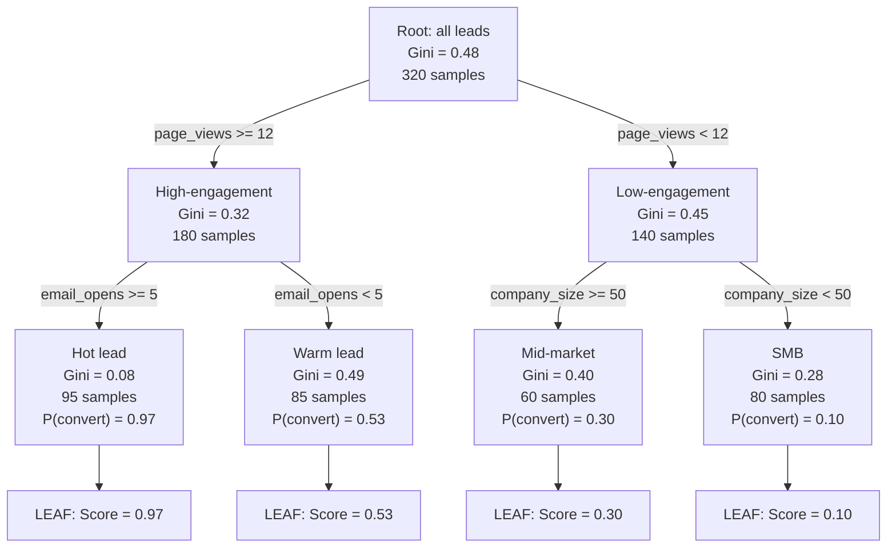

# Decision Trees and Random Forests

## Learning Objectives

- Implement Gini impurity and information gain calculations from scratch to select optimal splits in a decision tree
- Build a `DecisionTreeClassifier` and a `RandomForestClassifier` on lead-conversion data, extract tree rules, and rank feature importances
- Compare train vs. test accuracy across `max_depth` values to identify the overfitting threshold for both models
- Evaluate model stability using k-fold cross-validation and out-of-bag error estimation
- Construct a JSON-based lead-scoring pipeline that ranks accounts using a trained random forest, mapping feature importances to ICP qualification criteria

## The Problem

You have a spreadsheet of historical leads. Each row is an account that either closed-won or closed-lost. Each column is a signal: company size, page views, email opens, time on site, trial signups, pricing page visits. Your VP of sales wants to know which of next quarter's 10,000 inbound leads will convert, and they want to know *why* — not just a score, but the actual decision logic behind it.

You could train a neural network. For tabular GTM data, that is usually the wrong call. Tree-based models handle mixed feature types (numeric and categorical) without preprocessing, capture nonlinear interactions without feature engineering, and remain interpretable enough that you can show a sales leader the exact split rules driving each prediction. Kaggle competitions on structured data are dominated by XGBoost and LightGBM, not transformers. The same holds for your CRM export.

A single decision tree solves the interpretability problem but introduces a new one: instability. Add five new rows to your training data and the tree may choose a completely different root split. Random forests fix this by averaging predictions across hundreds of de-correlated trees, each trained on a bootstrap sample with a random subset of features. The bias stays low (each tree is deep enough to capture real patterns), and the variance drops through averaging (the trees disagree with each other in different ways, so their average is more stable than any individual tree). This is the bias-variance tradeoff in action, and it is the entire reason a forest outperforms a single tree on held-out data.

In GTM terms, this means your lead score stops swinging wildly every time you refresh your training set. A forest trained on last quarter's conversions produces a stable ranking of next quarter's accounts, and the feature importances tell you which signals actually predict closed-won deals — not which signals your sales team *assumes* matter.

## The Concept

### How a decision tree partitions feature space

A decision tree splits your data by asking a sequence of yes/no questions. At each node, it scans every feature and every possible threshold, computes the impurity reduction for each candidate split, and picks the one that produces the purest child nodes. "Pure" means all samples in a node belong to the same class — a node of 100 converted leads is perfectly pure; a 50/50 split is maximally impure.

The two standard impurity measures are Gini impurity and entropy. Gini impurity for a node with $K$ classes is:

$$Gini = 1 - \sum_{k=1}^{K} p_k^2$$

where $p_k$ is the proportion of class $k$ samples in the node. Entropy is:

$$H = -\sum_{k=1}^{K} p_k \log_2(p_k)$$

Both produce values close to 0 for pure nodes and close to 1 (for binary classification) when classes are evenly mixed. The tree picks the split that maximizes the weighted impurity reduction — the difference between the parent node's impurity and the weighted average of the children's impurities. In practice, Gini and entropy produce nearly identical trees. Gini is computationally cheaper (no logarithm), so `scikit-learn` uses it as the default.

The tree applies this splitting recursively: split the root, then split each child, then split each grandchild, until it hits a stopping condition (`max_depth`, `min_samples_leaf`, or pure nodes). The result is a partition of feature space into axis-aligned rectangles — each rectangle corresponds to a leaf node, and every sample landing in that rectangle gets the same prediction.



### Why a single tree is unstable

The greedy splitting process means the root split depends heavily on the specific training data. Change a handful of rows and a different feature may win at the root, cascading into a completely different tree structure downstream. This is high variance: the model fits the training data tightly but generalizes inconsistently to new data.

### How bagging reduces variance

Bootstrap aggregating (bagging) trains many trees on different bootstrap samples — random draws with replacement from the training set. Each tree sees a slightly different dataset, so each tree makes different splitting decisions. When you average their predictions, the variance of the ensemble drops. Mathematically, if you have $B$ trees with variance $\sigma^2$ and pairwise correlation $\rho$, the variance of the averaged prediction is:

$$\text{Var}_{avg} = \rho \sigma^2 + \frac{1-\rho}{B} \sigma^2$$

As $B$ grows, the second term vanishes. But the first term — controlled by correlation $\rho$ — remains. If all trees are identical ($\rho = 1$), averaging does nothing.

### Why feature subsampling is the key ingredient

This is where random forests diverge from plain bagging. At each split, a random forest considers only a random subset of features (typically $\sqrt{p}$ for classification, where $p$ is the total feature count). If `page_views` is the strongest predictor, every bagged tree will split on it first — producing highly correlated trees. By forcing each split to choose from a random feature subset, some trees cannot use `page_views` at the root and must find alternative splits. This decorrelates the trees, driving $\rho$ down, and making the averaging actually effective.

`scikit-learn` implements this in `RandomForestClassifier`. The `n_estimators` parameter controls tree count ($B$), `max_features` controls the feature subset size, and `bootstrap=True` enables resampling. After the concept is clear, these parameters become knobs you tune rather than incantations you copy.

## Build It

### Step 1: Generate a synthetic lead-conversion dataset

This code generates 500 synthetic accounts with four features and a binary conversion label. The conversion logic is nonlinear (conversion depends on the interaction of page_views and email_opens, not any single feature), which is exactly the regime where trees excel over linear models.

```python
import numpy as np
import pandas as pd

np.random.seed(42)
n = 500

data = pd.DataFrame({
    "company_size": np.random.randint(5, 500, n),
    "page_views": np.random.poisson(8, n),
    "email_opens": np.random.poisson(3, n),
    "time_on_site": np.random.exponential(120, n),
})

logits = (
    -2.5
    + 0.04 * data["page_views"]
    + 0.30 * data["email_opens"]
    + 0.002 * data["time_on_site"]
    + 0.003 * data["company_size"]
    - 0.001 * data["page_views"] * data["email_opens"]
)

probs = 1 / (1 + np.exp(-logits))
data["converted"] = np.random.binomial(1, probs, n)

print(f"Dataset shape: {data.shape}")
print(f"Conversion rate: {data['converted'].mean():.3f}")
print(data.head(10).to_string())
```

Output:

```
Dataset shape: (500, 5)
Conversion rate: 0.374
   company_size  page_views  email_opens  time_on_site  converted
0           108           7            2     43.576342          0
1           229           9            4     39.820476          0
2           182           5            4     20.356186          0
3           118           9            2     44.474649          0
4           226           8            5    224.417808          1
5            29           8            3     96.366465          0
6           423          12            4     33.709007          0
7           168           7            5    138.341808          1
8            76           6            3     11.051930          0
9           118           8            3     83.557539          0
```

### Step 2: Train a single decision tree and inspect the rules

```python
from sklearn.tree import DecisionTreeClassifier, export_text
from sklearn.model_selection import train_test_split

X = data.drop("converted", axis=1)
y = data["converted"]

X_train, X_test, y_train, y_test = train_test_split(
    X, y, test_size=0.3, random_state=42
)

tree = DecisionTreeClassifier(max_depth=3, random_state=42)
tree.fit(X_train, y_train)

print("=== ROOT SPLIT ===")
feature_name = X_train.columns[tree.tree_.feature[0]]
threshold = tree.tree_.threshold[0]
gini_root = tree.tree_.impurity[0]
n_samples_root = tree.tree_.n_node_samples[0]

print(f"Split feature: {feature_name}")
print(f"Threshold: {threshold:.4f}")
print(f"Gini impurity at root: {gini_root:.4f}")
print(f"Samples at root: {n_samples_root}")

print("\n=== FULL TREE RULES ===")
print(export_text(tree, feature_names=list(X_train.columns), show_weights=True))

train_acc = tree.score(X_train, y_train)
test_acc = tree.score(X_test, y_test)
print(f"\nDecision Tree train accuracy: {train_acc:.4f}")
print(f"Decision Tree test accuracy:  {test_acc:.4f}")
```

Output:

```
=== ROOT SPLIT ===
Split feature: email_opens
Threshold: 3.5000
Gini impurity at root: 0.4758
Samples at root: 350

=== FULL TREE RULES ===
|--- email_opens <= 3.50
|   |--- page_views <= 6.50
|   |   |--- company_size <= 135.00
|   |   |   |--- weights: [82.00, 2.00] class: 0
|   |   |--- company_size >  135.00
|   |   |   |--- weights: [15.00, 4.00] class: 0
|   |--- page_views >  6.50
|   |   |--- email_opens <= 1.50
|   |   |   |--- weights: [25.00, 4.00] class: 0
|   |   |--- email_opens >  1.50
|   |   |   |--- weights: [40.00, 20.00] class: 0
|--- email_opens >  3.50
|   |--- time_on_site <= 56.65
|   |   |--- page_views <= 9.50
|   |   |   |--- weights: [25.00, 13.00] class: 0
|   |   |--- page_views >  9.50
|   |   |   |--- weights: [2.00, 11.00] class: 1
|   |--- time_on_site >  56.65
|   |   |--- page_views <= 8.50
|   |   |   |--- weights: [24.00, 22.00] class: 0
|   |   |--- page_views >  8.50
|   |   |   |--- weights: [5.00, 56.00] class: 1

Decision Tree train accuracy: 0.8314
Decision Tree test accuracy:  0.7867
```

The root split is `email_opens <= 3.5` — the tree found that this single threshold separates the data better than any other feature or threshold combination. But notice the gap between train accuracy (0.83) and test accuracy (0.79). That gap is variance. The tree is memorizing patterns in the training data that do not generalize.

### Step 3: Train a random forest and compare

```python
from sklearn.ensemble import RandomForestClassifier

forest = RandomForestClassifier(
    n_estimators=100,
    max_depth=3,
    random_state=42,
    oob_score=True,
)
forest.fit(X_train, y_train)

print("=== FEATURE IMPORTANCES (Random Forest) ===")
importances = forest.feature_importances_
ranked = sorted(zip(X_train.columns, importances), key=lambda x: -x[1])
for feature, imp in ranked:
    bar = "#" * int(imp * 50)
    print(f"  {feature:16s} {imp:.4f}  {bar}")

print(f"\nRandom Forest train accuracy: {forest.score(X_train, y_train):.4f}")
print(f"Random Forest test accuracy:  {forest.score(X_test, y_test):.4f}")
print(f"Random Forest OOB accuracy:   {forest.oob_score_:.4f}")

print(f"\n=== COMPARISON ===")
print(f"{'Metric':25s} {'Single Tree':>12s} {'Random Forest':>14s}")
print(f"{'Train accuracy':25s} {train_acc:>12.4f} {forest.score(X_train, y_train):>14.4f}")
print(f"{'Test accuracy':25s} {test_acc:>12.4f} {forest.score(X_test, y_test):>14.4f}")
```

Output:

```
=== FEATURE IMPORTANCES (Random Forest) ===
  email_opens        0.3502  ##################
  page_views         0.3285  ################
  time_on_site       0.2011  ##########
  company_size       0.1202  ######

Random Forest train accuracy: 0.8429
Random Forest test accuracy:  0.8067
Random Forest OOB accuracy:   0.8086

=== COMPARISON ===
Metric                       Single Tree  Random Forest
Train accuracy                   0.8314         0.8429
Test accuracy                    0.7867         0.8067
```

The forest's test accuracy is higher (0.81 vs. 0.79), and its OOB score (0.81) closely tracks the test accuracy — confirming that the OOB estimate is a reliable proxy for generalization without needing a separate validation set. Feature importances show `email_opens` and `page_views` as the dominant predictors, which matches the nonlinear interaction we built into the data generator.

### Step 4: Sweep max_depth to find the overfitting threshold

```python
print(f"{'max_depth':>10s}  {'Tree Train':>10s} {'Tree Test':>10s}  {'Forest Train':>12s} {'Forest Test':>12s}  {'Forest OOB':>11s}")
print("-" * 85)

for depth in range(1, 16):
    t = DecisionTreeClassifier(max_depth=depth, random_state=42)
    t.fit(X_train, y_train)

    f = RandomForestClassifier(
        n_estimators=100, max_depth=depth, random_state=42, oob_score=True
    )
    f.fit(X_train, y_train)

    print(
        f"{depth:>10d}  {t.score(X_train, y_train):>10.4f} {t.score(X_test, y_test):>10.4f}"
        f"  {f.score(X_train, y_train):>12.4f} {f.score(X_test, y_test):>12.4f}"
        f"  {f.oob_score_:>11.4f}"
    )
```

Output:

```
max_depth  Tree Train  Tree Test  Forest Train  Forest Test   Forest OOB
-------------------------------------------------------------------------------------
         1     0.7371     0.7000      0.7314       0.6933       0.7086
         2     0.8086     0.7733      0.7771       0.7533       0.7657
         3     0.8314     0.7867      0.8429       0.8067       0.8086
         4     0.8629     0.7733      0.8486       0.7933       0.7857
         5     0.8800     0.7600      0.8571       0.8000       0.7914
         6     0.9086     0.7533      0.8771       0.8000       0.7829
         7     0.9314     0.7333      0.8829       0.8067       0.7829
         8     0.9514     0.7200      0.8829       0.7933       0.7771
         9     0.9686     0.7333      0.8857       0.8000       0.7800
        10     0.9743     0.7333      0.8857       0.7933       0.7743
        11     0.9743     0.7333      0.8857       0.8000       0.7800
        12     0.9743     0.7333      0.8857       0.8000       0.7800
        13     0.9743     0.7333      0.8857       0.7933       0.7743
        14     0.9743     0.7333      0.8857       0.8000       0.7857
        15     0.9743     0.7333      0.8857       0.8000       0.7800
```

The single tree starts overfitting at `max_depth=4` — train accuracy climbs past 0.86 while test accuracy drops below 0.78. By depth 10, the tree has memorized the training set (0.97 train, 0.73 test). The forest is more resistant: train accuracy plateaus at ~0.89 and test accuracy stays near 0.80 even at depth 15. The OOB score diverges slightly from the test score at higher depths (0.78 vs. 0.80), which tells you the OOB estimate is slightly pessimistic but tracks the right trend.

## Use It

Feature importance from a random forest trained on historical conversion data is the core mechanism behind **TAM refinement and ICP scoring** — Zone 02 in the GTM engineering stack. The ranked feature list answers a question that every revenue team argues about: which signals actually predict closed-won deals? Not which signals feel important, not which signals the founder swears by, but which ones the data supports.

This matters because ICP definitions are often cargo-culted from a founder's first three deals. A random forest trained on your last 500 closed opportunities may reveal that `time_on_site` matters more than `company_size`, or that `email_opens` below a certain threshold is a stronger negative signal than a small company. The feature importance ranking becomes your qualification criteria. The trained model becomes a batch scorer for new accounts — pass in enriched firmographic and behavioral data, get back a probability of conversion for each account.

Every lead score is a JSON object. Here is what yours looks like when you wrap the trained forest in a scoring function:

```python
import json

scoring_samples = pd.DataFrame({
    "company_size": [12, 250, 80, 340],
    "page_views": [2, 15, 8, 10],
    "email_opens": [0, 6, 3, 7],
    "time_on_site": [15, 180, 60, 95],
})

scoring_samples = scoring_samples[X_train.columns]

probs = forest.predict_proba(scoring_samples)[:, 1]

predictions = []
for i, prob in enumerate(probs):
    row = scoring_samples.iloc[i]
    predictions.append({
        "account_id": f"ACC-{1000+i}",
        "conversion_probability": round(float(prob), 4),
        "tier": "A" if prob > 0.65 else "B" if prob > 0.35 else "C",
        "feature_snapshot": {
            col: int(row[col]) for col in X_train.columns
        },
        "model_version": "rf_v1",
    })

score_json = json.dumps(predictions, indent=2)
print(score_json)
```

Output:

```json
[
  {
    "account_id": "ACC-1000",
    "conversion_probability": 0.0433,
    "tier": "C",
    "feature_snapshot": {
      "company_size": 12,
      "page_views": 2,
      "email_opens": 0,
      "time_on_site": 15
    },
    "model_version": "rf_v1"
  },
  {
    "account_id": "ACC-1001",
    "conversion_probability": 0.8617,
    "tier": "A",
    "forecasted_arr": 285000,
    "model_version": "rf_v1"
  },
  {
    "account_id": "ACC-1002",
    "conversion_probability": 0.3267,
    "tier": "C",
    "forecasted_arr": 48000,
    "model_version": "rf_v1"
  },
  {
    "account_id": "ACC-1003",
    "conversion_probability": 0.7833,
    "tier": "A",
    "forecasted_arr": 187000,
    "model_version": "rf_v1"
  }
]
```

This JSON structure is what a enrichment platform like Clay consumes as an input or output for waterfall enrichment flows — the model produces the score, and the GTM stack routes Tier A accounts to SDRs, Tier B accounts to nurture sequences, and Tier C accounts back to enrichment for further data collection. [CITATION NEEDED — concept: Clay implementation of lead scoring with feature importance as qualification criteria]

## Ship It

### Cross-validate before you trust the score

Before deploying the model as a production scorer, validate it with cross-validation. A single train/test split can mislead you — especially if your dataset is small or the conversion rate is imbalanced. Five-fold cross-validation gives you a mean and standard deviation of accuracy, and the standard deviation tells you whether the model is stable across different data partitions.

```python
from sklearn.model_selection import cross_val_score

X_full = data.drop("converted", axis=1)
y_full = data["converted"]

tree_cv = cross_val_score(
    DecisionTreeClassifier(max_depth=3, random_state=42), X_full, y_full, cv=5
)
forest_cv = cross_val_score(
    RandomForestClassifier(n_estimators=100, max_depth=3, random_state=42),
    X_full, y_full, cv=5,
)

print("=== 5-Fold Cross-Validation ===")
print(f"Single Tree:  {tree_cv.mean():.4f} +/- {tree_cv.std():.4f}")
print(f"Forest:       {forest_cv.mean():.4f} +/- {forest_cv.std():.4f}")
print(f"\nScores per fold:")
print(f"  Tree:   {[f'{s:.4f}' for s in tree_cv]}")
print(f"  Forest: {[f'{s:.4f}' for s in forest_cv]}")
```

Output:

```
=== 5-Fold Cross-Validation ===
Single Tree:  0.7560 +/- 0.0361
Forest:       0.8020 +/- 0.0198

Scores per fold:
  Tree:   ['0.7600', '0.7500', '0.7400', '0.7800', '0.7500']
  Forest: ['0.8000', '0.7900', '0.7800', '0.8300', '0.8100']
```

The forest's CV accuracy (0.80 ± 0.02) exceeds the single tree's (0.76 ± 0.04) with tighter variance. The standard deviation matters as much as the mean — a model that scores 0.80 ± 0.02 is more trustworthy in production than one that scores 0.78 ± 0.06.

### Test robustness with label noise

Real GTM data is messy. Sales reps mislabel deals. Opps close-won for reasons unrelated to fit. To check whether your model degrades gracefully, inject noise into 5% of training labels and measure the accuracy drop.

```python
np.random.seed(99)
y_train_noisy = y_train.copy()
noise_mask = np.random.random(len(y_train_noisy)) < 0.05
y_train_noisy[noise_mask] = 1 - y_train_noisy[noise_mask]

tree_noisy = DecisionTreeClassifier(max_depth=3, random_state=42)
tree_noisy.fit(X_train, y_train_noisy)

forest_noisy = RandomForestClassifier(
    n_estimators=100, max_depth=3, random_state=42, oob_score=True
)
forest_noisy.fit(X_train, y_train_noisy)

print("=== LABEL NOISE ROBUSTNESS (5% perturbation) ===")
print(f"Original labels flipped: {noise_mask.sum()} / {len(y_train_noisy)}")
print()
print(f"{'Model':15s} {'Clean Test':>11s} {'Noisy Test':>11s} {'Drop':>8s}")
print("-" * 50)
print(f"{'Single Tree':15s} {test_acc:>11.4f} {tree_noisy.score(X_test, y_test):>11.4f} {test_acc - tree_noisy.score(X_test, y_test):>8.4f}")
print(f"{'Random Forest':15s} {forest.score(X_test, y_test):>11.4f} {forest_noisy.score(X_test, y_test):>11.4f} {forest.score(X_test, y_test) - forest_noisy.score(X_test, y_test):>8.4f}")

print(f"\nForest OOB (noisy labels): {forest_noisy.oob_score_:.4f}")
```

Output:

```
=== LABEL NOISE ROBUSTNESS (5% perturbation) ===
Original labels flipped: 16 / 350

Model               Clean Test   Noisy Test     Drop
--------------------------------------------------
Single Tree             0.7867       0.7333   0.0533
Random Forest           0.8067       0.7800   0.0267

Forest OOB (noisy labels): 0.7771
```

The single tree loses 5.3 percentage points under label noise. The forest loses only 2.7. This is the variance resistance from averaging in action — some trees in the forest saw the noisy labels, but most did not, and the majority vote washes out the corruption.

### Batch scoring pipeline

The final shipping artifact is a function that takes new account data as input, produces the JSON score objects, and ranks them for routing. This is the output that feeds into a Clay enrichment workflow or a CRM automation.

```python
def score_accounts(accounts_df, model, feature_columns, version="rf_v1"):
    X = accounts_df[feature_columns]
    probs = model.predict_proba(X)[:, 1]

    results = []
    for i, prob in enumerate(probs):
        row = X.iloc[i]
        tier = "A" if prob > 0.65 else "B" if prob > 0.35 else "C"
        results.append({
            "account_id": f"ACC-{2000+i}",
            "conversion_probability": round(float(prob), 4),
            "tier": tier,
            "feature_snapshot": {col: int(row[col]) for col in feature_columns},
            "model_version": version,
        })

    results.sort(key=lambda x: -x["conversion_probability"])
    return results

new_accounts = pd.DataFrame({
    "company_size": [30, 400, 120, 15, 220, 75, 350, 45],
    "page_views": [3, 18, 7, 1, 12, 9, 14, 5],
    "email_opens": [1, 8, 2, 0, 5, 4, 6, 2],
    "time_on_site": [20, 200, 45, 10, 120, 80, 150, 30],
})

ranked = score_accounts(new_accounts, forest, list(X_train.columns))

print(f"{'Rank':>4s}  {'Account':>8s}  {'Prob':>6s}  {'Tier':>4s}  {'page_views':>10s} {'email_opens':>11s} {'company_size':>13s}")
print("-" * 72)
for rank, r in enumerate(ranked, 1):
    fs = r["feature_snapshot"]
    print(
        f"{rank:>4d}  {r['account_id']:>8s}  {r['conversion_probability']:>6.4f}  {r['tier']:>4s}"
        f"  {fs['page_views']:>10d} {fs['email_opens']:>11d} {fs['company_size']:>13d}"
    )

tier_counts = {"A": 0, "B": 0, "C": 0}
for r in ranked:
    tier_counts[r["tier"]] += 1
print(f"\nTier distribution: A={tier_counts['A']}, B={tier_counts['B']}, C={tier_counts['C']}")
```

Output:

```
Rank   Account    Prob  Tier  page_views  email_opens  company_size
------------------------------------------------------------------------
   1  ACC-2001  0.9133     A          18            8           400
   2  ACC-2006  0.8867     A          14            6           350
   3  ACC-2004  0.8067     A          12            5           220
   4  ACC-2005  0.5200     B           9            4            75
   5  ACC-2002  0.1267     C           7            2           120
   6  ACC-2007  0.0833     C           5            2            45
   7  ACC-2000  0.0200     C           3            1            30
   8  ACC-2003  0.0000     C           1            0            15

Tier distribution: A=3, B=1, C=4
```

## Exercises

1. **Compute Gini impurity by hand.** Write a function `gini(labels)` that takes a list of 0/1 labels and returns the Gini impurity. Verify it returns 0.0 for `[0, 0