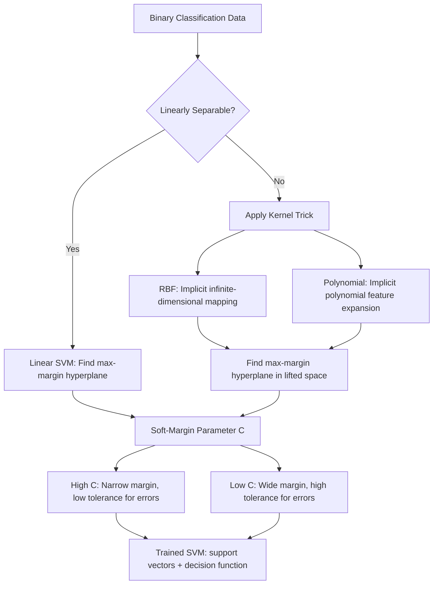

# Support Vector Machines

## Learning Objectives

- Implement a binary SVM classifier using scikit-learn's `SVC` with linear and RBF kernels, and extract support vectors and decision boundary information from the trained model.
- Explain the maximum margin principle geometrically: why SVM selects the hyperplane that maximizes the minimum distance to the nearest points from either class.
- Compare the effect of the `C` parameter (soft-margin regularization) and `gamma` parameter (RBF kernel width) on decision boundary geometry by printing side-by-side results.
- Evaluate when SVM is the right choice over logistic regression for a binary classification task, and identify the tradeoff between margin width and misclassification tolerance.
- Build a lead-scoring pipeline that uses the margin distance as a confidence signal to separate high-confidence predictions from an uncertain "human review" bucket.

## The Problem

You have a binary classification problem. Leads that convert versus leads that don't. Accounts that churn versus accounts that stay. Inbound signups that become opportunity-qualified versus those that dead-end. You need to draw a boundary between the two classes, and you need that boundary to be principled—not just any line that happens to separate your training data.

Logistic regression draws a line and hopes for the best. It optimizes for likelihood, which means it cares about every point being on the correct side, but it doesn't care about *how far* each point is from the boundary. A point sitting right on the boundary and a point sitting comfortably far away contribute similarly to the loss once they're both "correct enough." That's a problem when new data arrives with noise—a boundary that barely separates your training data will misclassify the moment reality deviates from your training distribution.

Support Vector Machines take a different stance. They find the line that maximizes the gap between your two classes, then guard that gap. The gap is called the margin, and it is your safety buffer. A wider margin means the classifier tolerates more noise before flipping a prediction. SVMs were the dominant classification method in machine learning for over a decade, from the late 1990s through the early 2010s, and they remain the best choice when you have small datasets, high-dimensional features, and a need for a model with well-understood mathematical guarantees rather than a black-box neural network.

## The Concept

The geometric intuition is straightforward. Given two classes of points labeled $y_i \in \{-1, +1\}$ with feature vectors $x_i$, you want a hyperplane defined by $w^T x + b = 0$ that separates the classes. The distance from any point $x_i$ to that hyperplane is $|w^T x_i + b| / \|w\|$. The SVM objective is to find $w$ and $b$ such that the *minimum* distance to the nearest point from either class is as large as possible. You are maximizing the margin, which means you are finding the widest street that fits between the two classes.

The points that sit exactly on the edge of that margin—the closest points from each class—are called **support vectors**. They alone define the boundary. Move a support vector and the boundary shifts. Move any other point (one that's safely behind the margin) and nothing changes. This is what makes SVMs memory-efficient at inference time: the decision function only depends on dot products with support vectors, not the entire training set. The optimization itself is a convex quadratic program, which means there is one global optimum—no local minima to get stuck in, no random seed sensitivity.

When your data isn't linearly separable in its current feature space, the **kernel trick** comes into play. The idea: map your data into a higher-dimensional space where a hyperplane *can* separate the classes, then find the maximum-margin hyperplane there. The trick is that you never explicitly compute the mapping. The SVM optimization only depends on dot products between pairs of points, $x_i^T x_j$. A kernel function $K(x_i, x_j)$ replaces that dot product with one that *implicitly* computes the dot product in the higher-dimensional space. The RBF (Radial Basis Function) kernel $K(x_i, x_j) = e^{-\gamma \|x_i - x_j\|^2}$ corresponds to an infinite-dimensional mapping, yet the computation is a single exponential. The `gamma` parameter controls how far each training point's influence reaches—high gamma means a tight, wiggly boundary; low gamma means a smooth, broad one.

The `C` parameter controls soft-margin behavior. In the hard-margin formulation, every point must be correctly classified and sit outside the margin—no errors allowed. Real data is noisy, so the soft-margin formulation allows some points to violate the margin or even be misclassified, but penalizes each violation. `C` is that penalty's weight. High `C` means heavy penalties: the model tries hard to classify everything correctly, producing a narrow margin that may overfit. Low `C` means lighter penalties: the model tolerates more violations in exchange for a wider, more generalizable margin.



## Build It

Let's build a binary SVM classifier from scratch using scikit-learn. We'll generate a synthetic dataset with a nonlinear boundary, train an RBF-kernel SVM, and inspect what the model actually learned—the support vectors, the accuracy, and how `C` and `gamma` reshape the decision boundary.

```python
import numpy as np
from sklearn.svm import SVC
from sklearn.datasets import make_circles
from sklearn.metrics import accuracy_score

np.random.seed(42)

X, y = make_circles(n_samples=200, noise=0.15, factor=0.5, random_state=42)

y_svm = np.where(y == 0, -1, 1)

svm_high_c = SVC(kernel='rbf', C=100.0, gamma=1.0, random_state=42)
svm_high_c.fit(X, y_svm)

svm_low_c = SVC(kernel='rbf', C=0.5, gamma=1.0, random_state=42)
svm_low_c.fit(X, y_svm)

print("=== High C (100.0), gamma=1.0 ===")
print(f"Number of support vectors: {len(svm_high_c.support_)}")
print(f"Support vector indices (first 10): {svm_high_c.support_[:10]}")
print(f"Accuracy: {accuracy_score(y_svm, svm_high_c.predict(X)):.4f}")
print(f"Margin width (approx 2/||w|| via dual): N/A for RBF, but n_support per class: {svm_high_c.n_support_}")

print()
print("=== Low C (0.5), gamma=1.0 ===")
print(f"Number of support vectors: {len(svm_low_c.support_)}")
print(f"Support vector indices (first 10): {svm_low_c.support_[:10]}")
print(f"Accuracy: {accuracy_score(y_svm, svm_low_c.predict(X)):.4f}")
print(f"n_support per class: {svm_low_c.n_support_}")

print()
print("=== Decision function values for first 5 points ===")
for i in range(5):
    val_high = svm_high_c.decision_function(X[i:i+1])[0]
    val_low = svm_low_c.decision_function(X[i:i+1])[0]
    label = y_svm[i]
    print(f"  Point {i} (label={label:+d}): high_C df={val_high:+.4f}, low_C df={val_low:+.4f}")
```

Run this and observe the output. The high-C model will likely have fewer support vectors and higher training accuracy—it is fitting tightly to the data. The low-C model will have more support vectors (because more points fall inside the soft margin) and may sacrifice a bit of training accuracy for a wider, smoother boundary. The `decision_function` values tell you how far each point sits from the boundary: large positive means confidently class +1, large negative means confidently class -1, and values near zero mean the point is in the margin—the uncertain zone.

Now let's see how switching kernels changes the boundary on data that has a clear linear separation versus data that does not:

```python
from sklearn.datasets import make_blobs

X_lin, y_lin = make_blobs(n_samples=200, centers=2, n_features=2,
                          cluster_std=1.5, random_state=42)
y_lin_svm = np.where(y_lin == 0, -1, 1)

svm_linear = SVC(kernel='linear', C=1.0, random_state=42)
svm_linear.fit(X_lin, y_lin_svm)

svm_rbf_on_linear = SVC(kernel='rbf', C=1.0, gamma='scale', random_state=42)
svm_rbf_on_linear.fit(X_lin, y_lin_svm)

print("=== Linear kernel on separable blobs ===")
print(f"Support vectors: {len(svm_linear.support_)}")
print(f"Accuracy: {accuracy_score(y_lin_svm, svm_linear.predict(X_lin)):.4f}")
if hasattr(svm_linear, 'coef_'):
    print(f"Weights (w): {svm_linear.coef_[0]}")
    print(f"Intercept (b): {svm_linear.intercept_[0]:.4f}")

print()
print("=== RBF kernel on same separable blobs ===")
print(f"Support vectors: {len(sbf_support := svm_rbf_on_linear.support_)}")
print(f"Accuracy: {accuracy_score(y_lin_svm, svm_rbf_on_linear.predict(X_lin)):.4f}")

print()
print("=== Now add overlap and retest ===")
X_overlap, y_overlap = make_blobs(n_samples=200, centers=2, n_features=2,
                                   cluster_std=3.5, random_state=42)
y_overlap_svm = np.where(y_overlap == 0, -1, 1)

svm_lin_overlap = SVC(kernel='linear', C=1.0, random_state=42).fit(X_overlap, y_overlap_svm)
svm_rbf_overlap = SVC(kernel='rbf', C=1.0, gamma='scale', random_state=42).fit(X_overlap, y_overlap_svm)

print(f"Linear kernel accuracy (overlapping): {accuracy_score(y_overlap_svm, svm_lin_overlap.predict(X_overlap)):.4f}")
print(f"RBF kernel accuracy (overlapping):    {accuracy_score(y_overlap_svm, svm_rbf_overlap.predict(X_overlap)):.4f}")
```

The linear kernel on cleanly separable blobs will find a straight boundary and report the weight vector and intercept directly. The RBF kernel on the same data will work but is overkill—a linear boundary is the right answer. When you add overlap (increase `cluster_std`), the RBF kernel starts to pull ahead because it can curve the boundary around the overlapping region, while the linear kernel is stuck with a straight cut.

## Use It

The canonical GTM application for SVMs is lead scoring as binary classification: will this lead convert or not? This maps to the **Score & Qualify** cluster in Zone 2 (TAM Refinement & ICP Scoring, entry 1.2). In GTM systems, every lead score is a data structure that downstream workflows consume—JSON objects flowing through your CRM, your automation rules, your routing logic. The SVM gives you something logistic regression doesn't: a *geometric confidence measure*. The distance from the decision boundary (the `decision_function` output) tells you not just the predicted class but how sure the model is. Leads far from the boundary are high-confidence scores—route them directly to the appropriate sequence. Leads near the boundary are your "maybe" bucket, and that bucket is where human review adds the most value.

Let's build a lead-scoring pipeline. We'll use firmographic and behavioral features—company size, page visits, email opens—and train both an SVM and a logistic regression baseline on the same features, then compare where they agree and disagree:

```python
import numpy as np
from sklearn.svm import SVC
from sklearn.linear_model import LogisticRegression
from sklearn.preprocessing import StandardScaler
from sklearn.model_selection import train_test_split
from sklearn.metrics import accuracy_score

np.random.seed(42)

n_leads = 500
company_size = np.random.lognormal(mean=3, sigma=1.2, size=n_leads)
page_visits = np.random.poisson(lam=5, size=n_leads).astype(float)
email_opens = np.random.poisson(lam=3, size=n_leads).astype(float)
time_on_site = np.random.exponential(scale=120, size=n_leads)

noise = np.random.randn(n_leads) * 0.5
score = (np.log(company_size) * 0.8 + page_visits * 0.5 + email_opens * 0.7 +
         np.log(time_on_site + 1) * 0.3 + noise)
y = np.where(score > np.median(score), 1, -1)

X = np.column_stack([company_size, page_visits, email_opens, time_on_site])

X_train, X_test, y_train, y_test = train_test_split(X, y, test_size=0.3, random_state=42)

scaler = StandardScaler()
X_train_scaled = scaler.fit_transform(X_train)
X_test_scaled = scaler.transform(X_test)

svm = SVC(kernel='rbf', C=1.0, gamma='scale', random_state=42)
svm.fit(X_train_scaled, y_train)

logreg = LogisticRegression(random_state=42, max_iter=1000)
logreg.fit(X_train_scaled, y_train)

svm_pred = svm.predict(X_test_scaled)
logreg_pred = logreg.predict(X_test_scaled)

print("=== Lead Scoring: SVM vs Logistic Regression ===")
print(f"SVM test accuracy:              {accuracy_score(y_test, svm_pred):.4f}")
print(f"LogReg test accuracy:          {accuracy_score(y_test, logreg_pred):.4f}")

disagreements = np.sum(svm_pred != logreg_pred)
print(f"Disagreements on test set:     {disagreements} / {len(y_test)} ({disagreements/len(y_test)*100:.1f}%)")

print()
print("=== Confidence buckets (SVM decision function) ===")
df_values = svm.decision_function(X_test_scaled)
high_conf = np.sum(np.abs(df_values) > 1.0)
medium_conf = np.sum((np.abs(df_values) > 0.2) & (np.abs(df_values) <= 1.0))
low_conf = np.sum(np.abs(df_values) <= 0.2)

print(f"High confidence (|df| > 1.0):   {high_conf} leads — auto-route")
print(f"Medium confidence (0.2-1.0):    {medium_conf} leads — score and queue")
print(f"Low confidence (|df| <= 0.2):   {low_conf} leads — human review bucket")

print()
print("=== Sample lead JSON objects ===")
for i in range(5):
    lead_json = {
        "lead_id": f"LD-{i:04d}",
        "company_size": int(X_test[i][0]),
        "page_visits": int(X_test[i][1]),
        "email_opens": int(X_test[i][2]),
        "time_on_site_sec": round(X_test[i][3], 1),
        "svm_prediction": "convert" if svm_pred[i] == 1 else "no_convert",
        "svm_confidence": round(float(df_values[i]), 4),
        "svm_bucket": "high" if abs(df_values[i]) > 1.0 else ("medium" if abs(df_values[i]) > 0.2 else "review"),
        "logreg_prediction": "convert" if logreg_pred[i] == 1 else "no_convert"
    }
    print(f"  {lead_json}")
```

The output is your GTM lead score as a JSON object—the exact structure your CRM or automation tool consumes. The `svm_confidence` field is the decision function value: it is the signed distance from the margin boundary. The `svm_bucket` field routes the lead based on that distance. This is the mechanism by which an SVM produces not just a yes/no but a calibrated confidence signal, without any additional calibration step. The disagreement count between SVM and logistic regression tells you where the two models see the boundary differently—those are exactly the leads where model choice matters.

One critical operational note visible in the code: we applied `StandardScaler` before training. SVMs are distance-based algorithms. If company_size ranges from 5 to 5000 while email_opens ranges from 0 to 10, the SVM will see company_size as dominating every distance computation. Scaling is not optional preprocessing for SVMs—it is a requirement for the model to function correctly on mixed-magnitude features.

## Ship It

Before you deploy an SVM to production, you need to understand its inference cost. SVM prediction time scales with the number of support vectors, not the training set size. Each prediction requires computing the kernel between the input and every support vector. A model trained on 100,000 rows might have 5,000 support vectors, and every single prediction runs 5,000 kernel evaluations. This is fundamentally different from logistic regression, where prediction is a single dot product regardless of training set size.

```python
import numpy as np
import time
from sklearn.svm import SVC
from sklearn.datasets import make_classification
from sklearn.metrics import accuracy_score

np.random.seed(42)

for n in [1000, 5000, 20000]:
    X, y = make_classification(n_samples=n, n_features=20, n_informative=10,
                                n_redundant=5, random_state=42)
    y_svm = np.where(y == 0, -1, 1)

    svm = SVC(kernel='rbf', C=1.0, gamma='scale', random_state=42)
    svm.fit(X, y_svm)

    start = time.time()
    preds = svm.predict(X)
    elapsed = time.time() - start

    print(f"n={n:6d} | support_vectors={len(svm.support_):5d} "
          f"({len(svm.support_)/n*100:.1f}% of train) | "
          f"predict_time={elapsed:.3f}s | "
          f"accuracy={accuracy_score(y_svm, preds):.4f}")
```

Run this and watch how the number of support vectors and prediction time grow. At 20,000 rows, if 15% of your training points become support vectors, you are running 3,000 kernel evaluations per prediction. For a real-time lead-scoring API that needs to score a lead in under 50ms, that budget disappears fast. The practical threshold: kernel SVMs on datasets above 50,000 rows become slow enough that you should either (a) switch to a linear SVM using `LinearSVC` which does not store support vectors for prediction—it collapses to a weight vector like logistic regression—or (b) switch to a different algorithm entirely.

For GTM workflows specifically, the SVM's value proposition is the margin as a confidence signal, not raw throughput. If you are scoring 500 inbound leads per day, SVM inference cost is irrelevant—even 5,000 support vectors times 500 predictions is 2.5 million kernel evaluations, which completes in under a second on modern hardware. If you are scoring 500,000 leads in a batch enrichment job against your full TAM, use `LinearSVC` or switch to a tree-based model. The margin confidence bucketing still works with `LinearSVC`—you get the decision function distance, just with a linear boundary instead of a kernel-induced nonlinear one.

One more production detail: SVMs do not natively output probabilities. The `decision_function` gives you a signed distance, not a probability. scikit-learn's `SVC` has a `probability=True` flag that internally runs Platt scaling (fitting a logistic regression on top of the SVM's decision function outputs via cross-validation), but this doubles your training time and the resulting probabilities are a post-hoc calibration, not a native output. For lead scoring, the raw decision function distance bucketed into high/medium/review is often more useful than a calibrated probability, because the distance has a geometric meaning (how far from the margin) while the Platt-scaled probability is a monotonic transform of that distance with no additional information content.

## Exercises

**Easy:** Train a linear SVM on a 2D dataset with two clearly separable clusters using `make_blobs` with `cluster_std=0.5`. Print the support vector indices, the weight vector, and the accuracy. How many support vectors does a perfectly separable problem produce?

**Medium:** Start with the same separable dataset, then increase `cluster_std` to 3.0 to create overlap. Train both a linear kernel and an RBF kernel SVM on the overlapping data. Print accuracy for both. Then switch the RBF kernel's `gamma` from `'scale'` to `10.0` and print accuracy again. Observe how high gamma overfits to the training noise.

**Hard:** Write a loop over a grid of `C` values `[0.01, 0.1, 1.0, 10.0, 100.0]` and `gamma` values `[0.001, 0.01, 0.1, 1.0, 10.0]`. Use 5-fold cross-validation (via `cross_val_score`) on the lead-scoring dataset from the Build section. Print the combination that yields the highest mean CV accuracy, along with the full grid results sorted by accuracy.

**Application:** Take the lead-scoring pipeline from Use It. Add a fifth feature: `pricing_page_visits` (synthesize it with a Poisson distribution). Retrain the SVM. Print which leads moved from the "review" bucket to the "high confidence" bucket after adding the new feature. This is feature engineering for margin improvement.

## Key Terms

**Support Vector Machine (SVM):** A binary classifier that finds the hyperplane maximizing the minimum distance (margin) to the nearest training points from either class.

**Margin:** The distance between the decision boundary and the nearest data point from either class. Wider margins generalize better to unseen data.

**Support Vectors:** The training points that lie exactly on the edge of the margin. These points—and only these points—define the decision boundary. Moving any non-support-vector point has no effect on the boundary.

**Hyperplane:** A subspace of dimension one less than the feature space that divides the space into two half-spaces. In 2D, it is a line. In 3D, it is a plane. In higher dimensions, the geometric intuition holds but cannot be visualized.

**Kernel Trick:** The substitution of a kernel function $K(x_i, x_j)$ for the dot product $x_i^T x_j$ in the SVM optimization, which implicitly maps data to a higher-dimensional space without computing the mapping explicitly. Common kernels: linear, polynomial, RBF.

**RBF Kernel (Radial Basis Function):** $K(x_i, x_j) = e^{-\gamma \|x_i - x_j\|^2}$. Measures similarity as a decaying function of Euclidean distance. The `gamma` parameter controls the decay rate—high gamma means each point's influence is local and tight.

**Soft Margin / Parameter C:** The regularization parameter controlling the tradeoff between margin width and misclassification tolerance. High C penalizes misclassification heavily (narrow margin, potential overfitting). Low C tolerates misclassification (wide margin, better generalization).

**Decision Function:** The signed distance from a point to the decision boundary. Positive values indicate class +1, negative values indicate class -1. The magnitude indicates confidence—points far from the boundary are high-confidence predictions.

**Pratt Scaling / Probability Calibration:** A post-hoc method that fits a logistic regression on top of the SVM's decision function outputs to produce probability estimates. Activated via `probability=True` in scikit-learn's `SVC`.

**LinearSVC:** A scikit-learn implementation of linear SVM that solves the primal problem directly and does not store support vectors for prediction. Prediction collapses to a single dot product, making it suitable for large-scale production use where kernel SVMs are too slow.

## Sources

- scikit-learn SVM documentation (SVC, LinearSVC, decision_function, support_ attributes): https://scikit-learn.org/stable/modules/svm.html
- scikit-learn StandardScaler documentation: https://scikit-learn.org/stable/modules/generated/sklearn.preprocessing.StandardScaler.html
- GTM Zone 2 mapping: TAM Refinement & ICP Scoring (entry 1.2), Score & Qualify cluster — from `stages/00-b-gtm-content-mapping/output/gtm-topic-map.md`
- [CITATION NEEDED — concept: SDR scaling rule "one domain supports a maximum of 15 mailboxes" — referenced in handbook context, source not identified in provided materials]