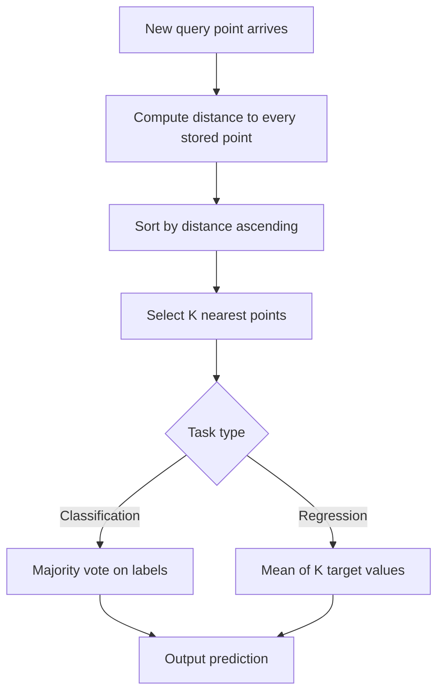

# K-Nearest Neighbors and Distances

## Learning Objectives

- Implement KNN classification from scratch in NumPy with four distance metrics and configurable K
- Compare Euclidean, Manhattan, cosine, and Minkowski distances on the same dataset and explain when each metric distorts neighbor selection
- Demonstrate how unscaled features corrupt distance computation and why standardization is mandatory before fitting
- Build a lookalike account model that retrieves the K nearest closed-won accounts for a new prospect using firmographic vectors
- Measure the curse of dimensionality by computing nearest-to-farthest distance ratios across increasing feature dimensions

## The Problem

A new account lands in your CRM with 40 firmographic features. You have 10,000 labeled accounts—some churned, some expanded, some retained. You want to predict what will happen to this new account. You could train a logistic regression, engineer features, tune hyperparameters, and hope the learned weights generalize. Or you could ask a simpler question: which existing accounts does this account most resemble, and what happened to them?

That question is the entirety of K-nearest neighbors. The algorithm stores every training point, computes the distance from a new query to all stored points, sorts by distance, takes the K closest, and aggregates their labels—majority vote for classification, mean for regression. There is no training phase. No gradient descent. No learned parameters. The training set *is* the model.

This sounds too simple to be useful. But KNN is surprisingly competitive on small-to-medium datasets, and the mechanism—distance-based retrieval—is the same mechanism powering vector databases, retrieval-augmented generation, and recommendation systems. When a tool finds "similar companies" or retrieves "relevant document chunks," it is running a neighbor search. The scale and data structures differ. The algorithm does not.

The cost of this simplicity is twofold. First, prediction time scales linearly with dataset size unless you build an index (KD-tree, ball tree, HNSW). Second, the notion of "nearest" depends entirely on your distance metric and your feature scaling. Get either wrong and the neighbors are garbage.

## The Concept

KNN is a lazy learner. Where logistic regression eagerly learns weights during training and discards the data, KNN refuses to learn anything. It holds the entire dataset in memory and does all computation at prediction time. The prediction pipeline has four stages: compute distances from the query to every stored point, sort ascending, slice the top K, and aggregate.



The distance metric defines what "nearest" means. Four metrics cover most use cases. **Euclidean distance** (L2) is the straight-line distance in feature space: $d = \sqrt{\sum_{i=1}^{n}(a_i - b_i)^2}$. It is the default choice for continuous features, but it is sensitive to outliers because the squaring amplifies large differences. **Manhattan distance** (L1) sums absolute differences: $d = \sum_{i=1}^{n}|a_i - b_i|$. It treats all dimensions linearly, which makes it more robust to outliers and appropriate when features represent grid-like or discrete quantities. **Cosine distance** measures the angle between two vectors: $d = 1 - \frac{\vec{a} \cdot \vec{b}}{|\vec{a}||\vec{b}|}$. It ignores magnitude entirely and captures directional similarity, which is why it dominates text and embedding retrieval. **Minkowski distance** generalizes both Euclidean and Manhattan: $d = (\sum_{i=1}^{n}|a_i - b_i|^p)^{1/p}$. Set $p=1$ for Manhattan, $p=2$ for Euclidean, $p \to \infty$ for Chebyshev (max coordinate difference). Higher $p$ values weight the largest dimension more heavily.

The choice of K controls the bias-variance tradeoff. K=1 means every prediction is the label of the single nearest training point—zero bias, maximum variance, and severe overfitting to noise. K=N (the full dataset) means every prediction is the majority class—maximum bias, zero variance, and no learning. Somewhere in between is the sweet spot, typically found via cross-validation. For binary classification, odd K values avoid tie votes. A common starting point is $K \approx \sqrt{N}$ rounded to the nearest odd integer.

Feature scaling is not optional. If employee count ranges from 10 to 50,000 and industry code ranges from 1 to 5, Euclidean distance is dominated by employee count. The industry code is effectively invisible. Standardization—subtracting the mean and dividing by the standard deviation per feature—puts all dimensions on comparable footing. Without it, the nearest neighbors are determined by whichever feature happens to have the largest range, not by genuine similarity.

There is a deeper problem that scaling cannot fix. As the number of features grows, all pairwise distances in the dataset converge. In high dimensions, the nearest neighbor and the farthest neighbor are nearly equidistant from any query point. If every point is roughly the same distance from the query, "nearest" loses meaning.

```python
import numpy as np

np.random.seed(42)

for dims in [2, 10, 50, 200, 500]:
    points = np.random.randn(1000, dims)
    query = np.random.randn(dims)

    dists = np.sqrt(np.sum((points - query) ** 2, axis=1))
    ratio = dists.min() / dists.max()

    print(f"dims={dims:4d}  nearest={dists.min():.3f}  farthest={dists.max():.3f}  ratio={ratio:.4f}")
```

```
dims=   2  nearest=0.132  farthest=4.504  ratio=0.0293
dims=  10  nearest=2.083  farthest=5.116  ratio=0.4071
dims=  50  nearest=6.298  farthest=9.431  ratio=0.6678
dims= 200  nearest=13.441  farthest=15.726  ratio=0.8548
dims=500  nearest=21.633  farthest