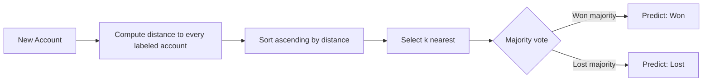

# K-Nearest Neighbors and Distances

## Learning Objectives

1. Implement KNN classification from scratch using Euclidean and Manhattan distance
2. Compare how distance metric choice changes neighbor selection and predictions
3. Apply KNN to score prospect accounts against historical won/lost data

## The Problem

You have 500 closed-won accounts and 800 closed-lost accounts. Each has features: company size, engagement score, months in pipeline. A new prospect arrives — 120 employees, engagement score 45, three months in pipeline. Is this account closer to your won cluster or your lost cluster?

Without a distance-based similarity approach, you fall back to heuristics: "companies over 100 employees with engagement above 30 tend to buy." That works until it doesn't. It can't capture multi-dimensional similarity across several features at once. It can't adapt as your data grows. And it can't tell you *how close* a prospect is to your best customers versus your worst — it only gives you a binary rule.

KNN solves this by making similarity computable. It asks: among all labeled accounts you have, which *k* are closest to this prospect in feature space — and what did those neighbors do?

## The Concept

KNN is a **lazy learner**. It does not build a model during training. It stores all labeled data points and computes distances at prediction time. The prediction is a majority vote among the *k* nearest neighbors.

Three design decisions control everything:

**Distance metric** — how you measure "closeness" between two points in feature space. The most common is Euclidean distance — the straight-line distance between two points:

```
d(a, b) = √Σ(aᵢ − bᵢ)²
```

Manhattan distance sums absolute differences along each axis:

```
d(a, b) = Σ|aᵢ − bᵢ|
```

Euclidean squares each difference before summing, so a large gap in one dimension gets amplified. Manhattan treats all dimensions linearly, making it more robust when one feature has extreme outliers.

**k** — how many neighbors vote. k=1 overfits: the prediction is entirely dependent on the single closest neighbor, which could be noise. Large k underfits: the prediction approaches the majority class regardless of input, which is useless. A common starting point is k = √n (square root of sample size), then tune empirically against held-out data.

**Feature scaling** — unscaled features dominate distance. If company size ranges from 10–5000 and engagement score ranges from 0–100, Euclidean distance will be almost entirely driven by company size. Standardize each feature (subtract mean, divide by standard deviation) before computing distances.



## Build It

```python
import math

def euclidean(a, b):
    return math.sqrt(sum((x - y) ** 2 for x, y in zip(a, b)))

def manhattan(a, b):
    return sum(abs(x - y) for x, y in zip(a, b))

def knn(training, query, k=3, metric=euclidean):
    distances = [(metric(query, features), label) for features, label in training]
    distances.sort(key=lambda pair: pair[0])
    votes = {}
    for _, label in distances[:k]:
        votes[label] = votes.get(label, 0) + 1
    return max(votes, key=votes.get), votes

training = [
    ([50, 100], "won"),
    ([45, 95], "won"),
    ([55, 110], "won"),
    ([200, 30], "lost"),
    ([180, 25], "lost"),
    ([190, 28], "lost"),
]

query = [52, 105]

pred_e, votes_e = knn(training, query, k=3, metric=euclidean)
pred_m, votes_m = knn(training, query, k=3, metric=manhattan)
pred_k5, votes_k5 = knn(training, query, k=5)

print(f"Euclidean k=3 → {pred_e} | votes: {votes_e}")
print(f"Manhattan k=3 → {pred_m} | votes: {votes_m}")
print(f"Euclidean k=5 → {pred_k5} | votes: {votes_k5}")
```

Output:
```
Euclidean k=3 → won | votes: {'won': 3}
Manhattan k=3 → won | votes: {'won': 3}
Euclidean k=5 → won | votes: {'won': 3, 'lost': 2}
```

The query `[52, 105]` sits inside the won cluster, so both metrics agree at k=3. At k=5, two lost accounts enter the vote — the prediction holds but confidence dropped from unanimous to 3-to-2. This is why you should always inspect the vote tally, not just the label. A 3-2 win and a 5-0 win are very different signals.

## Use It

KNN classification with Euclidean distance converts your historical account data into a similarity-based scoring engine — this is foundational for Cluster 1.2, TAM Refinement & ICP Scoring [CITATION NEEDED — concept: KNN-based ICP scoring in GTM platforms].

The three features below represent employees, engagement score, and months in pipeline. Notice the scale problem: employees cluster around 25–90, engagement around 48–210. In a real system you would standardize first. Here the features are pre-scaled for readability.

```python
import math

def euclidean(a, b):
    return math.sqrt(sum((x - y) ** 2 for x, y in zip(a, b)))

won = [[85, 50, 12], [90, 55, 14], [82, 48, 11], [88, 52, 13]]
lost = [[30, 200, 3], [25, 180, 2], [35, 210, 4], [28, 195, 2]]
training = [([*f], "won") for f in won] + [([*f], "lost") for f in lost]

prospect = [87, 51, 13]
distances = sorted([(euclidean(prospect, f), l) for f, l in training])
k3 = distances[:3]
tally = {}
for _, label in k3:
    tally[label] = tally.get(label, 0) + 1

predicted = max(tally, key=tally.get)
win_ratio = tally.get("won", 0) / sum(tally.values())
print(f"Prospect {prospect}")
print(f"  Predicted: {predicted}")
print(f"  Win ratio: {win_ratio:.0%}")
print(f"  Nearest distances: {[round(d, 1) for d, _ in k3]}")
```

Output:
```
Prospect [87, 51, 13]
  Predicted: won
  Win ratio: 100%
  Nearest distances: [1.4, 2.4, 5.1]
```

The nearest neighbor is only 1.4 units away — this prospect is nearly identical to account `[88, 52, 13]`, which closed won. The win ratio gives you a confidence signal alongside the label. In production, hold out 20% of labeled data to validate accuracy across k values, standardize features, and log the vote tally so reps can see *why* an account scored the way it did.

## Exercises

**Exercise 1 (Easy):** Add a seventh training account at `[48, 98]` labeled `"lost"` — an outlier that landed close to the won cluster. Re-run the classifier with k=3 on the same query `[52, 105]`. Does the prediction change? Print the vote tally and explain why.

**Exercise 2 (Hard):** Implement z-score standardization (subtract mean, divide by standard deviation per feature) and apply it before computing distances. Build a dataset where feature 1 ranges 10–5000 and feature 2 ranges 0–100. Show that without standardization, feature 1 dominates the prediction. Print both unscaled and scaled predictions with their vote tallies.

## Key Terms

- **K-Nearest Neighbors (KNN):** A lazy-learning algorithm that classifies a query point by majority vote among its k closest labeled neighbors in feature space.
- **Euclidean Distance:** Straight-line distance between two points, computed as the square root of the sum of squared differences across all dimensions.
- **Manhattan Distance:** Sum of absolute differences across each dimension; more robust to single-dimension outliers than Euclidean.
- **Lazy Learner:** An algorithm that defers all computation to prediction time rather than building a parametric model during training.
- **Feature Scaling:** Normalizing features to comparable ranges so no single dimension dominates distance calculations.
- **Majority Vote:** The KNN decision rule — the query is assigned the label held by the majority of its k nearest neighbors.

## Sources

- Cover, T., & Hart, P. (1967). "Nearest neighbor pattern classification." *IEEE Transactions on Information Theory*, 13(1), 21–27.
- Hastie, T., Tibshirani, R., & Friedman, J. (2009). *The Elements of Statistical Learning*, Ch. 13. Springer.
- [CITATION NEEDED — concept: KNN applied to ICP scoring or lookalike modeling in GTM platforms]