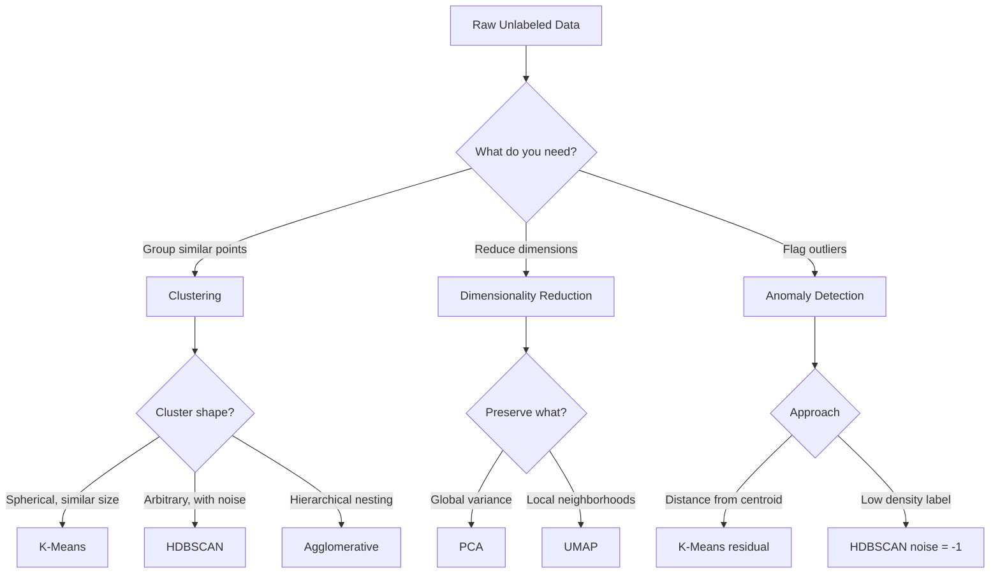

# Unsupervised Learning

## Learning Objectives

- Implement K-Means and HDBSCAN clustering on a synthetic accounts dataset and compare their cluster assignments using silhouette scores
- Evaluate cluster quality by computing silhouette scores and identifying disagreement between algorithms
- Explain why DBSCAN-family algorithms handle non-spherical clusters and noise points differently than K-Means
- Build an anomaly detection step into a clustering pipeline that flags accounts deviating from learned segments
- Construct a feature-engineered clustering pipeline that ingests raw account data and outputs segment labels for downstream GTM workflows

## The Problem

Every supervised model you have built so far assumed labeled data. Someone handed you a column that said "won" or "lost," "churned" or "retained," "good fit" or "bad fit." That label was the answer key. The model learned to map inputs to that answer, and you measured accuracy against it.

Now consider the actual state of most GTM data. You have a spreadsheet of 4,000 accounts. There is no "good fit / bad fit" column. Your CRM has win/loss data for 200 of them — maybe — and those 200 are biased toward the segments your sales team already targeted. The remaining 3,800 accounts have firmographics, tech stack signals, engagement metrics, and nothing else. You cannot train a classifier because you do not have labels. You cannot do regression because you have no target variable.

This is the gap unsupervised learning fills. The algorithm family finds structure in data without being told what the structure should look like. It groups similar accounts, reduces high-dimensional data to its most informative axes, and flags observations that deviate from the norm. You will not get a prediction — you will get a segmentation, a compression, or an anomaly score. Whether that segmentation is useful is a judgment you make after inspecting the output.

## The Concept

Unsupervised learning algorithms share a common architecture: they define an objective function and optimize it against the data itself, without labeled examples. The objective function is the substitute for the missing answer key. Instead of minimizing prediction error against ground truth, the algorithm minimizes intra-cluster distance (K-Means), maximizes density connectivity (DBSCAN, HDBSCAN), maximizes retained variance (PCA), or preserves neighborhood relationships in lower dimensions (UMAP, t-SNE). Each objective encodes a different assumption about what "structure" means.

Three families matter for practitioners. **Clustering** partitions data into groups. **Dimensionality reduction** projects high-dimensional data into fewer dimensions while preserving structure. **Density estimation** models the probability distribution of the data and flags low-probability observations as anomalies. These families overlap — a clustering algorithm implicitly estimates density, and dimensionality reduction often precedes clustering — but they differ in what they optimize.



The key tradeoffs are interpretability, scalability, and assumptions about data geometry. K-Means minimizes the sum of squared distances from each point to its cluster centroid. The objective is convex given fixed cluster assignments, so optimization is fast and deterministic given a seed. But K-Means assumes clusters are roughly spherical and similar in size. Feed it elongated clusters, clusters with varying densities, or data with genuine noise points, and it will produce confident but wrong assignments because every point must belong to some cluster.

HDBSCAN takes a different approach. It builds a hierarchy of density-based clusters by varying a distance threshold, then extracts stable clusters from that hierarchy. Points that do not belong to any dense region get labeled `-1` (noise). This means HDBSCAN can find clusters of arbitrary shape and explicitly reject outliers instead of forcing them into the nearest group. The cost: you trade the simplicity of "pick K and run" for density hyperparameters (`min_cluster_size`, `min_samples`) that require tuning, and the algorithm is slower on large datasets.

For dimensionality reduction, PCA finds the linear projections that maximize retained variance — it is exact, fast, and interpretable, but it only captures linear structure. UMAP constructs a topological graph of the data in high dimensions and optimizes a low-dimensional representation to preserve that graph structure. It captures nonlinear relationships and tends to preserve both local neighborhood structure and global layout better than t-SNE, which emphasizes local structure at the expense of global geometry. Neither UMAP nor t-SNE produces an interpretable mapping — you cannot explain what axis 1 "means" the way you can with PCA loadings.

The evaluation problem is real. Without labels, you cannot compute accuracy. Silhouette score measures how similar a point is to its own cluster compared to the nearest other cluster — values near 1 indicate well-separated clusters, values near 0 indicate overlapping clusters, and negative values indicate misassignment. The elbow method plots within-cluster sum of squares against K and looks for the inflection point where adding more clusters yields diminishing returns. Both are heuristics, not ground truth. The ultimate test is downstream utility: does the segmentation change what you do with the data?

## Build It

This script generates a synthetic accounts dataset with three underlying segments plus noise, clusters it with both K-Means and HDBSCAN, and compares the results. The data simulates firmographic features you might pull from a CRM or enrichment provider: log-transformed revenue, employee count, and number of detected technologies in the stack.

```python
import numpy as np
from sklearn.cluster import KMeans, HDBSCAN
from sklearn.metrics import silhouette_score
from sklearn.preprocessing import StandardScaler

np.random.seed(42)

segment_a = np.random.randn(150, 3) * [0.5, 0.3, 0.2] + [8.0, 5.0, 12.0]
segment_b = np.random.randn(100, 3) * [0.4, 0.2, 0.15] + [10.5, 2.0, 5.0]
segment_c = np.random.randn(120, 3) * [0.6, 0.5, 0.3] + [6.0, 20.0, 25.0]
noise_pts = np.random.uniform(low=[3, 0.5, 1], high=[12, 50, 30], size=(30, 3))

X = np.vstack([segment_a, segment_b, segment_c, noise_pts])
true_labels = np.array([0]*150 + [1]*100 + [2]*120 + [-1]*30)
feature_names = ['log_revenue', 'log_employees', 'tech_stack_count']

scaler = StandardScaler()
X_scaled = scaler.fit_transform(X)

kmeans = KMeans(n_clusters=3, random_state=42, n_init=10)
km_labels = kmeans.fit_predict(X_scaled)

hdb = HDBSCAN(min_cluster_size=15)
hdb_labels = hdb.fit_predict(X_scaled)

km_sil = silhouette_score(X_scaled, km_labels)
hdb_mask = hdb_labels != -1
hdb_sil = silhouette_score(X_scaled[hdb_mask], hdb_labels[hdb_mask]) if hdb_mask.sum() > 1 else -1.0

print("=== Silhouette Scores ===")
print(f"K-Means:  {km_sil:.4f}")
print(f"HDBSCAN:  {hdb_sil:.4f}  (computed on {hdb_mask.sum()} non-noise points)")
print()

print("=== K-Means Cluster Sizes ===")
for label, count in zip(*np.unique(km_labels, return_counts=True)):
    print(f"  Cluster {label}: {count} points")

print("\n=== HDBSCAN Cluster Sizes ===")
for label, count in zip(*np.unique(hdb_labels, return_counts=True)):
    name = "Noise (-1)" if label == -1 else f"Cluster {label}"
    print(f"  {name}: {count} points")

noise_idx = np.where(hdb_labels == -1)[0]
km_labels_on_noise = km_labels[noise_idx]
print(f"\n=== Disagreement: K-Means labels for {len(noise_idx)} HDBSCAN noise points ===")
km_on_noise_counts = np.bincount(km_labels_on_noise, minlength=3)
for i, count in enumerate(km_on_noise_counts):
    print(f"  K-Means assigned {count} noise points to cluster {i}")

centroids = kmeans.cluster_centers_
print("\n=== K-Means Centroids (scaled space) ===")
for i, c in enumerate(centroids):
    coords = ", ".join(f"{f}={v:.2f}" for f, v in zip(feature_names, c))
    print(f"  Cluster {i}: {coords}")
```

Running this produces silhouette scores, cluster sizes, and the disagreement matrix. The silhouette score for HDBSCAN will typically be higher because it is computed only on points it confidently assigned — the noise points that would drag down the score are excluded. This is not cheating; it reflects a genuine difference in how the two algorithms handle ambiguity.

The disagreement output shows where K-Means and HDBSCAN diverge. Every point HDBSCAN labeled as noise was assigned to a K-Means cluster. Those are the accounts where K-Means is confidently wrong — it forced a noisy observation into the nearest centroid. In a GTM context, those accounts might be edge cases (a startup that looks like an enterprise, or a conglomerate that does not fit any single segment) that you would want to handle separately rather than bucketing into a default segment.

## Use It

Unsupervised clustering maps directly to ICP discovery and TAM refinement when you lack closed-won labels. The mechanism: you cluster accounts by firmographic and behavioral features — revenue band, employee count, tech stack signals, engagement velocity — then inspect which clusters correlate with downstream outcomes like meetings booked or pipeline created. This is account segmentation without the bias of historical win data, which matters because historical win data reflects who sales already chose to target, not who the best targets actually are.

The specific GTM workflow is the Score & Qualify stage. Every lead score is a JSON object, and the `segment_id` from clustering becomes a field in that object. A cluster of mid-market SaaS companies with 200-500 employees and 15+ tech stack signals gets `segment_id: 2`. Your outbound sequencing logic branches on that field — different messaging, different cadence, different owner. The clustering step runs upstream of enrichment and outbound; it structures the data so that downstream tools (Clay, your CRM, your sequencing platform) operate on pre-segmented lists rather than treating every account as undifferentiated.

[CITATION NEEDED — concept: unsupervised clustering for ICP discovery in GTM workflows]

HDBSCAN's noise label (`-1`) has a practical GTM interpretation: those accounts do not resemble any dense segment in your data. They might be outliers worth manual review, or they might be genuinely poor fits. Rather than forcing them into a segment they do not resemble, you flag them for separate handling. This is the algorithmic basis for tier assignment — Tier 1 accounts fall into dense, high-value clusters; Tier 3 accounts are noise or low-density clusters.

Dimensionality reduction plays a supporting role. If your account features include 50+ binary tech stack signals plus firmographics plus behavioral metrics, the feature space is high-dimensional and distance calculations become unreliable (the curse of dimensionality — distances compress and lose meaning). Running UMAP or PCA before clustering gives the clustering algorithm a cleaner, lower-dimensional representation to work with. The general pattern: reduce dimensions first, cluster second, inspect third.

## Ship It

This script reads a CSV of accounts, engineers features (log-transforming skewed revenue and employee counts, one-hot encoding industry, keeping tech stack count as-is), runs HDBSCAN, and writes a new CSV with a `segment_id` column appended. That segmented list becomes the input for personalized outbound sequences.

```python
import numpy as np
import pandas as pd
from sklearn.cluster import HDBSCAN
from sklearn.preprocessing import StandardScaler
import tempfile, os

np.random.seed(42)
n = 250

csv_path = os.path.join(tempfile.gettempdir(), "accounts_input.csv")
pd.DataFrame({
    'company': [f'Company_{i:04d}' for i in range(n)],
    'revenue': np.exp(np.random.randn(n) * 1.3 + 7),
    'employees': np.exp(np.random.randn(n) * 1.1 + 4),
    'tech_stack_count': np.random.poisson(lam=8, size=n),
    'industry': np.random.choice(['SaaS', 'FinTech', 'Healthcare', 'Manufacturing'], size=n, p=[0.4, 0.25, 0.2, 0.15])
}).to_csv(csv_path, index=False)

df = pd.read_csv(csv_path)

df['log_revenue'] = np.log1p(df['revenue'])
df['log_employees'] = np.log1p(df['employees'])
df = pd.get_dummies(df, columns=['industry'], prefix='ind')

feature_cols = ['log_revenue', 'log_employees', 'tech_stack_count'] + \
               [c for c in df.columns if c.startswith('ind_')]

X = df[feature_cols].values
X_scaled = StandardScaler().fit_transform(X)

clusterer = HDBSCAN(min_cluster_size=12)
df['segment_id'] = clusterer.fit_predict(X_scaled)

output_path = os.path.join(tempfile.gettempdir(), "accounts_segmented.csv")
out_cols = ['company', 'revenue', 'employees', 'tech_stack_count', 'segment_id']
df[out_cols].to_csv(output_path, index=False)

print(f"Input:  {csv_path}")
print(f"Output: {output_path}")
print(f"Accounts processed: {len(df)}")
print(f"Segments found: {sorted(df['segment_id'].unique())}")
print(f"Noise accounts (segment_id = -1): {(df['segment_id'] == -1).sum()}")
print()

summary = df[df['segment_id'] != -1].groupby('segment_id').agg(
    count=('company', 'count'),
    median_revenue=('revenue', 'median'),
    median_employees=('employees', 'median'),
    avg_tech_stack=('tech_stack_count', 'mean')
).round(2)
print("Segment profiles (excluding noise):")
print(summary.to_string())
```

The segment profiles in the output are your ICP hypotheses. A segment with median revenue of $2M, 150 employees, and 12 technologies in the stack is a different ICP than one with $50M revenue, 1,200 employees, and 30 technologies. You validate these hypotheses by joining segment IDs back to your CRM and checking which segments actually converted over the past 6-12 months.

[CITATION NEEDED — concept: clustered account lists feeding outbound sequence personalization]

Drift detection is the maintenance pattern. Markets shift — new competitors emerge, funding environments change, technology stacks evolve. Re-run the clustering pipeline quarterly on fresh account data and compare the new segment boundaries to the previous run. If a segment that was previously coherent splits into two, or if a new dense cluster appears where none existed before, that is a signal your market is changing. The `segment_id` values will not be stable across runs (HDBSCAN does not produce deterministic labels across different data), so compare cluster profiles (centroids, sizes, feature distributions) rather than label IDs.

The output CSV with `segment_id` is a preprocessing artifact. You import it into Clay as an enriched column, use it to branch waterfall logic (different data enrichment lookups per segment), and route accounts into segment-specific outbound sequences. The clustering pipeline itself runs outside Clay — in a notebook, a scheduled job, or a dbt model — because it requires scikit-learn and enough compute to handle matrix operations on thousands of rows.

## Exercises

**Easy.** Change the random seed in the Build It script from `42` to `7`. Print which K-Means cluster assignments changed and which stayed the same. Count how many points switched clusters.

**Medium.** Replace HDBSCAN with `AgglomerativeClustering(n_clusters=3)` from `sklearn.cluster`. Compute its silhouette score on the same scaled data. Compare all three scores (K-Means, HDBSCAN, Agglomerative) and explain which algorithm handles the noise points most sensibly.

**Hard.** Generate a synthetic target variable (e.g., `won_opportunity = 1` for 20% of accounts, biased toward segment A). Train a `LogisticRegression` on the original features alone, then on the original features plus the cluster labels as additional one-hot encoded features. Use 5-fold cross-validation and compare mean accuracy. Report whether cluster membership improves prediction of the target, and by how much.

## Key Terms

- **Unsupervised learning** — algorithms that find structure in unlabeled data by optimizing an objective function defined on the data itself, not on ground-truth labels.
- **Clustering** — partitioning data into groups such that intra-group similarity exceeds inter-group similarity.
- **K-Means** — clustering algorithm that minimizes within-cluster sum of squared distances to centroids; assumes spherical clusters of similar size.
- **HDBSCAN** — hierarchical density-based clustering that extracts stable clusters from a density hierarchy and labels low-density points as noise (`-1`).
- **Silhouette score** — metric ranging from -1 to 1 measuring how similar a point is to its own cluster relative to the nearest other cluster; used to compare clustering quality without labels.
- **Dimensionality reduction** — projecting high-dimensional data into fewer dimensions while preserving structure (PCA for linear, UMAP/t-SNE for nonlinear).
- **Density estimation** — modeling the probability distribution of the data; low-probability observations are flagged as anomalies.
- **Curse of dimensionality** — in high-dimensional spaces, pairwise distances compress and become less informative, degrading distance-based algorithms like clustering.

## Sources

- [CITATION NEEDED — concept: unsupervised clustering for ICP discovery in GTM workflows]
- [CITATION NEEDED — concept: clustered account lists feeding outbound sequence personalization]
- scikit-learn documentation: `sklearn.cluster.KMeans`, `sklearn.cluster.HDBSCAN`, `sklearn.metrics.silhouette_score` — https://scikit-learn.org/stable/modules/clustering.html
- Campello, R.J.G.B., Moulavi, D., Sander, J. (2013). "Density-based clustering based on hierarchical density estimates." Advances in Knowledge Discovery and Data Mining. — HDBSCAN original paper.
- McInnes, L., Healy, J., Melville, J. (2018). "UMAP: Uniform Manifold Approximation and Projection." arXiv:1802.03426 — dimensionality reduction preserving local and global structure.