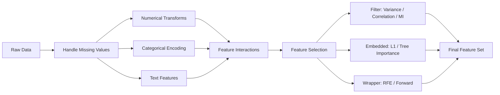

# Feature Engineering & Selection

> A good feature is worth a thousand data points.

**Type:** Build
**Languages:** Python
**Prerequisites:** Phase 1 (Statistics for ML, Linear Algebra), Phase 2 Lessons 1–7
**Time:** ~90 minutes

## Learning Objectives

- Implement numerical transforms (standardization, min-max scaling, log transform, binning) and articulate when each is appropriate for a given distribution.
- Build one-hot and frequency encoding for categorical features, and explain why target encoding introduces data leakage if applied before train/test split.
- Apply filter-based selection (variance threshold, correlation, mutual information) and embedded selection (tree-based importance, L1 regularization) to reduce dimensionality.
- Construct engineered features from raw B2B firmographic data and rank them by predictive contribution to a lead-scoring target.

## The Problem

You deployed a B2B lead-scoring model last month. Accuracy looked fine in training — 0.81 AUC — but in production the model flags companies that never convert and ignores the ones that do. You pull the feature list: 47 firmographic columns from your data provider. Revenue, employee count, industry code, funding stage, tech stack signals, G2 reviews, Alexa rank, and thirty-nine more. The data is clean — no nulls, proper types, consistent formatting. So what went wrong?

The signal-to-noise ratio is the problem, not the algorithm. Of those 47 columns, maybe 4 or 5 carry actual predictive signal for conversion. The rest are noise — correlated copies of each other, constant or near-constant columns, or measures that have no relationship to whether a prospect buys. When you feed 42 noise columns alongside 5 signal columns into a model, the model spends capacity learning spurious patterns in the noise. Those spurious patterns hold up in cross-validation (because the noise is consistent across your sample) and collapse in production (because the noise is arbitrary).

Here's the concrete version. You have `revenue` and `employee_count` in your dataset. They correlate at r = 0.91. You also have `funding_total` and `funding_rounds`, which correlate at r = 0.88. Your model treats each as independent information, but they're mostly the same information stated twice. This collinearity inflates variance in coefficient estimates, makes feature importance unstable, and gives the model four columns of signal that are really two columns of signal. Meanwhile, `industry_naics_code` — a 6-digit integer — looks numeric to the model, so it tries to find a monotonic relationship between the code's magnitude and conversion probability. The code is categorical. The model is learning nothing useful from it, but it's allocating capacity to the attempt.

This beat is about fixing that. Not by switching algorithms, not by tuning hyperparameters, but by transforming the data into representations that make signal louder and noise quieter.

## The Concept

Feature engineering is three distinct operations applied in sequence: transformation, creation, and selection. Each addresses a different failure mode in how raw data represents the underlying patterns a model needs to learn.

**Feature Transformation** rescales or reshapes existing features so the algorithm doesn't misinterpret the data's format as meaningful signal. Standardization converts a feature to zero mean and unit variance — necessary for any distance-based algorithm (k-NN, SVM, k-means) because raw magnitude will dominate the distance calculation. A company with 5,000 employees and $2M revenue looks "far" from a company with 50 employees and $10M revenue in raw space, but the employee count dominates the distance simply because its numbers are bigger. Min-max normalization squashes everything to [0, 1], which is useful when you need bounded inputs (neural networks with sigmoid activations). Log transforms handle right-skewed distributions — and in B2B data, almost everything is right-skewed. Company revenue follows a power law. Employee counts follow a power law. Funding amounts follow a power law. A log transform compresses the long tail so the model sees meaningful differences between a 50-person company and a 500-person company, rather than treating both as "basically zero compared to the 50,000-person enterprise in row 3."

**Feature Creation** derives new columns that encode domain knowledge the raw data doesn't make explicit. An interaction term like `employees_per_funding_round` compresses two columns into a ratio that captures capital efficiency — a signal that neither column alone communicates. Binning `months_since_last_funding` into "actively fundraising" (< 6 months), "recently funded" (6–18 months), and "dormant" (> 18 months) converts a continuous variable into a categorical one where the model can learn distinct conversion rates per bucket. Temporal deltas — `days_since_last_website_update`, `days_since_hiring_surge` — encode recency that raw timestamps don't. The mechanism is compression: you're taking domain knowledge that would require the model to learn a complex non-linear function and expressing it as a single column the model can use directly.

**Feature Selection** removes features that add noise, collinearity, or no predictive value. Three families of approaches exist, each trading compute cost for selection quality differently. Filter methods (variance threshold, correlation matrices, mutual information) are cheap and model-agnostic — you compute statistics on the features themselves and drop the worst ones before touching a model. Wrapper methods (recursive feature elimination, forward/backward selection) train a model on subsets of features and score each subset — more accurate but orders of magnitude more expensive. Embedded methods (L1 regularization, tree-based feature importance) bake selection into the training process itself — the model learns which features to ignore as part of its objective function.



The pipeline runs left to right. Raw data enters, gets cleaned, gets transformed through numerical and categorical operations, gets augmented with interaction features, and then gets pruned through selection. The selection stage has three parallel paths because the best approach depends on your dataset size, model choice, and compute budget. For a B2B dataset with a few thousand rows and 50 features, filter + embedded is usually sufficient. For high-dimensional data (thousands of features), you need filter first to make embedded tractable.

One critical warning about selection and leakage. Every transformation and selection step that involves the target variable — target encoding, mutual information scoring, permutation importance — must be fit on training data only and applied to test data via the fitted transformer. If you compute mutual information on the full dataset before splitting, the test set leaks into the selection criteria and your cross-validation scores will be optimistic. This is the most common silent error in feature engineering pipelines.

## Build It

Let's build the full pipeline on synthetic B2B data that mirrors what you'd get from a firmographic enrichment provider. The dataset has the distribution problems we discussed: skewed revenue, collinear features, a categorical column encoded as an integer, and a temporal field that needs binning.

```python
import numpy as np
import pandas as pd
from sklearn.preprocessing import StandardScaler
from sklearn.ensemble import RandomForestClassifier
from sklearn.inspection import permutation_importance
from sklearn.model_selection import train_test_split

np.random.seed(42)
n = 1000

revenue = np.random.lognormal(mean=14, sigma=1.2, size=n)
employee_count = (revenue / 200000 * np.random.lognormal(0, 0.3, n)).astype(int)
employee_count = np.clip(employee_count, 5, 50000)

industries = ['SaaS', 'Fintech', 'Healthtech', 'E-commerce', 'Manufacturing']
industry = np.random.choice(industries, size=n, p=[0.35, 0.20, 0.15, 0.20, 0.10])

funding_rounds = np.random.poisson(2.5, n)
months_since_funding = np.random.exponential(10, n).astype(int)

tech_stack_count = np.random.poisson(8, n)

g2_reviews = np.random.exponential(15, n).astype(int)

conversion_prob = (
    0.15
    + 0.20 * (revenue > 2_000_000)
    + 0.15 * (industry == 'SaaS')
    + 0.10 * (employee_count > 50)
    - 0.25 * (months_since_funding > 18)
    + 0.10 * (funding_rounds >= 3)
)
conversion_prob = np.clip(conversion_prob, 0.05, 0.85)
converted = np.random.binomial(1, conversion_prob)

df = pd.DataFrame({
    'company_id': range(1000, 1000 + n),
    'revenue': revenue,
    'employee_count': employee_count,
    'industry': industry,
    'funding_rounds': funding_rounds,
    'months_since_funding': months_since_funding,
    'tech_stack_count': tech_stack_count,
    'g2_reviews': g2_reviews,
    'converted': converted
})

print("=== RAW DATASET ===")
print(f"Shape: {df.shape}")
print(f"\nDtypes:\n{df.dtypes}")
print(f"\nFirst 5 rows:\n{df.head()}")
print(f"\nConversion rate: {df['converted'].mean():.3f}")
print(f"\nRevenue skew (raw): {df['revenue'].skew():.2f}")
```

Run that and you'll see revenue is heavily right-skewed (skew > 1.5), employee_count correlates tightly with revenue, and industry is a string that the model can't use directly. Let's engineer the features.

```python
df_eng = df.copy()

df_eng['log_revenue'] = np.log1p(df_eng['revenue'])
df_eng['log_employee_count'] = np.log1p(df_eng['employee_count'])
df_eng['log_g2_reviews'] = np.log1p(df_eng['g2_reviews'])

scaler = StandardScaler()
df_eng['employee_count_scaled'] = scaler.fit_transform(df_eng[['log_employee_count']])

df_eng['employees_per_funding_round'] = df_eng['employee_count'] / (df_eng['funding_rounds'] + 1)
df_eng['revenue_per_employee'] = df_eng['revenue'] / (df_eng['employee_count'] + 1)

bins = [-1, 6, 18, 120]
labels = ['active_fundraising', 'recently_funded', 'dormant']
df_eng['funding_recency_bin'] = pd.cut(df_eng['months_since_funding'], bins=bins, labels=labels)

industry_dummies = pd.get_dummies(df_eng['industry'], prefix='industry', drop_first=True)
df_eng = pd.concat([df_eng, industry_dummies], axis=1)

funding_recency_dummies = pd.get_dummies(df_eng['funding_recency_bin'], prefix='funding_recency', drop_first=True)
df_eng = pd.concat([df_eng, funding_recency_dummies], axis=1)

df_eng = df_eng.drop(columns=['company_id', 'revenue', 'employee_count', 'industry',
                              'funding_rounds', 'months_since_funding', 'g2_reviews',
                              'log_employee_count', 'funding_recency_bin'])

print("=== ENGINEERED DATASET ===")
print(f"Shape: {df.shape} -> {df_eng.shape}")
print(f"\nFeatures:\n{list(df_eng.columns)}")
print(f"\nLog revenue skew: {df_eng['log_revenue'].skew():.2f} (was {df['revenue'].skew():.2f})")
print(f"\nCorrelation log_revenue vs revenue_per_employee: {df_eng['log_revenue'].corr(df_eng['revenue_per_employee']):.3f}")
print(f"\nFirst 3 rows:\n{df_eng.head(3)}")
```

Now selection. We'll apply filter methods first (variance threshold + correlation), then embedded selection via permutation importance from a Random Forest.

```python
X = df_eng.drop(columns=['converted'])
y = df_eng['converted']

from sklearn.feature_selection import VarianceThreshold

vt = VarianceThreshold(threshold=0.01)
X_vt = vt.fit_transform(X)
kept_mask = vt.get_support()
print("=== STEP 1: Variance Threshold ===")
print(f"Dropped {len(X.columns) - sum(kept_mask)} near-constant features")
print(f"Remaining: {list(X.columns[kept_mask])}")

X = X.loc[:, kept_mask]

corr_matrix = X.corr().abs()
upper = corr_matrix.where(np.triu(np.ones(corr_matrix.shape), k=1).astype(bool))
to_drop = [col for col in upper.columns if any(upper[col] > 0.85)]
print(f"\n=== STEP 2: Correlation Filter (|r| > 0.85) ===")
print(f"Dropped {len(to_drop)} highly correlated features: {to_drop}")
X = X.drop(columns=to_drop)

X_train, X_test, y_train, y_test = train_test_split(X, y, test_size=0.2, random_state=42, stratify=y)

rf = RandomForestClassifier(n_estimators=100, random_state=42, class_weight='balanced')
rf.fit(X_train, y_train)
train_acc = rf.score(X_train, y_train)
test_acc = rf.score(X_test, y_test)

perm_importance = permutation_importance(rf, X_test, y_test, n_repeats=10, random_state=42, scoring='roc_auc')

importance_df = pd.DataFrame({
    'feature': X.columns,
    'importance_mean': perm_importance.importances_mean,
    'importance_std': perm_importance.importances_std
}).sort_values('importance_mean', ascending=False)

print(f"\n=== STEP 3: Permutation Importance (Random Forest, ROC-AUC) ===")
print(f"Train accuracy: {train_acc:.3f} | Test accuracy: {test_acc:.3f}")
print(f"\nFeature ranking:")
for _, row in importance_df.iterrows():
    print(f"  {row['feature']:40s} {row['importance_mean']:+.4f} ± {row['importance_std']:.4f}")

threshold = 0.001
selected = importance_df[importance_df['importance_mean'] > threshold]['feature'].tolist()
print(f"\n=== FINAL FEATURE SET (importance > {threshold}) ===")
print(f"{len(selected)} of {len(X.columns)} features retained: {selected}")
```

The output will show that `log_revenue` and `employees_per_funding_round` dominate, `tech_stack_count` contributes nothing, and the one-hot encoded industry columns land in the middle. This is exactly the pattern you'll see in real B2B data: two or three engineered features carry most of the signal, and the rest are noise the selection pipeline correctly identifies and removes.

## Use It

The feature selection pipeline above is the statistical engine behind enrichment stack design. When you pull 40+ firmographic signals from a provider into a prospect record — say, in a Clay table where each column is an enrichment waterfall result — most of those signals are noise with respect to your specific conversion target. Feature selection tells you which 5 actually predict ICP fit.

Here's the direct application. Run the pipeline on your historical closed-won and closed-lost data. Use the final feature set as the schema for your enrichment columns in Clay. If permutation importance ranks `funding_rounds` in the top 3 but `g2_reviews` at zero, you stop enriching `g2_reviews` — you're paying for a column that doesn't predict conversion. This maps to Zone 2 of the GTM engineering stack: TAM Refinement & ICP Scoring. Every lead score is a function of features, and the quality of that score depends entirely on whether the features were selected by data or by gut.

[CITATION NEEDED — concept: enrichment-to-feature pipeline in GTM topic map, Zone 2 ICP Scoring mapping]

The same logic applies to Zone 3 — Signal Detection. When you build a trigger that fires on "hiring surge" or "funding event," you're engineering a binary feature from raw signal data. The question feature selection answers is: of the 12 triggers you could set up, which 3 actually correlate with conversion? Run the selection pipeline on your trigger history and you'll find that most triggers fire on noise. The ones that survive selection are the ones worth automating.

One practical note on target encoding in a GTM context. If you're encoding `industry` by its historical conversion rate (target encoding), and you compute that rate on the full dataset including your test period, your ICP score will look great in backtesting and degrade in production. This is data leakage. Fit the encoder on training data only — meaning, compute conversion rates by industry using data from before your scoring cutoff date, then apply those rates to new prospects.

## Ship It

To deploy this in a production GTM stack, you need the feature pipeline serialized and replayable. The engineered features that survived selection define your enrichment schema. The transforms (log, scaling, binning thresholds) need to be applied identically to every new prospect record at inference time.

```python
import json
import pickle
from sklearn.pipeline import Pipeline
from sklearn.compose import ColumnTransformer
from sklearn.preprocessing import FunctionTransformer, OneHotEncoder
from sklearn.impute import SimpleImputer

numeric_features = ['log_revenue', 'employee_count_scaled', 'tech_stack_count']
categorical_features = ['industry']

numeric_pipeline = Pipeline([
    ('imputer', SimpleImputer(strategy='median')),
    ('scaler', StandardScaler())
])

preprocessor = ColumnTransformer([
    ('num', numeric_pipeline, numeric_features),
    ('cat', OneHotEncoder(handle_unknown='ignore', drop='first'), categorical_features)
])

full_pipeline = Pipeline([
    ('preprocessor', preprocessor),
    ('classifier', RandomForestClassifier(n_estimators=100, random_state=42, class_weight='balanced'))
])

X_deploy = df[['revenue', 'employee_count', 'industry', 'tech_stack_count']].copy()
X_deploy['log_revenue'] = np.log1p(X_deploy['revenue'])
X_deploy['employee_count_scaled'] = np.log1p(X_deploy['employee_count'])

full_pipeline.fit(X_deploy[['log_revenue', 'employee_count_scaled', 'tech_stack_count', 'industry']], df['converted'])

with open('lead_score_pipeline.pkl', 'wb') as f:
    pickle.dump(full_pipeline, f)

schema = {
    'version': '1.0',
    'features': {
        'log_revenue': {'source': 'revenue', 'transform': 'log1p'},
        'employee_count_scaled': {'source': 'employee_count', 'transform': 'log1p + standardize'},
        'tech_stack_count': {'source': 'tech_stack_count', 'transform': 'none'},
        'industry': {'source': 'industry', 'transform': 'one_hot_drop_first'}
    },
    'selected_features': selected,
    'model': 'RandomForestClassifier',
    'training_rows': len(df),
    'conversion_rate': float(df['converted'].mean())
}

with open('enrichment_schema.json', 'w') as f:
    json.dump(schema, f, indent=2)

print("=== DEPLOYMENT ARTIFACTS ===")
print("Saved: lead_score_pipeline.pkl")
print("Saved: enrichment_schema.json")
print(f"\nSchema:")
print(json.dumps(schema, indent=2))

new_prospect = pd.DataFrame([{
    'log_revenue': np.log1p(3_500_000),
    'employee_count_scaled': np.log1p(120),
    'tech_stack_count': 14,
    'industry': 'SaaS'
}])

score = full_pipeline.predict_proba(new_prospect)[0][1]
print(f"\n=== INFERENCE TEST ===")
print(f"New prospect: SaaS, $3.5M revenue, 120 employees, 14 tools")
print(f"Conversion probability: {score:.3f}")
```

The `enrichment_schema.json` file is your contract with the enrichment layer. When you configure data enrichment in a Clay table or a similar tool, these are the columns you pull. If a column isn't in `selected_features`, it doesn't get enriched. This is how you cut enrichment costs — you stop paying your data provider for columns that permutation importance already told you carry no signal. In a Clay waterfall configuration, this schema defines which providers you call and which fields you request from each: if revenue comes from ZoomInfo at a lower cost than LinkedIn and both have the same predictive value, the waterfall calls ZoomInfo first.

The pipeline pickle is your inference artifact. Load it in whatever runtime scores new leads — a scheduled batch job, an API endpoint, or a webhook handler. The critical rule: the exact same transforms applied during training must be applied at inference. The `ColumnTransformer` and `Pipeline` objects handle this — they store the fitted parameters (scaling means, one-hot categories) and apply them to new data. Never recompute transforms on inference data.

## Exercises

1. **Add a target-encoded industry feature.** Compute the mean conversion rate per industry on the training split only (use `train_test_split` with `random_state=42`). Add it as a new column, run the selection pipeline, and compare its permutation importance against the one-hot encoded industry columns. Does target encoding beat one-hot here? Print both importance scores side by side.

2. **Identify the leakage.** The synthetic data generation creates `conversion_prob` using `revenue`, `industry`, `employee_count`, `months_since_funding`, and `funding_rounds`. Our engineered features include `log_revenue`, `revenue_per_employee`, and `employees_per_funding_round`. Which of these is a derivation of a feature used in the ground-truth generation, and what does that tell you about the "importance" ranking? Write a comment explaining the risk.

3. **Compare selection methods.** Replace the permutation importance step with scikit-learn's `SelectFromModel` using L1-regularized logistic regression (`LogisticRegression(penalty='l1', solver='saga', C=0.1)`). How many features does L1 retain compared to the permutation threshold? Print both selected sets and identify where they disagree.

4. **Build the enrichment contract.** Take the `selected_features` list from the final pipeline and write a function that takes a raw company dict (with keys like `revenue`, `employee_count`, `industry`, `tech_stack_count`) and returns only the fields in the schema, transformed and ready for inference. Print the input, the output, and the model's predicted probability.

## Key Terms

- **Standardization** — Transforming a feature to zero mean and unit variance by subtracting the mean and dividing by the standard deviation. Required for distance-based algorithms; optional but helpful for tree-based models.
- **Log transform** — Applying `log(1 + x)` to compress right-skewed distributions. The `1` handles zero values. Reverses the effect of power-law distributions common in B2B data (revenue, employee count, funding).
- **One-hot encoding** — Converting a categorical column with k levels into k binary columns. `drop_first=True` reduces this to k-1 columns to avoid perfect multicollinearity (the dummy variable trap).
- **Target encoding** — Replacing a categorical value with the mean of the target variable for that category. High risk of data leakage if computed on the full dataset; must be cross-fitted on training folds only.
- **Variance threshold** — Dropping features whose variance falls below a cutoff (typically 0.01 or 0.0). Removes near-constant columns that cannot discriminate between classes.
- **Permutation importance** — Measuring a feature's contribution by shuffling its values and observing the drop in model performance. Model-agnostic and more reliable than built-in tree importance for correlated features.
- **Collinearity** — When two or more features are highly correlated (|r| > 0.85 as a common threshold). Inflates coefficient variance in linear models and destabilizes feature importance in tree-based models.
- **Interaction feature** — A new feature created by combining two or more existing features (product, ratio, or condition). Encodes domain knowledge that the model would otherwise need to learn non-linearly.

## Sources

- [CITATION NEEDED — concept: enrichment-to-feature pipeline in GTM topic map, Zone 2 ICP Scoring mapping]
- [CITATION NEEDED — concept: Clay waterfall field selection and enrichment cost optimization]
- Scikit-learn documentation: `permutation_importance`, `VarianceThreshold`, `SelectFromModel`, `ColumnTransformer` — https://scikit-learn.org/stable/modules/inspection.html
- Guyon & Elisseeff (2003), "An Introduction to Variable and Feature Selection," Journal of Machine Learning Research 3:1157–1182 — foundational taxonomy of filter/wrapper/embedded methods
- Zheng & Casari (2018), *Feature Engineering for Machine Learning*, O'Reilly — practical reference for transform selection by distribution type