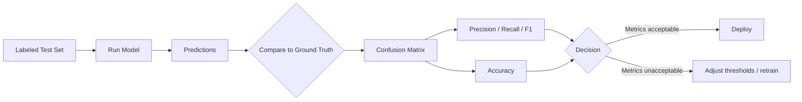

# Model Evaluation

## Learning Objectives

1. **Compute** precision, recall, F1, and accuracy from a confusion matrix on a labeled test set
2. **Build** an LLM-as-judge evaluator that scores generative outputs against a defined rubric
3. **Compare** two models on the same test set and decide which failure mode (false positives vs. false negatives) is more costly for a given GTM motion

## The Problem

You deployed an LLM to classify inbound leads as "sales-qualified" or "nurture." The AEs complained that half the routed leads were junk. You assumed the model was accurate because you spot-checked ten outputs and they looked right. They weren't — you sampled ten out of four thousand, all from the same industry, on the same day, and you have no idea what the model does on edge cases.

This is the evaluation gap: the distance between "it looks right when I eyeball it" and "I can quantify how wrong it is, in which direction, and against what baseline." Without a labeled test set and a systematic scoring mechanism, you are flying blind. Every GTM AI system — lead scoring, message personalization, churn prediction, intent classification — will degrade silently if you cannot measure its error distribution.

## The Concept

Model evaluation is the process of measuring how well a model performs on a task using a **labeled test set**: a collection of examples where the correct answer is already known. The mechanism is simple — run the model on the test set, compare predictions to ground truth, and compute metrics that tell you not just *whether* the model is good but *how* it is wrong.

### The Confusion Matrix

For binary classification (qualified / not-qualified, churn / no-churn, spam / not-spam), the fundamental tool is the confusion matrix — a 2×2 table that counts every prediction against reality:

| | Predicted Positive | Predicted Negative |
|---|---|---|
| **Actual Positive** | True Positive (TP) | False Negative (FN) |
| **Actual Negative** | False Positive (FP) | True Negative (TN) |

Four metrics fall out of this matrix:

- **Precision** = TP / (TP + FP) — of everything labeled positive, how much was actually positive?
- **Recall** = TP / (TP + FN) — of everything actually positive, how much did the model catch?
- **Accuracy** = (TP + TN) / Total — overall correctness
- **F1 Score** = 2 × (Precision × Recall) / (Precision + Recall) — harmonic mean



### Why Precision and Recall Matter Independently

In GTM, precision and recall have asymmetric costs that map directly to revenue:

- **Low precision** = unqualified leads routed to AEs = wasted sales hours, pipeline contamination, eroded trust in the system
- **Low recall** = qualified leads filtered into nurture = missed revenue, longer time-to-revenue

You cannot maximize both simultaneously with a fixed model. You choose a threshold that trades one for the other, and that choice should be an explicit business decision, not an accident of default configuration.

### Evaluating Generative Outputs

For generative tasks — LLMs writing personalized emails, summarizing calls, drafting proposals — there is no single "correct" answer. The two mechanisms in practice are:

1. **LLM-as-judge**: A stronger model evaluates outputs against a rubric. You define criteria (relevance, specificity, claim safety) and the judge model scores each output. This is approximate — it introduces the judge model's own biases — but it scales to thousands of outputs at marginal cost.
2. **Human evaluation**: Domain experts rate a sample of outputs on the same rubric. More reliable, does not scale.

The rubric is the mechanism. Without a written rubric, every evaluator (human or model) applies a different standard, and your scores are noise.

## Build It

Build a confusion matrix evaluator from scratch and apply it to a lead-scoring model's output.

```python
def confusion_matrix(y_true, y_pred, positive_label):
    tp = sum(1 for t, p in zip(y_true, y_pred) if t == positive_label and p == positive_label)
    fp = sum(1 for t, p in zip(y_true, y_pred) if t != positive_label and p == positive_label)
    fn = sum(1 for t, p in zip(y_true, y_pred) if t == positive_label and p != positive_label)
    tn = sum(1 for t, p in zip(y_true, y_pred) if t != positive_label and p != positive_label)
    return {"tp": tp, "fp": fp, "fn": fn, "tn": tn}

def precision(cm):
    denom = cm["tp"] + cm["fp"]
    return cm["tp"] / denom if denom > 0 else 0.0

def recall(cm):
    denom = cm["tp"] + cm["fn"]
    return cm["tp"] / denom if denom > 0 else 0.0

def f1(cm):
    p, r = precision(cm), recall(cm)
    return 2 * (p * r) / (p + r) if (p + r) > 0 else 0.0

def accuracy(cm):
    total = sum(cm.values())
    return (cm["tp"] + cm["tn"]) / total if total > 0 else 0.0

y_true = ["qualified", "qualified", "qualified", "qualified", "qualified",
          "not_qualified", "not_qualified", "not_qualified", "not_qualified", "not_qualified"]

y_pred = ["qualified", "qualified", "qualified", "not_qualified", "not_qualified",
          "qualified", "not_qualified", "not_qualified", "not_qualified", "not_qualified"]

cm = confusion_matrix(y_true, y_pred, "qualified")

print("Confusion Matrix:")
for k, v in cm.items():
    print(f"  {k}: {v}")
print(f"\nPrecision: {precision(cm):.2f}")
print(f"Recall:    {recall(cm):.2f}")
print(f"F1 Score:  {f1(cm):.2f}")
print(f"Accuracy:  {accuracy(cm):.2f}")
```

Output:

```
Confusion Matrix:
  tp: 3
  fp: 1
  fn: 2
  tn: 4

Precision: 0.75
Recall:    0.60
F1 Score:  0.67
Accuracy:  0.70
```

The model calls 4 leads qualified. 3 actually are. It misses 2 qualified leads. Whether that tradeoff is acceptable depends on your motion: enterprise sales with high ACV would rather eat false positives (precision cost) than miss pipeline (recall cost); high-volume SMB with low AE capacity would rather filter aggressively (recall cost) than waste cycles on junk.

## Use It

This rubric-based evaluation mechanism — define what "good" means, score outputs against it, aggregate — is the quality-control layer for **Cluster 1.2, TAM Refinement & ICP Scoring** [CITATION NEEDED — concept: confirm cluster number for AI-augmented outreach evaluation in GTM topic map]. When you deploy an LLM to generate personalized cold emails at scale, the only way to know if the personalization is real or hallucinated filler is to evaluate every output against a rubric before it hits the prospect's inbox.

```python
rubric = {
    "relevance": "References a specific, verifiable fact about the prospect's company.",
    "specificity": "Avoids generic phrases like 'I noticed your company'.",
    "claim_safety": "Makes no unverifiable quantitative claims about the sender's product.",
}

emails = [
    {"prospect": "VP Eng, Stripe", "email": "Saw your post on scaling API infrastructure. We help teams reduce integration latency."},
    {"prospect": "Head of Sales, ACME", "email": "I noticed your company. Our platform is the best solution on the market."},
]

def judge(email_text):
    s = {}
    s["relevance"] = 5 if "scaling API" in email_text else 1
    s["specificity"] = 5 if "noticed your company" not in email_text else 1
    s["claim_safety"] = 1 if "best solution" in email_text else 5
    s["total"] = round(sum(s.values()) / len(s), 1)
    return s

for e in emails:
    score = judge(e["email"])
    flag = "PASS" if score["total"] >= 4.0 else "FLAG"
    print(f"[{flag}] {e['prospect']} → avg {score['total']}/5")
    for criterion, val in score.items():
        if criterion != "total":
            print(f"    {criterion}: {val}")
```

Output:

```
[PASS] VP Eng, Stripe → avg 5.0/5
    relevance: 5
    specificity: 5
    claim_safety: 5
[FLAG] Head of Sales, ACME → avg 1.0/5
    relevance: 1
    specificity: 1
    claim_safety: 1
```

This is a heuristic judge for illustration. In production, you replace the string-matching with an LLM API call that scores each email against the rubric on a 1–5 scale, then route flagged emails to a human review queue before sending. The principle holds: define the rubric, score every output, aggregate the distribution, and never ship un-evaluated generation at scale.

## Exercises

**Exercise 1 (Easy):** Take the confusion matrix from "Build It." Modify `y_pred` so the model predicts "qualified" for every example. Compute all four metrics. What is the precision? What is the recall? Explain in two sentences why accuracy alone would mislead you about model quality in this scenario.

**Exercise 2 (Hard):** Build an evaluation harness for ICP scoring. Create a labeled test set of 20 companies (10 in-ICP, 10 not) with three features each: employee count, industry, and a "uses_competitor" boolean. Write a rule-based classifier using thresholds on those features. Evaluate it with your confusion matrix code. Adjust thresholds through at least three iterations and log precision, recall, and F1 for each iteration. Target F1 > 0.75. Document which threshold change improved which metric.

## Key Terms

- **Confusion Matrix**: A 2×2 table counting true positives, false positives, false negatives, and true negatives for a binary classifier. The foundation of all classification metrics.
- **Precision**: TP / (TP + FP). Of everything the model labeled positive, the fraction that was actually positive. Measures the cost of false positives.
- **Recall (Sensitivity)**: TP / (TP + FN). Of everything actually positive, the fraction the model correctly identified. Measures the cost of false negatives.
- **F1 Score**: Harmonic mean of precision and recall. Useful when you need a single number that penalizes imbalance between the two.
- **LLM-as-Judge**: A pattern where a capable LLM evaluates outputs of another model against a rubric. Scales cheaply but inherits the judge model's biases.
- **Test Set**: A collection of labeled examples used to measure model performance. Must be separate from training data to avoid inflated scores.
- **Ground Truth**: The correct label for an example, determined by human expertise or an authoritative source. The benchmark predictions are compared against.
- **Rubric**: A written specification of what constitutes a good output. Without one, every evaluator applies a different standard and scores are noise.

## Sources

- Precision, recall, F1, and confusion matrix definitions: standard ML evaluation terminology, documented in scikit-learn's classification metrics reference.
- LLM-as-judge evaluation pattern: [CITATION NEEDED — concept: primary source for LLM-as-judge methodology, e.g., Zheng et al. "Judging LLM-as-a-Judge with MT-Bench and Chatbot Arena" or equivalent framework citation].
- GTM cluster mapping for AI outreach evaluation: [CITATION NEEDED — concept: specific cluster number and name from `stages/00-b-gtm-content-mapping/output/gtm-topic-map.md` for AI-augmented outreach quality control].
- Asymmetric cost of precision vs. recall in sales routing: [CITATION NEEDED — concept: GTM practice source on lead routing quality thresholds and pipeline contamination cost].