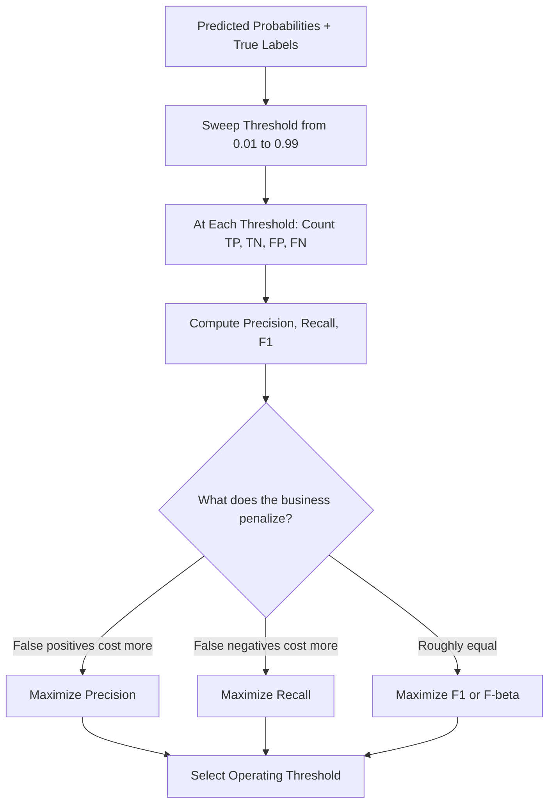

# Model Evaluation

## Learning Objectives

1. Compute precision, recall, F1, and ROC-AUC from raw prediction counts using a confusion matrix
2. Sweep classification thresholds to locate the operating point that optimizes a chosen business cost function
3. Compare threshold-dependent and threshold-independent metrics to select the appropriate evaluation frame for a given task
4. Evaluate LLM-generated text using reference-based scoring (ROUGE-L) and rubric-based LLM-as-judge scoring
5. Detect and diagnose evaluation failure modes including class imbalance, default-threshold misuse, label leakage, and judge-model bias

## The Problem

You deployed a lead-scoring model. Precision is 92%. Your SDR team says the leads are garbage. The metric did not lie — you measured the wrong thing.

Here is what probably happened. You computed precision at a threshold of 0.5, on a test set built from a random split instead of a time-based split. The 92% was correct on that specific dataset, at that specific threshold, under those specific conditions. None of those conditions held in production. The base rate of real opportunities in your live traffic was different from your test set. The model's score distribution drifted after deployment. Your SDRs were working the top 20 leads per day, not all leads above 0.5 — so the effective threshold was different. The metric was mathematically correct. The measurement frame was wrong.

Model evaluation is not about finding the "best" metric. It is about constructing an evaluation frame that matches how the model will actually be used, then picking metrics that penalize the errors that cost the most. A lead scoring model where a false positive wastes 30 minutes of SDR time and a false negative loses a $50K deal has a cost asymmetry that should drive every evaluation decision. If you optimize accuracy, you get a number that looks defensible in a dashboard and loses money in the field.

## The Concept

### The Confusion Matrix and Derived Metrics

Every binary classifier produces four counts at a given threshold: true positives (TP), true negatives (TN), false positives (FP), and false negatives (FN). These four numbers are the raw material for everything else.

From those four counts, the derived metrics are arithmetic:

**Precision** = TP / (TP + FP). Of everything flagged positive, how much was actually positive. This is the "when the model says yes, is it right?" metric.

**Recall** = TP / (TP + FN). Of everything actually positive, how much did the model catch. This is the "of all the real opportunities, how many did we miss?" metric.

**F1** = 2 × (Precision × Recall) / (Precision + Recall). The harmonic mean. Arithmetic mean lets a model with 100% recall and 10% precision average to 55%. Harmonic mean gives you 18%. The harmonic mean punishes you when either side collapses.

**Accuracy** = (TP + TN) / (TP + TN + FP + FN). Almost never what you want. If 95% of your leads never convert, a model that predicts "no" every time gets 95% accuracy and catches zero deals.

The failure mode here is class imbalance. In lead scoring, the positive class (leads that close) might be 2-5% of your data. Accuracy becomes a trap. A model that predicts "won't close" for every lead achieves 95-98% accuracy. Precision and recall expose the model's actual usefulness because they condition on the class you care about.

### Threshold-Dependent vs Threshold-Independent Evaluation

Precision, recall, and F1 are threshold-dependent. You pick a threshold (the default is 0.5, which is almost always wrong), convert probabilities to binary labels, then compute the metric. Change the threshold and every number changes. This means a single precision/recall report is a snapshot of one operating point — it tells you nothing about the model's behavior across the full range of possible thresholds.

ROC-AUC solves this by being threshold-independent. It sweeps the threshold from 0 to 1, computing the true positive rate (TPR = recall) and false positive rate (FPR = FP / (FP + TN)) at each point. The area under the resulting curve measures how well the model separates the two classes across all thresholds. AUC of 0.5 means the model is guessing randomly. AUC of 1.0 means perfect separation — there exists a threshold that produces zero false positives and zero false negatives.

You need both during development. AUC tells you whether the model has discriminative power at all — whether its score rankings are better than random. Threshold-dependent metrics tell you how it performs at the specific operating point you will deploy. A model with AUC 0.88 might still have terrible precision at threshold 0.5 if the score distribution is skewed.

### Calibration

A separate question from discrimination: